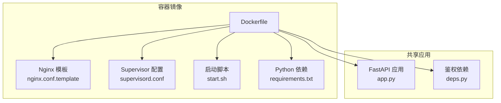
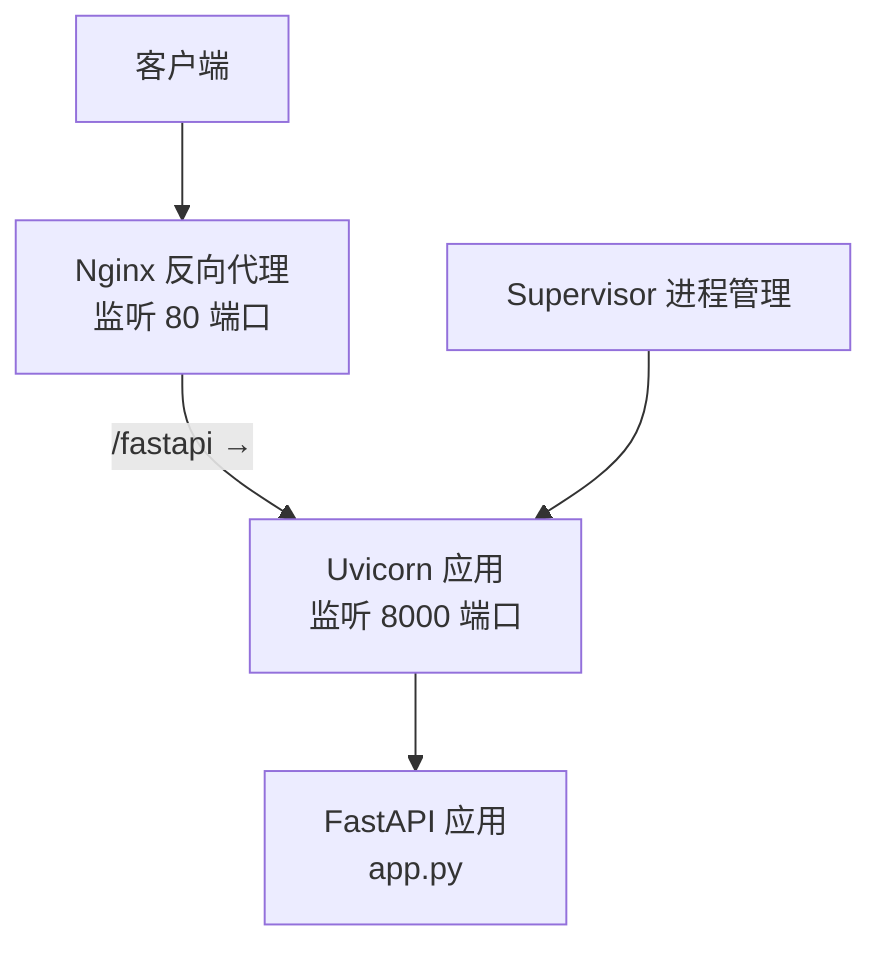
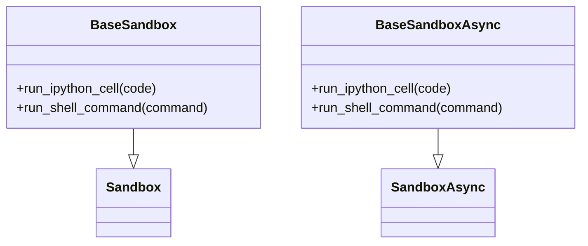
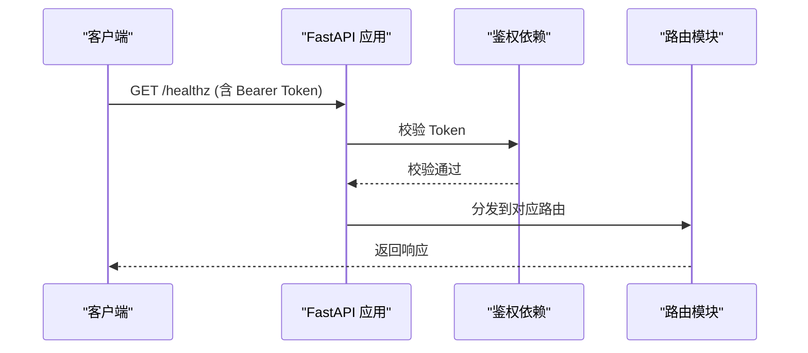
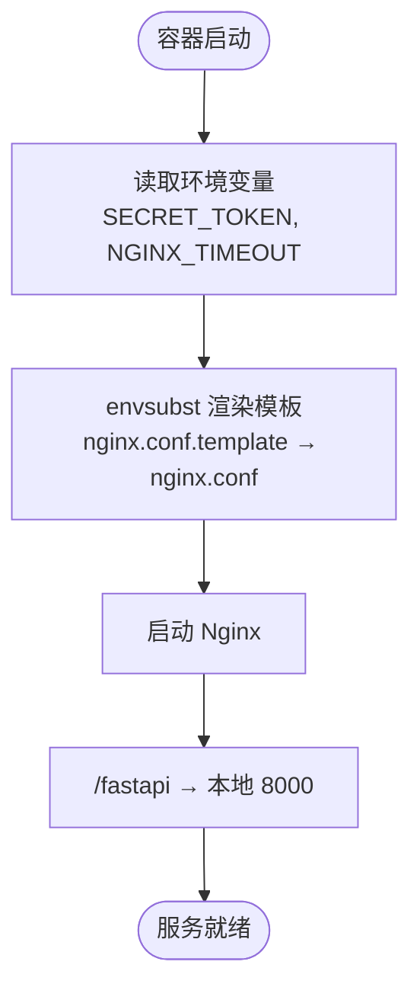
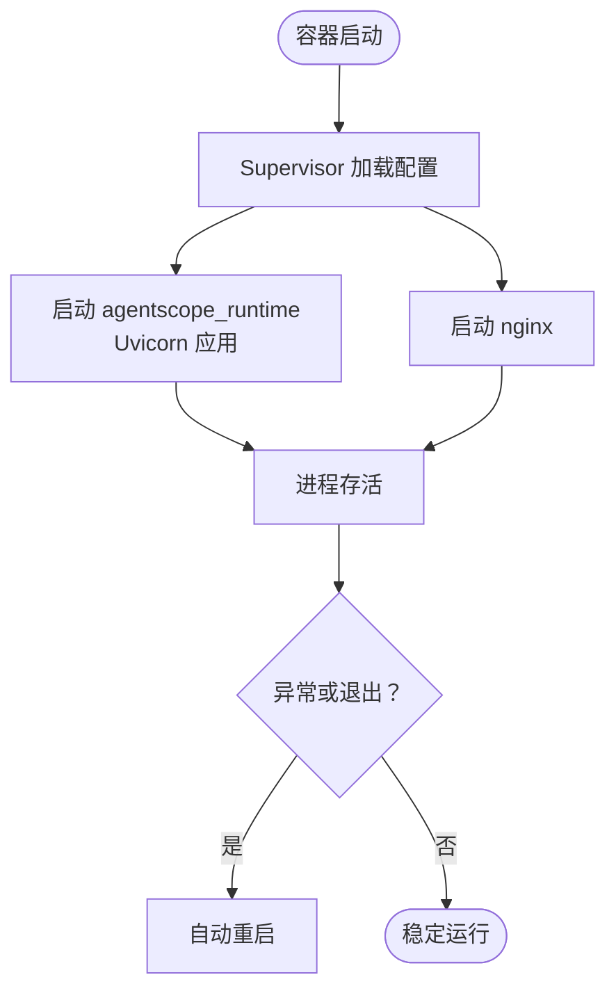
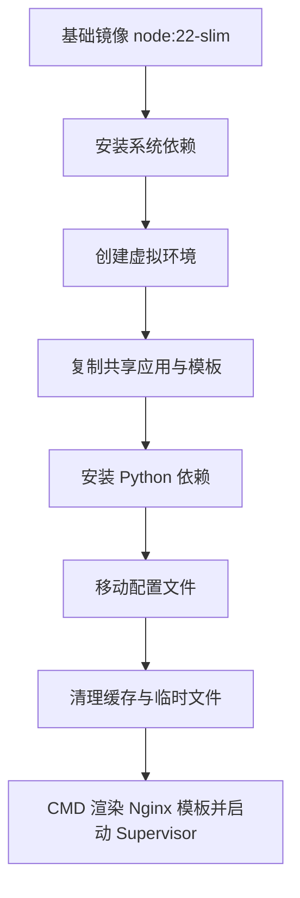
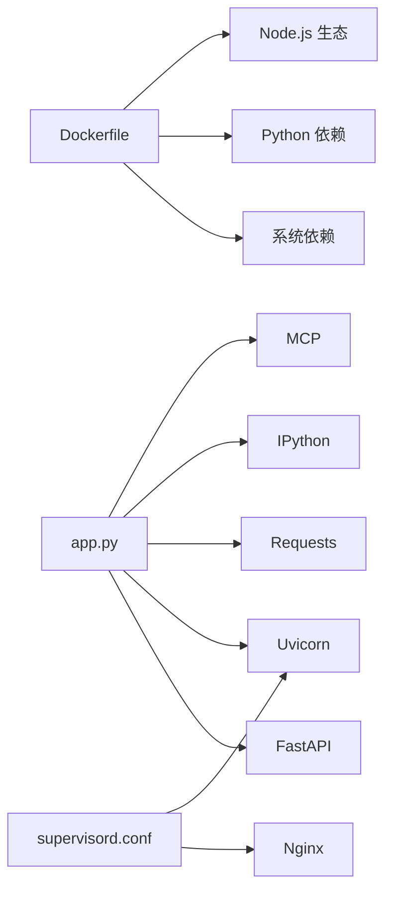

# 基础沙箱

<cite>
**本文引用的文件**
- [base_sandbox.py](file://src/agentscope_runtime/sandbox/box/base/base_sandbox.py)
- [Dockerfile](file://src/agentscope_runtime/sandbox/box/base/Dockerfile)
- [nginx.conf.template](file://src/agentscope_runtime/sandbox/box/base/box/config/nginx.conf.template)
- [supervisord.conf](file://src/agentscope_runtime/sandbox/box/base/box/config/supervisord.conf)
- [start.sh](file://src/agentscope_runtime/sandbox/box/base/box/scripts/start.sh)
- [app.py](file://src/agentscope_runtime/sandbox/box/shared/app.py)
- [requirements.txt（基础沙箱）](file://src/agentscope_runtime/sandbox/box/base/box/requirements.txt)
- [deps.py](file://src/agentscope_runtime/sandbox/box/shared/dependencies/deps.py)
- [mcp_server_configs.json（浏览器沙箱）](file://src/agentscope_runtime/sandbox/box/browser/box/mcp_server_configs.json)
- [mcp_server_configs.json（GUI 沙箱）](file://src/agentscope_runtime/sandbox/box/gui/box/mcp_server_configs.json)
- [mcp_server_configs.json（移动端沙箱）](file://src/agentscope_runtime/sandbox/box/mobile/box/mcp_server_configs.json)
- [engine requirements.txt](file://src/agentscope_runtime/engine/requirements.txt)
</cite>

## 目录
1. [简介](#简介)
2. [项目结构](#项目结构)
3. [核心组件](#核心组件)
4. [架构总览](#架构总览)
5. [详细组件分析](#详细组件分析)
6. [依赖分析](#依赖分析)
7. [性能考虑](#性能考虑)
8. [故障排除指南](#故障排除指南)
9. [结论](#结论)
10. [附录](#附录)

## 简介
基础沙箱是 AgentScope 运行时提供的通用运行与开发环境沙箱，面向需要在受控容器中执行 Python 代码、运行 Shell 命令、通过 Nginx 反向代理访问 FastAPI 服务，并由 Supervisor 统一管理进程的场景。它内置了 Node.js 运行时、Python 虚拟环境、IPython、FastAPI、Uvicorn、Nginx 和 Supervisor，并通过 Nginx 将外部请求转发到本地 8000 端口的 FastAPI 应用。

## 项目结构
基础沙箱的实现采用“共享应用 + 模板化配置 + 容器镜像构建”的方式组织：
- 共享应用层：位于 shared 目录，包含 FastAPI 应用入口、路由模块与依赖校验。
- 配置模板层：位于 base/box/config，包含 Nginx 模板与 Supervisor 配置。
- 启动脚本层：位于 base/box/scripts，提供 Uvicorn 启动与守护逻辑。
- 容器构建层：位于 base/Dockerfile，负责安装系统依赖、复制共享应用与模板、安装 Python 依赖并设置 CMD。
- 运行时工具层：位于 base_sandbox.py，封装对沙箱内工具的调用接口。

图表来源
- [Dockerfile:1-51](file://src/agentscope_runtime/sandbox/box/base/Dockerfile#L1-L51)
- [nginx.conf.template:1-19](file://src/agentscope_runtime/sandbox/box/base/box/config/nginx.conf.template#L1-L19)
- [supervisord.conf:1-19](file://src/agentscope_runtime/sandbox/box/base/box/config/supervisord.conf#L1-L19)
- [start.sh:1-5](file://src/agentscope_runtime/sandbox/box/base/box/scripts/start.sh#L1-L5)
- [requirements.txt（基础沙箱）:1-9](file://src/agentscope_runtime/sandbox/box/base/box/requirements.txt#L1-L9)
- [app.py:1-46](file://src/agentscope_runtime/sandbox/box/shared/app.py#L1-L46)
- [deps.py:1-23](file://src/agentscope_runtime/sandbox/box/shared/dependencies/deps.py#L1-L23)

章节来源
- [Dockerfile:1-51](file://src/agentscope_runtime/sandbox/box/base/Dockerfile#L1-L51)
- [base_sandbox.py:11-17](file://src/agentscope_runtime/sandbox/box/base/base_sandbox.py#L11-L17)
- [base_sandbox.py:54-60](file://src/agentscope_runtime/sandbox/box/base/base_sandbox.py#L54-L60)

## 核心组件
- 基础沙箱类与异步沙箱类：注册到沙箱注册表，提供运行 IPython 单元格与 Shell 命令的工具调用接口。
- 共享 FastAPI 应用：统一暴露健康检查与多路由模块，并通过依赖校验强制 Bearer Token。
- Nginx 反向代理：将 /fastapi 前缀请求转发至本地 8000 端口的 FastAPI 应用。
- Supervisor 进程管理：同时托管应用进程与 Nginx，自动重启与日志输出。
- 启动脚本：以后台方式启动 Uvicorn 并等待进程生命周期。

章节来源
- [base_sandbox.py:18-52](file://src/agentscope_runtime/sandbox/box/base/base_sandbox.py#L18-L52)
- [base_sandbox.py:61-102](file://src/agentscope_runtime/sandbox/box/base/base_sandbox.py#L61-L102)
- [app.py:16-41](file://src/agentscope_runtime/sandbox/box/shared/app.py#L16-L41)
- [nginx.conf.template:10-18](file://src/agentscope_runtime/sandbox/box/base/box/config/nginx.conf.template#L10-L18)
- [supervisord.conf:7-19](file://src/agentscope_runtime/sandbox/box/base/box/config/supervisord.conf#L7-L19)
- [start.sh:3-4](file://src/agentscope_runtime/sandbox/box/base/box/scripts/start.sh#L3-L4)

## 架构总览
基础沙箱的运行时架构由容器内的三个关键进程组成：Nginx、Supervisor 与 Uvicorn。Nginx 作为反向代理监听 80 端口，将 /fastapi 前缀的请求转发到本地 8000 端口；Supervisor 负责启动并守护 Uvicorn 应用进程；应用通过 Bearer Token 鉴权后对外提供服务。

图表来源
- [nginx.conf.template:10-18](file://src/agentscope_runtime/sandbox/box/base/box/config/nginx.conf.template#L10-L18)
- [supervisord.conf:7-19](file://src/agentscope_runtime/sandbox/box/base/box/config/supervisord.conf#L7-L19)
- [start.sh:3-4](file://src/agentscope_runtime/sandbox/box/base/box/scripts/start.sh#L3-L4)
- [app.py:16-41](file://src/agentscope_runtime/sandbox/box/shared/app.py#L16-L41)

## 详细组件分析

### 基础沙箱类与异步沙箱类
- 注册信息：通过注册表注册镜像 URI、类型（同步/异步）、安全等级、超时与描述。
- 工具调用：提供运行 IPython 单元格与 Shell 命令的工具方法，内部委托给基类的工具调用接口。

图表来源
- [base_sandbox.py:18-33](file://src/agentscope_runtime/sandbox/box/base/base_sandbox.py#L18-L33)
- [base_sandbox.py:61-76](file://src/agentscope_runtime/sandbox/box/base/base_sandbox.py#L61-L76)

章节来源
- [base_sandbox.py:11-17](file://src/agentscope_runtime/sandbox/box/base/base_sandbox.py#L11-L17)
- [base_sandbox.py:54-60](file://src/agentscope_runtime/sandbox/box/base/base_sandbox.py#L54-L60)

### 共享 FastAPI 应用与路由
- 应用初始化：定义标题、版本与描述，注册健康检查端点与多个路由模块。
- 鉴权依赖：通过依赖函数校验 Bearer Token，未通过则返回 403。
- 路由模块：包括通用路由、MCP 路由、工作区路由等，均需携带有效 Token。

图表来源
- [app.py:24-40](file://src/agentscope_runtime/sandbox/box/shared/app.py#L24-L40)
- [deps.py:10-22](file://src/agentscope_runtime/sandbox/box/shared/dependencies/deps.py#L10-L22)

章节来源
- [app.py:16-41](file://src/agentscope_runtime/sandbox/box/shared/app.py#L16-L41)
- [deps.py:7-23](file://src/agentscope_runtime/sandbox/box/shared/dependencies/deps.py#L7-L23)

### Nginx 反向代理配置
- 监听 80 端口，将 /fastapi 前缀重写后转发到本地 8000 端口。
- 使用环境变量 NGINX_TIMEOUT 控制连接、发送与读取超时。
- 通过模板与 envsubst 在容器启动时生成最终配置。

图表来源
- [Dockerfile:33-35](file://src/agentscope_runtime/sandbox/box/base/Dockerfile#L33-L35)
- [Dockerfile:50](file://src/agentscope_runtime/sandbox/box/base/Dockerfile#L50)
- [nginx.conf.template:6-8](file://src/agentscope_runtime/sandbox/box/base/box/config/nginx.conf.template#L6-L8)
- [nginx.conf.template:13-17](file://src/agentscope_runtime/sandbox/box/base/box/config/nginx.conf.template#L13-L17)

章节来源
- [nginx.conf.template:1-19](file://src/agentscope_runtime/sandbox/box/base/box/config/nginx.conf.template#L1-L19)
- [Dockerfile:33-50](file://src/agentscope_runtime/sandbox/box/base/Dockerfile#L33-L50)

### Supervisor 进程管理
- 管理两个程序：agentscope_runtime（启动脚本）与 nginx。
- 自动启动与自动重启，错误与标准输出日志分别落盘。
- 通过 CMD 中的 envsubst 与 supervisord.conf 的路径映射完成配置注入。

图表来源
- [supervisord.conf:1-19](file://src/agentscope_runtime/sandbox/box/base/box/config/supervisord.conf#L1-L19)
- [start.sh:3-4](file://src/agentscope_runtime/sandbox/box/base/box/scripts/start.sh#L3-L4)
- [Dockerfile:34-35](file://src/agentscope_runtime/sandbox/box/base/Dockerfile#L34-L35)

章节来源
- [supervisord.conf:1-19](file://src/agentscope_runtime/sandbox/box/base/box/config/supervisord.conf#L1-L19)
- [Dockerfile:34-35](file://src/agentscope_runtime/sandbox/box/base/Dockerfile#L34-L35)

### 启动脚本机制
- 以后台方式启动 Uvicorn 应用，绑定 0.0.0.0:8000。
- wait 保证主进程存活，Supervisor 可正确接管与监控。

章节来源
- [start.sh:1-5](file://src/agentscope_runtime/sandbox/box/base/box/scripts/start.sh#L1-L5)

### 容器镜像构建流程
- 基于 Node.js 22 slim 镜像，安装系统依赖（curl、python3、pip、venv、build-essential、libssl-dev、git、supervisor、vim、nginx、gettext-base）。
- 创建 Python 虚拟环境并安装 requirements.txt。
- 复制共享应用与模板，移动配置文件，清理缓存与临时文件。
- CMD 中渲染 Nginx 配置并启动 Supervisor。

图表来源
- [Dockerfile:9-21](file://src/agentscope_runtime/sandbox/box/base/Dockerfile#L9-L21)
- [Dockerfile:23-31](file://src/agentscope_runtime/sandbox/box/base/Dockerfile#L23-L31)
- [Dockerfile:34-48](file://src/agentscope_runtime/sandbox/box/base/Dockerfile#L34-L48)
- [Dockerfile:50](file://src/agentscope_runtime/sandbox/box/base/Dockerfile#L50)

章节来源
- [Dockerfile:1-51](file://src/agentscope_runtime/sandbox/box/base/Dockerfile#L1-L51)

### Python 依赖与 MCP 配置（对比参考）
- 基础沙箱依赖：IPython、FastAPI、Uvicorn、Pydantic、Requests、MCP、aiofiles、uv、GitPython。
- 其他沙箱类型（浏览器/GUI/移动端）包含各自的 MCP 服务器配置示例，用于演示如何扩展沙箱能力。

章节来源
- [requirements.txt（基础沙箱）:1-9](file://src/agentscope_runtime/sandbox/box/base/box/requirements.txt#L1-L9)
- [mcp_server_configs.json（浏览器沙箱）:1-14](file://src/agentscope_runtime/sandbox/box/browser/box/mcp_server_configs.json#L1-L14)
- [mcp_server_configs.json（GUI 沙箱）:1-11](file://src/agentscope_runtime/sandbox/box/gui/box/mcp_server_configs.json#L1-L11)
- [mcp_server_configs.json（移动端沙箱）:1-10](file://src/agentscope_runtime/sandbox/box/mobile/box/mcp_server_configs.json#L1-L10)

## 依赖分析
- 容器镜像依赖：系统包、Python 依赖、Node.js 生态（用于 MCP 示例与模板渲染）。
- 应用依赖：FastAPI、Uvicorn、Pydantic、Requests、IPython、MCP、aiofiles、uv、GitPython。
- 运行时依赖：Supervisor、Nginx、envsubst、Uvicorn。

图表来源
- [Dockerfile:9-21](file://src/agentscope_runtime/sandbox/box/base/Dockerfile#L9-L21)
- [requirements.txt（基础沙箱）:1-9](file://src/agentscope_runtime/sandbox/box/base/box/requirements.txt#L1-L9)
- [app.py:4-11](file://src/agentscope_runtime/sandbox/box/shared/app.py#L4-L11)
- [supervisord.conf:7-19](file://src/agentscope_runtime/sandbox/box/base/box/config/supervisord.conf#L7-L19)

章节来源
- [requirements.txt（基础沙箱）:1-9](file://src/agentscope_runtime/sandbox/box/base/box/requirements.txt#L1-L9)
- [engine requirements.txt:1-1](file://src/agentscope_runtime/engine/requirements.txt#L1-L1)

## 性能考虑
- 连接超时：通过 NGINX_TIMEOUT 控制代理连接、发送与读取超时，避免长尾请求占用资源。
- 进程模型：Uvicorn 默认单 worker，适合轻量沙箱；如需并发可调整 workers 数量（需评估内存与 CPU）。
- 缓存清理：构建阶段清理 pip、apt、npm 缓存与临时目录，减小镜像体积并提升构建速度。
- 日志轮转：Supervisor 对应用与 Nginx 输出日志进行落盘，建议结合宿主侧日志策略进行轮转与归档。

## 故障排除指南
- 访问被拒绝（403）：确认请求头 Authorization 是否为 Bearer Token，且 Token 与 SECRET_TOKEN 一致。
- 代理无响应：检查 /fastapi 前缀是否正确，确认 Nginx 配置已由 envsubst 渲染，Supervisor 正常运行。
- 应用未启动：查看 agentscope_runtime 日志输出，确认 Uvicorn 已在 8000 端口监听。
- 超时问题：适当增大 NGINX_TIMEOUT，确保代理层与应用层的超时设置匹配。
- 权限问题：确认容器内用户权限与日志目录写入权限。

章节来源
- [deps.py:10-22](file://src/agentscope_runtime/sandbox/box/shared/dependencies/deps.py#L10-L22)
- [nginx.conf.template:6-8](file://src/agentscope_runtime/sandbox/box/base/box/config/nginx.conf.template#L6-L8)
- [supervisord.conf:11-12](file://src/agentscope_runtime/sandbox/box/base/box/config/supervisord.conf#L11-L12)
- [start.sh:3-4](file://src/agentscope_runtime/sandbox/box/base/box/scripts/start.sh#L3-L4)

## 结论
基础沙箱通过容器化的方式提供了统一的运行环境与安全边界，结合 Nginx 反向代理与 Supervisor 进程管理，实现了稳定的 API 服务能力。其设计强调最小可用性与可扩展性，既满足日常开发与调试需求，也为后续集成更复杂的 MCP 或 GUI 能力预留了空间。

## 附录

### 部署步骤（概要）
- 构建镜像：基于 base/Dockerfile 构建，确保 requirements.txt 与共享应用已准备就绪。
- 设置环境变量：SECRET_TOKEN（默认值可在模板中覆盖），NGINX_TIMEOUT（秒）。
- 启动容器：挂载工作目录（如需持久化），开放 80 端口。
- 访问服务：通过 /fastapi 前缀访问本地 8000 端口的 FastAPI 应用，携带 Bearer Token。

章节来源
- [Dockerfile:33-50](file://src/agentscope_runtime/sandbox/box/base/Dockerfile#L33-L50)
- [nginx.conf.template:10-18](file://src/agentscope_runtime/sandbox/box/base/box/config/nginx.conf.template#L10-L18)
- [supervisord.conf:7-19](file://src/agentscope_runtime/sandbox/box/base/box/config/supervisord.conf#L7-L19)

### 配置示例（要点）
- Bearer Token：通过 SECRET_TOKEN 环境变量控制，默认值见依赖模块。
- NGINX 超时：通过 NGINX_TIMEOUT 环境变量控制代理层超时。
- 路由前缀：/fastapi → 本地 8000，便于与宿主其他服务共存。

章节来源
- [deps.py:7](file://src/agentscope_runtime/sandbox/box/shared/dependencies/deps.py#L7)
- [nginx.conf.template:6-8](file://src/agentscope_runtime/sandbox/box/base/box/config/nginx.conf.template#L6-L8)
- [nginx.conf.template:13-17](file://src/agentscope_runtime/sandbox/box/base/box/config/nginx.conf.template#L13-L17)

### 安全配置最佳实践
- 强制 Bearer Token：所有路由均依赖鉴权，避免未授权访问。
- 最小权限原则：容器内以 root 启动，但仅暴露必要端口与目录。
- 环境隔离：通过独立容器与网络命名空间隔离不同沙箱实例。
- 日志审计：启用 Supervisor 日志并定期审计，定位异常行为。

章节来源
- [app.py:24-40](file://src/agentscope_runtime/sandbox/box/shared/app.py#L24-L40)
- [deps.py:10-22](file://src/agentscope_runtime/sandbox/box/shared/dependencies/deps.py#L10-L22)
- [supervisord.conf:1-19](file://src/agentscope_runtime/sandbox/box/base/box/config/supervisord.conf#L1-L19)