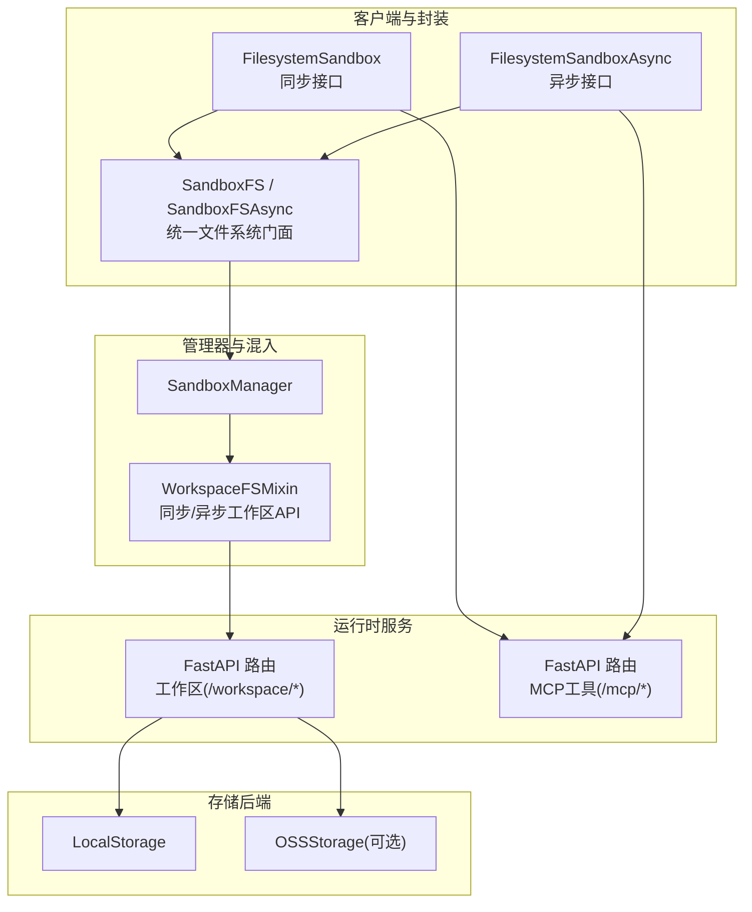
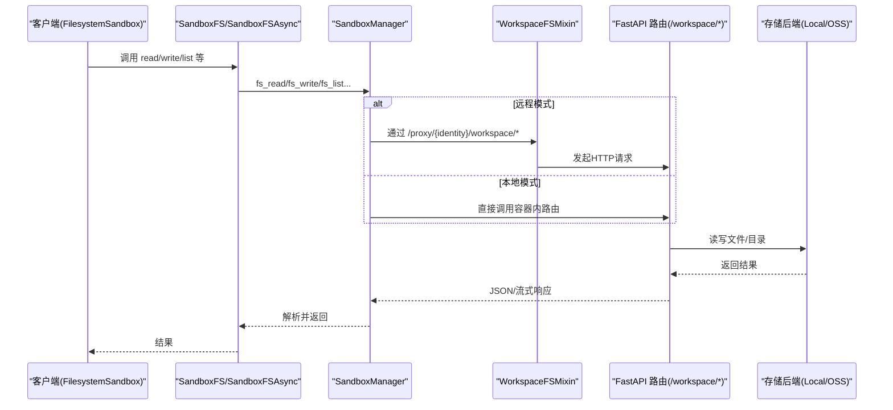
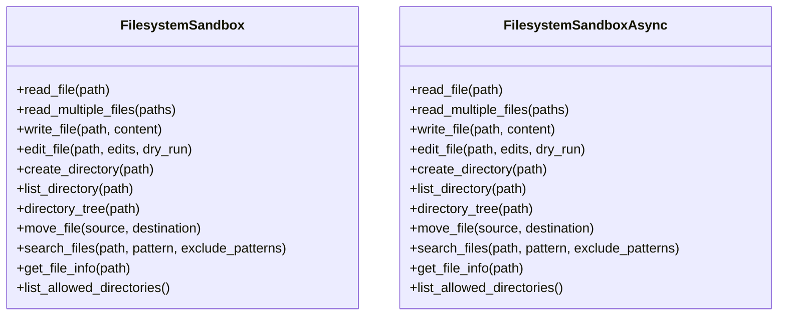
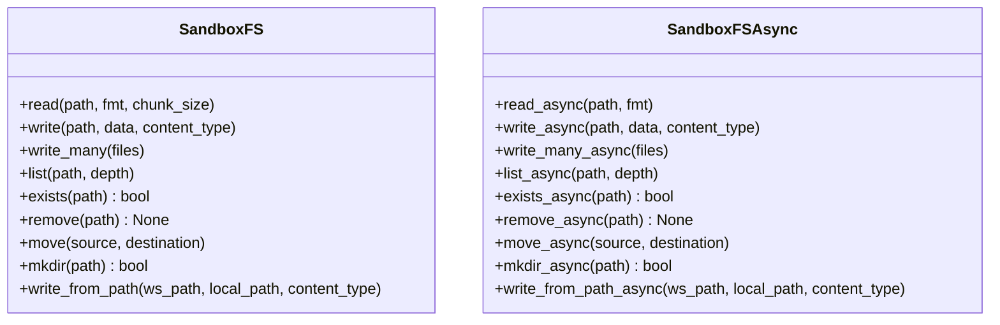
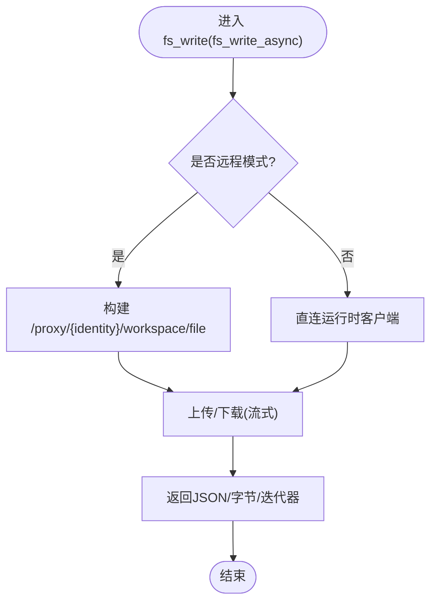
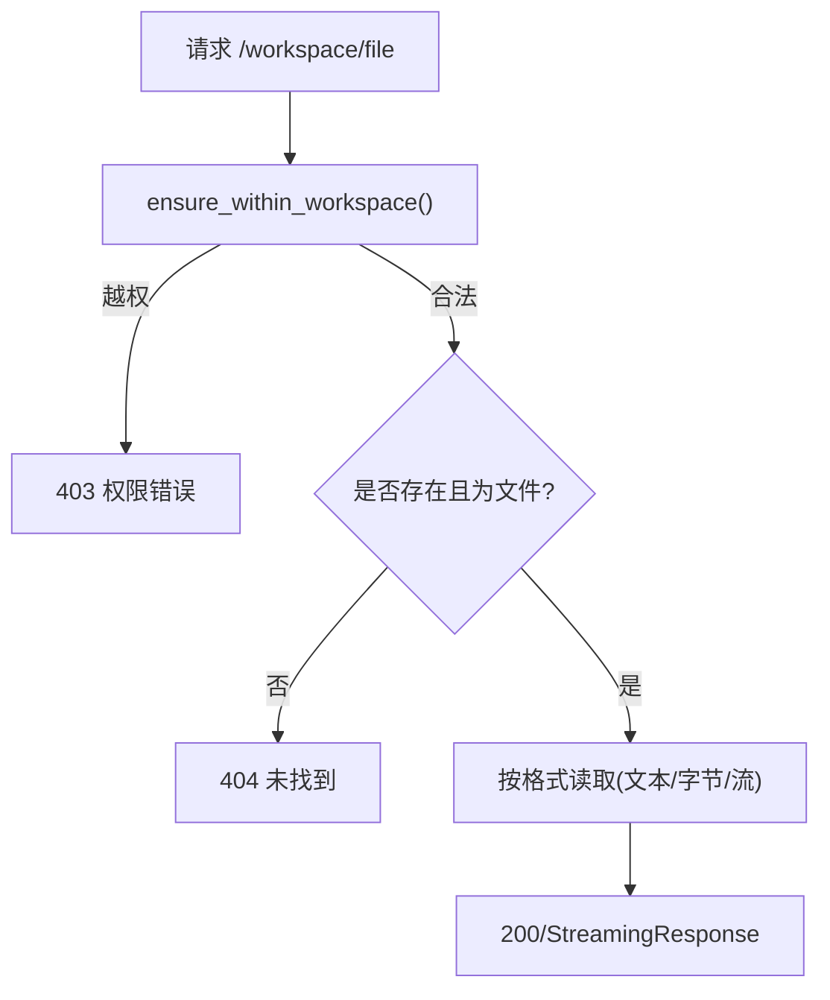
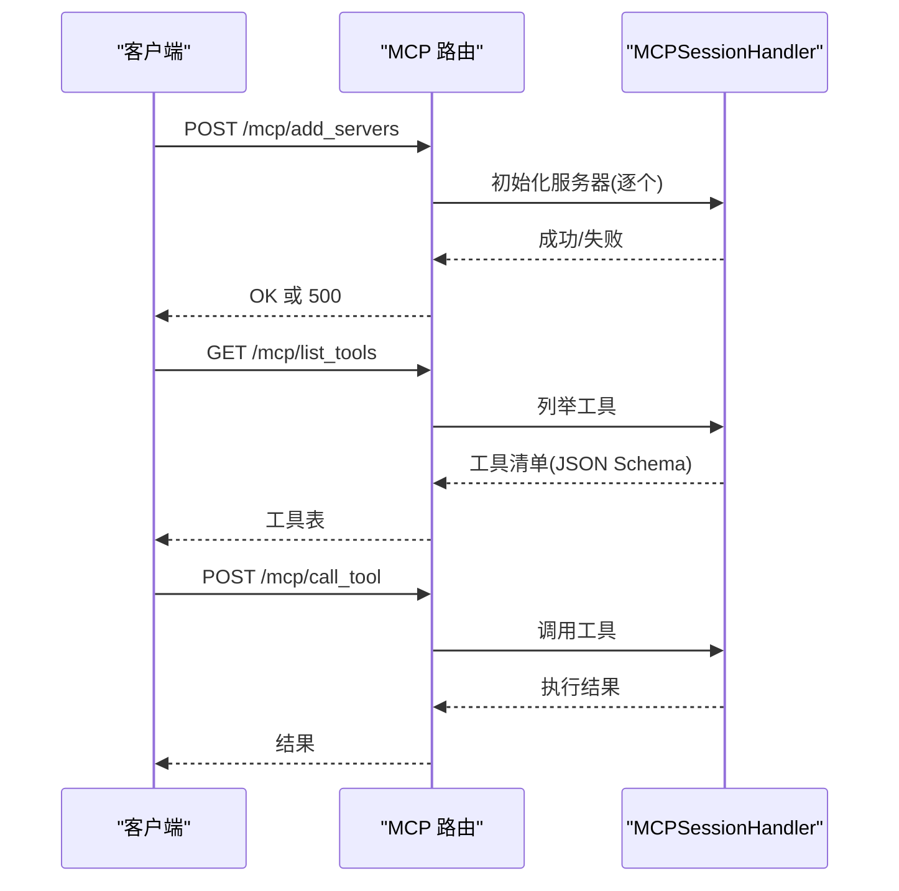
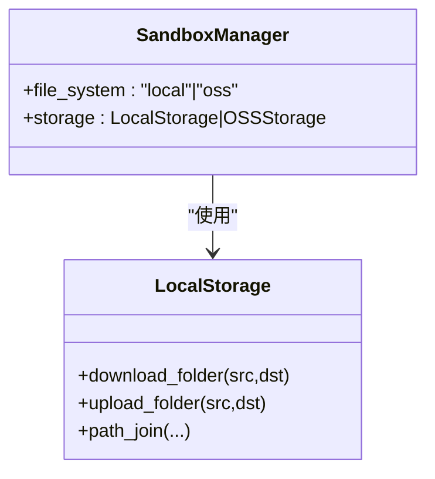
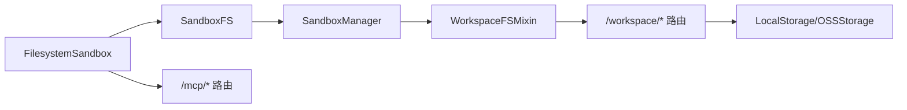

# 文件系统沙箱

<cite>
**本文引用的文件**
- [filesystem_sandbox.py](file://src/agentscope_runtime/sandbox/box/filesystem/filesystem_sandbox.py)
- [fs.py](file://src/agentscope_runtime/sandbox/box/components/fs.py)
- [workspace.py](file://src/agentscope_runtime/sandbox/box/shared/routers/workspace.py)
- [mcp.py](file://src/agentscope_runtime/sandbox/box/shared/routers/mcp.py)
- [workspace_mixin.py](file://src/agentscope_runtime/sandbox/manager/workspace_mixin.py)
- [sandbox_manager.py](file://src/agentscope_runtime/sandbox/manager/sandbox_manager.py)
- [base_sandbox.py](file://src/agentscope_runtime/sandbox/box/base/base_sandbox.py)
- [local_storage.py](file://src/agentscope_runtime/sandbox/manager/storage/local_storage.py)
</cite>

## 目录
1. [简介](#简介)
2. [项目结构](#项目结构)
3. [核心组件](#核心组件)
4. [架构总览](#架构总览)
5. [详细组件分析](#详细组件分析)
6. [依赖分析](#依赖分析)
7. [性能考虑](#性能考虑)
8. [故障排查指南](#故障排查指南)
9. [结论](#结论)
10. [附录](#附录)

## 简介
本技术文档围绕“文件系统沙箱”展开，系统性阐述其文件操作能力、MCP 协议集成、权限与安全控制、挂载与存储卷配置、数据持久化策略、文件监控与变更通知、批量操作、以及配置项、性能优化与安全策略。文档同时提供典型使用场景（文件处理、备份与同步）与常见问题（权限、磁盘空间、并发访问）的解决方案。

## 项目结构
文件系统沙箱由“客户端封装层 + 管理器工作区混入 + 运行时工作区路由 + MCP 工具路由 + 存储后端”构成，支持同步与异步两种调用方式，并在本地模式与远程模式之间自动切换。

**图示来源**
- [filesystem_sandbox.py:20-254](file://src/agentscope_runtime/sandbox/box/filesystem/filesystem_sandbox.py#L20-L254)
- [fs.py:17-279](file://src/agentscope_runtime/sandbox/box/components/fs.py#L17-L279)
- [workspace_mixin.py:113-702](file://src/agentscope_runtime/sandbox/manager/workspace_mixin.py#L113-L702)
- [workspace.py:197-394](file://src/agentscope_runtime/sandbox/box/shared/routers/workspace.py#L197-L394)
- [mcp.py:24-208](file://src/agentscope_runtime/sandbox/box/shared/routers/mcp.py#L24-L208)
- [local_storage.py:8-45](file://src/agentscope_runtime/sandbox/manager/storage/local_storage.py#L8-L45)

**章节来源**
- [filesystem_sandbox.py:13-19](file://src/agentscope_runtime/sandbox/box/filesystem/filesystem_sandbox.py#L13-L19)
- [fs.py:17-279](file://src/agentscope_runtime/sandbox/box/components/fs.py#L17-L279)
- [workspace_mixin.py:113-702](file://src/agentscope_runtime/sandbox/manager/workspace_mixin.py#L113-L702)
- [workspace.py:25-47](file://src/agentscope_runtime/sandbox/box/shared/routers/workspace.py#L25-L47)
- [mcp.py:24-208](file://src/agentscope_runtime/sandbox/box/shared/routers/mcp.py#L24-L208)
- [local_storage.py:8-45](file://src/agentscope_runtime/sandbox/manager/storage/local_storage.py#L8-L45)

## 核心组件
- 文件系统沙箱封装：提供同步与异步两类 API，覆盖读写、批量上传、目录管理、移动重命名、搜索、信息查询与允许目录列表等。
- 文件系统门面：对上屏蔽底层差异，统一对接管理器的工作区 API。
- 管理器工作区混入：在本地/远程模式下自动选择直连或代理流式传输，提供同步与异步工作区文件系统 API。
- 运行时工作区路由：基于 FastAPI 的 /workspace/* 路由，实现文件读写、批量上传、目录遍历、存在性检查、删除、移动、创建目录等。
- MCP 工具路由：提供 MCP 服务器注册、工具列举与调用，用于扩展文件系统相关工具链。
- 存储后端：支持本地存储与对象存储（OSS），用于数据持久化与跨环境迁移。

**章节来源**
- [filesystem_sandbox.py:37-156](file://src/agentscope_runtime/sandbox/box/filesystem/filesystem_sandbox.py#L37-L156)
- [fs.py:38-136](file://src/agentscope_runtime/sandbox/box/components/fs.py#L38-L136)
- [workspace_mixin.py:137-403](file://src/agentscope_runtime/sandbox/manager/workspace_mixin.py#L137-L403)
- [workspace.py:197-394](file://src/agentscope_runtime/sandbox/box/shared/routers/workspace.py#L197-L394)
- [mcp.py:24-208](file://src/agentscope_runtime/sandbox/box/shared/routers/mcp.py#L24-L208)
- [local_storage.py:8-45](file://src/agentscope_runtime/sandbox/manager/storage/local_storage.py#L8-L45)

## 架构总览
文件系统沙箱通过“客户端 → 管理器 → 运行时路由”的链路完成文件操作；在远程模式下，管理器通过 /proxy/{identity}/workspace/* 代理到运行时容器；在本地模式下，直接连接运行时客户端执行。

**图示来源**
- [fs.py:38-136](file://src/agentscope_runtime/sandbox/box/components/fs.py#L38-L136)
- [workspace_mixin.py:137-403](file://src/agentscope_runtime/sandbox/manager/workspace_mixin.py#L137-L403)
- [workspace.py:197-394](file://src/agentscope_runtime/sandbox/box/shared/routers/workspace.py#L197-L394)

## 详细组件分析

### 文件系统沙箱封装（同步与异步）
- 同步封装：FilesystemSandbox 提供 read_file、write_file、edit_file、create_directory、list_directory、directory_tree、move_file、search_files、get_file_info、list_allowed_directories 等方法，均通过工具调用转发至运行时。
- 异步封装：FilesystemSandboxAsync 提供对应的异步版本，内部使用异步工具调用。

**图示来源**
- [filesystem_sandbox.py:20-254](file://src/agentscope_runtime/sandbox/box/filesystem/filesystem_sandbox.py#L20-L254)

**章节来源**
- [filesystem_sandbox.py:37-156](file://src/agentscope_runtime/sandbox/box/filesystem/filesystem_sandbox.py#L37-L156)
- [filesystem_sandbox.py:159-254](file://src/agentscope_runtime/sandbox/box/filesystem/filesystem_sandbox.py#L159-L254)

### 文件系统门面（统一 API）
- SandboxFS/SandboxFSAsync 对外暴露统一的读写、批量上传、目录操作、移动、创建目录、从本地路径写入等功能，内部委托给管理器的工作区 API。
- 支持文本、字节与流式读取/上传，异步版本提供异步迭代器。

**图示来源**
- [fs.py:17-279](file://src/agentscope_runtime/sandbox/box/components/fs.py#L17-L279)

**章节来源**
- [fs.py:38-136](file://src/agentscope_runtime/sandbox/box/components/fs.py#L38-L136)
- [fs.py:159-279](file://src/agentscope_runtime/sandbox/box/components/fs.py#L159-L279)

### 管理器工作区混入（本地/远程自适应）
- WorkspaceFSMixin 在本地模式下直连运行时客户端，在远程模式下通过 /proxy/{identity}/workspace/* 代理。
- 提供同步与异步工作区 API，包括 fs_read、fs_write、fs_write_many、fs_list、fs_exists、fs_remove、fs_move、fs_mkdir、fs_write_from_path 等。
- 异步版本使用 httpx 流式上传/下载，避免阻塞事件循环。

**图示来源**
- [workspace_mixin.py:137-403](file://src/agentscope_runtime/sandbox/manager/workspace_mixin.py#L137-L403)
- [workspace_mixin.py:443-698](file://src/agentscope_runtime/sandbox/manager/workspace_mixin.py#L443-L698)

**章节来源**
- [workspace_mixin.py:137-403](file://src/agentscope_runtime/sandbox/manager/workspace_mixin.py#L137-L403)
- [workspace_mixin.py:443-698](file://src/agentscope_runtime/sandbox/manager/workspace_mixin.py#L443-L698)

### 运行时工作区路由（权限与安全）
- 基于 WORKSPACE_DIR 的路径限制，默认根目录为 /workspace，所有路径必须位于该目录内，否则返回 403。
- 支持文本/字节读取、流式下载、批量上传、目录遍历、存在性检查、删除（含递归）、移动/重命名、创建目录等。
- 使用线程池避免阻塞事件循环，如文件读写、目录扫描等。

**图示来源**
- [workspace.py:29-47](file://src/agentscope_runtime/sandbox/box/shared/routers/workspace.py#L29-L47)
- [workspace.py:197-234](file://src/agentscope_runtime/sandbox/box/shared/routers/workspace.py#L197-L234)

**章节来源**
- [workspace.py:29-47](file://src/agentscope_runtime/sandbox/box/shared/routers/workspace.py#L29-L47)
- [workspace.py:197-394](file://src/agentscope_runtime/sandbox/box/shared/routers/workspace.py#L197-L394)

### MCP 工具路由（扩展与工具调用）
- /mcp/add_servers：加载并初始化 MCP 服务器，支持覆盖策略。
- /mcp/list_tools：枚举所有已注册服务器的工具，生成 JSON Schema。
- /mcp/call_tool：调用指定工具，按名称匹配并执行。
- 支持启动/关闭事件清理资源。

**图示来源**
- [mcp.py:24-208](file://src/agentscope_runtime/sandbox/box/shared/routers/mcp.py#L24-L208)

**章节来源**
- [mcp.py:24-208](file://src/agentscope_runtime/sandbox/box/shared/routers/mcp.py#L24-L208)

### 存储后端与数据持久化
- LocalStorage：提供文件夹下载/上传、路径拼接等能力，适合本地持久化。
- SandboxManager 根据配置选择 LocalStorage 或 OSSStorage，支持 OSS 模式下的对象存储持久化。

**图示来源**
- [sandbox_manager.py:253-262](file://src/agentscope_runtime/sandbox/manager/sandbox_manager.py#L253-L262)
- [local_storage.py:8-45](file://src/agentscope_runtime/sandbox/manager/storage/local_storage.py#L8-L45)

**章节来源**
- [sandbox_manager.py:253-262](file://src/agentscope_runtime/sandbox/manager/sandbox_manager.py#L253-L262)
- [local_storage.py:8-45](file://src/agentscope_runtime/sandbox/manager/storage/local_storage.py#L8-L45)

## 依赖分析
- 客户端封装依赖管理器工作区混入；管理器在远程模式下依赖代理 URL；在本地模式下依赖运行时客户端。
- 运行时路由依赖存储后端（本地或 OSS）。
- MCP 路由依赖会话处理器进行工具注册与调用。

**图示来源**
- [filesystem_sandbox.py:20-254](file://src/agentscope_runtime/sandbox/box/filesystem/filesystem_sandbox.py#L20-L254)
- [fs.py:17-279](file://src/agentscope_runtime/sandbox/box/components/fs.py#L17-L279)
- [workspace_mixin.py:113-702](file://src/agentscope_runtime/sandbox/manager/workspace_mixin.py#L113-L702)
- [workspace.py:197-394](file://src/agentscope_runtime/sandbox/box/shared/routers/workspace.py#L197-L394)
- [mcp.py:24-208](file://src/agentscope_runtime/sandbox/box/shared/routers/mcp.py#L24-L208)

**章节来源**
- [filesystem_sandbox.py:20-254](file://src/agentscope_runtime/sandbox/box/filesystem/filesystem_sandbox.py#L20-L254)
- [fs.py:17-279](file://src/agentscope_runtime/sandbox/box/components/fs.py#L17-L279)
- [workspace_mixin.py:113-702](file://src/agentscope_runtime/sandbox/manager/workspace_mixin.py#L113-L702)
- [workspace.py:197-394](file://src/agentscope_runtime/sandbox/box/shared/routers/workspace.py#L197-L394)
- [mcp.py:24-208](file://src/agentscope_runtime/sandbox/box/shared/routers/mcp.py#L24-L208)

## 性能考虑
- 流式传输：远程模式下读取/上传采用流式，避免大文件一次性占用内存。
- 线程池解耦：运行时路由中使用线程池执行阻塞 I/O，避免阻塞事件循环。
- 批量上传：支持多文件批量写入，减少往返次数。
- 异步 API：异步版本使用 httpx 流式客户端，提升高并发吞吐。
- 缓存与池化：管理器支持容器池化与心跳扫描，降低冷启动成本。

[本节为通用性能建议，不直接分析具体文件]

## 故障排查指南
- 权限错误（403）：确保路径位于 WORKSPACE_DIR 内，避免相对路径穿越。
- 路径冲突（409）：目标路径已存在且类型不符时返回冲突，请先清理或更换路径。
- 未找到（404）：读取文件时若路径不存在或为目录，返回未找到。
- 远程模式认证：确认 base_url 与 Bearer Token 配置正确，网络可达。
- MCP 工具缺失：调用前先通过 /mcp/list_tools 确认工具名存在。
- 存储异常：OSS 模式下检查凭证与桶配置；本地模式检查磁盘空间与权限。

**章节来源**
- [workspace.py:41-45](file://src/agentscope_runtime/sandbox/box/shared/routers/workspace.py#L41-L45)
- [workspace.py:246-250](file://src/agentscope_runtime/sandbox/box/shared/routers/workspace.py#L246-L250)
- [workspace.py:204-205](file://src/agentscope_runtime/sandbox/box/shared/routers/workspace.py#L204-L205)
- [mcp.py:150-164](file://src/agentscope_runtime/sandbox/box/shared/routers/mcp.py#L150-L164)

## 结论
文件系统沙箱通过统一的客户端封装、灵活的管理器混入与运行时路由，实现了跨模式（本地/远程）一致的文件操作体验；结合 MCP 工具路由与存储后端，满足了权限控制、批量操作、流式传输与可扩展工具链的需求。配合合理的配置与监控，可在保证安全的前提下高效完成文件处理、备份与同步等任务。

[本节为总结性内容，不直接分析具体文件]

## 附录

### 配置选项与最佳实践
- 运行时工作区根目录：通过环境变量 WORKSPACE_DIR 控制，默认 /workspace。
- 远程模式：配置 base_url 与 Bearer Token，启用 /proxy/{identity}/workspace/* 代理。
- 存储模式：file_system 为 local 或 oss，oss 模式需提供 OSS 凭证与桶信息。
- 容器池化：通过 pool_size 与 redis_enabled 控制容器池与状态持久化。
- 并发与超时：TIMEOUT 控制请求超时；异步模式下注意流式读写的背压。

**章节来源**
- [workspace.py:25-26](file://src/agentscope_runtime/sandbox/box/shared/routers/workspace.py#L25-L26)
- [sandbox_manager.py:140-270](file://src/agentscope_runtime/sandbox/manager/sandbox_manager.py#L140-L270)

### 使用示例（场景化）
- 文件读取与写入：使用 SandboxFS.read/write 或 FilesystemSandbox.read_file/write_file。
- 批量上传：使用 SandboxFS.write_many 或 FilesystemSandbox.read_multiple_files。
- 目录管理：使用 list_directory/directory_tree/create_directory/mkdir。
- 变更通知：结合管理器的心跳扫描与池化策略，实现容器生命周期感知。
- 备份与同步：使用 LocalStorage.download_folder/upload_folder 或 OSSStorage 对应能力。

**章节来源**
- [fs.py:72-76](file://src/agentscope_runtime/sandbox/box/components/fs.py#L72-L76)
- [filesystem_sandbox.py:45-51](file://src/agentscope_runtime/sandbox/box/filesystem/filesystem_sandbox.py#L45-L51)
- [local_storage.py:37-40](file://src/agentscope_runtime/sandbox/manager/storage/local_storage.py#L37-L40)