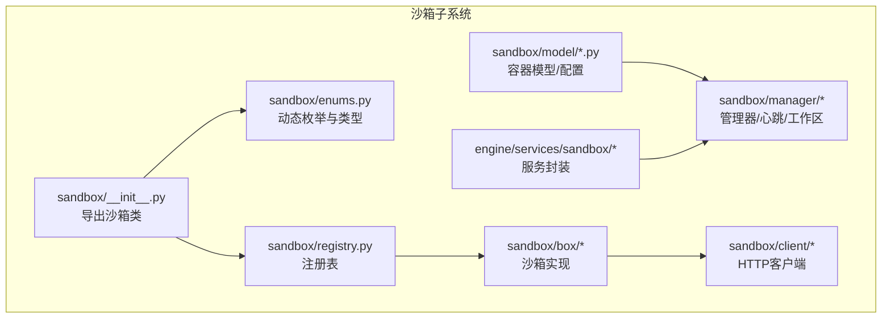
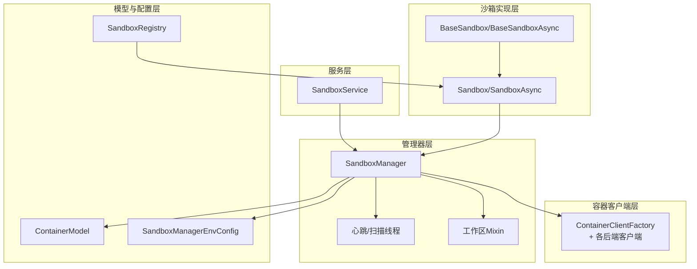
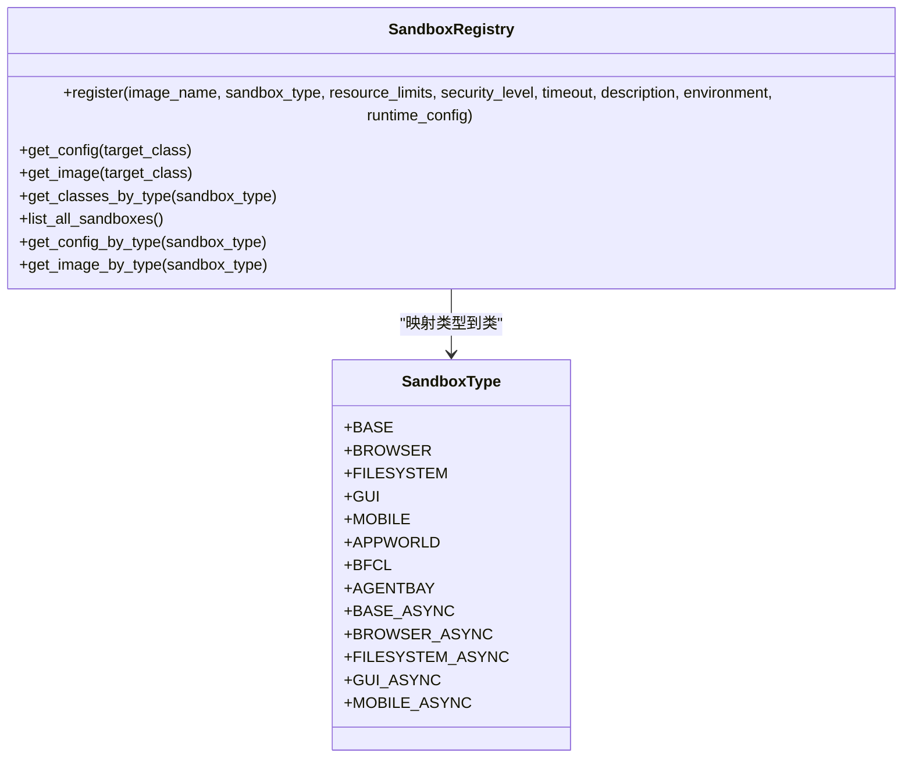
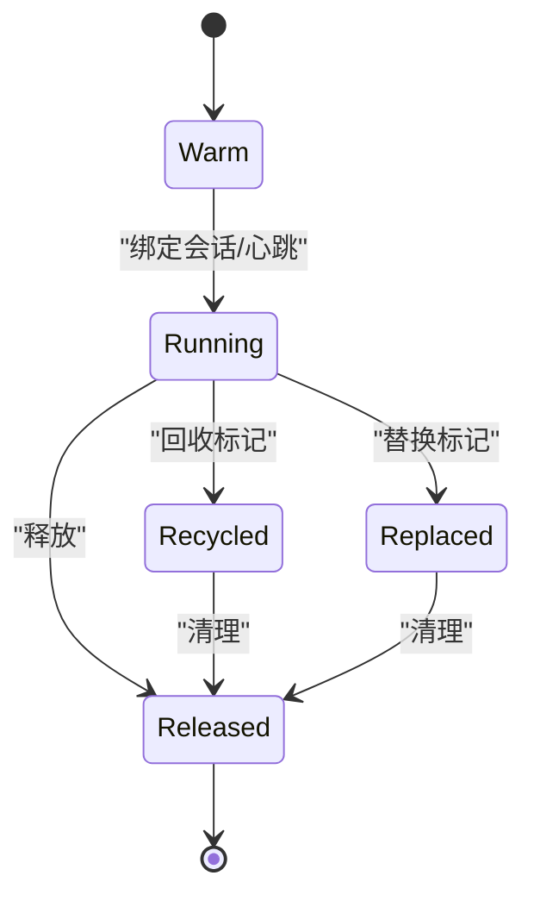
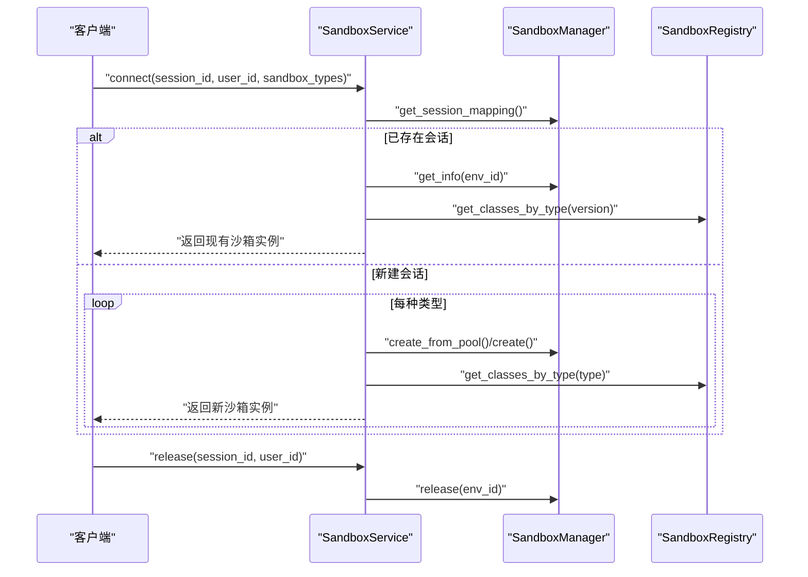
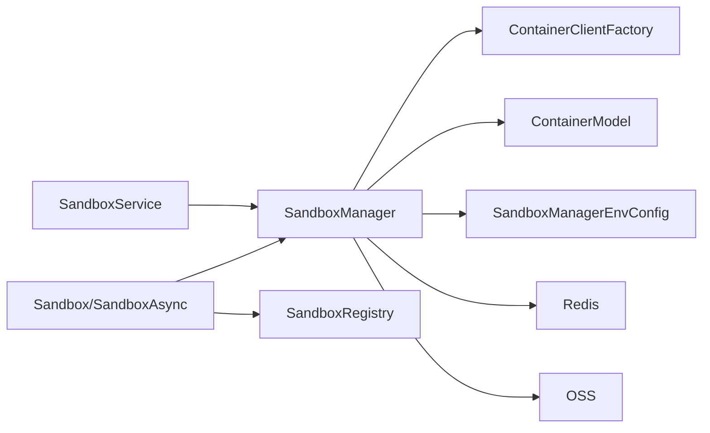

# 沙箱架构设计

<cite>
**本文引用的文件**
- [src/agentscope_runtime/sandbox/__init__.py](file://src/agentscope_runtime/sandbox/__init__.py)
- [src/agentscope_runtime/sandbox/enums.py](file://src/agentscope_runtime/sandbox/enums.py)
- [src/agentscope_runtime/sandbox/model/container.py](file://src/agentscope_runtime/sandbox/model/container.py)
- [src/agentscope_runtime/sandbox/model/manager_config.py](file://src/agentscope_runtime/sandbox/model/manager_config.py)
- [src/agentscope_runtime/sandbox/constant.py](file://src/agentscope_runtime/sandbox/constant.py)
- [src/agentscope_runtime/sandbox/box/base/base_sandbox.py](file://src/agentscope_runtime/sandbox/box/base/base_sandbox.py)
- [src/agentscope_runtime/sandbox/box/sandbox.py](file://src/agentscope_runtime/sandbox/box/sandbox.py)
- [src/agentscope_runtime/sandbox/client/base.py](file://src/agentscope_runtime/sandbox/client/base.py)
- [src/agentscope_runtime/sandbox/registry.py](file://src/agentscope_runtime/sandbox/registry.py)
- [src/agentscope_runtime/engine/services/sandbox/sandbox_service.py](file://src/agentscope_runtime/engine/services/sandbox/sandbox_service.py)
- [src/agentscope_runtime/common/container_clients/base_client.py](file://src/agentscope_runtime/common/container_clients/base_client.py)
- [src/agentscope_runtime/sandbox/utils.py](file://src/agentscope_runtime/sandbox/utils.py)
- [examples/sandbox/custom_sandbox/README.md](file://examples/sandbox/custom_sandbox/README.md)
- [examples/sandbox/agentbay_sandbox/README.md](file://examples/sandbox/agentbay_sandbox/README.md)
- [cookbook/zh/sandbox/sandbox.md](file://cookbook/zh/sandbox/sandbox.md)
</cite>

## 目录
1. [简介](#简介)
2. [项目结构](#项目结构)
3. [核心组件](#核心组件)
4. [架构总览](#架构总览)
5. [详细组件分析](#详细组件分析)
6. [依赖分析](#依赖分析)
7. [性能考量](#性能考量)
8. [故障排查指南](#故障排查指南)
9. [结论](#结论)
10. [附录](#附录)

## 简介
本技术文档围绕沙箱架构设计，系统阐述沙箱系统的核心理念、整体架构与关键实现。重点涵盖：
- 沙箱注册机制与类型体系
- 容器模型与生命周期管理
- 同步与异步沙箱的实现差异与选择原则
- 配置参数、资源分配策略与监控方法
- 架构图表与组件交互流程
- 设计决策与权衡考量

## 项目结构
沙箱子系统位于 src/agentscope_runtime/sandbox 下，采用“按功能域分层 + 按类型聚合”的组织方式：
- sandbox：对外暴露的沙箱类与注册表、枚举、常量、模型与工具
- box：各类沙箱实现（base、browser、filesystem、gui、mobile、training_box、agentbay、cloud）
- client：沙箱客户端（HTTP/异步HTTP）
- manager：沙箱管理器（池化、心跳、回收、存储）
- engine/services/sandbox：服务层封装，面向上层应用的生命周期管理
- common/container_clients：容器客户端抽象与多后端适配



**图表来源**
- [src/agentscope_runtime/sandbox/__init__.py:1-33](file://src/agentscope_runtime/sandbox/__init__.py#L1-L33)
- [src/agentscope_runtime/sandbox/enums.py:61-80](file://src/agentscope_runtime/sandbox/enums.py#L61-L80)
- [src/agentscope_runtime/sandbox/registry.py:33-131](file://src/agentscope_runtime/sandbox/registry.py#L33-L131)
- [src/agentscope_runtime/engine/services/sandbox/sandbox_service.py:11-238](file://src/agentscope_runtime/engine/services/sandbox/sandbox_service.py#L11-L238)

**章节来源**
- [src/agentscope_runtime/sandbox/__init__.py:1-33](file://src/agentscope_runtime/sandbox/__init__.py#L1-L33)
- [src/agentscope_runtime/sandbox/enums.py:61-80](file://src/agentscope_runtime/sandbox/enums.py#L61-L80)
- [src/agentscope_runtime/sandbox/registry.py:33-131](file://src/agentscope_runtime/sandbox/registry.py#L33-L131)

## 核心组件
- 动态枚举与类型体系：SandboxType 支持内置与动态扩展，覆盖基础、浏览器、文件系统、GUI、移动端、训练、AgentBay、云沙箱等类型，并提供同步/异步变体。
- 注册表：SandboxRegistry 统一管理沙箱类与其镜像、资源限制、超时、描述、环境变量与运行时配置的映射。
- 容器模型：ContainerModel 描述容器标识、URL、端口、挂载目录、存储路径、令牌、版本、元信息、超时、沙箱类型、生命周期状态、心跳与回收时间戳等。
- 管理器配置：SandboxManagerEnvConfig 定义文件系统、Redis、容器部署后端、端口范围、池大小、OSS/Redis/K8s/AgentRun/FC 等参数。
- 沙箱基类：Sandbox/SandboxAsync 提供统一的生命周期（上下文管理、信号处理、清理）、工具调用、MCP 服务器接入等能力。
- 服务封装：SandboxService 提供会话级生命周期管理、环境创建/连接、AgentBay 特殊处理与资源释放。

**章节来源**
- [src/agentscope_runtime/sandbox/enums.py:61-80](file://src/agentscope_runtime/sandbox/enums.py#L61-L80)
- [src/agentscope_runtime/sandbox/registry.py:9-31](file://src/agentscope_runtime/sandbox/registry.py#L9-L31)
- [src/agentscope_runtime/sandbox/model/container.py:19-158](file://src/agentscope_runtime/sandbox/model/container.py#L19-L158)
- [src/agentscope_runtime/sandbox/model/manager_config.py:11-376](file://src/agentscope_runtime/sandbox/model/manager_config.py#L11-L376)
- [src/agentscope_runtime/sandbox/box/sandbox.py:18-313](file://src/agentscope_runtime/sandbox/box/sandbox.py#L18-L313)
- [src/agentscope_runtime/engine/services/sandbox/sandbox_service.py:11-238](file://src/agentscope_runtime/engine/services/sandbox/sandbox_service.py#L11-L238)

## 架构总览
沙箱架构由“服务层”“管理器层”“沙箱实现层”“容器客户端层”“模型与配置层”构成，支持本地 Docker/BoxLite 与云端 K8s/AgentRun/FC 等部署后端。



**图表来源**
- [src/agentscope_runtime/engine/services/sandbox/sandbox_service.py:11-238](file://src/agentscope_runtime/engine/services/sandbox/sandbox_service.py#L11-L238)
- [src/agentscope_runtime/sandbox/manager/sandbox_manager.py:140-520](file://src/agentscope_runtime/sandbox/manager/sandbox_manager.py#L140-L520)
- [src/agentscope_runtime/sandbox/box/sandbox.py:148-313](file://src/agentscope_runtime/sandbox/box/sandbox.py#L148-L313)
- [src/agentscope_runtime/sandbox/registry.py:33-131](file://src/agentscope_runtime/sandbox/registry.py#L33-L131)
- [src/agentscope_runtime/sandbox/model/container.py:19-158](file://src/agentscope_runtime/sandbox/model/container.py#L19-L158)
- [src/agentscope_runtime/sandbox/model/manager_config.py:11-376](file://src/agentscope_runtime/sandbox/model/manager_config.py#L11-L376)

## 详细组件分析

### 沙箱类型与注册机制
- 类型体系：SandboxType 支持内置类型与动态扩展，异步类型以 *_ASYNC 结尾，便于区分同步/异步沙箱。
- 注册表：SandboxRegistry.register 装饰器将沙箱类与其镜像、资源限制、超时、描述、环境变量、运行时配置绑定，并建立类型到类的映射。
- 导出与延迟注册：通过 sandbox/__init__.py 显式导入各沙箱类，确保注册表在模块加载时完成注册。



**图表来源**
- [src/agentscope_runtime/sandbox/registry.py:33-131](file://src/agentscope_runtime/sandbox/registry.py#L33-L131)
- [src/agentscope_runtime/sandbox/enums.py:61-80](file://src/agentscope_runtime/sandbox/enums.py#L61-L80)

**章节来源**
- [src/agentscope_runtime/sandbox/registry.py:33-131](file://src/agentscope_runtime/sandbox/registry.py#L33-L131)
- [src/agentscope_runtime/sandbox/enums.py:61-80](file://src/agentscope_runtime/sandbox/enums.py#L61-L80)
- [src/agentscope_runtime/sandbox/__init__.py:1-33](file://src/agentscope_runtime/sandbox/__init__.py#L1-L33)

### 容器模型与生命周期管理
- 容器状态：ContainerState 定义 warm、running、recycled、replaced、error、released 等状态，贯穿池化、回收与替换流程。
- 容器模型：ContainerModel 包含 session_id、container_id/name、url、ports、挂载目录/存储路径、令牌、版本、元信息、超时、沙箱类型、状态、心跳与回收时间戳等字段，并提供兼容性与默认值校验。
- 生命周期：SandboxManager 提供 create/create_from_pool、release、cleanup、scan_heartbeat、scan_pool、scan_released_cleanup 等能力，结合 Redis/内存映射与队列实现池化与回收。



**图表来源**
- [src/agentscope_runtime/sandbox/model/container.py:10-16](file://src/agentscope_runtime/sandbox/model/container.py#L10-L16)
- [src/agentscope_runtime/sandbox/model/container.py:82-123](file://src/agentscope_runtime/sandbox/model/container.py#L82-L123)

**章节来源**
- [src/agentscope_runtime/sandbox/model/container.py:10-158](file://src/agentscope_runtime/sandbox/model/container.py#L10-L158)
- [src/agentscope_runtime/sandbox/manager/sandbox_manager.py:591-750](file://src/agentscope_runtime/sandbox/manager/sandbox_manager.py#L591-L750)

### 同步与异步沙箱实现差异
- 接口一致性：Sandbox/SandboxAsync 提供一致的生命周期（上下文管理、start/close、start_async/close_async）、工具调用（call_tool/call_tool_async）、MCP 服务器接入（add_mcp_servers/add_mcp_servers_async）。
- 运行模式：嵌入模式（embedded）与远程模式（remote），嵌入模式下自动注册清理钩子与信号处理器；远程模式通过 HTTP/异步 HTTP 与远端 SandboxManager 交互。
- 选择原则：I/O 密集、并发场景优先异步；简单脚本或单次任务优先同步；需要与现有事件循环解耦时采用异步。

```mermaid
sequenceDiagram
participant App as "应用"
participant Box as "Sandbox/SandboxAsync"
participant Manager as "SandboxManager"
participant Client as "ContainerClientFactory"
participant Store as "存储/Redis"
App->>Box : "with Sandbox(...)/async with SandboxAsync(...)"
Box->>Manager : "create_from_pool()/create()"
Manager->>Client : "创建容器/检查状态"
Client-->>Manager : "返回容器ID/URL"
Manager->>Store : "写入容器映射/会话映射"
Manager-->>Box : "返回沙箱ID"
App->>Box : "call_tool()/call_tool_async()"
Box->>Manager : "转发工具调用"
Manager-->>App : "返回结果"
App->>Box : "__exit__/close_async()"
Box->>Manager : "release()/cleanup()"
```

**图表来源**
- [src/agentscope_runtime/sandbox/box/sandbox.py:148-313](file://src/agentscope_runtime/sandbox/box/sandbox.py#L148-L313)
- [src/agentscope_runtime/sandbox/manager/sandbox_manager.py:591-750](file://src/agentscope_runtime/sandbox/manager/sandbox_manager.py#L591-L750)
- [src/agentscope_runtime/common/container_clients/base_client.py:5-40](file://src/agentscope_runtime/common/container_clients/base_client.py#L5-L40)

**章节来源**
- [src/agentscope_runtime/sandbox/box/sandbox.py:148-313](file://src/agentscope_runtime/sandbox/box/sandbox.py#L148-L313)
- [src/agentscope_runtime/sandbox/box/base/base_sandbox.py:18-102](file://src/agentscope_runtime/sandbox/box/base/base_sandbox.py#L18-L102)

### 服务层与会话管理
- SandboxService：负责服务启动/停止、健康检查、会话连接（connect）、会话复用、资源释放（release）与 AgentBay 特殊处理。
- 会话键：由 session_id 与 user_id 组合形成复合键，映射到一组沙箱实例，支持多类型沙箱组合。
- Drain 行为：stop 时可选择释放所有非 AgentBay 环境，避免资源泄漏。



**图表来源**
- [src/agentscope_runtime/engine/services/sandbox/sandbox_service.py:82-232](file://src/agentscope_runtime/engine/services/sandbox/sandbox_service.py#L82-L232)
- [src/agentscope_runtime/sandbox/registry.py:105-131](file://src/agentscope_runtime/sandbox/registry.py#L105-L131)

**章节来源**
- [src/agentscope_runtime/engine/services/sandbox/sandbox_service.py:11-238](file://src/agentscope_runtime/engine/services/sandbox/sandbox_service.py#L11-L238)

### 客户端与工具调用
- HTTP 客户端：SandboxHttpBase 统一封装基础 URL、超时、头部与通用工具 Schema，支持 Bearer Token 认证。
- 工具调用：Sandbox/SandboxAsync 通过 manager_api 转发 call_tool/call_tool_async，实现跨进程/跨服务调用。

**章节来源**
- [src/agentscope_runtime/sandbox/client/base.py:10-74](file://src/agentscope_runtime/sandbox/client/base.py#L10-L74)
- [src/agentscope_runtime/sandbox/box/sandbox.py:204-312](file://src/agentscope_runtime/sandbox/box/sandbox.py#L204-L312)

### 配置参数与资源分配策略
- 环境配置：SandboxManagerEnvConfig 支持文件系统（local/oss）、Redis 开关、容器部署后端（docker/cloud/k8s/agentrun/fc/gvisor/boxlite）、端口范围、池大小、OSS/Redis/K8s/AgentRun/FC 参数、心跳超时与锁 TTL、Watcher 扫描间隔、已释放容器记录 TTL、最大实例数等。
- 资源限制：SandboxRegistry.register 中 resource_limits 映射为 runtime_config 的 mem_limit 与 nano_cpus，影响容器运行时资源约束。
- 镜像构建：build_image_uri 统一构建镜像 URI，支持 registry、namespace、tag 等参数。

**章节来源**
- [src/agentscope_runtime/sandbox/model/manager_config.py:11-376](file://src/agentscope_runtime/sandbox/model/manager_config.py#L11-L376)
- [src/agentscope_runtime/sandbox/registry.py:9-31](file://src/agentscope_runtime/sandbox/registry.py#L9-L31)
- [src/agentscope_runtime/sandbox/utils.py:11-58](file://src/agentscope_runtime/sandbox/utils.py#L11-L58)

### 监控与可观测性
- 心跳扫描：SandboxManager.start_watcher 启动后台线程，周期性扫描心跳、补池与释放记录清理，日志输出 metrics。
- 超时与错误：HTTP 请求封装统一错误收集与日志输出，便于定位服务端异常。
- 性能指标：Watcher 扫描间隔、心跳超时、池大小与最大实例数是关键调节参数。

**章节来源**
- [src/agentscope_runtime/sandbox/manager/sandbox_manager.py:444-507](file://src/agentscope_runtime/sandbox/manager/sandbox_manager.py#L444-L507)
- [src/agentscope_runtime/sandbox/manager/sandbox_manager.py:344-442](file://src/agentscope_runtime/sandbox/manager/sandbox_manager.py#L344-L442)

## 依赖分析
- 组件耦合：SandboxService 依赖 SandboxManager；Sandbox/SandboxAsync 依赖 SandboxManager；SandboxRegistry 为类型到类的映射中心；ContainerClientFactory 为容器后端抽象。
- 外部依赖：Redis（分布式锁与映射）、OSS（对象存储）、K8s/AgentRun/FC（云端部署）、Docker/BoxLite（本地容器）。
- 循环依赖：未见直接循环依赖，注册表与沙箱类通过装饰器在导入期建立映射。



**图表来源**
- [src/agentscope_runtime/engine/services/sandbox/sandbox_service.py:11-238](file://src/agentscope_runtime/engine/services/sandbox/sandbox_service.py#L11-L238)
- [src/agentscope_runtime/sandbox/box/sandbox.py:148-313](file://src/agentscope_runtime/sandbox/box/sandbox.py#L148-L313)
- [src/agentscope_runtime/sandbox/registry.py:33-131](file://src/agentscope_runtime/sandbox/registry.py#L33-L131)
- [src/agentscope_runtime/sandbox/model/manager_config.py:11-376](file://src/agentscope_runtime/sandbox/model/manager_config.py#L11-L376)

**章节来源**
- [src/agentscope_runtime/sandbox/registry.py:33-131](file://src/agentscope_runtime/sandbox/registry.py#L33-L131)
- [src/agentscope_runtime/sandbox/manager/sandbox_manager.py:245-251](file://src/agentscope_runtime/sandbox/manager/sandbox_manager.py#L245-L251)

## 性能考量
- 池化策略：通过 pool_size 与 Redis 队列维持预热容器，降低冷启动延迟；版本与状态校验保证池内容器可用性。
- 心跳与回收：合理设置 heartbeat_timeout 与 watcher_scan_interval，在资源占用与响应速度间平衡。
- 存储与网络：OSS 适合大文件场景；本地存储适合小规模测试；网络超时与重试策略需结合业务场景调整。
- 并发与异步：异步沙箱提升 I/O 密集型任务吞吐；同步沙箱简化逻辑但可能阻塞事件循环。

## 故障排查指南
- 远程模式连接失败：检查 base_url 与 bearer_token 设置，查看 HTTP 错误码与服务端返回详情。
- 沙箱不可用：确认池耗尽、实例上限达到或容器启动失败；查看 manager 日志与容器状态。
- AgentBay 连接异常：确认 API Key 与镜像 ID 配置，检查 AgentBay 会话状态。
- 自定义沙箱构建：遵循示例文档准备 Dockerfile 与注册装饰器，使用内置构建工具打包镜像。

**章节来源**
- [src/agentscope_runtime/sandbox/manager/sandbox_manager.py:344-442](file://src/agentscope_runtime/sandbox/manager/sandbox_manager.py#L344-L442)
- [examples/sandbox/agentbay_sandbox/README.md:88-134](file://examples/sandbox/agentbay_sandbox/README.md#L88-L134)
- [examples/sandbox/custom_sandbox/README.md:23-184](file://examples/sandbox/custom_sandbox/README.md#L23-L184)

## 结论
本沙箱架构以“类型驱动 + 注册表 + 管理器 + 服务封装”为核心，实现了从镜像选择、容器生命周期、会话管理到多后端部署的一体化方案。通过动态枚举与注册表，系统具备良好的扩展性；通过池化、心跳与回收策略，兼顾性能与稳定性；通过同步/异步双栈，满足不同应用场景的需求。建议在生产环境优先采用 K8s/AgentRun/FC 等云端后端，并结合 Redis 与 OSS 实现高可用与可扩展的资源管理。

## 附录
- 示例与文档：cookbook 与 examples 提供了丰富的使用示例与自定义沙箱、AgentBay 集成实践，可作为快速上手与深度定制的参考。

**章节来源**
- [cookbook/zh/sandbox/sandbox.md:1-608](file://cookbook/zh/sandbox/sandbox.md#L1-L608)
- [examples/sandbox/agentbay_sandbox/README.md:1-134](file://examples/sandbox/agentbay_sandbox/README.md#L1-L134)
- [examples/sandbox/custom_sandbox/README.md:1-184](file://examples/sandbox/custom_sandbox/README.md#L1-L184)