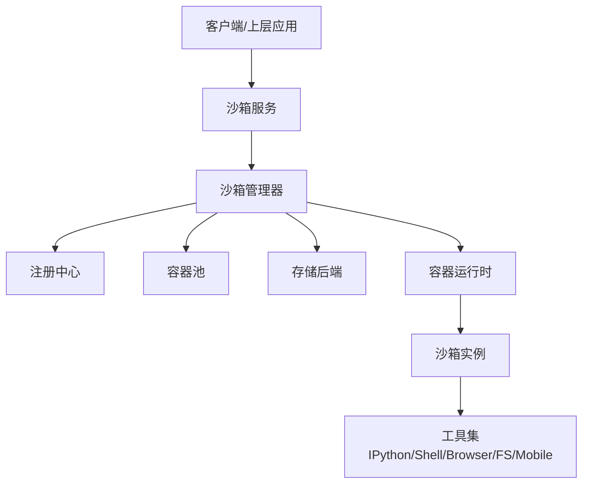
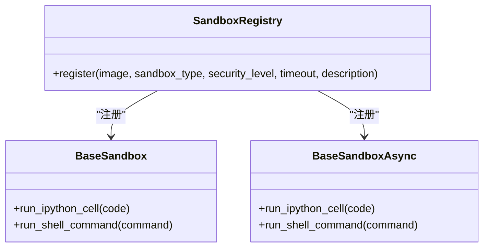
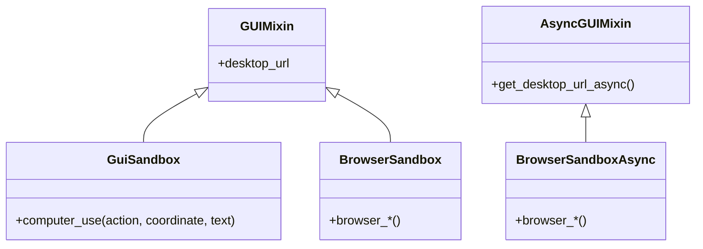
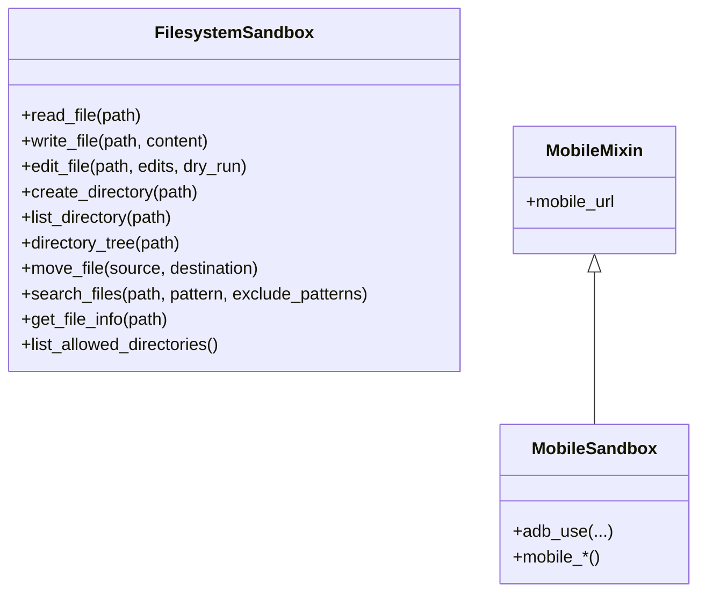
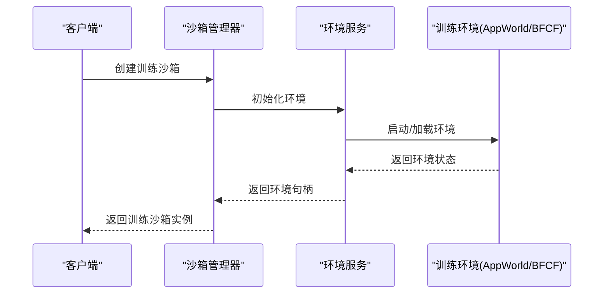
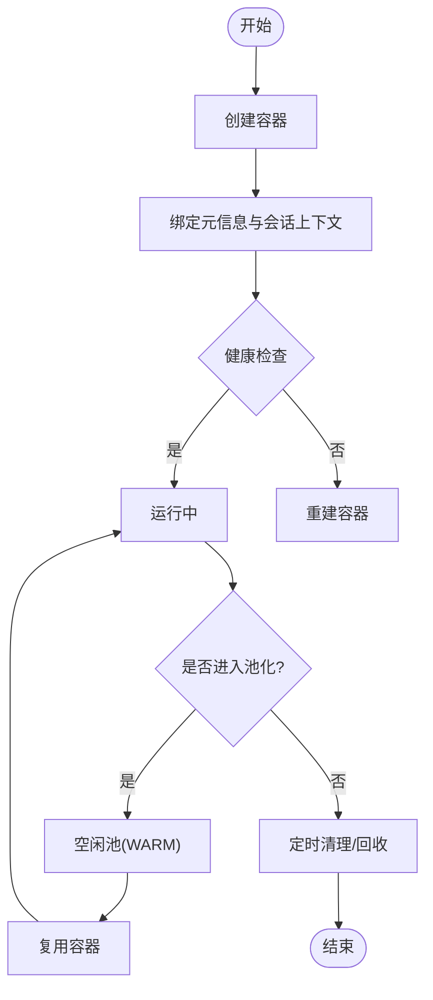
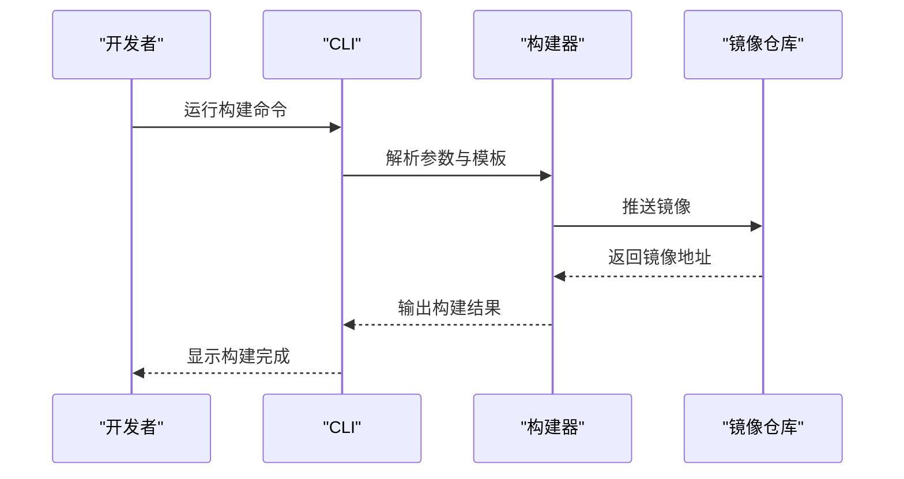
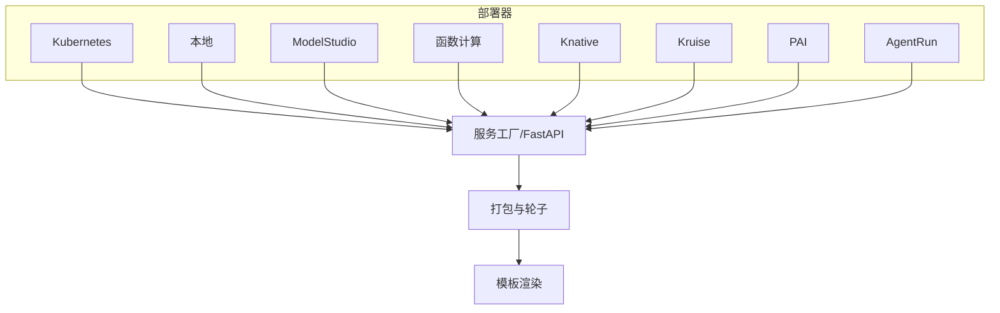
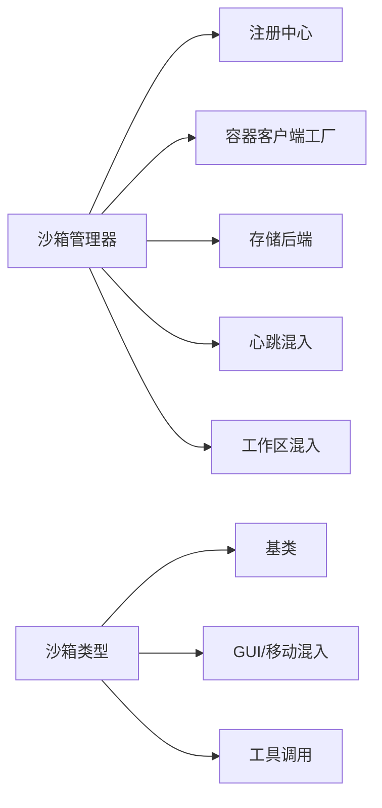

# 沙箱管理系统

<cite>
**本文引用的文件**
- [sandbox.py](file://src/agentscope_runtime/sandbox/box/sandbox.py)
- [base_sandbox.py](file://src/agentscope_runtime/sandbox/box/base/base_sandbox.py)
- [gui_sandbox.py](file://src/agentscope_runtime/sandbox/box/gui/gui_sandbox.py)
- [browser_sandbox.py](file://src/agentscope_runtime/sandbox/box/browser/browser_sandbox.py)
- [filesystem_sandbox.py](file://src/agentscope_runtime/sandbox/box/filesystem/filesystem_sandbox.py)
- [mobile_sandbox.py](file://src/agentscope_runtime/sandbox/box/mobile/mobile_sandbox.py)
- [sandbox_manager.py](file://src/agentscope_runtime/sandbox/manager/sandbox_manager.py)
- [sandbox_service.py](file://src/agentscope_runtime/engine/services/sandbox/sandbox_service.py)
- [sandbox_service_factory.py](file://src/agentscope_runtime/engine/services/sandbox/sandbox_service_factory.py)
- [sandbox.py](file://src/agentscope_runtime/cli/commands/sandbox.py)
- [enums.py](file://src/agentscope_runtime/sandbox/enums.py)
- [constant.py](file://src/agentscope_runtime/sandbox/constant.py)
- [utils.py](file://src/agentscope_runtime/sandbox/utils.py)
- [registry.py](file://src/agentscope_runtime/sandbox/registry.py)
- [mcp_server.py](file://src/agentscope_runtime/sandbox/mcp_server.py)
- [build.py](file://src/agentscope_runtime/sandbox/build.py)
- [agentbay_sandbox.py](file://src/agentscope_runtime/sandbox/box/agentbay/agentbay_sandbox.py)
- [cloud_sandbox.py](file://src/agentscope_runtime/sandbox/box/cloud/cloud_sandbox.py)
- [dummy_sandbox.py](file://src/agentscope_runtime/sandbox/box/dummy/dummy_sandbox.py)
- [custom_sandbox.py](file://src/agentscope_runtime/sandbox/custom/custom_sandbox.py)
- [app.py](file://src/agentscope_runtime/sandbox/manager/server/app.py)
- [config.py](file://src/agentscope_runtime/sandbox/manager/server/config.py)
- [models.py](file://src/agentscope_runtime/sandbox/manager/server/models.py)
- [storage.py](file://src/agentscope_runtime/sandbox/manager/storage/data_storage.py)
- [local_storage.py](file://src/agentscope_runtime/sandbox/manager/storage/local_storage.py)
- [oss_storage.py](file://src/agentscope_runtime/sandbox/manager/storage/oss_storage.py)
- [heartbeat_mixin.py](file://src/agentscope_runtime/sandbox/manager/heartbeat_mixin.py)
- [workspace_mixin.py](file://src/agentscope_runtime/sandbox/manager/workspace_mixin.py)
- [training_box.py](file://src/agentscope_runtime/sandbox/box/training_box/training_box.py)
- [env_service.py](file://src/agentscope_runtime/sandbox/box/training_box/env_service.py)
- [bfcl_env.py](file://src/agentscope_runtime/sandbox/box/training_box/environments/bfcl/bfcl_env.py)
- [appworld_env.py](file://src/agentscope_runtime/sandbox/box/training_box/environments/appworld/appworld_env.py)
- [bfcl.sh](file://src/agentscope_runtime/sandbox/box/training_box/bfcl.sh)
- [appworld.sh](file://src/agentscope_runtime/sandbox/box/training_box/appworld.sh)
- [trajectory.py](file://src/agentscope_runtime/sandbox/box/training_box/src/trajectory.py)
- [requirements.txt](file://examples/sandbox/custom_sandbox/box/requirements.txt)
- [Dockerfile](file://examples/sandbox/custom_sandbox/Dockerfile)
- [nginx.conf.template](file://src/agentscope_runtime/sandbox/box/base/box/config/nginx.conf.template)
- [supervisord.conf](file://src/agentscope_runtime/sandbox/box/base/box/config/supervisord.conf)
- [start.sh](file://src/agentscope_runtime/sandbox/box/base/box/scripts/start.sh)
- [playwright_mcp_config.json](file://src/agentscope_runtime/sandbox/box/browser/box/playwright_mcp_config.json)
- [mcp_server_configs.json](file://src/agentscope_runtime/sandbox/box/filesystem/box/mcp_server_configs.json)
- [host_checker.py](file://src/agentscope_runtime/sandbox/box/mobile/box/host_checker.py)
- [k8s_deploy_config.yaml](file://examples/deployments/k8s_deploy/k8s_deploy_config.yaml)
- [k8s_deploy_config.json](file://examples/deployments/k8s_deploy/k8s_deploy_config.json)
- [README.md](file://examples/deployments/k8s_deploy/README.md)
- [local_deploy_config.yaml](file://examples/deployments/daemon_local_deploy/local_deploy_config.yaml)
- [README.md](file://examples/deployments/daemon_local_deploy/README.md)
- [pai_deploy_config.yaml](file://examples/deployments/pai_deploy/pai_deploy_config.yaml)
- [README.md](file://examples/deployments/pai_deploy/README.md)
- [modelstudio_deploy_config.yaml](file://examples/deployments/modelstudio_deploy/modelstudio_deploy_config.yaml)
- [README.md](file://examples/deployments/modelstudio_deploy/README.md)
- [agentrun_deploy_config.yaml](file://examples/deployments/agentrun_deploy/agentrun_deploy_config.yaml)
- [README.md](file://examples/deployments/agentrun_deploy/README.md)
- [fc_deploy_config.json](file://examples/deployments/fc_deploy/fc_deploy_config.json)
- [README.md](file://examples/deployments/fc_deploy/README.md)
- [knative_deploy_config.json](file://examples/deployments/knative_deploy/knative_deploy_config.json)
- [README.md](file://examples/deployments/knative_deploy/README.md)
- [kruise_deploy_config.json](file://examples/deployments/kruise_deploy/kruise_deploy_config.json)
- [README.md](file://examples/deployments/kruise_deploy/README.md)
- [deployer_base.py](file://src/agentscope_runtime/engine/deployers/base.py)
- [kubernetes_deployer.py](file://src/agentscope_runtime/engine/deployers/kubernetes_deployer.py)
- [local_deployer.py](file://src/agentscope_runtime/engine/deployers/local_deployer.py)
- [modelstudio_deployer.py](file://src/agentscope_runtime/engine/deployers/modelstudio_deployer.py)
- [agentrun_deployer.py](file://src/agentscope_runtime/engine/deployers/agentrun_deployer.py)
- [fc_deployer.py](file://src/agentscope_runtime/engine/deployers/fc_deployer.py)
- [knative_deployer.py](file://src/agentscope_runtime/engine/deployers/knative_deployer.py)
- [kruise_deployer.py](file://src/agentscope_runtime/engine/deployers/kruise_deployer.py)
- [pai_deployer.py](file://src/agentscope_runtime/engine/deployers/pai_deployer.py)
- [docker_image_utils/docker_image_builder.py](file://src/agentscope_runtime/engine/deployers/utils/docker_image_utils/docker_image_builder.py)
- [docker_image_utils/dockerfile_generator.py](file://src/agentscope_runtime/engine/deployers/utils/docker_image_utils/dockerfile_generator.py)
- [docker_image_utils/image_factory.py](file://src/agentscope_runtime/engine/deployers/utils/docker_image_utils/image_factory.py)
- [package.py](file://src/agentscope_runtime/engine/deployers/utils/package.py)
- [wheel_packager.py](file://src/agentscope_runtime/engine/deployers/utils/wheel_packager.py)
- [fastapi_factory.py](file://src/agentscope_runtime/engine/deployers/utils/service_utils/fastapi_factory.py)
- [process_manager.py](file://src/agentscope_runtime/engine/deployers/utils/service_utils/process_manager.py)
- [routing/unified_routing_mixin.py](file://src/agentscope_runtime/engine/deployers/utils/service_utils/routing/unified_routing_mixin.py)
- [routing/task_engine_mixin.py](file://src/agentscope_runtime/engine/deployers/utils/service_utils/routing/task_engine_mixin.py)
- [routing/custom_endpoint_mixin.py](file://src/agentscope_runtime/engine/deployers/utils/service_utils/routing/custom_endpoint_mixin.py)
- [responses_api_adapter_utils.py](file://src/agentscope_runtime/engine/deployers/adapter/responses/adapter_utils.py)
- [protocol_adapter.py](file://src/agentscope_runtime/engine/deployers/adapter/protocol_adapter.py)
- [a2a_registry.py](file://src/agentscope_runtime/engine/deployers/adapter/a2a/a2a_registry.py)
- [nacos_a2a_registry.py](file://src/agentscope_runtime/engine/deployers/adapter/a2a/nacos_a2a_registry.py)
- [interrupt_mixin.py](file://src/agentscope_runtime/engine/deployers/utils/service_utils/interrupt/local_backend.py)
- [redis_backend.py](file://src/agentscope_runtime/engine/deployers/utils/service_utils/interrupt/redis_backend.py)
- [runner.py](file://src/agentscope_runtime/engine/helpers/runner.py)
- [app.py](file://src/agentscope_runtime/engine/app/agent_app.py)
- [celery_mixin.py](file://src/agentscope_runtime/engine/app/celery_mixin.py)
- [app_main.py.j2](file://src/agentscope_runtime/engine/deployers/utils/templates/app_main.py.j2)
- [runner_main.py.j2](file://src/agentscope_runtime/engine/deployers/utils/templates/runner_main.py.j2)
- [standalone_main.py.j2](file://src/agentscope_runtime/engine/deployers/utils/templates/standalone_main.py.j2)
- [test_sandbox.py](file://tests/sandbox/test_sandbox.py)
- [test_sandbox_service.py](file://tests/sandbox/test_sandbox_service.py)
- [test_sandbox_agentbay.py](file://tests/sandbox/test_sandbox_agentbay.py)
- [test_sandbox_bfcl.py](file://tests/sandbox/test_sandbox_bfcl.py)
- [test_sandbox_appworld.py](file://tests/sandbox/test_sandbox_appworld.py)
- [test_heartbeat.py](file://tests/sandbox/test_heartbeat.py)
- [test_heartbeat_timeout_restore.py](file://tests/sandbox/test_heartbeat_timeout_restore.py)
- [troubleshooting.md](file://cookbook/zh/sandbox/troubleshooting.md)
- [advanced.md](file://cookbook/zh/sandbox/advanced.md)
- [training_sandbox.md](file://cookbook/zh/sandbox/training_sandbox.md)
</cite>

## 目录
1. [简介](#简介)
2. [项目结构](#项目结构)
3. [核心组件](#核心组件)
4. [架构总览](#架构总览)
5. [详细组件分析](#详细组件分析)
6. [依赖关系分析](#依赖关系分析)
7. [性能考量](#性能考量)
8. [故障排查指南](#故障排查指南)
9. [结论](#结论)
10. [附录](#附录)

## 简介
本技术文档面向“沙箱管理系统”，系统性阐述其架构设计、安全机制、各类沙箱实现（基础、GUI、浏览器、文件系统、移动、训练等）、生命周期与容器化部署、资源控制、同步与异步版本差异、配置与镜像管理、性能优化、安全最佳实践以及常见问题排查。文档以代码为依据，结合可视化图示帮助读者快速理解并高效使用该系统。

## 项目结构
系统采用模块化分层组织：
- 引擎层：负责应用打包、服务生成、部署器与适配器、运行时辅助工具
- 引擎服务层：封装沙箱服务接口与工厂
- 沙箱层：定义沙箱基类与多种沙箱类型，提供统一的工具调用与生命周期管理
- 管理层：沙箱管理器负责容器编排、池化复用、心跳与清理、存储与工作区管理
- CLI 层：提供命令行入口，委托到具体子命令（MCP 服务器、沙箱管理服务、构建）
- 示例与部署：提供多平台部署配置与自定义沙箱示例

```mermaid
graph TB
subgraph "引擎层"
Deployers["部署器与适配器"]
Helpers["运行时与辅助工具"]
end
subgraph "引擎服务层"
Svc["沙箱服务与工厂"]
end
subgraph "沙箱层"
Base["基础沙箱"]
GUI["GUI 沙箱"]
Browser["浏览器沙箱"]
FS["文件系统沙箱"]
Mobile["移动沙箱"]
Training["训练沙箱"]
AgentBay["AgentBay 沙箱"]
Cloud["云原生沙箱"]
Dummy["占位沙箱"]
Custom["自定义沙箱"]
end
subgraph "管理层"
Manager["沙箱管理器"]
Storage["存储后端"]
Heartbeat["心跳与回收"]
Workspace["工作区管理"]
end
subgraph "CLI"
CLI["命令行接口"]
end
Deployers --> Svc
Helpers --> Svc
Svc --> Manager
Manager --> Storage
Manager --> Heartbeat
Manager --> Workspace
Manager --> Base
Manager --> GUI
Manager --> Browser
Manager --> FS
Manager --> Mobile
Manager --> Training
CLI --> Manager
```

**图表来源**
- [sandbox_manager.py:140-340](file://src/agentscope_runtime/sandbox/manager/sandbox_manager.py#L140-L340)
- [sandbox_service.py](file://src/agentscope_runtime/engine/services/sandbox/sandbox_service.py)
- [sandbox_service_factory.py](file://src/agentscope_runtime/engine/services/sandbox/sandbox_service_factory.py)
- [sandbox.py](file://src/agentscope_runtime/sandbox/box/sandbox.py)
- [base_sandbox.py:11-17](file://src/agentscope_runtime/sandbox/box/base/base_sandbox.py#L11-L17)
- [gui_sandbox.py:65-71](file://src/agentscope_runtime/sandbox/box/gui/gui_sandbox.py#L65-L71)
- [browser_sandbox.py:31-37](file://src/agentscope_runtime/sandbox/box/browser/browser_sandbox.py#L31-L37)
- [filesystem_sandbox.py:13-19](file://src/agentscope_runtime/sandbox/box/filesystem/filesystem_sandbox.py#L13-L19)
- [mobile_sandbox.py:80-87](file://src/agentscope_runtime/sandbox/box/mobile/mobile_sandbox.py#L80-L87)
- [training_box.py](file://src/agentscope_runtime/sandbox/box/training_box/training_box.py)
- [agentbay_sandbox.py](file://src/agentscope_runtime/sandbox/box/agentbay/agentbay_sandbox.py)
- [cloud_sandbox.py](file://src/agentscope_runtime/sandbox/box/cloud/cloud_sandbox.py)
- [dummy_sandbox.py](file://src/agentscope_runtime/sandbox/box/dummy/dummy_sandbox.py)
- [custom_sandbox.py](file://src/agentscope_runtime/sandbox/custom/custom_sandbox.py)
- [cli/commands/sandbox.py:14-27](file://src/agentscope_runtime/cli/commands/sandbox.py#L14-L27)

**章节来源**
- [sandbox_manager.py:140-340](file://src/agentscope_runtime/sandbox/manager/sandbox_manager.py#L140-L340)
- [sandbox_service.py](file://src/agentscope_runtime/engine/services/sandbox/sandbox_service.py)
- [sandbox_service_factory.py](file://src/agentscope_runtime/engine/services/sandbox/sandbox_service_factory.py)
- [sandbox.py](file://src/agentscope_runtime/sandbox/box/sandbox.py)
- [base_sandbox.py:11-17](file://src/agentscope_runtime/sandbox/box/base/base_sandbox.py#L11-L17)
- [gui_sandbox.py:65-71](file://src/agentscope_runtime/sandbox/box/gui/gui_sandbox.py#L65-L71)
- [browser_sandbox.py:31-37](file://src/agentscope_runtime/sandbox/box/browser/browser_sandbox.py#L31-L37)
- [filesystem_sandbox.py:13-19](file://src/agentscope_runtime/sandbox/box/filesystem/filesystem_sandbox.py#L13-L19)
- [mobile_sandbox.py:80-87](file://src/agentscope_runtime/sandbox/box/mobile/mobile_sandbox.py#L80-L87)
- [training_box.py](file://src/agentscope_runtime/sandbox/box/training_box/training_box.py)
- [agentbay_sandbox.py](file://src/agentscope_runtime/sandbox/box/agentbay/agentbay_sandbox.py)
- [cloud_sandbox.py](file://src/agentscope_runtime/sandbox/box/cloud/cloud_sandbox.py)
- [dummy_sandbox.py](file://src/agentscope_runtime/sandbox/box/dummy/dummy_sandbox.py)
- [custom_sandbox.py](file://src/agentscope_runtime/sandbox/custom/custom_sandbox.py)
- [cli/commands/sandbox.py:14-27](file://src/agentscope_runtime/cli/commands/sandbox.py#L14-L27)

## 核心组件
- 沙箱基类与注册中心
  - 基类提供统一的工具调用接口与生命周期管理；通过注册中心按类型注册镜像、超时、安全等级等元信息。
- 沙箱类型
  - 基础沙箱：执行 IPython 单元与 shell 命令
  - GUI 沙箱：桌面远程访问与人机交互（VNC）
  - 浏览器沙箱：网页自动化（导航、截图、输入、拖拽、网络请求等）
  - 文件系统沙箱：文件读写、目录操作、搜索与元数据查询
  - 移动沙箱：ADB 动作与屏幕截图（需要宿主准备）
  - 训练沙箱：AppWorld、BFCF 等强化学习/仿真环境
  - AgentBay/云原生/占位/自定义：扩展与集成能力
- 管理器
  - 负责容器池化、心跳扫描、资源清理、存储与工作区管理、远程/本地模式切换
- 服务与工厂
  - 提供沙箱服务接口与工厂，支持不同部署模式下的沙箱实例化
- CLI
  - 统一入口：启动 MCP 服务器、沙箱管理服务、构建沙箱镜像

**章节来源**
- [base_sandbox.py:11-17](file://src/agentscope_runtime/sandbox/box/base/base_sandbox.py#L11-L17)
- [gui_sandbox.py:65-71](file://src/agentscope_runtime/sandbox/box/gui/gui_sandbox.py#L65-L71)
- [browser_sandbox.py:31-37](file://src/agentscope_runtime/sandbox/box/browser/browser_sandbox.py#L31-L37)
- [filesystem_sandbox.py:13-19](file://src/agentscope_runtime/sandbox/box/filesystem/filesystem_sandbox.py#L13-L19)
- [mobile_sandbox.py:80-87](file://src/agentscope_runtime/sandbox/box/mobile/mobile_sandbox.py#L80-L87)
- [training_box.py](file://src/agentscope_runtime/sandbox/box/training_box/training_box.py)
- [sandbox_manager.py:140-340](file://src/agentscope_runtime/sandbox/manager/sandbox_manager.py#L140-L340)
- [sandbox_service.py](file://src/agentscope_runtime/engine/services/sandbox/sandbox_service.py)
- [sandbox_service_factory.py](file://src/agentscope_runtime/engine/services/sandbox/sandbox_service_factory.py)
- [cli/commands/sandbox.py:14-27](file://src/agentscope_runtime/cli/commands/sandbox.py#L14-L27)

## 架构总览
系统采用“服务-管理器-沙箱”三层架构：
- 服务层：对外暴露沙箱服务接口，屏蔽底层容器细节
- 管理层：集中编排容器生命周期、池化复用、健康检查与回收
- 沙箱层：按功能划分的沙箱类型，统一通过工具调用与 MCP 通信



**图表来源**
- [sandbox_service.py](file://src/agentscope_runtime/engine/services/sandbox/sandbox_service.py)
- [sandbox_manager.py:140-340](file://src/agentscope_runtime/sandbox/manager/sandbox_manager.py#L140-L340)
- [registry.py](file://src/agentscope_runtime/sandbox/registry.py)
- [sandbox.py](file://src/agentscope_runtime/sandbox/box/sandbox.py)

## 详细组件分析

### 基础沙箱与异步版本
- 设计要点
  - 注册中心以镜像 URI、类型、安全等级、超时与描述进行登记
  - 同步/异步类分别继承同步/异步基类，提供 run_ipython_cell 与 run_shell_command 工具调用
- 生命周期
  - 创建时绑定元信息与会话上下文；销毁时释放资源
- 安全与资源
  - 安全等级中等；超时由常量统一管理



**图表来源**
- [base_sandbox.py:11-17](file://src/agentscope_runtime/sandbox/box/base/base_sandbox.py#L11-L17)
- [base_sandbox.py:54-60](file://src/agentscope_runtime/sandbox/box/base/base_sandbox.py#L54-L60)

**章节来源**
- [base_sandbox.py:11-17](file://src/agentscope_runtime/sandbox/box/base/base_sandbox.py#L11-L17)
- [base_sandbox.py:54-60](file://src/agentscope_runtime/sandbox/box/base/base_sandbox.py#L54-L60)

### GUI 沙箱与浏览器沙箱
- GUI 沙箱
  - 提供桌面 URL 生成与人机交互（键盘、鼠标、截图）
  - 支持同步与异步 mixin，兼容 ARM 架构提示
- 浏览器沙箱
  - 提供窗口尺寸调整、导航、前进/后退、截图、元素点击/输入/悬停/拖拽、PDF 导出、网络请求、标签页管理、等待策略等
  - 提供 WS/HTTP URL 转换工具



**图表来源**
- [gui_sandbox.py:17-35](file://src/agentscope_runtime/sandbox/box/gui/gui_sandbox.py#L17-L35)
- [gui_sandbox.py:161-186](file://src/agentscope_runtime/sandbox/box/gui/gui_sandbox.py#L161-L186)
- [browser_sandbox.py:38-53](file://src/agentscope_runtime/sandbox/box/browser/browser_sandbox.py#L38-L53)
- [browser_sandbox.py:311-326](file://src/agentscope_runtime/sandbox/box/browser/browser_sandbox.py#L311-L326)

**章节来源**
- [gui_sandbox.py:17-35](file://src/agentscope_runtime/sandbox/box/gui/gui_sandbox.py#L17-L35)
- [gui_sandbox.py:161-186](file://src/agentscope_runtime/sandbox/box/gui/gui_sandbox.py#L161-L186)
- [browser_sandbox.py:38-53](file://src/agentscope_runtime/sandbox/box/browser/browser_sandbox.py#L38-L53)
- [browser_sandbox.py:311-326](file://src/agentscope_runtime/sandbox/box/browser/browser_sandbox.py#L311-L326)

### 文件系统沙箱与移动沙箱
- 文件系统沙箱
  - 提供文件读写、批量读取、编辑（diff 预览）、目录创建/遍历/树形视图、移动重命名、文件搜索、元数据查询、允许访问目录列表
- 移动沙箱
  - 提供 ADB 通用动作与常用快捷方法（点击、滑动、输入文本、按键、截图、分辨率）
  - 提供移动端 URL 生成与宿主就绪检查



**图表来源**
- [filesystem_sandbox.py:20-35](file://src/agentscope_runtime/sandbox/box/filesystem/filesystem_sandbox.py#L20-L35)
- [filesystem_sandbox.py:166-181](file://src/agentscope_runtime/sandbox/box/filesystem/filesystem_sandbox.py#L166-L181)
- [mobile_sandbox.py:17-41](file://src/agentscope_runtime/sandbox/box/mobile/mobile_sandbox.py#L17-L41)
- [mobile_sandbox.py:88-109](file://src/agentscope_runtime/sandbox/box/mobile/mobile_sandbox.py#L88-L109)

**章节来源**
- [filesystem_sandbox.py:20-35](file://src/agentscope_runtime/sandbox/box/filesystem/filesystem_sandbox.py#L20-L35)
- [filesystem_sandbox.py:166-181](file://src/agentscope_runtime/sandbox/box/filesystem/filesystem_sandbox.py#L166-L181)
- [mobile_sandbox.py:17-41](file://src/agentscope_runtime/sandbox/box/mobile/mobile_sandbox.py#L17-L41)
- [mobile_sandbox.py:88-109](file://src/agentscope_runtime/sandbox/box/mobile/mobile_sandbox.py#L88-L109)

### 训练沙箱与环境服务
- 训练沙箱
  - 提供 AppWorld 与 BFCF 环境封装，轨迹记录与环境服务
- 环境服务
  - 封装环境初始化、状态管理与交互接口



**图表来源**
- [training_box.py](file://src/agentscope_runtime/sandbox/box/training_box/training_box.py)
- [env_service.py](file://src/agentscope_runtime/sandbox/box/training_box/env_service.py)
- [appworld_env.py](file://src/agentscope_runtime/sandbox/box/training_box/environments/appworld/appworld_env.py)
- [bfcl_env.py](file://src/agentscope_runtime/sandbox/box/training_box/environments/bfcl/bfcl_env.py)

**章节来源**
- [training_box.py](file://src/agentscope_runtime/sandbox/box/training_box/training_box.py)
- [env_service.py](file://src/agentscope_runtime/sandbox/box/training_box/env_service.py)
- [appworld_env.py](file://src/agentscope_runtime/sandbox/box/training_box/environments/appworld/appworld_env.py)
- [bfcl_env.py](file://src/agentscope_runtime/sandbox/box/training_box/environments/bfcl/bfcl_env.py)

### 沙箱管理器与生命周期
- 生命周期
  - 创建：选择镜像、合并环境变量、生成会话 ID、挂载目录、创建容器
  - 运行：绑定会话上下文、更新心跳、加入池或直接运行
  - 清理：销毁非终止态容器、扫描回收、释放资源
- 池化与复用
  - 多类型容器池队列，优先从池中取出可用容器，否则新建
- 心跳与回收
  - 后台线程周期扫描心跳与池状态，触发回收与清理
- 存储与工作区
  - 支持本地/对象存储，工作区目录可配置



**图表来源**
- [sandbox_manager.py:592-704](file://src/agentscope_runtime/sandbox/manager/sandbox_manager.py#L592-L704)
- [sandbox_manager.py:444-491](file://src/agentscope_runtime/sandbox/manager/sandbox_manager.py#L444-L491)
- [sandbox_manager.py:509-589](file://src/agentscope_runtime/sandbox/manager/sandbox_manager.py#L509-L589)

**章节来源**
- [sandbox_manager.py:592-704](file://src/agentscope_runtime/sandbox/manager/sandbox_manager.py#L592-L704)
- [sandbox_manager.py:444-491](file://src/agentscope_runtime/sandbox/manager/sandbox_manager.py#L444-L491)
- [sandbox_manager.py:509-589](file://src/agentscope_runtime/sandbox/manager/sandbox_manager.py#L509-L589)

### 同步与异步版本差异
- 调用方式
  - 同步：call_tool
  - 异步：call_tool_async
- 执行模型
  - 同步阻塞式调用；异步非阻塞式调用，支持并发
- 适用场景
  - 高吞吐任务建议异步；简单脚本可使用同步

**章节来源**
- [base_sandbox.py:78-101](file://src/agentscope_runtime/sandbox/box/base/base_sandbox.py#L78-L101)
- [gui_sandbox.py:188-239](file://src/agentscope_runtime/sandbox/box/gui/gui_sandbox.py#L188-L239)
- [browser_sandbox.py:328-497](file://src/agentscope_runtime/sandbox/box/browser/browser_sandbox.py#L328-L497)
- [filesystem_sandbox.py:183-253](file://src/agentscope_runtime/sandbox/box/filesystem/filesystem_sandbox.py#L183-L253)

### 配置、镜像管理与构建
- 镜像与注册
  - 通过注册中心按类型注册镜像 URI、安全等级、超时与描述
- 构建流程
  - CLI 委托到构建器，生成镜像并推送至仓库
- 配置项
  - 容器部署方式、池大小、挂载目录、只读挂载、存储类型、Redis 开关与连接参数等



**图表来源**
- [cli/commands/sandbox.py:95-124](file://src/agentscope_runtime/cli/commands/sandbox.py#L95-L124)
- [build.py](file://src/agentscope_runtime/sandbox/build.py)
- [registry.py](file://src/agentscope_runtime/sandbox/registry.py)

**章节来源**
- [cli/commands/sandbox.py:95-124](file://src/agentscope_runtime/cli/commands/sandbox.py#L95-L124)
- [build.py](file://src/agentscope_runtime/sandbox/build.py)
- [registry.py](file://src/agentscope_runtime/sandbox/registry.py)

### 容器化部署与多平台支持
- 部署器
  - Kubernetes、本地、阿里云 ModelStudio、FC、Knative、Kruise、PAI、AgentRun 等
- 服务生成
  - FastAPI 工厂、进程管理、路由混入、统一路由与任务引擎混入
- 包装与打包
  - 项目打包、轮子打包、模板渲染（应用/运行器/独立模式）



**图表来源**
- [kubernetes_deployer.py](file://src/agentscope_runtime/engine/deployers/kubernetes_deployer.py)
- [local_deployer.py](file://src/agentscope_runtime/engine/deployers/local_deployer.py)
- [modelstudio_deployer.py](file://src/agentscope_runtime/engine/deployers/modelstudio_deployer.py)
- [agentrun_deployer.py](file://src/agentscope_runtime/engine/deployers/agentrun_deployer.py)
- [fc_deployer.py](file://src/agentscope_runtime/engine/deployers/fc_deployer.py)
- [knative_deployer.py](file://src/agentscope_runtime/engine/deployers/knative_deployer.py)
- [kruise_deployer.py](file://src/agentscope_runtime/engine/deployers/kruise_deployer.py)
- [pai_deployer.py](file://src/agentscope_runtime/engine/deployers/pai_deployer.py)
- [fastapi_factory.py](file://src/agentscope_runtime/engine/deployers/utils/service_utils/fastapi_factory.py)
- [process_manager.py](file://src/agentscope_runtime/engine/deployers/utils/service_utils/process_manager.py)
- [unified_routing_mixin.py](file://src/agentscope_runtime/engine/deployers/utils/service_utils/routing/unified_routing_mixin.py)
- [task_engine_mixin.py](file://src/agentscope_runtime/engine/deployers/utils/service_utils/routing/task_engine_mixin.py)
- [custom_endpoint_mixin.py](file://src/agentscope_runtime/engine/deployers/utils/service_utils/routing/custom_endpoint_mixin.py)
- [package.py](file://src/agentscope_runtime/engine/deployers/utils/package.py)
- [wheel_packager.py](file://src/agentscope_runtime/engine/deployers/utils/wheel_packager.py)
- [app_main.py.j2](file://src/agentscope_runtime/engine/deployers/utils/templates/app_main.py.j2)
- [runner_main.py.j2](file://src/agentscope_runtime/engine/deployers/utils/templates/runner_main.py.j2)
- [standalone_main.py.j2](file://src/agentscope_runtime/engine/deployers/utils/templates/standalone_main.py.j2)

**章节来源**
- [kubernetes_deployer.py](file://src/agentscope_runtime/engine/deployers/kubernetes_deployer.py)
- [local_deployer.py](file://src/agentscope_runtime/engine/deployers/local_deployer.py)
- [modelstudio_deployer.py](file://src/agentscope_runtime/engine/deployers/modelstudio_deployer.py)
- [agentrun_deployer.py](file://src/agentscope_runtime/engine/deployers/agentrun_deployer.py)
- [fc_deployer.py](file://src/agentscope_runtime/engine/deployers/fc_deployer.py)
- [knative_deployer.py](file://src/agentscope_runtime/engine/deployers/knative_deployer.py)
- [kruise_deployer.py](file://src/agentscope_runtime/engine/deployers/kruise_deployer.py)
- [pai_deployer.py](file://src/agentscope_runtime/engine/deployers/pai_deployer.py)
- [fastapi_factory.py](file://src/agentscope_runtime/engine/deployers/utils/service_utils/fastapi_factory.py)
- [process_manager.py](file://src/agentscope_runtime/engine/deployers/utils/service_utils/process_manager.py)
- [unified_routing_mixin.py](file://src/agentscope_runtime/engine/deployers/utils/service_utils/routing/unified_routing_mixin.py)
- [task_engine_mixin.py](file://src/agentscope_runtime/engine/deployers/utils/service_utils/routing/task_engine_mixin.py)
- [custom_endpoint_mixin.py](file://src/agentscope_runtime/engine/deployers/utils/service_utils/routing/custom_endpoint_mixin.py)
- [package.py](file://src/agentscope_runtime/engine/deployers/utils/package.py)
- [wheel_packager.py](file://src/agentscope_runtime/engine/deployers/utils/wheel_packager.py)
- [app_main.py.j2](file://src/agentscope_runtime/engine/deployers/utils/templates/app_main.py.j2)
- [runner_main.py.j2](file://src/agentscope_runtime/engine/deployers/utils/templates/runner_main.py.j2)
- [standalone_main.py.j2](file://src/agentscope_runtime/engine/deployers/utils/templates/standalone_main.py.j2)

## 依赖关系分析
- 组件耦合
  - 管理器依赖注册中心、容器客户端工厂、存储后端与心跳/工作区混入
  - 沙箱类型依赖基类与 GUI/移动 mixin，统一通过工具调用
- 外部依赖
  - 请求库、HTTPX、FastAPI、Redis、Docker/K8s 客户端等
- 循环依赖
  - 通过模块拆分与延迟导入避免循环



**图表来源**
- [sandbox_manager.py:246-251](file://src/agentscope_runtime/sandbox/manager/sandbox_manager.py#L246-L251)
- [registry.py](file://src/agentscope_runtime/sandbox/registry.py)
- [sandbox.py](file://src/agentscope_runtime/sandbox/box/sandbox.py)

**章节来源**
- [sandbox_manager.py:246-251](file://src/agentscope_runtime/sandbox/manager/sandbox_manager.py#L246-L251)
- [registry.py](file://src/agentscope_runtime/sandbox/registry.py)
- [sandbox.py](file://src/agentscope_runtime/sandbox/box/sandbox.py)

## 性能考量
- 池化复用
  - 通过空闲池减少创建/销毁开销，提升响应速度
- 异步调用
  - 对高并发场景建议使用异步沙箱，降低阻塞
- 资源限制
  - 通过容器资源配额与镜像安全等级控制风险
- 存储与网络
  - 使用对象存储与本地缓存结合，减少 I/O 延迟
- 超时与重试
  - 统一超时常量与错误返回，避免长时间阻塞

[本节为通用指导，无需特定文件来源]

## 故障排查指南
- 常见问题
  - 容器不可用/不健康：检查心跳扫描与池状态，确认容器状态
  - 超时错误：调整超时常量或优化工具调用
  - 移动沙箱宿主不就绪：执行宿主检查并确保依赖已安装
  - 权限不足：移动沙箱需要特权运行
- 排查步骤
  - 查看管理器日志与异常堆栈
  - 核对镜像版本与池内容器一致性
  - 检查存储后端连通性与权限
  - 使用单元测试定位问题

**章节来源**
- [sandbox_manager.py:444-491](file://src/agentscope_runtime/sandbox/manager/sandbox_manager.py#L444-L491)
- [mobile_sandbox.py:111-113](file://src/agentscope_runtime/sandbox/box/mobile/mobile_sandbox.py#L111-L113)
- [host_checker.py](file://src/agentscope_runtime/sandbox/box/mobile/box/host_checker.py)
- [test_sandbox.py](file://tests/sandbox/test_sandbox.py)
- [test_sandbox_service.py](file://tests/sandbox/test_sandbox_service.py)
- [test_sandbox_agentbay.py](file://tests/sandbox/test_sandbox_agentbay.py)
- [test_sandbox_bfcl.py](file://tests/sandbox/test_sandbox_bfcl.py)
- [test_sandbox_appworld.py](file://tests/sandbox/test_sandbox_appworld.py)
- [test_heartbeat.py](file://tests/sandbox/test_heartbeat.py)
- [test_heartbeat_timeout_restore.py](file://tests/sandbox/test_heartbeat_timeout_restore.py)

## 结论
本系统通过清晰的分层架构、完善的注册与管理机制、丰富的沙箱类型与容器化部署能力，提供了安全、可扩展且高性能的沙箱运行环境。结合池化复用、异步调用与统一超时控制，能够满足多样化业务需求。建议在生产环境中启用心跳扫描、合理设置池大小与超时，并根据平台特性选择合适的沙箱类型与部署方式。

[本节为总结性内容，无需特定文件来源]

## 附录
- 安全最佳实践
  - 严格控制镜像安全等级与只读挂载
  - 启用心跳与回收，避免僵尸容器
  - 使用对象存储与最小权限原则
- 配置参考
  - 容器部署方式、池大小、挂载目录、存储类型、Redis 参数等
- 自定义沙箱
  - 参考自定义沙箱示例与模板，按需扩展

**章节来源**
- [constant.py](file://src/agentscope_runtime/sandbox/constant.py)
- [utils.py](file://src/agentscope_runtime/sandbox/utils.py)
- [custom_sandbox.py](file://src/agentscope_runtime/sandbox/custom/custom_sandbox.py)
- [requirements.txt](file://examples/sandbox/custom_sandbox/box/requirements.txt)
- [Dockerfile](file://examples/sandbox/custom_sandbox/Dockerfile)
- [nginx.conf.template](file://src/agentscope_runtime/sandbox/box/base/box/config/nginx.conf.template)
- [supervisord.conf](file://src/agentscope_runtime/sandbox/box/base/box/config/supervisord.conf)
- [start.sh](file://src/agentscope_runtime/sandbox/box/base/box/scripts/start.sh)
- [playwright_mcp_config.json](file://src/agentscope_runtime/sandbox/box/browser/box/playwright_mcp_config.json)
- [mcp_server_configs.json](file://src/agentscope_runtime/sandbox/box/filesystem/box/mcp_server_configs.json)