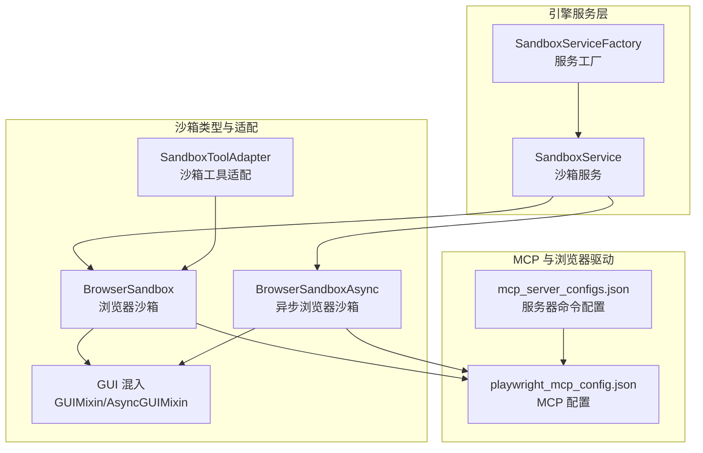
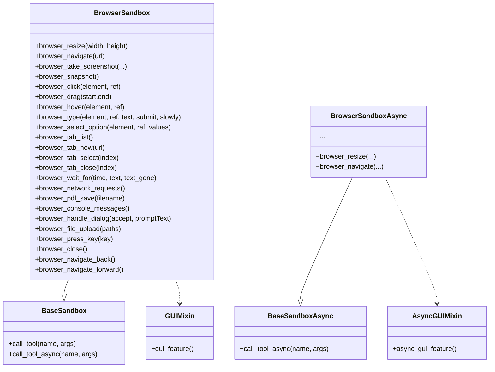
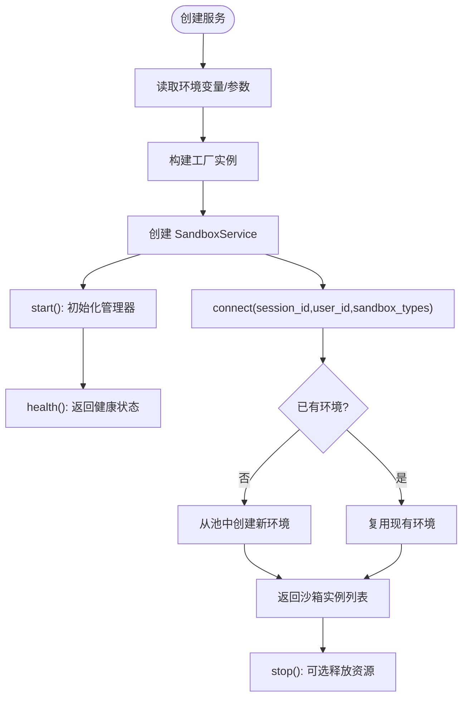
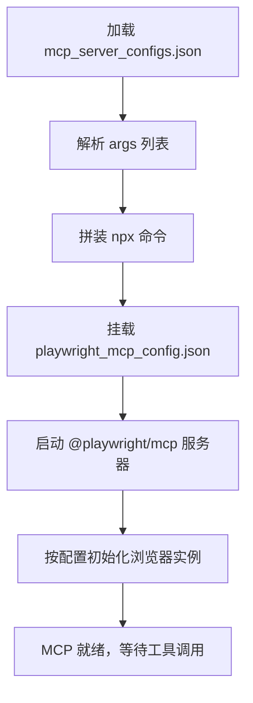
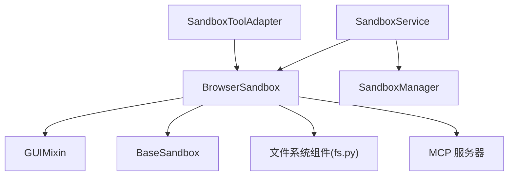

# 浏览器沙箱

<cite>
**本文引用的文件**
- [browser_sandbox.py](file://src/agentscope_runtime/sandbox/box/browser/browser_sandbox.py)
- [playwright_mcp_config.json](file://src/agentscope_runtime/sandbox/box/browser/box/playwright_mcp_config.json)
- [mcp_server_configs.json](file://src/agentscope_runtime/sandbox/box/browser/box/mcp_server_configs.json)
- [sandbox_service.py](file://src/agentscope_runtime/engine/services/sandbox/sandbox_service.py)
- [sandbox_service_factory.py](file://src/agentscope_runtime/engine/services/sandbox/sandbox_service_factory.py)
- [base_sandbox.py](file://src/agentscope_runtime/sandbox/box/base/base_sandbox.py)
- [fs.py](file://src/agentscope_runtime/sandbox/box/components/fs.py)
- [sandbox_tool.py](file://src/agentscope_runtime/adapters/agentscope/tool/sandbox_tool.py)
- [README_zh.md](file://examples/sandbox/custom_sandbox/README.md)
- [playwright_mcp_config.json（示例）](file://examples/sandbox/custom_sandbox/box/playwright_mcp_config.json)
- [mcp_server_configs.json（示例）](file://examples/sandbox/custom_sandbox/box/mcp_server_configs.json)
</cite>

## 目录
1. [简介](#简介)
2. [项目结构](#项目结构)
3. [核心组件](#核心组件)
4. [架构总览](#架构总览)
5. [详细组件分析](#详细组件分析)
6. [依赖分析](#依赖分析)
7. [性能考虑](#性能考虑)
8. [故障排查指南](#故障排查指南)
9. [结论](#结论)
10. [附录](#附录)

## 简介
本技术文档围绕浏览器沙箱展开，系统性阐述基于 Playwright 的自动化能力与 MCP 协议支持，覆盖浏览器实例管理、页面操作、网络拦截、MCP 服务器配置、浏览器驱动与自动化脚本编写，以及网页渲染、JavaScript 执行与跨域处理策略。同时提供配置参数、性能监控与并发控制指南，并总结网页自动化、数据抓取与测试场景的最佳实践，最后给出浏览器兼容性、内存泄漏与超时问题的解决方案。

## 项目结构
浏览器沙箱位于运行时引擎的沙箱子系统中，采用“按功能模块分层”的组织方式：顶层为引擎服务层，中间为沙箱类型与工具适配层，底层为具体沙箱实现与 MCP 配置。浏览器沙箱通过 GUI 混入类提供图形化能力，结合 MCP 服务器实现 Playwright 自动化。



图表来源
- [sandbox_service.py:11-238](file://src/agentscope_runtime/engine/services/sandbox/sandbox_service.py#L11-L238)
- [browser_sandbox.py:38-498](file://src/agentscope_runtime/sandbox/box/browser/browser_sandbox.py#L38-L498)
- [playwright_mcp_config.json:1-23](file://src/agentscope_runtime/sandbox/box/browser/box/playwright_mcp_config.json#L1-L23)
- [mcp_server_configs.json:1-14](file://src/agentscope_runtime/sandbox/box/browser/box/mcp_server_configs.json#L1-L14)

章节来源
- [sandbox_service.py:11-238](file://src/agentscope_runtime/engine/services/sandbox/sandbox_service.py#L11-L238)
- [browser_sandbox.py:38-498](file://src/agentscope_runtime/sandbox/box/browser/browser_sandbox.py#L38-L498)
- [playwright_mcp_config.json:1-23](file://src/agentscope_runtime/sandbox/box/browser/box/playwright_mcp_config.json#L1-L23)
- [mcp_server_configs.json:1-14](file://src/agentscope_runtime/sandbox/box/browser/box/mcp_server_configs.json#L1-L14)

## 核心组件
- 浏览器沙箱类：封装浏览器窗口尺寸调整、导航、历史前进后退、截图、PDF 导出、元素点击/拖拽/悬停、文本输入、选项选择、标签页管理、等待策略等操作；提供同步与异步两类实现。
- 沙箱服务：负责会话上下文管理、环境创建与连接、资源释放与健康检查；支持嵌入式与远程模式。
- MCP 服务器配置：定义 Playwright MCP 服务器启动命令、参数与配置文件路径；浏览器配置文件指定浏览器名称、启动参数、上下文视口与能力集。
- 工具适配：将沙箱能力映射为工具接口，供上层代理或工作流调用。

章节来源
- [browser_sandbox.py:55-301](file://src/agentscope_runtime/sandbox/box/browser/browser_sandbox.py#L55-L301)
- [browser_sandbox.py:328-497](file://src/agentscope_runtime/sandbox/box/browser/browser_sandbox.py#L328-L497)
- [sandbox_service.py:11-238](file://src/agentscope_runtime/engine/services/sandbox/sandbox_service.py#L11-L238)
- [playwright_mcp_config.json:1-23](file://src/agentscope_runtime/sandbox/box/browser/box/playwright_mcp_config.json#L1-L23)
- [mcp_server_configs.json:1-14](file://src/agentscope_runtime/sandbox/box/browser/box/mcp_server_configs.json#L1-L14)

## 架构总览
浏览器沙箱通过服务层统一接入，使用注册表与工厂创建具体沙箱实例；浏览器沙箱在 GUI 混入的基础上，通过 MCP 服务器与 Playwright 进行通信，完成页面渲染、交互与网络拦截等任务。

```mermaid
sequenceDiagram
participant Client as "客户端/代理"
participant Service as "SandboxService"
participant Manager as "SandboxManager"
participant Box as "BrowserSandbox/BrowserSandboxAsync"
participant MCP as "MCP 服务器"
participant PW as "Playwright"
Client->>Service : 创建/连接会话
Service->>Manager : 获取/创建环境
Manager-->>Service : 返回环境ID
Service->>Box : 实例化浏览器沙箱
Box->>MCP : 初始化并加载配置
MCP->>PW : 启动浏览器实例
Client->>Box : 发起页面操作导航/截图/等待等
Box->>MCP : 调用工具方法
MCP->>PW : 执行 Playwright 命令
PW-->>MCP : 返回结果
MCP-->>Box : 返回结果
Box-->>Client : 返回结果
```

图表来源
- [sandbox_service.py:82-142](file://src/agentscope_runtime/engine/services/sandbox/sandbox_service.py#L82-L142)
- [browser_sandbox.py:38-498](file://src/agentscope_runtime/sandbox/box/browser/browser_sandbox.py#L38-L498)
- [playwright_mcp_config.json:1-23](file://src/agentscope_runtime/sandbox/box/browser/box/playwright_mcp_config.json#L1-L23)
- [mcp_server_configs.json:1-14](file://src/agentscope_runtime/sandbox/box/browser/box/mcp_server_configs.json#L1-L14)

## 详细组件分析

### 浏览器沙箱类族
浏览器沙箱提供丰富的页面操作接口，包括窗口尺寸调整、导航、历史控制、网络请求查询、PDF 导出、截图、可访问性快照、元素交互（点击/拖拽/悬停）、文本输入、下拉框选择、标签页管理与等待策略。同步与异步版本分别对应不同的调用路径，确保在不同运行环境中的一致行为。



图表来源
- [browser_sandbox.py:38-498](file://src/agentscope_runtime/sandbox/box/browser/browser_sandbox.py#L38-L498)
- [base_sandbox.py](file://src/agentscope_runtime/sandbox/box/base/base_sandbox.py)

章节来源
- [browser_sandbox.py:55-301](file://src/agentscope_runtime/sandbox/box/browser/browser_sandbox.py#L55-L301)
- [browser_sandbox.py:328-497](file://src/agentscope_runtime/sandbox/box/browser/browser_sandbox.py#L328-L497)

### 沙箱服务与工厂
沙箱服务负责会话上下文的创建与连接、环境池化与回收、健康状态维护；工厂支持从环境变量与关键字参数两种方式创建服务实例，并可注册自定义后端。该设计使浏览器沙箱可在嵌入式或远程模式下灵活部署。



图表来源
- [sandbox_service.py:48-102](file://src/agentscope_runtime/engine/services/sandbox/sandbox_service.py#L48-L102)
- [sandbox_service_factory.py:9-49](file://src/agentscope_runtime/engine/services/sandbox/sandbox_service_factory.py#L9-L49)

章节来源
- [sandbox_service.py:11-238](file://src/agentscope_runtime/engine/services/sandbox/sandbox_service.py#L11-L238)
- [sandbox_service_factory.py:9-49](file://src/agentscope_runtime/engine/services/sandbox/sandbox_service_factory.py#L9-L49)

### MCP 服务器与浏览器驱动配置
MCP 服务器通过命令行启动 Playwright MCP，加载浏览器配置文件以设置浏览器名称、启动参数、上下文视口与能力集；服务器配置文件定义了 npx 命令及参数，确保在容器内正确挂载与解析配置路径。



图表来源
- [mcp_server_configs.json:1-14](file://src/agentscope_runtime/sandbox/box/browser/box/mcp_server_configs.json#L1-L14)
- [playwright_mcp_config.json:1-23](file://src/agentscope_runtime/sandbox/box/browser/box/playwright_mcp_config.json#L1-L23)

章节来源
- [mcp_server_configs.json:1-14](file://src/agentscope_runtime/sandbox/box/browser/box/mcp_server_configs.json#L1-L14)
- [playwright_mcp_config.json:1-23](file://src/agentscope_runtime/sandbox/box/browser/box/playwright_mcp_config.json#L1-L23)
- [playwright_mcp_config.json（示例）:1-23](file://examples/sandbox/custom_sandbox/box/playwright_mcp_config.json#L1-L23)
- [mcp_server_configs.json（示例）:1-14](file://examples/sandbox/custom_sandbox/box/mcp_server_configs.json#L1-L14)

### 页面操作与网络拦截流程
浏览器沙箱通过工具调用向 MCP 服务器发送指令，MCP 再交由 Playwright 执行具体动作；网络拦截可通过浏览器上下文配置实现，例如设置拦截规则、修改请求头或响应体，从而在自动化过程中进行数据抓取与行为控制。

```mermaid
sequenceDiagram
participant Agent as "代理/脚本"
participant Box as "BrowserSandbox"
participant Tool as "工具适配"
participant MCP as "MCP 服务器"
participant PW as "Playwright"
Agent->>Box : 调用 browser_navigate/url/... 等
Box->>Tool : 组装工具参数
Tool->>MCP : 发送工具请求
MCP->>PW : 执行页面操作
PW-->>MCP : 返回结果/事件
MCP-->>Tool : 返回结果
Tool-->>Box : 返回结果
Box-->>Agent : 返回结果
```

图表来源
- [browser_sandbox.py:104-110](file://src/agentscope_runtime/sandbox/box/browser/browser_sandbox.py#L104-L110)
- [sandbox_tool.py](file://src/agentscope_runtime/adapters/agentscope/tool/sandbox_tool.py)

章节来源
- [browser_sandbox.py:104-110](file://src/agentscope_runtime/sandbox/box/browser/browser_sandbox.py#L104-L110)
- [sandbox_tool.py](file://src/agentscope_runtime/adapters/agentscope/tool/sandbox_tool.py)

## 依赖分析
- 组件耦合：浏览器沙箱依赖 GUI 混入与基础沙箱类，通过工具调用与 MCP 服务器交互；沙箱服务负责生命周期与资源管理。
- 外部依赖：MCP 服务器依赖 Playwright，浏览器配置文件决定浏览器类型与上下文参数；文件系统组件用于工作区与输出目录管理。
- 接口契约：工具适配层将浏览器沙箱的操作映射为统一的工具接口，便于上层代理调用。



图表来源
- [browser_sandbox.py:38-498](file://src/agentscope_runtime/sandbox/box/browser/browser_sandbox.py#L38-L498)
- [fs.py](file://src/agentscope_runtime/sandbox/box/components/fs.py)
- [sandbox_service.py:11-238](file://src/agentscope_runtime/engine/services/sandbox/sandbox_service.py#L11-L238)
- [sandbox_tool.py](file://src/agentscope_runtime/adapters/agentscope/tool/sandbox_tool.py)

章节来源
- [browser_sandbox.py:38-498](file://src/agentscope_runtime/sandbox/box/browser/browser_sandbox.py#L38-L498)
- [fs.py](file://src/agentscope_runtime/sandbox/box/components/fs.py)
- [sandbox_service.py:11-238](file://src/agentscope_runtime/engine/services/sandbox/sandbox_service.py#L11-L238)
- [sandbox_tool.py](file://src/agentscope_runtime/adapters/agentscope/tool/sandbox_tool.py)

## 性能考虑
- 并发控制：通过沙箱服务的会话上下文与环境池化，限制同一会话内的并发沙箱数量，避免资源争用；在高并发场景下建议使用限流与队列策略。
- 资源管理：合理设置浏览器上下文视口大小与启动参数，减少内存占用；在停止服务时启用资源释放，防止泄漏。
- 网络拦截：在网络拦截策略中尽量缩小匹配范围，避免对所有请求进行深度处理；必要时缓存拦截结果以降低重复开销。
- 渲染与脚本：在自动化脚本中优先使用稳定的选择器与等待策略，减少不必要的重绘与回流；对长耗时操作设置超时与重试。

## 故障排查指南
- 浏览器启动失败：检查 MCP 服务器命令与参数是否正确，确认浏览器可执行路径与权限；核对浏览器配置文件中的启动选项与能力集。
- 页面操作超时：增加等待策略或调整超时时间；检查网络状况与目标站点响应速度；对动态内容使用更稳健的等待条件。
- 内存泄漏：定期释放沙箱资源，避免长时间持有多个标签页或上下文；监控进程内存使用，必要时重启浏览器实例。
- 跨域问题：在浏览器上下文中配置合适的请求头与凭据策略；对需要跨域的场景设置代理或 CORS 规则。
- 兼容性问题：针对不同浏览器版本验证自动化脚本；对不稳定的特性使用降级方案或条件判断。

## 结论
浏览器沙箱通过 MCP 协议与 Playwright 的结合，提供了强大的网页自动化能力。借助沙箱服务与工厂的统一接入，可以在多种运行环境中稳定地管理浏览器实例与页面操作。合理的配置与性能优化策略能够显著提升自动化效率与稳定性；完善的故障排查流程有助于快速定位与解决问题。

## 附录
- 示例与参考：可参考示例沙箱中的 MCP 配置与浏览器配置文件，了解如何在容器环境中挂载与加载配置。
- 最佳实践：在编写自动化脚本时，优先使用稳定的选择器与等待策略；对网络拦截与跨域处理采用最小化原则；在高并发场景下严格控制资源使用与释放。

章节来源
- [README_zh.md](file://examples/sandbox/custom_sandbox/README.md)
- [playwright_mcp_config.json（示例）:1-23](file://examples/sandbox/custom_sandbox/box/playwright_mcp_config.json#L1-L23)
- [mcp_server_configs.json（示例）:1-14](file://examples/sandbox/custom_sandbox/box/mcp_server_configs.json#L1-L14)