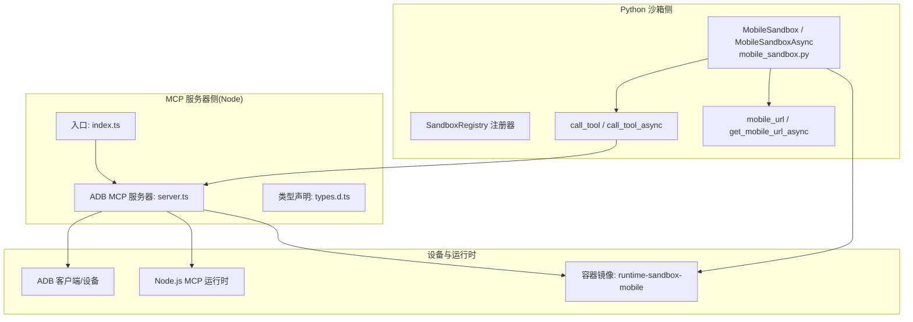
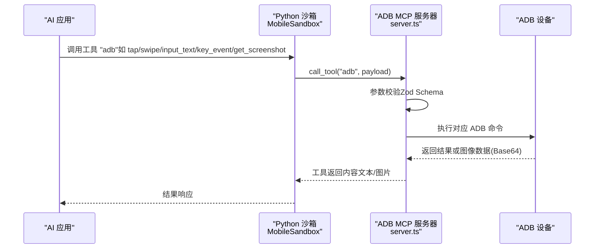
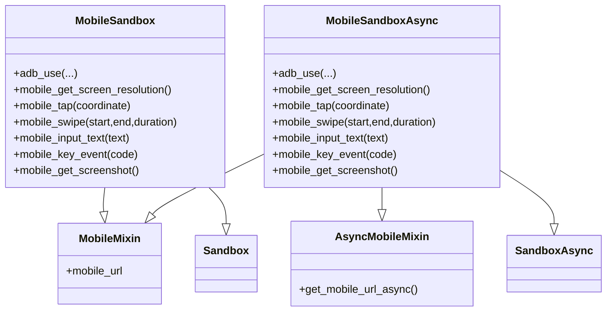
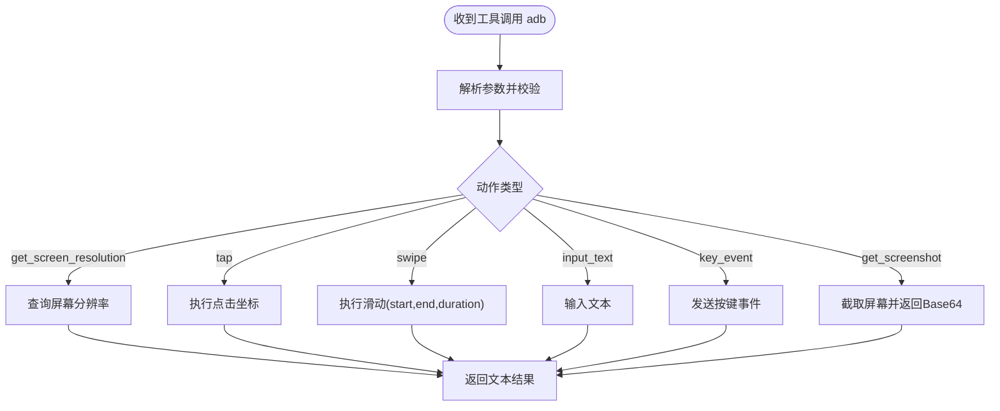
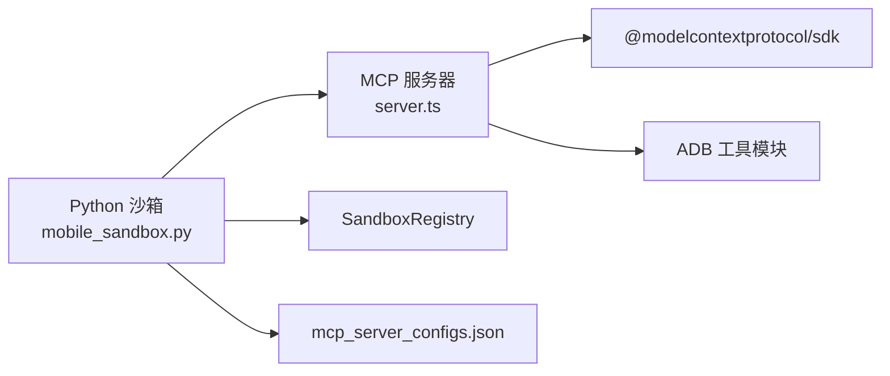

# 移动沙箱

<cite>
**本文引用的文件**
- [mobile_sandbox.py](file://src/agentscope_runtime/sandbox/box/mobile/mobile_sandbox.py)
- [index.ts](file://src/agentscope_runtime/sandbox/box/mobile/adbmcp/src/index.ts)
- [server.ts](file://src/agentscope_runtime/sandbox/box/mobile/adbmcp/src/server.ts)
- [types.d.ts](file://src/agentscope_runtime/sandbox/box/mobile/adbmcp/src/types.d.ts)
- [mcp_server_configs.json](file://src/agentscope_runtime/sandbox/box/mobile/box/mcp_server_configs.json)
- [__init__.py](file://src/agentscope_runtime/sandbox/box/mobile/__init__.py)
- [sandbox.md](file://cookbook/zh/sandbox/sandbox.md)
- [sandbox.md(en)](file://cookbook/en/sandbox/sandbox.md)
</cite>

## 目录
1. [简介](#简介)
2. [项目结构](#项目结构)
3. [核心组件](#核心组件)
4. [架构总览](#架构总览)
5. [详细组件分析](#详细组件分析)
6. [依赖分析](#依赖分析)
7. [性能考虑](#性能考虑)
8. [故障排查指南](#故障排查指南)
9. [结论](#结论)
10. [附录](#附录)

## 简介
本技术文档面向“移动沙箱”，系统性阐述其基于 ADB MCP 协议与移动端自动化能力的设计与实现，覆盖以下主题：
- Android 设备连接、应用安装与界面控制机制
- ADB MCP 服务器配置、设备发现与命令执行流程
- 触摸操作、滑动控制与按键模拟功能
- 移动沙箱的设备管理、应用测试与 UI 自动化指南
- 移动应用调试、性能测试与兼容性验证最佳实践
- 常见设备连接、权限授予与兼容性问题的解决方案

移动沙箱通过容器化的 Android 环境提供高安全级别的移动端自动化能力，并以 MCP（模型上下文协议）作为统一工具接入面，将 ADB 控制能力封装为可被 AI 应用调用的工具。

## 项目结构
移动沙箱位于沙箱体系的“box”层，核心由 Python 端的沙箱类与 Node.js 的 ADB MCP 服务器组成。Python 沙箱类负责生命周期管理、工具调用与 UI 访问；Node MCP 服务器负责解析工具请求、校验参数并调用底层 ADB 能力。

图表来源
- [mobile_sandbox.py:17-342](file://src/agentscope_runtime/sandbox/box/mobile/mobile_sandbox.py#L17-L342)
- [index.ts:1-22](file://src/agentscope_runtime/sandbox/box/mobile/adbmcp/src/index.ts#L1-L22)
- [server.ts:138-222](file://src/agentscope_runtime/sandbox/box/mobile/adbmcp/src/server.ts#L138-L222)
- [types.d.ts:1-33](file://src/agentscope_runtime/sandbox/box/mobile/adbmcp/src/types.d.ts#L1-L33)

章节来源
- [mobile_sandbox.py:1-342](file://src/agentscope_runtime/sandbox/box/mobile/mobile_sandbox.py#L1-L342)
- [index.ts:1-22](file://src/agentscope_runtime/sandbox/box/mobile/adbmcp/src/index.ts#L1-L22)
- [server.ts:1-222](file://src/agentscope_runtime/sandbox/box/mobile/adbmcp/src/server.ts#L1-L222)
- [types.d.ts:1-33](file://src/agentscope_runtime/sandbox/box/mobile/adbmcp/src/types.d.ts#L1-L33)
- [mcp_server_configs.json:1-10](file://src/agentscope_runtime/sandbox/box/mobile/box/mcp_server_configs.json#L1-L10)
- [__init__.py:1-4](file://src/agentscope_runtime/sandbox/box/mobile/__init__.py#L1-L4)

## 核心组件
- 移动沙箱类（同步/异步）：封装 ADB 工具调用、屏幕分辨率查询、点击、滑动、文本输入、按键事件与截图等能力，并提供 VNC/WebSockify 访问 URL。
- ADB MCP 服务器：基于 MCP SDK 实现，暴露名为“adb”的工具，支持 get_screen_resolution、tap、swipe、input_text、key_event、get_screenshot 等动作。
- 类型与接口：通过 TypeScript 声明 ADB 客户端接口，确保设备列表、shell、截屏等能力的类型安全。
- 配置与注册：沙箱通过注册表注册镜像、类型、超时与安全等级；MCP 服务器通过配置文件挂载到容器内并由 Node 启动。

章节来源
- [mobile_sandbox.py:80-342](file://src/agentscope_runtime/sandbox/box/mobile/mobile_sandbox.py#L80-L342)
- [server.ts:83-222](file://src/agentscope_runtime/sandbox/box/mobile/adbmcp/src/server.ts#L83-L222)
- [types.d.ts:1-33](file://src/agentscope_runtime/sandbox/box/mobile/adbmcp/src/types.d.ts#L1-L33)
- [mcp_server_configs.json:1-10](file://src/agentscope_runtime/sandbox/box/mobile/box/mcp_server_configs.json#L1-L10)

## 架构总览
移动沙箱采用“Python 沙箱 + Node MCP 服务器 + ADB 设备”的分层架构。Python 层负责编排与 UI 访问，MCP 层负责工具解析与设备交互，ADB 层负责实际的设备控制。

图表来源
- [mobile_sandbox.py:114-165](file://src/agentscope_runtime/sandbox/box/mobile/mobile_sandbox.py#L114-L165)
- [server.ts:150-222](file://src/agentscope_runtime/sandbox/box/mobile/adbmcp/src/server.ts#L150-L222)

## 详细组件分析

### 组件一：Python 移动沙箱类
- 职责
  - 提供同步与异步两类沙箱，均继承通用沙箱基类
  - 暴露 ADB 工具调用方法：adb_use、mobile_get_screen_resolution、mobile_tap、mobile_swipe、mobile_input_text、mobile_key_event、mobile_get_screenshot
  - 生成 VNC/WebSockify 访问 URL，便于远程查看设备 UI
  - 在首次初始化时进行宿主机就绪性检查（如 Binder/ASHMEM 模块）

- 关键设计点
  - 使用“adb”工具名统一调用，payload 中仅携带与 action 相关的参数
  - 异步版本提供对应的 async 方法，保持一致的 API 语义
  - 通过注册表注册镜像、类型、安全级别与运行时特权配置

图表来源
- [mobile_sandbox.py:17-342](file://src/agentscope_runtime/sandbox/box/mobile/mobile_sandbox.py#L17-L342)

章节来源
- [mobile_sandbox.py:17-342](file://src/agentscope_runtime/sandbox/box/mobile/mobile_sandbox.py#L17-L342)
- [__init__.py:1-4](file://src/agentscope_runtime/sandbox/box/mobile/__init__.py#L1-L4)

### 组件二：ADB MCP 服务器
- 职责
  - 作为 MCP 服务器，提供工具清单与工具调用处理
  - 对外暴露名为“adb”的工具，支持多种动作与参数校验
  - 将请求路由到具体的 ADB 操作（分辨率、点击、滑动、输入、按键、截图）

- 参数与行为
  - 动作集合：get_screen_resolution、tap、swipe、input_text、key_event、get_screenshot
  - 参数校验：使用 Zod Schema 确保输入合法
  - 返回格式：文本结果或 Base64 图片内容

图表来源
- [server.ts:14-81](file://src/agentscope_runtime/sandbox/box/mobile/adbmcp/src/server.ts#L14-L81)
- [server.ts:156-222](file://src/agentscope_runtime/sandbox/box/mobile/adbmcp/src/server.ts#L156-L222)

章节来源
- [server.ts:1-222](file://src/agentscope_runtime/sandbox/box/mobile/adbmcp/src/server.ts#L1-L222)
- [index.ts:1-22](file://src/agentscope_runtime/sandbox/box/mobile/adbmcp/src/index.ts#L1-L22)

### 组件三：类型与接口定义
- 目的
  - 通过 TypeScript 声明 ADB 客户端接口，确保设备列表、shell、截屏等能力的类型安全
  - 为 Node 端工具实现提供清晰的契约

章节来源
- [types.d.ts:1-33](file://src/agentscope_runtime/sandbox/box/mobile/adbmcp/src/types.d.ts#L1-L33)

### 组件四：MCP 服务器配置
- 目的
  - 在容器内启动 MCP 服务器，命令指向 Node 可执行文件与入口脚本
  - 通过配置文件挂载 Node 应用入口

章节来源
- [mcp_server_configs.json:1-10](file://src/agentscope_runtime/sandbox/box/mobile/box/mcp_server_configs.json#L1-L10)

## 依赖分析
- Python 沙箱依赖通用沙箱框架与注册表，提供统一的工具调用与生命周期管理
- MCP 服务器依赖 MCP SDK 与 ADB 工具模块，完成参数校验与设备控制
- 运行时依赖容器镜像与 Node 环境，以及宿主机的 Binder/ASHMEM 支持

图表来源
- [mobile_sandbox.py:1-342](file://src/agentscope_runtime/sandbox/box/mobile/mobile_sandbox.py#L1-L342)
- [server.ts:1-222](file://src/agentscope_runtime/sandbox/box/mobile/adbmcp/src/server.ts#L1-L222)
- [mcp_server_configs.json:1-10](file://src/agentscope_runtime/sandbox/box/mobile/box/mcp_server_configs.json#L1-L10)

章节来源
- [mobile_sandbox.py:1-342](file://src/agentscope_runtime/sandbox/box/mobile/mobile_sandbox.py#L1-L342)
- [server.ts:1-222](file://src/agentscope_runtime/sandbox/box/mobile/adbmcp/src/server.ts#L1-L222)
- [mcp_server_configs.json:1-10](file://src/agentscope_runtime/sandbox/box/mobile/box/mcp_server_configs.json#L1-L10)

## 性能考虑
- 截图与交互的频率控制：频繁截图会带来带宽与 CPU 开销，建议在关键步骤前后截图确认状态变化
- 滑动与点击的精度：尽量点击元素中心，减少误触导致的重试开销
- 异步调用：在高并发场景优先使用异步沙箱，提升吞吐
- 容器与宿主机资源：确保宿主机具备足够的 CPU/内存与 Binder/ASHMEM 支持，避免设备卡顿

## 故障排查指南
- 设备无法连接
  - 检查宿主机是否加载 Binder 与 ASHMEM 内核模块
  - 确认 MCP 服务器已启动且监听标准输入输出
- 权限与兼容性
  - 在 ARM64/AArch64 架构上可能遇到兼容性或性能问题，建议在 x86_64 上运行
- 常见错误定位
  - 工具参数校验失败：检查动作名称与参数类型是否符合要求
  - 截图为空：确认设备处于前台且有可见 UI；必要时先执行一次点击或按键唤醒界面

章节来源
- [sandbox.md(en):234-249](file://cookbook/en/sandbox/sandbox.md#L234-L249)
- [server.ts:156-222](file://src/agentscope_runtime/sandbox/box/mobile/adbmcp/src/server.ts#L156-L222)

## 结论
移动沙箱通过“Python 沙箱 + ADB MCP 服务器 + ADB 设备”的分层设计，提供了稳定、可扩展的移动端自动化能力。借助 MCP 协议，AI 应用可以以统一方式调用 ADB 工具，完成从设备连接、界面控制到截图观察的全链路自动化。结合合理的性能优化与故障排查策略，可在真实业务场景中高效落地移动应用测试、调试与兼容性验证。

## 附录
- 使用建议
  - 先获取屏幕分辨率与截图，再进行精确点击与滑动
  - 文本输入前需先聚焦目标输入框
  - 导航使用按键事件（如返回、主页、回车），避免误触
- 参考资料
  - 沙箱文档（中文）：[sandbox.md](file://cookbook/zh/sandbox/sandbox.md)
  - 沙箱文档（英文）：[sandbox.md(en)](file://cookbook/en/sandbox/sandbox.md)