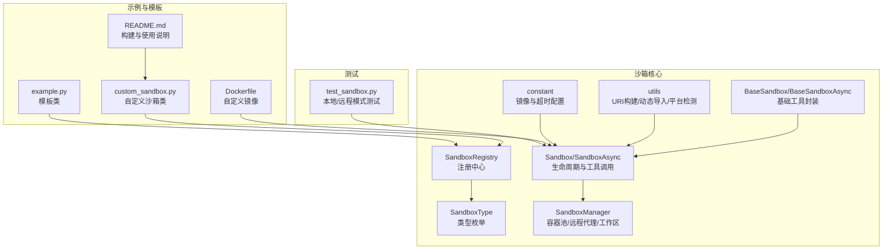
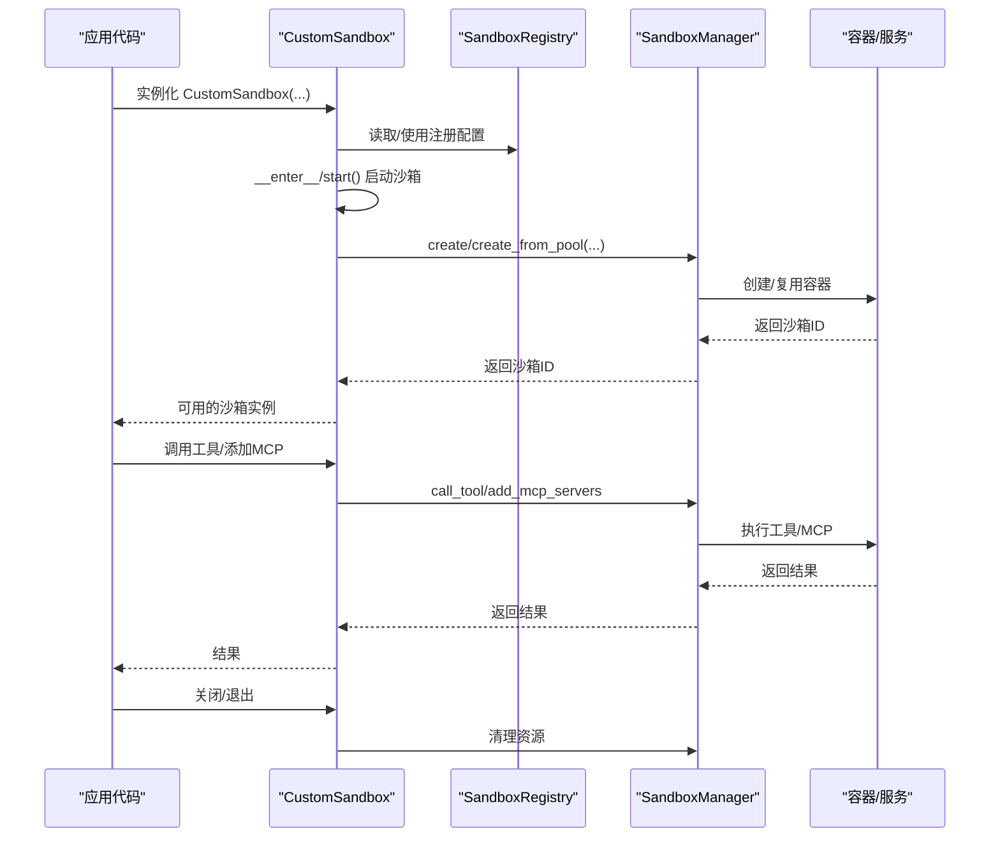
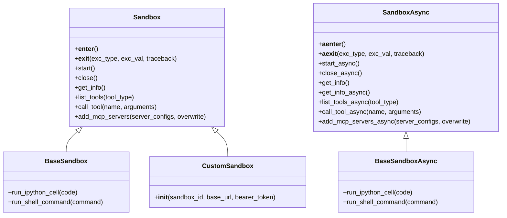
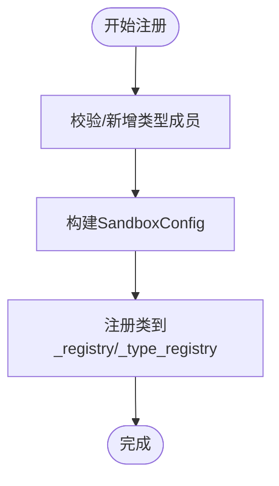
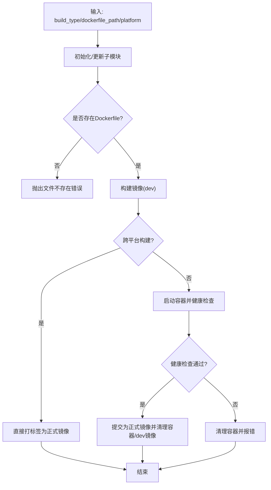
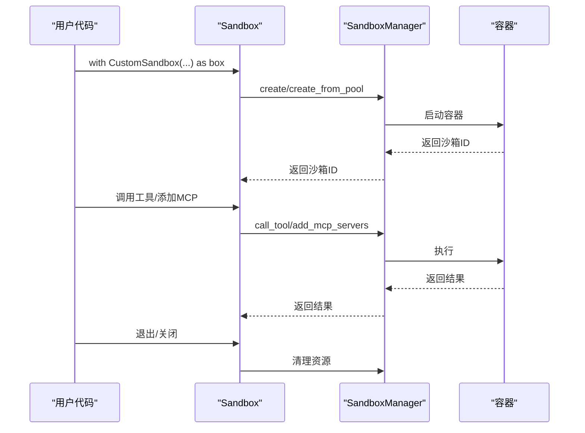
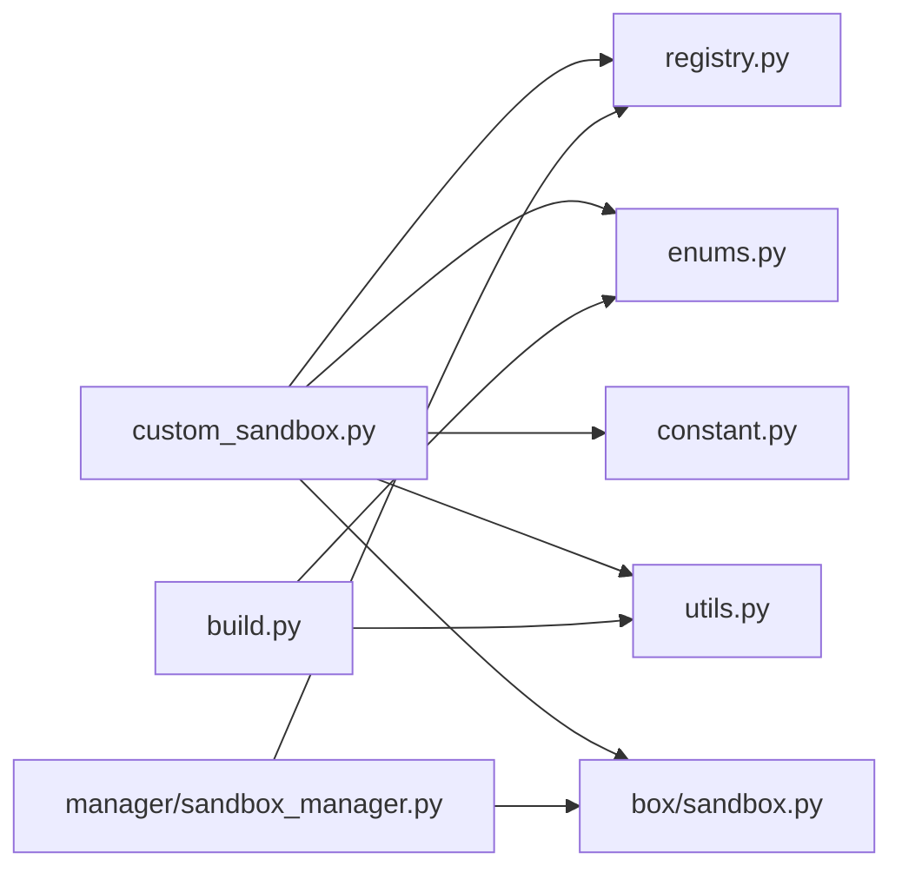

# 自定义沙箱

<cite>
**本文引用的文件**
- [src/agentscope_runtime/sandbox/custom/custom_sandbox.py](file://src/agentscope_runtime/sandbox/custom/custom_sandbox.py)
- [src/agentscope_runtime/sandbox/custom/example.py](file://src/agentscope_runtime/sandbox/custom/example.py)
- [src/agentscope_runtime/sandbox/box/base/base_sandbox.py](file://src/agentscope_runtime/sandbox/box/base/base_sandbox.py)
- [src/agentscope_runtime/sandbox/box/sandbox.py](file://src/agentscope_runtime/sandbox/box/sandbox.py)
- [src/agentscope_runtime/sandbox/registry.py](file://src/agentscope_runtime/sandbox/registry.py)
- [src/agentscope_runtime/sandbox/enums.py](file://src/agentscope_runtime/sandbox/enums.py)
- [src/agentscope_runtime/sandbox/build.py](file://src/agentscope_runtime/sandbox/build.py)
- [src/agentscope_runtime/sandbox/utils.py](file://src/agentscope_runtime/sandbox/utils.py)
- [src/agentscope_runtime/sandbox/constant.py](file://src/agentscope_runtime/sandbox/constant.py)
- [src/agentscope_runtime/sandbox/manager/sandbox_manager.py](file://src/agentscope_runtime/sandbox/manager/sandbox_manager.py)
- [examples/sandbox/custom_sandbox/README.md](file://examples/sandbox/custom_sandbox/README.md)
- [examples/sandbox/custom_sandbox/Dockerfile](file://examples/sandbox/custom_sandbox/Dockerfile)
- [tests/sandbox/test_sandbox.py](file://tests/sandbox/test_sandbox.py)
</cite>

## 目录
1. [简介](#简介)
2. [项目结构](#项目结构)
3. [核心组件](#核心组件)
4. [架构总览](#架构总览)
5. [详细组件分析](#详细组件分析)
6. [依赖分析](#依赖分析)
7. [性能考虑](#性能考虑)
8. [故障排查指南](#故障排查指南)
9. [结论](#结论)
10. [附录](#附录)

## 简介
本技术文档面向需要创建“自定义沙箱”的开发者，系统阐述自定义沙箱的开发框架、扩展机制与实现路径。内容覆盖从沙箱类继承、注册表配置、Docker 镜像构建到运行时生命周期管理与远程/嵌入式模式的使用方式，并提供可操作的开发指南、测试方法与调试技巧，帮助在保证扩展性、兼容性与可维护性的前提下快速落地。

## 项目结构
自定义沙箱能力由以下模块协同实现：
- 沙箱基类与派生：Sandbox/SandboxAsync 提供统一的生命周期、工具调用与资源清理能力；BaseSandbox/BaseSandboxAsync 提供基础工具封装。
- 注册中心：SandboxRegistry 统一注册沙箱类型、镜像、超时、环境变量等元信息。
- 枚举与常量：SandboxType 定义内置类型；constant 提供镜像仓库、命名空间、标签与默认超时。
- 构建工具：build.py 提供镜像构建、健康检查、容器运行与提交流程。
- 示例与模板：custom_sandbox 示例展示如何编写自定义沙箱类与 Dockerfile；example 提供模板类（抛出未实现异常）便于参考。
- 测试与使用：tests/sandbox/test_sandbox.py 展示本地与远程模式的使用方式。

图表来源
- [src/agentscope_runtime/sandbox/box/sandbox.py:148-313](file://src/agentscope_runtime/sandbox/box/sandbox.py#L148-L313)
- [src/agentscope_runtime/sandbox/box/base/base_sandbox.py:18-102](file://src/agentscope_runtime/sandbox/box/base/base_sandbox.py#L18-L102)
- [src/agentscope_runtime/sandbox/registry.py:33-131](file://src/agentscope_runtime/sandbox/registry.py#L33-L131)
- [src/agentscope_runtime/sandbox/enums.py:61-80](file://src/agentscope_runtime/sandbox/enums.py#L61-L80)
- [src/agentscope_runtime/sandbox/constant.py:1-32](file://src/agentscope_runtime/sandbox/constant.py#L1-L32)
- [src/agentscope_runtime/sandbox/utils.py:11-109](file://src/agentscope_runtime/sandbox/utils.py#L11-L109)
- [src/agentscope_runtime/sandbox/manager/sandbox_manager.py:140-200](file://src/agentscope_runtime/sandbox/manager/sandbox_manager.py#L140-L200)
- [src/agentscope_runtime/sandbox/custom/custom_sandbox.py:15-39](file://src/agentscope_runtime/sandbox/custom/custom_sandbox.py#L15-L39)
- [src/agentscope_runtime/sandbox/custom/example.py:13-36](file://src/agentscope_runtime/sandbox/custom/example.py#L13-L36)
- [examples/sandbox/custom_sandbox/Dockerfile:1-84](file://examples/sandbox/custom_sandbox/Dockerfile#L1-L84)
- [examples/sandbox/custom_sandbox/README.md:1-184](file://examples/sandbox/custom_sandbox/README.md#L1-L184)
- [tests/sandbox/test_sandbox.py:29-63](file://tests/sandbox/test_sandbox.py#L29-L63)

章节来源
- [src/agentscope_runtime/sandbox/box/sandbox.py:148-313](file://src/agentscope_runtime/sandbox/box/sandbox.py#L148-L313)
- [src/agentscope_runtime/sandbox/registry.py:33-131](file://src/agentscope_runtime/sandbox/registry.py#L33-L131)
- [examples/sandbox/custom_sandbox/README.md:1-184](file://examples/sandbox/custom_sandbox/README.md#L1-L184)

## 核心组件
- 沙箱基类与异步基类
  - Sandbox/SandboxAsync：负责上下文进入/退出、显式启动/关闭、工具列表查询、工具调用、MCP 服务器注入、以及嵌入式/远程模式下的资源清理。
  - BaseSandbox/BaseSandboxAsync：在同步/异步基类基础上提供常用工具封装（如执行 IPython 单元、执行 Shell 命令），便于直接使用。
- 注册中心
  - SandboxRegistry.register 装饰器：将沙箱类与其镜像名、类型、安全级别、超时、描述、环境变量、运行时参数等绑定，建立类到配置的映射。
- 类型与常量
  - SandboxType：内置类型集合（含异步变体），支持动态新增成员。
  - constant：镜像仓库、命名空间、标签与默认超时时间。
- 工具与构建
  - utils：构建完整镜像 URI、动态导入扩展模块、HTTP 到 WS 协议转换、平台检测。
  - build：镜像构建、跨平台构建、容器运行、健康检查、提交最终镜像、清理 dev 镜像。
- 管理器
  - SandboxManager：统一管理容器池、远程/本地模式、心跳、工作区挂载、HTTP 远程代理等。

章节来源
- [src/agentscope_runtime/sandbox/box/sandbox.py:18-313](file://src/agentscope_runtime/sandbox/box/sandbox.py#L18-L313)
- [src/agentscope_runtime/sandbox/box/base/base_sandbox.py:18-102](file://src/agentscope_runtime/sandbox/box/base/base_sandbox.py#L18-L102)
- [src/agentscope_runtime/sandbox/registry.py:33-131](file://src/agentscope_runtime/sandbox/registry.py#L33-L131)
- [src/agentscope_runtime/sandbox/enums.py:61-80](file://src/agentscope_runtime/sandbox/enums.py#L61-L80)
- [src/agentscope_runtime/sandbox/constant.py:1-32](file://src/agentscope_runtime/sandbox/constant.py#L1-L32)
- [src/agentscope_runtime/sandbox/utils.py:11-109](file://src/agentscope_runtime/sandbox/utils.py#L11-L109)
- [src/agentscope_runtime/sandbox/build.py:137-434](file://src/agentscope_runtime/sandbox/build.py#L137-L434)
- [src/agentscope_runtime/sandbox/manager/sandbox_manager.py:140-200](file://src/agentscope_runtime/sandbox/manager/sandbox_manager.py#L140-L200)

## 架构总览
自定义沙箱的运行时架构分为三层：
- 应用层：用户通过自定义沙箱类（继承 Sandbox）进行实例化与使用。
- 框架层：SandboxRegistry 注册配置，SandboxType 统一类型标识，constant/constant 提供镜像与超时配置。
- 执行层：SandboxManager 管理容器池与远程代理；Sandbox 在嵌入式模式下直接调用本地管理器，在远程模式下通过 HTTP 代理调用。

图表来源
- [src/agentscope_runtime/sandbox/custom/custom_sandbox.py:26-39](file://src/agentscope_runtime/sandbox/custom/custom_sandbox.py#L26-L39)
- [src/agentscope_runtime/sandbox/registry.py:94-131](file://src/agentscope_runtime/sandbox/registry.py#L94-L131)
- [src/agentscope_runtime/sandbox/box/sandbox.py:148-220](file://src/agentscope_runtime/sandbox/box/sandbox.py#L148-L220)
- [src/agentscope_runtime/sandbox/manager/sandbox_manager.py:140-200](file://src/agentscope_runtime/sandbox/manager/sandbox_manager.py#L140-L200)

## 详细组件分析

### 自定义沙箱类与注册机制
- 继承关系
  - 自定义沙箱类需继承自 Sandbox，并通过 @SandboxRegistry.register 装饰器完成注册。
  - 注册时指定镜像名、类型、安全级别、超时、描述、环境变量等。
- 接口实现要点
  - 构造函数接收 sandbox_id、base_url、bearer_token 等参数，随后调用父类构造以完成类型绑定与管理器初始化。
  - 若需要在嵌入式模式下挂载工作区目录，可通过 workspace_dir 参数传入。
- 示例与模板
  - custom_sandbox.py：完整的自定义沙箱类示例，包含环境变量注入与超时设置。
  - example.py：模板类，抛出未实现异常，便于复制并实现具体功能。

图表来源
- [src/agentscope_runtime/sandbox/box/sandbox.py:148-313](file://src/agentscope_runtime/sandbox/box/sandbox.py#L148-L313)
- [src/agentscope_runtime/sandbox/box/base/base_sandbox.py:18-102](file://src/agentscope_runtime/sandbox/box/base/base_sandbox.py#L18-L102)
- [src/agentscope_runtime/sandbox/custom/custom_sandbox.py:26-39](file://src/agentscope_runtime/sandbox/custom/custom_sandbox.py#L26-L39)

章节来源
- [src/agentscope_runtime/sandbox/custom/custom_sandbox.py:15-39](file://src/agentscope_runtime/sandbox/custom/custom_sandbox.py#L15-L39)
- [src/agentscope_runtime/sandbox/custom/example.py:13-36](file://src/agentscope_runtime/sandbox/custom/example.py#L13-L36)
- [src/agentscope_runtime/sandbox/registry.py:33-131](file://src/agentscope_runtime/sandbox/registry.py#L33-L131)

### 注册中心与类型系统
- SandboxRegistry.register
  - 将目标类与其配置（镜像名、类型、资源限制、安全级别、超时、描述、环境变量、运行时参数）绑定。
  - 支持动态新增 SandboxType 成员，便于扩展自定义类型。
- SandboxType
  - 内置类型包括 base、browser、filesystem、gui、mobile、training 等，以及对应的异步变体。
  - 支持查询内置与动态成员，便于运行时选择与校验。

图表来源
- [src/agentscope_runtime/sandbox/registry.py:39-91](file://src/agentscope_runtime/sandbox/registry.py#L39-L91)
- [src/agentscope_runtime/sandbox/enums.py:19-59](file://src/agentscope_runtime/sandbox/enums.py#L19-L59)

章节来源
- [src/agentscope_runtime/sandbox/registry.py:33-131](file://src/agentscope_runtime/sandbox/registry.py#L33-L131)
- [src/agentscope_runtime/sandbox/enums.py:61-80](file://src/agentscope_runtime/sandbox/enums.py#L61-L80)

### 构建工具与镜像打包
- build_image
  - 支持内置与自定义镜像构建；自动初始化/更新子模块；按平台选择 docker 或 docker buildx。
  - 对于自定义镜像，要求提供 Dockerfile 路径；内置镜像通过类型推导路径。
  - 构建完成后在非跨平台场景下启动容器进行健康检查，成功后提交为正式镜像并清理 dev 镜像。
- 健康检查与端口发现
  - 自动寻找空闲端口；通过 /fastapi/healthz 健康端点轮询检查；失败则清理容器并报错。
- 平台与环境
  - 支持 linux/amd64 与 linux/arm64；根据宿主平台决定是否启用 buildx。
  - 支持通过环境变量控制镜像仓库、命名空间、标签与超时。

图表来源
- [src/agentscope_runtime/sandbox/build.py:137-434](file://src/agentscope_runtime/sandbox/build.py#L137-L434)

章节来源
- [src/agentscope_runtime/sandbox/build.py:137-434](file://src/agentscope_runtime/sandbox/build.py#L137-L434)
- [src/agentscope_runtime/sandbox/utils.py:11-109](file://src/agentscope_runtime/sandbox/utils.py#L11-L109)
- [src/agentscope_runtime/sandbox/constant.py:1-32](file://src/agentscope_runtime/sandbox/constant.py#L1-32)

### 生命周期与事件处理
- 上下文管理与信号处理
  - 嵌入式模式下注册 atexit 与信号处理器（SIGINT/SIGTERM），确保进程退出或收到终止信号时清理资源。
- 远程模式与本地模式
  - 通过 base_url 判定远程模式；远程模式下通过 HTTP 客户端代理调用；本地模式下通过 SandboxManager 管理容器池。
- 工具调用与 MCP 注入
  - 提供同步/异步工具调用与 MCP 服务器注入接口，便于扩展外部能力。

图表来源
- [src/agentscope_runtime/sandbox/box/sandbox.py:148-220](file://src/agentscope_runtime/sandbox/box/sandbox.py#L148-L220)
- [src/agentscope_runtime/sandbox/manager/sandbox_manager.py:140-200](file://src/agentscope_runtime/sandbox/manager/sandbox_manager.py#L140-L200)

章节来源
- [src/agentscope_runtime/sandbox/box/sandbox.py:105-146](file://src/agentscope_runtime/sandbox/box/sandbox.py#L105-L146)
- [src/agentscope_runtime/sandbox/box/sandbox.py:148-220](file://src/agentscope_runtime/sandbox/box/sandbox.py#L148-L220)
- [src/agentscope_runtime/sandbox/manager/sandbox_manager.py:140-200](file://src/agentscope_runtime/sandbox/manager/sandbox_manager.py#L140-L200)

### 配置选项与环境变量
- 注册配置项
  - image_name：镜像名称
  - sandbox_type：沙箱类型
  - resource_limits：CPU/内存限制
  - security_level：安全等级
  - timeout：服务端超时
  - description：描述
  - environment：环境变量字典
  - runtime_config：运行时参数（如 mem_limit、nano_cpus）
- 常量与环境变量
  - RUNTIME_SANDBOX_REGISTRY：镜像仓库
  - RUNTIME_SANDBOX_IMAGE_NAMESPACE：命名空间
  - RUNTIME_SANDBOX_IMAGE_TAG：标签
  - RUNTIME_SANDBOX_TIMEOUT：默认超时

章节来源
- [src/agentscope_runtime/sandbox/registry.py:9-31](file://src/agentscope_runtime/sandbox/registry.py#L9-L31)
- [src/agentscope_runtime/sandbox/constant.py:8-32](file://src/agentscope_runtime/sandbox/constant.py#L8-L32)

### 开发指南与最佳实践
- 创建自定义沙箱类
  - 继承 Sandbox，使用 @SandboxRegistry.register 装饰器注册，填写镜像名、类型、超时、描述与环境变量。
  - 将文件放置于 src/agentscope_runtime/sandbox/custom 下，遵循命名规范。
- 准备 Docker 镜像
  - 使用 examples/sandbox/custom_sandbox/Dockerfile 作为模板，按需增删依赖与工具。
  - 注意环境变量（如 API Key）的注入与敏感信息的安全管理。
- 构建与验证
  - 使用 runtime-sandbox-builder 命令构建镜像，或调用 build_image 进行程序化构建。
  - 非跨平台构建会自动运行容器并进行健康检查，确保镜像可用。
- 使用方式
  - 本地模式：直接 with CustomSandbox() 使用；支持 workspace_dir 挂载本地工作区。
  - 远程模式：通过 base_url 与 bearer_token 指向远端 SandboxManager 服务。

章节来源
- [examples/sandbox/custom_sandbox/README.md:23-184](file://examples/sandbox/custom_sandbox/README.md#L23-L184)
- [examples/sandbox/custom_sandbox/Dockerfile:1-84](file://examples/sandbox/custom_sandbox/Dockerfile#L1-L84)
- [src/agentscope_runtime/sandbox/build.py:371-434](file://src/agentscope_runtime/sandbox/build.py#L371-L434)

### 测试方法与调试技巧
- 本地测试
  - 使用 tests/sandbox/test_sandbox.py 中的用例，验证本地与远程模式下的工具调用与生命周期行为。
- 远程测试
  - 先启动 runtime-sandbox-server，再以 base_url 指向本地服务进行测试。
- 调试建议
  - 关注日志输出与异常栈；嵌入式模式下信号处理与 atexit 清理逻辑有助于定位资源泄漏。
  - Docker 构建阶段若健康检查失败，检查容器内服务端口与认证头配置。

章节来源
- [tests/sandbox/test_sandbox.py:29-160](file://tests/sandbox/test_sandbox.py#L29-L160)

## 依赖分析
- 组件耦合
  - 自定义沙箱类仅依赖 Sandbox 基类与注册中心；注册中心依赖类型枚举与常量。
  - 构建工具与工具模块相互独立，但共同服务于镜像构建流程。
- 外部依赖
  - Docker 与 docker buildx（跨平台构建）
  - 远程模式依赖 HTTP 客户端与远端 SandboxManager 服务
- 循环依赖
  - 未见循环导入；各模块职责清晰，通过装饰器与工厂式注册降低耦合。

图表来源
- [src/agentscope_runtime/sandbox/custom/custom_sandbox.py:15-39](file://src/agentscope_runtime/sandbox/custom/custom_sandbox.py#L15-L39)
- [src/agentscope_runtime/sandbox/registry.py:33-131](file://src/agentscope_runtime/sandbox/registry.py#L33-L131)
- [src/agentscope_runtime/sandbox/enums.py:61-80](file://src/agentscope_runtime/sandbox/enums.py#L61-L80)
- [src/agentscope_runtime/sandbox/constant.py:1-32](file://src/agentscope_runtime/sandbox/constant.py#L1-L32)
- [src/agentscope_runtime/sandbox/utils.py:11-109](file://src/agentscope_runtime/sandbox/utils.py#L11-L109)
- [src/agentscope_runtime/sandbox/box/sandbox.py:148-313](file://src/agentscope_runtime/sandbox/box/sandbox.py#L148-L313)
- [src/agentscope_runtime/sandbox/build.py:137-434](file://src/agentscope_runtime/sandbox/build.py#L137-L434)
- [src/agentscope_runtime/sandbox/manager/sandbox_manager.py:140-200](file://src/agentscope_runtime/sandbox/manager/sandbox_manager.py#L140-L200)

章节来源
- [src/agentscope_runtime/sandbox/registry.py:33-131](file://src/agentscope_runtime/sandbox/registry.py#L33-L131)
- [src/agentscope_runtime/sandbox/build.py:137-434](file://src/agentscope_runtime/sandbox/build.py#L137-L434)

## 性能考虑
- 容器池与复用
  - SandboxManager 支持容器池复用，默认类型可为单个或多个类型组合，减少冷启动开销。
- 资源限制
  - 通过 resource_limits 与 runtime_config 控制 CPU/内存配额，避免资源争用。
- 跨平台构建
  - 跨平台构建跳过健康检查与容器运行，缩短构建时间，但需确保镜像正确性。
- 超时与重试
  - constant 提供默认超时；远程模式下 HTTP 客户端也受 TIMEOUT 影响。

## 故障排查指南
- 构建失败
  - Dockerfile 路径错误：确认 --dockerfile_path 或内置路径推导正确。
  - 健康检查失败：检查容器内服务端口、认证头、日志输出。
  - 跨平台构建：若平台不匹配，启用 buildx 并指定目标平台。
- 运行期错误
  - 嵌入式模式下资源清理：确认 atexit 与信号处理已注册；必要时手动调用 close/close_async。
  - 远程模式下连接失败：检查 base_url 与 bearer_token；确认远端服务健康。
- 环境变量与镜像
  - 确认镜像中环境变量与注册配置一致；敏感信息避免硬编码在镜像中。

章节来源
- [src/agentscope_runtime/sandbox/build.py:54-76](file://src/agentscope_runtime/sandbox/build.py#L54-L76)
- [src/agentscope_runtime/sandbox/box/sandbox.py:105-146](file://src/agentscope_runtime/sandbox/box/sandbox.py#L105-L146)
- [src/agentscope_runtime/sandbox/manager/sandbox_manager.py:140-200](file://src/agentscope_runtime/sandbox/manager/sandbox_manager.py#L140-L200)

## 结论
自定义沙箱通过“类继承 + 注册中心 + 构建工具 + 管理器”的分层设计，提供了高扩展性与强隔离的执行环境。开发者只需专注于沙箱类的业务封装与 Dockerfile 的环境准备，即可快速完成从开发到部署的全链路闭环。配合完善的测试与调试手段，可在保证兼容性与可维护性的前提下高效迭代。

## 附录
- 快速开始
  - 安装（可编辑模式）以支持热更新与自定义沙箱注册。
  - 编写自定义沙箱类并注册，准备对应 Dockerfile。
  - 使用 runtime-sandbox-builder 构建镜像并通过本地/远程模式进行验证。
- 参考示例
  - examples/sandbox/custom_sandbox 提供完整的自定义沙箱示例与 Dockerfile。
  - tests/sandbox/test_sandbox.py 展示本地与远程模式的典型用法。

章节来源
- [examples/sandbox/custom_sandbox/README.md:5-22](file://examples/sandbox/custom_sandbox/README.md#L5-L22)
- [examples/sandbox/custom_sandbox/README.md:23-184](file://examples/sandbox/custom_sandbox/README.md#L23-L184)
- [tests/sandbox/test_sandbox.py:29-160](file://tests/sandbox/test_sandbox.py#L29-L160)