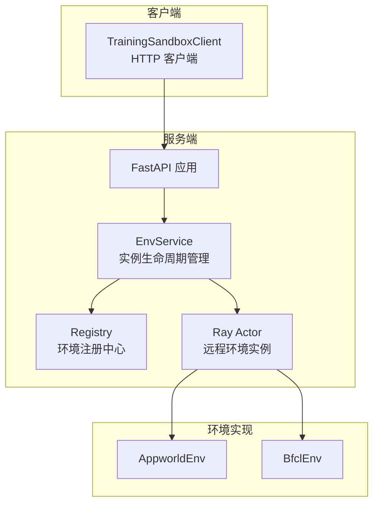
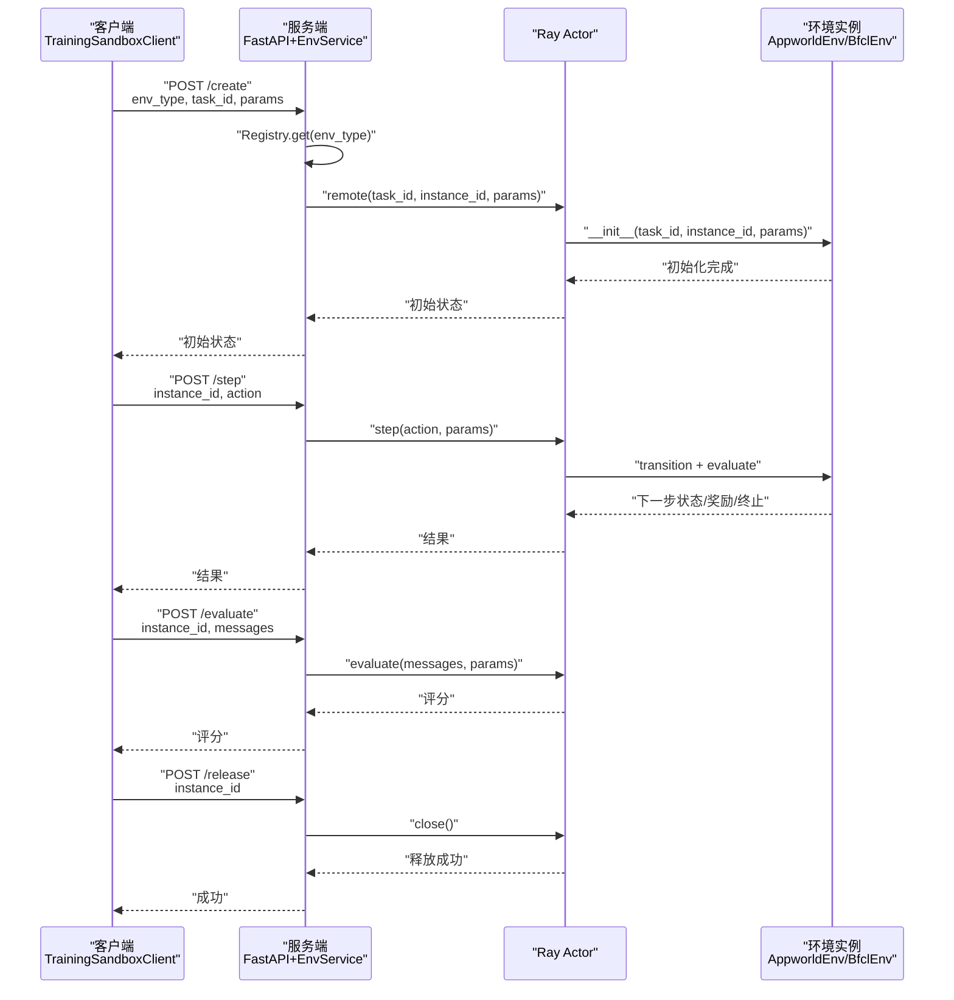
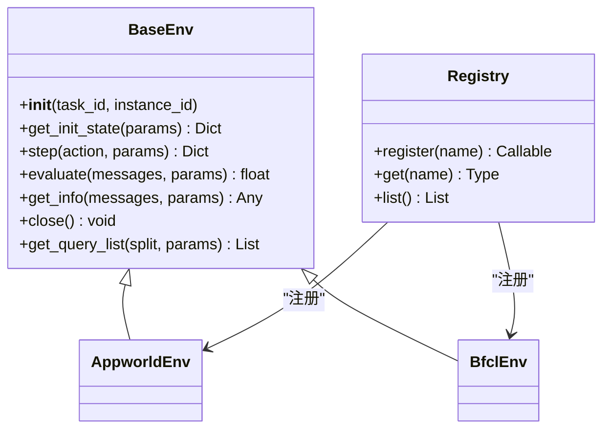
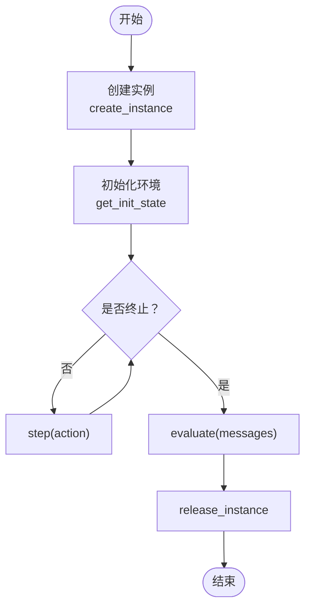
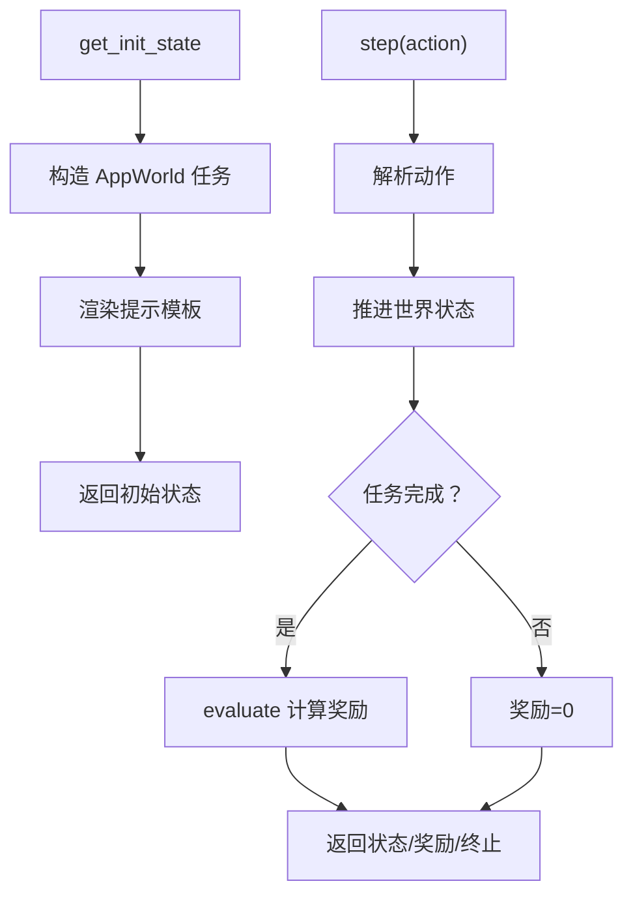
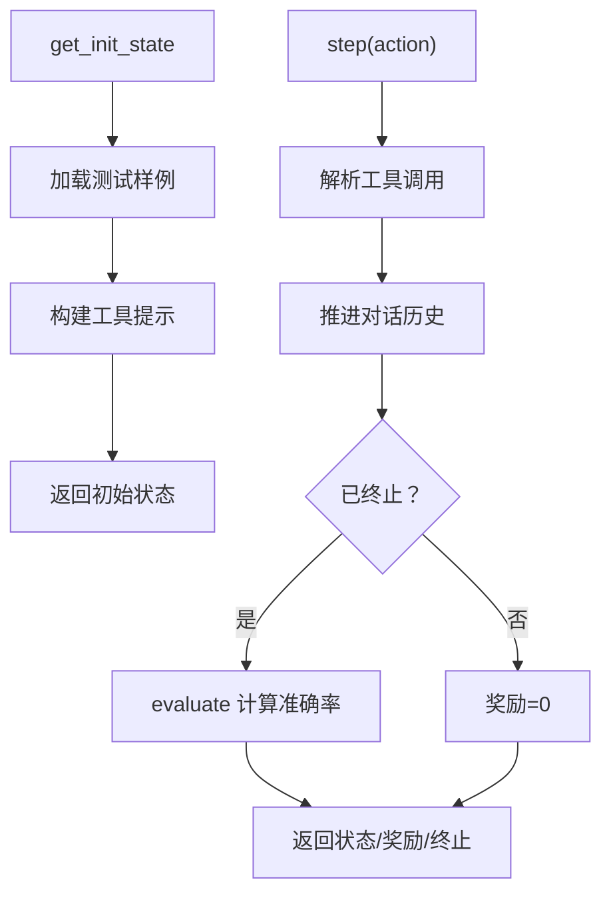
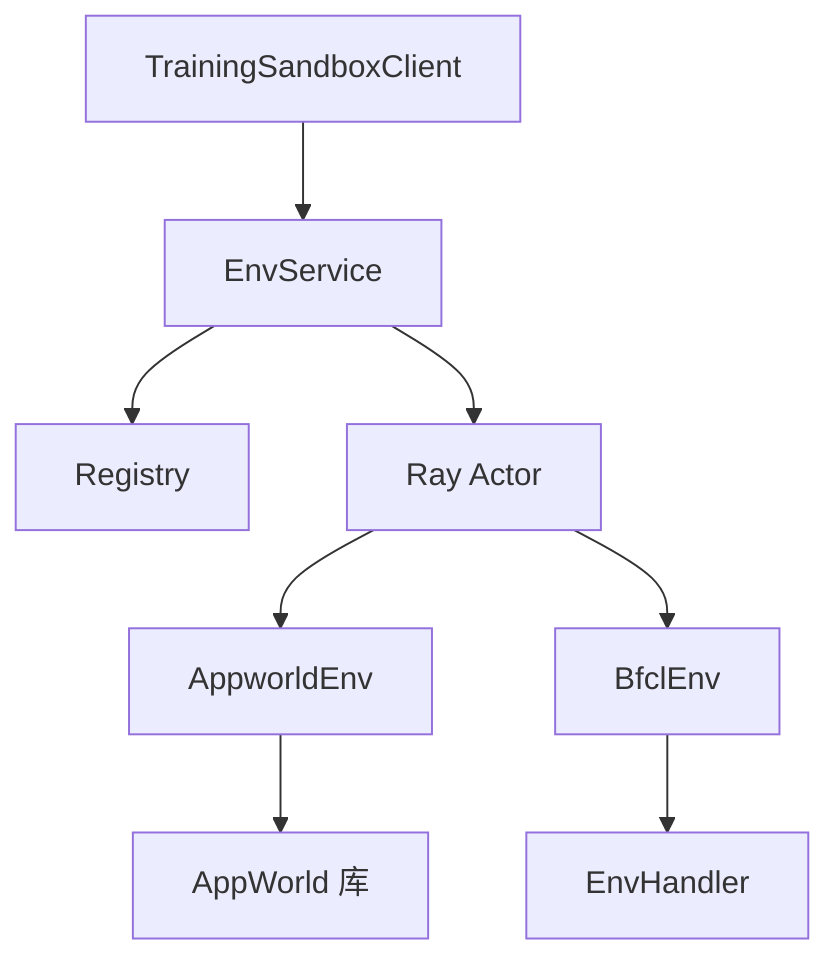

# 训练沙箱

<cite>
**本文引用的文件**
- [training_box.py](file://src/agentscope_runtime/sandbox/box/training_box/training_box.py)
- [base.py](file://src/agentscope_runtime/sandbox/box/training_box/base.py)
- [registry.py](file://src/agentscope_runtime/sandbox/box/training_box/registry.py)
- [env_service.py](file://src/agentscope_runtime/sandbox/box/training_box/env_service.py)
- [appworld_env.py](file://src/agentscope_runtime/sandbox/box/training_box/environments/appworld/appworld_env.py)
- [bfcl_env.py](file://src/agentscope_runtime/sandbox/box/training_box/environments/bfcl/bfcl_env.py)
- [training_client.py](file://src/agentscope_runtime/sandbox/client/training_client.py)
</cite>

## 目录
1. [简介](#简介)
2. [项目结构](#项目结构)
3. [核心组件](#核心组件)
4. [架构总览](#架构总览)
5. [详细组件分析](#详细组件分析)
6. [依赖分析](#依赖分析)
7. [性能考虑](#性能考虑)
8. [故障排查指南](#故障排查指南)
9. [结论](#结论)
10. [附录](#附录)

## 简介
本文件面向“训练沙箱”子系统，系统性阐述其作为强化学习与智能体训练基础设施的设计与实现。重点覆盖以下方面：
- 强化学习环境与智能体训练框架：抽象基类、环境生命周期、状态转移与奖励设计、评估接口。
- AppWorld 与 BFCM（BFCL）两类环境的实现原理与训练流程。
- 环境注册机制、任务调度与状态管理策略。
- 训练过程监控、奖励函数设计与收敛评估方法。
- 配置参数、超参数调优与结果分析指南。
- 智能体训练、算法比较与性能基准测试的最佳实践。
- 训练稳定性、收敛速度与过拟合问题的应对建议。

## 项目结构
训练沙箱位于 sandbox/box/training_box 目录下，采用“服务端 + 客户端 + 环境实现”的分层组织方式：
- 服务端：FastAPI 应用与 EnvService，负责环境实例的创建、执行、评估与释放，并通过 Ray 进行远程环境实例化与隔离。
- 客户端：TrainingSandboxClient，封装对服务端的 HTTP 调用，提供统一的工具调用接口。
- 环境实现：AppWorld 与 BFCM（BFCL）环境，分别继承 BaseEnv 抽象基类并注册到 Registry 中。
- 注册中心：Registry 提供按名称注册与获取环境类的能力。

图表来源
- [env_service.py:472-753](file://src/agentscope_runtime/sandbox/box/training_box/env_service.py#L472-L753)
- [training_client.py:15-265](file://src/agentscope_runtime/sandbox/client/training_client.py#L15-L265)
- [registry.py:11-55](file://src/agentscope_runtime/sandbox/box/training_box/registry.py#L11-L55)
- [appworld_env.py:712-745](file://src/agentscope_runtime/sandbox/box/training_box/environments/appworld/appworld_env.py#L712-L745)
- [bfcl_env.py:181-254](file://src/agentscope_runtime/sandbox/box/training_box/environments/bfcl/bfcl_env.py#L181-L254)

章节来源
- [training_box.py:18-295](file://src/agentscope_runtime/sandbox/box/training_box/training_box.py#L18-L295)
- [env_service.py:123-470](file://src/agentscope_runtime/sandbox/box/training_box/env_service.py#L123-L470)
- [training_client.py:15-265](file://src/agentscope_runtime/sandbox/client/training_client.py#L15-L265)

## 核心组件
- 抽象基类 BaseEnv：定义环境的统一接口，包括初始化状态、一步转移、评估与信息查询等。
- 注册中心 Registry：以名称注册并检索环境类，确保运行时可按 env_type 动态加载。
- 服务端 EnvService：基于 FastAPI 提供 REST 接口；使用 Ray 将环境实例化为远程 Actor，实现资源隔离与并发管理。
- 客户端 TrainingSandboxClient：封装健康检查、实例创建、步进、评估与释放等操作。
- 具体环境 AppworldEnv 与 BfclEnv：分别对接 AppWorld 与 BFCL 数据集，实现状态构建、动作解析、对话轮次推进与评估。

章节来源
- [base.py:7-121](file://src/agentscope_runtime/sandbox/box/training_box/base.py#L7-L121)
- [registry.py:11-55](file://src/agentscope_runtime/sandbox/box/training_box/registry.py#L11-L55)
- [env_service.py:123-470](file://src/agentscope_runtime/sandbox/box/training_box/env_service.py#L123-L470)
- [training_client.py:15-265](file://src/agentscope_runtime/sandbox/client/training_client.py#L15-L265)
- [appworld_env.py:712-800](file://src/agentscope_runtime/sandbox/box/training_box/environments/appworld/appworld_env.py#L712-L800)
- [bfcl_env.py:181-381](file://src/agentscope_runtime/sandbox/box/training_box/environments/bfcl/bfcl_env.py#L181-L381)

## 架构总览
训练沙箱的整体交互流程如下：
- 客户端通过 HTTP 请求向服务端发起操作（创建实例、步进、评估、释放）。
- 服务端根据 env_type 获取对应环境类，使用 Ray 创建远程 Actor 实例。
- Actor 执行具体环境逻辑（如 AppWorld 的多步代码执行或 BFCL 的工具调用解析），返回状态、奖励与终止信号。
- 服务端定期清理长时间未访问的实例，避免资源泄漏。

图表来源
- [env_service.py:292-436](file://src/agentscope_runtime/sandbox/box/training_box/env_service.py#L292-L436)
- [training_client.py:146-205](file://src/agentscope_runtime/sandbox/client/training_client.py#L146-L205)
- [appworld_env.py:791-800](file://src/agentscope_runtime/sandbox/box/training_box/environments/appworld/appworld_env.py#L791-L800)
- [bfcl_env.py:256-274](file://src/agentscope_runtime/sandbox/box/training_box/environments/bfcl/bfcl_env.py#L256-L274)

## 详细组件分析

### 抽象基类与注册中心
- BaseEnv：定义 get_init_state、step、evaluate、get_info、close 以及静态方法 get_query_list，确保所有环境具备一致的训练接口。
- Registry：以名称注册环境类，支持动态导入与检索，便于扩展新环境类型。

图表来源
- [base.py:7-121](file://src/agentscope_runtime/sandbox/box/training_box/base.py#L7-L121)
- [registry.py:11-55](file://src/agentscope_runtime/sandbox/box/training_box/registry.py#L11-L55)
- [appworld_env.py:712-745](file://src/agentscope_runtime/sandbox/box/training_box/environments/appworld/appworld_env.py#L712-L745)
- [bfcl_env.py:181-254](file://src/agentscope_runtime/sandbox/box/training_box/environments/bfcl/bfcl_env.py#L181-L254)

章节来源
- [base.py:7-121](file://src/agentscope_runtime/sandbox/box/training_box/base.py#L7-L121)
- [registry.py:11-55](file://src/agentscope_runtime/sandbox/box/training_box/registry.py#L11-L55)

### 服务端与生命周期管理
- EnvService：维护 env_actors 映射与最近访问时间，提供创建、步进、评估、获取信息与释放实例的异步方法。
- 清理机制：后台协程周期性扫描并释放超过最大空闲时间的实例，防止内存泄漏。
- 远程环境：通过 Ray.remote 包装环境类，实现跨进程隔离与并发执行。

图表来源
- [env_service.py:292-436](file://src/agentscope_runtime/sandbox/box/training_box/env_service.py#L292-L436)
- [env_service.py:459-470](file://src/agentscope_runtime/sandbox/box/training_box/env_service.py#L459-L470)

章节来源
- [env_service.py:123-470](file://src/agentscope_runtime/sandbox/box/training_box/env_service.py#L123-L470)

### 客户端与工具调用
- TrainingSandboxClient：封装健康检查、实例创建、步进、评估与释放；内部统一构造请求体并处理错误响应。
- 工具调用桥接：TrainingSandbox 的 call_tool 将高级工具名映射到具体 HTTP 接口，便于上层统一调用。

章节来源
- [training_client.py:15-265](file://src/agentscope_runtime/sandbox/client/training_client.py#L15-L265)
- [training_box.py:48-203](file://src/agentscope_runtime/sandbox/box/training_box/training_box.py#L48-L203)

### AppWorld 环境
- 初始化：通过 AppWorld 加载任务，渲染提示模板，生成初始状态与工具信息。
- 步进：解析动作消息，推进世界状态，若任务完成则计算奖励；否则奖励为 0。
- 评估：在任务完成后进行评估，返回最终指标。
- 终止：依据任务完成状态判断 episode 是否结束。

图表来源
- [appworld_env.py:726-800](file://src/agentscope_runtime/sandbox/box/training_box/environments/appworld/appworld_env.py#L726-L800)

章节来源
- [appworld_env.py:712-800](file://src/agentscope_runtime/sandbox/box/training_box/environments/appworld/appworld_env.py#L712-L800)

### BFCM（BFCL）环境
- 初始化：从数据文件中加载单条测试样例，构建对话历史与工具列表，生成初始状态。
- 步进：解析助手消息中的工具调用，推进对话历史，调用 EnvHandler 与环境交互，返回用户可见内容。
- 评估：在终止条件下计算准确率等指标，支持稀疏/完整两种返回格式。
- 终止：当环境返回特定标记时表示对话完成。

图表来源
- [bfcl_env.py:211-346](file://src/agentscope_runtime/sandbox/box/training_box/environments/bfcl/bfcl_env.py#L211-L346)

章节来源
- [bfcl_env.py:181-381](file://src/agentscope_runtime/sandbox/box/training_box/environments/bfcl/bfcl_env.py#L181-L381)

### 环境注册机制与任务调度
- 注册：各环境类通过装饰器注册到 Registry，键名为环境名称（如 "appworld"、"bfcl"）。
- 任务调度：服务端根据 env_type 选择对应环境类，动态导入模块并实例化远程 Actor。
- 任务 ID 列表：环境类提供静态方法返回指定 split 的任务 ID 列表，用于批量调度与评估。

章节来源
- [appworld_env.py:712-745](file://src/agentscope_runtime/sandbox/box/training_box/environments/appworld/appworld_env.py#L712-L745)
- [bfcl_env.py:372-381](file://src/agentscope_runtime/sandbox/box/training_box/environments/bfcl/bfcl_env.py#L372-L381)
- [env_service.py:258-259](file://src/agentscope_runtime/sandbox/box/training_box/env_service.py#L258-L259)

### 状态管理策略
- 实例池：EnvService 维护 env_actors 字典与最近访问时间，支持并发访问与自动清理。
- 空闲释放：后台清理循环定期释放超过阈值的空闲实例，降低资源占用。
- 会话状态：环境内部保存对话历史、当前轮次与工具信息，保证多步推理的一致性。

章节来源
- [env_service.py:149-172](file://src/agentscope_runtime/sandbox/box/training_box/env_service.py#L149-L172)
- [env_service.py:459-470](file://src/agentscope_runtime/sandbox/box/training_box/env_service.py#L459-L470)
- [bfcl_env.py:205-254](file://src/agentscope_runtime/sandbox/box/training_box/environments/bfcl/bfcl_env.py#L205-L254)

### 训练过程监控、奖励函数设计与收敛评估
- 监控：客户端可获取工具信息（如可用工具列表），辅助观察环境上下文；服务端提供健康检查端点。
- 奖励设计：AppWorld 在任务完成后计算奖励；BFCM 在终止时计算准确率；非终止步默认奖励为 0，鼓励尽快达成目标。
- 收敛评估：通过评估端点返回指标，结合任务 ID 列表进行批量评估；可统计成功率、平均步数、token 使用等。

章节来源
- [training_client.py:128-144](file://src/agentscope_runtime/sandbox/client/training_client.py#L128-L144)
- [appworld_env.py:791-800](file://src/agentscope_runtime/sandbox/box/training_box/environments/appworld/appworld_env.py#L791-L800)
- [bfcl_env.py:311-332](file://src/agentscope_runtime/sandbox/box/training_box/environments/bfcl/bfcl_env.py#L311-L332)

### 配置参数、超参数调优与结果分析
- 环境参数：可通过 params 传递给 get_init_state 或 step，例如 AppWorld 的 simple 模式与提示开关，BFCM 的数据路径与模型名。
- 服务端参数：端口、绑定地址、清理间隔与最大空闲时间等由服务端启动参数控制。
- 结果分析：评估返回稀疏或完整指标，结合对话轮次、token 统计与任务完成情况综合分析。

章节来源
- [appworld_env.py:726-790](file://src/agentscope_runtime/sandbox/box/training_box/environments/appworld/appworld_env.py#L726-L790)
- [bfcl_env.py:183-254](file://src/agentscope_runtime/sandbox/box/training_box/environments/bfcl/bfcl_env.py#L183-L254)
- [env_service.py:717-752](file://src/agentscope_runtime/sandbox/box/training_box/env_service.py#L717-L752)

### 智能体训练、算法比较与性能基准
- 算法比较：可在相同任务集上对比不同智能体策略在 AppWorld 与 BFCM 上的表现，关注成功率、平均步数与 token 效率。
- 基准测试：使用 get_env_profile 获取任务 ID 列表，按 split 划分训练/验证/测试集，统一评估指标。
- 最佳实践：合理设置奖励稀疏度、终止条件与提示模板；对长对话场景注意分页与轮次上限控制。

章节来源
- [env_service.py:491-522](file://src/agentscope_runtime/sandbox/box/training_box/env_service.py#L491-L522)
- [bfcl_env.py:372-381](file://src/agentscope_runtime/sandbox/box/training_box/environments/bfcl/bfcl_env.py#L372-L381)

### 训练稳定性、收敛速度与过拟合问题
- 稳定性：通过 Ray 远程 Actor 隔离环境状态，避免相互干扰；合理设置超时与清理策略。
- 收敛速度：减少不必要的工具调用与重复 API 查询，优化提示模板与动作解析；在 BFCM 中控制对话轮次。
- 过拟合：使用独立测试集评估；对任务分布进行交叉验证；限制一次性加载的数据量与重复采样。

章节来源
- [env_service.py:141-147](file://src/agentscope_runtime/sandbox/box/training_box/env_service.py#L141-L147)
- [bfcl_env.py:276-309](file://src/agentscope_runtime/sandbox/box/training_box/environments/bfcl/bfcl_env.py#L276-L309)

## 依赖分析
- 组件耦合：客户端仅依赖服务端 HTTP 接口；服务端依赖 Registry 与 Ray；环境类依赖各自第三方库（AppWorld、BFCL）。
- 外部依赖：FastAPI、Ray、Jinja2、OpenAI 编码器适配等。
- 循环依赖：当前结构清晰，无明显循环依赖迹象。

图表来源
- [training_client.py:15-265](file://src/agentscope_runtime/sandbox/client/training_client.py#L15-L265)
- [env_service.py:123-236](file://src/agentscope_runtime/sandbox/box/training_box/env_service.py#L123-L236)
- [appworld_env.py:27-33](file://src/agentscope_runtime/sandbox/box/training_box/environments/appworld/appworld_env.py#L27-L33)
- [bfcl_env.py:30-31](file://src/agentscope_runtime/sandbox/box/training_box/environments/bfcl/bfcl_env.py#L30-L31)

章节来源
- [training_client.py:15-265](file://src/agentscope_runtime/sandbox/client/training_client.py#L15-L265)
- [env_service.py:123-236](file://src/agentscope_runtime/sandbox/box/training_box/env_service.py#L123-L236)

## 性能考虑
- 并发与隔离：Ray Actor 提供进程级隔离，适合高并发环境实例化；需合理设置 Actor 数量与资源配额。
- 内存与清理：启用后台清理循环，缩短最大空闲时间可降低内存占用。
- I/O 与网络：客户端超时与重试策略需平衡吞吐与延迟；服务端日志级别应按生产需求调整。
- 数据加载：BFCM 数据文件较大时，建议按索引或 ID 流式读取，避免一次性加载。

## 故障排查指南
- 健康检查失败：确认服务端已启动且端口可达；使用 /healthz 检查服务状态。
- 实例创建失败：检查 env_type 是否正确注册；确认任务 ID 存在且数据路径有效。
- 步进异常：核对 action 格式与参数；查看服务端异常堆栈输出。
- 评估失败：确认实例存在且已完成任务；检查评估参数与稀疏模式。
- 资源泄漏：检查清理循环是否运行；适当缩短最大空闲时间。

章节来源
- [training_client.py:31-60](file://src/agentscope_runtime/sandbox/client/training_client.py#L31-L60)
- [env_service.py:524-566](file://src/agentscope_runtime/sandbox/box/training_box/env_service.py#L524-L566)
- [env_service.py:568-604](file://src/agentscope_runtime/sandbox/box/training_box/env_service.py#L568-L604)
- [env_service.py:606-642](file://src/agentscope_runtime/sandbox/box/training_box/env_service.py#L606-L642)
- [env_service.py:683-714](file://src/agentscope_runtime/sandbox/box/training_box/env_service.py#L683-L714)

## 结论
训练沙箱通过“服务端 + 客户端 + 可插拔环境”的架构，提供了稳定、可扩展的强化学习与智能体训练平台。AppWorld 与 BFCM 环境分别覆盖代码执行与工具调用两大典型场景，配合 Registry 与 Ray 的组合，能够高效支撑大规模训练与评估。建议在实际应用中重视资源清理、奖励设计与评估指标的标准化，以获得更稳健的训练效果。

## 附录
- 快速开始要点
  - 启动服务端：指定 env 与端口参数，服务端将导入并注册对应环境类。
  - 客户端接入：先等待健康检查通过，再依次创建实例、步进、评估与释放。
  - 任务调度：使用 get_env_profile 获取任务 ID 列表，按 split 划分训练/验证/测试集。
- 关键参数参考
  - 服务端：portal、port、env、env_file_name。
  - AppWorld：simple、prompt 控制提示模板使用。
  - BFCM：data_path、answer_path、model_name。

章节来源
- [env_service.py:717-752](file://src/agentscope_runtime/sandbox/box/training_box/env_service.py#L717-L752)
- [appworld_env.py:726-790](file://src/agentscope_runtime/sandbox/box/training_box/environments/appworld/appworld_env.py#L726-L790)
- [bfcl_env.py:183-254](file://src/agentscope_runtime/sandbox/box/training_box/environments/bfcl/bfcl_env.py#L183-L254)