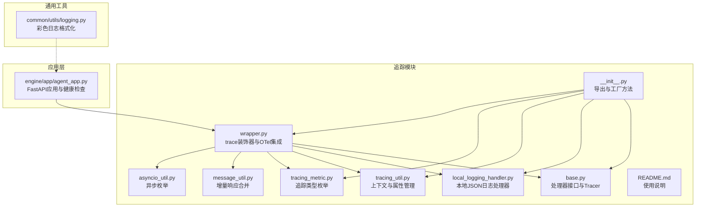
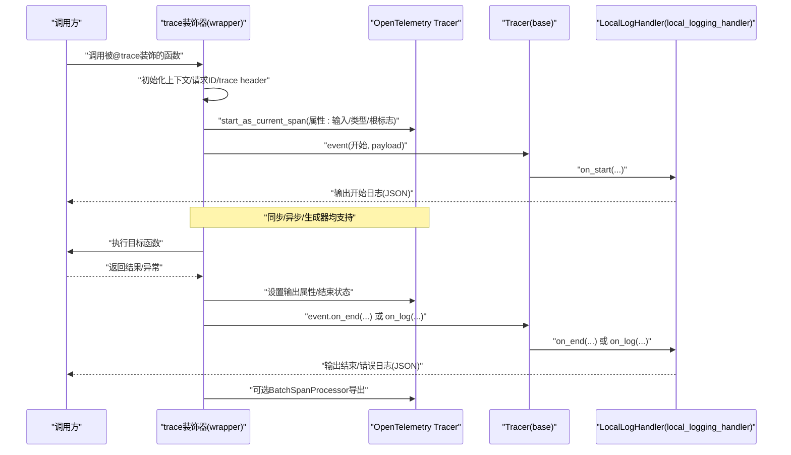
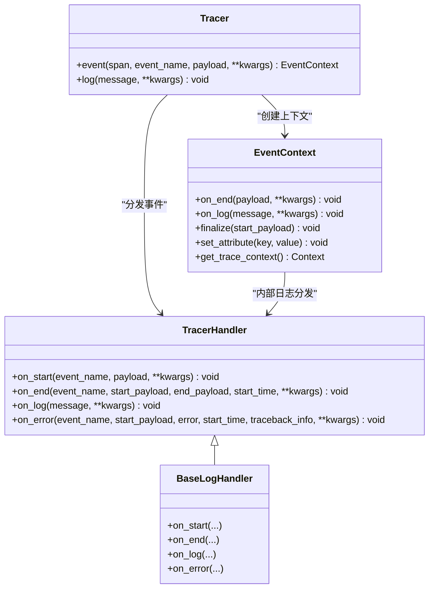
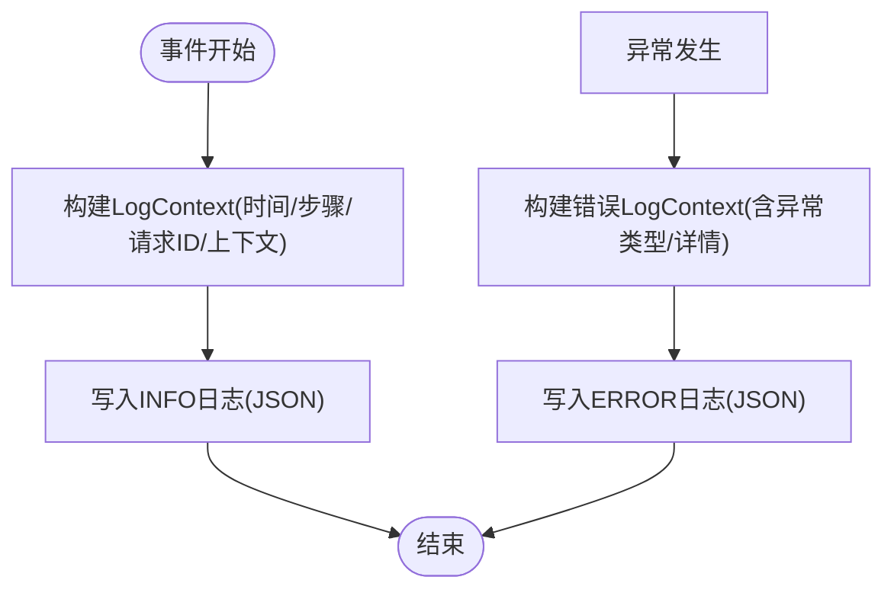
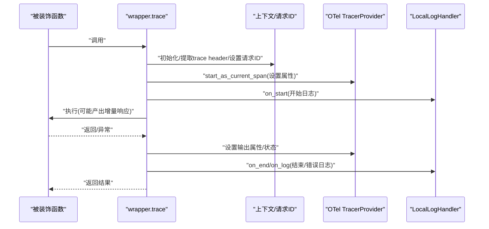
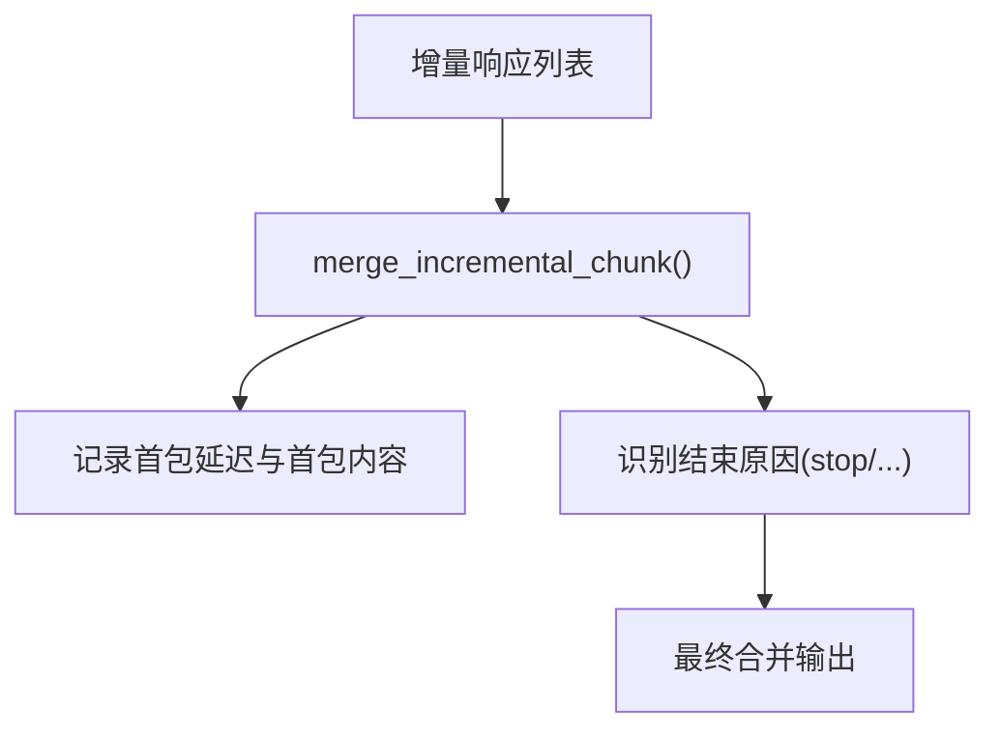
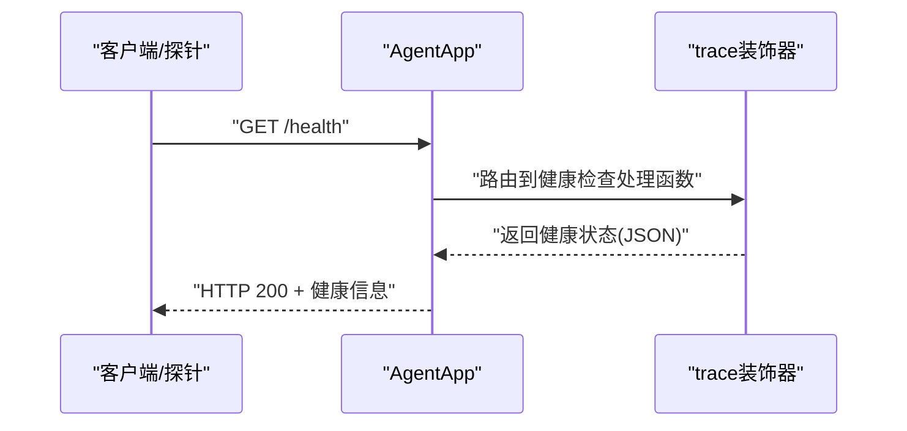
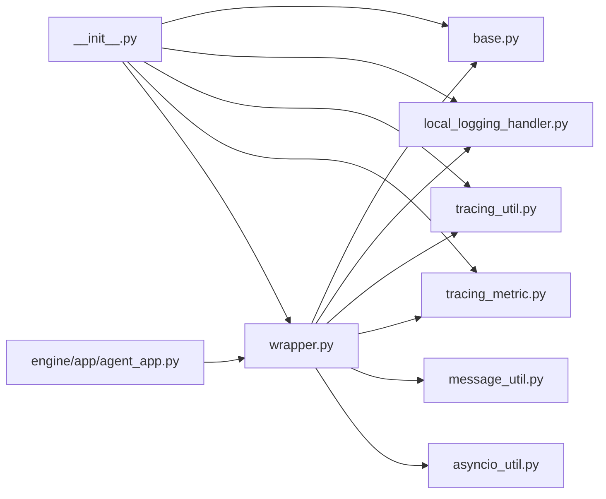

# 监控和日志

<cite>
**本文引用的文件**
- [README.md](file://README.md)
- [tracing/README.md](file://src/agentscope_runtime/engine/tracing/README.md)
- [tracing/__init__.py](file://src/agentscope_runtime/engine/tracing/__init__.py)
- [tracing/base.py](file://src/agentscope_runtime/engine/tracing/base.py)
- [tracing/local_logging_handler.py](file://src/agentscope_runtime/engine/tracing/local_logging_handler.py)
- [tracing/tracing_util.py](file://src/agentscope_runtime/engine/tracing/tracing_util.py)
- [tracing/tracing_metric.py](file://src/agentscope_runtime/engine/tracing/tracing_metric.py)
- [tracing/wrapper.py](file://src/agentscope_runtime/engine/tracing/wrapper.py)
- [tracing/message_util.py](file://src/agentscope_runtime/engine/tracing/message_util.py)
- [tracing/asyncio_util.py](file://src/agentscope_runtime/engine/tracing/asyncio_util.py)
- [common/utils/logging.py](file://src/agentscope_runtime/common/utils/logging.py)
- [engine/app/agent_app.py](file://src/agentscope_runtime/engine/app/agent_app.py)
- [cookbook/en/agent_app.md](file://cookbook/en/agent_app.md)
</cite>

## 目录
1. [简介](#简介)
2. [项目结构](#项目结构)
3. [核心组件](#核心组件)
4. [架构总览](#架构总览)
5. [详细组件分析](#详细组件分析)
6. [依赖关系分析](#依赖关系分析)
7. [性能考虑](#性能考虑)
8. [故障排查指南](#故障排查指南)
9. [结论](#结论)
10. [附录](#附录)

## 简介
本文件面向监控与日志系统，围绕 Agentscope Runtime 的追踪模块进行技术文档整理，涵盖以下主题：
- 日志系统架构与实现原理
- 追踪机制与数据采集方式
- 性能监控指标与健康检查
- 日志配置、过滤与分析方法
- 分布式追踪与链路追踪实现
- 监控仪表板与告警设置建议
- 故障诊断与性能优化技巧
- 常见问题与调试方法

## 项目结构
与监控和日志相关的核心目录与文件如下：
- tracing 模块：提供统一的追踪装饰器、处理器接口、本地日志处理器、OpenTelemetry 集成、工具函数等
- common/utils/logging.py：通用日志格式化与控制台输出
- engine/app/agent_app.py：应用入口与生命周期管理，集成健康检查端点
- cookbook 文档：包含健康检查端点的使用示例

**图表来源**
- [tracing/base.py:166-343](file://src/agentscope_runtime/engine/tracing/base.py#L166-L343)
- [tracing/local_logging_handler.py:84-370](file://src/agentscope_runtime/engine/tracing/local_logging_handler.py#L84-L370)
- [tracing/tracing_util.py:23-136](file://src/agentscope_runtime/engine/tracing/tracing_util.py#L23-L136)
- [tracing/tracing_metric.py:1-82](file://src/agentscope_runtime/engine/tracing/tracing_metric.py#L1-L82)
- [tracing/wrapper.py:94-979](file://src/agentscope_runtime/engine/tracing/wrapper.py#L94-L979)
- [tracing/message_util.py:1-529](file://src/agentscope_runtime/engine/tracing/message_util.py#L1-L529)
- [tracing/asyncio_util.py:1-25](file://src/agentscope_runtime/engine/tracing/asyncio_util.py#L1-L25)
- [tracing/__init__.py:1-47](file://src/agentscope_runtime/engine/tracing/__init__.py#L1-L47)
- [common/utils/logging.py:1-45](file://src/agentscope_runtime/common/utils/logging.py#L1-L45)
- [engine/app/agent_app.py:1-200](file://src/agentscope_runtime/engine/app/agent_app.py#L1-L200)

**章节来源**
- [tracing/README.md:1-73](file://src/agentscope_runtime/engine/tracing/README.md#L1-L73)
- [tracing/__init__.py:1-47](file://src/agentscope_runtime/engine/tracing/__init__.py#L1-L47)
- [common/utils/logging.py:1-45](file://src/agentscope_runtime/common/utils/logging.py#L1-L45)
- [engine/app/agent_app.py:1-200](file://src/agentscope_runtime/engine/app/agent_app.py#L1-L200)

## 核心组件
- Tracer 与处理器接口：定义统一的 on_start/on_end/on_log/on_error 生命周期回调，支持多处理器并行输出
- 本地日志处理器：以结构化 JSON 输出，兼容 Dashscope 日志格式字段，支持滚动文件与控制台输出
- OpenTelemetry 集成：按环境变量启用/禁用上报，支持 OTLP/GRPC 导出与控制台调试导出
- 追踪装饰器 trace：自动注入请求 ID、跨线程传播、根 Span 判定、首包延迟与结束原因标注
- 追踪工具类：提供请求 ID、trace header、通用属性的上下文管理与全局属性注入
- 追踪类型枚举：覆盖 LLM、TOOL、AGENT_STEP、MEMORY、SEARCH、AIGC、RAG、INTENTION、PLUGIN、FUNCTION_CALL、AGENT、PLANNING、CHAIN、RETRIEVER、RERANKER、EMBEDDING、TASK、GUARDRAIL、REWRITER、OTHER 等
- 增量响应合并与完成条件：对流式输出进行首包延迟统计、结束原因识别与最终合并输出

**章节来源**
- [tracing/base.py:12-83](file://src/agentscope_runtime/engine/tracing/base.py#L12-L83)
- [tracing/local_logging_handler.py:84-370](file://src/agentscope_runtime/engine/tracing/local_logging_handler.py#L84-L370)
- [tracing/wrapper.py:94-979](file://src/agentscope_runtime/engine/tracing/wrapper.py#L94-L979)
- [tracing/tracing_util.py:23-136](file://src/agentscope_runtime/engine/tracing/tracing_util.py#L23-L136)
- [tracing/tracing_metric.py:1-82](file://src/agentscope_runtime/engine/tracing/tracing_metric.py#L1-L82)
- [tracing/message_util.py:1-529](file://src/agentscope_runtime/engine/tracing/message_util.py#L1-L529)

## 架构总览
下图展示从调用 trace 装饰器到本地日志与 OpenTelemetry 上报的整体流程。

**图表来源**
- [tracing/wrapper.py:94-596](file://src/agentscope_runtime/engine/tracing/wrapper.py#L94-L596)
- [tracing/base.py:166-343](file://src/agentscope_runtime/engine/tracing/base.py#L166-L343)
- [tracing/local_logging_handler.py:201-370](file://src/agentscope_runtime/engine/tracing/local_logging_handler.py#L201-L370)

## 详细组件分析

### 组件一：Tracer 与处理器接口
- 抽象处理器接口定义了 on_start/on_end/on_log/on_error 四个钩子，便于扩展不同输出介质
- Tracer 提供上下文管理器 event，负责在进入/退出事件时分发到各处理器
- EventContext 支持在事件内部动态记录日志、设置属性，并在 finalize 时统一收尾

**图表来源**
- [tracing/base.py:12-343](file://src/agentscope_runtime/engine/tracing/base.py#L12-L343)

**章节来源**
- [tracing/base.py:12-343](file://src/agentscope_runtime/engine/tracing/base.py#L12-L343)

### 组件二：本地日志处理器（结构化 JSON）
- 使用 Pydantic 模型封装日志上下文，确保字段一致性
- 自定义 JsonFormatter，输出包含时间、步骤、请求 ID、上下文、间隔等字段
- 支持 INFO/ERROR 分离滚动文件、控制台输出开关
- 错误路径中自动写入异常类型与堆栈摘要

**图表来源**
- [tracing/local_logging_handler.py:24-82](file://src/agentscope_runtime/engine/tracing/local_logging_handler.py#L24-L82)
- [tracing/local_logging_handler.py:201-370](file://src/agentscope_runtime/engine/tracing/local_logging_handler.py#L201-L370)

**章节来源**
- [tracing/local_logging_handler.py:84-370](file://src/agentscope_runtime/engine/tracing/local_logging_handler.py#L84-L370)

### 组件三：追踪装饰器与 OpenTelemetry 集成
- trace 装饰器根据函数类型（同步/异步/生成器）选择执行分支
- 自动设置输入/输出 MIME 类型与值，记录首包延迟与结束原因
- 通过上下文传播 trace header，支持跨线程/跨进程请求 ID 一致
- 可按环境变量启用本地日志与 OTLP 上报，支持控制台调试导出

**图表来源**
- [tracing/wrapper.py:94-596](file://src/agentscope_runtime/engine/tracing/wrapper.py#L94-L596)
- [tracing/wrapper.py:917-979](file://src/agentscope_runtime/engine/tracing/wrapper.py#L917-L979)
- [tracing/local_logging_handler.py:201-370](file://src/agentscope_runtime/engine/tracing/local_logging_handler.py#L201-L370)

**章节来源**
- [tracing/wrapper.py:94-979](file://src/agentscope_runtime/engine/tracing/wrapper.py#L94-L979)
- [tracing/tracing_util.py:23-136](file://src/agentscope_runtime/engine/tracing/tracing_util.py#L23-L136)

### 组件四：追踪类型与消息工具
- TraceType 定义丰富的事件类型，便于分类统计与可视化
- message_util 提供增量响应合并与结束原因判定，支持 OpenAI ChatCompletionChunk 与自研响应模型

**图表来源**
- [tracing/message_util.py:20-121](file://src/agentscope_runtime/engine/tracing/message_util.py#L20-L121)
- [tracing/wrapper.py:712-784](file://src/agentscope_runtime/engine/tracing/wrapper.py#L712-L784)

**章节来源**
- [tracing/tracing_metric.py:1-82](file://src/agentscope_runtime/engine/tracing/tracing_metric.py#L1-L82)
- [tracing/message_util.py:1-529](file://src/agentscope_runtime/engine/tracing/message_util.py#L1-L529)
- [tracing/wrapper.py:712-784](file://src/agentscope_runtime/engine/tracing/wrapper.py#L712-L784)

### 组件五：健康检查与应用集成
- AgentApp 提供健康检查端点（/health、/readiness、/liveness），便于容器编排与运维监控
- 结合 tracing 可在健康检查路径上输出结构化日志，辅助定位启动与运行问题

**图表来源**
- [engine/app/agent_app.py:1-200](file://src/agentscope_runtime/engine/app/agent_app.py#L1-L200)
- [cookbook/en/agent_app.md:242-312](file://cookbook/en/agent_app.md#L242-L312)

**章节来源**
- [engine/app/agent_app.py:1-200](file://src/agentscope_runtime/engine/app/agent_app.py#L1-L200)
- [cookbook/en/agent_app.md:242-312](file://cookbook/en/agent_app.md#L242-L312)

## 依赖关系分析
- tracing 模块内部依赖关系清晰：wrapper 依赖 base、local_logging_handler、tracing_util、tracing_metric、message_util、asyncio_util
- wrapper 通过环境变量控制是否启用本地日志与 OTLP 上报
- TracingUtil 提供全局属性注入，贯穿整个追踪链路
- AgentApp 作为外部集成点，可与 tracing 协同进行健康检查与业务日志

**图表来源**
- [tracing/wrapper.py:1-979](file://src/agentscope_runtime/engine/tracing/wrapper.py#L1-L979)
- [tracing/base.py:1-343](file://src/agentscope_runtime/engine/tracing/base.py#L1-L343)
- [tracing/local_logging_handler.py:1-370](file://src/agentscope_runtime/engine/tracing/local_logging_handler.py#L1-L370)
- [tracing/tracing_util.py:1-136](file://src/agentscope_runtime/engine/tracing/tracing_util.py#L1-L136)
- [tracing/tracing_metric.py:1-82](file://src/agentscope_runtime/engine/tracing/tracing_metric.py#L1-L82)
- [tracing/message_util.py:1-529](file://src/agentscope_runtime/engine/tracing/message_util.py#L1-L529)
- [tracing/asyncio_util.py:1-25](file://src/agentscope_runtime/engine/tracing/asyncio_util.py#L1-L25)
- [tracing/__init__.py:1-47](file://src/agentscope_runtime/engine/tracing/__init__.py#L1-L47)
- [engine/app/agent_app.py:1-200](file://src/agentscope_runtime/engine/app/agent_app.py#L1-L200)

**章节来源**
- [tracing/__init__.py:1-47](file://src/agentscope_runtime/engine/tracing/__init__.py#L1-L47)
- [tracing/wrapper.py:917-979](file://src/agentscope_runtime/engine/tracing/wrapper.py#L917-L979)

## 性能考虑
- 流式输出优化：通过首包延迟与结束原因标注，便于识别慢点与异常终止
- 资源开销控制：本地日志采用滚动文件，避免单文件过大；可按需关闭控制台输出
- OTLP 上报：批量导出与可选控制台调试导出，生产环境建议仅开启批量导出
- 请求 ID 传播：避免重复生成，减少无谓的上下文切换

[本节为通用性能建议，不直接分析具体文件]

## 故障排查指南
- 症状：日志未输出或格式异常
  - 检查本地日志处理器是否启用（环境变量）与日志目录权限
  - 核对 JsonFormatter 字段映射与 LogContext 模型
- 症状：追踪链路断层或请求 ID 不一致
  - 确认 trace header 是否正确透传与注入
  - 检查上下文变量与 baggage 的设置/获取逻辑
- 症状：OTLP 上报失败
  - 校验 TRACE_ENABLE_REPORT、TRACE_ENDPOINT、TRACE_AUTHENTICATION 环境变量
  - 开启 TRACE_ENABLE_DEBUG 查看控制台导出
- 症状：健康检查异常
  - 使用 Cookbook 中的 curl 示例验证 /health、/readiness、/liveness
  - 关注 AgentApp 初始化与路由注册

**章节来源**
- [tracing/local_logging_handler.py:84-190](file://src/agentscope_runtime/engine/tracing/local_logging_handler.py#L84-L190)
- [tracing/tracing_util.py:23-136](file://src/agentscope_runtime/engine/tracing/tracing_util.py#L23-L136)
- [tracing/wrapper.py:917-979](file://src/agentscope_runtime/engine/tracing/wrapper.py#L917-L979)
- [cookbook/en/agent_app.md:242-312](file://cookbook/en/agent_app.md#L242-L312)

## 结论
本监控与日志体系以 trace 装饰器为核心，结合本地结构化日志与 OpenTelemetry 上报，形成“可观测+可审计”的能力闭环。通过统一的处理器接口与上下文传播机制，既满足本地开发调试，也支持生产环境的链路追踪与性能指标采集。配合健康检查端点与通用日志格式化工具，可快速定位问题并持续优化系统稳定性与性能。

[本节为总结性内容，不直接分析具体文件]

## 附录

### 日志配置与过滤
- 本地日志
  - 启用方式：通过环境变量控制本地日志处理器启用
  - 输出格式：结构化 JSON，包含时间、步骤、请求 ID、上下文、间隔等字段
  - 文件策略：INFO/ERROR 分离滚动文件，支持控制台输出
- OTLP 上报
  - 启用方式：通过环境变量控制批量导出与调试导出
  - 认证与端点：通过环境变量配置认证头与导出地址

**章节来源**
- [tracing/local_logging_handler.py:84-190](file://src/agentscope_runtime/engine/tracing/local_logging_handler.py#L84-L190)
- [tracing/wrapper.py:917-979](file://src/agentscope_runtime/engine/tracing/wrapper.py#L917-L979)

### 分布式追踪与链路追踪
- 请求 ID 传播：通过 contextvars 与 baggage 实现跨线程/跨进程一致
- 根 Span 判定：当父上下文为空且显式声明为根时，自动设置类型为 CHAIN
- 属性注入：输入/输出 MIME 类型与值、首包延迟、结束原因等属性自动标注

**章节来源**
- [tracing/tracing_util.py:23-136](file://src/agentscope_runtime/engine/tracing/tracing_util.py#L23-L136)
- [tracing/wrapper.py:800-834](file://src/agentscope_runtime/engine/tracing/wrapper.py#L800-L834)

### 性能监控指标与健康检查
- 指标建议
  - 首包延迟：gen_ai.response.first_delay
  - 结束原因：gen_ai.response.pkg_stop 等
  - 输入/输出：input.value、output.value（JSON/TEXT）
- 健康检查
  - /health、/readiness、/liveness 端点用于容器编排与运维监控

**章节来源**
- [tracing/wrapper.py:712-784](file://src/agentscope_runtime/engine/tracing/wrapper.py#L712-L784)
- [cookbook/en/agent_app.md:242-312](file://cookbook/en/agent_app.md#L242-L312)

### 监控仪表板与告警设置
- 建议
  - 在仪表板中按 TraceType 聚合事件数与耗时分布
  - 设置首包延迟与错误率阈值告警
  - 对关键服务端点（如 /process）设置可用性与响应时间告警

[本节为通用建议，不直接分析具体文件]

### 常见问题与调试方法
- 问题：日志未落盘
  - 排查：确认日志目录存在且有写权限；检查 max_bytes 与 backup_count 参数
- 问题：OTLP 导出失败
  - 排查：核对端点与认证头；开启调试导出定位网络/鉴权问题
- 问题：健康检查 500
  - 排查：查看应用启动日志与路由注册情况；确认端口与主机绑定

**章节来源**
- [tracing/local_logging_handler.py:129-179](file://src/agentscope_runtime/engine/tracing/local_logging_handler.py#L129-L179)
- [tracing/wrapper.py:948-961](file://src/agentscope_runtime/engine/tracing/wrapper.py#L948-L961)
- [engine/app/agent_app.py:1-200](file://src/agentscope_runtime/engine/app/agent_app.py#L1-L200)