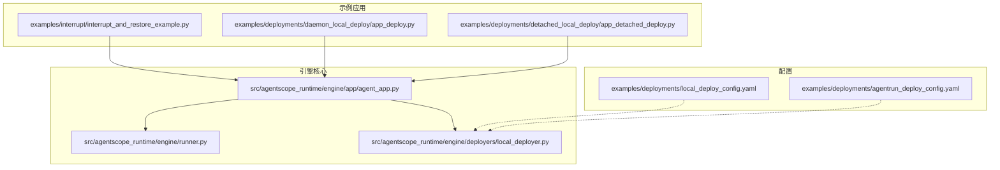
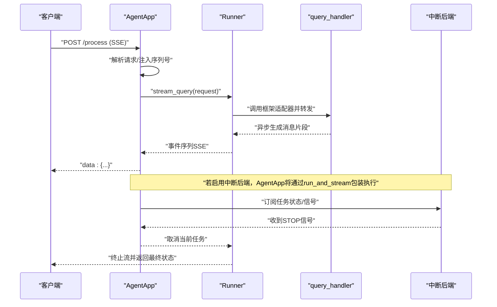
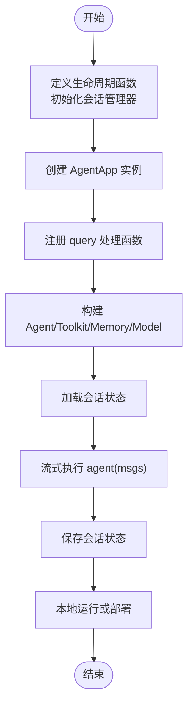
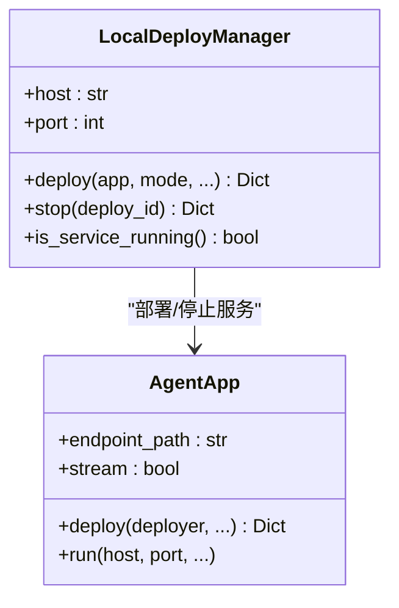
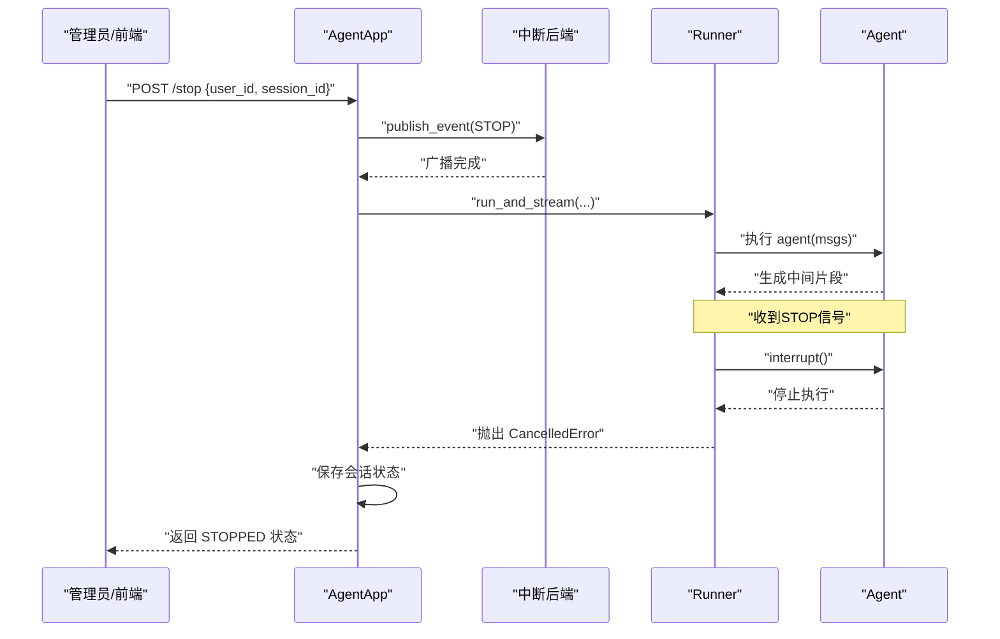
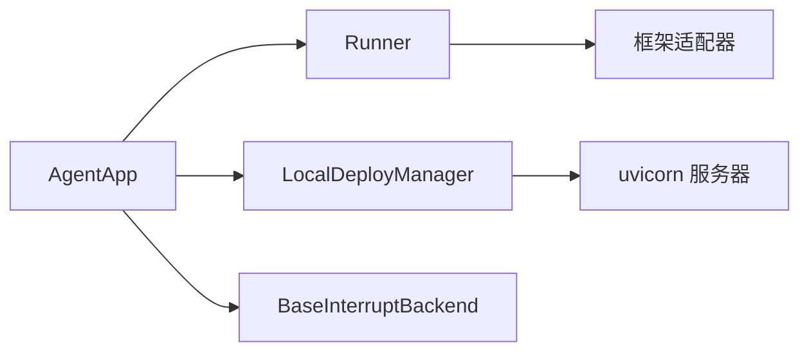

# 基础示例

<cite>
**本文引用的文件**
- [README.md](file://README.md)
- [quickstart.md](file://cookbook/zh/quickstart.md)
- [agent_app.py](file://src/agentscope_runtime/engine/app/agent_app.py)
- [local_deployer.py](file://src/agentscope_runtime/engine/deployers/local_deployer.py)
- [runner.py](file://src/agentscope_runtime/engine/runner.py)
- [interrupt_and_restore_example.py](file://examples/interrupt/interrupt_and_restore_example.py)
- [local_deploy_config.yaml](file://examples/deployments/local_deploy_config.yaml)
- [agentrun_deploy_config.yaml](file://examples/deployments/agentrun_deploy_config.yaml)
- [cli.py](file://src/agentscope_runtime/cli/cli.py)
- [app_deploy.py](file://examples/deployments/daemon_local_deploy/app_deploy.py)
- [app_detached_deploy.py](file://examples/deployments/detached_local_deploy/app_detached_deploy.py)
- [base_backend.py](file://src/agentscope_runtime/engine/deployers/utils/service_utils/interrupt/base_backend.py)
</cite>

## 目录
1. [简介](#简介)
2. [项目结构](#项目结构)
3. [核心组件](#核心组件)
4. [架构总览](#架构总览)
5. [详细组件分析](#详细组件分析)
6. [依赖关系分析](#依赖关系分析)
7. [性能考虑](#性能考虑)
8. [故障排查指南](#故障排查指南)
9. [结论](#结论)
10. [附录](#附录)

## 简介
本示例文档面向首次接触 AgentScope Runtime 的开发者，目标是帮助你在本地快速完成一个最小化智能体应用的部署与启动，并理解智能体的中断与恢复机制。文档覆盖以下要点：
- 本地部署的基本配置与启动方法
- 智能体中断与恢复机制的实现原理与实践
- Hello World 级别的最小示例与基本 API 调用
- 配置文件的详细说明与参数解释
- 如何创建最小化的智能体应用
- 常见错误的排查与解决方法
- 性能基准测试与优化建议

## 项目结构
AgentScope Runtime 将“智能体应用”封装为可直接运行的 FastAPI 服务，并通过统一的 Runner 和部署管理器实现本地与云端的弹性部署。示例工程位于 examples 目录，包含本地守护线程模式、分离进程模式、以及中断与恢复示例。

图示来源
- [agent_app.py](file://src/agentscope_runtime/engine/app/agent_app.py)
- [runner.py](file://src/agentscope_runtime/engine/runner.py)
- [local_deployer.py](file://src/agentscope_runtime/engine/deployers/local_deployer.py)
- [interrupt_and_restore_example.py](file://examples/interrupt/interrupt_and_restore_example.py)
- [app_deploy.py](file://examples/deployments/daemon_local_deploy/app_deploy.py)
- [app_detached_deploy.py](file://examples/deployments/detached_local_deploy/app_detached_deploy.py)
- [local_deploy_config.yaml](file://examples/deployments/local_deploy_config.yaml)
- [agentrun_deploy_config.yaml](file://examples/deployments/agentrun_deploy_config.yaml)

章节来源
- [README.md](file://README.md)
- [quickstart.md](file://cookbook/zh/quickstart.md)

## 核心组件
- AgentApp：基于 FastAPI 的智能体应用容器，负责路由注册、生命周期管理、协议适配（A2A、Response API、AGUI）以及分布式中断服务集成。
- Runner：统一的推理调度器，负责将请求转换为框架特定的消息流，产出事件序列（SSE）。
- LocalDeployManager：本地部署管理器，支持守护线程与分离进程两种模式，负责服务启动、停止与健康检查。
- 中断后端（Interrupt Backend）：抽象接口，支持本地与 Redis 分布式后端，用于任务状态持久化与跨实例信号广播。

章节来源
- [agent_app.py](file://src/agentscope_runtime/engine/app/agent_app.py)
- [runner.py](file://src/agentscope_runtime/engine/runner.py)
- [local_deployer.py](file://src/agentscope_runtime/engine/deployers/local_deployer.py)
- [base_backend.py](file://src/agentscope_runtime/engine/deployers/utils/service_utils/interrupt/base_backend.py)

## 架构总览
下图展示了从请求进入、消息流处理到中断控制的整体流程。

图示来源
- [agent_app.py](file://src/agentscope_runtime/engine/app/agent_app.py)
- [runner.py](file://src/agentscope_runtime/engine/runner.py)
- [base_backend.py](file://src/agentscope_runtime/engine/deployers/utils/service_utils/interrupt/base_backend.py)

## 详细组件分析

### 最小化智能体应用（Hello World）
- 目标：在本地启动一个最简 Agent API 服务，支持 SSE 流式输出。
- 关键步骤：
  1) 定义生命周期函数（lifespan），初始化会话管理器（RedisSession/FakeRedis）。
  2) 创建 AgentApp 实例，指定应用名称与描述。
  3) 使用装饰器注册 query 处理函数，内部构建 ReActAgent、Toolkit、InMemoryMemory、DashScopeChatModel 等。
  4) 在 query 函数中加载会话状态、流式执行 agent(msgs)、保存会话状态。
  5) 运行 AgentApp 或通过 LocalDeployManager 部署。

图示来源
- [quickstart.md](file://cookbook/zh/quickstart.md)
- [agent_app.py](file://src/agentscope_runtime/engine/app/agent_app.py)
- [runner.py](file://src/agentscope_runtime/engine/runner.py)

章节来源
- [quickstart.md](file://cookbook/zh/quickstart.md)
- [README.md](file://README.md)

### 本地部署与启动
- 守护线程模式（Daemon Thread）：适合开发调试，服务在主线程内以守护线程方式运行。
- 分离进程模式（Detached Process）：适合生产或长期运行，服务在独立进程中运行，支持健康检查与优雅停机。
- 部署配置：
  - 本地配置文件示例：host、port、environment（包含 API 密钥、日志级别等）。
  - AgentRun 配置文件示例：name、region、CPU/内存、环境变量（含阿里云 AK/SK）。

图示来源
- [local_deployer.py](file://src/agentscope_runtime/engine/deployers/local_deployer.py)
- [agent_app.py](file://src/agentscope_runtime/engine/app/agent_app.py)
- [local_deploy_config.yaml](file://examples/deployments/local_deploy_config.yaml)
- [agentrun_deploy_config.yaml](file://examples/deployments/agentrun_deploy_config.yaml)

章节来源
- [app_deploy.py](file://examples/deployments/daemon_local_deploy/app_deploy.py)
- [app_detached_deploy.py](file://examples/deployments/detached_local_deploy/app_detached_deploy.py)
- [local_deployer.py](file://src/agentscope_runtime/engine/deployers/local_deployer.py)
- [local_deploy_config.yaml](file://examples/deployments/local_deploy_config.yaml)
- [agentrun_deploy_config.yaml](file://examples/deployments/agentrun_deploy_config.yaml)

### 智能体中断与恢复机制
- 中断后端类型：
  - 本地模式（LocalInterruptBackend）：单机默认，适合开发与测试。
  - Redis 模式（RedisInterruptBackend）：分布式场景，支持多实例间状态同步。
  - 自定义后端（BaseInterruptBackend 子类）：满足特殊需求。
- 中断触发路径：
  - 在 AgentApp 上注册 /stop 端点，接收用户/管理员请求，调用 stop_chat(user_id, session_id) 广播中断信号。
  - Runner 在流式执行过程中捕获 CancelledError，调用 agent.interrupt() 停止底层执行，并保存当前状态。
- 状态管理：
  - 通过 TaskState 枚举维护任务生命周期（IDLE/RUNNING/STOPPED/FINISHED/ERROR）。
  - 支持 CAS 状态更新与 TTL 清理，保证一致性与可恢复性。

图示来源
- [interrupt_and_restore_example.py](file://examples/interrupt/interrupt_and_restore_example.py)
- [agent_app.py](file://src/agentscope_runtime/engine/app/agent_app.py)
- [base_backend.py](file://src/agentscope_runtime/engine/deployers/utils/service_utils/interrupt/base_backend.py)

章节来源
- [interrupt_and_restore_example.py](file://examples/interrupt/interrupt_and_restore_example.py)
- [agent_app.py](file://src/agentscope_runtime/engine/app/agent_app.py)
- [base_backend.py](file://src/agentscope_runtime/engine/deployers/utils/service_utils/interrupt/base_backend.py)

### 基本 API 调用
- 本地最小示例的请求与响应遵循 AgentRequest/AgentResponse 协议，SSE 流式输出事件序列。
- 可通过 curl 直接访问 /process 端点，或使用 OpenAI SDK 兼容模式调用 Response API。

章节来源
- [quickstart.md](file://cookbook/zh/quickstart.md)
- [README.md](file://README.md)

### 配置文件详解
- 本地部署配置（local_deploy_config.yaml）
  - host：绑定地址，默认 127.0.0.1
  - port：服务端口，默认 8090
  - environment：环境变量字典，包含 PYTHONPATH、LOG_LEVEL、DASHSCOPE_API_KEY 等
- AgentRun 部署配置（agentrun_deploy_config.yaml）
  - name：部署名称
  - region：部署区域
  - cpu/memory：资源配置
  - environment：包含阿里云 AK/SK、DASHSCOPE_API_KEY 等

章节来源
- [local_deploy_config.yaml](file://examples/deployments/local_deploy_config.yaml)
- [agentrun_deploy_config.yaml](file://examples/deployments/agentrun_deploy_config.yaml)

### CLI 工具与命令
- CLI 主入口提供 chat、run、web、deploy、list、status、stop、invoke、sandbox 等子命令，便于从命令行完成部署与运维操作。

章节来源
- [cli.py](file://src/agentscope_runtime/cli/cli.py)

## 依赖关系分析
- AgentApp 继承自 FastAPI，组合了 UnifiedRoutingMixin 与 InterruptMixin，统一接入路由与中断能力。
- Runner 作为核心调度器，根据 framework_type 选择对应的消息流适配器，将 query_handler 的输出标准化为事件序列。
- LocalDeployManager 依据部署模式（守护线程/分离进程）启动 uvicorn 服务或打包并启动独立进程。
- 中断后端通过 BaseInterruptBackend 抽象，支持本地与 Redis 两种实现，保障分布式场景下的任务状态一致性。

图示来源
- [agent_app.py](file://src/agentscope_runtime/engine/app/agent_app.py)
- [runner.py](file://src/agentscope_runtime/engine/runner.py)
- [local_deployer.py](file://src/agentscope_runtime/engine/deployers/local_deployer.py)
- [base_backend.py](file://src/agentscope_runtime/engine/deployers/utils/service_utils/interrupt/base_backend.py)

章节来源
- [agent_app.py](file://src/agentscope_runtime/engine/app/agent_app.py)
- [runner.py](file://src/agentscope_runtime/engine/runner.py)
- [local_deployer.py](file://src/agentscope_runtime/engine/deployers/local_deployer.py)
- [base_backend.py](file://src/agentscope_runtime/engine/deployers/utils/service_utils/interrupt/base_backend.py)

## 性能考虑
- 流式输出：使用 SSE 边生成边返回，降低首字节延迟，提升用户体验。
- 会话状态持久化：在每次请求前后加载/保存会话状态，避免重复计算，提高长对话连贯性。
- 中断与恢复：在分布式场景下，合理使用 Redis 中断后端，减少状态丢失风险。
- 资源隔离：沙箱工具执行在隔离环境中，避免对宿主机造成影响。
- 日志与追踪：开启 TRACE_ENABLE_LOG 可辅助定位性能瓶颈与异常路径。

## 故障排查指南
- 服务未启动或无法访问
  - 检查 host/port 是否被占用；确认防火墙放行；使用 /health 健康检查端点验证。
  - 分离进程模式下，可通过 /admin/shutdown 触发优雅停机，再重新启动。
- 中断无效或状态不一致
  - 确认是否正确注册 /stop 端点；检查中断后端配置（本地/Redis）；确保 CAS 状态更新成功。
- API 调用失败
  - 核对 DASHSCOPE_API_KEY 等环境变量；确认 Request/Response 协议字段完整；使用兼容模式 OpenAI SDK 调用 Response API。
- 部署失败
  - 查看部署日志与 PID 文件；确认 requirements 与 extra_packages；核对 AgentRun 配置中的 AK/SK 与 region。

章节来源
- [app_detached_deploy.py](file://examples/deployments/detached_local_deploy/app_detached_deploy.py)
- [interrupt_and_restore_example.py](file://examples/interrupt/interrupt_and_restore_example.py)
- [local_deployer.py](file://src/agentscope_runtime/engine/deployers/local_deployer.py)

## 结论
通过本示例，你可以在本地快速搭建一个最小化的智能体应用，掌握本地部署、SSE 流式输出、以及中断与恢复机制。结合配置文件与 CLI 工具，你可以进一步扩展为生产级的服务，并在分布式场景下利用 Redis 中断后端实现可靠的跨实例协作。

## 附录
- 快速开始与示例工程：参见 README 与 cookbook/zh/quickstart.md
- 示例应用：examples/interrupt/interrupt_and_restore_example.py、examples/deployments/daemon_local_deploy/app_deploy.py、examples/deployments/detached_local_deploy/app_detached_deploy.py
- 配置文件：examples/deployments/local_deploy_config.yaml、examples/deployments/agentrun_deploy_config.yaml