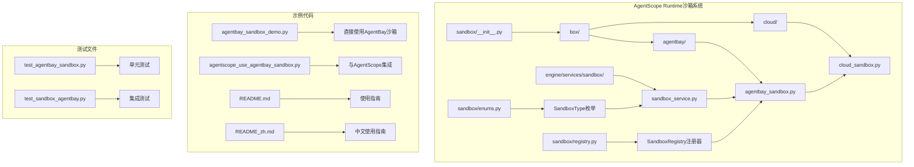
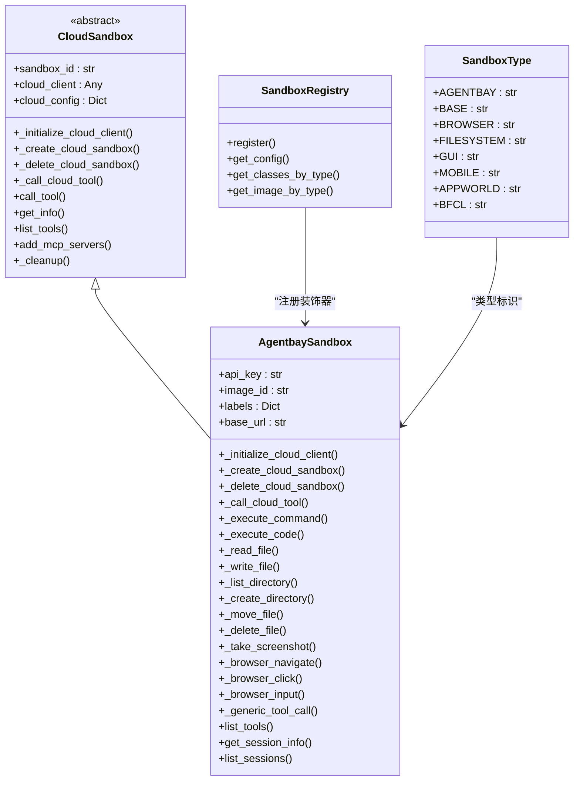
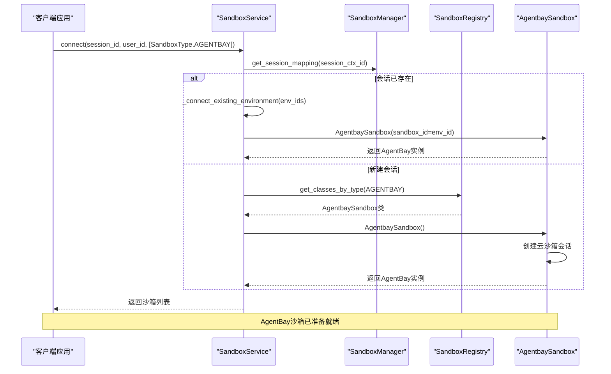
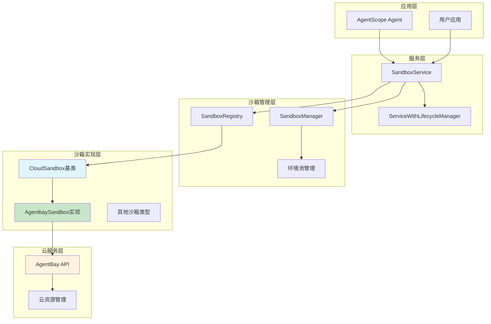
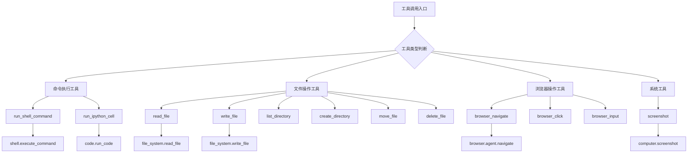
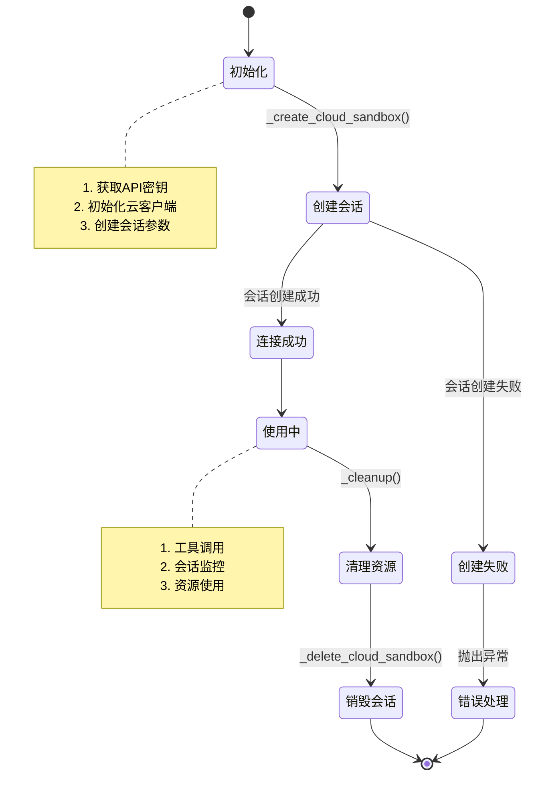
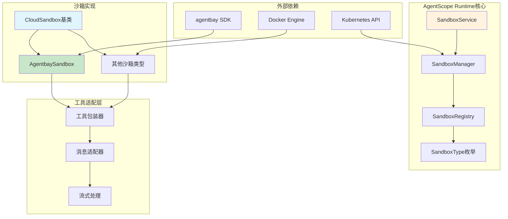

# AgentBay沙箱示例

<cite>
**本文档引用的文件**
- [README.md](file://examples/sandbox/agentbay_sandbox/README.md)
- [README_zh.md](file://examples/sandbox/agentbay_sandbox/README_zh.md)
- [agentbay_sandbox_demo.py](file://examples/sandbox/agentbay_sandbox/agentbay_sandbox_demo.py)
- [agentscope_use_agentbay_sandbox.py](file://examples/sandbox/agentbay_sandbox/agentscope_use_agentbay_sandbox.py)
- [agentbay_sandbox.py](file://src/agentscope_runtime/sandbox/box/agentbay/agentbay_sandbox.py)
- [cloud_sandbox.py](file://src/agentscope_runtime/sandbox/box/cloud/cloud_sandbox.py)
- [sandbox_service.py](file://src/agentscope_runtime/engine/services/sandbox/sandbox_service.py)
- [enums.py](file://src/agentscope_runtime/sandbox/enums.py)
- [registry.py](file://src/agentscope_runtime/sandbox/registry.py)
- [constant.py](file://src/agentscope_runtime/sandbox/constant.py)
- [__init__.py](file://src/agentscope_runtime/sandbox/__init__.py)
- [test_agentbay_sandbox.py](file://tests/unit/test_agentbay_sandbox.py)
- [test_sandbox_agentbay.py](file://tests/sandbox/test_sandbox_agentbay.py)
</cite>

## 目录
1. [简介](#简介)
2. [项目结构](#项目结构)
3. [核心组件](#核心组件)
4. [架构概览](#架构概览)
5. [详细组件分析](#详细组件分析)
6. [依赖关系分析](#依赖关系分析)
7. [性能考虑](#性能考虑)
8. [故障排除指南](#故障排除指南)
9. [结论](#结论)
10. [附录](#附录)

## 简介

AgentBay沙箱是阿里巴巴云提供的GUI沙箱环境，支持四种类型的沙箱环境：代码空间（Code Space）、浏览器使用（Browser Use）、计算机使用（Computer Use）和移动设备使用（Mobile Use）。AgentScope Runtime通过AgentBay SDK或MCP Server方式集成AgentBay沙箱，为用户提供开箱即用的云沙箱能力。

AgentScope Runtime的AgentBay沙箱集成具有以下特点：
- **云原生架构**：基于AgentBay云服务，无需本地容器管理
- **多镜像支持**：支持Linux、Windows、浏览器自动化、代码执行和移动端环境
- **统一接口**：与传统容器沙箱保持一致的使用模式
- **安全隔离**：通过云服务提供强隔离的运行环境

## 项目结构

AgentBay沙箱示例位于examples/sandbox/agentbay_sandbox目录下，包含完整的演示代码和使用指南：



**图表来源**
- [__init__.py:1-33](file://src/agentscope_runtime/sandbox/__init__.py#L1-L33)
- [agentbay_sandbox.py:1-558](file://src/agentscope_runtime/sandbox/box/agentbay/agentbay_sandbox.py#L1-L558)
- [cloud_sandbox.py:1-251](file://src/agentscope_runtime/sandbox/box/cloud/cloud_sandbox.py#L1-L251)
- [sandbox_service.py:1-238](file://src/agentscope_runtime/engine/services/sandbox/sandbox_service.py#L1-L238)

**章节来源**
- [README.md:1-134](file://examples/sandbox/agentbay_sandbox/README.md#L1-L134)
- [README_zh.md:1-123](file://examples/sandbox/agentbay_sandbox/README_zh.md#L1-L123)

## 核心组件

### AgentBay沙箱实现

AgentBay沙箱通过AgentbaySandbox类实现，该类继承自CloudSandbox基类，提供了完整的云沙箱功能：



**图表来源**
- [cloud_sandbox.py:19-251](file://src/agentscope_runtime/sandbox/box/cloud/cloud_sandbox.py#L19-L251)
- [agentbay_sandbox.py:27-558](file://src/agentscope_runtime/sandbox/box/agentbay/agentbay_sandbox.py#L27-L558)
- [registry.py:33-131](file://src/agentscope_runtime/sandbox/registry.py#L33-L131)
- [enums.py:61-80](file://src/agentscope_runtime/sandbox/enums.py#L61-L80)

### 沙箱服务集成

SandboxService提供了统一的沙箱管理接口，支持多种沙箱类型的创建和连接：



**图表来源**
- [sandbox_service.py:82-200](file://src/agentscope_runtime/engine/services/sandbox/sandbox_service.py#L82-L200)
- [agentbay_sandbox.py:115-147](file://src/agentscope_runtime/sandbox/box/agentbay/agentbay_sandbox.py#L115-L147)

**章节来源**
- [agentbay_sandbox.py:27-558](file://src/agentscope_runtime/sandbox/box/agentbay/agentbay_sandbox.py#L27-L558)
- [cloud_sandbox.py:19-251](file://src/agentscope_runtime/sandbox/box/cloud/cloud_sandbox.py#L19-L251)
- [sandbox_service.py:11-238](file://src/agentscope_runtime/engine/services/sandbox/sandbox_service.py#L11-L238)

## 架构概览

AgentScope Runtime的AgentBay沙箱架构采用分层设计，确保了良好的可扩展性和维护性：



**图表来源**
- [sandbox_service.py:11-238](file://src/agentscope_runtime/engine/services/sandbox/sandbox_service.py#L11-L238)
- [cloud_sandbox.py:19-251](file://src/agentscope_runtime/sandbox/box/cloud/cloud_sandbox.py#L19-L251)
- [agentbay_sandbox.py:27-558](file://src/agentscope_runtime/sandbox/box/agentbay/agentbay_sandbox.py#L27-L558)

### 配置参数详解

AgentBay沙箱支持多种配置参数，包括认证信息、镜像类型和标签等：

| 参数名称 | 类型 | 必需 | 默认值 | 描述 |
|---------|------|------|--------|------|
| api_key | str | 是 | None | AgentBay API密钥 |
| image_id | str | 否 | "linux_latest" | 沙箱镜像类型 |
| labels | Dict[str, str] | 否 | {} | 会话标签，用于分类管理 |
| base_url | str | 否 | None | AgentBay API基础URL |
| sandbox_id | str | 否 | None | 现有会话ID（连接现有会话） |

**章节来源**
- [agentbay_sandbox.py:43-86](file://src/agentscope_runtime/sandbox/box/agentbay/agentbay_sandbox.py#L43-L86)
- [README.md:90-123](file://examples/sandbox/agentbay_sandbox/README.md#L90-L123)

## 详细组件分析

### AgentBay沙箱工具映射

AgentBay沙箱实现了丰富的工具调用功能，支持多种操作类型：



**图表来源**
- [agentbay_sandbox.py:213-242](file://src/agentscope_runtime/sandbox/box/agentbay/agentbay_sandbox.py#L213-L242)

### 沙箱生命周期管理

AgentBay沙箱的生命周期管理包括创建、连接、使用和清理四个阶段：



**图表来源**
- [agentbay_sandbox.py:88-187](file://src/agentscope_runtime/sandbox/box/agentbay/agentbay_sandbox.py#L88-L187)
- [cloud_sandbox.py:222-251](file://src/agentscope_runtime/sandbox/box/cloud/cloud_sandbox.py#L222-L251)

**章节来源**
- [agentbay_sandbox.py:88-187](file://src/agentscope_runtime/sandbox/box/agentbay/agentbay_sandbox.py#L88-L187)
- [cloud_sandbox.py:222-251](file://src/agentscope_runtime/sandbox/box/cloud/cloud_sandbox.py#L222-L251)

### 安全机制和隔离特性

AgentBay沙箱提供了多层次的安全保障：

1. **网络隔离**：每个沙箱会话运行在独立的网络环境中
2. **资源限制**：支持CPU、内存等资源配额控制
3. **访问控制**：基于API密钥的身份验证机制
4. **会话隔离**：不同用户的会话相互隔离
5. **数据保护**：文件系统操作的权限控制

**章节来源**
- [agentbay_sandbox.py:20-26](file://src/agentscope_runtime/sandbox/box/agentbay/agentbay_sandbox.py#L20-L26)

## 依赖关系分析

AgentBay沙箱的依赖关系体现了清晰的分层架构：



**图表来源**
- [agentbay_sandbox.py:96-113](file://src/agentscope_runtime/sandbox/box/agentbay/agentbay_sandbox.py#L96-L113)
- [sandbox_service.py:11-47](file://src/agentscope_runtime/engine/services/sandbox/sandbox_service.py#L11-L47)
- [registry.py:33-91](file://src/agentscope_runtime/sandbox/registry.py#L33-L91)

### 关键依赖点

1. **AgentBay SDK集成**：通过`agentbay.AgentBay`客户端进行API调用
2. **SandboxRegistry注册**：使用装饰器模式注册沙箱类型
3. **SandboxService协调**：提供统一的服务接口
4. **CloudSandbox基类**：抽象云沙箱的通用行为

**章节来源**
- [agentbay_sandbox.py:96-113](file://src/agentscope_runtime/sandbox/box/agentbay/agentbay_sandbox.py#L96-L113)
- [registry.py:33-91](file://src/agentscope_runtime/sandbox/registry.py#L33-L91)
- [sandbox_service.py:11-47](file://src/agentscope_runtime/engine/services/sandbox/sandbox_service.py#L11-L47)

## 性能考虑

### 资源优化策略

1. **连接池管理**：合理复用沙箱连接，避免频繁创建销毁
2. **异步操作**：利用异步I/O提高并发处理能力
3. **缓存机制**：对常用配置和元数据进行缓存
4. **超时控制**：设置合理的请求超时时间

### 性能监控指标

| 指标类型 | 监控内容 | 建议阈值 |
|---------|----------|----------|
| 响应时间 | 工具调用平均响应时间 | < 5秒 |
| 连接成功率 | 沙箱连接成功率 | > 95% |
| 资源利用率 | CPU、内存使用率 | < 80% |
| 错误率 | 工具调用错误率 | < 1% |

## 故障排除指南

### 常见问题及解决方案

#### 1. API密钥配置问题

**问题症状**：
- 初始化时抛出`ValueError: AgentBay API key is required`
- 工具调用返回认证失败

**解决方案**：
```bash
# 设置环境变量
export AGENTBAY_API_KEY='your_agentbay_api_key'
export DASHSCOPE_API_KEY='your_dashscope_api_key'

# 或在项目根目录创建.env文件
echo "AGENTBAY_API_KEY=your_agentbay_api_key" > .env
echo "DASHSCOPE_API_KEY=your_dashscope_api_key" >> .env
```

#### 2. AgentBay SDK未安装

**问题症状**：
- 导入时抛出`ImportError: AgentBay SDK is not installed`

**解决方案**：
```bash
pip install "agentscope-runtime[ext]"
# 或单独安装AgentBay SDK
pip install wuying-agentbay-sdk
```

#### 3. 会话创建失败

**问题症状**：
- `_create_cloud_sandbox()`返回None
- 日志显示"Failed to create AgentBay session"

**排查步骤**：
1. 检查API密钥有效性
2. 验证镜像类型是否支持
3. 确认账户配额充足
4. 查看云服务状态

#### 4. 工具调用超时

**问题症状**：
- 工具调用长时间无响应
- 抛出超时异常

**优化方案**：
1. 调整超时配置
2. 分批执行大量操作
3. 使用异步方式处理
4. 实施重试机制

**章节来源**
- [agentbay_sandbox.py:67-73](file://src/agentscope_runtime/sandbox/box/agentbay/agentbay_sandbox.py#L67-L73)
- [agentbay_sandbox.py:105-113](file://src/agentscope_runtime/sandbox/box/agentbay/agentbay_sandbox.py#L105-L113)
- [test_agentbay_sandbox.py:180-204](file://tests/unit/test_agentbay_sandbox.py#L180-L204)

### 调试技巧

1. **启用详细日志**：设置`logging.basicConfig(level=logging.INFO)`
2. **检查会话状态**：使用`get_session_info()`获取当前会话详情
3. **工具列表查询**：通过`list_tools()`了解可用工具
4. **资源监控**：定期检查云资源使用情况

## 结论

AgentScope Runtime的AgentBay沙箱集成为用户提供了强大而灵活的云沙箱能力。通过统一的接口设计和完善的生命周期管理，AgentBay沙箱能够满足各种复杂的开发和测试需求。

### 主要优势

1. **易用性**：与传统容器沙箱保持一致的使用体验
2. **可扩展性**：基于CloudSandbox基类，易于扩展新的云服务商
3. **安全性**：通过云服务提供强隔离的运行环境
4. **可靠性**：完善的错误处理和资源管理机制

### 最佳实践建议

1. **配置管理**：使用环境变量和配置文件管理敏感信息
2. **资源规划**：根据任务复杂度选择合适的镜像类型
3. **监控告警**：建立完善的性能监控和异常告警机制
4. **版本管理**：定期更新SDK和依赖包，保持系统稳定性

## 附录

### 完整使用示例

#### 直接使用AgentBay沙箱

```python
from agentscope_runtime.sandbox import AgentbaySandbox

# 创建AgentBay沙箱实例
sandbox = AgentbaySandbox(
    api_key="your_api_key",
    image_id="linux_latest",
    labels={"project": "test"}
)

# 执行工具调用
result = sandbox.call_tool("run_shell_command", {"command": "echo 'Hello'"})
print(result)

# 获取会话信息
info = sandbox.get_session_info()
print(info)

# 清理资源
sandbox._cleanup()
```

#### 通过SandboxService集成

```python
from agentscope_runtime.sandbox.enums import SandboxType
from agentscope_runtime.engine.services.sandbox import SandboxService

# 创建SandboxService实例
service = SandboxService(bearer_token="your_api_key")

# 连接到AgentBay沙箱
sandboxes = service.connect(
    session_id="demo_session",
    user_id="demo_user",
    sandbox_types=[SandboxType.AGENTBAY]
)

# 获取沙箱实例
sandbox = sandboxes[0]

# 执行工具调用
result = sandbox.call_tool("write_file", {
    "path": "/tmp/test.txt",
    "content": "Hello World"
})

# 清理资源
service.release("demo_session", "demo_user")
```

### 支持的工具类型

AgentBay沙箱支持以下工具类型：

1. **命令执行工具**
   - `run_shell_command`: 执行Shell命令
   - `run_ipython_cell`: 在Jupyter环境中执行Python代码

2. **文件操作工具**
   - `read_file`: 读取文件内容
   - `write_file`: 写入文件内容
   - `list_directory`: 列出目录内容
   - `create_directory`: 创建目录
   - `move_file`: 移动文件
   - `delete_file`: 删除文件

3. **浏览器操作工具**
   - `browser_navigate`: 导航到指定URL
   - `browser_click`: 点击页面元素
   - `browser_input`: 在输入框中输入文本

4. **系统工具**
   - `screenshot`: 截取屏幕快照

**章节来源**
- [agentbay_sandbox.py:447-499](file://src/agentscope_runtime/sandbox/box/agentbay/agentbay_sandbox.py#L447-L499)
- [README.md:26-31](file://examples/sandbox/agentbay_sandbox/README.md#L26-L31)