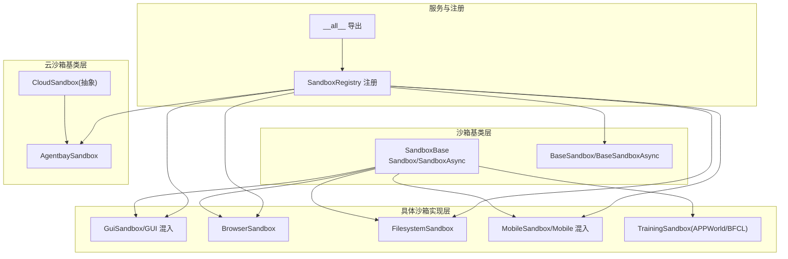
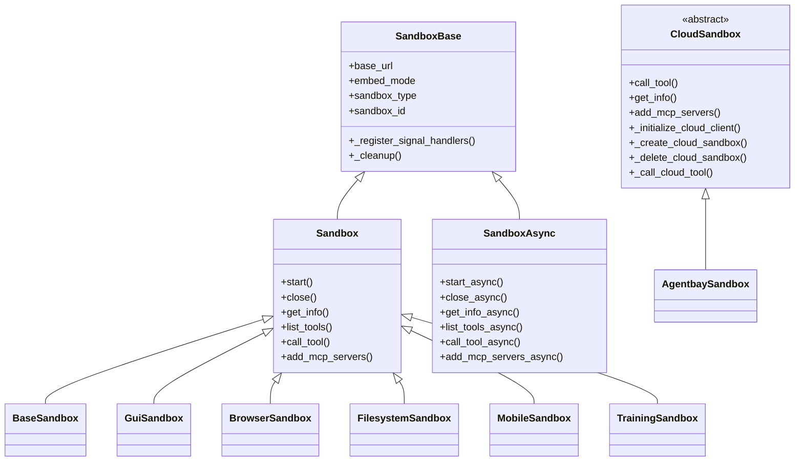
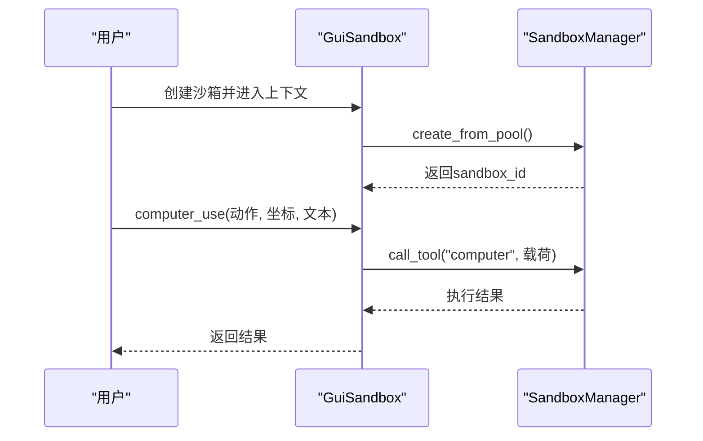
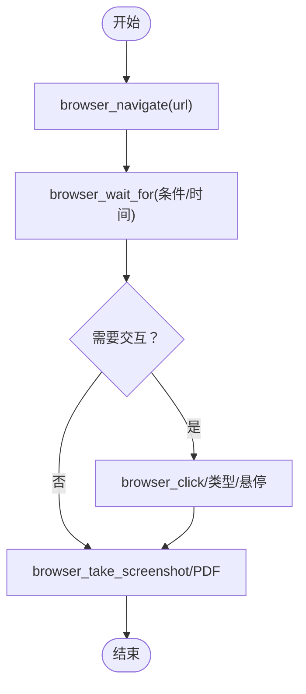
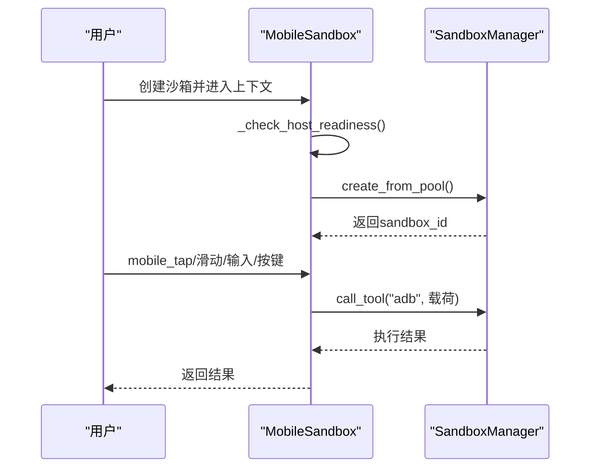
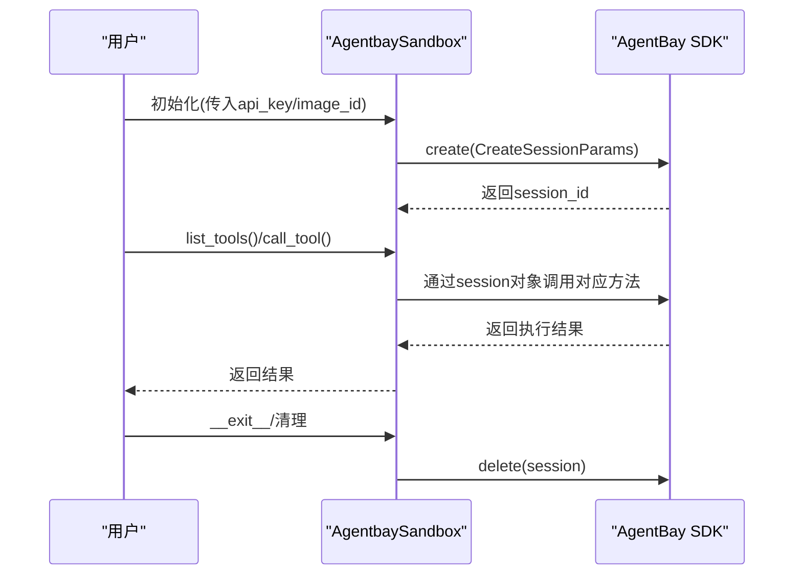
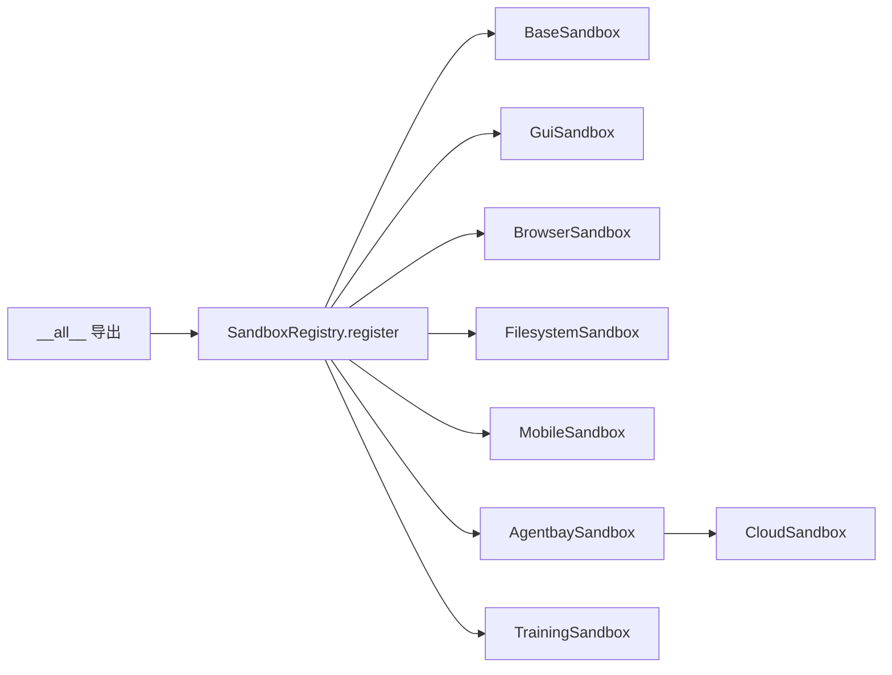

# 沙箱示例

<cite>
**本文引用的文件**
- [src/agentscope_runtime/sandbox/__init__.py](file://src/agentscope_runtime/sandbox/__init__.py)
- [src/agentscope_runtime/sandbox/box/sandbox.py](file://src/agentscope_runtime/sandbox/box/sandbox.py)
- [src/agentscope_runtime/sandbox/box/base/base_sandbox.py](file://src/agentscope_runtime/sandbox/box/base/base_sandbox.py)
- [src/agentscope_runtime/sandbox/box/gui/gui_sandbox.py](file://src/agentscope_runtime/sandbox/box/gui/gui_sandbox.py)
- [src/agentscope_runtime/sandbox/box/browser/browser_sandbox.py](file://src/agentscope_runtime/sandbox/box/browser/browser_sandbox.py)
- [src/agentscope_runtime/sandbox/box/filesystem/filesystem_sandbox.py](file://src/agentscope_runtime/sandbox/box/filesystem/filesystem_sandbox.py)
- [src/agentscope_runtime/sandbox/box/mobile/mobile_sandbox.py](file://src/agentscope_runtime/sandbox/box/mobile/mobile_sandbox.py)
- [src/agentscope_runtime/sandbox/box/cloud/cloud_sandbox.py](file://src/agentscope_runtime/sandbox/box/cloud/cloud_sandbox.py)
- [src/agentscope_runtime/sandbox/box/agentbay/agentbay_sandbox.py](file://src/agentscope_runtime/sandbox/box/agentbay/agentbay_sandbox.py)
- [src/agentscope_runtime/sandbox/box/training_box/training_box.py](file://src/agentscope_runtime/sandbox/box/training_box/training_box.py)
- [examples/sandbox/agentbay_sandbox/README.md](file://examples/sandbox/agentbay_sandbox/README.md)
- [examples/sandbox/custom_sandbox/README.md](file://examples/sandbox/custom_sandbox/README.md)
- [cookbook/zh/sandbox/sandbox.md](file://cookbook/zh/sandbox/sandbox.md)
</cite>

## 目录
1. [简介](#简介)
2. [项目结构](#项目结构)
3. [核心组件](#核心组件)
4. [架构总览](#架构总览)
5. [详细组件分析](#详细组件分析)
6. [依赖关系分析](#依赖关系分析)
7. [性能考虑](#性能考虑)
8. [故障排除指南](#故障排除指南)
9. [结论](#结论)
10. [附录](#附录)

## 简介
本示例文档面向AgentScope Runtime的沙箱能力，系统化讲解各类沙箱的使用方法、配置选项与安全隔离机制，覆盖GUI沙箱、浏览器沙箱、文件系统沙箱、移动设备沙箱、训练沙箱，以及云沙箱（AgentBay）与自定义沙箱的实现与最佳实践。读者可据此快速完成沙箱的部署、调用与运维。

## 项目结构
AgentScope Runtime的沙箱体系由“沙箱基类层”“具体沙箱实现层”“云沙箱基类层”“服务与注册层”构成，配合示例与文档，形成从入门到进阶的完整实践路径。

**图表来源**
- [src/agentscope_runtime/sandbox/box/sandbox.py:18-313](file://src/agentscope_runtime/sandbox/box/sandbox.py#L18-L313)
- [src/agentscope_runtime/sandbox/box/base/base_sandbox.py:11-102](file://src/agentscope_runtime/sandbox/box/base/base_sandbox.py#L11-L102)
- [src/agentscope_runtime/sandbox/box/gui/gui_sandbox.py:17-240](file://src/agentscope_runtime/sandbox/box/gui/gui_sandbox.py#L17-L240)
- [src/agentscope_runtime/sandbox/box/browser/browser_sandbox.py:31-498](file://src/agentscope_runtime/sandbox/box/browser/browser_sandbox.py#L31-L498)
- [src/agentscope_runtime/sandbox/box/filesystem/filesystem_sandbox.py:13-254](file://src/agentscope_runtime/sandbox/box/filesystem/filesystem_sandbox.py#L13-L254)
- [src/agentscope_runtime/sandbox/box/mobile/mobile_sandbox.py:17-342](file://src/agentscope_runtime/sandbox/box/mobile/mobile_sandbox.py#L17-L342)
- [src/agentscope_runtime/sandbox/box/cloud/cloud_sandbox.py:19-251](file://src/agentscope_runtime/sandbox/box/cloud/cloud_sandbox.py#L19-L251)
- [src/agentscope_runtime/sandbox/box/agentbay/agentbay_sandbox.py:20-558](file://src/agentscope_runtime/sandbox/box/agentbay/agentbay_sandbox.py#L20-L558)
- [src/agentscope_runtime/sandbox/box/training_box/training_box.py:18-295](file://src/agentscope_runtime/sandbox/box/training_box/training_box.py#L18-L295)
- [src/agentscope_runtime/sandbox/__init__.py:1-33](file://src/agentscope_runtime/sandbox/__init__.py#L1-L33)

**章节来源**
- [src/agentscope_runtime/sandbox/__init__.py:1-33](file://src/agentscope_runtime/sandbox/__init__.py#L1-L33)
- [src/agentscope_runtime/sandbox/box/sandbox.py:18-313](file://src/agentscope_runtime/sandbox/box/sandbox.py#L18-L313)

## 核心组件
- 沙箱基类与生命周期
  - SandboxBase：统一处理嵌入式/远程模式、信号处理、清理逻辑。
  - Sandbox/SandboxAsync：上下文管理、创建/释放、工具调用、MCP集成。
- 基础沙箱
  - BaseSandbox/BaseSandboxAsync：提供run_ipython_cell、run_shell_command等基础工具。
- GUI/浏览器/文件系统/移动设备沙箱
  - GuiSandbox/BrowserSandbox/FilesystemSandbox/MobileSandbox：分别提供桌面交互、浏览器自动化、文件系统操作、移动端ADB操作。
- 云沙箱与AgentBay
  - CloudSandbox：云沙箱抽象基类，统一云API调用、会话生命周期。
  - AgentbaySandbox：对接AgentBay云服务，支持多镜像类型与会话管理。
- 训练沙箱
  - TrainingSandbox：封装训练/评测流程的工具调用，含APPWorld与BFCL两类环境。

**章节来源**
- [src/agentscope_runtime/sandbox/box/sandbox.py:18-313](file://src/agentscope_runtime/sandbox/box/sandbox.py#L18-L313)
- [src/agentscope_runtime/sandbox/box/base/base_sandbox.py:11-102](file://src/agentscope_runtime/sandbox/box/base/base_sandbox.py#L11-L102)
- [src/agentscope_runtime/sandbox/box/gui/gui_sandbox.py:65-240](file://src/agentscope_runtime/sandbox/box/gui/gui_sandbox.py#L65-L240)
- [src/agentscope_runtime/sandbox/box/browser/browser_sandbox.py:31-498](file://src/agentscope_runtime/sandbox/box/browser/browser_sandbox.py#L31-L498)
- [src/agentscope_runtime/sandbox/box/filesystem/filesystem_sandbox.py:13-254](file://src/agentscope_runtime/sandbox/box/filesystem/filesystem_sandbox.py#L13-L254)
- [src/agentscope_runtime/sandbox/box/mobile/mobile_sandbox.py:80-342](file://src/agentscope_runtime/sandbox/box/mobile/mobile_sandbox.py#L80-L342)
- [src/agentscope_runtime/sandbox/box/cloud/cloud_sandbox.py:19-251](file://src/agentscope_runtime/sandbox/box/cloud/cloud_sandbox.py#L19-L251)
- [src/agentscope_runtime/sandbox/box/agentbay/agentbay_sandbox.py:20-558](file://src/agentscope_runtime/sandbox/box/agentbay/agentbay_sandbox.py#L20-L558)
- [src/agentscope_runtime/sandbox/box/training_box/training_box.py:18-295](file://src/agentscope_runtime/sandbox/box/training_box/training_box.py#L18-L295)

## 架构总览
沙箱采用“注册表+统一管理”的设计：通过SandboxRegistry注册各沙箱类型，SandboxManager负责容器/云会话的创建与回收；具体沙箱类通过call_tool映射到工具执行器，实现跨类型一致的API。

**图表来源**
- [src/agentscope_runtime/sandbox/box/sandbox.py:18-313](file://src/agentscope_runtime/sandbox/box/sandbox.py#L18-L313)
- [src/agentscope_runtime/sandbox/box/cloud/cloud_sandbox.py:19-251](file://src/agentscope_runtime/sandbox/box/cloud/cloud_sandbox.py#L19-L251)
- [src/agentscope_runtime/sandbox/box/agentbay/agentbay_sandbox.py:27-558](file://src/agentscope_runtime/sandbox/box/agentbay/agentbay_sandbox.py#L27-L558)

## 详细组件分析

### 基础沙箱（BaseSandbox）
- 能力：在隔离环境中执行Python代码与Shell命令。
- 使用要点：
  - 同步/异步两种模式，均支持MCP服务器动态注入。
  - 通过call_tool统一调用底层工具，避免直接操作容器细节。
- 示例路径：
  - [基础沙箱使用示例:128-148](file://cookbook/zh/sandbox/sandbox.md#L128-L148)

**章节来源**
- [src/agentscope_runtime/sandbox/box/base/base_sandbox.py:11-102](file://src/agentscope_runtime/sandbox/box/base/base_sandbox.py#L11-L102)
- [cookbook/zh/sandbox/sandbox.md:126-148](file://cookbook/zh/sandbox/sandbox.md#L126-L148)

### GUI沙箱（GuiSandbox）
- 能力：提供可视化桌面环境，支持鼠标键盘交互与截图。
- 关键点：
  - desktop_url属性生成VNC访问链接，便于远程查看。
  - computer_use支持多种动作（点击、拖拽、输入、截图等）。
  - ARM架构兼容性提示，避免Chromium崩溃。
- 示例路径：
  - [GUI沙箱使用示例:154-176](file://cookbook/zh/sandbox/sandbox.md#L154-L176)

**图表来源**
- [src/agentscope_runtime/sandbox/box/gui/gui_sandbox.py:98-151](file://src/agentscope_runtime/sandbox/box/gui/gui_sandbox.py#L98-L151)
- [src/agentscope_runtime/sandbox/box/sandbox.py:148-218](file://src/agentscope_runtime/sandbox/box/sandbox.py#L148-L218)

**章节来源**
- [src/agentscope_runtime/sandbox/box/gui/gui_sandbox.py:65-240](file://src/agentscope_runtime/sandbox/box/gui/gui_sandbox.py#L65-L240)
- [cookbook/zh/sandbox/sandbox.md:150-176](file://cookbook/zh/sandbox/sandbox.md#L150-L176)

### 浏览器沙箱（BrowserSandbox）
- 能力：在沙箱内进行网页导航、元素点击、输入、截图、PDF导出、网络请求监控等。
- 关键点：
  - 工具方法覆盖浏览器常用操作，支持等待条件、对话框处理、文件上传等。
  - desktop_url同样可用于VNC访问。
- 示例路径：
  - [浏览器沙箱使用示例:208-228](file://cookbook/zh/sandbox/sandbox.md#L208-L228)

**图表来源**
- [src/agentscope_runtime/sandbox/box/browser/browser_sandbox.py:104-301](file://src/agentscope_runtime/sandbox/box/browser/browser_sandbox.py#L104-L301)

**章节来源**
- [src/agentscope_runtime/sandbox/box/browser/browser_sandbox.py:31-498](file://src/agentscope_runtime/sandbox/box/browser/browser_sandbox.py#L31-L498)
- [cookbook/zh/sandbox/sandbox.md:204-228](file://cookbook/zh/sandbox/sandbox.md#L204-L228)

### 文件系统沙箱（FilesystemSandbox）
- 能力：在GUI沙箱基础上提供文件读写、目录管理、搜索、信息查询等。
- 关键点：
  - 支持批量读取、行级编辑、目录树视图、允许访问目录列表。
- 示例路径：
  - [文件系统沙箱使用示例:182-202](file://cookbook/zh/sandbox/sandbox.md#L182-L202)

**章节来源**
- [src/agentscope_runtime/sandbox/box/filesystem/filesystem_sandbox.py:13-254](file://src/agentscope_runtime/sandbox/box/filesystem/filesystem_sandbox.py#L13-L254)
- [cookbook/zh/sandbox/sandbox.md:178-202](file://cookbook/zh/sandbox/sandbox.md#L178-L202)

### 移动设备沙箱（MobileSandbox）
- 能力：通过ADB在Android模拟器上进行点击、滑动、输入、按键、截图等。
- 关键点：
  - mobile_url提供websockify访问入口。
  - 首次初始化时进行宿主机准备检查（Binder/ASHMEM模块）。
  - 支持同步/异步两种模式。
- 示例路径：
  - [移动设备沙箱使用示例:251-279](file://cookbook/zh/sandbox/sandbox.md#L251-L279)

**图表来源**
- [src/agentscope_runtime/sandbox/box/mobile/mobile_sandbox.py:111-164](file://src/agentscope_runtime/sandbox/box/mobile/mobile_sandbox.py#L111-L164)
- [src/agentscope_runtime/sandbox/box/sandbox.py:148-218](file://src/agentscope_runtime/sandbox/box/sandbox.py#L148-L218)

**章节来源**
- [src/agentscope_runtime/sandbox/box/mobile/mobile_sandbox.py:80-342](file://src/agentscope_runtime/sandbox/box/mobile/mobile_sandbox.py#L80-L342)
- [cookbook/zh/sandbox/sandbox.md:230-279](file://cookbook/zh/sandbox/sandbox.md#L230-L279)

### 训练沙箱（TrainingSandbox）
- 能力：封装训练/评测流程，支持创建实例、获取任务ID/环境配置、执行一步、评估与释放实例。
- 类型：
  - APPWorldSandbox：面向AppWorld环境，配置共享内存。
  - BFCLSandbox：面向BFCL环境，注入数据路径与API密钥等环境变量。
- 示例路径：
  - [训练沙箱使用示例:283-290](file://cookbook/zh/sandbox/sandbox.md#L283-L290)

**章节来源**
- [src/agentscope_runtime/sandbox/box/training_box/training_box.py:18-295](file://src/agentscope_runtime/sandbox/box/training_box/training_box.py#L18-L295)
- [cookbook/zh/sandbox/sandbox.md:281-290](file://cookbook/zh/sandbox/sandbox.md#L281-L290)

### 云沙箱与AgentBay（CloudSandbox + AgentbaySandbox）
- 能力：
  - CloudSandbox：抽象云沙箱通用接口，不依赖本地容器，直接通过云API管理会话。
  - AgentbaySandbox：对接AgentBay云服务，支持多镜像类型（Linux/Windows/Browser/CodeSpace/Mobile），提供会话创建、工具映射、信息查询与会话列表。
- 安全与隔离：
  - 云沙箱通过API密钥鉴权，会话生命周期由云服务管理，避免本地容器资源泄露。
- 示例路径：
  - [AgentBay沙箱使用示例:88-133](file://examples/sandbox/agentbay_sandbox/README.md#L88-L133)

**图表来源**
- [src/agentscope_runtime/sandbox/box/agentbay/agentbay_sandbox.py:115-187](file://src/agentscope_runtime/sandbox/box/agentbay/agentbay_sandbox.py#L115-L187)
- [src/agentscope_runtime/sandbox/box/cloud/cloud_sandbox.py:140-250](file://src/agentscope_runtime/sandbox/box/cloud/cloud_sandbox.py#L140-L250)

**章节来源**
- [src/agentscope_runtime/sandbox/box/cloud/cloud_sandbox.py:19-251](file://src/agentscope_runtime/sandbox/box/cloud/cloud_sandbox.py#L19-L251)
- [src/agentscope_runtime/sandbox/box/agentbay/agentbay_sandbox.py:20-558](file://src/agentscope_runtime/sandbox/box/agentbay/agentbay_sandbox.py#L20-L558)
- [examples/sandbox/agentbay_sandbox/README.md:88-133](file://examples/sandbox/agentbay_sandbox/README.md#L88-L133)

### 自定义沙箱（Custom Sandbox）
- 能力：通过继承Sandbox并使用SandboxRegistry.register注册，实现自定义沙箱类型与工具映射。
- 关键点：
  - 需要安装在可编辑模式，便于迭代开发与注册生效。
  - Dockerfile与MCP配置文件决定沙箱能力边界。
- 示例路径：
  - [自定义沙箱构建与使用:1-184](file://examples/sandbox/custom_sandbox/README.md#L1-L184)

**章节来源**
- [examples/sandbox/custom_sandbox/README.md:1-184](file://examples/sandbox/custom_sandbox/README.md#L1-L184)

## 依赖关系分析
- 组件耦合
  - 具体沙箱类均依赖SandboxBase/Sandbox/SandboxAsync，保证统一生命周期与工具调用接口。
  - 云沙箱通过CloudSandbox抽象，屏蔽不同云提供商差异。
- 外部依赖
  - AgentBay沙箱依赖AgentBay SDK；移动沙箱依赖ADB与宿主机模块；训练沙箱依赖专用镜像与数据集。
- 注册与导出
  - 通过SandboxRegistry.register声明沙箱类型、安全等级、超时、环境变量等元信息；__all__集中导出，便于上层按需导入。

**图表来源**
- [src/agentscope_runtime/sandbox/__init__.py:18-32](file://src/agentscope_runtime/sandbox/__init__.py#L18-L32)
- [src/agentscope_runtime/sandbox/box/base/base_sandbox.py:11-17](file://src/agentscope_runtime/sandbox/box/base/base_sandbox.py#L11-L17)
- [src/agentscope_runtime/sandbox/box/agentbay/agentbay_sandbox.py:20-26](file://src/agentscope_runtime/sandbox/box/agentbay/agentbay_sandbox.py#L20-L26)

**章节来源**
- [src/agentscope_runtime/sandbox/__init__.py:1-33](file://src/agentscope_runtime/sandbox/__init__.py#L1-L33)

## 性能考虑
- 资源限制
  - 训练沙箱针对APPWorld/BFCL设置了共享内存(shm_size)，以满足高负载场景。
  - 移动沙箱在ARM架构下可能遇到兼容性问题，建议在x86主机运行。
- 超时与并发
  - 各沙箱类型通过常量TIMEOUT统一超时控制，避免长时间阻塞。
- 远程访问
  - GUI/浏览器/移动沙箱通过VNC/websockify提供远程访问，注意带宽与延迟对交互体验的影响。
- MCP集成
  - 通过add_mcp_servers按需注入工具，减少不必要的进程开销。

[本节为通用指导，无需特定文件引用]

## 故障排除指南
- 沙箱未启动/沙箱ID为空
  - 现象：访问sandbox_id时报错提示沙箱尚未启动。
  - 处理：确保使用with上下文或显式start()/start_async()后再调用工具。
  - 参考：[SandboxBase.sandbox_id属性与错误日志:87-103](file://src/agentscope_runtime/sandbox/box/sandbox.py#L87-L103)
- 信号中断与清理
  - 处理：注册SIGINT/SIGTERM信号，退出时自动清理资源。
  - 参考：[信号处理与清理:105-146](file://src/agentscope_runtime/sandbox/box/sandbox.py#L105-L146)
- 移动设备沙箱宿主机准备
  - 现象：无法启动移动沙箱或ADB不可用。
  - 处理：在Linux主机加载binder与ashmem模块；必要时启用Rosetta以提升兼容性。
  - 参考：[移动沙箱宿主机检查与注意事项:111-113](file://src/agentscope_runtime/sandbox/box/mobile/mobile_sandbox.py#L111-L113)
- AgentBay沙箱API密钥
  - 现象：初始化失败或会话创建失败。
  - 处理：设置AGENTBAY_API_KEY环境变量或在构造函数传入api_key。
  - 参考：[AgentBay初始化与错误处理:67-73](file://src/agentscope_runtime/sandbox/box/agentbay/agentbay_sandbox.py#L67-L73)
- 远程沙箱连接
  - 现象：远程访问失败或权限不足。
  - 处理：确认base_url、bearer_token配置正确；检查防火墙与代理设置。
  - 参考：[远程沙箱连接示例:381-387](file://cookbook/zh/sandbox/sandbox.md#L381-L387)

**章节来源**
- [src/agentscope_runtime/sandbox/box/sandbox.py:87-146](file://src/agentscope_runtime/sandbox/box/sandbox.py#L87-L146)
- [src/agentscope_runtime/sandbox/box/mobile/mobile_sandbox.py:111-113](file://src/agentscope_runtime/sandbox/box/mobile/mobile_sandbox.py#L111-L113)
- [src/agentscope_runtime/sandbox/box/agentbay/agentbay_sandbox.py:67-73](file://src/agentscope_runtime/sandbox/box/agentbay/agentbay_sandbox.py#L67-L73)
- [cookbook/zh/sandbox/sandbox.md:381-387](file://cookbook/zh/sandbox/sandbox.md#L381-L387)

## 结论
AgentScope Runtime的沙箱体系以统一的注册与管理机制为核心，覆盖从基础命令执行到复杂GUI/浏览器/文件系统/移动端/训练/云沙箱的全场景需求。通过合理的资源配置、超时控制与安全隔离策略，可在保证稳定性的同时最大化灵活性。自定义沙箱与AgentBay云沙箱进一步拓展了生态边界，满足多样化业务场景。

[本节为总结，无需特定文件引用]

## 附录
- 快速开始与示例路径
  - [基础沙箱示例:128-148](file://cookbook/zh/sandbox/sandbox.md#L128-L148)
  - [GUI沙箱示例:154-176](file://cookbook/zh/sandbox/sandbox.md#L154-L176)
  - [浏览器沙箱示例:208-228](file://cookbook/zh/sandbox/sandbox.md#L208-L228)
  - [文件系统沙箱示例:182-202](file://cookbook/zh/sandbox/sandbox.md#L182-L202)
  - [移动设备沙箱示例:251-279](file://cookbook/zh/sandbox/sandbox.md#L251-L279)
  - [训练沙箱示例:283-290](file://cookbook/zh/sandbox/sandbox.md#L283-L290)
  - [AgentBay沙箱示例:88-133](file://examples/sandbox/agentbay_sandbox/README.md#L88-L133)
  - [自定义沙箱示例:1-184](file://examples/sandbox/custom_sandbox/README.md#L1-L184)

[本节为补充材料，无需特定文件引用]