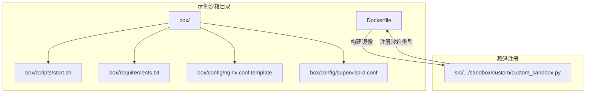
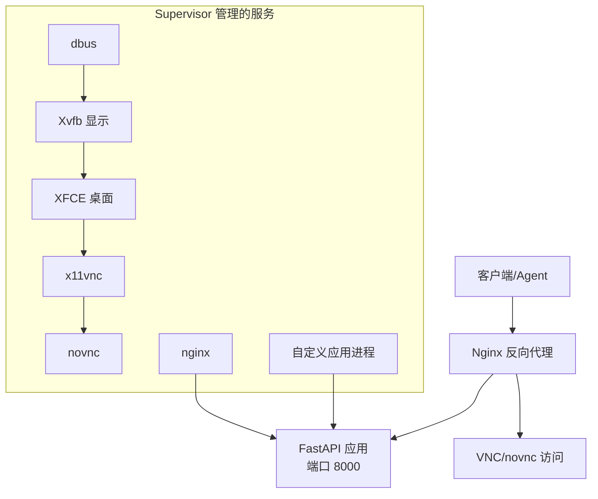
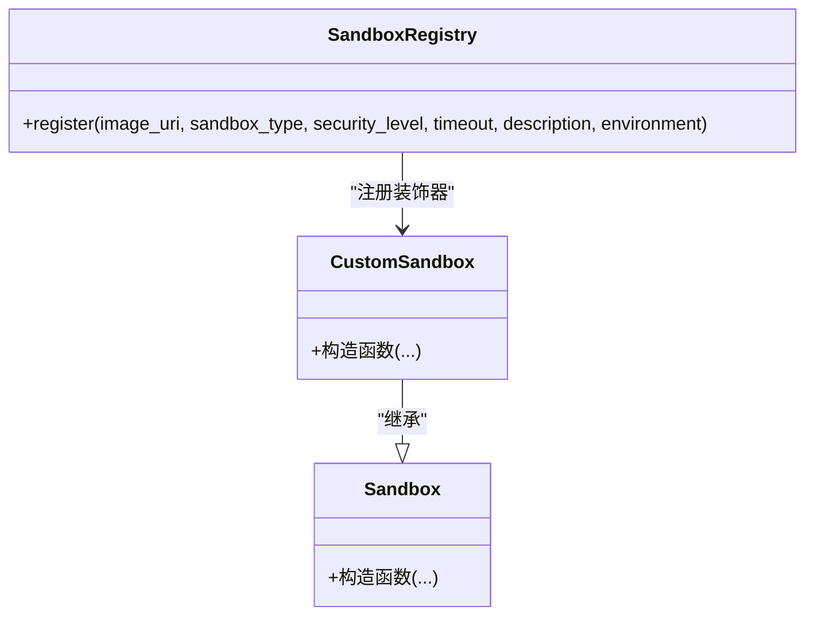
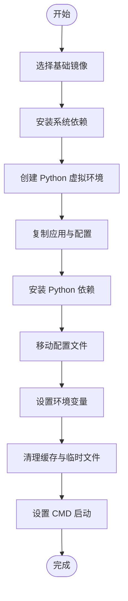
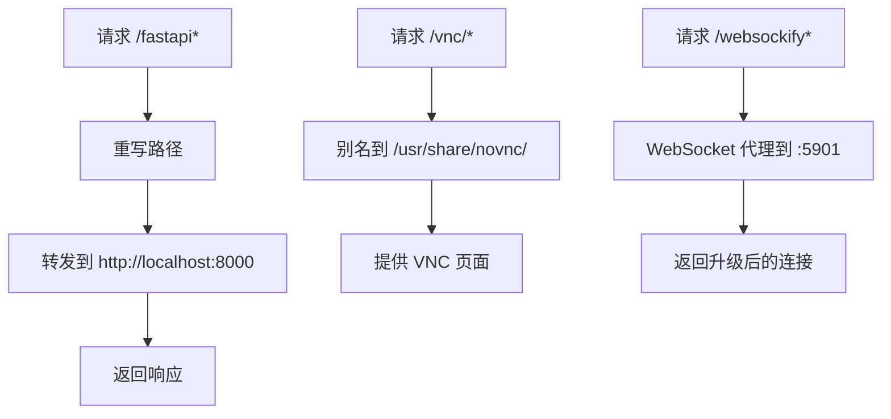
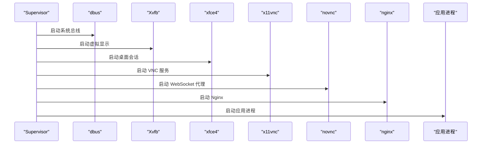
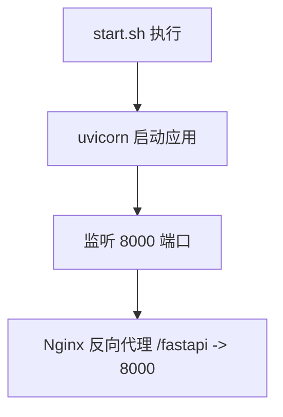
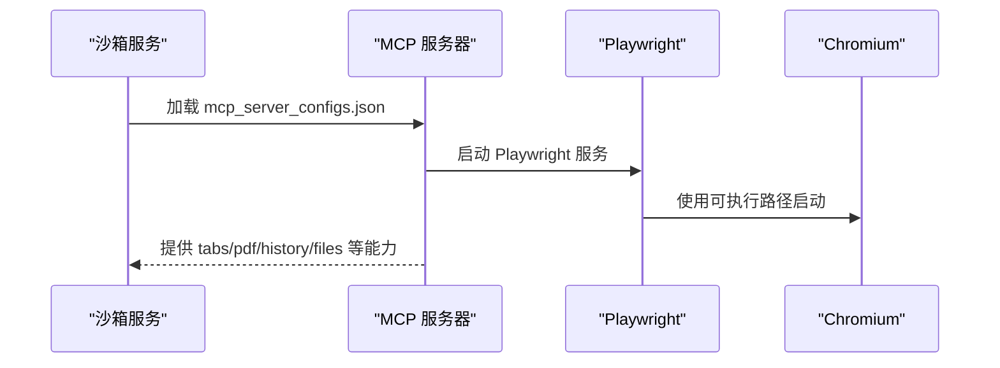
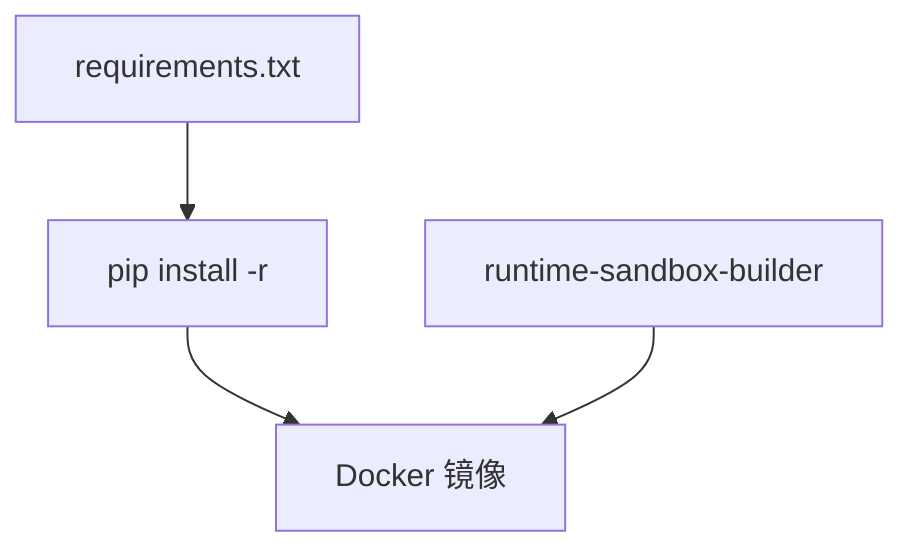
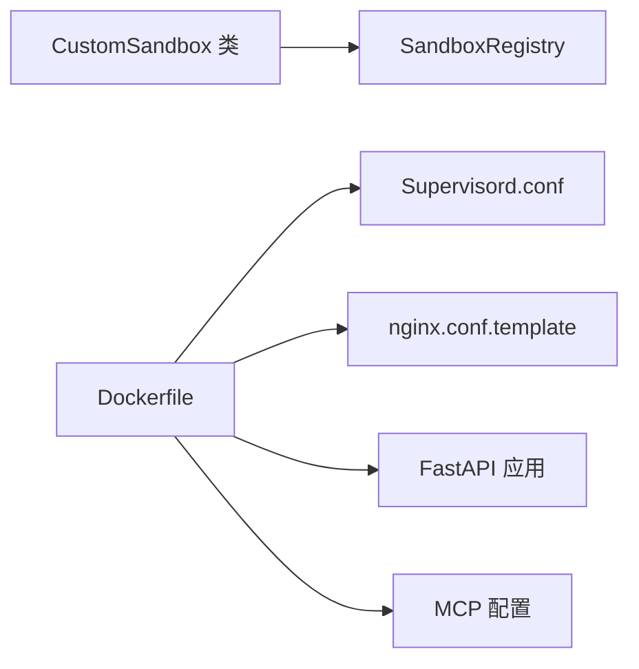

# 自定义沙箱示例

<cite>
**本文引用的文件**
- [examples/sandbox/custom_sandbox/Dockerfile](file://examples/sandbox/custom_sandbox/Dockerfile)
- [examples/sandbox/custom_sandbox/README.md](file://examples/sandbox/custom_sandbox/README.md)
- [examples/sandbox/custom_sandbox/box/requirements.txt](file://examples/sandbox/custom_sandbox/box/requirements.txt)
- [examples/sandbox/custom_sandbox/box/scripts/start.sh](file://examples/sandbox/custom_sandbox/box/scripts/start.sh)
- [examples/sandbox/custom_sandbox/box/config/nginx.conf.template](file://examples/sandbox/custom_sandbox/box/config/nginx.conf.template)
- [examples/sandbox/custom_sandbox/box/config/supervisord.conf](file://examples/sandbox/custom_sandbox/box/config/supervisord.conf)
- [src/agentscope_runtime/sandbox/custom/custom_sandbox.py](file://src/agentscope_runtime/sandbox/custom/custom_sandbox.py)
- [src/agentscope_runtime/sandbox/box/browser/box/mcp_server_configs.json](file://src/agentscope_runtime/sandbox/box/browser/box/mcp_server_configs.json)
- [src/agentscope_runtime/sandbox/box/browser/box/playwright_mcp_config.json](file://src/agentscope_runtime/sandbox/box/browser/box/playwright_mcp_config.json)
- [src/agentscope_runtime/engine/deployers/utils/docker_image_utils/docker_image_builder.py](file://src/agentscope_runtime/engine/deployers/utils/docker_image_utils/docker_image_builder.py)
- [src/agentscope_runtime/engine/services/sandbox/sandbox_service.py](file://src/agentscope_runtime/engine/services/sandbox/sandbox_service.py)
</cite>

## 目录
1. [简介](#简介)
2. [项目结构](#项目结构)
3. [核心组件](#核心组件)
4. [架构总览](#架构总览)
5. [详细组件分析](#详细组件分析)
6. [依赖分析](#依赖分析)
7. [性能考虑](#性能考虑)
8. [故障排除指南](#故障排除指南)
9. [结论](#结论)
10. [附录](#附录)

## 简介
本示例面向需要在 AgentScope Runtime 中创建“自定义沙箱”的用户，系统性讲解如何从零搭建一个可运行、可扩展、可维护的沙箱环境。内容涵盖：
- 如何编写 Dockerfile 并构建沙箱镜像
- Nginx 配置模板与 Supervisor 的使用
- MCP 服务器与 Playwright 浏览器环境的配置
- 沙箱启动脚本与 Python 依赖管理（requirements.txt）
- 自定义沙箱的扩展点与注册机制
- 调试与故障排除的实用技巧

## 项目结构
该示例位于 examples/sandbox/custom_sandbox 目录下，包含以下关键要素：
- Dockerfile：用于构建自定义沙箱镜像
- box/requirements.txt：Python 依赖清单
- box/scripts/start.sh：沙箱应用启动脚本
- box/config/nginx.conf.template：反向代理与静态资源转发模板
- box/config/supervisord.conf：多进程守护与桌面环境初始化
- README.md：构建与使用的操作指南
- src/agentscope_runtime/sandbox/custom/custom_sandbox.py：自定义沙箱类与注册入口

**图表来源**
- [examples/sandbox/custom_sandbox/Dockerfile:1-84](file://examples/sandbox/custom_sandbox/Dockerfile#L1-L84)
- [examples/sandbox/custom_sandbox/box/scripts/start.sh:1-5](file://examples/sandbox/custom_sandbox/box/scripts/start.sh#L1-L5)
- [examples/sandbox/custom_sandbox/box/requirements.txt:1-9](file://examples/sandbox/custom_sandbox/box/requirements.txt#L1-L9)
- [examples/sandbox/custom_sandbox/box/config/nginx.conf.template:1-47](file://examples/sandbox/custom_sandbox/box/config/nginx.conf.template#L1-L47)
- [examples/sandbox/custom_sandbox/box/config/supervisord.conf:1-65](file://examples/sandbox/custom_sandbox/box/config/supervisord.conf#L1-L65)
- [src/agentscope_runtime/sandbox/custom/custom_sandbox.py:1-39](file://src/agentscope_runtime/sandbox/custom/custom_sandbox.py#L1-L39)

**章节来源**
- [examples/sandbox/custom_sandbox/README.md:1-184](file://examples/sandbox/custom_sandbox/README.md#L1-L184)

## 核心组件
- 自定义沙箱类：通过装饰器注册到系统，声明沙箱类型、安全等级、超时时间与环境变量等元信息，并继承基础沙箱能力。
- Dockerfile：定义基础镜像、安装系统依赖、浏览器与桌面环境、复制应用与配置、安装 Python 依赖、设置环境变量与启动命令。
- 启动脚本：启动 FastAPI 应用，作为沙箱内部服务对外提供接口。
- Nginx 模板：将 /fastapi 前缀转发至本地 8000 端口，同时提供 VNC 访问与 WebSocket 代理。
- Supervisor 配置：统一管理 dbus、Xvfb、XFCE 桌面、x11vnc、novnc、nginx 以及自定义应用进程。
- MCP 与 Playwright：通过配置文件声明 Playwright MCP 服务器及其运行参数与浏览器选项。

**章节来源**
- [src/agentscope_runtime/sandbox/custom/custom_sandbox.py:15-39](file://src/agentscope_runtime/sandbox/custom/custom_sandbox.py#L15-L39)
- [examples/sandbox/custom_sandbox/Dockerfile:1-84](file://examples/sandbox/custom_sandbox/Dockerfile#L1-L84)
- [examples/sandbox/custom_sandbox/box/scripts/start.sh:1-5](file://examples/sandbox/custom_sandbox/box/scripts/start.sh#L1-L5)
- [examples/sandbox/custom_sandbox/box/config/nginx.conf.template:1-47](file://examples/sandbox/custom_sandbox/box/config/nginx.conf.template#L1-L47)
- [examples/sandbox/custom_sandbox/box/config/supervisord.conf:1-65](file://examples/sandbox/custom_sandbox/box/config/supervisord.conf#L1-L65)
- [src/agentscope_runtime/sandbox/box/browser/box/mcp_server_configs.json:1-14](file://src/agentscope_runtime/sandbox/box/browser/box/mcp_server_configs.json#L1-L14)
- [src/agentscope_runtime/sandbox/box/browser/box/playwright_mcp_config.json:1-23](file://src/agentscope_runtime/sandbox/box/browser/box/playwright_mcp_config.json#L1-L23)

## 架构总览
自定义沙箱的运行架构由“容器层”和“应用层”组成：
- 容器层：Supervisor 统一管理多个后台服务（Xvfb、桌面、VNC、Nginx、应用），Nginx 提供统一入口与反向代理。
- 应用层：FastAPI 应用监听 8000 端口，提供沙箱内部 API；MCP 服务器（如 Playwright）提供浏览器自动化能力；可选 GUI 通过 VNC/novnc 访问。

**图表来源**
- [examples/sandbox/custom_sandbox/box/config/supervisord.conf:1-65](file://examples/sandbox/custom_sandbox/box/config/supervisord.conf#L1-L65)
- [examples/sandbox/custom_sandbox/box/config/nginx.conf.template:1-47](file://examples/sandbox/custom_sandbox/box/config/nginx.conf.template#L1-L47)
- [examples/sandbox/custom_sandbox/box/scripts/start.sh:1-5](file://examples/sandbox/custom_sandbox/box/scripts/start.sh#L1-L5)

## 详细组件分析

### 自定义沙箱类与注册机制
- 注册装饰器：通过注册表将自定义沙箱类型与镜像 URI、安全等级、超时、描述及环境变量绑定。
- 继承关系：自定义沙箱类继承基础沙箱，复用通用生命周期与网络能力。
- 元数据：支持动态注入环境变量（如第三方 API 密钥），便于在沙箱内调用外部服务。

**图表来源**
- [src/agentscope_runtime/sandbox/custom/custom_sandbox.py:15-39](file://src/agentscope_runtime/sandbox/custom/custom_sandbox.py#L15-L39)

**章节来源**
- [src/agentscope_runtime/sandbox/custom/custom_sandbox.py:1-39](file://src/agentscope_runtime/sandbox/custom/custom_sandbox.py#L1-L39)

### Dockerfile 编写与镜像构建
- 基础镜像与系统依赖：安装 Chromium、桌面环境、VNC、Nginx、Supervisor 等。
- Python 环境：使用 venv 创建隔离环境，复制应用与路由模块，安装 requirements.txt。
- 运行时配置：移动配置文件到标准路径，设置环境变量（如 API Key），清理缓存以减小镜像体积。
- 启动命令：通过 envsubst 渲染 Nginx 模板，然后以 Supervisord 管理所有服务。

**图表来源**
- [examples/sandbox/custom_sandbox/Dockerfile:1-84](file://examples/sandbox/custom_sandbox/Dockerfile#L1-L84)

**章节来源**
- [examples/sandbox/custom_sandbox/Dockerfile:1-84](file://examples/sandbox/custom_sandbox/Dockerfile#L1-L84)

### Nginx 配置模板与反向代理
- /fastapi 前缀：重写路径后转发至本地 8000 端口，支持 WebSocket 升级。
- /vnc/ 与 /websockify：提供 VNC 访问与 WebSocket 代理，结合 x11vnc 与 novnc。
- 动态超时：通过模板变量控制代理超时，便于按需调整。

**图表来源**
- [examples/sandbox/custom_sandbox/box/config/nginx.conf.template:1-47](file://examples/sandbox/custom_sandbox/box/config/nginx.conf.template#L1-L47)

**章节来源**
- [examples/sandbox/custom_sandbox/box/config/nginx.conf.template:1-47](file://examples/sandbox/custom_sandbox/box/config/nginx.conf.template#L1-L47)

### Supervisor 配置与多进程管理
- dbus：系统总线服务，确保桌面环境可用。
- Xvfb：虚拟显示设备，用于无头图形环境。
- XFCE：轻量桌面环境，配合 VNC 提供可视化界面。
- x11vnc 与 novnc：提供 VNC 服务与网页端访问。
- nginx：反向代理与静态资源服务。
- 自定义应用：启动 FastAPI 应用，监听 8000 端口。

**图表来源**
- [examples/sandbox/custom_sandbox/box/config/supervisord.conf:1-65](file://examples/sandbox/custom_sandbox/box/config/supervisord.conf#L1-L65)

**章节来源**
- [examples/sandbox/custom_sandbox/box/config/supervisord.conf:1-65](file://examples/sandbox/custom_sandbox/box/config/supervisord.conf#L1-L65)

### 沙箱启动脚本与应用入口
- 启动脚本：使用 uvicorn 在 8000 端口启动 FastAPI 应用，前台运行并等待。
- 应用入口：Nginx 将 /fastapi 前缀转发到该端口，实现统一入口。

**图表来源**
- [examples/sandbox/custom_sandbox/box/scripts/start.sh:1-5](file://examples/sandbox/custom_sandbox/box/scripts/start.sh#L1-L5)
- [examples/sandbox/custom_sandbox/box/config/nginx.conf.template:16-25](file://examples/sandbox/custom_sandbox/box/config/nginx.conf.template#L16-L25)

**章节来源**
- [examples/sandbox/custom_sandbox/box/scripts/start.sh:1-5](file://examples/sandbox/custom_sandbox/box/scripts/start.sh#L1-L5)

### MCP 服务器与 Playwright 环境
- MCP 服务器配置：声明 Playwright MCP 服务器的命令与参数，指定配置文件路径。
- Playwright 配置：选择浏览器类型、可执行路径、上下文视口大小、启用的能力集与输出目录。
- 依赖要求：确保安装 mcp 与相关工具以支持 MCP 协议。

**图表来源**
- [src/agentscope_runtime/sandbox/box/browser/box/mcp_server_configs.json:1-14](file://src/agentscope_runtime/sandbox/box/browser/box/mcp_server_configs.json#L1-L14)
- [src/agentscope_runtime/sandbox/box/browser/box/playwright_mcp_config.json:1-23](file://src/agentscope_runtime/sandbox/box/browser/box/playwright_mcp_config.json#L1-L23)

**章节来源**
- [src/agentscope_runtime/sandbox/box/browser/box/mcp_server_configs.json:1-14](file://src/agentscope_runtime/sandbox/box/browser/box/mcp_server_configs.json#L1-L14)
- [src/agentscope_runtime/sandbox/box/browser/box/playwright_mcp_config.json:1-23](file://src/agentscope_runtime/sandbox/box/browser/box/playwright_mcp_config.json#L1-L23)

### 依赖管理与构建流程
- requirements.txt：集中管理 Python 依赖，包括 FastAPI、Uvicorn、Pydantic、Requests、MCP、aiofiles、uv、GitPython 等。
- 构建工具：使用内置构建器对自定义 Dockerfile 进行镜像构建，生成可直接使用的沙箱镜像。

**图表来源**
- [examples/sandbox/custom_sandbox/box/requirements.txt:1-9](file://examples/sandbox/custom_sandbox/box/requirements.txt#L1-L9)
- [examples/sandbox/custom_sandbox/README.md:171-184](file://examples/sandbox/custom_sandbox/README.md#L171-L184)

**章节来源**
- [examples/sandbox/custom_sandbox/box/requirements.txt:1-9](file://examples/sandbox/custom_sandbox/box/requirements.txt#L1-L9)
- [examples/sandbox/custom_sandbox/README.md:171-184](file://examples/sandbox/custom_sandbox/README.md#L171-L184)

## 依赖分析
- 组件耦合：自定义沙箱类通过注册表与系统解耦；Dockerfile 与 Supervisor/Nginx 配置共同决定运行时行为。
- 外部依赖：Chromium、桌面环境、VNC、Nginx、Supervisor、MCP 工具链。
- 可能的循环依赖：示例中未见直接循环导入；注意在自定义扩展时避免在沙箱类与配置之间形成循环引用。

**图表来源**
- [src/agentscope_runtime/sandbox/custom/custom_sandbox.py:15-39](file://src/agentscope_runtime/sandbox/custom/custom_sandbox.py#L15-L39)
- [examples/sandbox/custom_sandbox/Dockerfile:1-84](file://examples/sandbox/custom_sandbox/Dockerfile#L1-L84)
- [examples/sandbox/custom_sandbox/box/config/supervisord.conf:1-65](file://examples/sandbox/custom_sandbox/box/config/supervisord.conf#L1-L65)
- [examples/sandbox/custom_sandbox/box/config/nginx.conf.template:1-47](file://examples/sandbox/custom_sandbox/box/config/nginx.conf.template#L1-L47)
- [src/agentscope_runtime/sandbox/box/browser/box/mcp_server_configs.json:1-14](file://src/agentscope_runtime/sandbox/box/browser/box/mcp_server_configs.json#L1-L14)

## 性能考虑
- 镜像体积：通过清理 pip/npm 缓存与临时文件减少镜像大小，提升拉取与启动速度。
- 进程优先级：Supervisor 中为不同服务设置优先级，确保显示与桌面服务先于应用启动。
- 超时配置：通过 Nginx 模板中的超时变量控制代理超时，避免长时间空闲连接占用资源。
- 浏览器性能：在 Playwright 配置中合理设置视口大小与无头模式，平衡性能与功能需求。

## 故障排除指南
- 启动失败排查
  - 检查 Supervisor 日志：确认 dbus、Xvfb、桌面、VNC、nginx、应用进程是否正常启动。
  - 查看 Nginx 日志：验证 /fastapi 转发与 /vnc 访问是否正确。
  - 确认应用端口：确保 8000 端口已监听且无冲突。
- 浏览器与 GUI 问题
  - 确保 Chromium 可执行路径正确，桌面环境初始化完成后再启动 VNC。
  - 若 VNC 无法访问，检查 x11vnc 与 novnc 的端口映射与密码设置。
- MCP 与 Playwright
  - 确认 MCP 服务器命令与参数正确，配置文件路径有效。
  - 检查 Playwright 能力集与输出目录权限。
- 环境变量与密钥
  - 确保 API Key 等敏感信息在构建或运行时正确注入，避免沙箱内调用外部服务失败。

**章节来源**
- [examples/sandbox/custom_sandbox/box/config/supervisord.conf:1-65](file://examples/sandbox/custom_sandbox/box/config/supervisord.conf#L1-L65)
- [examples/sandbox/custom_sandbox/box/config/nginx.conf.template:1-47](file://examples/sandbox/custom_sandbox/box/config/nginx.conf.template#L1-L47)
- [src/agentscope_runtime/sandbox/box/browser/box/mcp_server_configs.json:1-14](file://src/agentscope_runtime/sandbox/box/browser/box/mcp_server_configs.json#L1-L14)
- [src/agentscope_runtime/sandbox/box/browser/box/playwright_mcp_config.json:1-23](file://src/agentscope_runtime/sandbox/box/browser/box/playwright_mcp_config.json#L1-L23)

## 结论
通过本示例，您可以基于现有沙箱模板快速创建自定义沙箱：编写 Dockerfile、准备 Nginx 与 Supervisor 配置、配置 MCP 与 Playwright、编写启动脚本与依赖清单，并通过注册机制将其纳入系统。建议在开发过程中遵循最小可行原则，逐步增加功能与依赖，同时关注镜像体积、启动顺序与日志可观测性，以便高效迭代与稳定运行。

## 附录
- 构建命令参考：使用内置构建器对自定义 Dockerfile 进行镜像构建。
- 运行时参数：通过环境变量控制 Nginx 超时与 VNC 密码等运行参数。
- 扩展建议：在自定义沙箱中引入更多 MCP 服务器或外部工具时，优先考虑依赖隔离与权限最小化。

**章节来源**
- [examples/sandbox/custom_sandbox/README.md:171-184](file://examples/sandbox/custom_sandbox/README.md#L171-L184)
- [examples/sandbox/custom_sandbox/Dockerfile:71-84](file://examples/sandbox/custom_sandbox/Dockerfile#L71-L84)