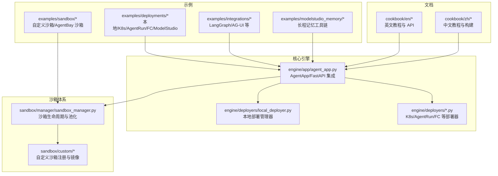
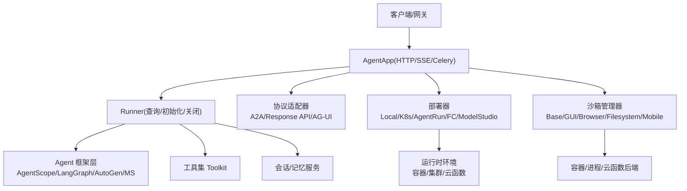
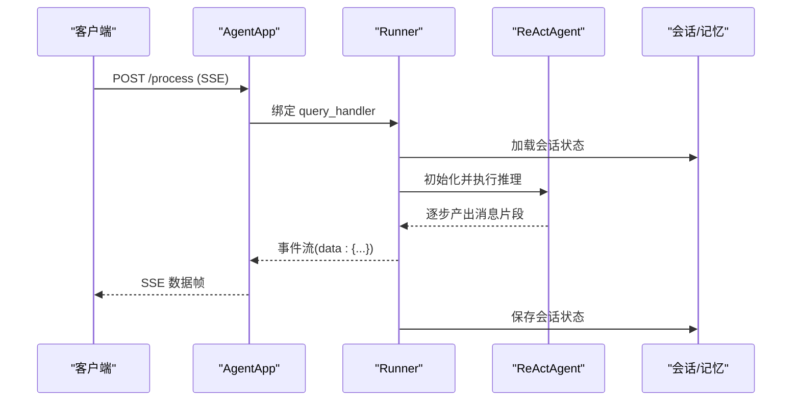
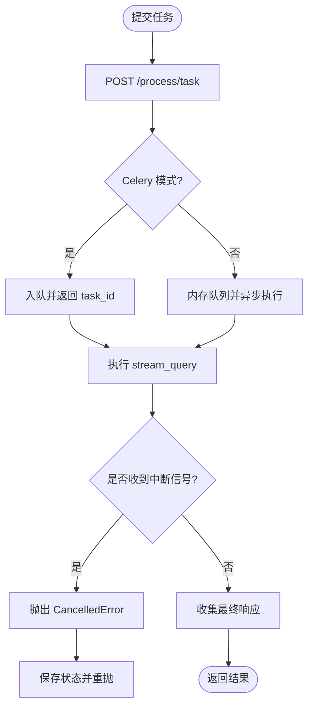
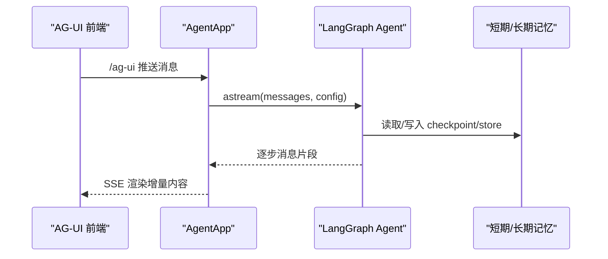
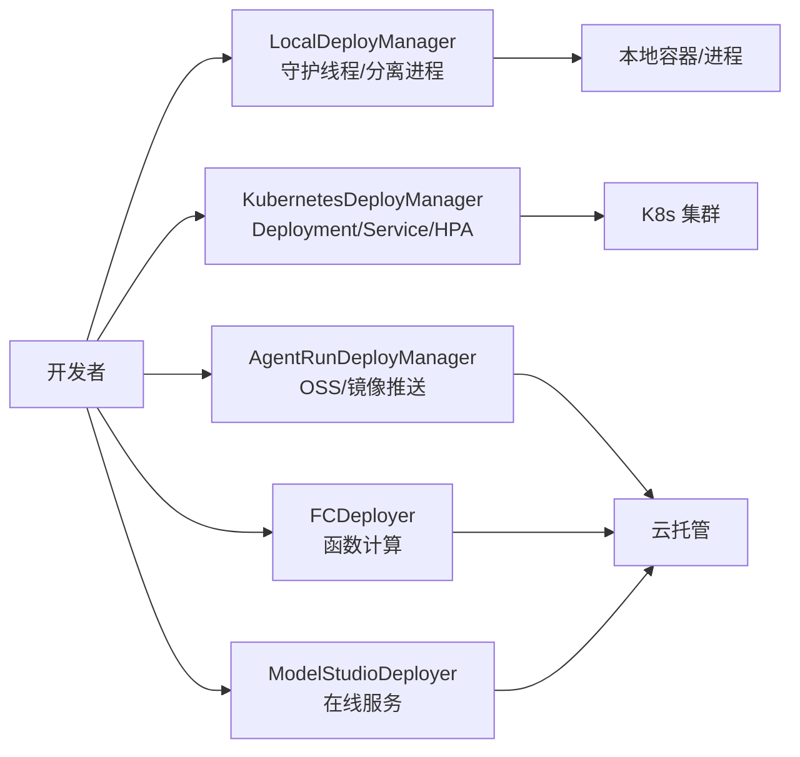
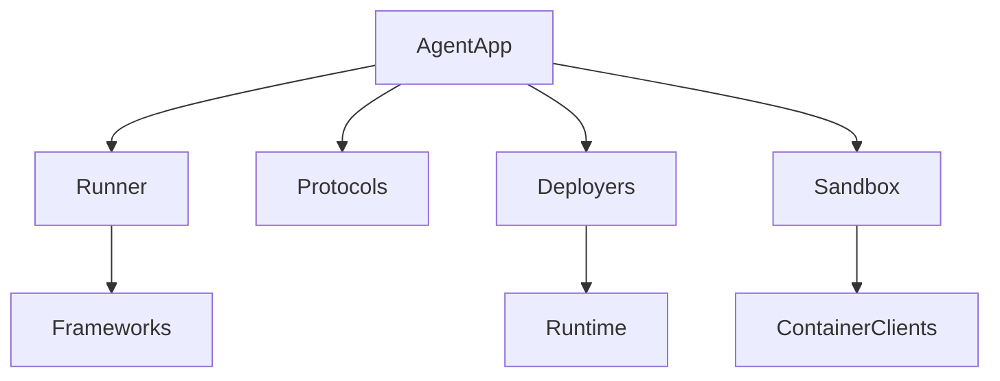

# 示例和教程

<cite>
**本文引用的文件**
- [README.md](file://README.md)
- [cookbook/zh/README.md](file://cookbook/zh/README.md)
- [src/agentscope_runtime/engine/app/agent_app.py](file://src/agentscope_runtime/engine/app/agent_app.py)
- [src/agentscope_runtime/engine/deployers/local_deployer.py](file://src/agentscope_runtime/engine/deployers/local_deployer.py)
- [src/agentscope_runtime/sandbox/manager/sandbox_manager.py](file://src/agentscope_runtime/sandbox/manager/sandbox_manager.py)
- [examples/deployments/local_deploy_config.yaml](file://examples/deployments/local_deploy_config.yaml)
- [examples/deployments/agentrun_deploy/app_deploy_to_agentrun.py](file://examples/deployments/agentrun_deploy/app_deploy_to_agentrun.py)
- [examples/deployments/k8s_deploy/app_deploy_to_k8s.py](file://examples/deployments/k8s_deploy/app_deploy_to_k8s.py)
- [examples/integrations/ag-ui/agent.py](file://examples/integrations/ag-ui/agent.py)
- [examples/integrations/langgraph/run_langgraph_agent.py](file://examples/integrations/langgraph/run_langgraph_agent.py)
- [examples/modelstudio_memory/memory_demo.py](file://examples/modelstudio_memory/memory_demo.py)
- [examples/sandbox/custom_sandbox/README.md](file://examples/sandbox/custom_sandbox/README.md)
- [cookbook/en/agent_app.md](file://cookbook/en/agent_app.md)
- [cookbook/en/deployment.md](file://cookbook/en/deployment.md)
</cite>

## 目录
1. [简介](#简介)
2. [项目结构](#项目结构)
3. [核心组件](#核心组件)
4. [架构总览](#架构总览)
5. [详细组件分析](#详细组件分析)
6. [依赖关系分析](#依赖关系分析)
7. [性能考虑](#性能考虑)
8. [故障排查指南](#故障排查指南)
9. [结论](#结论)
10. [附录](#附录)

## 简介
本教程面向希望系统掌握 AgentScope Runtime 的用户，提供从基础示例到高级部署、从单机到多框架协作的完整示例与最佳实践。内容覆盖：
- 快速上手：AgentApp 最小服务、SSE 流式输出、沙箱安全执行
- 高级示例：任务中断、后台任务模式、自定义端点与中间件
- 多框架集成：LangGraph、AG-UI、AutoGen、MS Agent Framework
- 部署示例：本地、Kubernetes、阿里云 AgentRun、函数计算（FC）、ModelStudio
- 生产配置：健康检查、资源配额、镜像仓库、环境变量
- 扩展与定制：自定义沙箱、协议适配器、状态持久化

## 项目结构
仓库采用模块化组织，核心代码位于 src/agentscope_runtime，示例位于 examples，文档位于 cookbook。

图示来源
- [src/agentscope_runtime/engine/app/agent_app.py](file://src/agentscope_runtime/engine/app/agent_app.py)
- [src/agentscope_runtime/engine/deployers/local_deployer.py](file://src/agentscope_runtime/engine/deployers/local_deployer.py)
- [src/agentscope_runtime/sandbox/manager/sandbox_manager.py](file://src/agentscope_runtime/sandbox/manager/sandbox_manager.py)
- [examples/deployments/agentrun_deploy/app_deploy_to_agentrun.py](file://examples/deployments/agentrun_deploy/app_deploy_to_agentrun.py)
- [examples/deployments/k8s_deploy/app_deploy_to_k8s.py](file://examples/deployments/k8s_deploy/app_deploy_to_k8s.py)
- [examples/integrations/ag-ui/agent.py](file://examples/integrations/ag-ui/agent.py)
- [examples/integrations/langgraph/run_langgraph_agent.py](file://examples/integrations/langgraph/run_langgraph_agent.py)
- [examples/modelstudio_memory/memory_demo.py](file://examples/modelstudio_memory/memory_demo.py)
- [examples/sandbox/custom_sandbox/README.md](file://examples/sandbox/custom_sandbox/README.md)
- [cookbook/en/agent_app.md](file://cookbook/en/agent_app.md)
- [cookbook/en/deployment.md](file://cookbook/en/deployment.md)

章节来源
- [README.md](file://README.md)
- [cookbook/zh/README.md](file://cookbook/zh/README.md)

## 核心组件
- AgentApp：基于 FastAPI 的统一应用封装，支持 SSE 流式输出、任务中断、Celery 异步队列、内置健康检查与路由扩展。
- 部署管理器：LocalDeployManager、KubernetesDeployManager、AgentRunDeployManager、FCDeployer 等，负责打包、镜像构建、服务编排与清理。
- 沙箱管理器：SandboxManager 支持容器池化、心跳扫描、回收与释放，提供远程/本地两种运行模式。
- 协议适配器：A2A、Response API、AG-UI 等，统一对外接口形态。
- 工具链：模型记忆（ModelStudio Memory）、实时语音/搜索/生成等工具集。

章节来源
- [src/agentscope_runtime/engine/app/agent_app.py](file://src/agentscope_runtime/engine/app/agent_app.py)
- [src/agentscope_runtime/engine/deployers/local_deployer.py](file://src/agentscope_runtime/engine/deployers/local_deployer.py)
- [src/agentscope_runtime/sandbox/manager/sandbox_manager.py](file://src/agentscope_runtime/sandbox/manager/sandbox_manager.py)

## 架构总览
AgentApp 作为统一入口，通过 Runner 执行业务逻辑；部署器负责将应用打包并发布到目标平台；沙箱管理器提供隔离的工具执行环境；协议适配器统一对外接口。

图示来源
- [src/agentscope_runtime/engine/app/agent_app.py](file://src/agentscope_runtime/engine/app/agent_app.py)
- [src/agentscope_runtime/engine/deployers/local_deployer.py](file://src/agentscope_runtime/engine/deployers/local_deployer.py)
- [src/agentscope_runtime/sandbox/manager/sandbox_manager.py](file://src/agentscope_runtime/sandbox/manager/sandbox_manager.py)

## 详细组件分析

### 基础示例：AgentApp 最小服务与流式输出
- 目标：快速启动一个最小 Agent API 服务，验证 SSE 流式输出。
- 关键点：
  - 使用 @agent_app.query(framework="agentscope") 注册处理函数
  - 使用 stream_printing_messages 实现增量输出
  - 生命周期管理建议使用 lifespan（FastAPI 语义）
- 适用场景：快速验证推理链、调试消息流、前端联调
- 限制条件：需正确设置会话/记忆服务，避免生产环境使用测试用 Redis

图示来源
- [src/agentscope_runtime/engine/app/agent_app.py](file://src/agentscope_runtime/engine/app/agent_app.py)
- [cookbook/en/agent_app.md](file://cookbook/en/agent_app.md)

章节来源
- [cookbook/en/agent_app.md](file://cookbook/en/agent_app.md)
- [README.md](file://README.md)

### 高级示例：任务中断与后台任务模式
- 目标：在长推理/长任务中支持手动中断与“提交后轮询”模式。
- 关键点：
  - 分布式中断：通过 Redis 后端实现跨节点中断
  - 中断感知：在生成器中捕获 CancelledError 并调用 agent.interrupt()
  - 后台任务：启用 enable_stream_task，仅存储最终响应，支持 Celery 模式
- 适用场景：复杂推理链、批量数据处理、长时间任务监控
- 限制条件：Celery 模式需要 broker/backend，且注意超时与资源配额

图示来源
- [src/agentscope_runtime/engine/app/agent_app.py](file://src/agentscope_runtime/engine/app/agent_app.py)
- [cookbook/en/agent_app.md](file://cookbook/en/agent_app.md)

章节来源
- [cookbook/en/agent_app.md](file://cookbook/en/agent_app.md)

### 高级示例：自定义端点与中间件
- 目标：在 AgentApp 上扩展原生 FastAPI 路由或使用 @app.endpoint 快捷装饰器。
- 关键点：
  - @app.endpoint 自动处理 SSE 错误封装与序列化
  - 原生 @app.get/@app.post 更灵活，适合复杂响应/状态码
- 适用场景：仪表盘、配置管理、监控探针、外部系统对接
- 限制条件：SSE 场景优先使用 @app.endpoint，避免手动格式化错误

章节来源
- [cookbook/en/agent_app.md](file://cookbook/en/agent_app.md)

### 集成示例：LangGraph 与 AG-UI
- LangGraph 集成：通过 @agent_app.query(framework="langgraph") 将 LangGraph 图式代理接入 AgentApp，支持工具调用与长期记忆。
- AG-UI 集成：通过 AGUIAdaptorConfig 开启 AG-UI 路由，适配前端消息格式与增量渲染。
- 适用场景：多代理协作、可视化交互、前端低代码接入
- 限制条件：LangGraph 需要合适的 checkpointer/store 与状态 schema

图示来源
- [examples/integrations/ag-ui/agent.py](file://examples/integrations/ag-ui/agent.py)
- [examples/integrations/langgraph/run_langgraph_agent.py](file://examples/integrations/langgraph/run_langgraph_agent.py)

章节来源
- [examples/integrations/ag-ui/agent.py](file://examples/integrations/ag-ui/agent.py)
- [examples/integrations/langgraph/run_langgraph_agent.py](file://examples/integrations/langgraph/run_langgraph_agent.py)

### 集成示例：ModelStudio 长程记忆工具链
- 目标：演示如何使用 AddMemory/SearchMemory/ListMemory/DeleteMemory 等工具进行用户记忆的增删改查与 LLM 派生回答。
- 关键点：先创建 Profile Schema，再添加记忆节点，随后检索并结合 LLM 生成个性化回答。
- 适用场景：知识增强对话、个性化推荐、上下文记忆管理
- 限制条件：需正确配置 DashScope API Key 与 LLM 兼容模式

章节来源
- [examples/modelstudio_memory/memory_demo.py](file://examples/modelstudio_memory/memory_demo.py)

### 部署示例：本地与多平台
- 本地部署：LocalDeployManager 支持守护线程与分离进程两种模式，自动注入健康检查与路由。
- Kubernetes：KubernetesDeployManager 支持 Deployment/Service/镜像推送，可配置资源请求/限制、镜像拉取策略、健康检查。
- AgentRun/FC/ModelStudio：提供一键部署脚本与配置模板，支持 OSS/AK/SK 注入与环境变量映射。
- 适用场景：开发联调、灰度发布、弹性扩缩容、Serverless 场景
- 限制条件：K8s 需具备 kubeconfig 权限；AgentRun/FC 需配置正确的 AK/SK 与网络访问

图示来源
- [src/agentscope_runtime/engine/deployers/local_deployer.py](file://src/agentscope_runtime/engine/deployers/local_deployer.py)
- [examples/deployments/k8s_deploy/app_deploy_to_k8s.py](file://examples/deployments/k8s_deploy/app_deploy_to_k8s.py)
- [examples/deployments/agentrun_deploy/app_deploy_to_agentrun.py](file://examples/deployments/agentrun_deploy/app_deploy_to_agentrun.py)

章节来源
- [cookbook/en/deployment.md](file://cookbook/en/deployment.md)
- [examples/deployments/local_deploy_config.yaml](file://examples/deployments/local_deploy_config.yaml)
- [examples/deployments/k8s_deploy/app_deploy_to_k8s.py](file://examples/deployments/k8s_deploy/app_deploy_to_k8s.py)
- [examples/deployments/agentrun_deploy/app_deploy_to_agentrun.py](file://examples/deployments/agentrun_deploy/app_deploy_to_agentrun.py)

### 沙箱示例：安全工具执行与自定义沙箱
- 目标：在隔离环境中执行 Python/Shell/GUI/Browser/Filesystem/Mobile 等工具，保障系统安全。
- 关键点：
  - SandboxManager 支持池化、心跳扫描、回收与远程/本地模式
  - 自定义沙箱需注册到 SandboxRegistry，并准备对应 Docker 镜像
- 适用场景：自动化流程、网页抓取、桌面自动化、移动设备测试
- 限制条件：Linux 主机需满足特定内核模块要求（移动端沙箱）

章节来源
- [src/agentscope_runtime/sandbox/manager/sandbox_manager.py](file://src/agentscope_runtime/sandbox/manager/sandbox_manager.py)
- [examples/sandbox/custom_sandbox/README.md](file://examples/sandbox/custom_sandbox/README.md)
- [README.md](file://README.md)

## 依赖关系分析
- AgentApp 依赖 Runner 执行业务逻辑，Runner 绑定 query/init/shutdown 处理器
- 部署器负责打包与发布，依赖打包工具、镜像构建与目标平台 API
- 沙箱管理器依赖容器客户端工厂，支持 Docker/gVisor/BoxLite/FC/K8s/Kruise 等后端
- 协议适配器统一对外接口，减少框架差异带来的接入成本

图示来源
- [src/agentscope_runtime/engine/app/agent_app.py](file://src/agentscope_runtime/engine/app/agent_app.py)
- [src/agentscope_runtime/engine/deployers/local_deployer.py](file://src/agentscope_runtime/engine/deployers/local_deployer.py)
- [src/agentscope_runtime/sandbox/manager/sandbox_manager.py](file://src/agentscope_runtime/sandbox/manager/sandbox_manager.py)

章节来源
- [src/agentscope_runtime/engine/app/agent_app.py](file://src/agentscope_runtime/engine/app/agent_app.py)
- [src/agentscope_runtime/engine/deployers/local_deployer.py](file://src/agentscope_runtime/engine/deployers/local_deployer.py)
- [src/agentscope_runtime/sandbox/manager/sandbox_manager.py](file://src/agentscope_runtime/sandbox/manager/sandbox_manager.py)

## 性能考虑
- 流式输出：SSE 增量传输降低首字节延迟，适合长文本生成与多模态输出
- 任务中断：在长推理链中及时中断可节省资源，建议在关键循环处插入可中断点
- 后台任务：将耗时任务放入队列，避免阻塞主请求线程
- 沙箱池化：复用容器可显著降低冷启动开销，合理设置池大小与回收策略
- 镜像与依赖：精简镜像体积、缓存依赖、按需安装工具，缩短构建时间

## 故障排查指南
- 本地部署失败：检查端口占用、主机绑定地址（0.0.0.0 vs 127.0.0.1）、日志输出
- K8s 部署异常：确认 kubeconfig、命名空间权限、镜像拉取策略、健康检查端口
- AgentRun/FC 部署：核对 AK/SK、OSS Bucket、镜像标签与推送开关
- 沙箱无法启动：检查容器后端（Docker/gVisor/BoxLite/FC）可用性与网络连通性
- 中断无效：确认中断后端（Redis）配置、会话/用户标识一致、在生成器中正确捕获 CancelledError 并调用 agent.interrupt()

章节来源
- [src/agentscope_runtime/engine/deployers/local_deployer.py](file://src/agentscope_runtime/engine/deployers/local_deployer.py)
- [examples/deployments/k8s_deploy/app_deploy_to_k8s.py](file://examples/deployments/k8s_deploy/app_deploy_to_k8s.py)
- [examples/deployments/agentrun_deploy/app_deploy_to_agentrun.py](file://examples/deployments/agentrun_deploy/app_deploy_to_agentrun.py)
- [src/agentscope_runtime/sandbox/manager/sandbox_manager.py](file://src/agentscope_runtime/sandbox/manager/sandbox_manager.py)
- [cookbook/en/agent_app.md](file://cookbook/en/agent_app.md)

## 结论
通过本教程，您可以在 AgentScope Runtime 上完成从最小服务到复杂场景的全栈开发与部署。建议遵循“先本地验证、再平台迁移”的原则，结合任务中断、后台任务与沙箱池化提升稳定性与性能，并根据业务需求选择合适的部署与集成方案。

## 附录
- 环境变量与配置要点
  - 本地部署：host/port、环境变量（如 LOG_LEVEL、DASHSCOPE_API_KEY）、入口点
  - K8s 部署：命名空间、镜像仓库、资源配额、健康检查、平台架构
  - AgentRun/FC/ModelStudio：AK/SK、OSS 配置、镜像标签、推送策略
- 最佳实践清单
  - 使用 lifespan 管理资源生命周期
  - 对外接口统一走协议适配器
  - 任务中断与状态保存双保险
  - 沙箱工具按需注册与最小化镜像
  - 生产环境启用健康检查与可观测性

章节来源
- [examples/deployments/local_deploy_config.yaml](file://examples/deployments/local_deploy_config.yaml)
- [cookbook/en/deployment.md](file://cookbook/en/deployment.md)
- [cookbook/en/agent_app.md](file://cookbook/en/agent_app.md)
- [README.md](file://README.md)