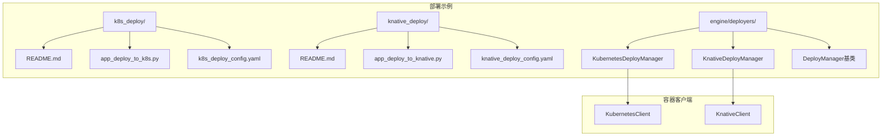
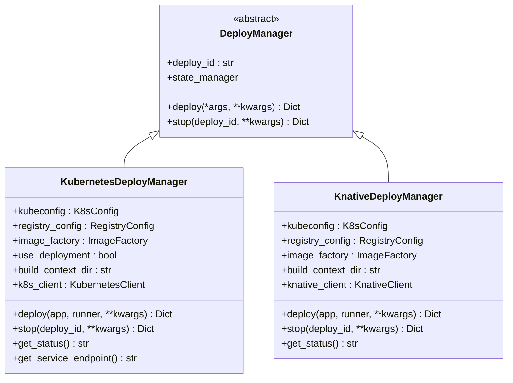
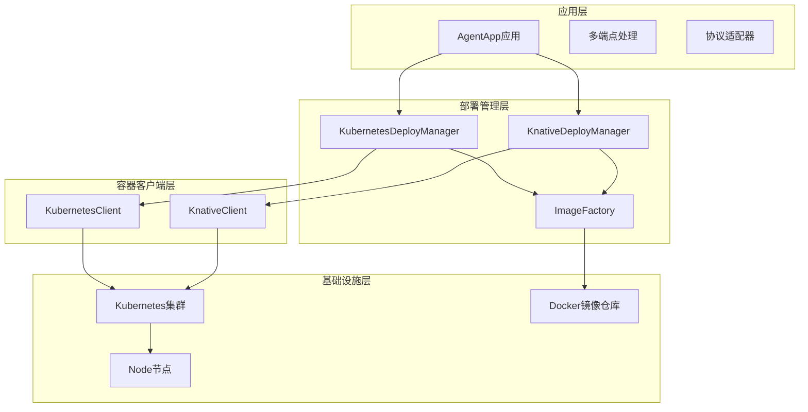
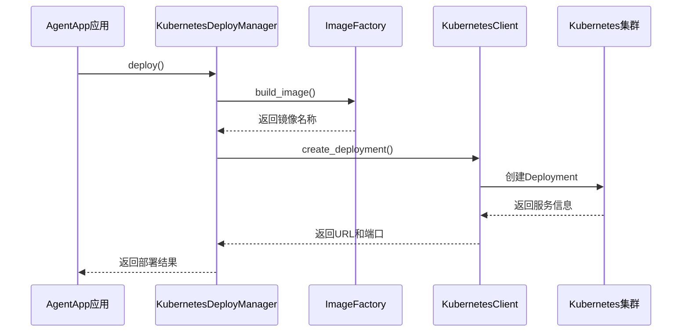
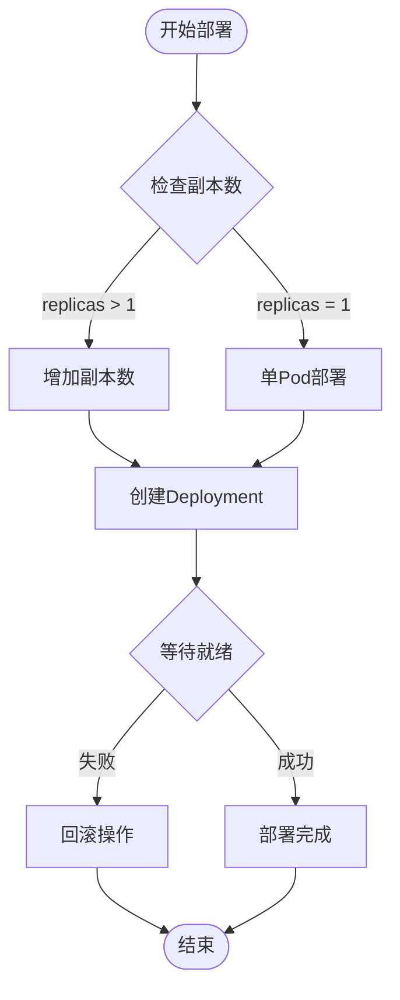
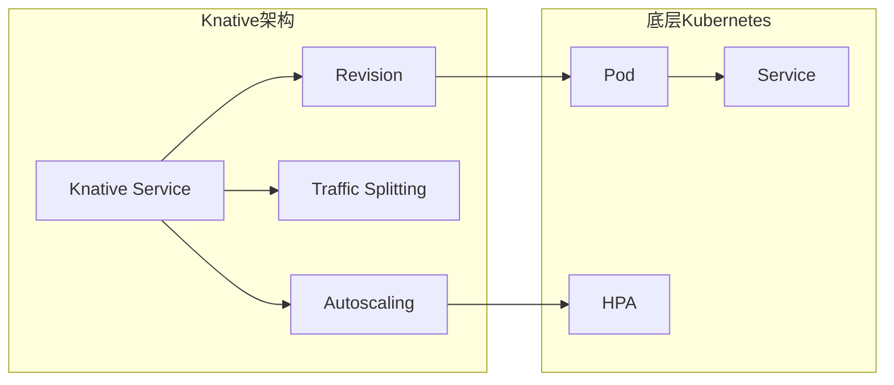
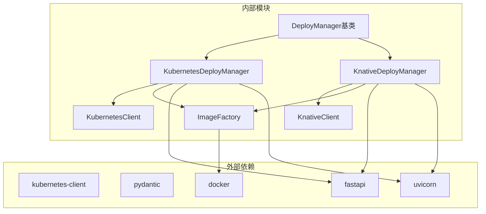
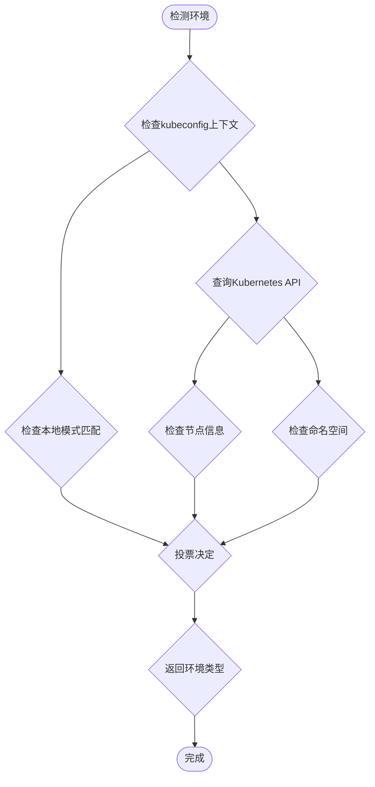
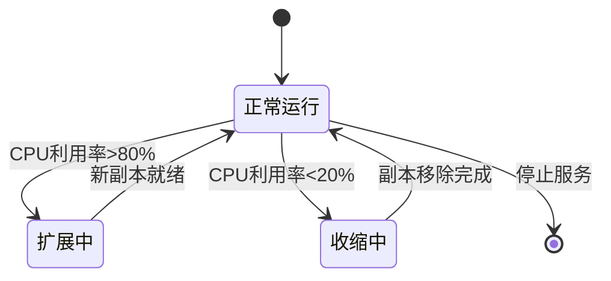

# Kubernetes部署示例

<cite>
**本文档引用的文件**
- [README.md](file://examples/deployments/k8s_deploy/README.md)
- [README.md](file://examples/deployments/knative_deploy/README.md)
- [k8s_deploy_config.yaml](file://examples/deployments/k8s_deploy/k8s_deploy_config.yaml)
- [knative_deploy_config.yaml](file://examples/deployments/knative_deploy/knative_deploy_config.yaml)
- [app_deploy_to_k8s.py](file://examples/deployments/k8s_deploy/app_deploy_to_k8s.py)
- [app_deploy_to_knative.py](file://examples/deployments/knative_deploy/app_deploy_to_knative.py)
- [kubernetes_deployer.py](file://src/agentscope_runtime/engine/deployers/kubernetes_deployer.py)
- [knative_deployer.py](file://src/agentscope_runtime/engine/deployers/knative_deployer.py)
- [base.py](file://src/agentscope_runtime/engine/deployers/base.py)
- [k8s_utils.py](file://src/agentscope_runtime/engine/deployers/utils/k8s_utils.py)
- [kubernetes_client.py](file://src/agentscope_runtime/common/container_clients/kubernetes_client.py)
- [knative_client.py](file://src/agentscope_runtime/common/container_clients/knative_client.py)
</cite>

## 目录
1. [简介](#简介)
2. [项目结构](#项目结构)
3. [核心组件](#核心组件)
4. [架构概览](#架构概览)
5. [详细组件分析](#详细组件分析)
6. [依赖关系分析](#依赖关系分析)
7. [性能考虑](#性能考虑)
8. [故障排除指南](#故障排除指南)
9. [结论](#结论)
10. [附录](#附录)

## 简介

本文件为AgentScope Runtime提供完整的Kubernetes部署示例文档，涵盖两种部署模式：Kubernetes原生部署和Knative Serverless部署。文档详细解释了Pod、Service、Deployment等核心Kubernetes资源的配置，提供了完整的YAML配置模板和参数说明，展示了水平扩展和自动伸缩的配置方法，并包含了Ingress路由、负载均衡、健康检查、就绪探针以及持久化存储和配置管理的最佳实践。

AgentScope Runtime是一个强大的AI代理运行时框架，支持多种部署方式，包括本地开发、容器化部署和云原生编排。通过本文档，用户可以快速掌握如何在Kubernetes环境中部署和管理AgentScope Runtime应用。

## 项目结构

AgentScope Runtime的部署示例位于examples/deployments目录下，包含以下关键文件：



**图表来源**
- [app_deploy_to_k8s.py:124-222](file://examples/deployments/k8s_deploy/app_deploy_to_k8s.py#L124-L222)
- [app_deploy_to_knative.py:123-224](file://examples/deployments/knative_deploy/app_deploy_to_knative.py#L123-L224)

**章节来源**
- [README.md:1-302](file://examples/deployments/k8s_deploy/README.md#L1-L302)
- [README.md:1-314](file://examples/deployments/knative_deploy/README.md#L1-L314)

## 核心组件

### Kubernetes部署管理器

KubernetesDeployManager是AgentScope Runtime的核心部署组件，负责将AgentApp应用部署到Kubernetes集群中。该管理器继承自抽象基类DeployManager，实现了具体的部署逻辑。



**图表来源**
- [base.py:9-44](file://src/agentscope_runtime/engine/deployers/base.py#L9-L44)
- [kubernetes_deployer.py:48-71](file://src/agentscope_runtime/engine/deployers/kubernetes_deployer.py#L48-L71)
- [knative_deployer.py:43-70](file://src/agentscope_runtime/engine/deployers/knative_deployer.py#L43-L70)

### 配置管理系统

AgentScope Runtime提供了灵活的配置系统，支持多种部署场景：

#### 基础配置参数

| 参数名称 | 类型 | 描述 | 默认值 |
|---------|------|------|--------|
| name | string | 应用名称 | "friday-agent" |
| namespace | string | Kubernetes命名空间 | "agentscope-runtime" |
| replicas | integer | Pod副本数量 | 1 |
| port | integer | 服务端口 | 8080 |

#### 容器镜像配置

| 参数名称 | 类型 | 描述 | 示例值 |
|---------|------|------|--------|
| image_name | string | 镜像名称 | "agent_app" |
| image_tag | string | 镜像标签 | "linux-amd64-1" |
| base_image | string | 基础镜像 | "python:3.10-slim-bookworm" |
| platform | string | 目标平台架构 | "linux/amd64" |
| push_to_registry | boolean | 是否推送至镜像仓库 | true |

#### 运行时资源配置

| 参数名称 | 子参数 | 类型 | 描述 | 示例值 |
|---------|--------|------|------|--------|
| runtime_config | resources | dict | 资源限制配置 | - |
|  |  |  | requests.cpu | "200m" |
|  |  |  | requests.memory | "512Mi" |
|  |  |  | limits.cpu | "1000m" |
|  |  |  | limits.memory | "2Gi" |
|  | image_pull_policy | string | 镜像拉取策略 | "IfNotPresent" |

**章节来源**
- [k8s_deploy_config.yaml:4-53](file://examples/deployments/k8s_deploy/k8s_deploy_config.yaml#L4-L53)
- [knative_deploy_config.yaml:4-56](file://examples/deployments/knative_deploy/knative_deploy_config.yaml#L4-L56)

## 架构概览

AgentScope Runtime的部署架构采用分层设计，从应用层到基础设施层逐层抽象：



**图表来源**
- [kubernetes_deployer.py:48-71](file://src/agentscope_runtime/engine/deployers/kubernetes_deployer.py#L48-L71)
- [knative_deployer.py:43-70](file://src/agentscope_runtime/engine/deployers/knative_deployer.py#L43-L70)
- [kubernetes_client.py:19-53](file://src/agentscope_runtime/common/container_clients/kubernetes_client.py#L19-L53)
- [knative_client.py:16-57](file://src/agentscope_runtime/common/container_clients/knative_client.py#L16-L57)

## 详细组件分析

### Kubernetes原生部署

#### 部署流程详解

Kubernetes原生部署通过Deployment控制器实现水平扩展和滚动更新：



**图表来源**
- [app_deploy_to_k8s.py:124-222](file://examples/deployments/k8s_deploy/app_deploy_to_k8s.py#L124-L222)
- [kubernetes_deployer.py:126-302](file://src/agentscope_runtime/engine/deployers/kubernetes_deployer.py#L126-L302)

#### 核心资源配置

##### Deployment配置

Deployment是Kubernetes中最常用的控制器，用于管理Pod的期望状态：

| 配置项 | 参数 | 描述 | 示例值 |
|-------|------|------|--------|
| apiVersion | string | API版本 | apps/v1 |
| kind | string | 资源类型 | Deployment |
| metadata.name | string | Deployment名称 | agent-<deploy_id> |
| spec.replicas | integer | 副本数量 | 1 |
| spec.selector.matchLabels | dict | 选择器标签 | {"app": "agent-<deploy_id>"} |
| spec.template.metadata.labels | dict | Pod标签 | {"app": "agent-<deploy_id>"} |

##### Service配置

Service为Pod提供稳定的网络访问入口：

| 配置项 | 参数 | 描述 | 示例值 |
|-------|------|------|--------|
| spec.selector | dict | 选择器 | {"app": "agent-<deploy_id>"} |
| spec.ports[0].port | integer | 外部端口 | 8080 |
| spec.ports[0].targetPort | integer | 容器端口 | 8080 |
| spec.type | string | 服务类型 | ClusterIP |

#### 水平扩展配置

AgentScope Runtime支持基于副本数的水平扩展：



**图表来源**
- [kubernetes_deployer.py:247-257](file://src/agentscope_runtime/engine/deployers/kubernetes_deployer.py#L247-L257)

**章节来源**
- [app_deploy_to_k8s.py:124-222](file://examples/deployments/k8s_deploy/app_deploy_to_k8s.py#L124-L222)
- [kubernetes_deployer.py:126-302](file://src/agentscope_runtime/engine/deployers/kubernetes_deployer.py#L126-L302)

### Knative Serverless部署

#### Knative服务架构

Knative基于Kubernetes构建，提供Serverless风格的服务编排：



**图表来源**
- [knative_deployer.py:43-70](file://src/agentscope_runtime/engine/deployers/knative_deployer.py#L43-L70)
- [knative_client.py:114-200](file://src/agentscope_runtime/common/container_clients/knative_client.py#L114-L200)

#### Knative服务配置

Knative Service配置支持更高级的Serverless特性：

| 配置项 | 参数 | 描述 | 示例值 |
|-------|------|------|--------|
| spec.template.spec.containers[0].resources | dict | 资源限制 | requests/limits |
| spec.template.metadata.annotations | dict | 注解配置 | 自动扩展开关 |
| spec.template.metadata.labels | dict | 标签配置 | 应用标识 |
| spec.spec.traffic | array | 流量分配 | 多版本流量控制 |

**章节来源**
- [app_deploy_to_knative.py:123-224](file://examples/deployments/knative_deploy/app_deploy_to_knative.py#L123-L224)
- [knative_deployer.py:71-222](file://src/agentscope_runtime/engine/deployers/knative_deployer.py#L71-L222)

### 多端点处理机制

AgentScope Runtime支持多种HTTP端点类型，满足不同的业务需求：

| 端点类型 | 方法 | 描述 | 使用场景 |
|---------|------|------|----------|
| 同步端点 | GET/POST | 阻塞式请求响应 | 实时交互 |
| 异步端点 | POST | 非阻塞请求处理 | 后台任务 |
| 流式端点 | POST | 服务器推送事件 | 实时数据流 |
| 任务端点 | POST | 队列任务处理 | 批处理作业 |

**章节来源**
- [app_deploy_to_k8s.py:87-118](file://examples/deployments/k8s_deploy/app_deploy_to_k8s.py#L87-L118)
- [app_deploy_to_knative.py:86-117](file://examples/deployments/knative_deploy/app_deploy_to_knative.py#L86-L117)

## 依赖关系分析

### 组件依赖图



**图表来源**
- [base.py:9-22](file://src/agentscope_runtime/engine/deployers/base.py#L9-L22)
- [kubernetes_deployer.py:12-20](file://src/agentscope_runtime/engine/deployers/kubernetes_deployer.py#L12-L20)
- [knative_deployer.py:6-16](file://src/agentscope_runtime/engine/deployers/knative_deployer.py#L6-L16)

### 环境检测机制

AgentScope Runtime具备智能的环境检测能力，能够自动识别本地和云端Kubernetes环境：



**图表来源**
- [k8s_utils.py:12-59](file://src/agentscope_runtime/engine/deployers/utils/k8s_utils.py#L12-L59)

**章节来源**
- [k8s_utils.py:12-242](file://src/agentscope_runtime/engine/deployers/utils/k8s_utils.py#L12-L242)

## 性能考虑

### 资源管理最佳实践

#### CPU和内存资源配置

| 资源类型 | 请求值 | 限制值 | 适用场景 |
|---------|--------|--------|----------|
| 小型应用 | 100m/128Mi | 500m/512Mi | 开发测试 |
| 中型应用 | 200m/256Mi | 1000m/1Gi | 生产环境 |
| 大型应用 | 500m/512Mi | 2000m/2Gi | AI推理 |

#### 镜像优化策略

1. **多阶段构建**：使用多阶段Dockerfile减少最终镜像大小
2. **基础镜像选择**：优先选择轻量级基础镜像（如alpine）
3. **依赖管理**：合并pip依赖安装，减少层数
4. **缓存利用**：合理利用Docker构建缓存

### 自动扩缩容配置

AgentScope Runtime支持基于CPU使用率和内存使用的自动扩缩容：



## 故障排除指南

### 常见部署问题

#### 镜像拉取失败

**症状**：Pod处于ImagePullBackOff状态
**解决方案**：
1. 检查镜像仓库认证配置
2. 验证镜像名称和标签正确性
3. 确认网络连通性

#### 资源不足

**症状**：Pod处于Pending状态
**解决方案**：
1. 检查节点资源配额
2. 调整资源请求和限制
3. 添加更多节点或清理资源

#### 端口冲突

**症状**：Service创建失败
**解决方案**：
1. 检查端口占用情况
2. 修改服务端口配置
3. 清理冲突的Service

### 调试工具和命令

```bash
# 查看Pod状态
kubectl get pods -n agentscope-runtime

# 查看服务信息
kubectl get svc -n agentscope-runtime

# 查看日志
kubectl logs -l app=agent-app -n agentscope-runtime

# 查看事件
kubectl describe pod <pod-name> -n agentscope-runtime
```

**章节来源**
- [README.md:215-245](file://examples/deployments/k8s_deploy/README.md#L215-L245)
- [README.md:227-257](file://examples/deployments/knative_deploy/README.md#L227-L257)

## 结论

AgentScope Runtime提供了完整的Kubernetes部署解决方案，支持从简单的单实例部署到复杂的多节点集群部署。通过本文档介绍的配置方法和最佳实践，用户可以：

1. **快速部署**：使用提供的示例配置快速启动AgentScope Runtime应用
2. **灵活扩展**：根据业务需求选择合适的部署模式和扩缩容策略
3. **稳定运行**：通过完善的监控和故障排除机制确保服务稳定性
4. **成本优化**：合理配置资源和选择部署模式降低运营成本

无论是开发测试还是生产环境，AgentScope Runtime都能提供可靠的容器化部署体验。

## 附录

### 配置文件模板

#### Kubernetes部署配置模板

```yaml
# 基础部署设置
name: "friday-agent"
namespace: "agentscope-runtime"
replicas: 1
port: 8080

# Docker镜像设置
image_name: "agent_app"
image_tag: "linux-amd64-1"
base_image: "python:3.10-slim-bookworm"
platform: "linux/amd64"
push_to_registry: true

# Python依赖
requirements:
  - "agentscope"
  - "fastapi"
  - "uvicorn"

# 环境变量
environment:
  PYTHONPATH: "/app"
  LOG_LEVEL: "INFO"
  DASHSCOPE_API_KEY: "${DASHSCOPE_API_KEY}"

# 运行时配置
runtime_config:
  resources:
    requests:
      cpu: "200m"
      memory: "512Mi"
    limits:
      cpu: "1000m"
      memory: "2Gi"
  image_pull_policy: "IfNotPresent"

# 部署设置
deploy_timeout: 300
health_check: true
```

#### Knative部署配置模板

```yaml
# 基础部署设置
name: "friday-agent"
namespace: "agentscope-runtime"
port: 8080

# Docker镜像设置
image_name: "agent_app"
image_tag: "linux-amd64-1"
base_image: "python:3.10-slim-bookworm"
platform: "linux/amd64"
push_to_registry: true

# 标签配置
labels:
   app: "agent-ksvc"

# 运行时配置
runtime_config:
  resources:
    requests:
      cpu: "200m"
      memory: "512Mi"
    limits:
      cpu: "1000m"
      memory: "2Gi"
  image_pull_policy: "IfNotPresent"

# 部署设置
deploy_timeout: 300
health_check: true
```

### 健康检查配置

AgentScope Runtime支持多种健康检查机制：

| 检查类型 | 配置参数 | 描述 | 适用场景 |
|---------|----------|------|----------|
| HTTP健康检查 | /health | HTTP端点检查 | 基础可用性验证 |
| 探针配置 | initialDelaySeconds | 初始延迟 | 避免过早失败 |
| 探针配置 | periodSeconds | 检查间隔 | 调整检查频率 |
| 探针配置 | timeoutSeconds | 超时时间 | 控制响应时间 |

### 持久化存储配置

对于需要持久化存储的应用，建议使用以下配置模式：

```yaml
volumes:
  - name: data-volume
    persistentVolumeClaim:
      claimName: agent-data-pvc

volumeMounts:
  - name: data-volume
    mountPath: /app/data
    readOnly: false
```

### Ingress和负载均衡

```yaml
apiVersion: networking.k8s.io/v1
kind: Ingress
metadata:
  name: agent-ingress
  annotations:
    nginx.ingress.kubernetes.io/rewrite-target: /
spec:
  rules:
  - host: agent.example.com
    http:
      paths:
      - path: /
        pathType: Prefix
        backend:
          service:
            name: agent-service
            port:
              number: 8080
```