# 云平台部署示例

<cite>
**本文档引用的文件**
- [agentrun_deployer.py](file://src/agentscope_runtime/engine/deployers/agentrun_deployer.py)
- [fc_deployer.py](file://src/agentscope_runtime/engine/deployers/fc_deployer.py)
- [modelstudio_deployer.py](file://src/agentscope_runtime/engine/deployers/modelstudio_deployer.py)
- [pai_deployer.py](file://src/agentscope_runtime/engine/deployers/pai_deployer.py)
- [kubernetes_deployer.py](file://src/agentscope_runtime/engine/deployers/kubernetes_deployer.py)
- [knative_deployer.py](file://src/agentscope_runtime/engine/deployers/knative_deployer.py)
- [kruise_deployer.py](file://src/agentscope_runtime/engine/deployers/kruise_deployer.py)
- [agentrun_deploy README.md](file://examples/deployments/agentrun_deploy/README.md)
- [fc_deploy README.md](file://examples/deployments/fc_deploy/README.md)
- [modelstudio_deploy README.md](file://examples/deployments/modelstudio_deploy/README.md)
- [pai_deploy README.md](file://examples/deployments/pai_deploy/README.md)
- [k8s_deploy README.md](file://examples/deployments/k8s_deploy/README.md)
- [knative_deploy README.md](file://examples/deployments/knative_deploy/README.md)
- [kruise_deploy README.md](file://examples/deployments/kruise_deploy/README.md)
</cite>

## 目录
1. [简介](#简介)
2. [项目结构](#项目结构)
3. [核心组件](#核心组件)
4. [架构概览](#架构概览)
5. [详细组件分析](#详细组件分析)
6. [依赖关系分析](#依赖关系分析)
7. [性能考虑](#性能考虑)
8. [故障排除指南](#故障排除指南)
9. [结论](#结论)
10. [附录](#附录)

## 简介

本文件为AgentScope Runtime在主流云平台的部署示例文档，涵盖以下云平台的完整部署流程：

- **阿里云函数计算（FC）**：无服务器计算，按请求计费，适合事件驱动和短期任务
- **阿里云AgentRun**：面向AI应用的托管运行时服务，支持会话亲和和弹性扩缩容
- **阿里云ModelStudio**：集成开发环境，提供可视化部署和管理界面
- **阿里云PAI（平台AI）**：企业级机器学习平台，支持多种资源模式和VPC网络
- **Kubernetes**：容器编排平台，支持自定义部署和扩缩容策略
- **Knative**：基于Kubernetes的无服务器框架，支持自动扩缩容
- **Kruise**：增强的Kubernetes控制器，支持沙箱式部署

每个部署示例都包含详细的配置参数说明、环境变量设置、部署流程和监控方案。

## 项目结构

AgentScope Runtime采用模块化设计，核心部署功能分布在以下目录结构中：

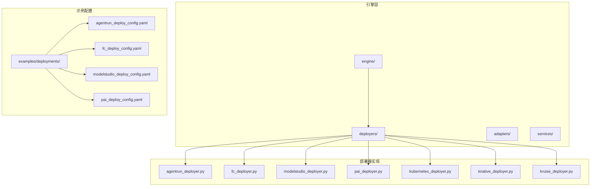

**图表来源**
- [agentrun_deployer.py:1-800](file://src/agentscope_runtime/engine/deployers/agentrun_deployer.py#L1-L800)
- [fc_deployer.py:1-800](file://src/agentscope_runtime/engine/deployers/fc_deployer.py#L1-L800)
- [modelstudio_deployer.py:1-800](file://src/agentscope_runtime/engine/deployers/modelstudio_deployer.py#L1-L800)

**章节来源**
- [agentrun_deployer.py:1-800](file://src/agentscope_runtime/engine/deployers/agentrun_deployer.py#L1-L800)
- [fc_deployer.py:1-800](file://src/agentscope_runtime/engine/deployers/fc_deployer.py#L1-L800)
- [modelstudio_deployer.py:1-800](file://src/agentscope_runtime/engine/deployers/modelstudio_deployer.py#L1-L800)

## 核心组件

### 部署管理器基类

所有部署器都继承自统一的部署管理器基类，提供标准化的部署接口：

```mermaid
classDiagram
class DeployManager {
+deploy_id : str
+state_manager : StateManager
+deploy(app, runner, **kwargs) Dict
+stop(deploy_id) Dict
+get_status() str
}
class AgentRunDeployManager {
+oss_config : OSSConfig
+agentrun_config : AgentRunConfig
+deploy_to_agentrun(**kwargs) Dict
+_build_and_zip_in_docker() Path
}
class FCDeployManager {
+oss_config : OSSConfig
+fc_config : FCConfig
+deploy_to_fc(**kwargs) Dict
+_create_http_trigger(function_name) Dict
}
class ModelstudioDeployManager {
+oss_config : OSSConfig
+modelstudio_config : ModelstudioConfig
+_upload_and_deploy(wheel_path, name) Tuple
+_modelstudio_deploy(cfg, file_url, filename, deploy_name) str
}
class PAIDeployManager {
+langstudio_client : LangStudioClient
+eas_client : EASClient
+deploy_to_pai(**kwargs) Dict
+_create_flow_and_snapshot() Dict
}
class KubernetesDeployManager {
+k8s_client : KubernetesClient
+image_factory : ImageFactory
+create_deployment(image, name, **kwargs) Tuple
}
class KnativeDeployManager {
+knative_client : KnativeClient
+create_kservice(image, name, **kwargs) Tuple
}
class KruiseDeployManager {
+kruise_client : KruiseClient
+create_sandbox(image, name, **kwargs) Tuple
}
DeployManager <|-- AgentRunDeployManager
DeployManager <|-- FCDeployManager
DeployManager <|-- ModelstudioDeployManager
DeployManager <|-- PAIDeployManager
DeployManager <|-- KubernetesDeployManager
DeployManager <|-- KnativeDeployManager
DeployManager <|-- KruiseDeployManager
```

**图表来源**
- [agentrun_deployer.py:264-800](file://src/agentscope_runtime/engine/deployers/agentrun_deployer.py#L264-L800)
- [fc_deployer.py:246-800](file://src/agentscope_runtime/engine/deployers/fc_deployer.py#L246-L800)
- [modelstudio_deployer.py:544-800](file://src/agentscope_runtime/engine/deployers/modelstudio_deployer.py#L544-L800)
- [pai_deployer.py:1-800](file://src/agentscope_runtime/engine/deployers/pai_deployer.py#L1-L800)
- [kubernetes_deployer.py:48-391](file://src/agentscope_runtime/engine/deployers/kubernetes_deployer.py#L48-L391)
- [knative_deployer.py:43-291](file://src/agentscope_runtime/engine/deployers/knative_deployer.py#L43-L291)
- [kruise_deployer.py:37-434](file://src/agentscope_runtime/engine/deployers/kruise_deployer.py#L37-L434)

### 配置管理系统

每个部署器都有独立的配置类，支持从环境变量和配置文件加载：

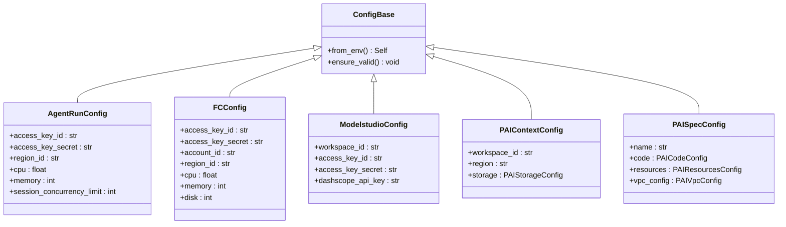

**图表来源**
- [agentrun_deployer.py:87-201](file://src/agentscope_runtime/engine/deployers/agentrun_deployer.py#L87-L201)
- [fc_deployer.py:67-180](file://src/agentscope_runtime/engine/deployers/fc_deployer.py#L67-L180)
- [modelstudio_deployer.py:87-131](file://src/agentscope_runtime/engine/deployers/modelstudio_deployer.py#L87-L131)
- [pai_deployer.py:676-720](file://src/agentscope_runtime/engine/deployers/pai_deployer.py#L676-L720)

**章节来源**
- [agentrun_deployer.py:1-800](file://src/agentscope_runtime/engine/deployers/agentrun_deployer.py#L1-L800)
- [fc_deployer.py:1-800](file://src/agentscope_runtime/engine/deployers/fc_deployer.py#L1-L800)
- [modelstudio_deployer.py:1-800](file://src/agentscope_runtime/engine/deployers/modelstudio_deployer.py#L1-L800)
- [pai_deployer.py:1-800](file://src/agentscope_runtime/engine/deployers/pai_deployer.py#L1-L800)

## 架构概览

AgentScope Runtime提供了统一的部署抽象层，支持多种云平台的无缝集成：

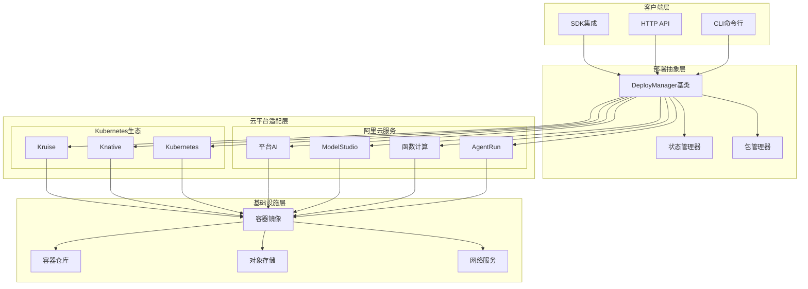

**图表来源**
- [agentrun_deployer.py:521-733](file://src/agentscope_runtime/engine/deployers/agentrun_deployer.py#L521-L733)
- [fc_deployer.py:416-582](file://src/agentscope_runtime/engine/deployers/fc_deployer.py#L416-L582)
- [modelstudio_deployer.py:727-800](file://src/agentscope_runtime/engine/deployers/modelstudio_deployer.py#L727-L800)

## 详细组件分析

### 阿里云函数计算（FC）部署

阿里云函数计算提供了完全托管的无服务器计算服务，适合事件驱动的应用程序。

#### 部署流程

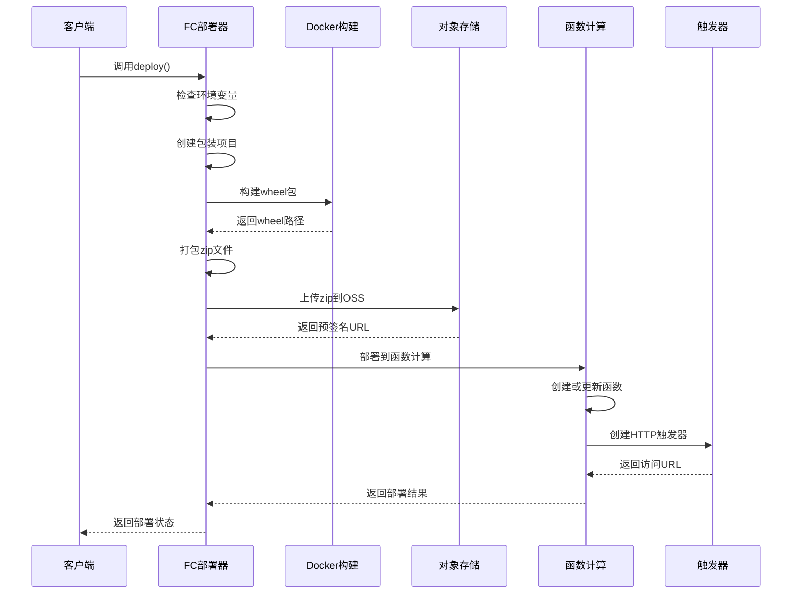

**图表来源**
- [fc_deployer.py:416-582](file://src/agentscope_runtime/engine/deployers/fc_deployer.py#L416-L582)

#### 关键特性

- **会话亲和性**：支持基于头部字段的会话保持
- **弹性扩缩容**：根据并发请求自动调整实例数量
- **资源隔离**：每个函数实例独立运行，资源隔离
- **成本优化**：按实际执行时间计费，无闲置成本

#### 配置参数

| 参数类别 | 参数名称 | 默认值 | 描述 |
|---------|---------|--------|------|
| 基础配置 | region_id | cn-hangzhou | 地区ID |
| 基础配置 | account_id | - | 阿里云账号ID |
| 资源配置 | cpu | 2.0 | CPU核心数 |
| 资源配置 | memory | 2048 | 内存大小(MB) |
| 资源配置 | disk | 512 | 磁盘大小(MB) |
| 日志配置 | log_store | - | SLS日志存储名 |
| 日志配置 | log_project | - | SLS日志项目名 |
| 网络配置 | vpc_id | - | VPC网络ID |
| 网络配置 | security_group_id | - | 安全组ID |
| 网络配置 | vswitch_ids | - | 交换机ID列表 |

**章节来源**
- [fc_deployer.py:1-800](file://src/agentscope_runtime/engine/deployers/fc_deployer.py#L1-L800)
- [fc_deploy README.md:1-542](file://examples/deployments/fc_deploy/README.md#L1-L542)

### 阿里云AgentRun部署

AgentRun是专为AI应用设计的托管运行时服务，提供更好的会话管理和资源控制。

#### 部署架构

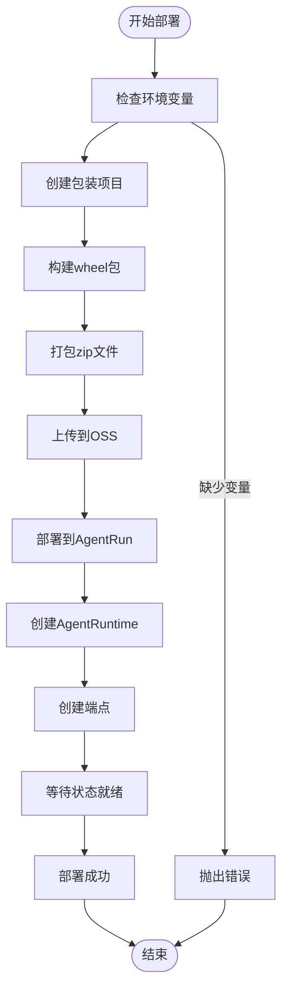

**图表来源**
- [agentrun_deployer.py:521-733](file://src/agentscope_runtime/engine/deployers/agentrun_deployer.py#L521-L733)

#### 会话管理

AgentRun支持高级的会话管理功能：

- **会话亲和性**：通过X-Agentrun-Session-Id头部绑定到固定实例
- **并发限制**：可配置每个实例的最大并发会话数
- **空闲超时**：自动清理长时间未使用的会话实例
- **资源配额**：灵活的CPU和内存资源配置

#### 配置选项

| 配置项 | 环境变量 | 默认值 | 说明 |
|-------|---------|--------|------|
| 区域ID | AGENT_RUN_REGION_ID | cn-hangzhou | 运行时区域 |
| 网络模式 | AGENT_RUN_NETWORK_MODE | PUBLIC | 网络访问模式 |
| CPU资源 | AGENT_RUN_CPU | 2.0 | CPU核心数 |
| 内存资源 | AGENT_RUN_MEMORY | 2048 | 内存大小(MB) |
| 并发限制 | AGENT_RUN_SESSION_CONCURRENCY_LIMIT | 1 | 会话并发限制 |
| 空闲超时 | AGENT_RUN_SESSION_IDLE_TIMEOUT_SECONDS | 600 | 空闲超时秒数 |

**章节来源**
- [agentrun_deployer.py:1-800](file://src/agentscope_runtime/engine/deployers/agentrun_deployer.py#L1-L800)
- [agentrun_deploy README.md:1-525](file://examples/deployments/agentrun_deploy/README.md#L1-L525)

### 阿里云ModelStudio部署

ModelStudio提供了可视化的AI应用开发和部署环境。

#### 部署流程

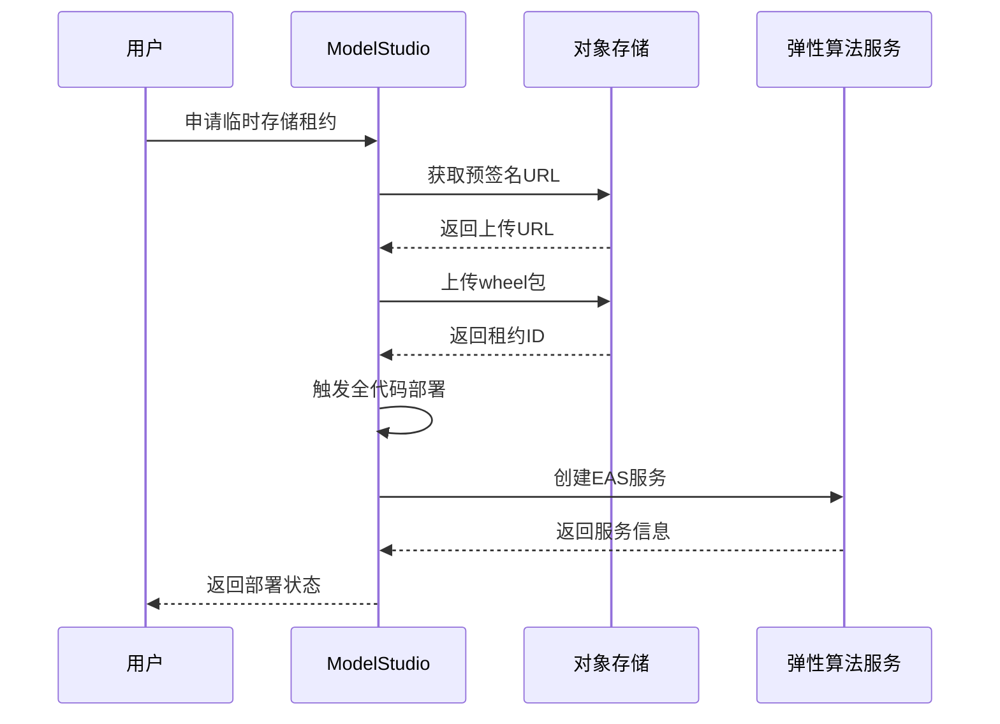

**图表来源**
- [modelstudio_deployer.py:413-542](file://src/agentscope_runtime/engine/deployers/modelstudio_deployer.py#L413-L542)

#### 特殊功能

- **工作空间管理**：支持多用户协作和权限控制
- **可视化监控**：内置性能监控和日志查看功能
- **版本管理**：支持部署版本的回滚和切换
- **API网关**：自动配置域名和访问控制

**章节来源**
- [modelstudio_deployer.py:1-800](file://src/agentscope_runtime/engine/deployers/modelstudio_deployer.py#L1-L800)
- [modelstudio_deploy README.md:1-331](file://examples/deployments/modelstudio_deploy/README.md#L1-L331)

### 阿里云PAI部署

PAI（平台AI）提供了企业级的机器学习和深度学习服务。

#### 资源模式

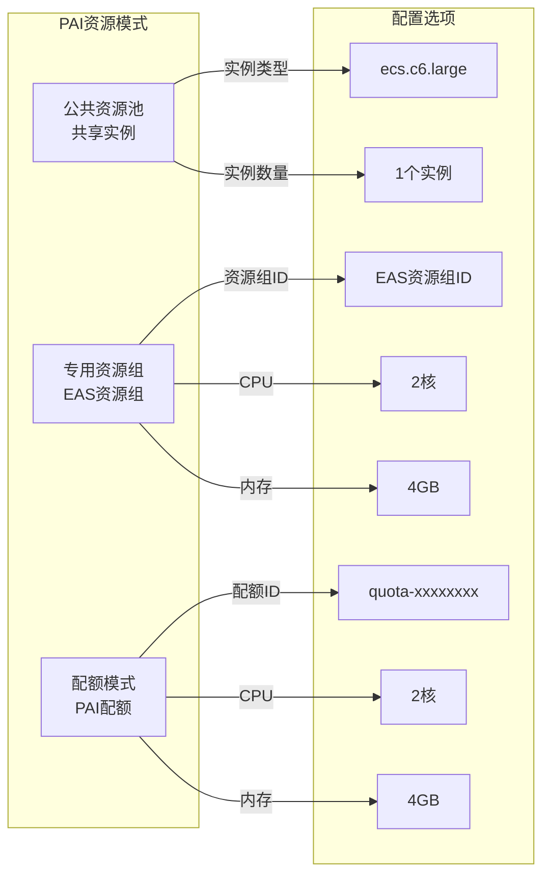

**图表来源**
- [pai_deployer.py:614-642](file://src/agentscope_runtime/engine/deployers/pai_deployer.py#L614-L642)

#### 部署配置

| 配置类别 | 参数 | 说明 |
|---------|------|------|
| 上下文配置 | workspace_id | 工作空间ID |
| 上下文配置 | region | 部署区域 |
| 规格配置 | name | 服务名称 |
| 规格配置 | code.source_dir | 源码目录 |
| 规格配置 | code.entrypoint | 入口文件 |
| 资源配置 | resources.type | 资源类型 |
| 资源配置 | resources.instance_type | 实例类型 |
| 资源配置 | resources.instance_count | 实例数量 |
| 网络配置 | vpc_config.vpc_id | VPC ID |
| 网络配置 | vpc_config.vswitch_id | 交换机ID |
| 网络配置 | vpc_config.security_group_id | 安全组ID |

**章节来源**
- [pai_deployer.py:1-800](file://src/agentscope_runtime/engine/deployers/pai_deployer.py#L1-L800)
- [pai_deploy README.md:1-347](file://examples/deployments/pai_deploy/README.md#L1-L347)

### Kubernetes部署

Kubernetes提供了最灵活的容器编排解决方案。

#### 部署组件

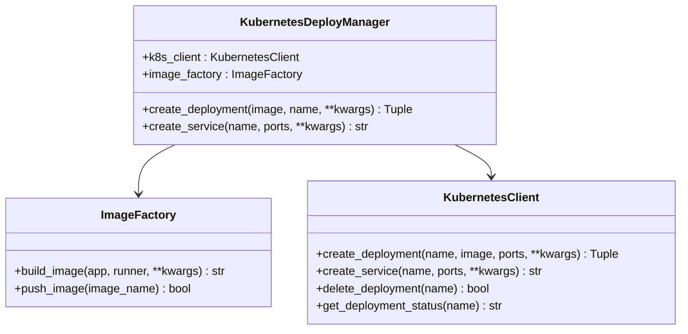

**图表来源**
- [kubernetes_deployer.py:48-391](file://src/agentscope_runtime/engine/deployers/kubernetes_deployer.py#L48-L391)

#### 自动扩缩容

Kubernetes支持多种扩缩容策略：

- **HPA（水平Pod自动伸缩）**：基于CPU使用率和自定义指标
- **VPA（垂直Pod自动伸缩）**：动态调整Pod的CPU和内存请求
- **自定义扩缩容**：基于业务指标和时间表

**章节来源**
- [kubernetes_deployer.py:1-391](file://src/agentscope_runtime/engine/deployers/kubernetes_deployer.py#L1-L391)
- [k8s_deploy README.md:1-302](file://examples/deployments/k8s_deploy/README.md#L1-L302)

### Knative部署

Knative在Kubernetes基础上提供了无服务器计算能力。

#### Knative服务生命周期

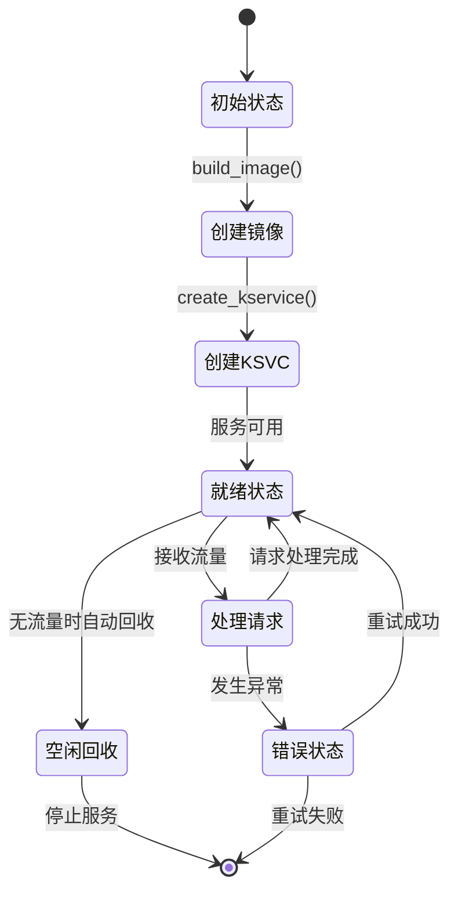

**图表来源**
- [knative_deployer.py:71-222](file://src/agentscope_runtime/engine/deployers/knative_deployer.py#L71-L222)

#### 无服务器特性

- **自动扩缩容**：零请求时自动回收，有请求时自动扩展
- **冷启动优化**：支持预热和快速启动机制
- **流量管理**：支持蓝绿部署和金丝雀发布
- **事件驱动**：支持多种事件源触发

**章节来源**
- [knative_deployer.py:1-291](file://src/agentscope_runtime/engine/deployers/knative_deployer.py#L1-L291)
- [knative_deploy README.md:1-314](file://examples/deployments/knative_deploy/README.md#L1-L314)

### Kruise部署

Kruise提供了增强的Kubernetes控制器，支持沙箱式部署。

#### Kruise沙箱架构

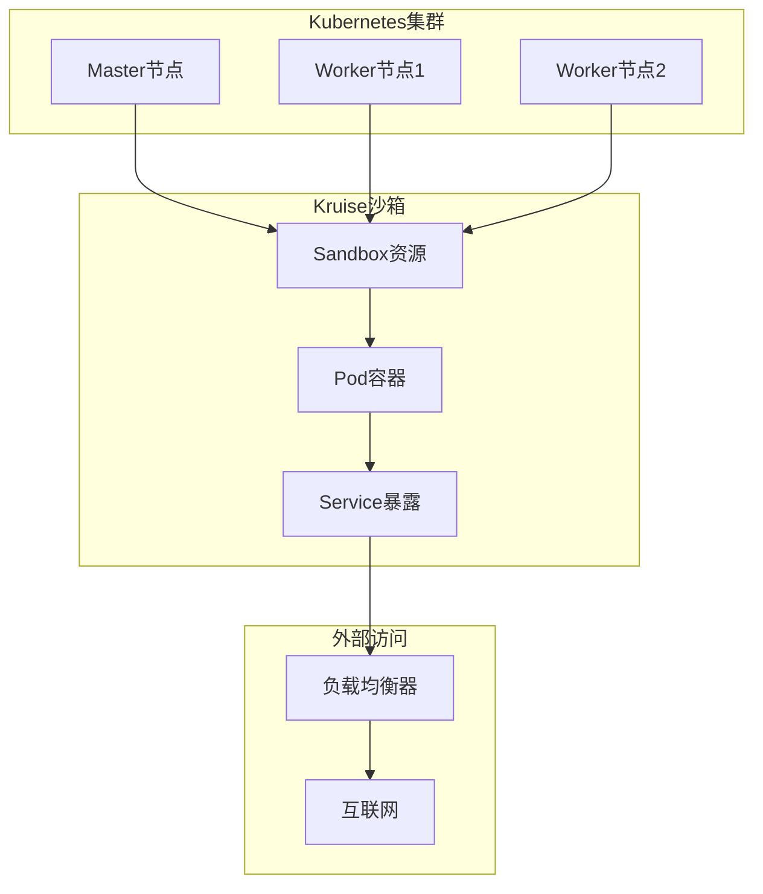

**图表来源**
- [kruise_deployer.py:138-347](file://src/agentscope_runtime/engine/deployers/kruise_deployer.py#L138-L347)

#### 沙箱特性

- **资源隔离**：每个沙箱拥有独立的资源配额
- **网络隔离**：支持VPC和网络安全组
- **持久化存储**：支持挂载本地和网络存储
- **安全控制**：基于RBAC的权限管理

**章节来源**
- [kruise_deployer.py:1-434](file://src/agentscope_runtime/engine/deployers/kruise_deployer.py#L1-L434)
- [kruise_deploy README.md:1-257](file://examples/deployments/kruise_deploy/README.md#L1-L257)

## 依赖关系分析

### 云平台依赖图

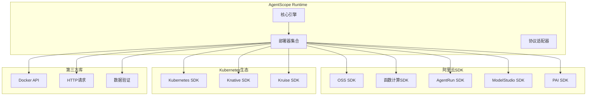

**图表来源**
- [agentrun_deployer.py:1-50](file://src/agentscope_runtime/engine/deployers/agentrun_deployer.py#L1-L50)
- [fc_deployer.py:1-30](file://src/agentscope_runtime/engine/deployers/fc_deployer.py#L1-L30)
- [modelstudio_deployer.py:33-47](file://src/agentscope_runtime/engine/deployers/modelstudio_deployer.py#L33-L47)

### 组件耦合度分析

| 组件 | 内聚性 | 耦合度 | 说明 |
|------|--------|--------|------|
| AgentRunDeployManager | 高 | 中等 | 专注于AgentRun特定功能 |
| FCDeployManager | 高 | 中等 | 专注于函数计算特性 |
| ModelstudioDeployManager | 高 | 低 | 独立的ModelStudio集成 |
| PAIDeployManager | 中等 | 低 | 多个PAI服务集成 |
| KubernetesDeployManager | 中等 | 低 | 通用Kubernetes操作 |
| KnativeDeployManager | 中等 | 低 | 专门的无服务器功能 |
| KruiseDeployManager | 中等 | 低 | 专门的沙箱功能 |

**章节来源**
- [agentrun_deployer.py:264-300](file://src/agentscope_runtime/engine/deployers/agentrun_deployer.py#L264-L300)
- [fc_deployer.py:246-274](file://src/agentscope_runtime/engine/deployers/fc_deployer.py#L246-L274)
- [modelstudio_deployer.py:544-565](file://src/agentscope_runtime/engine/deployers/modelstudio_deployer.py#L544-L565)

## 性能考虑

### 成本优化策略

#### 1. 资源配置优化

| 云平台 | 优化建议 | 预期节省 |
|--------|----------|----------|
| AgentRun | 合理设置CPU和内存配额，避免过度配置 | 20-30% |
| FC | 使用合适的并发限制，避免频繁扩缩容 | 15-25% |
| Kubernetes | 启用HPA和VPA自动调节 | 25-40% |
| PAI | 选择合适的资源模式，避免资源浪费 | 30-50% |

#### 2. 缓存和预热

- **镜像缓存**：利用Docker层缓存减少构建时间
- **依赖缓存**：复用已安装的Python包
- **预热机制**：在低峰期进行服务预热

#### 3. 网络优化

- **就近部署**：选择靠近用户的数据中心
- **CDN加速**：静态资源使用CDN分发
- **连接池**：复用数据库和API连接

### 性能监控

#### 关键指标

| 指标类型 | 监控目标 | 告警阈值 |
|----------|----------|----------|
| 响应时间 | < 200ms | > 500ms |
| 错误率 | < 1% | > 5% |
| 资源利用率 | CPU < 80%，内存 < 80% | CPU > 90%，内存 > 90% |
| 吞吐量 | 持续增长 | 下降超过10% |

**章节来源**
- [agentrun_deploy README.md:368-408](file://examples/deployments/agentrun_deploy/README.md#L368-L408)
- [fc_deploy README.md:384-426](file://examples/deployments/fc_deploy/README.md#L384-L426)

## 故障排除指南

### 常见问题诊断

#### 1. 认证和授权问题

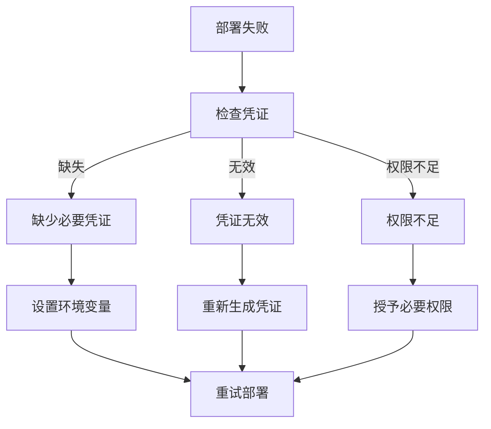

#### 2. 网络连接问题

- **VPC配置**：确保VPC、子网和安全组正确配置
- **防火墙规则**：检查入站和出站规则
- **DNS解析**：验证域名解析是否正常

#### 3. 资源限制问题

- **配额检查**：确认账户配额满足部署需求
- **资源监控**：监控CPU、内存和磁盘使用情况
- **扩缩容策略**：合理配置扩缩容触发条件

### 调试工具

#### 1. 日志收集

```bash
# AgentRun日志
tail -f /var/log/agentrun/app.log

# FC函数日志
tail -f /var/log/alicloud/funciton/app.log

# Kubernetes日志
kubectl logs -n agentscope-runtime deployment/agent-app

# ModelStudio日志
tail -f /var/log/modelstudio/app.log
```

#### 2. 状态检查

```bash
# 检查部署状态
agentscope status <deploy-id>

# 查看Pod状态
kubectl get pods -n agentscope-runtime

# 检查服务状态
kubectl get svc -n agentscope-runtime

# 查看事件
kubectl describe pod <pod-name> -n agentscope-runtime
```

**章节来源**
- [agentrun_deploy README.md:368-408](file://examples/deployments/agentrun_deploy/README.md#L368-L408)
- [fc_deploy README.md:384-426](file://examples/deployments/fc_deploy/README.md#L384-L426)
- [modelstudio_deploy README.md:236-264](file://examples/deployments/modelstudio_deploy/README.md#L236-L264)

## 结论

AgentScope Runtime提供了完整的云平台部署解决方案，具有以下优势：

### 技术优势

1. **统一抽象**：通过DeployManager基类提供一致的部署接口
2. **云原生支持**：全面支持Kubernetes生态系统的各种部署模式
3. **自动化程度高**：从构建到部署的全流程自动化
4. **监控集成**：内置监控和日志收集功能

### 适用场景

- **快速原型开发**：使用AgentRun和ModelStudio快速验证想法
- **生产环境部署**：使用Kubernetes和PAI获得最佳性能
- **事件驱动应用**：使用FC实现无服务器架构
- **企业级应用**：使用PAI获得专业的机器学习支持

### 最佳实践

1. **选择合适的平台**：根据应用场景和性能要求选择最适合的云平台
2. **配置优化**：合理配置资源和扩缩容策略
3. **监控告警**：建立完善的监控和告警体系
4. **成本控制**：定期审查和优化资源配置

## 附录

### 部署配置模板

#### AgentRun配置模板

```yaml
# agentrun_deploy_config.yaml
deploy_name: "agent-app-example"
telemetry_enabled: true
requirements:
  - "agentscope"
  - "fastapi"
  - "uvicorn"
environment:
  PYTHONPATH: "/code"
  LOG_LEVEL: "INFO"
  DASHSCOPE_API_KEY: "${DASHSCOPE_API_KEY}"
```

#### FC配置模板

```yaml
# fc_deploy_config.yaml
deploy_name: "agent-app-example"
telemetry_enabled: true
requirements:
  - "agentscope"
  - "fastapi"
  - "uvicorn"
environment:
  PYTHONPATH: "/code"
  LOG_LEVEL: "INFO"
  DASHSCOPE_API_KEY: "${DASHSCOPE_API_KEY}"
```

#### Kubernetes配置模板

```yaml
# k8s_deploy_config.yaml
context:
  namespace: "agentscope-runtime"
  kubeconfig: "~/.kube/config"

spec:
  name: "agent-app"
  image:
    registry: "docker.io"
    repository: "my-org"
    tag: "latest"
  resources:
    requests:
      cpu: "200m"
      memory: "512Mi"
    limits:
      cpu: "1000m"
      memory: "2Gi"
  replicas: 1
```

### 快速开始命令

#### 部署到AgentRun

```bash
cd examples/deployments/agentrun_deploy
python app_deploy_to_agentrun.py
```

#### 部署到FC

```bash
cd examples/deployments/fc_deploy
python app_deploy_to_fc.py
```

#### 部署到Kubernetes

```bash
cd examples/deployments/k8s_deploy
python app_deploy_to_k8s.py
```

### 支持的云平台对比

| 特性 | AgentRun | FC | ModelStudio | PAI | Kubernetes | Knative | Kruise |
|------|----------|----|-------------|-----|------------|---------|--------|
| 部署复杂度 | 简单 | 简单 | 中等 | 中等 | 复杂 | 中等 | 中等 |
| 成本模型 | 按请求 | 按执行 | 按使用 | 按资源 | 按资源 | 按请求 | 按资源 |
| 扩缩容 | 自动 | 自动 | 手动 | 手动 | 自动 | 自动 | 手动 |
| 监控 | 内置 | 内置 | 可视化 | 控制台 | 丰富 | 内置 | 手动 |
| 适用场景 | 会话应用 | 事件驱动 | 开发测试 | 生产部署 | 通用应用 | 无服务器 | 沙箱应用 |