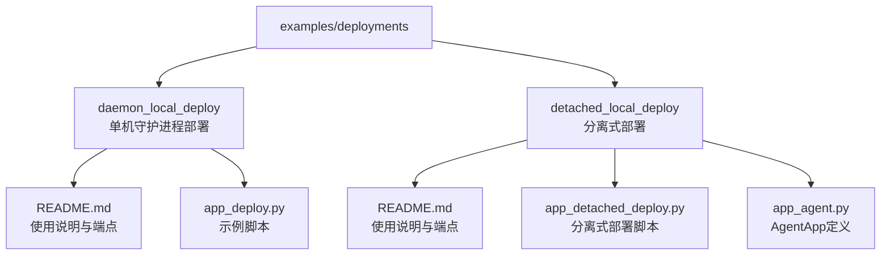
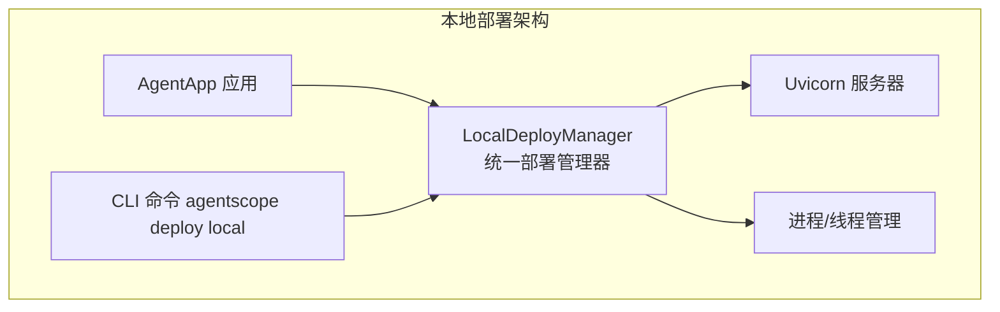
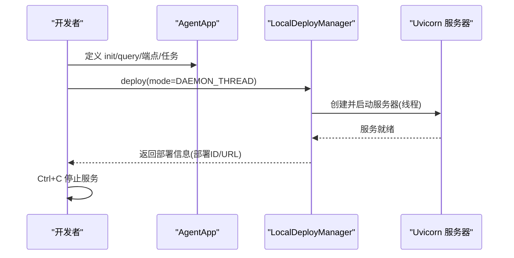
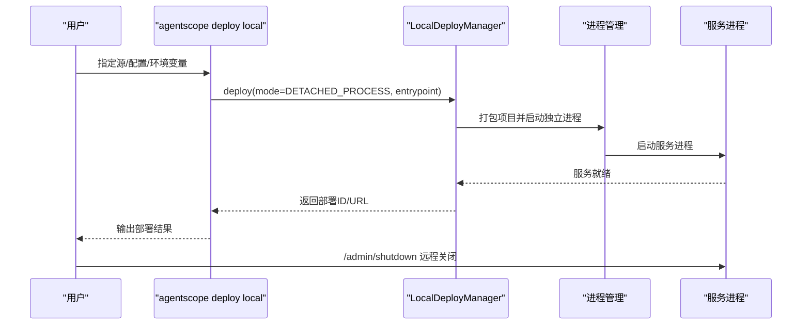
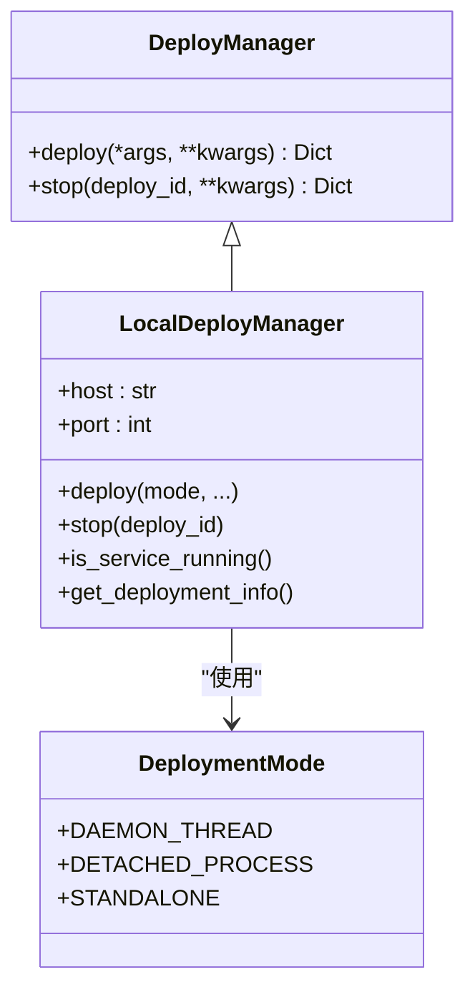
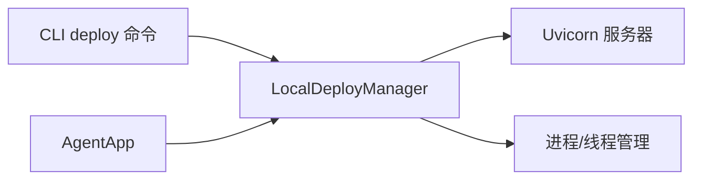

# 本地部署示例

<cite>
**本文引用的文件**   
- [examples/deployments/local_deploy_config.yaml](file://examples/deployments/local_deploy_config.yaml)
- [examples/deployments/daemon_local_deploy/README.md](file://examples/deployments/daemon_local_deploy/README.md)
- [examples/deployments/daemon_local_deploy/app_deploy.py](file://examples/deployments/daemon_local_deploy/app_deploy.py)
- [examples/deployments/detached_local_deploy/README.md](file://examples/deployments/detached_local_deploy/README.md)
- [examples/deployments/detached_local_deploy/app_detached_deploy.py](file://examples/deployments/detached_local_deploy/app_detached_deploy.py)
- [examples/deployments/detached_local_deploy/app_agent.py](file://examples/deployments/detached_local_deploy/app_agent.py)
- [src/agentscope_runtime/engine/deployers/local_deployer.py](file://src/agentscope_runtime/engine/deployers/local_deployer.py)
- [src/agentscope_runtime/engine/deployers/utils/deployment_modes.py](file://src/agentscope_runtime/engine/deployers/utils/deployment_modes.py)
- [src/agentscope_runtime/engine/deployers/base.py](file://src/agentscope_runtime/engine/deployers/base.py)
- [src/agentscope_runtime/cli/commands/deploy.py](file://src/agentscope_runtime/cli/commands/deploy.py)
- [cookbook/zh/deployment.md](file://cookbook/zh/deployment.md)
- [README.md](file://README.md)
</cite>

## 目录
1. [简介](#简介)
2. [项目结构](#项目结构)
3. [核心组件](#核心组件)
4. [架构总览](#架构总览)
5. [详细组件分析](#详细组件分析)
6. [依赖关系分析](#依赖关系分析)
7. [性能考虑](#性能考虑)
8. [故障排查指南](#故障排查指南)
9. [结论](#结论)
10. [附录](#附录)

## 简介
本文件面向希望在本地快速部署 AgentScope Runtime 的用户，提供“单机守护进程部署”和“分离式（独立进程）部署”两种本地部署模式的完整说明。内容涵盖基本概念、适用场景、配置方法、启动脚本示例、优势与限制、性能调优与资源管理最佳实践，以及常见问题排查与解决方案。目标是帮助开发者在开发测试与生产单节点场景下，以最小成本完成本地部署与运维。

## 项目结构
本地部署示例位于 examples/deployments 目录，包含两类典型示例：
- 单机守护进程部署：以阻塞主线程的方式运行服务，便于开发调试与快速验证。
- 分离式部署：将服务以独立进程方式运行，支持远程关闭与后台持续运行，更接近生产单节点场景。

**图表来源**
- [examples/deployments/daemon_local_deploy/README.md:1-316](file://examples/deployments/daemon_local_deploy/README.md#L1-L316)
- [examples/deployments/detached_local_deploy/README.md:1-222](file://examples/deployments/detached_local_deploy/README.md#L1-L222)

**章节来源**
- [examples/deployments/daemon_local_deploy/README.md:1-316](file://examples/deployments/daemon_local_deploy/README.md#L1-L316)
- [examples/deployments/detached_local_deploy/README.md:1-222](file://examples/deployments/detached_local_deploy/README.md#L1-L222)

## 核心组件
- LocalDeployManager：统一的本地部署管理器，支持守护线程模式与分离式进程模式，负责服务启动、停止、状态管理与资源清理。
- DeploymentMode：枚举定义了部署模式，包括守护线程与分离式进程。
- DeployManager 抽象基类：定义了 deploy 与 stop 的统一接口，便于扩展其他平台部署器。
- CLI deploy 命令：提供 agentscope deploy local 命令，支持从目录或文件源进行本地分离式部署，自动解析配置与环境变量。

关键职责与关系：
- LocalDeployManager 封装 uvicorn 服务器与进程管理，分别处理守护线程与分离式进程两种模式。
- DeploymentMode 用于在 deploy 方法中选择具体模式。
- CLI deploy 命令通过 LocalDeployManager 实现本地分离式部署，支持配置文件与命令行参数合并。

**章节来源**
- [src/agentscope_runtime/engine/deployers/local_deployer.py:27-645](file://src/agentscope_runtime/engine/deployers/local_deployer.py#L27-L645)
- [src/agentscope_runtime/engine/deployers/utils/deployment_modes.py:7-15](file://src/agentscope_runtime/engine/deployers/utils/deployment_modes.py#L7-L15)
- [src/agentscope_runtime/engine/deployers/base.py:9-44](file://src/agentscope_runtime/engine/deployers/base.py#L9-L44)
- [src/agentscope_runtime/cli/commands/deploy.py:354-446](file://src/agentscope_runtime/cli/commands/deploy.py#L354-L446)

## 架构总览
本地部署的整体架构由“应用层（AgentApp）—部署管理层（LocalDeployManager）—运行时（uvicorn/FastAPI）—进程/线程管理”构成。守护线程模式在当前进程中启动 uvicorn 服务器；分离式模式打包项目并以独立进程启动，支持远程关闭。

**图表来源**
- [src/agentscope_runtime/engine/deployers/local_deployer.py:27-645](file://src/agentscope_runtime/engine/deployers/local_deployer.py#L27-L645)
- [src/agentscope_runtime/cli/commands/deploy.py:354-446](file://src/agentscope_runtime/cli/commands/deploy.py#L354-L446)

## 详细组件分析

### 单机守护进程部署（Daemon Thread）
- 特点
  - 服务在主线程中阻塞运行，适合开发调试与快速验证。
  - 通过 Ctrl+C 或信号手动停止。
  - 配置简单，无需额外进程管理。
- 典型使用
  - 使用 AgentApp 定义查询与端点，通过 LocalDeployManager 启动守护线程模式。
  - 示例脚本展示了同步、异步、流式接口与任务接口的完整配置。
- 关键流程
  - 创建 AgentApp 并注册端点与任务。
  - 调用 deploy(LocalDeployManager(...), mode=DAEMON_THREAD)。
  - 服务启动后保持阻塞，直至手动停止。

**图表来源**
- [examples/deployments/daemon_local_deploy/app_deploy.py:122-129](file://examples/deployments/daemon_local_deploy/app_deploy.py#L122-L129)
- [src/agentscope_runtime/engine/deployers/local_deployer.py:175-258](file://src/agentscope_runtime/engine/deployers/local_deployer.py#L175-L258)

**章节来源**
- [examples/deployments/daemon_local_deploy/README.md:9-316](file://examples/deployments/daemon_local_deploy/README.md#L9-L316)
- [examples/deployments/daemon_local_deploy/app_deploy.py:1-129](file://examples/deployments/daemon_local_deploy/app_deploy.py#L1-L129)
- [src/agentscope_runtime/engine/deployers/local_deployer.py:175-258](file://src/agentscope_runtime/engine/deployers/local_deployer.py#L175-L258)

### 分离式部署（Detached Process）
- 特点
  - 服务在独立进程运行，脚本退出后服务仍持续运行。
  - 支持远程关闭（/admin/shutdown），适合生产单节点场景。
  - 支持多种服务配置（内存/Redis），并提供管理端点。
- 典型使用
  - 使用 agentscope deploy local 命令从目录或文件源进行分离式部署。
  - 支持配置文件与命令行参数合并，自动解析环境变量。
  - 示例脚本展示同步、异步、流式接口与任务接口。
- 关键流程
  - CLI 解析配置与环境变量。
  - LocalDeployManager 打包项目并启动独立进程。
  - 服务启动后返回 URL 与部署 ID，可通过 /admin/shutdown 远程关闭。

**图表来源**
- [src/agentscope_runtime/cli/commands/deploy.py:354-446](file://src/agentscope_runtime/cli/commands/deploy.py#L354-L446)
- [src/agentscope_runtime/engine/deployers/local_deployer.py:260-382](file://src/agentscope_runtime/engine/deployers/local_deployer.py#L260-L382)

**章节来源**
- [examples/deployments/detached_local_deploy/README.md:1-222](file://examples/deployments/detached_local_deploy/README.md#L1-L222)
- [examples/deployments/detached_local_deploy/app_detached_deploy.py:52-120](file://examples/deployments/detached_local_deploy/app_detached_deploy.py#L52-L120)
- [src/agentscope_runtime/cli/commands/deploy.py:354-446](file://src/agentscope_runtime/cli/commands/deploy.py#L354-L446)

### 部署模式与状态管理
- DeploymentMode
  - DAEMON_THREAD：守护线程模式，适合开发与测试。
  - DETACHED_PROCESS：分离式进程模式，适合生产单节点。
- LocalDeployManager
  - 统一管理部署与停止，记录部署状态，支持优雅关闭与资源清理。
  - 提供 is_service_running、get_deployment_info 等辅助方法。

**图表来源**
- [src/agentscope_runtime/engine/deployers/base.py:9-44](file://src/agentscope_runtime/engine/deployers/base.py#L9-L44)
- [src/agentscope_runtime/engine/deployers/local_deployer.py:27-645](file://src/agentscope_runtime/engine/deployers/local_deployer.py#L27-L645)
- [src/agentscope_runtime/engine/deployers/utils/deployment_modes.py:7-15](file://src/agentscope_runtime/engine/deployers/utils/deployment_modes.py#L7-L15)

**章节来源**
- [src/agentscope_runtime/engine/deployers/utils/deployment_modes.py:7-15](file://src/agentscope_runtime/engine/deployers/utils/deployment_modes.py#L7-L15)
- [src/agentscope_runtime/engine/deployers/local_deployer.py:27-645](file://src/agentscope_runtime/engine/deployers/local_deployer.py#L27-L645)

### 配置文件模板与启动脚本示例
- 本地部署配置模板
  - 适用于 agentscope deploy local 的配置文件，包含 host、port、entrypoint（可选）与环境变量。
  - 示例文件路径：examples/deployments/local_deploy_config.yaml
- 启动脚本示例
  - 单机守护进程：examples/deployments/daemon_local_deploy/app_deploy.py
  - 分离式部署：examples/deployments/detached_local_deploy/app_detached_deploy.py
  - AgentApp 定义：examples/deployments/detached_local_deploy/app_agent.py

**章节来源**
- [examples/deployments/local_deploy_config.yaml:1-16](file://examples/deployments/local_deploy_config.yaml#L1-L16)
- [examples/deployments/daemon_local_deploy/app_deploy.py:1-129](file://examples/deployments/daemon_local_deploy/app_deploy.py#L1-L129)
- [examples/deployments/detached_local_deploy/app_detached_deploy.py:1-125](file://examples/deployments/detached_local_deploy/app_detached_deploy.py#L1-L125)
- [examples/deployments/detached_local_deploy/app_agent.py:1-87](file://examples/deployments/detached_local_deploy/app_agent.py#L1-L87)

## 依赖关系分析
- CLI deploy 命令依赖 LocalDeployManager，负责解析配置、环境变量与入口点，调用 deploy 执行部署。
- LocalDeployManager 依赖 uvicorn 与进程管理模块，分别处理守护线程与分离式进程。
- AgentApp 作为应用入口，通过装饰器定义端点与任务，最终由 LocalDeployManager 部署。

**图表来源**
- [src/agentscope_runtime/cli/commands/deploy.py:354-446](file://src/agentscope_runtime/cli/commands/deploy.py#L354-L446)
- [src/agentscope_runtime/engine/deployers/local_deployer.py:27-645](file://src/agentscope_runtime/engine/deployers/local_deployer.py#L27-L645)

**章节来源**
- [src/agentscope_runtime/cli/commands/deploy.py:354-446](file://src/agentscope_runtime/cli/commands/deploy.py#L354-L446)
- [src/agentscope_runtime/engine/deployers/local_deployer.py:27-645](file://src/agentscope_runtime/engine/deployers/local_deployer.py#L27-L645)

## 性能考虑
- 线程与进程模型
  - 守护线程模式：轻量，但与主进程耦合，适合开发；注意优雅停机与资源回收。
  - 分离式进程模式：进程隔离，便于资源控制与远程关闭；需关注进程日志与健康检查。
- 端口与网络
  - 默认监听 127.0.0.1，若需外网访问，可调整 host；注意防火墙与安全策略。
- 并发与任务队列
  - 任务接口支持 Celery 队列（如 celery1），可按需配置 broker_url 与 backend_url。
- 资源管理
  - 分离式模式支持 PID 文件与日志文件管理，便于进程监控与清理。
  - 建议结合系统监控（CPU/内存/磁盘）与日志聚合，确保服务稳定性。

[本节为通用指导，不直接分析具体文件]

## 故障排查指南
- 端口占用
  - 现象：服务启动超时或无法访问。
  - 处理：检查端口占用情况，修改配置中的 port 或释放占用端口。
- 进程异常退出
  - 现象：分离式进程退出后无法通过 /admin/shutdown 关闭。
  - 处理：查看进程日志与 PID 文件，使用系统命令查找并终止残留进程。
- 环境变量缺失
  - 现象：模型 API Key 或其他依赖未生效。
  - 处理：在配置文件或命令行中正确设置环境变量，或使用 --env/--env-file。
- 部署失败
  - 现象：CLI 报错或服务未就绪。
  - 处理：查看 CLI 输出与进程日志，确认入口点、依赖与配置是否正确。

**章节来源**
- [examples/deployments/detached_local_deploy/README.md:180-206](file://examples/deployments/detached_local_deploy/README.md#L180-L206)

## 结论
本地部署为 AgentScope Runtime 提供了从开发到生产单节点的灵活路径。守护线程模式适合快速验证与调试，分离式进程模式更贴近生产场景，支持远程关闭与进程管理。通过统一的 LocalDeployManager 与 CLI 命令，用户可以便捷地完成配置、部署与运维。建议结合本文的配置模板、启动脚本与故障排查指南，按需选择部署模式并进行性能与资源优化。

[本节为总结性内容，不直接分析具体文件]

## 附录

### 本地部署模式对比
- 守护线程模式
  - 优点：简单、开发友好、无额外进程管理。
  - 限制：与主进程耦合，不适合生产长期运行。
- 分离式进程模式
  - 优点：进程独立、支持远程关闭、更接近生产。
  - 限制：需要进程管理与日志维护。

**章节来源**
- [examples/deployments/daemon_local_deploy/README.md:301-316](file://examples/deployments/daemon_local_deploy/README.md#L301-L316)
- [examples/deployments/detached_local_deploy/README.md:207-216](file://examples/deployments/detached_local_deploy/README.md#L207-L216)

### 部署前准备与最佳实践
- 准备工作
  - 安装 Runtime、准备模型与工具、配置环境变量与凭证。
- 最佳实践
  - 明确部署模式（开发/生产单节点）。
  - 使用配置文件与命令行参数合并，确保环境变量一致。
  - 分离式部署建议开启健康检查与日志聚合，定期清理旧日志与 PID 文件。

**章节来源**
- [cookbook/zh/deployment.md:21-73](file://cookbook/zh/deployment.md#L21-L73)
- [README.md:538-581](file://README.md#L538-L581)