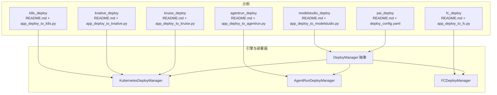
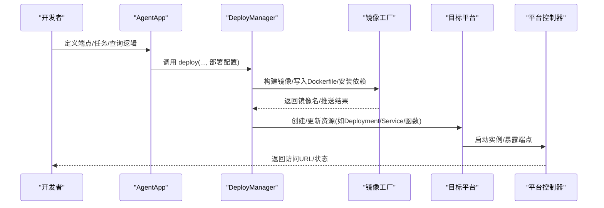
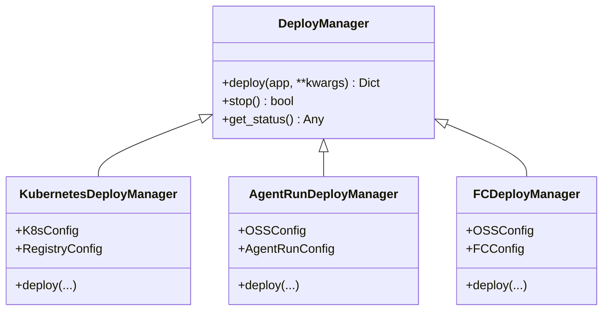

# 部署示例

<cite>
**本文引用的文件**
- [k8s 部署示例说明](file://examples/deployments/k8s_deploy/README.md)
- [k8s 部署脚本](file://examples/deployments/k8s_deploy/app_deploy_to_k8s.py)
- [AgentRun 部署示例说明](file://examples/deployments/agentrun_deploy/README.md)
- [AgentRun 部署脚本](file://examples/deployments/agentrun_deploy/app_deploy_to_agentrun.py)
- [FC 部署示例说明](file://examples/deployments/fc_deploy/README.md)
- [FC 部署脚本](file://examples/deployments/fc_deploy/app_deploy_to_fc.py)
- [Knative 部署示例说明](file://examples/deployments/knative_deploy/README.md)
- [Knative 部署脚本](file://examples/deployments/knative_deploy/app_deploy_to_knative.py)
- [Kruise 部署示例说明](file://examples/deployments/kruise_deploy/README.md)
- [Kruise 部署脚本](file://examples/deployments/kruise_deploy/app_deploy_to_kruise.py)
- [ModelStudio 部署示例说明](file://examples/deployments/modelstudio_deploy/README.md)
- [ModelStudio 部署脚本](file://examples/deployments/modelstudio_deploy/app_deploy_to_modelstudio.py)
- [PAI 部署示例说明](file://examples/deployments/pai_deploy/README.md)
- [PAI 配置文件](file://examples/deployments/pai_deploy/deploy_config.yaml)
- [Kubernetes 部署器实现](file://src/agentscope_runtime/engine/deployers/kubernetes_deployer.py)
- [AgentRun 部署器实现](file://src/agentscope_runtime/engine/deployers/agentrun_deployer.py)
- [FC 部署器实现](file://src/agentscope_runtime/engine/deployers/fc_deployer.py)
</cite>

## 目录
1. [简介](#简介)
2. [项目结构](#项目结构)
3. [核心组件](#核心组件)
4. [架构总览](#架构总览)
5. [详细组件分析](#详细组件分析)
6. [依赖关系分析](#依赖关系分析)
7. [性能考虑](#性能考虑)
8. [故障排查指南](#故障排查指南)
9. [结论](#结论)
10. [附录](#附录)

## 简介
本文件面向 AgentScope Runtime 的多平台部署，系统性整理并对比了以下部署模式：
- Kubernetes 集群部署（Deployment/Service）
- Knative 服务部署
- Kruise Sandbox 自定义资源部署
- AgentRun 平台部署
- 函数计算（FC）部署
- ModelStudio 平台部署
- PAI（阿里云平台 for AI）部署

内容涵盖：部署配置与参数说明、高可用与负载均衡策略、监控与日志最佳实践、故障恢复与滚动更新操作指南，并提供可直接参考的配置模板与参数清单。

## 项目结构
围绕部署示例，仓库在 examples/deployments 下提供了各平台的独立示例目录与脚本；核心部署器位于 src/agentscope_runtime/engine/deployers 中，统一通过 DeployManager 抽象进行封装，支持容器镜像构建、打包、推送与平台特定资源编排。

图表来源
- [k8s 部署示例说明](file://examples/deployments/k8s_deploy/README.md)
- [k8s 部署脚本](file://examples/deployments/k8s_deploy/app_deploy_to_k8s.py)
- [Kubernetes 部署器实现](file://src/agentscope_runtime/engine/deployers/kubernetes_deployer.py)
- [AgentRun 部署器实现](file://src/agentscope_runtime/engine/deployers/agentrun_deployer.py)
- [FC 部署器实现](file://src/agentscope_runtime/engine/deployers/fc_deployer.py)

章节来源
- [k8s 部署示例说明](file://examples/deployments/k8s_deploy/README.md)
- [AgentRun 部署示例说明](file://examples/deployments/agentrun_deploy/README.md)
- [FC 部署示例说明](file://examples/deployments/fc_deploy/README.md)
- [Knative 部署示例说明](file://examples/deployments/knative_deploy/README.md)
- [Kruise 部署示例说明](file://examples/deployments/kruise_deploy/README.md)
- [ModelStudio 部署示例说明](file://examples/deployments/modelstudio_deploy/README.md)
- [PAI 部署示例说明](file://examples/deployments/pai_deploy/README.md)

## 核心组件
- 部署器抽象层（DeployManager）：统一管理镜像构建、打包、推送与平台资源编排，屏蔽平台差异。
- 平台专用部署器：
  - KubernetesDeployManager：支持 Deployment/Service 编排、副本数、资源配额、镜像拉取策略等。
  - AgentRunDeployManager：对接阿里云 AgentRun，支持 OSS 存储、网络模式（公网/私网）、会话并发与空闲超时等。
  - FCDeployManager：对接阿里云 FC，支持 VPC 私网、会话并发与空闲超时、磁盘配额等。
- 示例脚本：每个平台提供独立示例脚本，演示端点注册、健康检查、测试命令与清理流程。

章节来源
- [Kubernetes 部署器实现](file://src/agentscope_runtime/engine/deployers/kubernetes_deployer.py)
- [AgentRun 部署器实现](file://src/agentscope_runtime/engine/deployers/agentrun_deployer.py)
- [FC 部署器实现](file://src/agentscope_runtime/engine/deployers/fc_deployer.py)

## 架构总览
下图展示了 AgentApp 通过不同部署器在各平台上完成镜像构建、推送与资源编排的整体流程。

图表来源
- [k8s 部署脚本](file://examples/deployments/k8s_deploy/app_deploy_to_k8s.py)
- [Kubernetes 部署器实现](file://src/agentscope_runtime/engine/deployers/kubernetes_deployer.py)
- [AgentRun 部署器实现](file://src/agentscope_runtime/engine/deployers/agentrun_deployer.py)
- [FC 部署器实现](file://src/agentscope_runtime/engine/deployers/fc_deployer.py)

## 详细组件分析

### Kubernetes 集群部署
- 适用场景
  - 企业级容器化部署，需要弹性扩缩容、多副本高可用、细粒度资源控制。
- 关键配置
  - 注册表配置：镜像仓库地址与命名空间。
  - Kubernetes 连接：命名空间、kubeconfig 路径。
  - 运行时配置：CPU/内存请求与限制、镜像拉取策略、节点选择器与容忍。
  - 部署配置：端口、副本数、镜像标签与名称、依赖包、环境变量、健康检查、平台架构、是否推送镜像。
- 高可用与负载均衡
  - 使用 Deployment + Service，设置 replicas ≥ 2；结合 PodDisruptionBudget 控制滚动更新期间的可用性。
  - 外部入口可通过 Ingress/NLB 暴露，或使用 LoadBalancer Service 获取外部 IP。
- 监控与日志
  - 建议启用 Prometheus/Grafana 收集指标；容器内输出到 stdout/stderr，由平台日志系统采集。
- 故障恢复与滚动更新
  - 使用滚动更新策略（maxUnavailable 或 maxSurge），结合 readinessProbe/livenessProbe。
  - 发布失败回滚至上一个版本。
- 参考路径
  - [示例说明](file://examples/deployments/k8s_deploy/README.md)
  - [示例脚本](file://examples/deployments/k8s_deploy/app_deploy_to_k8s.py)
  - [部署器实现](file://src/agentscope_runtime/engine/deployers/kubernetes_deployer.py)

章节来源
- [k8s 部署示例说明](file://examples/deployments/k8s_deploy/README.md)
- [k8s 部署脚本](file://examples/deployments/k8s_deploy/app_deploy_to_k8s.py)
- [Kubernetes 部署器实现](file://src/agentscope_runtime/engine/deployers/kubernetes_deployer.py)

### Knative 服务部署
- 适用场景
  - 无服务器化、按需伸缩、冷启动优化的推理服务。
- 关键配置
  - 注册表与 Kubernetes 连接同 Kubernetes。
  - Knative 服务配置：端口、镜像标签与名称、依赖、环境变量、健康检查、平台架构、是否推送镜像。
  - 网关：通过 Host 头路由到具体 KService。
- 高可用与负载均衡
  - Knative 默认具备自动扩缩容能力；建议配合资源请求/限制避免过度调度。
- 监控与日志
  - 使用 Knative 提供的指标与日志采集；结合平台 SLO/SLI。
- 故障恢复与滚动更新
  - 通过 KService 更新镜像版本实现滚动更新；失败回滚。
- 参考路径
  - [示例说明](file://examples/deployments/knative_deploy/README.md)
  - [示例脚本](file://examples/deployments/knative_deploy/app_deploy_to_knative.py)
  - [部署器实现](file://src/agentscope_runtime/engine/deployers/kubernetes_deployer.py)

章节来源
- [Knative 部署示例说明](file://examples/deployments/knative_deploy/README.md)
- [Knative 部署脚本](file://examples/deployments/knative_deploy/app_deploy_to_knative.py)
- [Kubernetes 部署器实现](file://src/agentscope_runtime/engine/deployers/kubernetes_deployer.py)

### Kruise Sandbox 部署
- 适用场景
  - 在 Kubernetes 上以自定义资源形式运行沙箱化的 Agent 应用，便于隔离与管理。
- 关键配置
  - 注册表与 Kubernetes 连接。
  - Kruise 配置：端口、镜像标签与名称、依赖、环境变量、健康检查、平台架构、是否推送镜像。
  - 自动生成 LoadBalancer Service 以便外部访问。
- 高可用与负载均衡
  - 通过 Sandbox CRD 与 Service 协作实现对外暴露与流量转发。
- 监控与日志
  - 通过 kubectl logs/describe 查看状态与日志。
- 故障恢复与滚动更新
  - 支持基于部署 ID 的清理与重建。
- 参考路径
  - [示例说明](file://examples/deployments/kruise_deploy/README.md)
  - [示例脚本](file://examples/deployments/kruise_deploy/app_deploy_to_kruise.py)
  - [部署器实现](file://src/agentscope_runtime/engine/deployers/kubernetes_deployer.py)

章节来源
- [Kruise 部署示例说明](file://examples/deployments/kruise_deploy/README.md)
- [Kruise 部署脚本](file://examples/deployments/kruise_deploy/app_deploy_to_kruise.py)
- [Kubernetes 部署器实现](file://src/agentscope_runtime/engine/deployers/kubernetes_deployer.py)

### AgentRun 平台部署
- 适用场景
  - 快速托管推理服务，无需运维 Kubernetes/Knative，适合快速上线与演示。
- 关键配置
  - OSS 配置：用于上传打包产物。
  - AgentRun 配置：区域、端点、执行角色、会话并发与空闲超时。
  - 网络配置：公网/私网/公网+私网模式，以及 VPC、安全组、交换机。
  - 资源配置：CPU/内存。
  - 日志配置：SLS 日志项目与日志库。
- 高可用与负载均衡
  - 平台侧自动扩缩容；通过会话亲和头绑定固定实例。
- 监控与日志
  - 平台内置控制台与指标；可接入 SLS 实时日志。
- 故障恢复与滚动更新
  - 通过平台控制台发布新版本或回滚。
- 参考路径
  - [示例说明](file://examples/deployments/agentrun_deploy/README.md)
  - [示例脚本](file://examples/deployments/agentrun_deploy/app_deploy_to_agentrun.py)
  - [部署器实现](file://src/agentscope_runtime/engine/deployers/agentrun_deployer.py)

章节来源
- [AgentRun 部署示例说明](file://examples/deployments/agentrun_deploy/README.md)
- [AgentRun 部署脚本](file://examples/deployments/agentrun_deploy/app_deploy_to_agentrun.py)
- [AgentRun 部署器实现](file://src/agentscope_runtime/engine/deployers/agentrun_deployer.py)

### 函数计算（FC）部署
- 适用场景
  - 事件驱动、低延迟、按次计费的推理服务；适合突发流量与短期任务。
- 关键配置
  - OSS 配置：用于上传打包产物。
  - FC 配置：区域、账号、执行角色、会话并发与空闲超时。
  - VPC 配置：私网访问需求。
  - 资源配置：CPU/内存/磁盘。
  - 日志配置：SLS 日志项目与日志库。
- 高可用与负载均衡
  - 平台自动扩缩容；支持会话亲和头绑定固定实例。
- 监控与日志
  - 平台内置控制台与指标；可接入 SLS 实时日志。
- 故障恢复与滚动更新
  - 通过平台控制台发布新版本或回滚。
- 参考路径
  - [示例说明](file://examples/deployments/fc_deploy/README.md)
  - [示例脚本](file://examples/deployments/fc_deploy/app_deploy_to_fc.py)
  - [部署器实现](file://src/agentscope_runtime/engine/deployers/fc_deployer.py)

章节来源
- [FC 部署示例说明](file://examples/deployments/fc_deploy/README.md)
- [FC 部署脚本](file://examples/deployments/fc_deploy/app_deploy_to_fc.py)
- [FC 部署器实现](file://src/agentscope_runtime/engine/deployers/fc_deployer.py)

### ModelStudio 平台部署
- 适用场景
  - 阿里云 ModelStudio 场景下的模型服务托管，适合模型训练/推理一体化。
- 关键配置
  - OSS 配置：用于上传打包产物。
  - ModelStudio 配置：工作区 ID、访问凭据、DashScope API Key。
- 高可用与负载均衡
  - 平台侧自动扩缩容；支持域名与网关配置。
- 监控与日志
  - 平台内置控制台与指标；可接入 SLS 实时日志。
- 故障恢复与滚动更新
  - 通过平台控制台发布新版本或回滚。
- 参考路径
  - [示例说明](file://examples/deployments/modelstudio_deploy/README.md)
  - [示例脚本](file://examples/deployments/modelstudio_deploy/app_deploy_to_modelstudio.py)

章节来源
- [ModelStudio 部署示例说明](file://examples/deployments/modelstudio_deploy/README.md)
- [ModelStudio 部署脚本](file://examples/deployments/modelstudio_deploy/app_deploy_to_modelstudio.py)

### PAI（阿里云平台 for AI）部署
- 适用场景
  - 企业级 AI 工作流与推理服务托管，支持多种资源模式（公共资源池/资源组/配额）。
- 关键配置
  - 配置文件（deploy_config.yaml）：工作区、区域、服务名、代码目录与入口、资源类型与规格、环境变量。
  - CLI 参数：覆盖配置文件中的字段，如资源类型、实例数量、VPC 等。
- 高可用与负载均衡
  - 通过实例数量与资源规格控制；平台侧扩缩容。
- 监控与日志
  - 通过 PAI 控制台查看状态与指标。
- 故障恢复与滚动更新
  - 通过 PAI 控制台发布新版本或回滚。
- 参考路径
  - [示例说明](file://examples/deployments/pai_deploy/README.md)
  - [配置文件](file://examples/deployments/pai_deploy/deploy_config.yaml)

章节来源
- [PAI 部署示例说明](file://examples/deployments/pai_deploy/README.md)
- [PAI 配置文件](file://examples/deployments/pai_deploy/deploy_config.yaml)

## 依赖关系分析
- 统一抽象：所有平台部署器均继承自 DeployManager，内部复用镜像工厂、打包工具与平台客户端。
- 平台适配：Kubernetes/AgentRun/FC 等分别封装平台 API 与资源编排细节。
- 共享能力：健康检查、端点注册、任务队列、会话管理等在示例脚本中统一演示。

图表来源
- [Kubernetes 部署器实现](file://src/agentscope_runtime/engine/deployers/kubernetes_deployer.py)
- [AgentRun 部署器实现](file://src/agentscope_runtime/engine/deployers/agentrun_deployer.py)
- [FC 部署器实现](file://src/agentscope_runtime/engine/deployers/fc_deployer.py)

章节来源
- [Kubernetes 部署器实现](file://src/agentscope_runtime/engine/deployers/kubernetes_deployer.py)
- [AgentRun 部署器实现](file://src/agentscope_runtime/engine/deployers/agentrun_deployer.py)
- [FC 部署器实现](file://src/agentscope_runtime/engine/deployers/fc_deployer.py)

## 性能考虑
- 资源规划
  - 为 CPU/内存设置合理的 requests/limits，避免 OOM 或饥饿。
  - 对长耗时任务（如推理/工具调用）适当提高内存与 CPU，避免频繁重启。
- 扩缩容策略
  - Kubernetes：Deployment + HPA；Knative：基于并发或 CPU 的自动扩缩容。
  - FC/AgentRun/ModelStudio：利用平台提供的自动扩缩容能力。
- 网络与存储
  - 尽量减少跨可用区访问；私网部署时确保 VPC/安全组/交换机配置正确。
  - 使用对象存储（OSS）作为制品分发与日志落盘介质。
- 测试与压测
  - 在预生产环境进行压力测试，观察延迟、吞吐与错误率，据此调整副本数与资源配额。

## 故障排查指南
- 通用步骤
  - 检查镜像构建与推送是否成功；确认镜像仓库凭证与网络可达。
  - 查看平台控制台状态与日志；核对环境变量与依赖是否完整。
  - 验证健康检查端点与端口映射是否正确。
- Kubernetes
  - 使用 kubectl describe pod/svc/ingress 检查资源状态与事件。
  - 检查资源配额与节点容量；必要时调整 requests/limits 或节点亲和。
- Knative
  - 检查 KService 状态与路由；确认 Host 头与网关配置。
- AgentRun/FC/ModelStudio
  - 检查会话亲和头（如 X-Agentrun-Session-Id 或 x-agentscope-runtime-session-id）是否正确设置。
  - 核对网络模式与 VPC 配置；确认 SLS 日志项目与日志库存在且可写。
- 回滚与清理
  - 通过平台控制台回滚至上一个稳定版本。
  - 使用示例脚本中的清理流程删除资源，或通过 CLI 停止部署。

章节来源
- [k8s 部署示例说明](file://examples/deployments/k8s_deploy/README.md)
- [Knative 部署示例说明](file://examples/deployments/knative_deploy/README.md)
- [AgentRun 部署示例说明](file://examples/deployments/agentrun_deploy/README.md)
- [FC 部署示例说明](file://examples/deployments/fc_deploy/README.md)
- [ModelStudio 部署示例说明](file://examples/deployments/modelstudio_deploy/README.md)

## 结论
- 不同部署模式各有优势：Kubernetes/Knative/Kruise 适合需要强控制与弹性扩缩容的企业场景；AgentRun/FC/ModelStudio/PAI 更适合快速上线与平台托管。
- 无论采用哪种模式，都应重视镜像构建质量、资源规划、健康检查、日志与监控、以及回滚与清理流程。
- 建议在预生产环境充分验证后，再迁移至生产环境，并持续迭代优化资源配置与扩缩容策略。

## 附录
- 配置模板与参数清单（节选）
  - Kubernetes
    - 注册表配置：registry_url、namespace
    - Kubernetes 配置：k8s_namespace、kubeconfig_path
    - 运行时配置：resources.requests/limits、image_pull_policy、node_selector/tolerations
    - 部署配置：port、replicas、image_tag、image_name、requirements、extra_packages、base_image、environment、runtime_config、deploy_timeout、health_check、platform、push_to_registry
  - Knative
    - 除 Kubernetes 配置外，增加 KService 的 annotations/labels、deploy_timeout、health_check
  - Kruise
    - 除 Kubernetes 配置外，增加 Kruise Sandbox 的 annotations/labels、deploy_timeout、health_check
  - AgentRun
    - OSS 配置：access_key_id/secret、region、bucket_name
    - AgentRun 配置：access_key_id/secret、region_id、endpoint、log_config、network_config、cpu/memory、execution_role_arn、session_concurrency_limit、session_idle_timeout_seconds
  - FC
    - OSS 配置：access_key_id/secret、region、bucket_name
    - FC 配置：access_key_id/secret、account_id、region_id、log_config、vpc_config、cpu/memory/disk、execution_role_arn、session_concurrency_limit、session_idle_timeout_seconds
  - ModelStudio
    - OSS 配置：access_key_id/secret
    - ModelStudio 配置：workspace_id、access_key_id/secret、dashscope_api_key
  - PAI
    - 配置文件：context.workspace_id、context.region、spec.name、spec.code.source_dir、spec.code.entrypoint、spec.resources.type、spec.resources.instance_type/instance_count、spec.env

章节来源
- [k8s 部署示例说明](file://examples/deployments/k8s_deploy/README.md)
- [Knative 部署示例说明](file://examples/deployments/knative_deploy/README.md)
- [Kruise 部署示例说明](file://examples/deployments/kruise_deploy/README.md)
- [AgentRun 部署示例说明](file://examples/deployments/agentrun_deploy/README.md)
- [FC 部署示例说明](file://examples/deployments/fc_deploy/README.md)
- [ModelStudio 部署示例说明](file://examples/deployments/modelstudio_deploy/README.md)
- [PAI 部署示例说明](file://examples/deployments/pai_deploy/README.md)
- [PAI 配置文件](file://examples/deployments/pai_deploy/deploy_config.yaml)