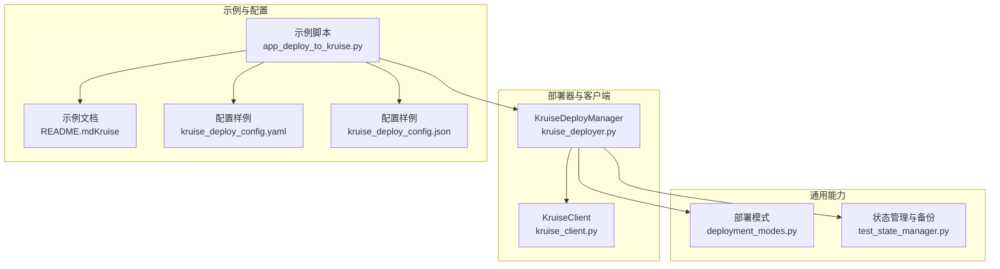
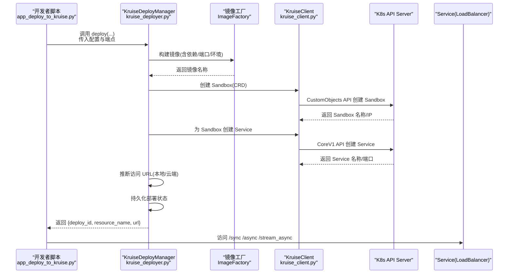
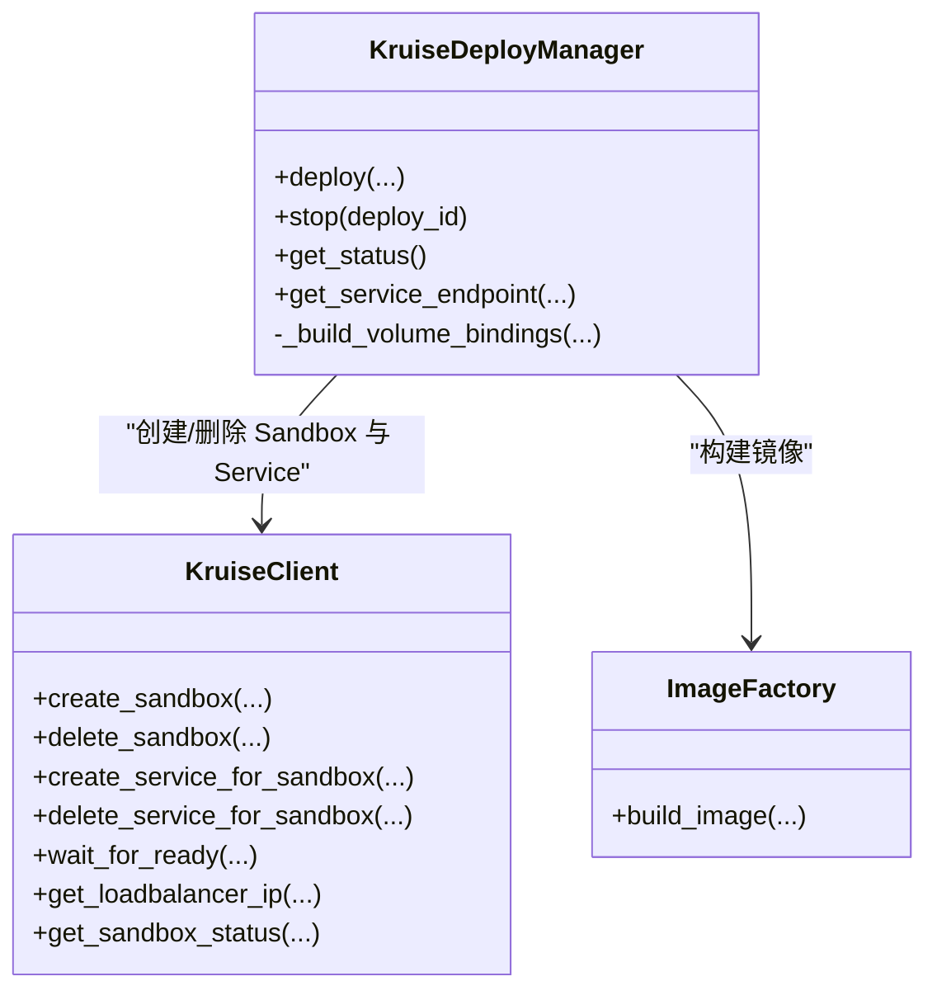
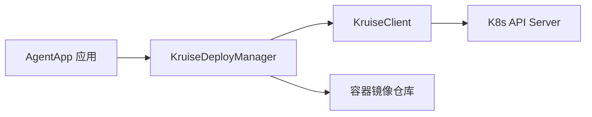

# 高级部署模式

<cite>
**本文引用的文件**
- [kruise_deployer.py](file://src/agentscope_runtime/engine/deployers/kruise_deployer.py)
- [kruise_client.py](file://src/agentscope_runtime/common/container_clients/kruise_client.py)
- [app_deploy_to_kruise.py](file://examples/deployments/kruise_deploy/app_deploy_to_kruise.py)
- [README.md（Kruise 示例）](file://examples/deployments/kruise_deploy/README.md)
- [kruise_deploy_config.yaml](file://examples/deployments/kruise_deploy/kruise_deploy_config.yaml)
- [kruise_deploy_config.json](file://examples/deployments/kruise_deploy/kruise_deploy_config.json)
- [README.md（Kubernetes 示例）](file://examples/deployments/k8s_deploy/README.md)
- [README.md（Knative 示例）](file://examples/deployments/knative_deploy/README.md)
- [advanced_deployment.md](file://cookbook/en/advanced_deployment.md)
- [deployment_modes.py](file://src/agentscope_runtime/engine/deployers/utils/deployment_modes.py)
- [test_state_manager.py](file://tests/deploy/test_state_manager.py)
</cite>

## 目录
1. [简介](#简介)
2. [项目结构](#项目结构)
3. [核心组件](#核心组件)
4. [架构总览](#架构总览)
5. [详细组件分析](#详细组件分析)
6. [依赖分析](#依赖分析)
7. [性能考虑](#性能考虑)
8. [故障排查指南](#故障排查指南)
9. [结论](#结论)
10. [附录](#附录)

## 简介
本文件面向需要在生产环境进行高级部署的用户，系统化介绍 AgentScope Runtime 的高级部署模式，重点覆盖以下主题：
- 基于 Kruise 的网格化部署与 Sandbox 隔离
- 有状态工作负载管理与会话亲和
- 灰度发布、蓝绿发布与金丝雀发布的落地方法
- 多集群与混合云部署架构
- 服务网格集成与流量管理
- 部署回滚与灾难恢复策略
- 性能监控与容量规划
- 安全加固与合规性要求

本指南以仓库中的 Kruise 部署示例为核心，结合通用部署模式与状态管理机制，提供可操作的配置模板与流程图解。

## 项目结构
围绕高级部署模式的关键目录与文件如下：
- 部署器与客户端
  - Kruise 部署器：负责镜像构建、Sandbox 创建、Service 暴露与状态持久化
  - Kruise 客户端：封装 Kubernetes CustomObjects API 与 CoreV1 API，完成 Sandbox 与 Service 生命周期管理
- 示例与配置
  - Kruise 部署示例脚本与说明文档
  - YAML/JSON 配置样例，便于 CLI 与自动化流水线使用
- 部署模式与状态管理
  - 统一的部署模式枚举
  - 部署状态管理与备份策略（用于回滚与审计）

**图表来源**
- [kruise_deployer.py:37-434](file://src/agentscope_runtime/engine/deployers/kruise_deployer.py#L37-L434)
- [kruise_client.py:22-623](file://src/agentscope_runtime/common/container_clients/kruise_client.py#L22-L623)
- [app_deploy_to_kruise.py:119-377](file://examples/deployments/kruise_deploy/app_deploy_to_kruise.py#L119-L377)
- [README.md（Kruise 示例）:1-257](file://examples/deployments/kruise_deploy/README.md#L1-L257)
- [kruise_deploy_config.yaml:1-59](file://examples/deployments/kruise_deploy/kruise_deploy_config.yaml#L1-L59)
- [kruise_deploy_config.json:1-40](file://examples/deployments/kruise_deploy/kruise_deploy_config.json#L1-L40)
- [deployment_modes.py:7-15](file://src/agentscope_runtime/engine/deployers/utils/deployment_modes.py#L7-L15)
- [test_state_manager.py:277-507](file://tests/deploy/test_state_manager.py#L277-L507)

**章节来源**
- [kruise_deployer.py:37-434](file://src/agentscope_runtime/engine/deployers/kruise_deployer.py#L37-L434)
- [kruise_client.py:22-623](file://src/agentscope_runtime/common/container_clients/kruise_client.py#L22-L623)
- [app_deploy_to_kruise.py:119-377](file://examples/deployments/kruise_deploy/app_deploy_to_kruise.py#L119-L377)
- [README.md（Kruise 示例）:1-257](file://examples/deployments/kruise_deploy/README.md#L1-L257)
- [kruise_deploy_config.yaml:1-59](file://examples/deployments/kruise_deploy/kruise_deploy_config.yaml#L1-L59)
- [kruise_deploy_config.json:1-40](file://examples/deployments/kruise_deploy/kruise_deploy_config.json#L1-L40)
- [deployment_modes.py:7-15](file://src/agentscope_runtime/engine/deployers/utils/deployment_modes.py#L7-L15)
- [test_state_manager.py:277-507](file://tests/deploy/test_state_manager.py#L277-L507)

## 核心组件
- KruiseDeployManager
  - 负责镜像构建、Sandbox 创建、Service 暴露、URL 推断、状态持久化与清理
  - 提供部署 ID、资源名与访问 URL 返回值，便于自动化与可观测性
- KruiseClient
  - 封装 Sandbox CRD 与 Service 的创建、查询、删除与就绪等待
  - 支持自动解析本地/云端环境并选择合适的访问地址
- 示例脚本与配置
  - 展示如何通过 AgentApp 注册多个端点，并一键部署到 Kruise
  - 提供 YAML/JSON 配置样例，便于 CI/CD 集成

**章节来源**
- [kruise_deployer.py:138-348](file://src/agentscope_runtime/engine/deployers/kruise_deployer.py#L138-L348)
- [kruise_client.py:84-514](file://src/agentscope_runtime/common/container_clients/kruise_client.py#L84-L514)
- [app_deploy_to_kruise.py:119-377](file://examples/deployments/kruise_deploy/app_deploy_to_kruise.py#L119-L377)
- [README.md（Kruise 示例）:49-156](file://examples/deployments/kruise_deploy/README.md#L49-L156)
- [kruise_deploy_config.yaml:4-59](file://examples/deployments/kruise_deploy/kruise_deploy_config.yaml#L4-L59)
- [kruise_deploy_config.json:1-40](file://examples/deployments/kruise_deploy/kruise_deploy_config.json#L1-L40)

## 架构总览
下图展示了从 AgentApp 到 Kruise Sandbox 的端到端部署路径，以及 Service 暴露与状态管理的交互：

**图表来源**
- [app_deploy_to_kruise.py:119-221](file://examples/deployments/kruise_deploy/app_deploy_to_kruise.py#L119-L221)
- [kruise_deployer.py:138-348](file://src/agentscope_runtime/engine/deployers/kruise_deployer.py#L138-L348)
- [kruise_client.py:84-514](file://src/agentscope_runtime/common/container_clients/kruise_client.py#L84-L514)

## 详细组件分析

### Kruise 部署器（KruiseDeployManager）
- 关键职责
  - 镜像构建：基于 ImageFactory 与 Docker 配置，打包 AgentApp 及依赖
  - Sandbox 创建：调用 KruiseClient 创建 agents.kruise.io/v1alpha1 Sandbox
  - Service 暴露：为 Sandbox 创建 LoadBalancer Service，并解析外部访问地址
  - 状态管理：保存部署元数据（镜像、端口、环境变量、运行时配置），支持状态更新与清理
- 配置要点
  - 运行时资源：requests/limits、pull 策略、节点选择、容忍、镜像拉取密钥
  - 环境变量：日志级别、第三方 API 密钥等
  - 平台与缓存：目标架构、是否推送镜像、pip 镜像源、构建缓存开关
- 清理与回滚
  - stop() 先删 Service 再删 Sandbox，更新状态管理器
  - 结合状态备份与标签，支持快速回滚与审计

**图表来源**
- [kruise_deployer.py:37-434](file://src/agentscope_runtime/engine/deployers/kruise_deployer.py#L37-L434)
- [kruise_client.py:22-623](file://src/agentscope_runtime/common/container_clients/kruise_client.py#L22-L623)

**章节来源**
- [kruise_deployer.py:138-434](file://src/agentscope_runtime/engine/deployers/kruise_deployer.py#L138-L434)
- [kruise_client.py:84-623](file://src/agentscope_runtime/common/container_clients/kruise_client.py#L84-L623)

### Kruise 客户端（KruiseClient）
- 关键能力
  - Sandbox CRD 操作：创建、查询、删除、就绪等待
  - Service 操作：创建 LoadBalancer Service、删除 Service、获取外部 IP
  - 端口解析：支持字符串/整数端口规范，统一为容器端口
  - 运行时配置：资源请求/限制、安全上下文、节点选择、容忍、镜像拉取密钥
- 环境适配
  - 自动区分本地/云端环境，选择回退主机或外部 IP
- 错误处理
  - 对 404/异常进行日志记录与错误传播，便于上层重试与告警

**章节来源**
- [kruise_client.py:84-623](file://src/agentscope_runtime/common/container_clients/kruise_client.py#L84-L623)

### 示例脚本与配置（Kruise）
- 示例脚本
  - 展示如何注册同步/异步/流式端点，如何设置会话与内存状态
  - 如何调用 KruiseDeployManager 完成部署、测试与清理
- 配置样例
  - YAML/JSON 提供 name、namespace、端口、镜像、依赖、环境变量、标签、运行时配置与超时参数
  - 便于通过 CLI 参数覆盖或注入环境变量

**章节来源**
- [app_deploy_to_kruise.py:18-116](file://examples/deployments/kruise_deploy/app_deploy_to_kruise.py#L18-L116)
- [README.md（Kruise 示例）:49-156](file://examples/deployments/kruise_deploy/README.md#L49-L156)
- [kruise_deploy_config.yaml:4-59](file://examples/deployments/kruise_deploy/kruise_deploy_config.yaml#L4-L59)
- [kruise_deploy_config.json:1-40](file://examples/deployments/kruise_deploy/kruise_deploy_config.json#L1-L40)

### 有状态工作负载与会话亲和
- 会话亲和
  - 在 Kruise 部署中，可通过自定义端点与会话 ID 实现亲和（参考示例脚本中的会话管理与端点注册）
  - 与状态管理器配合，确保同一会话在实例重启后仍可恢复
- 状态持久化
  - 部署状态由状态管理器保存，支持备份与按天归档，便于回滚与审计

**章节来源**
- [app_deploy_to_kruise.py:24-79](file://examples/deployments/kruise_deploy/app_deploy_to_kruise.py#L24-L79)
- [test_state_manager.py:277-507](file://tests/deploy/test_state_manager.py#L277-L507)

### 灰度发布、蓝绿发布与金丝雀发布
- 灰度发布
  - 通过多版本镜像与不同标签/注解区分版本，逐步增加副本或流量权重
  - 结合 Service 标签选择器与多版本 Sandbox，实现渐进式切换
- 蓝绿发布
  - 同时维护两套完全相同的环境（蓝色/绿色），通过切换 Service 标签选择器实现零停机切换
- 金丝雀发布
  - 少量流量导入新版本，结合健康检查与指标阈值进行自动回滚或扩大流量

说明：上述策略为通用实践建议，具体实现需结合所选平台的 Service/Ingress/网关能力与版本标签策略。

### 多集群与混合云部署
- 多集群
  - 通过不同 kubeconfig 与命名空间，分别部署相同应用的不同实例
  - 使用统一的 CI/CD 流水线，按集群维度执行部署与回滚
- 混合云
  - 在公有云与私有云之间共享镜像仓库与配置中心
  - 通过跨集群 Service/网关实现统一入口与路由

说明：本节为概念性指导，不直接映射到具体源码文件。

### 服务网格集成与流量管理
- 入口网关与路由
  - 使用 Ingress/Gateway 控制器（如 Nginx/Contour/Istio）统一接入
  - 通过路由规则实现基于路径/Header 的流量分发
- 服务发现与健康检查
  - 依赖 Kubernetes Service 与探针，确保流量仅投向健康实例
- 限流与熔断
  - 在网关侧配置限流与熔断策略，保护后端实例

说明：本节为概念性指导，不直接映射到具体源码文件。

### 部署回滚与灾难恢复
- 回滚策略
  - 基于镜像版本标签与配置快照，快速回退至上一个稳定版本
  - 使用状态管理器的备份文件进行部署记录恢复
- 灾难恢复
  - 通过备份与标签，重建关键资源（Sandbox/Service/Secret）
  - 结合多可用区与多集群部署，提升容灾能力

**章节来源**
- [test_state_manager.py:277-507](file://tests/deploy/test_state_manager.py#L277-L507)

### 性能监控与容量规划
- 指标采集
  - 采集 CPU/内存/网络/请求延迟/错误率等关键指标
- 告警与扩缩容
  - 基于 HPA/VPA/自定义指标进行弹性伸缩
- 容量规划
  - 基于历史峰值与增长趋势，预留资源余量与多副本冗余

说明：本节为概念性指导，不直接映射到具体源码文件。

### 安全加固与合规性
- 最小权限
  - 为部署器与 Pod 绑定最小 RBAC 权限，避免过度授权
- 私有镜像仓库
  - 使用镜像拉取密钥与私有仓库，避免公网暴露
- 网络隔离
  - 使用 NetworkPolicy 与 VPC/子网划分，限制内外部访问
- 合规审计
  - 启用审计日志与变更追踪，保留部署备份与回滚记录

说明：本节为概念性指导，不直接映射到具体源码文件。

## 依赖分析
- 组件耦合
  - KruiseDeployManager 依赖 KruiseClient 与 ImageFactory，职责清晰、内聚性强
  - 示例脚本与配置文件通过统一接口对接部署器，便于替换与扩展
- 外部依赖
  - Kubernetes API（CustomObjects/CoreV1）、容器镜像仓库
- 潜在风险
  - 网络与认证失败可能导致部署器初始化与 Sandbox 创建异常
  - Service 未就绪或 LB IP 不可达会影响访问

**图表来源**
- [kruise_deployer.py:77-81](file://src/agentscope_runtime/engine/deployers/kruise_deployer.py#L77-L81)
- [kruise_client.py:58-82](file://src/agentscope_runtime/common/container_clients/kruise_client.py#L58-L82)

**章节来源**
- [kruise_deployer.py:77-81](file://src/agentscope_runtime/engine/deployers/kruise_deployer.py#L77-L81)
- [kruise_client.py:58-82](file://src/agentscope_runtime/common/container_clients/kruise_client.py#L58-L82)

## 性能考虑
- 资源配额与亲和
  - 合理设置 requests/limits，避免抢占与 OOM
  - 使用 nodeSelector/tolerations 将实例调度到具备 GPU/SSD 的节点
- 镜像与启动
  - 使用多阶段构建减少镜像体积；启用构建缓存与镜像复用
  - 优化启动命令与依赖加载顺序，缩短冷启动时间
- 网络与存储
  - 减少不必要的卷挂载；对热数据使用本地缓存
- 监控与调优
  - 建立基线指标，定期评估与调整资源与副本数

## 故障排查指南
- 常见问题定位
  - CRD 不存在：确认 Kruise Sandbox CRD 已安装
  - 权限不足：检查 RBAC 与 kubeconfig
  - 资源配额不足：查看节点资源与 ResourceQuota
  - 镜像拉取失败：检查镜像仓库认证与网络连通
- 日志与诊断
  - 查看 Pod 日志与事件
  - 描述 Sandbox/Service 状态，核对端口与选择器
- 自动化验证
  - 示例脚本提供健康检查与端点测试命令，便于快速验证

**章节来源**
- [README.md（Kruise 示例）:215-251](file://examples/deployments/kruise_deploy/README.md#L215-L251)
- [kruise_client.py:382-434](file://src/agentscope_runtime/common/container_clients/kruise_client.py#L382-L434)

## 结论
通过 Kruise 部署器与客户端，AgentScope Runtime 能够在 Kubernetes 上实现高隔离、可扩展且可观测的网格化部署。结合统一的部署模式、状态管理与配置样例，用户可在生产环境中高效落地灰度、蓝绿与金丝雀发布，并通过服务网格与多集群/混合云架构实现高可用与弹性伸缩。配合完善的监控、回滚与安全加固策略，可满足企业级的稳定性与合规性要求。

## 附录
- 相关示例与文档
  - Kubernetes/Knative 部署示例与说明，便于对比不同平台特性
  - 部署模式枚举与状态管理测试，帮助理解生命周期与备份策略

**章节来源**
- [README.md（Kubernetes 示例）:1-302](file://examples/deployments/k8s_deploy/README.md#L1-L302)
- [README.md（Knative 示例）:1-314](file://examples/deployments/knative_deploy/README.md#L1-L314)
- [advanced_deployment.md:1-1351](file://cookbook/en/advanced_deployment.md#L1-L1351)
- [deployment_modes.py:7-15](file://src/agentscope_runtime/engine/deployers/utils/deployment_modes.py#L7-L15)
- [test_state_manager.py:277-507](file://tests/deploy/test_state_manager.py#L277-L507)