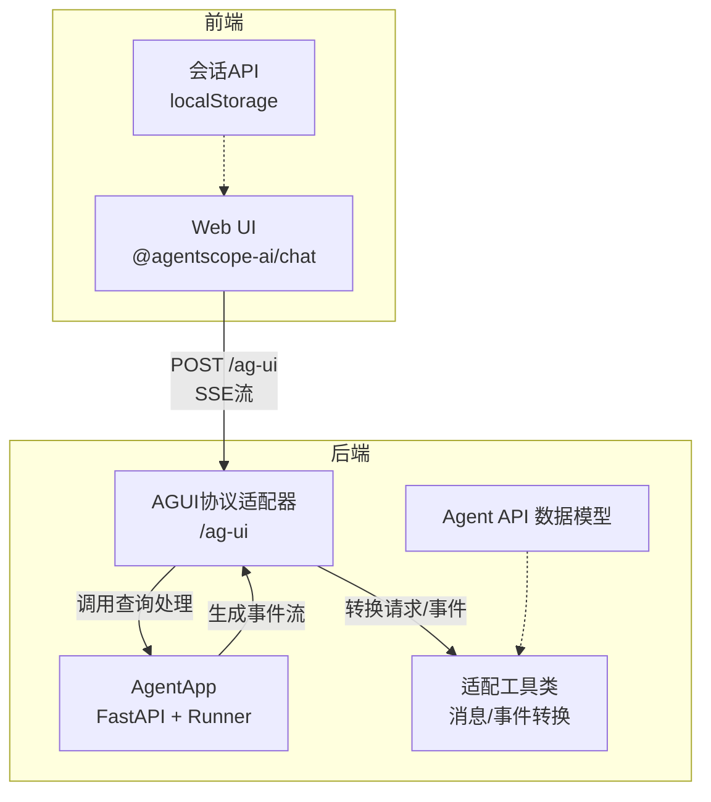
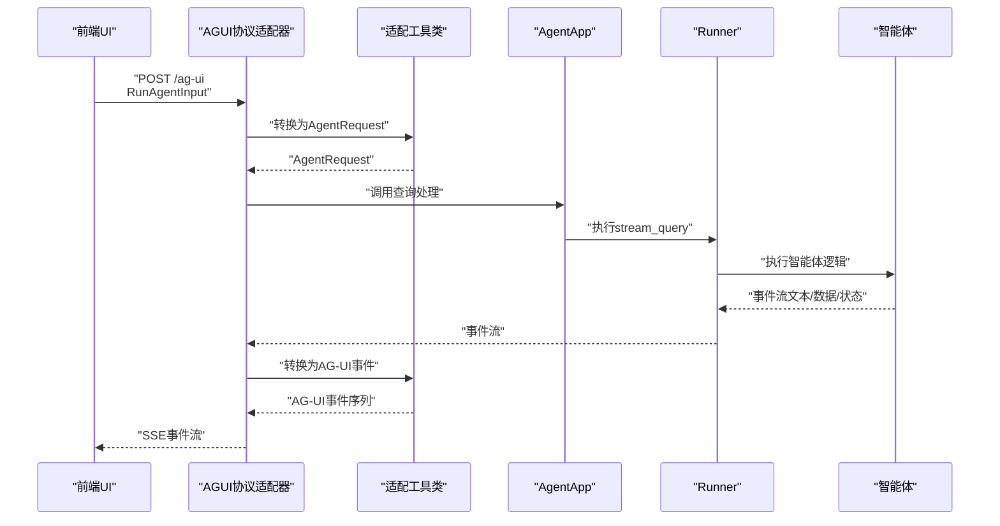
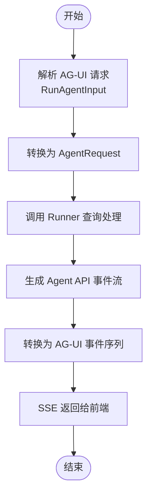
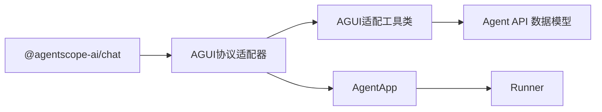

# AgUI集成

<cite>
**本文引用的文件**
- [examples/integrations/ag-ui/agent.py](file://examples/integrations/ag-ui/agent.py)
- [src/agentscope_runtime/engine/deployers/adapter/agui/agui_protocol_adapter.py](file://src/agentscope_runtime/engine/deployers/adapter/agui/agui_protocol_adapter.py)
- [src/agentscope_runtime/engine/deployers/adapter/agui/agui_adapter_utils.py](file://src/agentscope_runtime/engine/deployers/adapter/agui/agui_adapter_utils.py)
- [src/agentscope_runtime/engine/app/agent_app.py](file://src/agentscope_runtime/engine/app/agent_app.py)
- [src/agentscope_runtime/engine/schemas/agent_schemas.py](file://src/agentscope_runtime/engine/schemas/agent_schemas.py)
- [web/starter_webui/src/components/Chat/index.tsx](file://web/starter_webui/src/components/Chat/index.tsx)
- [web/starter_webui/src/components/Chat/sessionApi/index.ts](file://web/starter_webui/src/components/Chat/sessionApi/index.ts)
- [web/starter_webui/package.json](file://web/starter_webui/package.json)
- [tests/integrated/test_agui_integration.py](file://tests/integrated/test_agui_integration.py)
</cite>

## 目录
1. [简介](#简介)
2. [项目结构](#项目结构)
3. [核心组件](#核心组件)
4. [架构总览](#架构总览)
5. [详细组件分析](#详细组件分析)
6. [依赖关系分析](#依赖关系分析)
7. [性能考量](#性能考量)
8. [故障排查指南](#故障排查指南)
9. [结论](#结论)
10. [附录](#附录)

## 简介
本文件面向希望在 AgentScope Runtime 中集成 AgUI 前端界面的开发者，系统性阐述如何将后端 AgentApp 与 AgUI 协议适配器对接，完成从前端到后端智能体的完整消息流与事件流打通。内容涵盖：
- AgUI 集成配置与使用方法
- AgentUI 代理定义与配置要点
- 前端界面与后端智能体的交互机制
- 消息传递与状态同步实现
- UI 组件定制与扩展思路
- 常见问题与解决方案
- 用户体验优化与响应式设计建议

## 项目结构
与 AgUI 集成相关的关键位置如下：
- 后端适配层：位于引擎的 AGUI 协议适配器与工具类中，负责将 AG-UI 请求转换为 Agent API 请求，并将 Agent API 事件转换为 AG-UI 事件。
- 应用入口：AgentApp 在启动时自动注册 AGUI 适配器，暴露 /ag-ui 的 SSE 流式接口。
- 示例代理：examples/integrations/ag-ui/agent.py 展示了如何定义一个可与 AgUI 对接的智能体应用。
- 前端示例：web/starter_webui 提供基于 @agentscope-ai/chat 的 Web UI 示例，演示会话管理、工具渲染等。

图表来源
- [src/agentscope_runtime/engine/app/agent_app.py](file://src/agentscope_runtime/engine/app/agent_app.py)
- [src/agentscope_runtime/engine/deployers/adapter/agui/agui_protocol_adapter.py](file://src/agentscope_runtime/engine/deployers/adapter/agui/agui_protocol_adapter.py)
- [src/agentscope_runtime/engine/deployers/adapter/agui/agui_adapter_utils.py](file://src/agentscope_runtime/engine/deployers/adapter/agui/agui_adapter_utils.py)
- [src/agentscope_runtime/engine/schemas/agent_schemas.py](file://src/agentscope_runtime/engine/schemas/agent_schemas.py)

章节来源
- [src/agentscope_runtime/engine/app/agent_app.py](file://src/agentscope_runtime/engine/app/agent_app.py)
- [src/agentscope_runtime/engine/deployers/adapter/agui/agui_protocol_adapter.py](file://src/agentscope_runtime/engine/deployers/adapter/agui/agui_protocol_adapter.py)
- [src/agentscope_runtime/engine/deployers/adapter/agui/agui_adapter_utils.py](file://src/agentscope_runtime/engine/deployers/adapter/agui/agui_adapter_utils.py)
- [src/agentscope_runtime/engine/schemas/agent_schemas.py](file://src/agentscope_runtime/engine/schemas/agent_schemas.py)

## 核心组件
- AGUI 协议适配器（AGUIDefaultAdapter）
  - 负责接收 AG-UI 的 RunAgentInput 请求，转换为 AgentRequest 并通过 Runner 执行；同时将 Agent API 事件转换为 AG-UI 事件，以 SSE 形式返回。
  - 支持并发请求限制与错误处理。
- AGUI 适配工具类（AGUIAdapterUtils）
  - 负责将 AG-UI 的消息类型与工具参数映射到 Agent API 的消息与工具模型。
  - 将 Agent API 的事件（文本、数据、运行状态）转换为 AG-UI 的事件序列（如 RUN_STARTED、TEXT_MESSAGE_*、TOOL_CALL_*、RUN_FINISHED/ERROR）。
- AgentApp
  - 在生命周期内初始化协议适配器列表，自动注册 AGUI 适配器并暴露 /ag-ui 路由。
  - 通过 Runner 的查询处理函数驱动智能体执行。
- Agent API 数据模型（agent_schemas）
  - 定义 AgentRequest、Message、Content、Tool、FunctionCall 等核心数据结构，支撑前后端协议转换。
- 示例代理（examples/integrations/ag-ui/agent.py）
  - 展示如何创建 AgentApp 并配置 AGUI 路由路径，注册 init/query 处理器，使用 RedisSession 进行会话状态持久化。
- 前端示例（web/starter_webui）
  - 使用 @agentscope-ai/chat 提供的组件，配置会话 API、主题与自定义工具渲染，连接后端 /ag-ui 接口。

章节来源
- [src/agentscope_runtime/engine/deployers/adapter/agui/agui_protocol_adapter.py](file://src/agentscope_runtime/engine/deployers/adapter/agui/agui_protocol_adapter.py)
- [src/agentscope_runtime/engine/deployers/adapter/agui/agui_adapter_utils.py](file://src/agentscope_runtime/engine/deployers/adapter/agui/agui_adapter_utils.py)
- [src/agentscope_runtime/engine/app/agent_app.py](file://src/agentscope_runtime/engine/app/agent_app.py)
- [src/agentscope_runtime/engine/schemas/agent_schemas.py](file://src/agentscope_runtime/engine/schemas/agent_schemas.py)
- [examples/integrations/ag-ui/agent.py](file://examples/integrations/ag-ui/agent.py)
- [web/starter_webui/src/components/Chat/index.tsx](file://web/starter_webui/src/components/Chat/index.tsx)
- [web/starter_webui/src/components/Chat/sessionApi/index.ts](file://web/starter_webui/src/components/Chat/sessionApi/index.ts)
- [web/starter_webui/package.json](file://web/starter_webui/package.json)

## 架构总览
下图展示了从前端 AgUI 到后端 AgentApp 的完整交互链路，以及事件流的转换过程。

图表来源
- [src/agentscope_runtime/engine/deployers/adapter/agui/agui_protocol_adapter.py](file://src/agentscope_runtime/engine/deployers/adapter/agui/agui_protocol_adapter.py)
- [src/agentscope_runtime/engine/deployers/adapter/agui/agui_adapter_utils.py](file://src/agentscope_runtime/engine/deployers/adapter/agui/agui_adapter_utils.py)
- [src/agentscope_runtime/engine/app/agent_app.py](file://src/agentscope_runtime/engine/app/agent_app.py)

## 详细组件分析

### AGUI 协议适配器（AGUIDefaultAdapter）
- 功能职责
  - 注册 /ag-ui 路由，接收 AG-UI 的 RunAgentInput 请求。
  - 通过 AGUIAdapterUtils 将 RunAgentInput 转换为 AgentRequest，交由 Runner 执行。
  - 将 Runner 返回的 Agent API 事件转换为 AG-UI 事件（RUN_STARTED、TEXT_MESSAGE_*、TOOL_CALL_*、RUN_FINISHED/ERROR），以 SSE 形式返回。
  - 内置信号量控制最大并发请求数，异常时返回 HTTP 500。
- 关键点
  - 请求体支持 thread_id/run_id 等字段，兼容 snake_case/camelCase。
  - 默认路由路径可通过 AGUIAdaptorConfig.route_path 配置。
  - 事件转换严格遵循 AG-UI 事件序列，确保前端 UI 正确渲染。

章节来源
- [src/agentscope_runtime/engine/deployers/adapter/agui/agui_protocol_adapter.py](file://src/agentscope_runtime/engine/deployers/adapter/agui/agui_protocol_adapter.py)

### AGUI 适配工具类（AGUIAdapterUtils）
- 功能职责
  - 将 AG-UI 的消息类型（System/User/Assistant/Tool/Activity 等）映射到 Agent API 的 Message 类型与角色。
  - 将 AG-UI 的工具定义（名称、描述、参数 Schema）映射到 Agent API 的 Tool/FunctionTool/FunctionParameters。
  - 将 Agent API 的 Content/Message/AgentResponse 转换为 AG-UI 的事件序列，包括文本增量、工具调用开始/参数/结束/结果等。
- 关键点
  - 文本消息采用增量事件（TEXT_MESSAGE_START/CONTENT/END）保证前端实时渲染。
  - 工具调用事件在 Agent API 层不直接支持流式，因此在适配层一次性发出开始、参数、结束与结果事件。
  - 保持 run/thread 的唯一标识，确保多轮对话与工具调用的正确关联。

章节来源
- [src/agentscope_runtime/engine/deployers/adapter/agui/agui_adapter_utils.py](file://src/agentscope_runtime/engine/deployers/adapter/agui/agui_adapter_utils.py)

### AgentApp 与 AGUI 集成
- 功能职责
  - 在生命周期内初始化协议适配器列表，自动包含 AGUI 适配器。
  - 将 Runner 的查询处理函数注入到各协议适配器，使 /ag-ui 路由可直接调用智能体执行。
  - 提供健康检查、根路径信息等内置路由。
- 关键点
  - AGUI 路由默认为 /ag-ui，可在创建 AgentApp 时传入 AGUIAdaptorConfig 进行配置。
  - 通过统一的 Runner 查询处理，支持多种框架（如 agentscope/langgraph 等）。

章节来源
- [src/agentscope_runtime/engine/app/agent_app.py](file://src/agentscope_runtime/engine/app/agent_app.py)

### Agent API 数据模型
- 功能职责
  - 定义 AgentRequest、Message、Content、Tool、FunctionCall 等核心模型，支撑前后端协议转换。
  - 支持多模态内容（文本、图片、音频、文件等）与工具调用的数据结构。
- 关键点
  - Content 支持 delta 标记，用于区分增量与完整内容。
  - Message 支持不同角色与类型，便于映射到 AG-UI 的消息类型。

章节来源
- [src/agentscope_runtime/engine/schemas/agent_schemas.py](file://src/agentscope_runtime/engine/schemas/agent_schemas.py)

### 示例代理（examples/integrations/ag-ui/agent.py）
- 功能职责
  - 创建 AgentApp 并配置 AGUI 路由路径。
  - 注册 init 处理器，使用 RedisSession 管理会话状态。
  - 注册 query 处理器，构建 ReActAgent，注册工具函数，处理输入消息并流式输出事件。
  - 提供“仅获取未见过的消息”逻辑，避免重复处理历史消息。
- 关键点
  - 使用 stream_printing_messages 将智能体执行过程转换为事件流。
  - 通过 runner.session.load/save_session_state 实现会话状态持久化。

章节来源
- [examples/integrations/ag-ui/agent.py](file://examples/integrations/ag-ui/agent.py)

### 前端示例（web/starter_webui）
- 功能职责
  - 使用 @agentscope-ai/chat 组件搭建聊天界面，提供会话管理、主题配置与工具渲染。
  - 自定义工具渲染组件 Weather，演示如何扩展 UI。
  - 通过本地存储实现会话列表的增删改查。
- 关键点
  - options 中配置 session.api 为自定义 SessionApi，实现与后端的会话交互。
  - customToolRenderConfig 可将特定工具名映射到自定义渲染组件。

章节来源
- [web/starter_webui/src/components/Chat/index.tsx](file://web/starter_webui/src/components/Chat/index.tsx)
- [web/starter_webui/src/components/Chat/sessionApi/index.ts](file://web/starter_webui/src/components/Chat/sessionApi/index.ts)
- [web/starter_webui/package.json](file://web/starter_webui/package.json)

### 事件流与消息传递流程（算法）

图表来源
- [src/agentscope_runtime/engine/deployers/adapter/agui/agui_protocol_adapter.py](file://src/agentscope_runtime/engine/deployers/adapter/agui/agui_protocol_adapter.py)
- [src/agentscope_runtime/engine/deployers/adapter/agui/agui_adapter_utils.py](file://src/agentscope_runtime/engine/deployers/adapter/agui/agui_adapter_utils.py)

## 依赖关系分析
- 组件耦合
  - AGUI 协议适配器依赖 AGUI 适配工具类进行消息与事件转换。
  - AgentApp 作为入口，依赖 Runner 执行智能体逻辑，并将 Runner 注入到协议适配器。
  - Agent API 数据模型为前后端协议转换提供统一的数据契约。
- 外部依赖
  - 前端依赖 @agentscope-ai/chat 提供的 UI 组件与会话能力。
  - 后端依赖 FastAPI 提供路由与 SSE 支持，依赖 RedisSession 进行状态持久化。

图表来源
- [src/agentscope_runtime/engine/deployers/adapter/agui/agui_protocol_adapter.py](file://src/agentscope_runtime/engine/deployers/adapter/agui/agui_protocol_adapter.py)
- [src/agentscope_runtime/engine/deployers/adapter/agui/agui_adapter_utils.py](file://src/agentscope_runtime/engine/deployers/adapter/agui/agui_adapter_utils.py)
- [src/agentscope_runtime/engine/app/agent_app.py](file://src/agentscope_runtime/engine/app/agent_app.py)
- [src/agentscope_runtime/engine/schemas/agent_schemas.py](file://src/agentscope_runtime/engine/schemas/agent_schemas.py)
- [web/starter_webui/package.json](file://web/starter_webui/package.json)

章节来源
- [src/agentscope_runtime/engine/deployers/adapter/agui/agui_protocol_adapter.py](file://src/agentscope_runtime/engine/deployers/adapter/agui/agui_protocol_adapter.py)
- [src/agentscope_runtime/engine/deployers/adapter/agui/agui_adapter_utils.py](file://src/agentscope_runtime/engine/deployers/adapter/agui/agui_adapter_utils.py)
- [src/agentscope_runtime/engine/app/agent_app.py](file://src/agentscope_runtime/engine/app/agent_app.py)
- [src/agentscope_runtime/engine/schemas/agent_schemas.py](file://src/agentscope_runtime/engine/schemas/agent_schemas.py)
- [web/starter_webui/package.json](file://web/starter_webui/package.json)

## 性能考量
- 并发控制
  - AGUI 协议适配器内置信号量，默认限制最大并发请求数，防止资源耗尽。可通过构造参数调整。
- 流式传输
  - 使用 SSE 实时推送事件，减少前端轮询开销，提升交互流畅度。
- 事件粒度
  - 文本采用增量事件，工具调用事件在 Agent API 层一次性发出，避免前端等待时间过长。
- 会话状态
  - 使用 RedisSession 进行状态持久化，建议在生产环境使用真实 Redis 实例而非测试用 FakeRedis。

章节来源
- [src/agentscope_runtime/engine/deployers/adapter/agui/agui_protocol_adapter.py](file://src/agentscope_runtime/engine/deployers/adapter/agui/agui_protocol_adapter.py)
- [examples/integrations/ag-ui/agent.py](file://examples/integrations/ag-ui/agent.py)

## 故障排查指南
- 常见问题
  - 前端无法连接后端 /ag-ui
    - 检查后端是否成功注册 /ag-ui 路由；确认网络连通与 CORS 设置。
  - SSE 事件缺失或顺序异常
    - 确认 AGUIAdapterUtils 是否正确生成 RUN_STARTED/TEXT_MESSAGE_* 等事件；检查 Runner 是否按序产生事件。
  - 工具调用未触发
    - 确认前端传入的工具定义是否被正确转换为 Agent API 的 Tool；检查智能体是否实际调用工具。
  - 会话状态未保存
    - 确认 RedisSession 初始化与 load/save 调用是否正确；生产环境需替换为真实 Redis。
- 调试建议
  - 使用测试用例模拟 AG-UI 请求，验证事件序列与工具调用行为。
  - 查看后端日志，定位请求处理与事件转换阶段的问题。

章节来源
- [tests/integrated/test_agui_integration.py](file://tests/integrated/test_agui_integration.py)
- [src/agentscope_runtime/engine/deployers/adapter/agui/agui_protocol_adapter.py](file://src/agentscope_runtime/engine/deployers/adapter/agui/agui_protocol_adapter.py)
- [src/agentscope_runtime/engine/deployers/adapter/agui/agui_adapter_utils.py](file://src/agentscope_runtime/engine/deployers/adapter/agui/agui_adapter_utils.py)
- [examples/integrations/ag-ui/agent.py](file://examples/integrations/ag-ui/agent.py)

## 结论
通过 AGUI 协议适配器与适配工具类，AgentScope Runtime 能够与 AgUI 前端形成稳定的双向事件流，实现从消息输入到工具调用再到状态反馈的完整闭环。配合示例代理与前端 UI，开发者可以快速搭建具备良好用户体验的智能体应用。在生产环境中，建议完善并发控制、状态持久化与监控告警，以保障稳定性与可维护性。

## 附录
- 快速开始步骤
  - 后端
    - 创建 AgentApp 并配置 AGUI 路由路径。
    - 注册 init/query 处理器，使用 RedisSession 管理会话。
    - 启动服务，访问 /ag-ui 获取 SSE 事件流。
  - 前端
    - 引入 @agentscope-ai/chat 组件，配置会话 API 与主题。
    - 自定义工具渲染组件，扩展 UI 能力。
  - 验证
    - 使用测试用例或 Postman 发送 RunAgentInput 请求，观察事件序列与工具调用结果。

章节来源
- [examples/integrations/ag-ui/agent.py](file://examples/integrations/ag-ui/agent.py)
- [web/starter_webui/src/components/Chat/index.tsx](file://web/starter_webui/src/components/Chat/index.tsx)
- [web/starter_webui/src/components/Chat/sessionApi/index.ts](file://web/starter_webui/src/components/Chat/sessionApi/index.ts)
- [tests/integrated/test_agui_integration.py](file://tests/integrated/test_agui_integration.py)