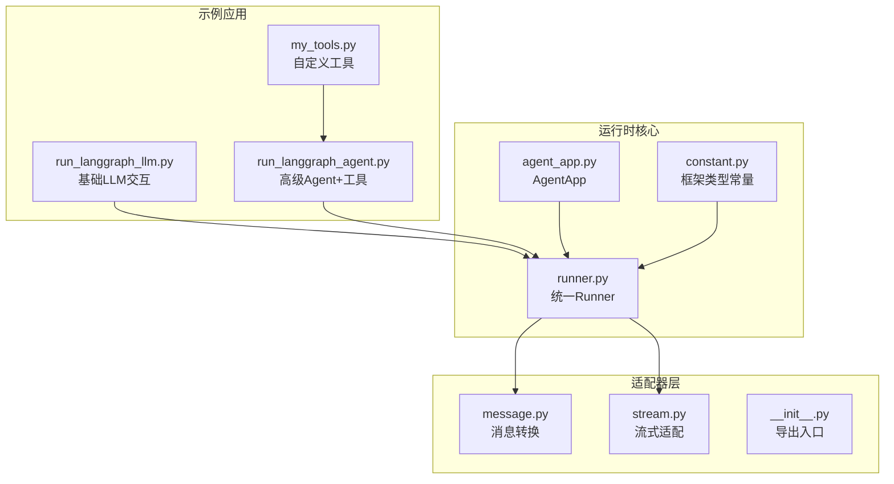
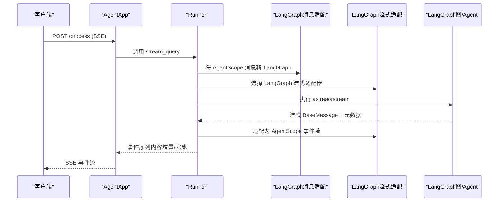
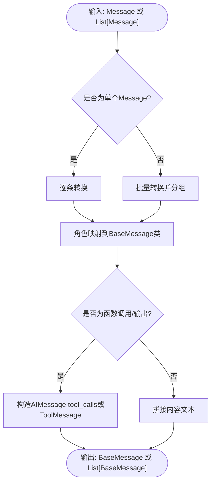
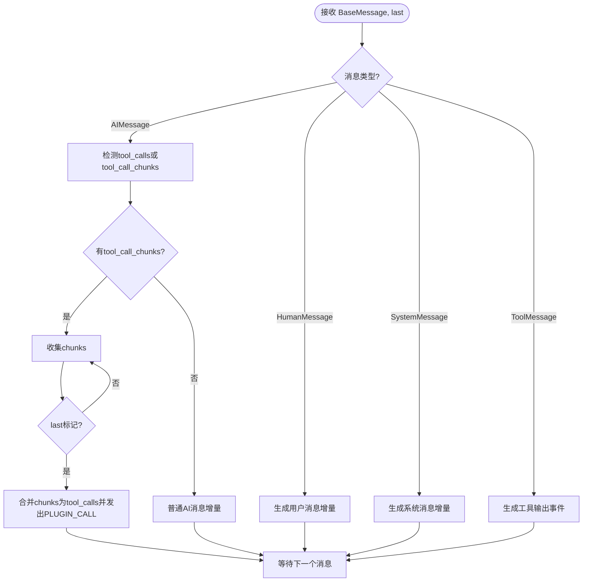
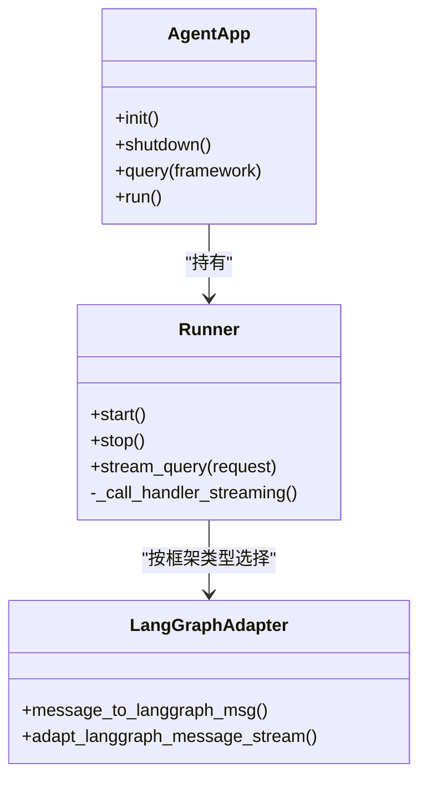
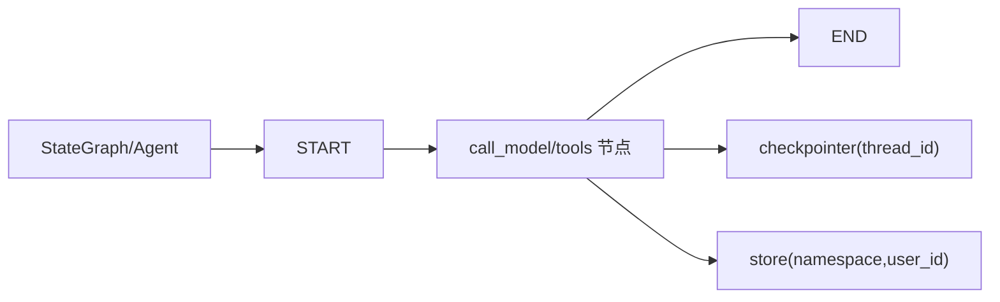
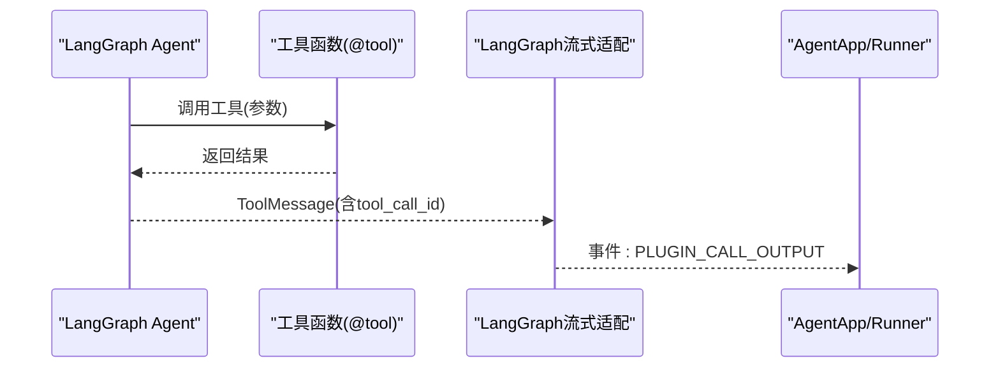
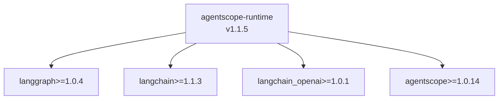

# LangGraph集成

<cite>
**本文引用的文件**
- [README.md](file://examples/integrations/langgraph/README.md)
- [run_langgraph_agent.py](file://examples/integrations/langgraph/run_langgraph_agent.py)
- [run_langgraph_llm.py](file://examples/integrations/langgraph/run_langgraph_llm.py)
- [my_tools.py](file://examples/integrations/langgraph/my_tools.py)
- [__init__.py](file://src/agentscope_runtime/adapters/langgraph/__init__.py)
- [message.py](file://src/agentscope_runtime/adapters/langgraph/message.py)
- [stream.py](file://src/agentscope_runtime/adapters/langgraph/stream.py)
- [agent_app.py](file://src/agentscope_runtime/engine/app/agent_app.py)
- [runner.py](file://src/agentscope_runtime/engine/runner.py)
- [constant.py](file://src/agentscope_runtime/engine/constant.py)
- [test_langgraph_agent_app.py](file://tests/integrated/test_langgraph_agent_app.py)
- [pyproject.toml](file://pyproject.toml)
- [version.py](file://src/agentscope_runtime/version.py)
</cite>

## 目录
1. [简介](#简介)
2. [项目结构](#项目结构)
3. [核心组件](#核心组件)
4. [架构总览](#架构总览)
5. [详细组件分析](#详细组件分析)
6. [依赖分析](#依赖分析)
7. [性能考虑](#性能考虑)
8. [故障排查指南](#故障排查指南)
9. [结论](#结论)
10. [附录](#附录)

## 简介
本文件面向希望在 AgentScope Runtime 中集成 LangGraph 的开发者，系统性讲解如何将 LangGraph 的图式工作流与 AgentScope 的统一适配层结合，完成从消息格式转换、工具函数集成、到运行时流式输出的完整链路。文档覆盖：
- 适配器配置与使用方法
- 智能体定义与 LangGraph 节点映射
- 工具函数的定义与调用方式
- 数据格式转换与消息传递机制
- 错误处理与调试技巧
- 性能优化建议与最佳实践

## 项目结构
LangGraph 集成示例位于 examples/integrations/langgraph 目录，核心文件包括：
- 基础LLM交互示例：run_langgraph_llm.py
- 高级带工具示例：run_langgraph_agent.py
- 自定义工具集合：my_tools.py
- LangGraph 适配器：src/agentscope_runtime/adapters/langgraph/

图表来源
- [run_langgraph_llm.py:1-118](file://examples/integrations/langgraph/run_langgraph_llm.py#L1-L118)
- [run_langgraph_agent.py:1-172](file://examples/integrations/langgraph/run_langgraph_agent.py#L1-L172)
- [my_tools.py:1-325](file://examples/integrations/langgraph/my_tools.py#L1-L325)
- [message.py:1-163](file://src/agentscope_runtime/adapters/langgraph/message.py#L1-L163)
- [stream.py:1-257](file://src/agentscope_runtime/adapters/langgraph/stream.py#L1-L257)
- [agent_app.py:60-220](file://src/agentscope_runtime/engine/app/agent_app.py#L60-L220)
- [runner.py:46-356](file://src/agentscope_runtime/engine/runner.py#L46-L356)
- [constant.py:1-10](file://src/agentscope_runtime/engine/constant.py#L1-L10)

章节来源
- [README.md:1-136](file://examples/integrations/langgraph/README.md#L1-L136)
- [run_langgraph_llm.py:1-118](file://examples/integrations/langgraph/run_langgraph_llm.py#L1-L118)
- [run_langgraph_agent.py:1-172](file://examples/integrations/langgraph/run_langgraph_agent.py#L1-L172)
- [my_tools.py:1-325](file://examples/integrations/langgraph/my_tools.py#L1-L325)
- [message.py:1-163](file://src/agentscope_runtime/adapters/langgraph/message.py#L1-L163)
- [stream.py:1-257](file://src/agentscope_runtime/adapters/langgraph/stream.py#L1-L257)
- [agent_app.py:60-220](file://src/agentscope_runtime/engine/app/agent_app.py#L60-L220)
- [runner.py:46-356](file://src/agentscope_runtime/engine/runner.py#L46-L356)
- [constant.py:1-10](file://src/agentscope_runtime/engine/constant.py#L1-L10)

## 核心组件
- AgentApp：基于 FastAPI 的服务容器，负责注册端点、生命周期管理与协议适配。
- Runner：统一的查询执行器，根据框架类型选择对应的消息转换与流式适配器。
- LangGraph 适配器：负责将 AgentScope 的消息格式转换为 LangGraph 的 BaseMessage，以及将 LangGraph 流式输出转换回 AgentScope 的事件流。
- 示例应用：run_langgraph_llm.py 展示 StateGraph + 单节点；run_langgraph_agent.py 展示带工具与长短期记忆。

章节来源
- [agent_app.py:60-220](file://src/agentscope_runtime/engine/app/agent_app.py#L60-L220)
- [runner.py:200-356](file://src/agentscope_runtime/engine/runner.py#L200-L356)
- [message.py:23-163](file://src/agentscope_runtime/adapters/langgraph/message.py#L23-L163)
- [stream.py:28-257](file://src/agentscope_runtime/adapters/langgraph/stream.py#L28-L257)
- [run_langgraph_llm.py:40-76](file://examples/integrations/langgraph/run_langgraph_llm.py#L40-L76)
- [run_langgraph_agent.py:59-107](file://examples/integrations/langgraph/run_langgraph_agent.py#L59-L107)

## 架构总览
下图展示了从客户端请求到 LangGraph 执行再到流式响应的全链路：

图表来源
- [agent_app.py:60-220](file://src/agentscope_runtime/engine/app/agent_app.py#L60-L220)
- [runner.py:200-356](file://src/agentscope_runtime/engine/runner.py#L200-L356)
- [message.py:23-163](file://src/agentscope_runtime/adapters/langgraph/message.py#L23-L163)
- [stream.py:28-257](file://src/agentscope_runtime/adapters/langgraph/stream.py#L28-L257)
- [run_langgraph_llm.py:67-75](file://examples/integrations/langgraph/run_langgraph_llm.py#L67-L75)
- [run_langgraph_agent.py:90-106](file://examples/integrations/langgraph/run_langgraph_agent.py#L90-L106)

## 详细组件分析

### 组件A：LangGraph消息格式转换
- 功能要点
  - 将 AgentScope 的 Message 列表转换为 LangGraph 的 BaseMessage 列表
  - 支持角色映射（user→HumanMessage、assistant→AIMessage、system→SystemMessage、tool→ToolMessage）
  - 特殊类型处理：PLUGIN_CALL/PLUGIN_CALL_OUTPUT → AIMessage.tool_calls 或 ToolMessage
  - 可选自定义转换器 type_converters，按 message.type 分派
  - 对 ToolMessage 需要 tool_call_id，从 metadata 提取

图表来源
- [message.py:23-163](file://src/agentscope_runtime/adapters/langgraph/message.py#L23-L163)

章节来源
- [message.py:23-163](file://src/agentscope_runtime/adapters/langgraph/message.py#L23-L163)

### 组件B：LangGraph流式适配
- 功能要点
  - 接收 LangGraph 的异步流式 BaseMessage 迭代器
  - 识别工具调用开始/结束（tool_call_chunks），聚合后生成 PLUGIN_CALL 事件
  - 正常消息按文本增量输出，最后发出 completed
  - ToolMessage 映射为 PLUGIN_CALL_OUTPUT 事件
  - 维护消息ID与索引，确保增量内容有序

图表来源
- [stream.py:28-257](file://src/agentscope_runtime/adapters/langgraph/stream.py#L28-L257)

章节来源
- [stream.py:28-257](file://src/agentscope_runtime/adapters/langgraph/stream.py#L28-L257)

### 组件C：AgentApp与Runner的框架适配
- AgentApp.query(framework="langgraph")
  - 注册查询处理器并设置框架类型为 "langgraph"
  - 内部构建 Runner 并添加路由
- Runner.stream_query
  - 根据 framework_type 选择适配器
  - 对 langgraph：加载 message_to_langgraph_msg 与 adapt_langgraph_message_stream
  - 将 AgentRequest.input 转换为 msgs 后交由框架处理
  - 逐事件产出并合并到 AgentResponse

图表来源
- [agent_app.py:60-220](file://src/agentscope_runtime/engine/app/agent_app.py#L60-L220)
- [runner.py:200-356](file://src/agentscope_runtime/engine/runner.py#L200-L356)
- [message.py:23-163](file://src/agentscope_runtime/adapters/langgraph/message.py#L23-L163)
- [stream.py:28-257](file://src/agentscope_runtime/adapters/langgraph/stream.py#L28-L257)

章节来源
- [agent_app.py:722-740](file://src/agentscope_runtime/engine/app/agent_app.py#L722-L740)
- [runner.py:200-356](file://src/agentscope_runtime/engine/runner.py#L200-L356)
- [constant.py:1-10](file://src/agentscope_runtime/engine/constant.py#L1-L10)

### 组件D：LangGraph节点与AgentScope智能体映射
- 基础LLM示例（run_langgraph_llm.py）
  - 使用 StateGraph + START → call_model → END 的简单流程
  - call_model 节点直接调用 LLM，返回新的消息列表
  - 通过 thread_id 实现会话隔离
- 高级Agent示例（run_langgraph_agent.py）
  - 使用 create_agent(llm, tools, checkpointer, store, state_schema)
  - 自定义 CustomAgentState，扩展 user_id/session_id 字段
  - 工具调用触发 tools 节点，可持久化到长短期记忆

图表来源
- [run_langgraph_llm.py:62-65](file://examples/integrations/langgraph/run_langgraph_llm.py#L62-L65)
- [run_langgraph_agent.py:36-89](file://examples/integrations/langgraph/run_langgraph_agent.py#L36-L89)

章节来源
- [run_langgraph_llm.py:40-76](file://examples/integrations/langgraph/run_langgraph_llm.py#L40-L76)
- [run_langgraph_agent.py:59-107](file://examples/integrations/langgraph/run_langgraph_agent.py#L59-L107)

### 组件E：工具函数定义与调用
- 工具定义
  - 使用 @tool 装饰器声明工具函数
  - my_tools.py 提供文件读写、计划更新、网络搜索等工具
- 工具调用流程
  - LangGraph Agent 在推理中决定调用哪些工具
  - 工具执行后返回结果，LangGraph 适配器将其转换为 PLUGIN_CALL_OUTPUT 事件
  - 长期记忆可存储最近一次工具调用信息

图表来源
- [my_tools.py:76-115](file://examples/integrations/langgraph/my_tools.py#L76-L115)
- [run_langgraph_agent.py:98-106](file://examples/integrations/langgraph/run_langgraph_agent.py#L98-L106)
- [stream.py:198-229](file://src/agentscope_runtime/adapters/langgraph/stream.py#L198-L229)

章节来源
- [my_tools.py:76-325](file://examples/integrations/langgraph/my_tools.py#L76-L325)
- [run_langgraph_agent.py:98-106](file://examples/integrations/langgraph/run_langgraph_agent.py#L98-L106)
- [stream.py:198-229](file://src/agentscope_runtime/adapters/langgraph/stream.py#L198-L229)

### 组件F：数据格式转换与消息传递机制
- 请求输入
  - AgentRequest.input 为 Message 列表
  - Runner 在 langgraph 框架下，先通过 message_to_langgraph_msg 转换为 BaseMessage
- 流式输出
  - LangGraph 以 async 迭代器产生 BaseMessage + 元数据
  - adapt_langgraph_message_stream 将其转换为 AgentScope 的事件流（内容增量/完成/工具调用）
- 会话与线程
  - 通过 config 中的 thread_id 实现多轮对话隔离
  - checkpointer/store 用于状态持久化

章节来源
- [runner.py:265-279](file://src/agentscope_runtime/engine/runner.py#L265-L279)
- [message.py:23-163](file://src/agentscope_runtime/adapters/langgraph/message.py#L23-L163)
- [stream.py:28-257](file://src/agentscope_runtime/adapters/langgraph/stream.py#L28-L257)
- [run_langgraph_llm.py:67-75](file://examples/integrations/langgraph/run_langgraph_llm.py#L67-L75)
- [run_langgraph_agent.py:90-106](file://examples/integrations/langgraph/run_langgraph_agent.py#L90-L106)

## 依赖分析
- LangGraph 集成依赖
  - langgraph>=1.0.4
  - langchain>=1.1.3
  - langchain_openai>=1.0.1
- AgentScope Runtime
  - 通过 optional-dependencies 的 ext 分组提供 LangGraph 支持
  - 运行时版本 v1.1.5

图表来源
- [pyproject.toml:68-99](file://pyproject.toml#L68-L99)
- [version.py:1-3](file://src/agentscope_runtime/version.py#L1-L3)

章节来源
- [pyproject.toml:68-99](file://pyproject.toml#L68-L99)
- [version.py:1-3](file://src/agentscope_runtime/version.py#L1-L3)

## 性能考虑
- 流式传输
  - 使用 SSE 流式输出，减少延迟，提升用户体验
- 工具调用批处理
  - 对于连续的 tool_call_chunks，先聚合再发出 PLUGIN_CALL，降低事件风暴
- 状态检查点
  - 使用 InMemorySaver/InMemoryStore 适合演示；生产环境建议替换为持久化后端
- 并发与超时
  - LangGraph 请求可设置超时；网络请求（如 IQS）需设置合理超时与重试
- 日志与追踪
  - 适配器内使用日志记录关键路径，便于定位性能瓶颈

## 故障排查指南
- 常见错误
  - 未设置 DASHSCOPE_API_KEY：导致 LLM 调用失败
  - IQS_API_KEY 未设置：网络搜索工具不可用
  - 端口占用：示例默认端口 8090/8091，需调整避免冲突
- 调试技巧
  - 启用详细日志：适配器内部使用 logging，观察消息类型与转换过程
  - 使用 /api/memory/short-term/{session_id} 与 /api/memory/long-term/{user_id} 查看内存状态
  - 通过 /process 端点直接发送请求，观察 SSE 事件结构
- 单元测试参考
  - 测试文件验证了 /process 的流式输出、多轮对话与内存接口可用性

章节来源
- [README.md:56-93](file://examples/integrations/langgraph/README.md#L56-L93)
- [run_langgraph_agent.py:109-167](file://examples/integrations/langgraph/run_langgraph_agent.py#L109-L167)
- [test_langgraph_agent_app.py:142-281](file://tests/integrated/test_langgraph_agent_app.py#L142-L281)

## 结论
通过 LangGraph 适配器与 AgentScope Runner 的协作，可以在不改变业务逻辑的前提下，将 LangGraph 的图式工作流无缝接入 AgentScope Runtime。消息格式转换与流式适配保证了跨框架的一致体验，而工具与内存接口则提供了强大的扩展能力。建议在生产环境中采用持久化存储、完善的超时与重试策略，并结合监控与日志进行持续优化。

## 附录

### 快速开始：LangGraph集成示例
- 基础LLM交互
  - 运行命令：python examples/langgraph/run_langgraph_llm.py
  - 交互接口：POST /process（SSE）
- 高级Agent+工具
  - 运行命令：python examples/langgraph/run_langgraph_agent.py
  - 交互接口：POST /process（SSE）
  - 内存接口：
    - GET /api/memory/short-term/{session_id}
    - GET /api/memory/short-term
    - GET /api/memory/long-term/{user_id}

章节来源
- [README.md:65-93](file://examples/integrations/langgraph/README.md#L65-L93)
- [run_langgraph_llm.py:116-118](file://examples/integrations/langgraph/run_langgraph_llm.py#L116-L118)
- [run_langgraph_agent.py:170-172](file://examples/integrations/langgraph/run_langgraph_agent.py#L170-L172)