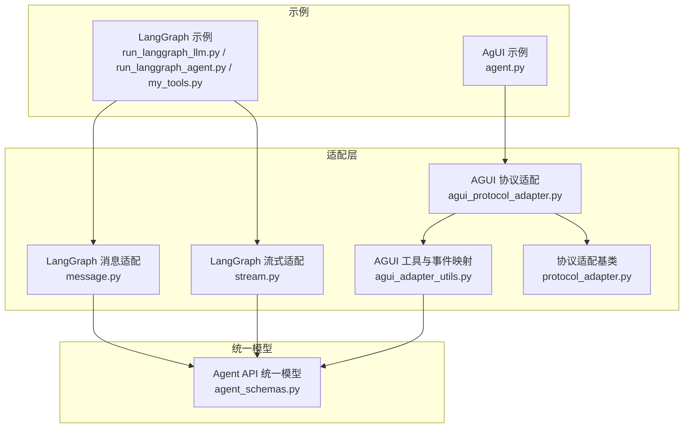
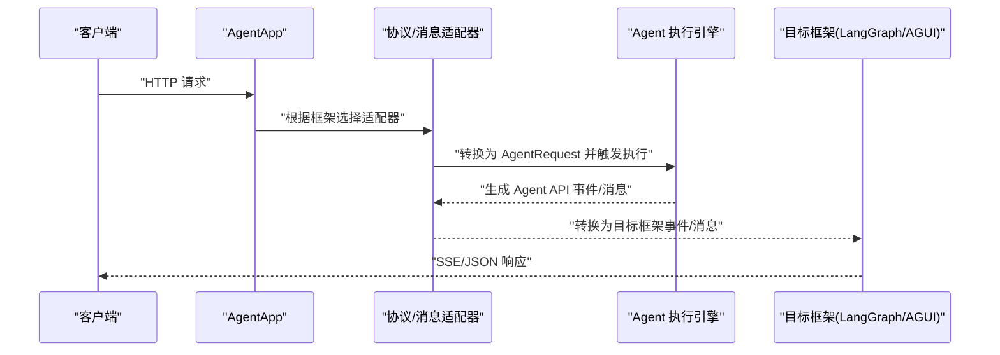
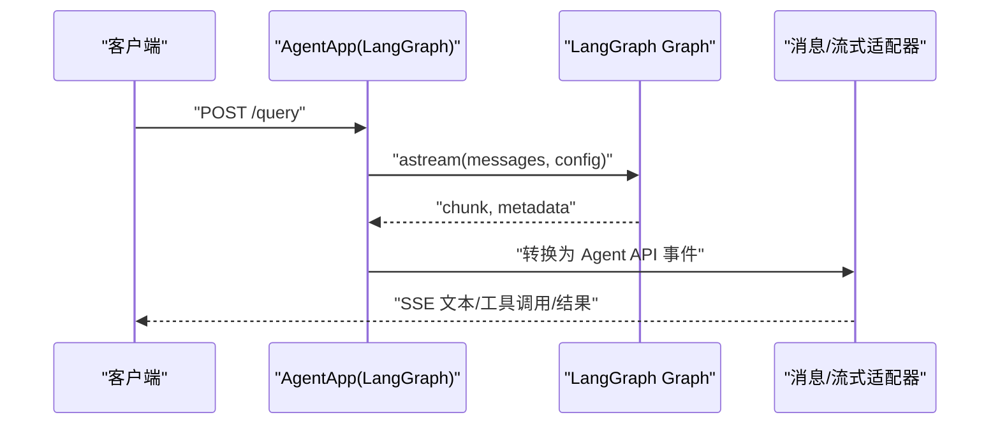
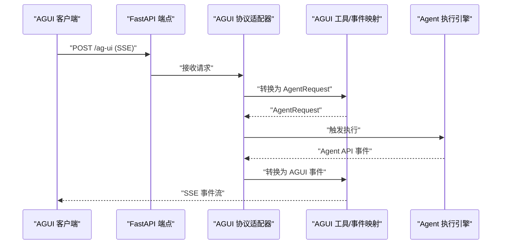
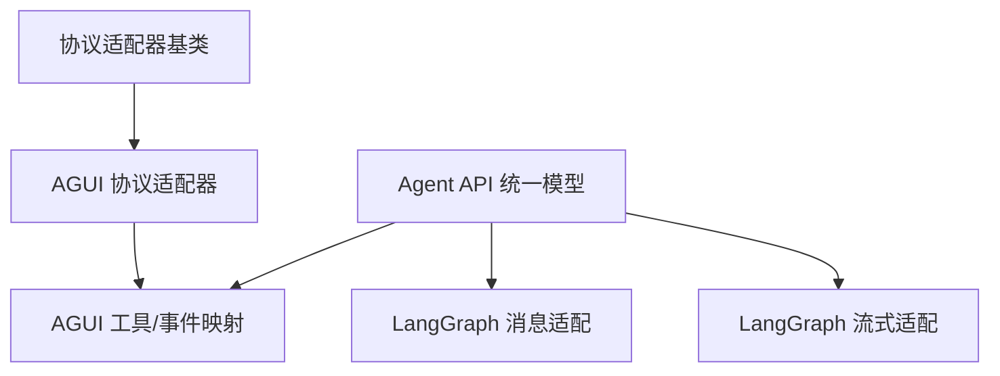

# 集成示例

<cite>
**本文引用的文件**
- [README.md](file://README.md)
- [examples/integrations/langgraph/README.md](file://examples/integrations/langgraph/README.md)
- [examples/integrations/langgraph/run_langgraph_llm.py](file://examples/integrations/langgraph/run_langgraph_llm.py)
- [examples/integrations/langgraph/run_langgraph_agent.py](file://examples/integrations/langgraph/run_langgraph_agent.py)
- [examples/integrations/langgraph/my_tools.py](file://examples/integrations/langgraph/my_tools.py)
- [examples/integrations/ag-ui/agent.py](file://examples/integrations/ag-ui/agent.py)
- [src/agentscope_runtime/adapters/langgraph/message.py](file://src/agentscope_runtime/adapters/langgraph/message.py)
- [src/agentscope_runtime/adapters/langgraph/stream.py](file://src/agentscope_runtime/adapters/langgraph/stream.py)
- [src/agentscope_runtime/engine/deployers/adapter/agui/agui_protocol_adapter.py](file://src/agentscope_runtime/engine/deployers/adapter/agui/agui_protocol_adapter.py)
- [src/agentscope_runtime/engine/deployers/adapter/agui/agui_adapter_utils.py](file://src/agentscope_runtime/engine/deployers/adapter/agui/agui_adapter_utils.py)
- [src/agentscope_runtime/engine/deployers/adapter/protocol_adapter.py](file://src/agentscope_runtime/engine/deployers/adapter/protocol_adapter.py)
- [src/agentscope_runtime/engine/schemas/agent_schemas.py](file://src/agentscope_runtime/engine/schemas/agent_schemas.py)
</cite>

## 目录
1. [简介](#简介)
2. [项目结构](#项目结构)
3. [核心组件](#核心组件)
4. [架构总览](#架构总览)
5. [详细组件分析](#详细组件分析)
6. [依赖关系分析](#依赖关系分析)
7. [性能考虑](#性能考虑)
8. [故障排查指南](#故障排查指南)
9. [结论](#结论)
10. [附录](#附录)

## 简介
本文件面向希望在 AgentScope Runtime 中集成第三方框架（如 LangGraph、AgUI）的开发者，提供从适配器模式到端到端工作流的完整集成指南。内容涵盖：
- 与 LangGraph 的消息与流式输出适配
- 与 AgUI 的协议适配与 SSE 流式事件转换
- 数据格式转换与协议适配的关键点
- 多框架协作的推荐工作流
- 常见问题与解决方案
- 性能优化与资源管理最佳实践

## 项目结构
本仓库采用按功能域划分的目录组织方式，与集成示例相关的目录包括：
- examples/integrations：第三方框架集成示例
- src/agentscope_runtime/adapters：跨框架的消息与流式适配器
- src/agentscope_runtime/engine/deployers/adapter：协议适配器（含 AGUI）
- src/agentscope_runtime/engine/schemas：统一的 Agent API 消息与事件模型

图表来源
- [examples/integrations/langgraph/run_langgraph_llm.py:1-118](file://examples/integrations/langgraph/run_langgraph_llm.py#L1-L118)
- [examples/integrations/langgraph/run_langgraph_agent.py:1-172](file://examples/integrations/langgraph/run_langgraph_agent.py#L1-L172)
- [examples/integrations/ag-ui/agent.py:1-156](file://examples/integrations/ag-ui/agent.py#L1-L156)
- [src/agentscope_runtime/adapters/langgraph/message.py:1-163](file://src/agentscope_runtime/adapters/langgraph/message.py#L1-L163)
- [src/agentscope_runtime/adapters/langgraph/stream.py:1-257](file://src/agentscope_runtime/adapters/langgraph/stream.py#L1-L257)
- [src/agentscope_runtime/engine/deployers/adapter/agui/agui_protocol_adapter.py:1-226](file://src/agentscope_runtime/engine/deployers/adapter/agui/agui_protocol_adapter.py#L1-L226)
- [src/agentscope_runtime/engine/deployers/adapter/agui/agui_adapter_utils.py:1-658](file://src/agentscope_runtime/engine/deployers/adapter/agui/agui_adapter_utils.py#L1-L658)
- [src/agentscope_runtime/engine/deployers/adapter/protocol_adapter.py:1-25](file://src/agentscope_runtime/engine/deployers/adapter/protocol_adapter.py#L1-L25)
- [src/agentscope_runtime/engine/schemas/agent_schemas.py:1-800](file://src/agentscope_runtime/engine/schemas/agent_schemas.py#L1-L800)

章节来源
- [README.md](file://README.md)
- [examples/integrations/langgraph/README.md:1-136](file://examples/integrations/langgraph/README.md#L1-L136)

## 核心组件
- Agent API 统一模型：定义消息类型、内容类型、工具调用、事件状态等，作为跨框架适配的“契约”。
- LangGraph 适配器：负责将 Agent API 的消息转换为 LangGraph 的消息对象，并将 LangGraph 的流式输出转换回 Agent API 的增量事件。
- AGUI 协议适配器：将 Agent API 的事件转换为 AGUI 的 SSE 事件，支持并发请求控制与运行生命周期事件。
- AGUI 工具与事件映射：负责将 AGUI 请求体转换为 Agent API 的 AgentRequest，并将 Agent API 的内容/消息/响应事件映射为 AGUI 的文本消息、工具调用、结果等事件。

章节来源
- [src/agentscope_runtime/engine/schemas/agent_schemas.py:18-800](file://src/agentscope_runtime/engine/schemas/agent_schemas.py#L18-L800)
- [src/agentscope_runtime/adapters/langgraph/message.py:23-163](file://src/agentscope_runtime/adapters/langgraph/message.py#L23-L163)
- [src/agentscope_runtime/adapters/langgraph/stream.py:28-257](file://src/agentscope_runtime/adapters/langgraph/stream.py#L28-L257)
- [src/agentscope_runtime/engine/deployers/adapter/agui/agui_protocol_adapter.py:91-226](file://src/agentscope_runtime/engine/deployers/adapter/agui/agui_protocol_adapter.py#L91-L226)
- [src/agentscope_runtime/engine/deployers/adapter/agui/agui_adapter_utils.py:247-658](file://src/agentscope_runtime/engine/deployers/adapter/agui/agui_adapter_utils.py#L247-L658)

## 架构总览
下图展示了 AgentScope Runtime 在集成 LangGraph 与 AGUI 时的整体交互路径：请求进入后经由协议适配器或消息适配器转换为统一的 Agent API 模型，再由 AgentApp 执行，最终通过适配器将执行结果以目标框架期望的格式返回。

图表来源
- [src/agentscope_runtime/engine/deployers/adapter/protocol_adapter.py:6-25](file://src/agentscope_runtime/engine/deployers/adapter/protocol_adapter.py#L6-L25)
- [src/agentscope_runtime/engine/schemas/agent_schemas.py:751-800](file://src/agentscope_runtime/engine/schemas/agent_schemas.py#L751-L800)
- [src/agentscope_runtime/adapters/langgraph/message.py:23-163](file://src/agentscope_runtime/adapters/langgraph/message.py#L23-L163)
- [src/agentscope_runtime/adapters/langgraph/stream.py:28-257](file://src/agentscope_runtime/adapters/langgraph/stream.py#L28-L257)
- [src/agentscope_runtime/engine/deployers/adapter/agui/agui_protocol_adapter.py:108-226](file://src/agentscope_runtime/engine/deployers/adapter/agui/agui_protocol_adapter.py#L108-L226)

## 详细组件分析

### LangGraph 集成
LangGraph 集成包含两条主线：LLM 基础交互与带工具的高级代理；同时提供内存与检查点能力，便于会话状态持久化。

- 基础 LLM 交互
  - 使用 StateGraph 定义单节点工作流，调用兼容 DashScope 的 Qwen 模型，支持流式输出与内存查询接口。
  - 关键点：通过 AgentApp 的 query 装饰器接入框架；使用 LangGraph 的 astream 输出与 chunk_position 判断是否为最后片段。

- 高级代理（带工具）
  - 自定义 AgentState，扩展 user_id 与 session_id 字段；注册自定义工具（文件读写、网络搜索等）；使用 InMemorySaver 与 InMemoryStore 实现短期与长期记忆。
  - 关键点：工具调用结果可写入长期存储；提供短期/长期内存查询 API。

- 消息与流式适配
  - 将 Agent API 的消息转换为 LangGraph 的 Human/AI/System/ToolMessage；将 LangGraph 的流式输出转换为 Agent API 的增量内容与完成事件。

图表来源
- [examples/integrations/langgraph/run_langgraph_llm.py:40-76](file://examples/integrations/langgraph/run_langgraph_llm.py#L40-L76)
- [examples/integrations/langgraph/run_langgraph_agent.py:59-107](file://examples/integrations/langgraph/run_langgraph_agent.py#L59-L107)
- [src/agentscope_runtime/adapters/langgraph/message.py:23-163](file://src/agentscope_runtime/adapters/langgraph/message.py#L23-L163)
- [src/agentscope_runtime/adapters/langgraph/stream.py:28-257](file://src/agentscope_runtime/adapters/langgraph/stream.py#L28-L257)

章节来源
- [examples/integrations/langgraph/README.md:1-136](file://examples/integrations/langgraph/README.md#L1-L136)
- [examples/integrations/langgraph/run_langgraph_llm.py:1-118](file://examples/integrations/langgraph/run_langgraph_llm.py#L1-L118)
- [examples/integrations/langgraph/run_langgraph_agent.py:1-172](file://examples/integrations/langgraph/run_langgraph_agent.py#L1-L172)
- [examples/integrations/langgraph/my_tools.py:1-325](file://examples/integrations/langgraph/my_tools.py#L1-L325)
- [src/agentscope_runtime/adapters/langgraph/message.py:1-163](file://src/agentscope_runtime/adapters/langgraph/message.py#L1-L163)
- [src/agentscope_runtime/adapters/langgraph/stream.py:1-257](file://src/agentscope_runtime/adapters/langgraph/stream.py#L1-L257)

### AGUI 集成
AGUI 集成通过 AGUI 协议适配器将 AGUI 的请求体转换为 Agent API 的 AgentRequest，并将 Agent API 的事件转换为 AGUI 的 SSE 事件，实现端到端的流式交互。

- 协议适配器
  - 支持自定义路由路径；基于 FastAPI 添加 POST 端点；使用信号量限制并发请求数；将 Agent API 事件转换为 AGUI 的 RunStarted/Text/Tool/RunFinished/RunError 等事件。
  - 提供 FlexibleRunAgentInput 以放宽字段约束，兼容 snake_case/camelCase。

- 工具与事件映射
  - 将 AGUI 的消息类型（用户/系统/助手/工具/活动）映射为 Agent API 的 Message 类型；将 AGUI 的工具参数转换为 Agent API 的 Tool/FunctionTool；将 Agent API 的内容/消息/响应事件映射为 AGUI 的文本消息、工具调用参数、工具结果等事件。

图表来源
- [src/agentscope_runtime/engine/deployers/adapter/agui/agui_protocol_adapter.py:91-226](file://src/agentscope_runtime/engine/deployers/adapter/agui/agui_protocol_adapter.py#L91-L226)
- [src/agentscope_runtime/engine/deployers/adapter/agui/agui_adapter_utils.py:247-658](file://src/agentscope_runtime/engine/deployers/adapter/agui/agui_adapter_utils.py#L247-L658)
- [src/agentscope_runtime/engine/deployers/adapter/protocol_adapter.py:6-25](file://src/agentscope_runtime/engine/deployers/adapter/protocol_adapter.py#L6-L25)

章节来源
- [examples/integrations/ag-ui/agent.py:1-156](file://examples/integrations/ag-ui/agent.py#L1-L156)
- [src/agentscope_runtime/engine/deployers/adapter/agui/agui_protocol_adapter.py:1-226](file://src/agentscope_runtime/engine/deployers/adapter/agui/agui_protocol_adapter.py#L1-L226)
- [src/agentscope_runtime/engine/deployers/adapter/agui/agui_adapter_utils.py:1-658](file://src/agentscope_runtime/engine/deployers/adapter/agui/agui_adapter_utils.py#L1-L658)

### 适配器模式与配置
- 适配器模式
  - 通过 ProtocolAdapter 抽象出统一的 add_endpoint 接口，具体适配器（如 AGUI）实现协议特定的端点添加逻辑。
  - 消息适配器将不同框架的消息模型转换为统一的 Agent API 模型，反之亦然。

- 配置要点
  - AGUI：可通过 AGUIAdaptorConfig 设置路由路径；通过 max_concurrent_requests 控制并发；通过 AGUIAdapterUtils 的 run_id/thread_id 映射保持会话一致性。
  - LangGraph：通过 AgentApp 的 framework="langgraph" 装饰器接入；通过 checkpointer/store 实现状态持久化；通过 stream_mode="messages" 获取流式输出。

章节来源
- [src/agentscope_runtime/engine/deployers/adapter/protocol_adapter.py:6-25](file://src/agentscope_runtime/engine/deployers/adapter/protocol_adapter.py#L6-L25)
- [src/agentscope_runtime/engine/deployers/adapter/agui/agui_protocol_adapter.py:80-107](file://src/agentscope_runtime/engine/deployers/adapter/agui/agui_protocol_adapter.py#L80-L107)
- [src/agentscope_runtime/engine/deployers/adapter/agui/agui_adapter_utils.py:247-295](file://src/agentscope_runtime/engine/deployers/adapter/agui/agui_adapter_utils.py#L247-L295)
- [examples/integrations/langgraph/run_langgraph_llm.py:18-37](file://examples/integrations/langgraph/run_langgraph_llm.py#L18-L37)

### 数据格式转换与协议适配
- LangGraph 消息转换
  - 将 Agent API 的消息类型映射到 LangGraph 的 Human/AI/System/ToolMessage；对工具调用与结果进行专门处理，确保 call_id、参数与输出的正确传递。
- LangGraph 流式转换
  - 将 LangGraph 的工具调用分片与普通文本分片分别转换为 Agent API 的增量内容与完成事件；处理 chunk_position 以识别最后片段。
- AGUI 事件转换
  - 将 Agent API 的文本内容映射为 AGUI 的 TextMessageStart/Content/End；将工具调用映射为 ToolCallStart/Args/End；将工具结果映射为 ToolCallResult；将 Agent API 的响应映射为 RunStarted/Finished/Error。

章节来源
- [src/agentscope_runtime/adapters/langgraph/message.py:23-163](file://src/agentscope_runtime/adapters/langgraph/message.py#L23-L163)
- [src/agentscope_runtime/adapters/langgraph/stream.py:28-257](file://src/agentscope_runtime/adapters/langgraph/stream.py#L28-L257)
- [src/agentscope_runtime/engine/deployers/adapter/agui/agui_adapter_utils.py:360-622](file://src/agentscope_runtime/engine/deployers/adapter/agui/agui_adapter_utils.py#L360-L622)

## 依赖关系分析
- Agent API 统一模型是适配器与执行引擎之间的契约，确保不同框架的消息与事件能够被一致处理。
- 协议适配器依赖于 FastAPI 与 SSE 规范，负责端点注册与事件流式输出。
- LangGraph 适配器依赖 LangChain 的消息类型与流式输出结构，负责与 LangGraph 的无缝对接。
- AGUI 适配器依赖 ag_ui 的事件与消息类型，负责与前端 UI 的事件流对接。

图表来源
- [src/agentscope_runtime/engine/schemas/agent_schemas.py:18-800](file://src/agentscope_runtime/engine/schemas/agent_schemas.py#L18-L800)
- [src/agentscope_runtime/engine/deployers/adapter/protocol_adapter.py:6-25](file://src/agentscope_runtime/engine/deployers/adapter/protocol_adapter.py#L6-L25)
- [src/agentscope_runtime/engine/deployers/adapter/agui/agui_protocol_adapter.py:91-226](file://src/agentscope_runtime/engine/deployers/adapter/agui/agui_protocol_adapter.py#L91-L226)
- [src/agentscope_runtime/engine/deployers/adapter/agui/agui_adapter_utils.py:247-658](file://src/agentscope_runtime/engine/deployers/adapter/agui/agui_adapter_utils.py#L247-L658)
- [src/agentscope_runtime/adapters/langgraph/message.py:23-163](file://src/agentscope_runtime/adapters/langgraph/message.py#L23-L163)
- [src/agentscope_runtime/adapters/langgraph/stream.py:28-257](file://src/agentscope_runtime/adapters/langgraph/stream.py#L28-L257)

## 性能考虑
- 并发控制
  - AGUI 协议适配器使用信号量限制最大并发请求，避免资源争用与过载。
- 流式传输
  - LangGraph 与 Agent API 的流式事件尽量减少中间缓冲，直接将增量内容输出，降低延迟。
- 内存与检查点
  - LangGraph 使用 InMemorySaver/InMemoryStore 进行短期与长期记忆；生产环境建议替换为持久化存储（如数据库或专用存储服务）。
- 工具调用
  - 工具调用结果及时写入长期存储，避免重复计算；对网络请求设置超时与重试策略。

章节来源
- [src/agentscope_runtime/engine/deployers/adapter/agui/agui_protocol_adapter.py:102-106](file://src/agentscope_runtime/engine/deployers/adapter/agui/agui_protocol_adapter.py#L102-L106)
- [examples/integrations/langgraph/run_langgraph_agent.py:42-56](file://examples/integrations/langgraph/run_langgraph_agent.py#L42-L56)

## 故障排查指南
- AGUI 端点未生效
  - 检查 AGUIAdaptorConfig 的 route_path 是否与前端调用一致；确认 FastAPI 应用已注册该端点。
- SSE 流中断
  - 检查协议适配器中信号量释放逻辑；确认异常捕获与 HTTPException 正确抛出。
- LangGraph 工具调用失败
  - 检查工具函数签名与参数；确认工具调用结果能被正确解析为 Agent API 的 FunctionCallOutput。
- 会话状态不一致
  - 确认 session_id/thread_id 的映射与传递；检查 LangGraph 的 configurable.thread_id 与 Agent API 的 session_id 是否一致。
- 环境变量缺失
  - LangGraph 示例需要 DashScope API Key；LangGraph 工具示例可能需要 IQS API Key。

章节来源
- [src/agentscope_runtime/engine/deployers/adapter/agui/agui_protocol_adapter.py:108-146](file://src/agentscope_runtime/engine/deployers/adapter/agui/agui_protocol_adapter.py#L108-L146)
- [examples/integrations/langgraph/README.md:49-63](file://examples/integrations/langgraph/README.md#L49-L63)
- [examples/integrations/ag-ui/agent.py:115-130](file://examples/integrations/ag-ui/agent.py#L115-L130)

## 结论
通过统一的 Agent API 模型与适配器模式，AgentScope Runtime 能够平滑集成 LangGraph 与 AGUI 等第三方框架。LangGraph 适配器负责消息与流式输出的双向转换，AGUI 协议适配器负责将 Agent API 事件映射为 SSE 事件，二者共同构成多框架协作的基础。结合合理的并发控制、流式传输与状态持久化策略，可在保证性能的同时提升用户体验。

## 附录
- 快速开始
  - LangGraph 示例：参考 examples/integrations/langgraph/README.md 中的安装与运行说明。
  - AGUI 示例：在 examples/integrations/ag-ui/agent.py 中创建 AgentApp 并启动服务。
- 参考实现路径
  - LangGraph 消息适配：[message_to_langgraph_msg:23-163](file://src/agentscope_runtime/adapters/langgraph/message.py#L23-L163)
  - LangGraph 流式适配：[adapt_langgraph_message_stream:28-257](file://src/agentscope_runtime/adapters/langgraph/stream.py#L28-L257)
  - AGUI 协议适配：[AGUIDefaultAdapter:91-226](file://src/agentscope_runtime/engine/deployers/adapter/agui/agui_protocol_adapter.py#L91-L226)
  - AGUI 工具/事件映射：[AGUIAdapterUtils.convert_agui_request_to_agent_request:247-295](file://src/agentscope_runtime/engine/deployers/adapter/agui/agui_adapter_utils.py#L247-L295)