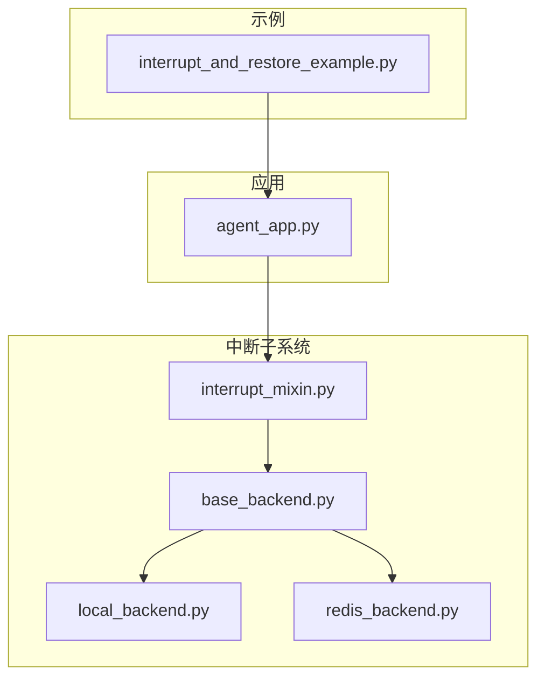
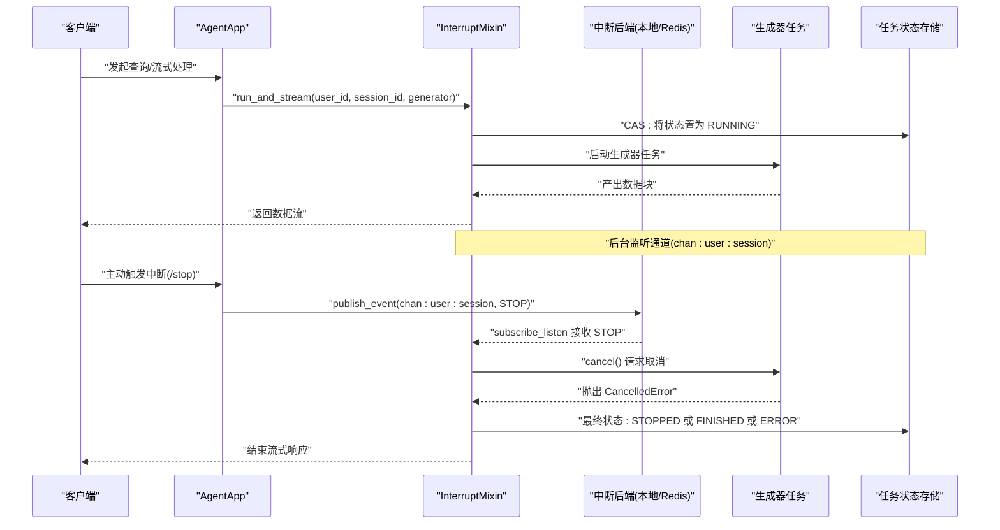
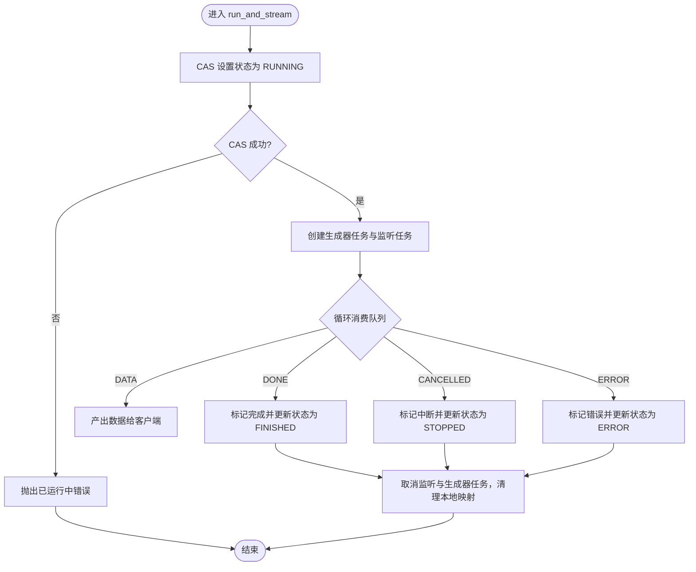
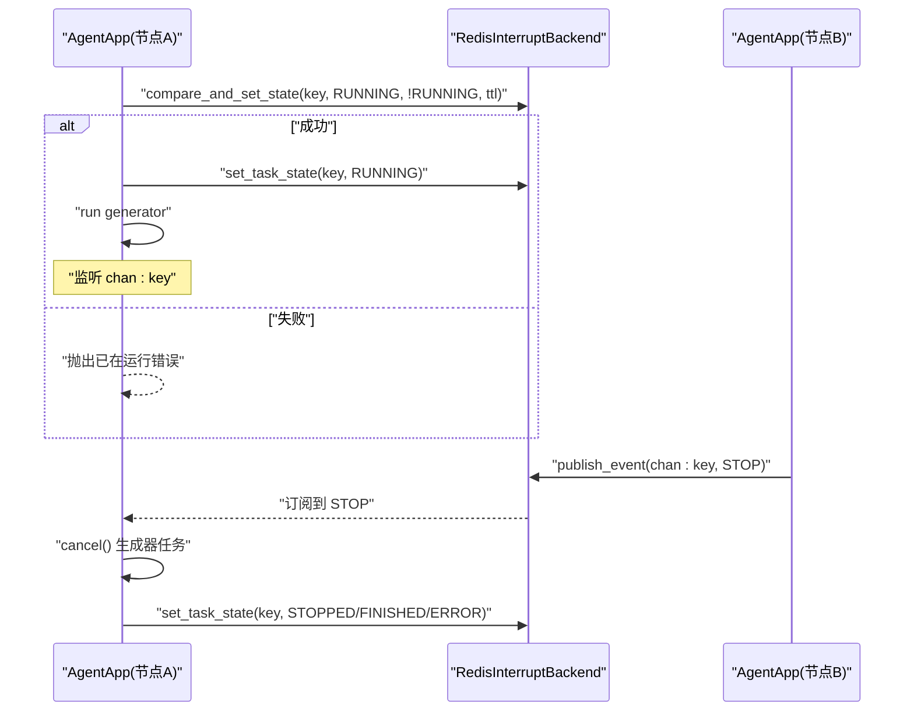
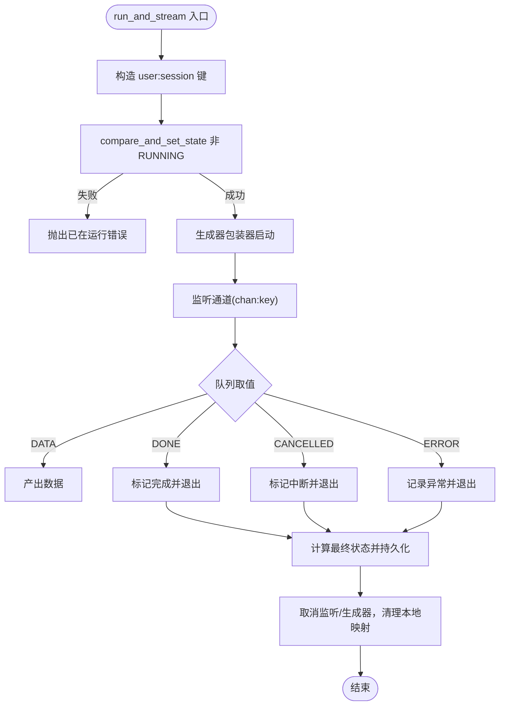
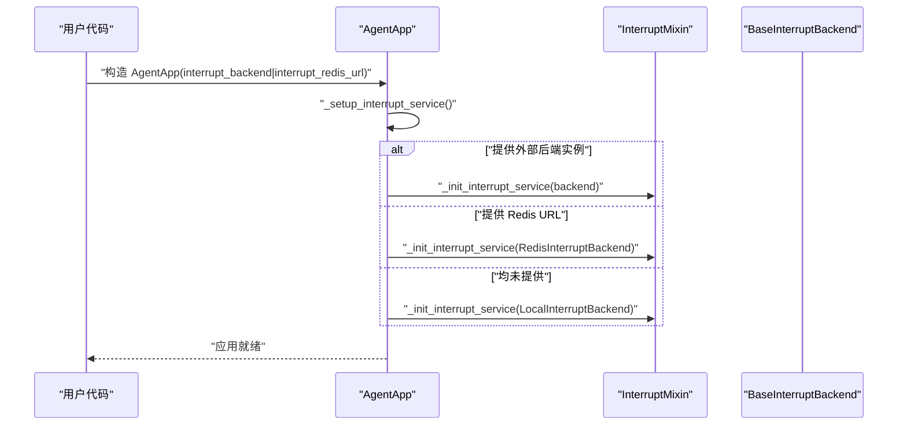
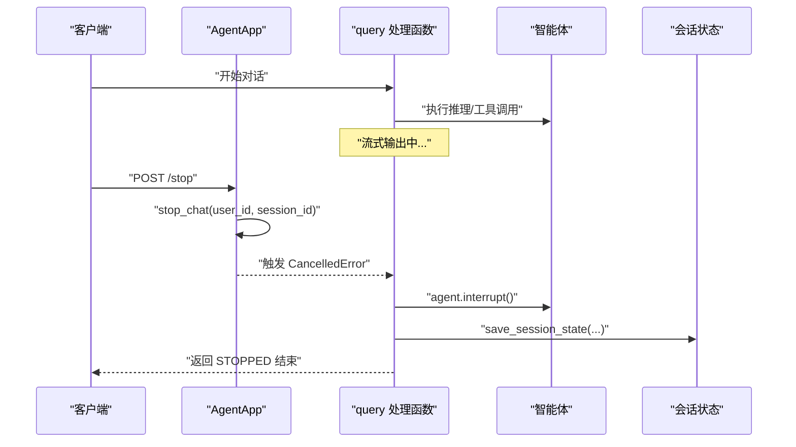
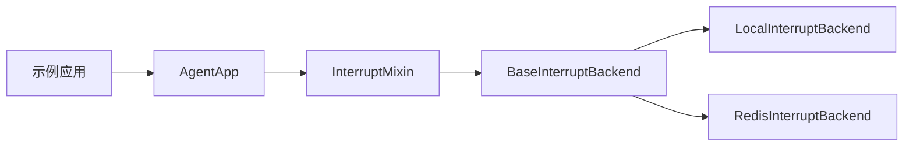

# 中断处理与恢复

<cite>
**本文引用的文件**
- [interrupt_and_restore_example.py](file://examples/interrupt/interrupt_and_restore_example.py)
- [base_backend.py](file://src/agentscope_runtime/engine/deployers/utils/service_utils/interrupt/base_backend.py)
- [local_backend.py](file://src/agentscope_runtime/engine/deployers/utils/service_utils/interrupt/local_backend.py)
- [redis_backend.py](file://src/agentscope_runtime/engine/deployers/utils/service_utils/interrupt/redis_backend.py)
- [interrupt_mixin.py](file://src/agentscope_runtime/engine/deployers/utils/service_utils/interrupt/interrupt_mixin.py)
- [agent_app.py](file://src/agentscope_runtime/engine/app/agent_app.py)
- [agent_app.md（中文）](file://cookbook/zh/agent_app.md)
- [agent_app.md（英文）](file://cookbook/en/agent_app.md)
- [test_interrupt_mixin.py](file://tests/unit/test_interrupt_mixin.py)
</cite>

## 目录
1. [简介](#简介)
2. [项目结构](#项目结构)
3. [核心组件](#核心组件)
4. [架构总览](#架构总览)
5. [详细组件分析](#详细组件分析)
6. [依赖分析](#依赖分析)
7. [性能考虑](#性能考虑)
8. [故障排查指南](#故障排查指南)
9. [结论](#结论)
10. [附录](#附录)

## 简介
本文件系统化阐述 AgentScope Runtime 在智能体执行过程中对“中断”的支持与恢复机制，覆盖本地中断与分布式中断的实现差异、手动中断、异常中断、超时中断等场景的处理策略，以及会话状态管理、任务恢复与资源清理的关键流程。文档同时提供中断触发条件、恢复策略与错误处理最佳实践，并给出可直接参考的配置与调用路径。

## 项目结构
围绕中断与恢复的相关模块主要位于以下位置：
- 示例：examples/interrupt/interrupt_and_restore_example.py
- 中断子系统：src/…/interrupt/*（抽象接口、本地实现、Redis 实现、混入类）
- 应用入口：src/…/agent_app.py（集成中断服务）
- 文档：cookbook/zh|en/agent_app.md（配置与使用说明）
- 测试：tests/unit/test_interrupt_mixin.py（行为验证）



图表来源
- [interrupt_and_restore_example.py:1-174](file://examples/interrupt/interrupt_and_restore_example.py#L1-L174)
- [base_backend.py:1-90](file://src/agentscope_runtime/engine/deployers/utils/service_utils/interrupt/base_backend.py#L1-L90)
- [local_backend.py:1-132](file://src/agentscope_runtime/engine/deployers/utils/service_utils/interrupt/local_backend.py#L1-L132)
- [redis_backend.py:1-107](file://src/agentscope_runtime/engine/deployers/utils/service_utils/interrupt/redis_backend.py#L1-L107)
- [interrupt_mixin.py:1-151](file://src/agentscope_runtime/engine/deployers/utils/service_utils/interrupt/interrupt_mixin.py#L1-L151)
- [agent_app.py:1-400](file://src/agentscope_runtime/engine/app/agent_app.py#L1-L400)

章节来源
- [interrupt_and_restore_example.py:1-174](file://examples/interrupt/interrupt_and_restore_example.py#L1-L174)
- [agent_app.py:222-247](file://src/agentscope_runtime/engine/app/agent_app.py#L222-L247)

## 核心组件
- 抽象后端接口：定义任务状态枚举、中断信号枚举与统一的发布/订阅、状态读写与 CAS 原子操作接口。
- 本地后端：基于内存与 asyncio primitives 的实现，适合单机/测试场景。
- Redis 后端：基于 Redis 的发布订阅与 Lua 原子 CAS，适合分布式场景。
- 中断混入：封装 run_and_stream 执行器、监听器、广播器、状态更新与资源清理。
- 应用入口：AgentApp 继承 FastAPI、路由混入与中断混入，负责生命周期管理与中断服务初始化。

章节来源
- [base_backend.py:1-90](file://src/agentscope_runtime/engine/deployers/utils/service_utils/interrupt/base_backend.py#L1-L90)
- [local_backend.py:1-132](file://src/agentscope_runtime/engine/deployers/utils/service_utils/interrupt/local_backend.py#L1-L132)
- [redis_backend.py:1-107](file://src/agentscope_runtime/engine/deployers/utils/service_utils/interrupt/redis_backend.py#L1-L107)
- [interrupt_mixin.py:1-151](file://src/agentscope_runtime/engine/deployers/utils/service_utils/interrupt/interrupt_mixin.py#L1-L151)
- [agent_app.py:60-64](file://src/agentscope_runtime/engine/app/agent_app.py#L60-L64)

## 架构总览
下图展示了从请求到生成器执行、中断信号传播与状态更新的全链路：



图表来源
- [interrupt_mixin.py:38-139](file://src/agentscope_runtime/engine/deployers/utils/service_utils/interrupt/interrupt_mixin.py#L38-L139)
- [redis_backend.py:11-30](file://src/agentscope_runtime/engine/deployers/utils/service_utils/interrupt/redis_backend.py#L11-L30)
- [local_backend.py:92-120](file://src/agentscope_runtime/engine/deployers/utils/service_utils/interrupt/local_backend.py#L92-L120)
- [agent_app.py:144-146](file://src/agentscope_runtime/engine/app/agent_app.py#L144-L146)

## 详细组件分析

### 抽象后端与状态模型
- 任务状态：IDLE、RUNNING、STOPPED、FINISHED、ERROR。
- 中断信号：STOP、PAUSE、RESUME。
- 关键能力：发布事件、订阅监听、设置状态、原子比较交换、获取状态、删除状态、异步关闭。

```mermaid
classDiagram
class TaskState {
<<enum>>
"IDLE"
"RUNNING"
"STOPPED"
"FINISHED"
"ERROR"
}
class InterruptSignal {
<<enum>>
"STOP"
"PAUSE"
"RESUME"
}
class BaseInterruptBackend {
+publish_event(channel, message) void
+subscribe_listen(channel) AsyncGenerator
+set_task_state(key, state, ttl) void
+compare_and_set_state(key, new_state, expected_state, negate, ttl) bool
+get_task_state(key) TaskState
+delete_task_state(key) void
+aclose() void
}
BaseInterruptBackend <|.. LocalInterruptBackend
BaseInterruptBackend <|.. RedisInterruptBackend
```

图表来源
- [base_backend.py:7-90](file://src/agentscope_runtime/engine/deployers/utils/service_utils/interrupt/base_backend.py#L7-L90)
- [local_backend.py:9-132](file://src/agentscope_runtime/engine/deployers/utils/service_utils/interrupt/local_backend.py#L9-L132)
- [redis_backend.py:7-107](file://src/agentscope_runtime/engine/deployers/utils/service_utils/interrupt/redis_backend.py#L7-L107)

章节来源
- [base_backend.py:1-90](file://src/agentscope_runtime/engine/deployers/utils/service_utils/interrupt/base_backend.py#L1-L90)

### 本地中断后端（单机/测试）
- 使用内存字典维护状态与过期时间，使用 asyncio.Lock 保证读改写的原子性。
- 订阅者集合以队列形式广播消息；关闭时向所有订阅者发送关闭信号并清空内部状态。



图表来源
- [interrupt_mixin.py:38-139](file://src/agentscope_runtime/engine/deployers/utils/service_utils/interrupt/interrupt_mixin.py#L38-L139)
- [local_backend.py:46-91](file://src/agentscope_runtime/engine/deployers/utils/service_utils/interrupt/local_backend.py#L46-L91)

章节来源
- [local_backend.py:1-132](file://src/agentscope_runtime/engine/deployers/utils/service_utils/interrupt/local_backend.py#L1-L132)

### Redis 中断后端（分布式）
- 使用 Redis 发布订阅进行跨节点通信。
- 使用 Lua 脚本实现原子 CAS，确保状态变更的强一致性。
- 提供 TTL 控制与状态删除能力。



图表来源
- [redis_backend.py:44-90](file://src/agentscope_runtime/engine/deployers/utils/service_utils/interrupt/redis_backend.py#L44-L90)
- [interrupt_mixin.py:140-146](file://src/agentscope_runtime/engine/deployers/utils/service_utils/interrupt/interrupt_mixin.py#L140-L146)

章节来源
- [redis_backend.py:1-107](file://src/agentscope_runtime/engine/deployers/utils/service_utils/interrupt/redis_backend.py#L1-L107)

### 中断混入（执行器与清理）
- 生成器包装：在 RUNNING 状态下运行，产出 DATA/DONE/CANCELLED/ERROR 四类消息到队列。
- 监听器：订阅通道，收到 STOP 后取消工作协程。
- 最终状态：根据是否被取消决定 STOPPED 或 FINISHED；异常则置 ERROR。
- 资源清理：取消监听与生成器任务，释放本地映射，更新最终状态。



图表来源
- [interrupt_mixin.py:38-139](file://src/agentscope_runtime/engine/deployers/utils/service_utils/interrupt/interrupt_mixin.py#L38-L139)

章节来源
- [interrupt_mixin.py:1-151](file://src/agentscope_runtime/engine/deployers/utils/service_utils/interrupt/interrupt_mixin.py#L1-L151)

### 应用入口（AgentApp）与生命周期
- 初始化中断服务：优先使用外部注入的后端实例，其次使用 Redis URL，最后回退到本地后端。
- 生命周期：结合内置与用户提供的 lifespan，确保运行器、协议适配器、清理任务与中断服务的正确关闭。



图表来源
- [agent_app.py:222-247](file://src/agentscope_runtime/engine/app/agent_app.py#L222-L247)
- [agent_app.py:144-146](file://src/agentscope_runtime/engine/app/agent_app.py#L144-L146)

章节来源
- [agent_app.py:210-247](file://src/agentscope_runtime/engine/app/agent_app.py#L210-L247)

### 示例：手动中断与状态保存
- 示例应用演示了如何在处理函数中捕获 CancelledError 并调用 agent.interrupt() 保存当前状态，随后重新抛出以使框架将任务状态置为 STOPPED。
- 提供 /stop 端点用于广播中断信号，触发远端节点的 cancel。



图表来源
- [interrupt_and_restore_example.py:103-130](file://examples/interrupt/interrupt_and_restore_example.py#L103-L130)
- [interrupt_and_restore_example.py:155-168](file://examples/interrupt/interrupt_and_restore_example.py#L155-L168)

章节来源
- [interrupt_and_restore_example.py:1-174](file://examples/interrupt/interrupt_and_restore_example.py#L1-L174)

## 依赖分析
- AgentApp 继承 FastAPI、路由混入与中断混入，组合中断后端（本地/Redis）。
- 中断混入依赖抽象后端接口，分别由本地与 Redis 实现提供具体能力。
- 示例应用通过 AgentApp 的 stop_chat 与处理函数中的中断捕获，形成“远端广播 + 本地保存”的闭环。



图表来源
- [agent_app.py:60-64](file://src/agentscope_runtime/engine/app/agent_app.py#L60-L64)
- [interrupt_mixin.py:8-15](file://src/agentscope_runtime/engine/deployers/utils/service_utils/interrupt/interrupt_mixin.py#L8-L15)
- [base_backend.py:25-90](file://src/agentscope_runtime/engine/deployers/utils/service_utils/interrupt/base_backend.py#L25-L90)
- [local_backend.py:9-132](file://src/agentscope_runtime/engine/deployers/utils/service_utils/interrupt/local_backend.py#L9-L132)
- [redis_backend.py:7-107](file://src/agentscope_runtime/engine/deployers/utils/service_utils/interrupt/redis_backend.py#L7-L107)
- [interrupt_and_restore_example.py:155-168](file://examples/interrupt/interrupt_and_restore_example.py#L155-L168)

章节来源
- [agent_app.py:60-64](file://src/agentscope_runtime/engine/app/agent_app.py#L60-L64)
- [interrupt_mixin.py:1-151](file://src/agentscope_runtime/engine/deployers/utils/service_utils/interrupt/interrupt_mixin.py#L1-L151)

## 性能考虑
- 本地后端：内存读写与 asyncio 队列，延迟低但不跨进程/跨节点；适合单机与开发测试。
- Redis 后端：网络开销与序列化成本，但具备强一致的 CAS 与跨节点广播能力；适合生产分布式部署。
- 状态 TTL：RUNNING 与最终状态分别设置不同 TTL，避免僵尸状态长期占用。
- 清理策略：无论正常完成、被中断还是异常，均需取消监听与生成器任务并更新最终状态，降低资源泄漏风险。

## 故障排查指南
- 中断未生效
  - 检查是否正确调用 stop_chat 并传入正确的 user_id 与 session_id。
  - 确认通道名称格式为 chan:user:session。
  - 若使用 Redis，请确认连接 URL 正确且网络可达。
- 重复提交相同会话
  - CAS 返回失败表示该会话已在 RUNNING，应拒绝重复提交或等待其完成。
- 异常导致状态未更新
  - 确保异常路径中设置了 ERROR 状态并正确抛出，以便上层感知。
- 资源未释放
  - 确认 run_and_stream 的 finally 分支被执行，监听与生成器任务被取消，本地映射被清理。

章节来源
- [interrupt_mixin.py:107-139](file://src/agentscope_runtime/engine/deployers/utils/service_utils/interrupt/interrupt_mixin.py#L107-L139)
- [test_interrupt_mixin.py:97-111](file://tests/unit/test_interrupt_mixin.py#L97-L111)
- [test_interrupt_mixin.py:143-166](file://tests/unit/test_interrupt_mixin.py#L143-L166)

## 结论
AgentScope Runtime 的中断与恢复体系通过抽象后端接口与混入类，实现了本地与分布式两种部署形态的一致体验。配合示例应用中的手动中断与状态保存流程，开发者可在复杂推理与长时任务中实现可控的中断、可靠的恢复与完善的资源清理。建议在生产环境中优先采用 Redis 后端以获得跨节点的一致性与可观测性。

## 附录

### 配置与使用要点
- 中断后端选择
  - 本地模式（默认）：适用于单机/测试。
  - Redis 模式：适用于分布式部署。
  - 自定义后端：传入继承自 BaseInterruptBackend 的实例。
- 示例参考
  - AgentApp 构造参数：interrupt_backend、interrupt_redis_url。
  - 示例应用中的 /stop 端点与处理函数中断捕获。

章节来源
- [agent_app.md（中文）:642-670](file://cookbook/zh/agent_app.md#L642-L670)
- [agent_app.md（英文）:639-667](file://cookbook/en/agent_app.md#L639-L667)
- [agent_app.py:144-146](file://src/agentscope_runtime/engine/app/agent_app.py#L144-L146)
- [interrupt_and_restore_example.py:48-63](file://examples/interrupt/interrupt_and_restore_example.py#L48-L63)