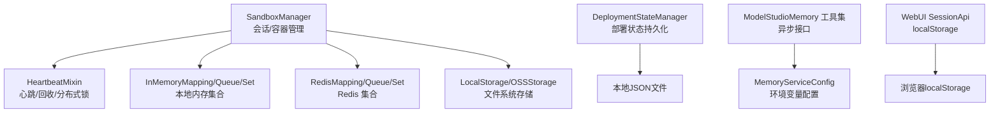
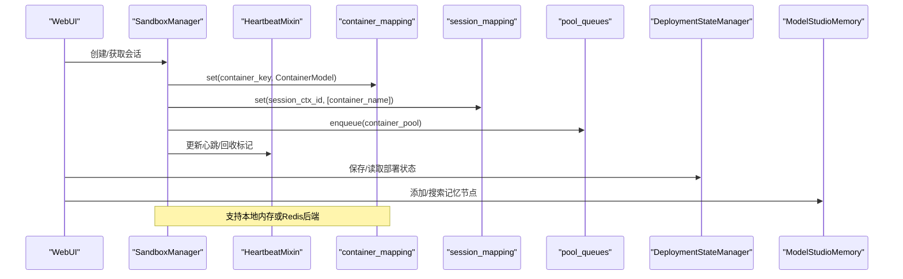
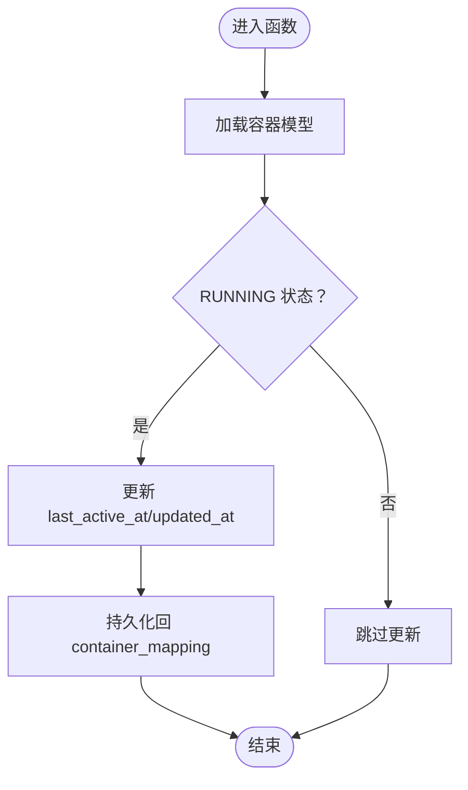
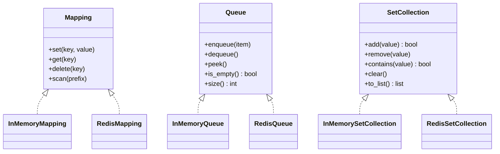
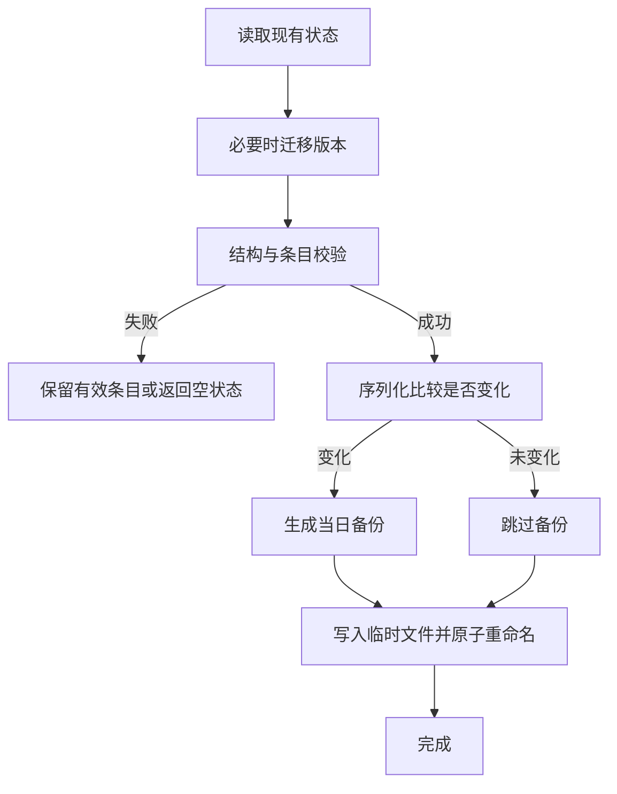
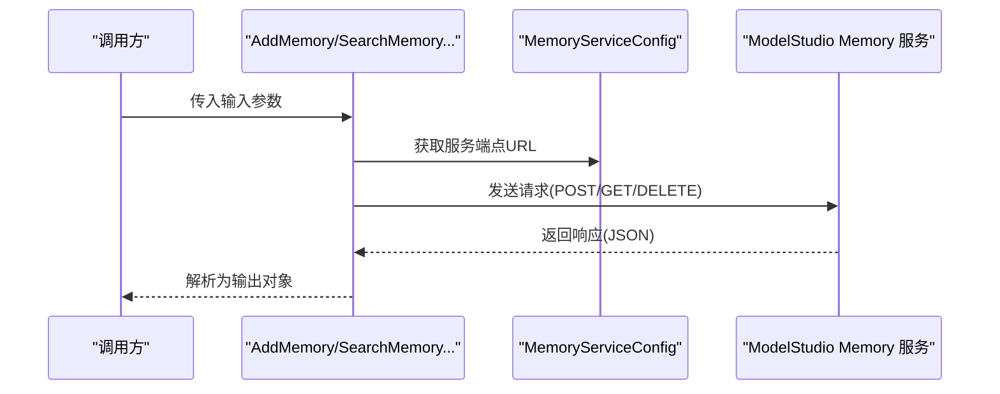
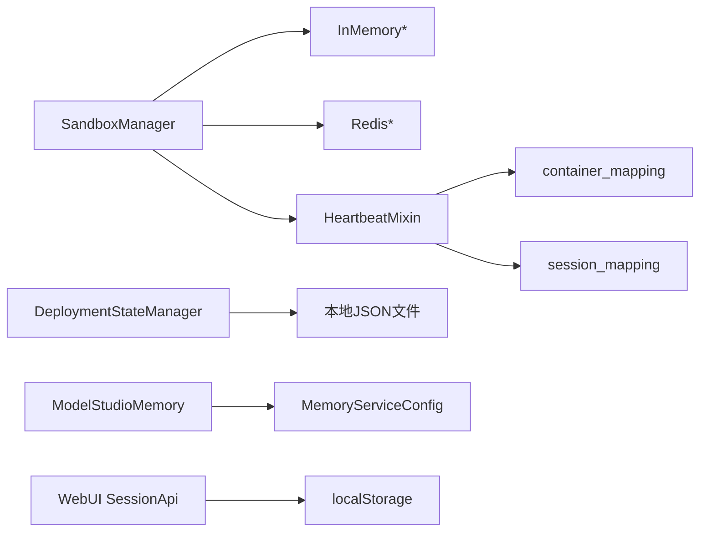

# 内存管理

<cite>
**本文引用的文件**   
- [sandbox_manager.py](file://src/agentscope_runtime/sandbox/manager/sandbox_manager.py)
- [heartbeat_mixin.py](file://src/agentscope_runtime/sandbox/manager/heartbeat_mixin.py)
- [in_memory_mapping.py](file://src/agentscope_runtime/common/collections/in_memory_mapping.py)
- [in_memory_queue.py](file://src/agentscope_runtime/common/collections/in_memory_queue.py)
- [in_memory_set.py](file://src/agentscope_runtime/common/collections/in_memory_set.py)
- [redis_mapping.py](file://src/agentscope_runtime/common/collections/redis_mapping.py)
- [redis_queue.py](file://src/agentscope_runtime/common/collections/redis_queue.py)
- [redis_set.py](file://src/agentscope_runtime/common/collections/redis_set.py)
- [manager.py](file://src/agentscope_runtime/engine/deployers/state/manager.py)
- [schema.py](file://src/agentscope_runtime/engine/deployers/state/schema.py)
- [core.py](file://src/agentscope_runtime/tools/modelstudio_memory/core.py)
- [config.py](file://src/agentscope_runtime/tools/modelstudio_memory/config.py)
- [index.ts](file://web/starter_webui/src/components/Chat/sessionApi/index.ts)
</cite>

## 目录
1. [简介](#简介)
2. [项目结构](#项目结构)
3. [核心组件](#核心组件)
4. [架构总览](#架构总览)
5. [详细组件分析](#详细组件分析)
6. [依赖关系分析](#依赖关系分析)
7. [性能考量](#性能考量)
8. [故障排查指南](#故障排查指南)
9. [结论](#结论)
10. [附录：配置与最佳实践](#附录配置与最佳实践)

## 简介
本文件系统性阐述 AgentScope Runtime 的内存管理方案，覆盖智能体内存模型、会话状态管理、持久化存储、内存优化与垃圾回收、内存泄漏防护、多后端（Redis 与本地内存）配置与使用、大规模会话管理与状态同步、数据备份与恢复、监控与性能调优等主题，并提供可直接定位到源码位置的参考路径与图示。

## 项目结构
围绕“内存管理”的关键模块分布如下：
- 会话与容器生命周期管理：SandboxManager 及其混入 HeartbeatMixin
- 内存集合抽象与本地/Redis 后端：Mapping/Queue/Set 抽象及其实现
- 部署状态持久化：部署状态文件的读写、备份与恢复
- 模型记忆服务：ModelStudio Memory 工具集（异步接口）
- Web 前端会话本地存储：浏览器 localStorage

**图表来源**
- [sandbox_manager.py:140-243](file://src/agentscope_runtime/sandbox/manager/sandbox_manager.py#L140-L243)
- [heartbeat_mixin.py:91-118](file://src/agentscope_runtime/sandbox/manager/heartbeat_mixin.py#L91-L118)
- [in_memory_mapping.py:7-27](file://src/agentscope_runtime/common/collections/in_memory_mapping.py#L7-L27)
- [redis_mapping.py:9-49](file://src/agentscope_runtime/common/collections/redis_mapping.py#L9-L49)
- [manager.py:17-38](file://src/agentscope_runtime/engine/deployers/state/manager.py#L17-L38)
- [schema.py:9-97](file://src/agentscope_runtime/engine/deployers/state/schema.py#L9-L97)
- [core.py:14-52](file://src/agentscope_runtime/tools/modelstudio_memory/core.py#L14-L52)
- [config.py:15-60](file://src/agentscope_runtime/tools/modelstudio_memory/config.py#L15-L60)
- [index.ts:6-53](file://web/starter_webui/src/components/Chat/sessionApi/index.ts#L6-L53)

**章节来源**
- [sandbox_manager.py:140-243](file://src/agentscope_runtime/sandbox/manager/sandbox_manager.py#L140-L243)
- [heartbeat_mixin.py:91-118](file://src/agentscope_runtime/sandbox/manager/heartbeat_mixin.py#L91-L118)
- [in_memory_mapping.py:7-27](file://src/agentscope_runtime/common/collections/in_memory_mapping.py#L7-L27)
- [redis_mapping.py:9-49](file://src/agentscope_runtime/common/collections/redis_mapping.py#L9-L49)
- [manager.py:17-38](file://src/agentscope_runtime/engine/deployers/state/manager.py#L17-L38)
- [schema.py:9-97](file://src/agentscope_runtime/engine/deployers/state/schema.py#L9-L97)
- [core.py:14-52](file://src/agentscope_runtime/tools/modelstudio_memory/core.py#L14-L52)
- [config.py:15-60](file://src/agentscope_runtime/tools/modelstudio_memory/config.py#L15-L60)
- [index.ts:6-53](file://web/starter_webui/src/components/Chat/sessionApi/index.ts#L6-L53)

## 核心组件
- 会话与容器映射：通过 container_mapping 与 session_mapping 维护容器与会话的键值映射，支持本地内存或 Redis 后端。
- 容器池队列：pool_queues 使用 Redis 或本地队列实现多类型沙箱池的排队与分发。
- 心跳与回收：HeartbeatMixin 提供心跳更新、回收标记、分布式锁，保障长时间会话的健康与一致性。
- 部署状态持久化：DeploymentStateManager 负责部署元数据的读写、原子写入、每日备份与30天滚动清理。
- 模型记忆服务：ModelStudio Memory 工具集提供添加、搜索、列出、删除记忆节点以及用户画像 Schema 管理等异步能力。
- Web 会话本地存储：WebUI 使用 localStorage 存储会话列表，便于前端侧快速访问。

**章节来源**
- [sandbox_manager.py:204-243](file://src/agentscope_runtime/sandbox/manager/sandbox_manager.py#L204-L243)
- [heartbeat_mixin.py:17-88](file://src/agentscope_runtime/sandbox/manager/heartbeat_mixin.py#L17-L88)
- [manager.py:17-38](file://src/agentscope_runtime/engine/deployers/state/manager.py#L17-L38)
- [core.py:55-158](file://src/agentscope_runtime/tools/modelstudio_memory/core.py#L55-L158)
- [index.ts:6-53](file://web/starter_webui/src/components/Chat/sessionApi/index.ts#L6-L53)

## 架构总览
下图展示了内存管理在运行时的整体交互：SandboxManager 作为中枢协调容器映射、会话映射、容器池队列与存储；HeartbeatMixin 提供心跳与回收；DeploymentStateManager 负责部署状态持久化；ModelStudio Memory 作为外部记忆服务提供异步工具；WebUI 通过 SessionApi 访问本地会话。

**图表来源**
- [sandbox_manager.py:204-243](file://src/agentscope_runtime/sandbox/manager/sandbox_manager.py#L204-L243)
- [heartbeat_mixin.py:180-224](file://src/agentscope_runtime/sandbox/manager/heartbeat_mixin.py#L180-L224)
- [manager.py:232-241](file://src/agentscope_runtime/engine/deployers/state/manager.py#L232-L241)
- [core.py:94-157](file://src/agentscope_runtime/tools/modelstudio_memory/core.py#L94-L157)

## 详细组件分析

### 1) 智能体内存模型与会话状态管理
- 容器模型持久化：ContainerModel 通过 container_mapping 进行序列化存储，字段包括 last_active_at、updated_at、state、session_ctx_id 等，用于会话级心跳与状态追踪。
- 会话映射：session_mapping 将 session_ctx_id 映射到容器名列表，便于按会话批量更新心跳与回收标记。
- 心跳与回收：
  - update_heartbeat：对 RUNNING 状态容器更新 last_active_at 与 updated_at。
  - mark_session_recycled：将容器标记为 RECYCLED 并记录原因。
  - needs_restore：检测是否需要恢复（RECYCLED 容器）。
  - 分布式锁：acquire_heartbeat_lock/release_heartbeat_lock 保证并发安全的心跳操作。
- 会话上下文解析：get_session_ctx_id_by_identity 从容器信息中解析 session_ctx_id，兼容新旧字段。

**图表来源**
- [heartbeat_mixin.py:180-224](file://src/agentscope_runtime/sandbox/manager/heartbeat_mixin.py#L180-L224)

**章节来源**
- [heartbeat_mixin.py:17-88](file://src/agentscope_runtime/sandbox/manager/heartbeat_mixin.py#L17-L88)
- [heartbeat_mixin.py:180-305](file://src/agentscope_runtime/sandbox/manager/heartbeat_mixin.py#L180-L305)
- [heartbeat_mixin.py:344-370](file://src/agentscope_runtime/sandbox/manager/heartbeat_mixin.py#L344-L370)
- [heartbeat_mixin.py:420-488](file://src/agentscope_runtime/sandbox/manager/heartbeat_mixin.py#L420-L488)

### 2) 内存集合抽象与后端选择
- 抽象层：Mapping、Queue、SetCollection 定义统一接口，支持本地内存与 Redis 两种实现。
- 本地内存实现：InMemoryMapping/InMemoryQueue/InMemorySetCollection，适合单进程、低并发场景。
- Redis 实现：RedisMapping/RedisQueue/RedisSetCollection，提供分布式共享与高可用，支持前缀隔离与扫描。
- SandboxManager 在构造时根据配置选择后端：当 redis_enabled 为真时使用 Redis，否则使用本地内存。

**图表来源**
- [in_memory_mapping.py:7-27](file://src/agentscope_runtime/common/collections/in_memory_mapping.py#L7-L27)
- [in_memory_queue.py:6-28](file://src/agentscope_runtime/common/collections/in_memory_queue.py#L6-L28)
- [in_memory_set.py:6-27](file://src/agentscope_runtime/common/collections/in_memory_set.py#L6-L27)
- [redis_mapping.py:9-49](file://src/agentscope_runtime/common/collections/redis_mapping.py#L9-L49)
- [redis_queue.py:7-28](file://src/agentscope_runtime/common/collections/redis_queue.py#L7-L28)
- [redis_set.py:5-24](file://src/agentscope_runtime/common/collections/redis_set.py#L5-L24)

**章节来源**
- [sandbox_manager.py:204-243](file://src/agentscope_runtime/sandbox/manager/sandbox_manager.py#L204-L243)
- [in_memory_mapping.py:7-27](file://src/agentscope_runtime/common/collections/in_memory_mapping.py#L7-L27)
- [redis_mapping.py:9-49](file://src/agentscope_runtime/common/collections/redis_mapping.py#L9-L49)
- [in_memory_queue.py:6-28](file://src/agentscope_runtime/common/collections/in_memory_queue.py#L6-L28)
- [redis_queue.py:7-28](file://src/agentscope_runtime/common/collections/redis_queue.py#L7-L28)
- [in_memory_set.py:6-27](file://src/agentscope_runtime/common/collections/in_memory_set.py#L6-L27)
- [redis_set.py:5-24](file://src/agentscope_runtime/common/collections/redis_set.py#L5-L24)

### 3) 持久化存储与部署状态管理
- 部署状态文件：默认位于用户目录下的 ~/.agentscope-runtime/deployments.json，采用 JSON 结构，版本化迁移。
- 原子写入：写入前进行校验与备份，仅在内容变化时生成当日备份，保留最近30天。
- 备份策略：每日备份文件命名包含日期，自动清理过期备份。
- 数据保护：写入空状态时进行安全检查，防止误清空导致的数据丢失。

**图表来源**
- [manager.py:89-144](file://src/agentscope_runtime/engine/deployers/state/manager.py#L89-L144)
- [manager.py:146-231](file://src/agentscope_runtime/engine/deployers/state/manager.py#L146-L231)
- [schema.py:37-81](file://src/agentscope_runtime/engine/deployers/state/schema.py#L37-L81)

**章节来源**
- [manager.py:17-38](file://src/agentscope_runtime/engine/deployers/state/manager.py#L17-L38)
- [manager.py:39-87](file://src/agentscope_runtime/engine/deployers/state/manager.py#L39-L87)
- [manager.py:89-144](file://src/agentscope_runtime/engine/deployers/state/manager.py#L89-L144)
- [manager.py:146-231](file://src/agentscope_runtime/engine/deployers/state/manager.py#L146-L231)
- [schema.py:9-97](file://src/agentscope_runtime/engine/deployers/state/schema.py#L9-L97)

### 4) 模型记忆服务（异步工具）
- 工具集：AddMemory、SearchMemory、ListMemory、DeleteMemory、CreateProfileSchema、GetUserProfile、GetProfileSchema、ListProfileSchemas 等。
- 异步运行：每个工具的 _arun 方法以异步方式调用远端服务，返回结构化输出对象。
- 配置：MemoryServiceConfig 从环境变量加载 API Key、服务端点与服务 ID，并生成各端点 URL。

**图表来源**
- [core.py:94-157](file://src/agentscope_runtime/tools/modelstudio_memory/core.py#L94-L157)
- [core.py:194-247](file://src/agentscope_runtime/tools/modelstudio_memory/core.py#L194-L247)
- [config.py:30-60](file://src/agentscope_runtime/tools/modelstudio_memory/config.py#L30-L60)

**章节来源**
- [core.py:55-158](file://src/agentscope_runtime/tools/modelstudio_memory/core.py#L55-L158)
- [core.py:160-247](file://src/agentscope_runtime/tools/modelstudio_memory/core.py#L160-L247)
- [core.py:250-339](file://src/agentscope_runtime/tools/modelstudio_memory/core.py#L250-L339)
- [core.py:342-431](file://src/agentscope_runtime/tools/modelstudio_memory/core.py#L342-L431)
- [core.py:433-514](file://src/agentscope_runtime/tools/modelstudio_memory/core.py#L433-L514)
- [core.py:517-620](file://src/agentscope_runtime/tools/modelstudio_memory/core.py#L517-L620)
- [core.py:623-711](file://src/agentscope_runtime/tools/modelstudio_memory/core.py#L623-L711)
- [core.py:714-797](file://src/agentscope_runtime/tools/modelstudio_memory/core.py#L714-L797)
- [config.py:15-60](file://src/agentscope_runtime/tools/modelstudio_memory/config.py#L15-L60)

### 5) Web 前端会话本地存储
- SessionApi 使用 localStorage 存储会话列表，提供获取、创建、更新、删除会话的能力。
- 本地存储键：agent-scope-runtime-webui-sessions。
- 适用于前端侧快速访问与离线体验，不替代后端会话状态管理。

**章节来源**
- [index.ts:6-53](file://web/starter_webui/src/components/Chat/sessionApi/index.ts#L6-L53)

## 依赖关系分析
- SandboxManager 依赖 Mapping/Queue/Set 抽象，运行时通过配置切换 Redis 或本地内存实现。
- HeartbeatMixin 依赖 container_mapping 与 session_mapping，提供心跳与回收逻辑。
- DeploymentStateManager 依赖本地文件系统，提供原子写入与备份清理。
- ModelStudio Memory 工具集依赖 MemoryServiceConfig，通过环境变量注入认证信息。
- WebUI SessionApi 依赖浏览器 localStorage。

**图表来源**
- [sandbox_manager.py:204-243](file://src/agentscope_runtime/sandbox/manager/sandbox_manager.py#L204-L243)
- [heartbeat_mixin.py:17-88](file://src/agentscope_runtime/sandbox/manager/heartbeat_mixin.py#L17-L88)
- [manager.py:17-38](file://src/agentscope_runtime/engine/deployers/state/manager.py#L17-L38)
- [core.py:14-52](file://src/agentscope_runtime/tools/modelstudio_memory/core.py#L14-L52)
- [config.py:15-60](file://src/agentscope_runtime/tools/modelstudio_memory/config.py#L15-L60)
- [index.ts:6-53](file://web/starter_webui/src/components/Chat/sessionApi/index.ts#L6-L53)

**章节来源**
- [sandbox_manager.py:204-243](file://src/agentscope_runtime/sandbox/manager/sandbox_manager.py#L204-L243)
- [heartbeat_mixin.py:17-88](file://src/agentscope_runtime/sandbox/manager/heartbeat_mixin.py#L17-L88)
- [manager.py:17-38](file://src/agentscope_runtime/engine/deployers/state/manager.py#L17-L38)
- [core.py:14-52](file://src/agentscope_runtime/tools/modelstudio_memory/core.py#L14-L52)
- [config.py:15-60](file://src/agentscope_runtime/tools/modelstudio_memory/config.py#L15-L60)
- [index.ts:6-53](file://web/starter_webui/src/components/Chat/sessionApi/index.ts#L6-L53)

## 性能考量
- 本地内存 vs Redis
  - 本地内存：低延迟、零网络开销，适合单实例、小规模并发。
  - Redis：支持水平扩展与多实例共享，适合大规模会话与跨节点同步。
- 扫描与遍历
  - RedisMapping.scan 使用 SCAN 渐进式迭代，避免阻塞；建议配合前缀与分页策略。
- 队列与池
  - RedisQueue/InMemoryQueue 提供统一接口，注意队列长度与背压处理。
- 序列化成本
  - JSON 序列化/反序列化在高频写入场景下可能成为瓶颈，建议控制对象大小与嵌套层级。
- 心跳与回收
  - 合理设置心跳 TTL 与回收阈值，避免频繁重建容器。
- 文件系统存储
  - 部署状态文件采用原子写入与备份策略，减少损坏风险。

[本节为通用指导，无需特定文件分析]

## 故障排查指南
- Redis 连接失败
  - 现象：初始化时报连接错误。
  - 排查：确认主机、端口、数据库、用户名、密码配置正确；尝试 ping。
  - 参考路径：[sandbox_manager.py:217-222](file://src/agentscope_runtime/sandbox/manager/sandbox_manager.py#L217-L222)
- 分布式锁释放异常
  - 现象：Redis 不支持 EVAL 或令牌不匹配导致释放失败。
  - 排查：降级为 GET+DEL 流程；核对锁令牌与键名；检查 Redis 版本。
  - 参考路径：[heartbeat_mixin.py:468-488](file://src/agentscope_runtime/sandbox/manager/heartbeat_mixin.py#L468-L488)
- 部署状态写入被阻止
  - 现象：写入空状态被拒绝，防止数据丢失。
  - 排查：检查现有状态是否为空；确认 allow_empty 参数使用场景。
  - 参考路径：[manager.py:163-182](file://src/agentscope_runtime/engine/deployers/state/manager.py#L163-L182)
- 备份清理异常
  - 现象：备份文件未按预期清理。
  - 排查：检查日期格式与文件名模式；确认时间差计算。
  - 参考路径：[manager.py:56-87](file://src/agentscope_runtime/engine/deployers/state/manager.py#L56-L87)
- Web 会话无法持久化
  - 现象：刷新页面后会话丢失。
  - 排查：确认 localStorage 可用；检查键名与序列化格式。
  - 参考路径：[index.ts:15-50](file://web/starter_webui/src/components/Chat/sessionApi/index.ts#L15-L50)

**章节来源**
- [sandbox_manager.py:217-222](file://src/agentscope_runtime/sandbox/manager/sandbox_manager.py#L217-L222)
- [heartbeat_mixin.py:468-488](file://src/agentscope_runtime/sandbox/manager/heartbeat_mixin.py#L468-L488)
- [manager.py:163-182](file://src/agentscope_runtime/engine/deployers/state/manager.py#L163-L182)
- [manager.py:56-87](file://src/agentscope_runtime/engine/deployers/state/manager.py#L56-L87)
- [index.ts:15-50](file://web/starter_webui/src/components/Chat/sessionApi/index.ts#L15-L50)

## 结论
AgentScope Runtime 的内存管理以“抽象统一 + 后端可插拔”为核心设计：通过 Mapping/Queue/Set 抽象屏蔽本地与 Redis 的差异；借助 HeartbeatMixin 实现会话级心跳与回收；通过 DeploymentStateManager 提供可靠的部署状态持久化；结合 ModelStudio Memory 工具集与 WebUI 本地存储，形成从前端到后端的完整内存与状态管理闭环。在生产环境中，建议优先采用 Redis 后端以获得更好的扩展性与可靠性，并配合合理的备份与监控策略。

[本节为总结，无需特定文件分析]

## 附录：配置与最佳实践

### A. 内存后端配置与使用
- 本地内存
  - 适用：单机、开发测试、低并发。
  - 关键点：InMemoryMapping/InMemoryQueue/InMemorySetCollection 无外部依赖。
  - 参考路径：[sandbox_manager.py:234-241](file://src/agentscope_runtime/sandbox/manager/sandbox_manager.py#L234-L241)
- Redis
  - 适用：多实例、高并发、跨节点共享。
  - 关键点：RedisMapping/RedisQueue/RedisSetCollection；设置前缀隔离；SCAN 扫描避免阻塞。
  - 参考路径：[sandbox_manager.py:205-233](file://src/agentscope_runtime/sandbox/manager/sandbox_manager.py#L205-L233), [redis_mapping.py:9-49](file://src/agentscope_runtime/common/collections/redis_mapping.py#L9-L49)

**章节来源**
- [sandbox_manager.py:205-241](file://src/agentscope_runtime/sandbox/manager/sandbox_manager.py#L205-L241)
- [redis_mapping.py:9-49](file://src/agentscope_runtime/common/collections/redis_mapping.py#L9-L49)

### B. 大规模会话管理与状态同步
- 会话映射：session_mapping 保存 session_ctx_id 到容器名列表，便于批量操作。
- 心跳与回收：合理设置心跳 TTL 与回收阈值，避免频繁重建。
- 分布式锁：acquire_heartbeat_lock/release_heartbeat_lock 保障并发安全。
- 参考路径：[heartbeat_mixin.py:180-305](file://src/agentscope_runtime/sandbox/manager/heartbeat_mixin.py#L180-L305), [heartbeat_mixin.py:420-488](file://src/agentscope_runtime/sandbox/manager/heartbeat_mixin.py#L420-L488)

**章节来源**
- [heartbeat_mixin.py:180-305](file://src/agentscope_runtime/sandbox/manager/heartbeat_mixin.py#L180-L305)
- [heartbeat_mixin.py:420-488](file://src/agentscope_runtime/sandbox/manager/heartbeat_mixin.py#L420-L488)

### C. 数据备份与恢复
- 部署状态文件每日备份，保留最近30天；写入前进行原子替换与内容比较，防止误清空。
- 参考路径：[manager.py:39-87](file://src/agentscope_runtime/engine/deployers/state/manager.py#L39-L87), [manager.py:146-231](file://src/agentscope_runtime/engine/deployers/state/manager.py#L146-L231)

**章节来源**
- [manager.py:39-87](file://src/agentscope_runtime/engine/deployers/state/manager.py#L39-L87)
- [manager.py:146-231](file://src/agentscope_runtime/engine/deployers/state/manager.py#L146-L231)

### D. 内存监控与性能调优
- 监控建议：关注 Redis 队列长度、SCAN 扫描耗时、JSON 序列化开销、心跳与回收频率。
- 调优建议：合理设置心跳 TTL、回收阈值；对高频写入场景限制对象大小；使用前缀隔离降低扫描范围。
- 参考路径：[redis_mapping.py:32-48](file://src/agentscope_runtime/common/collections/redis_mapping.py#L32-L48), [redis_queue.py:12-27](file://src/agentscope_runtime/common/collections/redis_queue.py#L12-L27)

**章节来源**
- [redis_mapping.py:32-48](file://src/agentscope_runtime/common/collections/redis_mapping.py#L32-L48)
- [redis_queue.py:12-27](file://src/agentscope_runtime/common/collections/redis_queue.py#L12-L27)

### E. 内存泄漏防护与垃圾回收
- 心跳与回收：定期清理非 RUNNING 容器记录，避免无效键堆积。
- 键空间清理：利用 Redis SCAN 与前缀过滤，批量删除过期或非终端状态键。
- 参考路径：[heartbeat_mixin.py:256-305](file://src/agentscope_runtime/sandbox/manager/heartbeat_mixin.py#L256-L305), [sandbox_manager.py:1744-1784](file://src/agentscope_runtime/sandbox/manager/sandbox_manager.py#L1744-L1784)

**章节来源**
- [heartbeat_mixin.py:256-305](file://src/agentscope_runtime/sandbox/manager/heartbeat_mixin.py#L256-L305)
- [sandbox_manager.py:1744-1784](file://src/agentscope_runtime/sandbox/manager/sandbox_manager.py#L1744-L1784)

### F. Web 前端会话本地存储
- 使用 localStorage 存储会话列表，键名为 agent-scope-runtime-webui-sessions。
- 参考路径：[index.ts:6-53](file://web/starter_webui/src/components/Chat/sessionApi/index.ts#L6-L53)

**章节来源**
- [index.ts:6-53](file://web/starter_webui/src/components/Chat/sessionApi/index.ts#L6-L53)