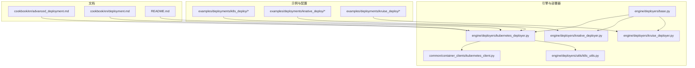
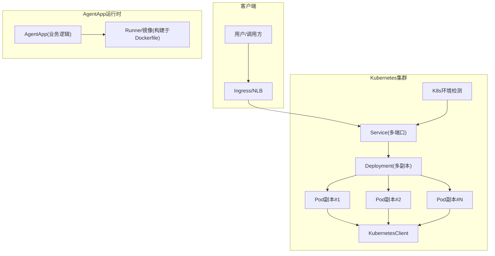
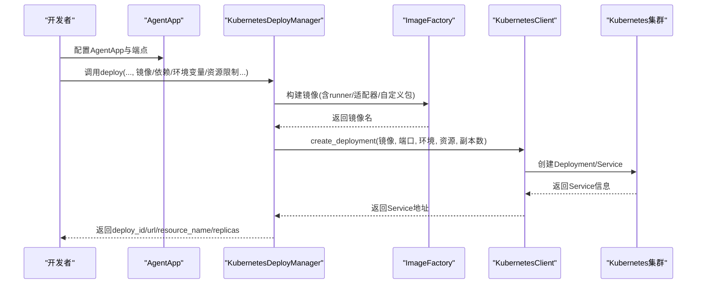
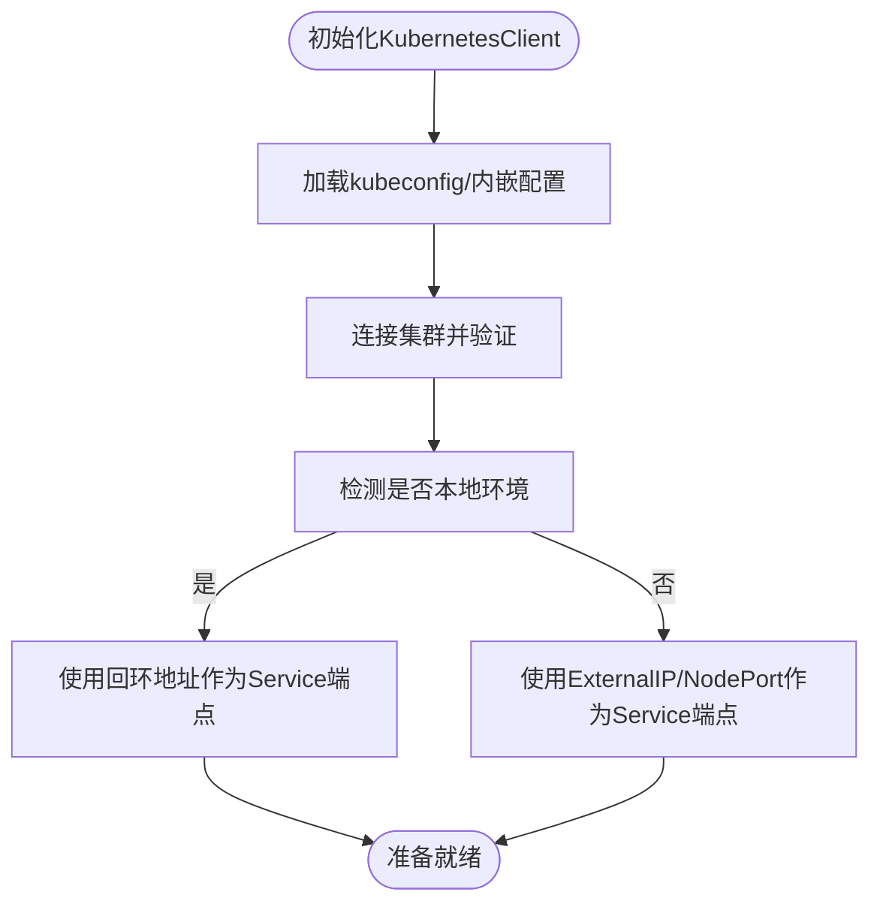
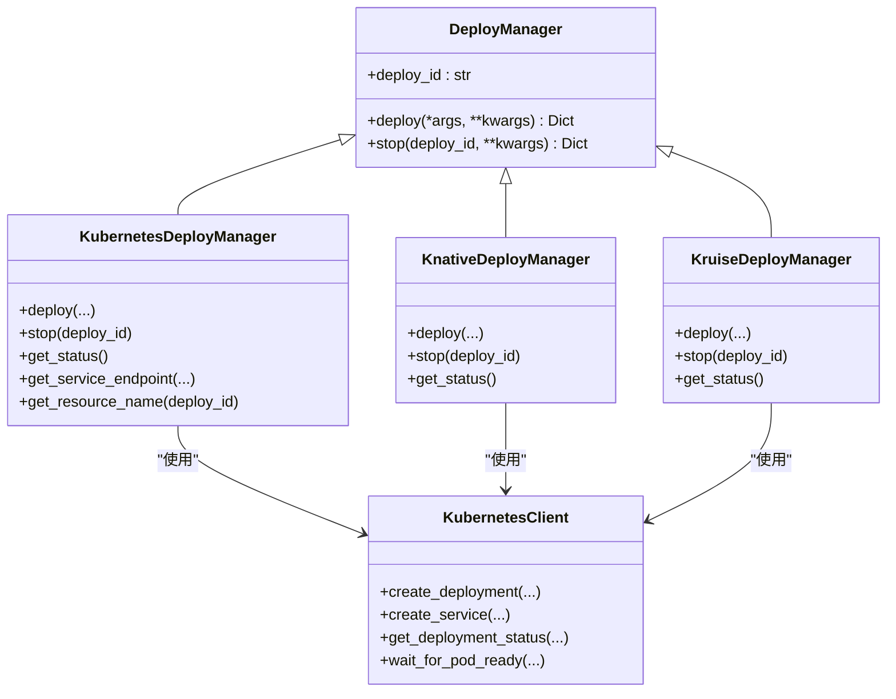
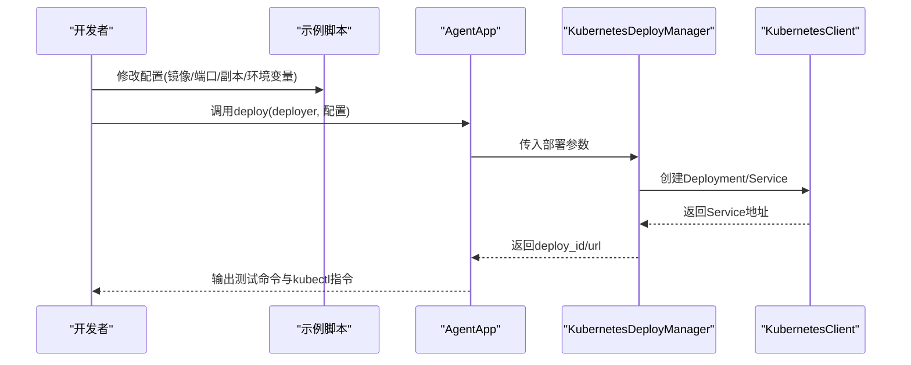

# 分布式部署

<cite>
**本文引用的文件**
- [README.md](file://README.md)
- [advanced_deployment.md](file://cookbook/en/advanced_deployment.md)
- [deployment.md](file://cookbook/en/deployment.md)
- [app_deploy_to_k8s.py](file://examples/deployments/k8s_deploy/app_deploy_to_k8s.py)
- [k8s_deploy_config.yaml](file://examples/deployments/k8s_deploy/k8s_deploy_config.yaml)
- [k8s_deploy_config.json](file://examples/deployments/k8s_deploy/k8s_deploy_config.json)
- [kubernetes_deployer.py](file://src/agentscope_runtime/engine/deployers/kubernetes_deployer.py)
- [kubernetes_client.py](file://src/agentscope_runtime/common/container_clients/kubernetes_client.py)
- [k8s_utils.py](file://src/agentscope_runtime/engine/deployers/utils/k8s_utils.py)
- [knative_deployer.py](file://src/agentscope_runtime/engine/deployers/knative_deployer.py)
- [kruise_deployer.py](file://src/agentscope_runtime/engine/deployers/kruise_deployer.py)
- [base.py](file://src/agentscope_runtime/engine/deployers/base.py)
</cite>

## 目录
1. [简介](#简介)
2. [项目结构](#项目结构)
3. [核心组件](#核心组件)
4. [架构总览](#架构总览)
5. [详细组件分析](#详细组件分析)
6. [依赖关系分析](#依赖关系分析)
7. [性能与可扩展性](#性能与可扩展性)
8. [故障排查指南](#故障排查指南)
9. [结论](#结论)
10. [附录：实施指南](#附录实施指南)

## 简介
本文件面向AgentScope Runtime在分布式环境（尤其是Kubernetes集群）中的生产级部署，系统化阐述多节点部署架构、负载均衡策略、服务发现机制、水平扩展与自动伸缩、高可用配置、服务治理、监控告警与日志收集、以及安全与网络策略等关键主题。文档同时提供基于仓库示例的完整实施步骤与架构图示，帮助读者从零到一完成Agent应用的弹性、可观测、可维护的分布式上线。

## 项目结构
AgentScope Runtime围绕“AgentApp + 多种DeployManager”的模式构建，支持本地、容器、Kubernetes、Serverless等多种部署形态。与分布式部署直接相关的关键目录与文件如下：
- 示例与配置
  - examples/deployments/k8s_deploy：Kubernetes部署示例与配置模板
  - examples/deployments/knative_deploy：Knative部署示例
  - examples/deployments/kruise_deploy：Kruise沙箱部署示例
- 引擎与部署器
  - src/agentscope_runtime/engine/deployers：统一的部署抽象与多种平台实现
  - src/agentscope_runtime/common/container_clients：容器平台客户端封装
- 文档
  - cookbook/en/advanced_deployment.md：高级部署指南
  - cookbook/en/deployment.md：部署章节
  - README.md：总体介绍与特性

图表来源
- [kubernetes_deployer.py](file://src/agentscope_runtime/engine/deployers/kubernetes_deployer.py)
- [kubernetes_client.py](file://src/agentscope_runtime/common/container_clients/kubernetes_client.py)
- [k8s_utils.py](file://src/agentscope_runtime/engine/deployers/utils/k8s_utils.py)
- [knative_deployer.py](file://src/agentscope_runtime/engine/deployers/knative_deployer.py)
- [kruise_deployer.py](file://src/agentscope_runtime/engine/deployers/kruise_deployer.py)
- [base.py](file://src/agentscope_runtime/engine/deployers/base.py)
- [advanced_deployment.md](file://cookbook/en/advanced_deployment.md)
- [deployment.md](file://cookbook/en/deployment.md)
- [README.md](file://README.md)

章节来源
- [README.md](file://README.md)
- [advanced_deployment.md](file://cookbook/en/advanced_deployment.md)
- [deployment.md](file://cookbook/en/deployment.md)

## 核心组件
- DeployManager抽象：定义统一的部署接口与生命周期管理（生成deploy_id、状态管理）
- KubernetesDeployManager：负责镜像构建、推送、Deployment/Service创建、健康检查与端点选择
- KubernetesClient：对K8s API的封装，包括Pod/Deployment/Service操作、日志、状态查询
- K8s环境检测工具：自动识别本地/云环境，决定Service访问端点策略
- KnativeDeployManager：以Knative Service形式部署，适合按需扩缩容的无服务器场景
- KruiseDeployManager：以Kruise Sandbox自定义资源部署，支持更细粒度的隔离与网络策略

章节来源
- [base.py](file://src/agentscope_runtime/engine/deployers/base.py)
- [kubernetes_deployer.py](file://src/agentscope_runtime/engine/deployers/kubernetes_deployer.py)
- [kubernetes_client.py](file://src/agentscope_runtime/common/container_clients/kubernetes_client.py)
- [k8s_utils.py](file://src/agentscope_runtime/engine/deployers/utils/k8s_utils.py)
- [knative_deployer.py](file://src/agentscope_runtime/engine/deployers/knative_deployer.py)
- [kruise_deployer.py](file://src/agentscope_runtime/engine/deployers/kruise_deployer.py)

## 架构总览
下图展示了AgentApp在Kubernetes上的典型分布式部署拓扑：AgentApp作为业务入口，通过KubernetesDeployManager构建镜像并创建Deployment与Service；KubernetesClient负责与集群交互；K8s环境检测工具根据当前上下文选择合适的访问端点；外部流量经由Ingress/NLB进入Service，再路由到多个Pod副本实现水平扩展与高可用。

图表来源
- [kubernetes_deployer.py](file://src/agentscope_runtime/engine/deployers/kubernetes_deployer.py)
- [kubernetes_client.py](file://src/agentscope_runtime/common/container_clients/kubernetes_client.py)
- [k8s_utils.py](file://src/agentscope_runtime/engine/deployers/utils/k8s_utils.py)
- [app_deploy_to_k8s.py](file://examples/deployments/k8s_deploy/app_deploy_to_k8s.py)

## 详细组件分析

### Kubernetes部署器（KubernetesDeployManager）
- 职责
  - 统一镜像构建与推送（基于ImageFactory与RegistryConfig）
  - 创建Deployment与Service，支持多端口、多副本
  - 自动选择Service访问端点（本地/云环境差异化处理）
  - 部署状态持久化与查询
- 关键流程
  - 镜像构建与推送
  - Deployment创建（含资源限制、重启策略、镜像拉取策略等）
  - Service创建（NodePort/LoadBalancer或自动端口映射）
  - 健康检查与端点URL生成
  - 停止部署（删除Deployment与关联资源）

图表来源
- [kubernetes_deployer.py](file://src/agentscope_runtime/engine/deployers/kubernetes_deployer.py)
- [kubernetes_client.py](file://src/agentscope_runtime/common/container_clients/kubernetes_client.py)

章节来源
- [kubernetes_deployer.py](file://src/agentscope_runtime/engine/deployers/kubernetes_deployer.py)
- [k8s_deploy_config.yaml](file://examples/deployments/k8s_deploy/k8s_deploy_config.yaml)
- [k8s_deploy_config.json](file://examples/deployments/k8s_deploy/k8s_deploy_config.json)

### Kubernetes客户端（KubernetesClient）
- 职责
  - 封装K8s API：Pod/Deployment/Service CRUD、日志、状态查询、等待就绪
  - 多端口Service创建、NodePort解析、节点IP获取
  - 运行时配置注入（资源限制、安全上下文、容忍度、镜像拉取密钥等）
- 本地/云环境识别
  - 通过kubeconfig上下文、集群server地址、节点标签、命名空间特征等综合判断
  - 本地环境使用回环地址，云环境使用ExternalIP或NodePort

图表来源
- [kubernetes_client.py](file://src/agentscope_runtime/common/container_clients/kubernetes_client.py)
- [k8s_utils.py](file://src/agentscope_runtime/engine/deployers/utils/k8s_utils.py)

章节来源
- [kubernetes_client.py](file://src/agentscope_runtime/common/container_clients/kubernetes_client.py)
- [k8s_utils.py](file://src/agentscope_runtime/engine/deployers/utils/k8s_utils.py)

### Knative部署器（KnativeDeployManager）
- 场景
  - 需要按请求扩缩容的无服务器场景，适合低并发或突发流量
- 关键点
  - 以KService形式部署，自动扩缩容
  - 支持注解与标签传递，便于网格与观测集成

章节来源
- [knative_deployer.py](file://src/agentscope_runtime/engine/deployers/knative_deployer.py)
- [advanced_deployment.md](file://cookbook/en/advanced_deployment.md)

### Kruise部署器（KruiseDeployManager）
- 场景
  - 需要更强隔离或微虚拟机级别的沙箱能力
- 关键点
  - 以Kruise Sandbox自定义资源部署
  - 提供LoadBalancer Service与IP解析，支持标签选择器

章节来源
- [kruise_deployer.py](file://src/agentscope_runtime/engine/deployers/kruise_deployer.py)
- [advanced_deployment.md](file://cookbook/en/advanced_deployment.md)

### 部署抽象（DeployManager）
- 角色
  - 定义统一的deploy/stop接口与状态管理
  - 为不同平台提供一致的调用体验
- 设计
  - 子类化实现具体平台的部署细节
  - 共享状态管理器用于记录部署元数据与状态

章节来源
- [base.py](file://src/agentscope_runtime/engine/deployers/base.py)

## 依赖关系分析
- 组件耦合
  - DeployManager是抽象层，KubernetesDeployManager/KnativeDeployManager/KruiseDeployManager继承之
  - 各DeployManager依赖KubernetesClient进行集群交互
  - K8s环境检测工具被KubernetesDeployManager与端点选择逻辑复用
- 外部依赖
  - kubernetes库用于与集群交互
  - docker镜像构建与推送（通过ImageFactory与RegistryConfig）
  - 可选：PyPI镜像加速、私有镜像仓库

图表来源
- [base.py](file://src/agentscope_runtime/engine/deployers/base.py)
- [kubernetes_deployer.py](file://src/agentscope_runtime/engine/deployers/kubernetes_deployer.py)
- [knative_deployer.py](file://src/agentscope_runtime/engine/deployers/knative_deployer.py)
- [kruise_deployer.py](file://src/agentscope_runtime/engine/deployers/kruise_deployer.py)
- [kubernetes_client.py](file://src/agentscope_runtime/common/container_clients/kubernetes_client.py)

## 性能与可扩展性
- 水平扩展
  - 使用Deployment的replicas参数实现多副本
  - 通过Service暴露端口，配合Ingress/NLB实现流量分发
- 自动伸缩
  - 可结合HPA（基于CPU/内存/自定义指标）实现自动扩缩容
  - Knative适合事件驱动与突发流量场景
- 资源管理
  - 在runtime_config中设置requests/limits，避免资源抢占
  - 使用亲和性与容忍度将Pod调度到合适节点
- 网络与存储
  - 使用HostPath/EmptyDir/PVC满足不同IO需求
  - 通过NetworkPolicy限制入站/出站流量
- 镜像与构建
  - 使用缓存与私有镜像仓库减少构建时间
  - 可选使用PyPI镜像加速下载

[本节为通用指导，无需特定文件引用]

## 故障排查指南
- 集群连接问题
  - 确认kubeconfig路径与权限
  - 检查集群连通性与RBAC权限
- 镜像构建失败
  - 检查requirements与extra_packages路径
  - 确认私有镜像仓库凭据与网络可达
- Pod未就绪
  - 查看日志与事件
  - 检查资源限制与节点资源
- 端点不可达
  - 本地环境使用回环地址，云环境检查ExternalIP/NodePort
  - 确认Service类型与Ingress/NLB配置

章节来源
- [kubernetes_client.py](file://src/agentscope_runtime/common/container_clients/kubernetes_client.py)
- [k8s_utils.py](file://src/agentscope_runtime/engine/deployers/utils/k8s_utils.py)

## 结论
AgentScope Runtime提供了从本地到Kubernetes再到Serverless的全栈部署能力。通过统一的DeployManager抽象与KubernetesClient封装，用户可以快速将Agent应用容器化并弹性部署。结合HPA、Ingress/NLB、Service Mesh与可观测体系，可在生产环境中实现高可用、可扩展与可维护的分布式Agent服务。

[本节为总结，无需特定文件引用]

## 附录：实施指南

### Kubernetes集群部署（示例与配置）
- 准备工作
  - 安装并配置kubectl，确保可访问目标集群
  - 准备镜像仓库（可选私有），配置推送凭据
  - 设置环境变量（如LLM API Key）
- 执行部署
  - 使用示例脚本与配置文件，指定镜像名称/标签、端口、副本数、依赖与环境变量
  - 调用AgentApp的deploy方法，传入KubernetesDeployManager与配置
- 验证与清理
  - 通过返回的URL测试同步/异步/流式端点
  - 使用stop方法清理部署资源

图表来源
- [app_deploy_to_k8s.py](file://examples/deployments/k8s_deploy/app_deploy_to_k8s.py)
- [kubernetes_deployer.py](file://src/agentscope_runtime/engine/deployers/kubernetes_deployer.py)
- [kubernetes_client.py](file://src/agentscope_runtime/common/container_clients/kubernetes_client.py)

章节来源
- [app_deploy_to_k8s.py](file://examples/deployments/k8s_deploy/app_deploy_to_k8s.py)
- [k8s_deploy_config.yaml](file://examples/deployments/k8s_deploy/k8s_deploy_config.yaml)
- [k8s_deploy_config.json](file://examples/deployments/k8s_deploy/k8s_deploy_config.json)
- [advanced_deployment.md](file://cookbook/en/advanced_deployment.md)
- [deployment.md](file://cookbook/en/deployment.md)

### 服务网格与自动伸缩（建议实践）
- 服务网格
  - 通过Istio/Linkerd注入Sidecar，启用mTLS、限流、熔断与追踪
- 自动伸缩
  - 使用HPA基于CPU/内存/自定义指标扩缩容
  - Knative用于事件驱动与按需扩缩容
- 监控与告警
  - Prometheus/Grafana采集指标
  - Loki/ELK收集日志
  - AlertManager发送告警
- 日志与追踪
  - 为AgentApp与Runner开启结构化日志
  - 集成OpenTelemetry链路追踪

[本节为通用指导，无需特定文件引用]