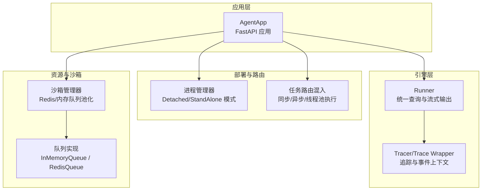
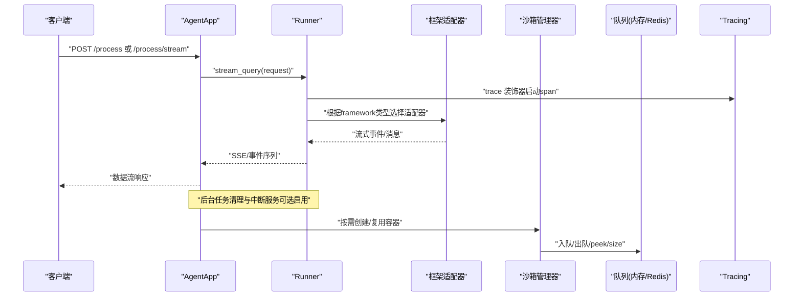
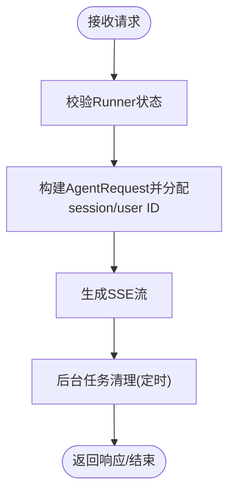
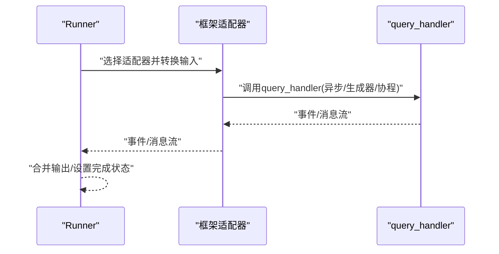
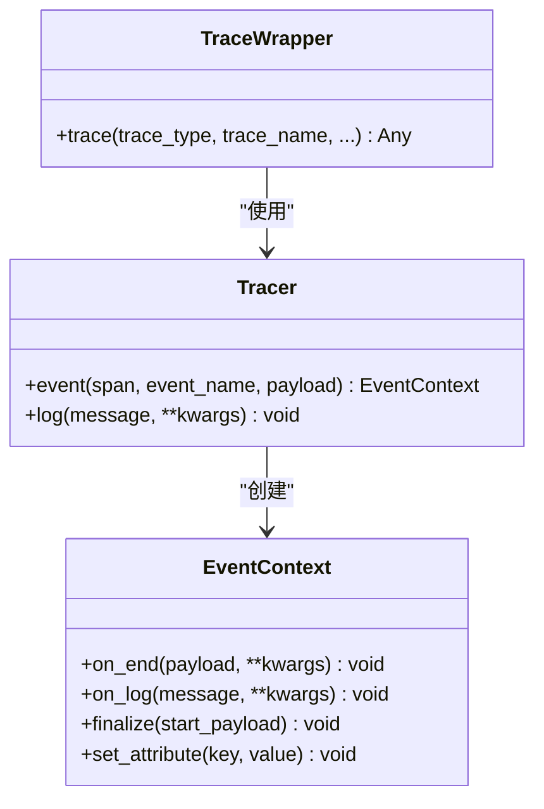
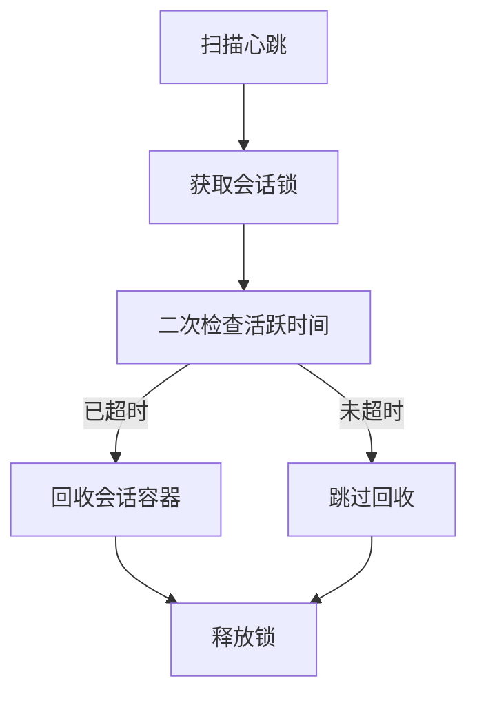
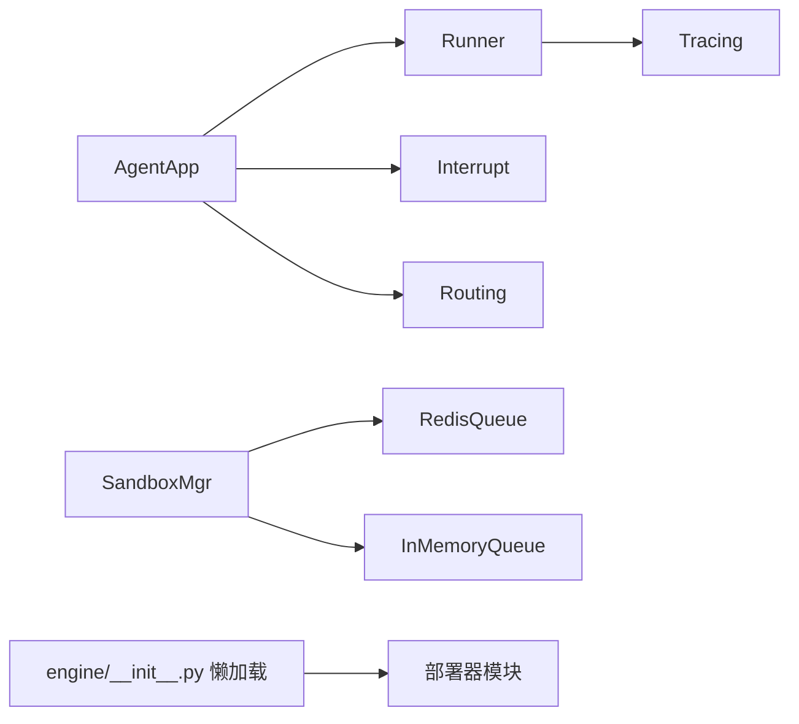
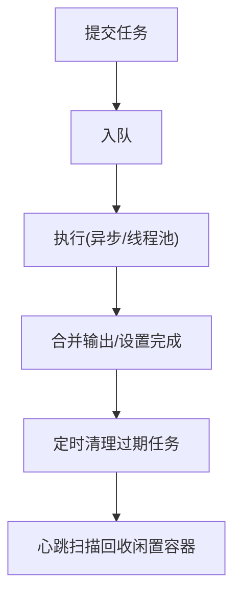

# 性能优化

<cite>
**本文引用的文件**
- [engine/app/agent_app.py](file://src/agentscope_runtime/engine/app/agent_app.py)
- [engine/runner.py](file://src/agentscope_runtime/engine/runner.py)
- [engine/tracing/base.py](file://src/agentscope_runtime/engine/tracing/base.py)
- [engine/tracing/wrapper.py](file://src/agentscope_runtime/engine/tracing/wrapper.py)
- [engine/tracing/tracing_metric.py](file://src/agentscope_runtime/engine/tracing/tracing_metric.py)
- [engine/deployers/utils/service_utils/process_manager.py](file://src/agentscope_runtime/engine/deployers/utils/service_utils/process_manager.py)
- [engine/deployers/utils/service_utils/routing/task_engine_mixin.py](file://src/agentscope_runtime/engine/deployers/utils/service_utils/routing/task_engine_mixin.py)
- [sandbox/manager/sandbox_manager.py](file://src/agentscope_runtime/sandbox/manager/sandbox_manager.py)
- [common/collections/in_memory_queue.py](file://src/agentscope_runtime/common/collections/in_memory_queue.py)
- [common/collections/redis_queue.py](file://src/agentscope_runtime/common/collections/redis_queue.py)
- [engine/__init__.py](file://src/agentscope_runtime/engine/__init__.py)
- [cookbook/en/advanced_deployment.md](file://cookbook/en/advanced_deployment.md)
- [cookbook/en/langgraph_guidelines.md](file://cookbook/en/langgraph_guidelines.md)
- [tests/deploy/test_pai_deployer.py](file://tests/deploy/test_pai_deployer.py)
</cite>

## 目录
1. [简介](#简介)
2. [项目结构](#项目结构)
3. [核心组件](#核心组件)
4. [架构总览](#架构总览)
5. [详细组件分析](#详细组件分析)
6. [依赖分析](#依赖分析)
7. [性能考量](#性能考量)
8. [故障排查指南](#故障排查指南)
9. [结论](#结论)
10. [附录](#附录)

## 简介
本文件面向AgentScope Runtime在生产环境中的性能优化，聚焦以下目标：
- 系统性能瓶颈识别与定位
- 内存管理优化与资源复用
- 并发处理优化与任务调度
- 缓存策略与连接池配置
- 性能监控指标与基准测试方法
- 大规模部署场景下的调优策略
- CPU、内存、网络等资源的优化配置
- 典型性能问题的诊断与解决案例

## 项目结构
AgentScope Runtime采用“引擎-运行器-适配器-沙箱”分层设计，核心入口通过FastAPI应用对外提供服务，内部通过Runner统一调度不同框架类型的代理执行，并以适配器支持多协议接入；沙箱管理器负责容器生命周期与资源池化；追踪模块提供端到端可观测性。

图表来源
- [engine/app/agent_app.py](file://src/agentscope_runtime/engine/app/agent_app.py)
- [engine/runner.py](file://src/agentscope_runtime/engine/runner.py)
- [engine/tracing/base.py](file://src/agentscope_runtime/engine/tracing/base.py)
- [engine/tracing/wrapper.py](file://src/agentscope_runtime/engine/tracing/wrapper.py)
- [engine/deployers/utils/service_utils/process_manager.py](file://src/agentscope_runtime/engine/deployers/utils/service_utils/process_manager.py)
- [engine/deployers/utils/service_utils/routing/task_engine_mixin.py](file://src/agentscope_runtime/engine/deployers/utils/service_utils/routing/task_engine_mixin.py)
- [sandbox/manager/sandbox_manager.py](file://src/agentscope_runtime/sandbox/manager/sandbox_manager.py)
- [common/collections/in_memory_queue.py](file://src/agentscope_runtime/common/collections/in_memory_queue.py)
- [common/collections/redis_queue.py](file://src/agentscope_runtime/common/collections/redis_queue.py)

章节来源
- [engine/app/agent_app.py](file://src/agentscope_runtime/engine/app/agent_app.py)
- [engine/runner.py](file://src/agentscope_runtime/engine/runner.py)
- [engine/tracing/base.py](file://src/agentscope_runtime/engine/tracing/base.py)
- [engine/tracing/wrapper.py](file://src/agentscope_runtime/engine/tracing/wrapper.py)
- [engine/deployers/utils/service_utils/process_manager.py](file://src/agentscope_runtime/engine/deployers/utils/service_utils/process_manager.py)
- [engine/deployers/utils/service_utils/routing/task_engine_mixin.py](file://src/agentscope_runtime/engine/deployers/utils/service_utils/routing/task_engine_mixin.py)
- [sandbox/manager/sandbox_manager.py](file://src/agentscope_runtime/sandbox/manager/sandbox_manager.py)
- [common/collections/in_memory_queue.py](file://src/agentscope_runtime/common/collections/in_memory_queue.py)
- [common/collections/redis_queue.py](file://src/agentscope_runtime/common/collections/redis_queue.py)

## 核心组件
- AgentApp：基于FastAPI的服务入口，集成路由、中断、协议适配、内置健康检查与任务清理等能力。
- Runner：统一的查询执行器，支持多框架适配（agentscope、langgraph、agno、ms_agent_framework），负责消息转换、流式输出与错误包装。
- Tracing：基于OpenTelemetry的追踪装饰器与事件上下文，记录首包延迟、结束原因、合并输出等关键指标。
- 沙箱管理器：容器池化与会话心跳回收，支持Redis/内存映射与队列，实现资源复用与闲置回收。
- 队列实现：InMemoryQueue与RedisQueue，用于任务排队与跨节点共享。
- 进程管理器：支持Detached/StandAlone模式的进程生命周期管理与日志轮转。

章节来源
- [engine/app/agent_app.py](file://src/agentscope_runtime/engine/app/agent_app.py)
- [engine/runner.py](file://src/agentscope_runtime/engine/runner.py)
- [engine/tracing/base.py](file://src/agentscope_runtime/engine/tracing/base.py)
- [engine/tracing/wrapper.py](file://src/agentscope_runtime/engine/tracing/wrapper.py)
- [sandbox/manager/sandbox_manager.py](file://src/agentscope_runtime/sandbox/manager/sandbox_manager.py)
- [common/collections/in_memory_queue.py](file://src/agentscope_runtime/common/collections/in_memory_queue.py)
- [common/collections/redis_queue.py](file://src/agentscope_runtime/common/collections/redis_queue.py)
- [engine/deployers/utils/service_utils/process_manager.py](file://src/agentscope_runtime/engine/deployers/utils/service_utils/process_manager.py)

## 架构总览
下图展示从请求进入AgentApp到Runner执行再到沙箱资源池化的整体流程，以及追踪与任务清理的关键节点。

图表来源
- [engine/app/agent_app.py](file://src/agentscope_runtime/engine/app/agent_app.py)
- [engine/runner.py](file://src/agentscope_runtime/engine/runner.py)
- [engine/tracing/wrapper.py](file://src/agentscope_runtime/engine/tracing/wrapper.py)
- [sandbox/manager/sandbox_manager.py](file://src/agentscope_runtime/sandbox/manager/sandbox_manager.py)
- [common/collections/in_memory_queue.py](file://src/agentscope_runtime/common/collections/in_memory_queue.py)
- [common/collections/redis_queue.py](file://src/agentscope_runtime/common/collections/redis_queue.py)

## 详细组件分析

### AgentApp：并发与任务清理
- 流式输出与SSE封装，支持中断后重试与分布式中断后端（Redis/本地）。
- 后台任务清理worker定期清理过期任务，避免内存泄漏。
- 提供健康检查、进程状态查询与优雅关闭接口，便于运维侧资源回收。

图表来源
- [engine/app/agent_app.py](file://src/agentscope_runtime/engine/app/agent_app.py)

章节来源
- [engine/app/agent_app.py](file://src/agentscope_runtime/engine/app/agent_app.py)

### Runner：多框架适配与流式执行
- 统一的stream_query入口，自动注入序列号、状态与最终输出合并。
- 支持agentscope、langgraph、agno、ms_agent_framework等框架的消息格式转换与流式适配。
- 错误包装为统一异常类型，便于追踪与上层处理。

图表来源
- [engine/runner.py](file://src/agentscope_runtime/engine/runner.py)

章节来源
- [engine/runner.py](file://src/agentscope_runtime/engine/runner.py)

### Tracing：可观测性与性能指标
- 基于OpenTelemetry的trace装饰器，自动记录首包延迟、最后响应、合并输出等属性。
- 事件上下文支持on_log/on_end，便于埋点与性能归因。

图表来源
- [engine/tracing/base.py](file://src/agentscope_runtime/engine/tracing/base.py)
- [engine/tracing/wrapper.py](file://src/agentscope_runtime/engine/tracing/wrapper.py)
- [engine/tracing/tracing_metric.py](file://src/agentscope_runtime/engine/tracing/tracing_metric.py)

章节来源
- [engine/tracing/base.py](file://src/agentscope_runtime/engine/tracing/base.py)
- [engine/tracing/wrapper.py](file://src/agentscope_runtime/engine/tracing/wrapper.py)
- [engine/tracing/tracing_metric.py](file://src/agentscope_runtime/engine/tracing/tracing_metric.py)

### 沙箱管理器：资源池化与回收
- 支持Redis/内存映射与队列，按类型维护容器池，空闲超时回收，降低冷启动成本。
- 心跳扫描与分布式锁配合，保证回收一致性。

图表来源
- [sandbox/manager/sandbox_manager.py](file://src/agentscope_runtime/sandbox/manager/sandbox_manager.py)

章节来源
- [sandbox/manager/sandbox_manager.py](file://src/agentscope_runtime/sandbox/manager/sandbox_manager.py)

### 队列实现：内存与Redis双栈
- InMemoryQueue：单机轻量队列，适合本地/小规模场景。
- RedisQueue：跨节点共享队列，适合分布式与高并发场景。

章节来源
- [common/collections/in_memory_queue.py](file://src/agentscope_runtime/common/collections/in_memory_queue.py)
- [common/collections/redis_queue.py](file://src/agentscope_runtime/common/collections/redis_queue.py)

### 进程管理器：部署模式与生命周期
- 支持Detached/StandAlone模式，提供PID文件、日志轮转、端口等待、进程信息查询等能力。
- 适用于大规模部署下的进程级资源控制与可观测性。

章节来源
- [engine/deployers/utils/service_utils/process_manager.py](file://src/agentscope_runtime/engine/deployers/utils/service_utils/process_manager.py)

### 任务执行与并发：线程池与异步混合
- 对同步/异步/生成器/协程函数进行统一包装，必要时使用ThreadPoolExecutor，避免阻塞事件循环。
- 适配器层对不同框架的消息流进行解耦，提升吞吐与稳定性。

章节来源
- [engine/deployers/utils/service_utils/routing/task_engine_mixin.py](file://src/agentscope_runtime/engine/deployers/utils/service_utils/routing/task_engine_mixin.py)

## 依赖分析
- AgentApp依赖Runner与多种协议适配器，同时集成中断服务与路由混入。
- Runner依赖适配器与追踪工具，向上提供统一的流式输出。
- 沙箱管理器依赖队列实现与Redis/内存映射，支撑容器池化。
- 引擎模块通过懒加载导入部署器，降低启动时依赖开销。

图表来源
- [engine/app/agent_app.py](file://src/agentscope_runtime/engine/app/agent_app.py)
- [engine/runner.py](file://src/agentscope_runtime/engine/runner.py)
- [engine/tracing/wrapper.py](file://src/agentscope_runtime/engine/tracing/wrapper.py)
- [sandbox/manager/sandbox_manager.py](file://src/agentscope_runtime/sandbox/manager/sandbox_manager.py)
- [engine/__init__.py](file://src/agentscope_runtime/engine/__init__.py)

章节来源
- [engine/app/agent_app.py](file://src/agentscope_runtime/engine/app/agent_app.py)
- [engine/runner.py](file://src/agentscope_runtime/engine/runner.py)
- [engine/tracing/wrapper.py](file://src/agentscope_runtime/engine/tracing/wrapper.py)
- [sandbox/manager/sandbox_manager.py](file://src/agentscope_runtime/sandbox/manager/sandbox_manager.py)
- [engine/__init__.py](file://src/agentscope_runtime/engine/__init__.py)

## 性能考量

### 系统性能瓶颈识别
- 端到端延迟：利用追踪装饰器记录首包延迟与最后响应，结合SSE流统计端到端耗时。
- 资源占用：AgentApp提供进程状态查询接口，可采集CPU、内存等指标。
- 框架适配：不同框架的消息转换与流式适配可能成为瓶颈，建议对热点路径做缓存与批量化。

章节来源
- [engine/tracing/wrapper.py](file://src/agentscope_runtime/engine/tracing/wrapper.py)
- [engine/app/agent_app.py](file://src/agentscope_runtime/engine/app/agent_app.py)

### 内存管理优化与资源复用
- 容器池化：沙箱管理器按类型维护热身容器队列，减少冷启动与上下文切换开销。
- 队列复用：Redis/内存队列在分布式与单机场景间灵活切换，避免重复创建连接。
- 任务清理：AgentApp后台任务清理worker定期回收过期任务，防止active_tasks膨胀。

章节来源
- [sandbox/manager/sandbox_manager.py](file://src/agentscope_runtime/sandbox/manager/sandbox_manager.py)
- [common/collections/redis_queue.py](file://src/agentscope_runtime/common/collections/redis_queue.py)
- [common/collections/in_memory_queue.py](file://src/agentscope_runtime/common/collections/in_memory_queue.py)
- [engine/app/agent_app.py](file://src/agentscope_runtime/engine/app/agent_app.py)

### 并发处理优化
- 异步优先：Runner对异步/生成器函数进行统一包装，减少阻塞。
- 线程池兜底：对同步函数使用线程池执行，避免阻塞事件循环。
- 中断与重试：分布式中断后端支持任务中断与恢复，提高长链路稳定性。

章节来源
- [engine/runner.py](file://src/agentscope_runtime/engine/runner.py)
- [engine/deployers/utils/service_utils/routing/task_engine_mixin.py](file://src/agentscope_runtime/engine/deployers/utils/service_utils/routing/task_engine_mixin.py)
- [engine/app/agent_app.py](file://src/agentscope_runtime/engine/app/agent_app.py)

### 缓存策略与连接池配置
- 查询缓存：可在应用层对常见查询结果进行缓存，结合智能更新策略。
- 结果缓存：对高质量搜索/检索结果进行缓存，降低重复计算。
- 连接池：Redis队列与映射使用连接池，建议根据并发与延迟要求调整池大小与超时。

章节来源
- [common/collections/redis_queue.py](file://src/agentscope_runtime/common/collections/redis_queue.py)
- [sandbox/manager/sandbox_manager.py](file://src/agentscope_runtime/sandbox/manager/sandbox_manager.py)

### 性能监控指标与基准测试
- 追踪指标：首包延迟、最后响应、合并输出、错误率、吞吐量。
- 进程指标：CPU使用率、内存RSS、进程存活状态。
- 基准测试：建议在本地与Kubernetes环境下分别进行压力测试，覆盖不同框架与并发场景。

章节来源
- [engine/tracing/wrapper.py](file://src/agentscope_runtime/engine/tracing/wrapper.py)
- [engine/app/agent_app.py](file://src/agentscope_runtime/engine/app/agent_app.py)

### 大规模部署场景下的调优策略
- 资源类型推断：PAI部署器支持公共/配额/资源三种类型推断，按需选择。
- 资源限制与请求：Kubernetes部署示例中设置CPU/内存requests/limits，保障QoS。
- 配置优先级：优先显式配置，其次通过上下文回退，确保部署一致性。

章节来源
- [tests/deploy/test_pai_deployer.py](file://tests/deploy/test_pai_deployer.py)
- [cookbook/en/advanced_deployment.md](file://cookbook/en/advanced_deployment.md)

### CPU、内存、网络优化配置
- CPU：合理设置requests/limits，避免过度抢占；对长任务启用中断与超时。
- 内存：启用任务清理与容器池化，避免内存碎片与泄漏；监控RSS与GC行为。
- 网络：Redis队列与映射建议内网访问与连接池复用；SSE流注意keep-alive与缓冲区设置。

章节来源
- [cookbook/en/advanced_deployment.md](file://cookbook/en/advanced_deployment.md)
- [engine/app/agent_app.py](file://src/agentscope_runtime/engine/app/agent_app.py)
- [sandbox/manager/sandbox_manager.py](file://src/agentscope_runtime/sandbox/manager/sandbox_manager.py)

## 故障排查指南

### 常见性能问题与定位
- 首包延迟高：检查追踪装饰器记录的首包延迟与框架适配器转换耗时。
- 吞吐下降：确认是否使用了线程池执行同步函数，以及Redis连接池是否饱和。
- 内存增长：检查AgentApp任务清理是否生效，以及沙箱容器回收策略。

章节来源
- [engine/tracing/wrapper.py](file://src/agentscope_runtime/engine/tracing/wrapper.py)
- [engine/deployers/utils/service_utils/routing/task_engine_mixin.py](file://src/agentscope_runtime/engine/deployers/utils/service_utils/routing/task_engine_mixin.py)
- [engine/app/agent_app.py](file://src/agentscope_runtime/engine/app/agent_app.py)
- [sandbox/manager/sandbox_manager.py](file://src/agentscope_runtime/sandbox/manager/sandbox_manager.py)

### 实际案例
- 框架集成案例：LangGraph示例展示了如何在AgentApp中注册查询函数并使用内存检查点与存储，便于定位长时任务与状态持久化开销。
- 部署配置案例：Kubernetes部署示例提供了CPU/内存requests/limits与环境变量配置，可作为性能调优的参考模板。

章节来源
- [cookbook/en/langgraph_guidelines.md](file://cookbook/en/langgraph_guidelines.md)
- [cookbook/en/advanced_deployment.md](file://cookbook/en/advanced_deployment.md)

## 结论
通过追踪可观测性、容器池化与队列复用、异步与线程池混合执行、以及大规模部署的资源配置与清理机制，AgentScope Runtime能够在多框架、多协议与多部署形态下实现稳定高效的性能表现。建议在生产环境中持续监控关键指标并迭代优化资源配额与连接池参数。

## 附录

### 关键流程图：任务执行与回收

图表来源
- [engine/app/agent_app.py](file://src/agentscope_runtime/engine/app/agent_app.py)
- [engine/deployers/utils/service_utils/routing/task_engine_mixin.py](file://src/agentscope_runtime/engine/deployers/utils/service_utils/routing/task_engine_mixin.py)
- [sandbox/manager/sandbox_manager.py](file://src/agentscope_runtime/sandbox/manager/sandbox_manager.py)