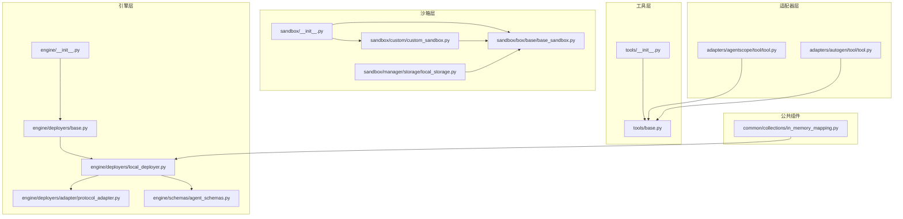
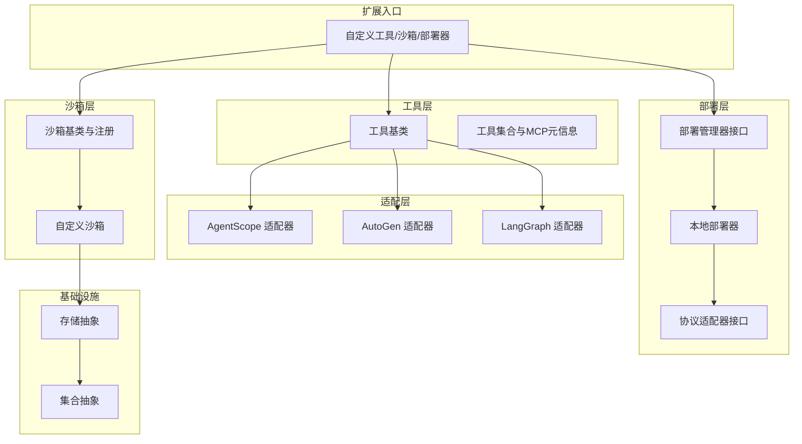
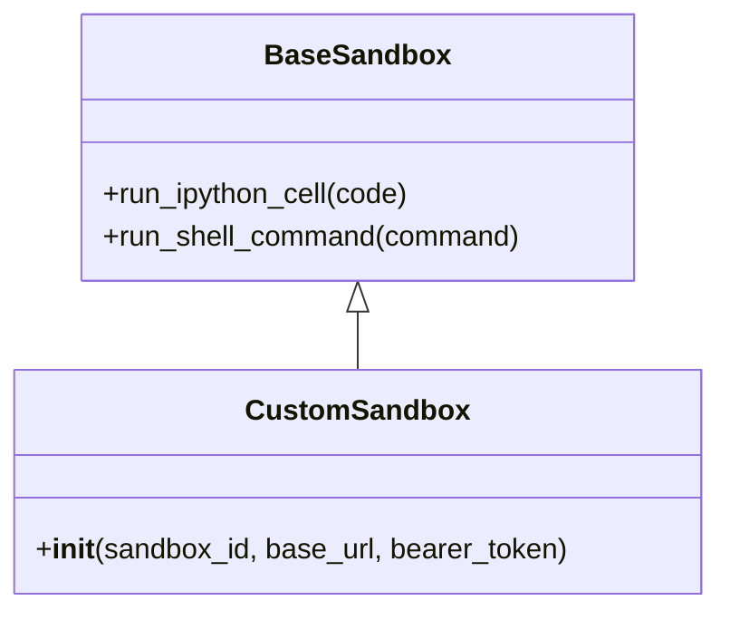
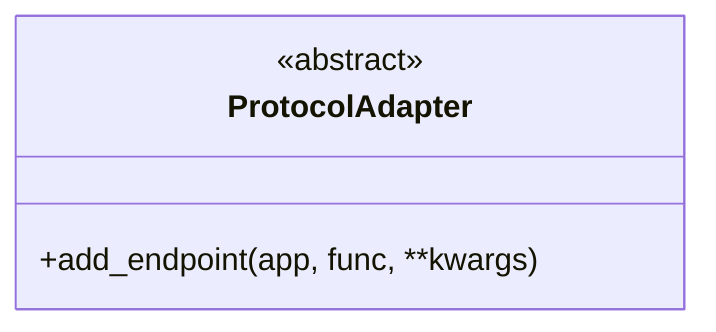
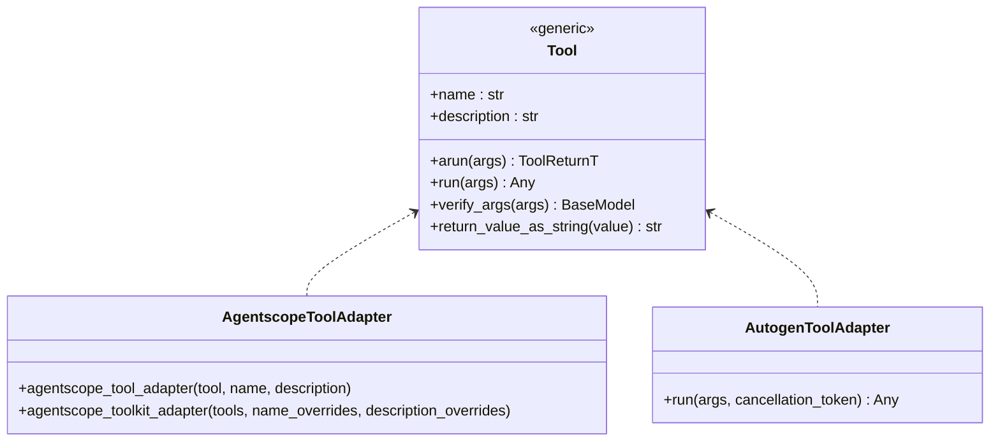
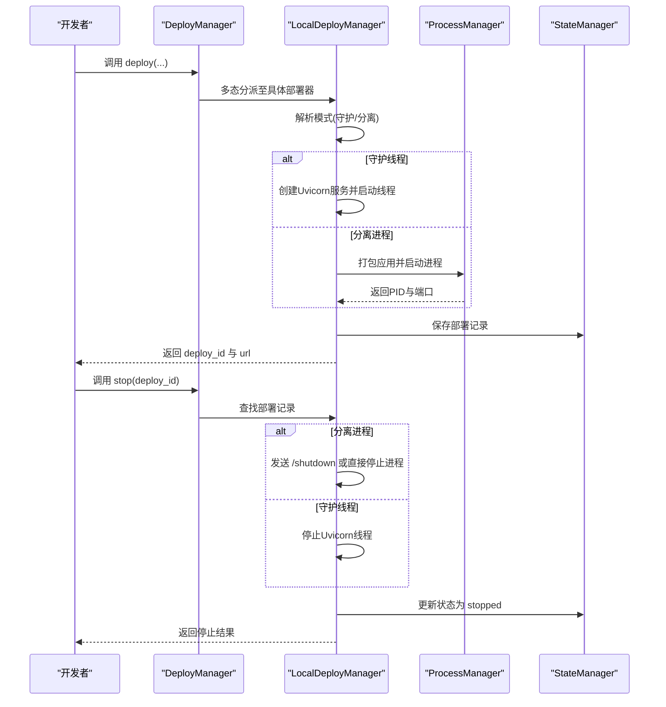
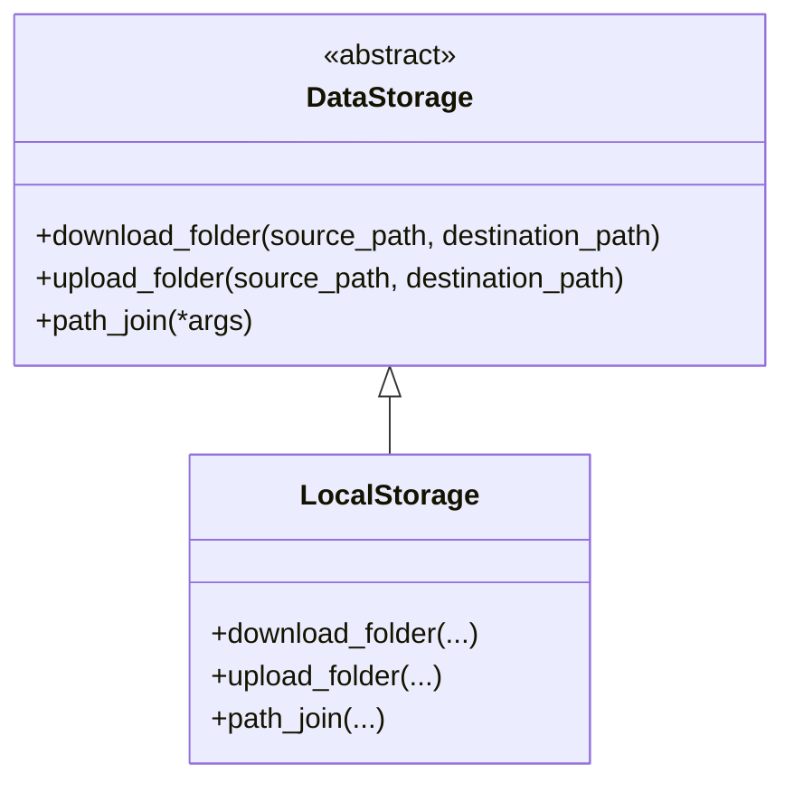
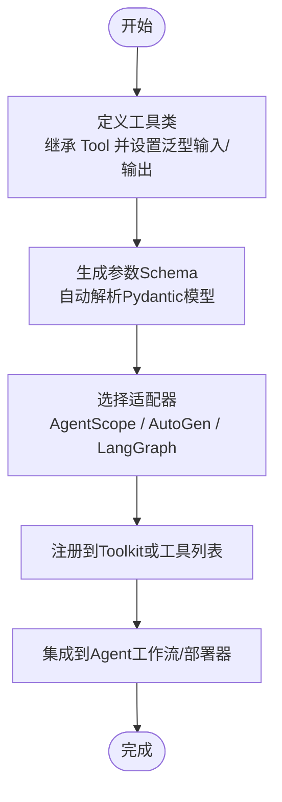
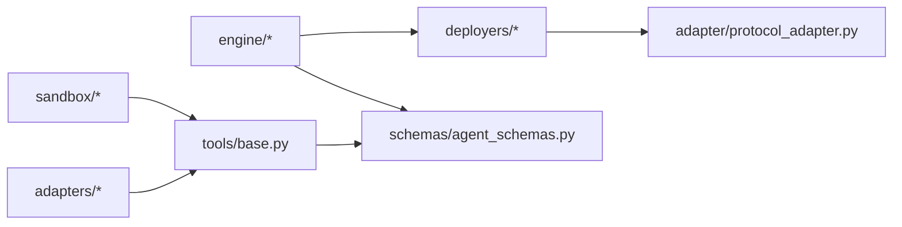

# 扩展开发

<cite>
**本文引用的文件**
- [src/agentscope_runtime/__init__.py](file://src/agentscope_runtime/__init__.py)
- [src/agentscope_runtime/engine/__init__.py](file://src/agentscope_runtime/engine/__init__.py)
- [src/agentscope_runtime/sandbox/__init__.py](file://src/agentscope_runtime/sandbox/__init__.py)
- [src/agentscope_runtime/tools/__init__.py](file://src/agentscope_runtime/tools/__init__.py)
- [src/agentscope_runtime/adapters/agentscope/tool/tool.py](file://src/agentscope_runtime/adapters/agentscope/tool/tool.py)
- [src/agentscope_runtime/adapters/autogen/tool/tool.py](file://src/agentscope_runtime/adapters/autogen/tool/tool.py)
- [src/agentscope_runtime/engine/deployers/base.py](file://src/agentscope_runtime/engine/deployers/base.py)
- [src/agentscope_runtime/engine/deployers/local_deployer.py](file://src/agentscope_runtime/engine/deployers/local_deployer.py)
- [src/agentscope_runtime/engine/deployers/adapter/protocol_adapter.py](file://src/agentscope_runtime/engine/deployers/adapter/protocol_adapter.py)
- [src/agentscope_runtime/sandbox/custom/custom_sandbox.py](file://src/agentscope_runtime/sandbox/custom/custom_sandbox.py)
- [src/agentscope_runtime/sandbox/box/base/base_sandbox.py](file://src/agentscope_runtime/sandbox/box/base/base_sandbox.py)
- [src/agentscope_runtime/tools/base.py](file://src/agentscope_runtime/tools/base.py)
- [src/agentscope_runtime/sandbox/manager/storage/local_storage.py](file://src/agentscope_runtime/sandbox/manager/storage/local_storage.py)
- [src/agentscope_runtime/common/collections/in_memory_mapping.py](file://src/agentscope_runtime/common/collections/in_memory_mapping.py)
- [src/agentscope_runtime/engine/schemas/agent_schemas.py](file://src/agentscope_runtime/engine/schemas/agent_schemas.py)
- [examples/sandbox/custom_sandbox/README.md](file://examples/sandbox/custom_sandbox/README.md)
</cite>

## 目录
1. [简介](#简介)
2. [项目结构](#项目结构)
3. [核心组件](#核心组件)
4. [架构总览](#架构总览)
5. [详细组件分析](#详细组件分析)
6. [依赖分析](#依赖分析)
7. [性能考虑](#性能考虑)
8. [故障排查指南](#故障排查指南)
9. [结论](#结论)
10. [附录](#附录)

## 简介
本文件面向AgentScope Runtime的扩展开发者，系统性阐述如何进行以下扩展与定制：
- 自定义沙箱（Sandbox）开发：从类继承、注册机制、镜像构建到运行时配置
- 协议适配器扩展：统一协议适配接口，接入不同平台或框架的消息/端点
- 工具库定制：基于通用工具基类，定义输入输出模式并适配到不同生态
- 部署器扩展：在本地/云/容器编排平台之上扩展新的部署方式
- 存储后端与消息适配：抽象存储接口与消息模型，便于替换实现
- 第三方服务集成与API适配：通过适配器桥接外部能力
- 开发规范与最佳实践：接口契约、测试策略、发布流程与示例路径

## 项目结构
AgentScope Runtime采用模块化分层组织：
- 引擎层（engine）：应用封装、Runner、部署管理器、状态管理、协议适配器
- 沙箱层（sandbox）：沙箱类型注册、基础沙箱、GUI/Browser/Filesystem/Mobile等沙箱、自定义沙箱
- 工具层（tools）：通用工具基类、具体工具集合、MCP服务元信息
- 适配器层（adapters）：对接AgentScope、AutoGen、LangGraph等生态的工具与消息适配
- 公共组件（common）：集合、客户端、工具函数
- 示例与文档（examples/cookbook）：自定义沙箱构建、部署示例与教程

**图示来源**
- [src/agentscope_runtime/engine/__init__.py:1-35](file://src/agentscope_runtime/engine/__init__.py#L1-L35)
- [src/agentscope_runtime/engine/deployers/base.py:1-44](file://src/agentscope_runtime/engine/deployers/base.py#L1-L44)
- [src/agentscope_runtime/engine/deployers/local_deployer.py:1-645](file://src/agentscope_runtime/engine/deployers/local_deployer.py#L1-L645)
- [src/agentscope_runtime/engine/deployers/adapter/protocol_adapter.py:1-25](file://src/agentscope_runtime/engine/deployers/adapter/protocol_adapter.py#L1-L25)
- [src/agentscope_runtime/engine/schemas/agent_schemas.py:1-800](file://src/agentscope_runtime/engine/schemas/agent_schemas.py#L1-L800)
- [src/agentscope_runtime/sandbox/__init__.py:1-33](file://src/agentscope_runtime/sandbox/__init__.py#L1-L33)
- [src/agentscope_runtime/sandbox/box/base/base_sandbox.py:1-102](file://src/agentscope_runtime/sandbox/box/base/base_sandbox.py#L1-L102)
- [src/agentscope_runtime/sandbox/custom/custom_sandbox.py:1-39](file://src/agentscope_runtime/sandbox/custom/custom_sandbox.py#L1-L39)
- [src/agentscope_runtime/sandbox/manager/storage/local_storage.py:1-45](file://src/agentscope_runtime/sandbox/manager/storage/local_storage.py#L1-L45)
- [src/agentscope_runtime/tools/__init__.py:1-120](file://src/agentscope_runtime/tools/__init__.py#L1-L120)
- [src/agentscope_runtime/tools/base.py:1-265](file://src/agentscope_runtime/tools/base.py#L1-L265)
- [src/agentscope_runtime/adapters/agentscope/tool/tool.py:1-232](file://src/agentscope_runtime/adapters/agentscope/tool/tool.py#L1-L232)
- [src/agentscope_runtime/adapters/autogen/tool/tool.py:1-212](file://src/agentscope_runtime/adapters/autogen/tool/tool.py#L1-L212)
- [src/agentscope_runtime/common/collections/in_memory_mapping.py:1-28](file://src/agentscope_runtime/common/collections/in_memory_mapping.py#L1-L28)

**章节来源**
- [src/agentscope_runtime/engine/__init__.py:1-35](file://src/agentscope_runtime/engine/__init__.py#L1-L35)
- [src/agentscope_runtime/sandbox/__init__.py:1-33](file://src/agentscope_runtime/sandbox/__init__.py#L1-L33)
- [src/agentscope_runtime/tools/__init__.py:1-120](file://src/agentscope_runtime/tools/__init__.py#L1-L120)

## 核心组件
- 工具基类与Schema：提供泛型输入/输出校验、参数Schema解析、同步/异步执行入口与字符串化返回值
- 沙箱基类与注册：通过装饰器注册沙箱类型，统一镜像URI、安全级别、超时与环境变量
- 部署管理器接口：抽象部署与停止操作，支持状态管理与多模式部署
- 协议适配器接口：统一添加端点的能力，便于扩展不同协议栈
- 适配器：将Runtime工具适配到AgentScope/AutoGen/LangGraph等生态

**章节来源**
- [src/agentscope_runtime/tools/base.py:1-265](file://src/agentscope_runtime/tools/base.py#L1-L265)
- [src/agentscope_runtime/engine/schemas/agent_schemas.py:1-800](file://src/agentscope_runtime/engine/schemas/agent_schemas.py#L1-L800)
- [src/agentscope_runtime/sandbox/box/base/base_sandbox.py:1-102](file://src/agentscope_runtime/sandbox/box/base/base_sandbox.py#L1-L102)
- [src/agentscope_runtime/engine/deployers/base.py:1-44](file://src/agentscope_runtime/engine/deployers/base.py#L1-L44)
- [src/agentscope_runtime/engine/deployers/adapter/protocol_adapter.py:1-25](file://src/agentscope_runtime/engine/deployers/adapter/protocol_adapter.py#L1-L25)
- [src/agentscope_runtime/adapters/agentscope/tool/tool.py:1-232](file://src/agentscope_runtime/adapters/agentscope/tool/tool.py#L1-L232)
- [src/agentscope_runtime/adapters/autogen/tool/tool.py:1-212](file://src/agentscope_runtime/adapters/autogen/tool/tool.py#L1-L212)

## 架构总览
下图展示了扩展开发的关键交互：工具通过适配器进入不同生态；部署器负责应用打包与运行；沙箱提供隔离执行环境；存储与集合组件支撑状态与数据。

**图示来源**
- [src/agentscope_runtime/adapters/agentscope/tool/tool.py:1-232](file://src/agentscope_runtime/adapters/agentscope/tool/tool.py#L1-L232)
- [src/agentscope_runtime/adapters/autogen/tool/tool.py:1-212](file://src/agentscope_runtime/adapters/autogen/tool/tool.py#L1-L212)
- [src/agentscope_runtime/tools/base.py:1-265](file://src/agentscope_runtime/tools/base.py#L1-L265)
- [src/agentscope_runtime/engine/deployers/base.py:1-44](file://src/agentscope_runtime/engine/deployers/base.py#L1-L44)
- [src/agentscope_runtime/engine/deployers/local_deployer.py:1-645](file://src/agentscope_runtime/engine/deployers/local_deployer.py#L1-L645)
- [src/agentscope_runtime/engine/deployers/adapter/protocol_adapter.py:1-25](file://src/agentscope_runtime/engine/deployers/adapter/protocol_adapter.py#L1-L25)
- [src/agentscope_runtime/sandbox/box/base/base_sandbox.py:1-102](file://src/agentscope_runtime/sandbox/box/base/base_sandbox.py#L1-L102)
- [src/agentscope_runtime/sandbox/custom/custom_sandbox.py:1-39](file://src/agentscope_runtime/sandbox/custom/custom_sandbox.py#L1-L39)
- [src/agentscope_runtime/sandbox/manager/storage/local_storage.py:1-45](file://src/agentscope_runtime/sandbox/manager/storage/local_storage.py#L1-L45)
- [src/agentscope_runtime/common/collections/in_memory_mapping.py:1-28](file://src/agentscope_runtime/common/collections/in_memory_mapping.py#L1-L28)

## 详细组件分析

### 自定义沙箱开发
- 继承与注册：自定义沙箱需继承基础沙箱类，并通过注册装饰器声明镜像URI、类型、安全级别、超时与环境变量
- 运行时配置：可通过环境变量注入第三方密钥或服务地址
- 示例路径：参见示例文档中的自定义沙箱构建步骤与Dockerfile准备

**图示来源**
- [src/agentscope_runtime/sandbox/box/base/base_sandbox.py:1-102](file://src/agentscope_runtime/sandbox/box/base/base_sandbox.py#L1-L102)
- [src/agentscope_runtime/sandbox/custom/custom_sandbox.py:1-39](file://src/agentscope_runtime/sandbox/custom/custom_sandbox.py#L1-L39)

**章节来源**
- [src/agentscope_runtime/sandbox/box/base/base_sandbox.py:1-102](file://src/agentscope_runtime/sandbox/box/base/base_sandbox.py#L1-L102)
- [src/agentscope_runtime/sandbox/custom/custom_sandbox.py:1-39](file://src/agentscope_runtime/sandbox/custom/custom_sandbox.py#L1-L39)
- [examples/sandbox/custom_sandbox/README.md:1-184](file://examples/sandbox/custom_sandbox/README.md#L1-L184)

### 协议适配器扩展
- 接口契约：ProtocolAdapter定义了统一的端点添加接口，子类需实现该方法以适配特定协议
- 使用场景：在部署器中注入协议适配器，动态挂载不同协议的端点

**图示来源**
- [src/agentscope_runtime/engine/deployers/adapter/protocol_adapter.py:1-25](file://src/agentscope_runtime/engine/deployers/adapter/protocol_adapter.py#L1-L25)

**章节来源**
- [src/agentscope_runtime/engine/deployers/adapter/protocol_adapter.py:1-25](file://src/agentscope_runtime/engine/deployers/adapter/protocol_adapter.py#L1-L25)

### 工具库定制与适配
- 工具基类：提供泛型输入/输出类型、参数Schema解析、同步/异步执行与结果字符串化
- AgentScope适配器：将Runtime工具包装为AgentScope可用的RegisteredToolFunction，自动做输入校验、异常捕获与结果格式化
- AutoGen适配器：将Runtime工具包装为AutoGen BaseTool，支持取消令牌与JSON序列化返回

**图示来源**
- [src/agentscope_runtime/tools/base.py:1-265](file://src/agentscope_runtime/tools/base.py#L1-L265)
- [src/agentscope_runtime/adapters/agentscope/tool/tool.py:1-232](file://src/agentscope_runtime/adapters/agentscope/tool/tool.py#L1-L232)
- [src/agentscope_runtime/adapters/autogen/tool/tool.py:1-212](file://src/agentscope_runtime/adapters/autogen/tool/tool.py#L1-L212)

**章节来源**
- [src/agentscope_runtime/tools/base.py:1-265](file://src/agentscope_runtime/tools/base.py#L1-L265)
- [src/agentscope_runtime/adapters/agentscope/tool/tool.py:1-232](file://src/agentscope_runtime/adapters/agentscope/tool/tool.py#L1-L232)
- [src/agentscope_runtime/adapters/autogen/tool/tool.py:1-212](file://src/agentscope_runtime/adapters/autogen/tool/tool.py#L1-L212)

### 部署器扩展与运行时控制
- 抽象接口：DeployManager定义部署与停止的抽象方法，统一状态管理
- 本地部署器：支持守护线程与分离进程两种模式，内置打包、日志清理、优雅停机与健康检查
- 扩展建议：新增部署器时遵循相同接口，复用状态管理与进程管理工具

**图示来源**
- [src/agentscope_runtime/engine/deployers/base.py:1-44](file://src/agentscope_runtime/engine/deployers/base.py#L1-L44)
- [src/agentscope_runtime/engine/deployers/local_deployer.py:1-645](file://src/agentscope_runtime/engine/deployers/local_deployer.py#L1-L645)

**章节来源**
- [src/agentscope_runtime/engine/deployers/base.py:1-44](file://src/agentscope_runtime/engine/deployers/base.py#L1-L44)
- [src/agentscope_runtime/engine/deployers/local_deployer.py:1-645](file://src/agentscope_runtime/engine/deployers/local_deployer.py#L1-L645)

### 存储后端与消息适配
- 存储抽象：DataStorage接口可扩展本地/对象存储等实现，提供目录下载/上传与路径拼接
- 消息模型：统一消息类型、内容类型、事件状态、工具调用与MCP消息结构，便于跨协议传输

**图示来源**
- [src/agentscope_runtime/sandbox/manager/storage/local_storage.py:1-45](file://src/agentscope_runtime/sandbox/manager/storage/local_storage.py#L1-L45)

**章节来源**
- [src/agentscope_runtime/sandbox/manager/storage/local_storage.py:1-45](file://src/agentscope_runtime/sandbox/manager/storage/local_storage.py#L1-L45)
- [src/agentscope_runtime/engine/schemas/agent_schemas.py:1-800](file://src/agentscope_runtime/engine/schemas/agent_schemas.py#L1-L800)

### 第三方服务集成与API适配
- 适配策略：通过工具基类定义输入输出Schema，再用适配器将工具暴露给目标生态（AgentScope/AutoGen/LangGraph）
- MCP服务元信息：工具集合可按MCP服务器维度聚合，统一描述与组件清单，便于外部系统发现与调用

**图示来源**
- [src/agentscope_runtime/tools/base.py:1-265](file://src/agentscope_runtime/tools/base.py#L1-L265)
- [src/agentscope_runtime/tools/__init__.py:1-120](file://src/agentscope_runtime/tools/__init__.py#L1-L120)
- [src/agentscope_runtime/adapters/agentscope/tool/tool.py:1-232](file://src/agentscope_runtime/adapters/agentscope/tool/tool.py#L1-L232)
- [src/agentscope_runtime/adapters/autogen/tool/tool.py:1-212](file://src/agentscope_runtime/adapters/autogen/tool/tool.py#L1-L212)

**章节来源**
- [src/agentscope_runtime/tools/__init__.py:1-120](file://src/agentscope_runtime/tools/__init__.py#L1-L120)
- [src/agentscope_runtime/adapters/agentscope/tool/tool.py:1-232](file://src/agentscope_runtime/adapters/agentscope/tool/tool.py#L1-L232)
- [src/agentscope_runtime/adapters/autogen/tool/tool.py:1-212](file://src/agentscope_runtime/adapters/autogen/tool/tool.py#L1-L212)

## 依赖分析
- 模块耦合：引擎层对部署器与协议适配器存在强依赖；沙箱层通过注册机制与工具层弱耦合；适配器层与工具层松耦合
- 可能的循环依赖：当前结构未见循环导入；注意在新增适配器或部署器时避免反向依赖
- 外部依赖：部署器使用uvicorn、requests、celery等；工具层使用pydantic；适配器根据目标生态引入相应库

**图示来源**
- [src/agentscope_runtime/engine/deployers/local_deployer.py:1-645](file://src/agentscope_runtime/engine/deployers/local_deployer.py#L1-L645)
- [src/agentscope_runtime/engine/deployers/adapter/protocol_adapter.py:1-25](file://src/agentscope_runtime/engine/deployers/adapter/protocol_adapter.py#L1-L25)
- [src/agentscope_runtime/engine/schemas/agent_schemas.py:1-800](file://src/agentscope_runtime/engine/schemas/agent_schemas.py#L1-L800)
- [src/agentscope_runtime/sandbox/box/base/base_sandbox.py:1-102](file://src/agentscope_runtime/sandbox/box/base/base_sandbox.py#L1-L102)
- [src/agentscope_runtime/tools/base.py:1-265](file://src/agentscope_runtime/tools/base.py#L1-L265)
- [src/agentscope_runtime/adapters/agentscope/tool/tool.py:1-232](file://src/agentscope_runtime/adapters/agentscope/tool/tool.py#L1-L232)
- [src/agentscope_runtime/adapters/autogen/tool/tool.py:1-212](file://src/agentscope_runtime/adapters/autogen/tool/tool.py#L1-L212)

**章节来源**
- [src/agentscope_runtime/engine/deployers/local_deployer.py:1-645](file://src/agentscope_runtime/engine/deployers/local_deployer.py#L1-L645)
- [src/agentscope_runtime/sandbox/box/base/base_sandbox.py:1-102](file://src/agentscope_runtime/sandbox/box/base/base_sandbox.py#L1-L102)
- [src/agentscope_runtime/tools/base.py:1-265](file://src/agentscope_runtime/tools/base.py#L1-L265)

## 性能考虑
- 工具执行：异步优先，必要时使用线程池桥接事件循环；输入/输出严格Schema可减少运行期校验开销
- 部署器：分离进程模式适合长生命周期服务；守护线程模式适合短任务与测试；合理设置启动/关闭超时
- 沙箱：镜像层缓存与最小化依赖，避免重复安装；环境变量注入敏感信息时注意权限与网络策略
- 存储：批量复制/上传时使用流式或分块策略，避免内存峰值

## 故障排查指南
- 部署失败：检查启动超时、端口占用、日志文件与进程状态；分离进程模式可通过PID文件定位
- 工具执行错误：确认输入Schema匹配、异常被捕获并返回标准错误格式；必要时开启调试日志
- 沙箱连接问题：核对镜像标签、网络代理与超时设置；验证环境变量是否正确注入
- 适配器不兼容：确保目标生态版本与适配器要求一致；必要时降级或切换适配器

**章节来源**
- [src/agentscope_runtime/engine/deployers/local_deployer.py:415-510](file://src/agentscope_runtime/engine/deployers/local_deployer.py#L415-L510)
- [src/agentscope_runtime/adapters/agentscope/tool/tool.py:59-143](file://src/agentscope_runtime/adapters/agentscope/tool/tool.py#L59-L143)
- [src/agentscope_runtime/sandbox/custom/custom_sandbox.py:1-39](file://src/agentscope_runtime/sandbox/custom/custom_sandbox.py#L1-L39)

## 结论
AgentScope Runtime提供了清晰的扩展点：工具基类与适配器保证生态互通；部署器与协议适配器提供灵活的运行时控制；沙箱注册机制简化了环境定制；消息与Schema抽象统一了跨协议的数据结构。遵循本文的接口契约与最佳实践，可快速实现自定义沙箱、协议适配器、工具库与部署器扩展，并稳定地集成第三方服务。

## 附录
- 开发框架使用
  - 工具开发：继承工具基类，定义泛型输入/输出，利用参数Schema与验证工具
  - 沙箱开发：继承基础沙箱，使用注册装饰器声明元信息，准备对应Docker镜像
  - 部署器扩展：实现部署/停止接口，复用状态管理与进程管理工具
  - 适配器扩展：实现协议适配器接口，或复用现有AgentScope/AutoGen适配器
- 测试策略
  - 工具：单元测试覆盖输入校验、异常分支与返回格式
  - 沙箱：集成测试验证镜像构建、环境变量与工具调用
  - 部署器：集成测试覆盖守护线程/分离进程模式与优雅停机
  - 适配器：端到端测试验证生态间工具调用链路
- 发布流程
  - 代码审查与单元测试通过
  - 集成测试与示例验证
  - 文档更新与示例补充
  - 版本号与变更日志更新