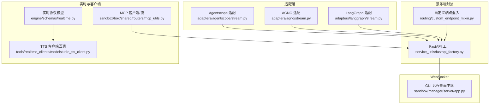
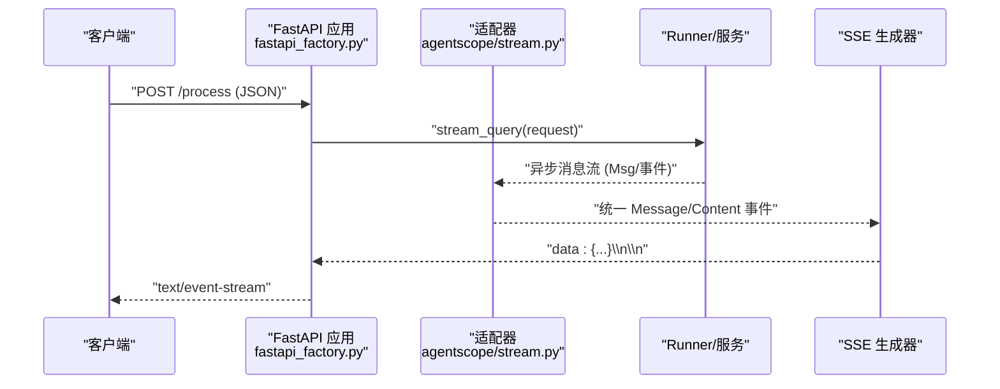
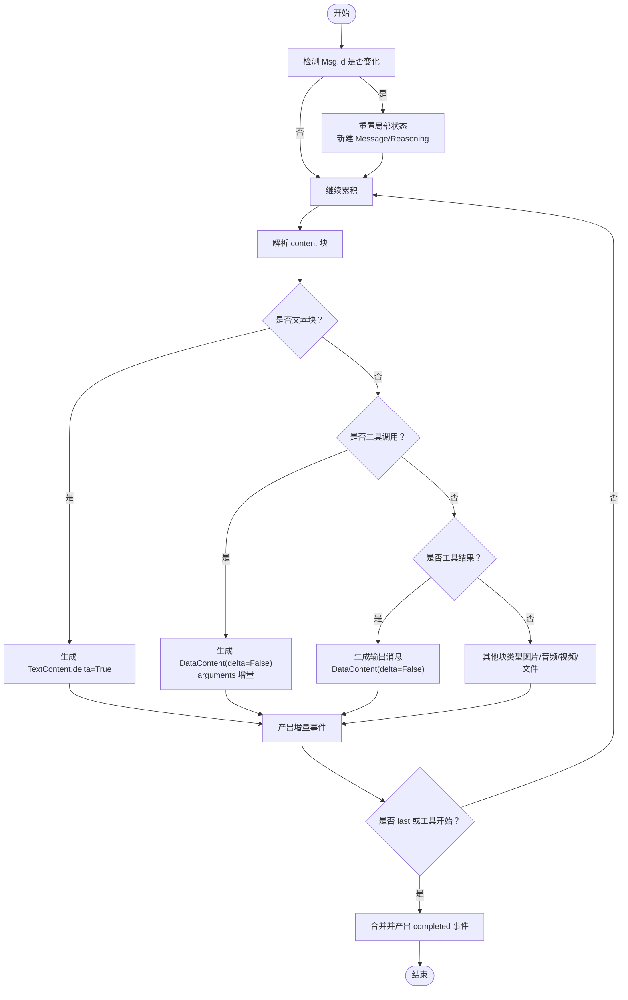
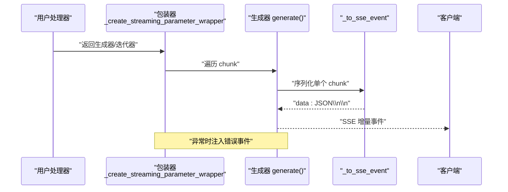
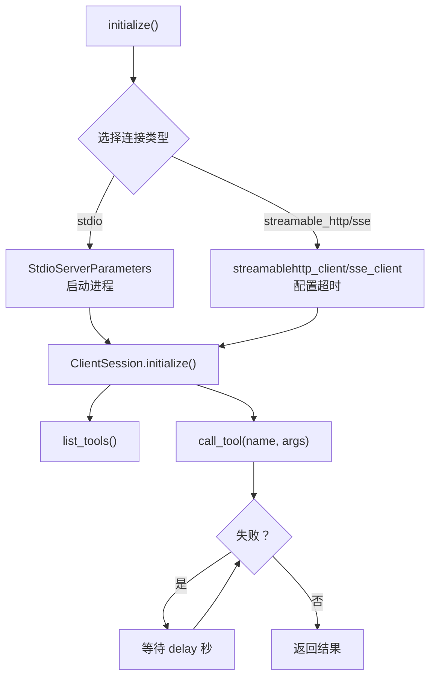
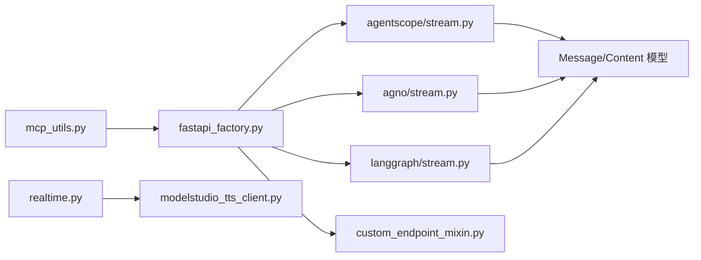

# 流式处理

<cite>
**本文引用的文件**
- [src/agentscope_runtime/adapters/agentscope/stream.py](file://src/agentscope_runtime/adapters/agentscope/stream.py)
- [src/agentscope_runtime/adapters/agno/stream.py](file://src/agentscope_runtime/adapters/agno/stream.py)
- [src/agentscope_runtime/adapters/langgraph/stream.py](file://src/agentscope_runtime/adapters/langgraph/stream.py)
- [src/agentscope_runtime/engine/deployers/utils/service_utils/fastapi_factory.py](file://src/agentscope_runtime/engine/deployers/utils/service_utils/fastapi_factory.py)
- [src/agentscope_runtime/engine/deployers/utils/service_utils/routing/custom_endpoint_mixin.py](file://src/agentscope_runtime/engine/deployers/utils/service_utils/routing/custom_endpoint_mixin.py)
- [src/agentscope_runtime/sandbox/box/shared/routers/mcp_utils.py](file://src/agentscope_runtime/sandbox/box/shared/routers/mcp_utils.py)
- [src/agentscope_runtime/tools/realtime_clients/modelstudio_tts_client.py](file://src/agentscope_runtime/tools/realtime_clients/modelstudio_tts_client.py)
- [src/agentscope_runtime/engine/schemas/realtime.py](file://src/agentscope_runtime/engine/schemas/realtime.py)
- [src/agentscope_runtime/sandbox/manager/server/app.py](file://src/agentscope_runtime/sandbox/manager/server/app.py)
- [tests/integrated/test_runner_stream_agentscope.py](file://tests/integrated/test_runner_stream_agentscope.py)
- [tests/integrated/test_agent_app_stream_task.py](file://tests/integrated/test_agent_app_stream_task.py)
- [tests/unit/test_agent_app_custom_endpoint.py](file://tests/unit/test_agent_app_custom_endpoint.py)
- [tests/unit/test_mcp_utils_streamable_http_timeout.py](file://tests/unit/test_mcp_utils_streamable_http_timeout.py)
- [cookbook/zh/protocol.md](file://cookbook/zh/protocol.md)
- [cookbook/zh/tracing.md](file://cookbook/zh/tracing.md)
</cite>

## 目录
1. [简介](#简介)
2. [项目结构](#项目结构)
3. [核心组件](#核心组件)
4. [架构总览](#架构总览)
5. [详细组件分析](#详细组件分析)
6. [依赖分析](#依赖分析)
7. [性能考虑](#性能考虑)
8. [故障排除指南](#故障排除指南)
9. [结论](#结论)
10. [附录](#附录)

## 简介
本文件聚焦于 AgentScope Runtime 的流式处理能力，覆盖以下关键主题：
- SSE（Server-Sent Events）流式传输：服务端到客户端的单向事件推送，用于实时文本、工具调用、推理过程等增量输出。
- WebSocket 实时通信：用于交互式音视频通话、远程桌面等双向实时场景。
- 异步消息处理：适配不同框架（Agentscope、AGNO、LangGraph）的消息流，统一为标准化的流式事件模型。
- 数据格式与序列化：SSE 事件行格式、JSON 序列化策略、深度对象兼容处理。
- 错误处理：流式处理器中的异常捕获与错误事件发送。
- 应用场景：流式工具调用、实时响应、状态更新、后台任务队列。
- 高并发优化：连接池、超时配置、背压与限流建议。
- 监控与调试：追踪装饰器、日志与报告、单元与集成测试。

## 项目结构
围绕流式处理的关键目录与文件：
- 适配层：将各框架的消息流转换为统一的流式事件模型
  - Agentscope 适配：[src/agentscope_runtime/adapters/agentscope/stream.py](file://src/agentscope_runtime/adapters/agentscope/stream.py)
  - AGNO 适配：[src/agentscope_runtime/adapters/agno/stream.py](file://src/agentscope_runtime/adapters/agno/stream.py)
  - LangGraph 适配：[src/agentscope_runtime/adapters/langgraph/stream.py](file://src/agentscope_runtime/adapters/langgraph/stream.py)
- 服务端流式封装：SSE 事件生成、参数包装、错误注入
  - FastAPI 工厂：[src/agentscope_runtime/engine/deployers/utils/service_utils/fastapi_factory.py](file://src/agentscope_runtime/engine/deployers/utils/service_utils/fastapi_factory.py)
  - 自定义端点混入：[src/agentscope_runtime/engine/deployers/utils/service_utils/routing/custom_endpoint_mixin.py](file://src/agentscope_runtime/engine/deployers/utils/service_utils/routing/custom_endpoint_mixin.py)
- 实时客户端与协议
  - MCP 客户端与 SSE/HTTP 流：[src/agentscope_runtime/sandbox/box/shared/routers/mcp_utils.py](file://src/agentscope_runtime/sandbox/box/shared/routers/mcp_utils.py)
  - 实时语音协议模型：[src/agentscope_runtime/engine/schemas/realtime.py](file://src/agentscope_runtime/engine/schemas/realtime.py)
  - TTS 客户端事件回调：[src/agentscope_runtime/tools/realtime_clients/modelstudio_tts_client.py](file://src/agentscope_runtime/tools/realtime_clients/modelstudio_tts_client.py)
- WebSocket 中继
  - GUI 远程桌面 WebSocket 中继：[src/agentscope_runtime/sandbox/manager/server/app.py](file://src/agentscope_runtime/sandbox/manager/server/app.py)
- 测试与示例
  - Runner 流式集成测试：[tests/integrated/test_runner_stream_agentscope.py](file://tests/integrated/test_runner_stream_agentscope.py)
  - AgentApp 流式任务测试：[tests/integrated/test_agent_app_stream_task.py](file://tests/integrated/test_agent_app_stream_task.py)
  - SSE 自定义端点与错误测试：[tests/unit/test_agent_app_custom_endpoint.py](file://tests/unit/test_agent_app_custom_endpoint.py)
  - MCP 流式 HTTP 超时测试：[tests/unit/test_mcp_utils_streamable_http_timeout.py](file://tests/unit/test_mcp_utils_streamable_http_timeout.py)
- 协议与追踪
  - 流式协议示例与状态转换：[cookbook/zh/protocol.md](file://cookbook/zh/protocol.md)
  - 追踪与日志：[cookbook/zh/tracing.md](file://cookbook/zh/tracing.md)

图表来源
- [src/agentscope_runtime/adapters/agentscope/stream.py:33-684](file://src/agentscope_runtime/adapters/agentscope/stream.py#L33-L684)
- [src/agentscope_runtime/adapters/agno/stream.py:32-124](file://src/agentscope_runtime/adapters/agno/stream.py#L32-L124)
- [src/agentscope_runtime/adapters/langgraph/stream.py:28-257](file://src/agentscope_runtime/adapters/langgraph/stream.py#L28-L257)
- [src/agentscope_runtime/engine/deployers/utils/service_utils/fastapi_factory.py:454-725](file://src/agentscope_runtime/engine/deployers/utils/service_utils/fastapi_factory.py#L454-L725)
- [src/agentscope_runtime/engine/deployers/utils/service_utils/routing/custom_endpoint_mixin.py:157-206](file://src/agentscope_runtime/engine/deployers/utils/service_utils/routing/custom_endpoint_mixin.py#L157-L206)
- [src/agentscope_runtime/sandbox/box/shared/routers/mcp_utils.py:32-188](file://src/agentscope_runtime/sandbox/box/shared/routers/mcp_utils.py#L32-L188)
- [src/agentscope_runtime/engine/schemas/realtime.py:1-255](file://src/agentscope_runtime/engine/schemas/realtime.py#L1-L255)
- [src/agentscope_runtime/tools/realtime_clients/modelstudio_tts_client.py:130-169](file://src/agentscope_runtime/tools/realtime_clients/modelstudio_tts_client.py#L130-L169)
- [src/agentscope_runtime/sandbox/manager/server/app.py:297-333](file://src/agentscope_runtime/sandbox/manager/server/app.py#L297-L333)

章节来源
- [src/agentscope_runtime/adapters/agentscope/stream.py:33-684](file://src/agentscope_runtime/adapters/agentscope/stream.py#L33-L684)
- [src/agentscope_runtime/adapters/agno/stream.py:32-124](file://src/agentscope_runtime/adapters/agno/stream.py#L32-L124)
- [src/agentscope_runtime/adapters/langgraph/stream.py:28-257](file://src/agentscope_runtime/adapters/langgraph/stream.py#L28-L257)
- [src/agentscope_runtime/engine/deployers/utils/service_utils/fastapi_factory.py:454-725](file://src/agentscope_runtime/engine/deployers/utils/service_utils/fastapi_factory.py#L454-L725)
- [src/agentscope_runtime/engine/deployers/utils/service_utils/routing/custom_endpoint_mixin.py:157-206](file://src/agentscope_runtime/engine/deployers/utils/service_utils/routing/custom_endpoint_mixin.py#L157-L206)
- [src/agentscope_runtime/sandbox/box/shared/routers/mcp_utils.py:32-188](file://src/agentscope_runtime/sandbox/box/shared/routers/mcp_utils.py#L32-L188)
- [src/agentscope_runtime/engine/schemas/realtime.py:1-255](file://src/agentscope_runtime/engine/schemas/realtime.py#L1-L255)
- [src/agentscope_runtime/tools/realtime_clients/modelstudio_tts_client.py:130-169](file://src/agentscope_runtime/tools/realtime_clients/modelstudio_tts_client.py#L130-L169)
- [src/agentscope_runtime/sandbox/manager/server/app.py:297-333](file://src/agentscope_runtime/sandbox/manager/server/app.py#L297-L333)

## 核心组件
- 流式适配器
  - Agentscope 适配器：将 Msg 流转换为统一的 Message/Content 事件，支持文本增量、推理内容、工具调用与结果等。
  - AGNO 适配器：将 Run* 事件转换为统一消息与内容事件。
  - LangGraph 适配器：将 BaseMessage 流转换为统一消息事件，支持工具调用分片聚合。
- SSE 事件生成与参数包装
  - 统一的 _to_sse_event 序列化器，支持 BaseModel、dataclass、嵌套结构与深度限制。
  - 包装异步/同步生成器为 StreamingResponse，捕获异常并注入错误事件。
- MCP 客户端与流式 HTTP/SSE
  - 支持 stdio、streamable_http、sse 三种连接方式，带超时与读取超时配置。
- 实时协议与客户端
  - 实时语音/视频参数模型与事件枚举。
  - TTS 客户端回调 on_event/on_data/on_error/on_close。
- WebSocket 中继
  - 将客户端 WebSocket 请求转发至目标服务地址，支持查询参数拼接。

章节来源
- [src/agentscope_runtime/adapters/agentscope/stream.py:33-684](file://src/agentscope_runtime/adapters/agentscope/stream.py#L33-L684)
- [src/agentscope_runtime/adapters/agno/stream.py:32-124](file://src/agentscope_runtime/adapters/agno/stream.py#L32-L124)
- [src/agentscope_runtime/adapters/langgraph/stream.py:28-257](file://src/agentscope_runtime/adapters/langgraph/stream.py#L28-L257)
- [src/agentscope_runtime/engine/deployers/utils/service_utils/fastapi_factory.py:696-725](file://src/agentscope_runtime/engine/deployers/utils/service_utils/fastapi_factory.py#L696-L725)
- [src/agentscope_runtime/engine/deployers/utils/service_utils/fastapi_factory.py:759-801](file://src/agentscope_runtime/engine/deployers/utils/service_utils/fastapi_factory.py#L759-L801)
- [src/agentscope_runtime/sandbox/box/shared/routers/mcp_utils.py:32-188](file://src/agentscope_runtime/sandbox/box/shared/routers/mcp_utils.py#L32-L188)
- [src/agentscope_runtime/engine/schemas/realtime.py:1-255](file://src/agentscope_runtime/engine/schemas/realtime.py#L1-L255)
- [src/agentscope_runtime/tools/realtime_clients/modelstudio_tts_client.py:130-169](file://src/agentscope_runtime/tools/realtime_clients/modelstudio_tts_client.py#L130-L169)
- [src/agentscope_runtime/sandbox/manager/server/app.py:297-333](file://src/agentscope_runtime/sandbox/manager/server/app.py#L297-L333)

## 架构总览
下图展示了从请求进入、适配器转换、SSE 事件生成，到客户端消费的整体链路。

图表来源
- [src/agentscope_runtime/engine/deployers/utils/service_utils/fastapi_factory.py:454-469](file://src/agentscope_runtime/engine/deployers/utils/service_utils/fastapi_factory.py#L454-L469)
- [src/agentscope_runtime/engine/deployers/utils/service_utils/fastapi_factory.py:597-626](file://src/agentscope_runtime/engine/deployers/utils/service_utils/fastapi_factory.py#L597-L626)
- [src/agentscope_runtime/adapters/agentscope/stream.py:33-684](file://src/agentscope_runtime/adapters/agentscope/stream.py#L33-L684)

## 详细组件分析

### Agentscope 流式适配器
- 功能要点
  - 识别新消息（按 Msg.id），初始化 Message/Reasoning 消息。
  - 文本增量：每次产生 TextContent.delta=True，最后合并为 completed。
  - 推理内容：同文本增量，但属于 MessageType.REASONING。
  - 工具调用：根据工具类型（MCP/Plugin）生成 DataContent，支持 arguments 增量与最终 completed。
  - 工具结果：生成 MessageType.PLUGIN_CALL_OUTPUT 或 MessageType.MCP_TOOL_CALL_OUTPUT。
  - 自定义类型转换器：type_converters 可扩展支持图片/音频/视频/文件等块类型。
- 复杂度与性能
  - 时间复杂度近似 O(N)（N 为消息块数），空间开销主要在局部缓存与增量拼接。
  - deep copy 与增量拼接避免对原始消息对象的副作用。
- 错误处理
  - type_converters 返回值必须是生成器或异步生成器，否则抛出 TypeError。
- 典型调用路径
  - Runner.stream_query -> agentscope/stream.py -> SSE 事件

图表来源
- [src/agentscope_runtime/adapters/agentscope/stream.py:33-684](file://src/agentscope_runtime/adapters/agentscope/stream.py#L33-L684)

章节来源
- [src/agentscope_runtime/adapters/agentscope/stream.py:33-684](file://src/agentscope_runtime/adapters/agentscope/stream.py#L33-L684)

### AGNO 流式适配器
- 功能要点
  - 将 RunStarted/RunContent/RunContentCompleted/ToolCallStarted/ToolCallCompleted 等事件映射为统一消息与内容事件。
  - 支持推理内容与普通内容区分。
- 适用场景
  - AGNO 框架的运行事件流转换为标准流式事件。

章节来源
- [src/agentscope_runtime/adapters/agno/stream.py:32-124](file://src/agentscope_runtime/adapters/agno/stream.py#L32-L124)

### LangGraph 流式适配器
- 功能要点
  - 识别 HumanMessage/AIMessage/SystemMessage/ToolMessage。
  - 支持工具调用分片聚合，最后合并为完整工具调用列表。
  - 文本内容增量输出，最后完成消息。
- 适用场景
  - LangGraph 的消息流转换为统一事件。

章节来源
- [src/agentscope_runtime/adapters/langgraph/stream.py:28-257](file://src/agentscope_runtime/adapters/langgraph/stream.py#L28-L257)

### SSE 事件生成与参数包装
- 序列化策略
  - _to_sse_event：递归序列化，支持 BaseModel、dataclass、嵌套容器；超过深度阈值返回安全字符串。
  - 生成 data: JSON\n\n 结构。
- 参数包装
  - _create_streaming_parameter_wrapper：为异步/同步生成器创建包装，确保 FastAPI 正确识别协程与签名。
  - 捕获异常并注入错误事件（error/error_type/message）。
- 自定义端点
  - CustomEndpointMixin 提供相同机制，便于扩展自定义路由。

图表来源
- [src/agentscope_runtime/engine/deployers/utils/service_utils/fastapi_factory.py:696-725](file://src/agentscope_runtime/engine/deployers/utils/service_utils/fastapi_factory.py#L696-L725)
- [src/agentscope_runtime/engine/deployers/utils/service_utils/fastapi_factory.py:759-801](file://src/agentscope_runtime/engine/deployers/utils/service_utils/fastapi_factory.py#L759-L801)
- [src/agentscope_runtime/engine/deployers/utils/service_utils/routing/custom_endpoint_mixin.py:157-206](file://src/agentscope_runtime/engine/deployers/utils/service_utils/routing/custom_endpoint_mixin.py#L157-L206)

章节来源
- [src/agentscope_runtime/engine/deployers/utils/service_utils/fastapi_factory.py:696-725](file://src/agentscope_runtime/engine/deployers/utils/service_utils/fastapi_factory.py#L696-L725)
- [src/agentscope_runtime/engine/deployers/utils/service_utils/fastapi_factory.py:759-801](file://src/agentscope_runtime/engine/deployers/utils/service_utils/fastapi_factory.py#L759-L801)
- [src/agentscope_runtime/engine/deployers/utils/service_utils/routing/custom_endpoint_mixin.py:157-206](file://src/agentscope_runtime/engine/deployers/utils/service_utils/routing/custom_endpoint_mixin.py#L157-L206)

### MCP 客户端与流式 HTTP/SSE
- 连接方式
  - stdio：通过命令行启动服务器进程。
  - streamable_http/sse：通过 HTTP SSE 流接入，支持超时与 SSE 读取超时。
- 超时配置
  - 默认 timeout=30s，sse_read_timeout=300s；支持传入非数值回退到默认。
- 工具调用
  - 列表工具、调用工具（含重试与延迟）。

图表来源
- [src/agentscope_runtime/sandbox/box/shared/routers/mcp_utils.py:32-188](file://src/agentscope_runtime/sandbox/box/shared/routers/mcp_utils.py#L32-L188)
- [tests/unit/test_mcp_utils_streamable_http_timeout.py:83-118](file://tests/unit/test_mcp_utils_streamable_http_timeout.py#L83-L118)

章节来源
- [src/agentscope_runtime/sandbox/box/shared/routers/mcp_utils.py:32-188](file://src/agentscope_runtime/sandbox/box/shared/routers/mcp_utils.py#L32-L188)
- [tests/unit/test_mcp_utils_streamable_http_timeout.py:83-118](file://tests/unit/test_mcp_utils_streamable_http_timeout.py#L83-L118)

### 实时语音/TTS 客户端
- 回调接口
  - on_event：接收事件消息（解析 JSON 后触发）。
  - on_data：二进制音频数据块。
  - on_error：错误回调。
  - on_close：连接关闭。
- 用途
  - 与实时语音/文字转语音服务对接，驱动前端播放与渲染。

章节来源
- [src/agentscope_runtime/tools/realtime_clients/modelstudio_tts_client.py:130-169](file://src/agentscope_runtime/tools/realtime_clients/modelstudio_tts_client.py#L130-L169)

### WebSocket 中继（GUI 远程桌面）
- 功能
  - 将客户端 WebSocket 请求转发到目标服务地址，支持附加查询参数。
- 场景
  - 远程桌面、音视频通话等双向实时交互。

章节来源
- [src/agentscope_runtime/sandbox/manager/server/app.py:297-333](file://src/agentscope_runtime/sandbox/manager/server/app.py#L297-L333)

## 依赖分析
- 组件耦合
  - 适配器依赖统一的 Message/Content 模型与枚举（来自引擎 schemas）。
  - FastAPI 工厂与自定义端点混入共同提供 SSE 事件生成与错误注入。
  - MCP 客户端与实时协议模型相互独立，分别服务于工具调用与语音场景。
- 外部依赖
  - FastAPI、StreamingResponse、aiohttp（测试）、websockets（WebSocket 中继）。
- 潜在循环依赖
  - 当前结构以“工厂/混入”作为统一入口，避免了适配器与具体框架的直接耦合。

图表来源
- [src/agentscope_runtime/engine/deployers/utils/service_utils/fastapi_factory.py:454-469](file://src/agentscope_runtime/engine/deployers/utils/service_utils/fastapi_factory.py#L454-L469)
- [src/agentscope_runtime/adapters/agentscope/stream.py:33-684](file://src/agentscope_runtime/adapters/agentscope/stream.py#L33-L684)
- [src/agentscope_runtime/adapters/agno/stream.py:32-124](file://src/agentscope_runtime/adapters/agno/stream.py#L32-L124)
- [src/agentscope_runtime/adapters/langgraph/stream.py:28-257](file://src/agentscope_runtime/adapters/langgraph/stream.py#L28-L257)
- [src/agentscope_runtime/engine/deployers/utils/service_utils/routing/custom_endpoint_mixin.py:157-206](file://src/agentscope_runtime/engine/deployers/utils/service_utils/routing/custom_endpoint_mixin.py#L157-L206)
- [src/agentscope_runtime/sandbox/box/shared/routers/mcp_utils.py:32-188](file://src/agentscope_runtime/sandbox/box/shared/routers/mcp_utils.py#L32-L188)
- [src/agentscope_runtime/engine/schemas/realtime.py:1-255](file://src/agentscope_runtime/engine/schemas/realtime.py#L1-L255)
- [src/agentscope_runtime/tools/realtime_clients/modelstudio_tts_client.py:130-169](file://src/agentscope_runtime/tools/realtime_clients/modelstudio_tts_client.py#L130-L169)

## 性能考虑
- SSE 事件生成
  - 采用增量序列化与最小化 JSON 字符串拼接，避免大对象重复序列化。
  - 深度限制防止过深嵌套导致的序列化开销。
- 异步生成器
  - 保持异步生成器的惰性特性，减少中间缓冲。
- 超时与背压
  - MCP 客户端提供 timeout 与 sse_read_timeout，建议结合上游限速与队列长度控制。
- 并发与资源
  - 使用 AsyncExitStack 管理连接生命周期，避免资源泄漏。
- 日志与追踪
  - 使用追踪装饰器与本地日志处理器，仅记录首尾与关键节点，降低日志风暴。

## 故障排除指南
- SSE 错误事件
  - 当处理器抛出异常时，包装器会注入包含 error/error_type/message 的错误事件，客户端应检查最后一帧。
  - 参考测试：[tests/unit/test_agent_app_custom_endpoint.py:206-247](file://tests/unit/test_agent_app_custom_endpoint.py#L206-L247)
- 流式任务状态
  - 提交后台任务后轮询 /process/task/{task_id} 获取状态，最终仅保留最终响应。
  - 参考测试：[tests/integrated/test_agent_app_stream_task.py:138-277](file://tests/integrated/test_agent_app_stream_task.py#L138-L277)
- Runner 流式输出
  - 通过 Runner.stream_query 获取事件流，客户端需按对象类型与状态判断完成。
  - 参考测试：[tests/integrated/test_runner_stream_agentscope.py:116-237](file://tests/integrated/test_runner_stream_agentscope.py#L116-L237)
- MCP 超时配置
  - 若传入非数值超时，将回退到默认值；请确保网络与上游服务可用。
  - 参考测试：[tests/unit/test_mcp_utils_streamable_http_timeout.py:83-118](file://tests/unit/test_mcp_utils_streamable_http_timeout.py#L83-L118)
- 追踪与日志
  - 使用 @trace 装饰器或 Tracer 上下文管理器，定位问题阶段与关键 payload。
  - 参考文档：[cookbook/zh/tracing.md](file://cookbook/zh/tracing.md)

章节来源
- [tests/unit/test_agent_app_custom_endpoint.py:206-247](file://tests/unit/test_agent_app_custom_endpoint.py#L206-L247)
- [tests/integrated/test_agent_app_stream_task.py:138-277](file://tests/integrated/test_agent_app_stream_task.py#L138-L277)
- [tests/integrated/test_runner_stream_agentscope.py:116-237](file://tests/integrated/test_runner_stream_agentscope.py#L116-L237)
- [tests/unit/test_mcp_utils_streamable_http_timeout.py:83-118](file://tests/unit/test_mcp_utils_streamable_http_timeout.py#L83-L118)
- [cookbook/zh/tracing.md](file://cookbook/zh/tracing.md)

## 结论
AgentScope Runtime 的流式处理以“适配器 + SSE 工厂 + 客户端工具链”为核心，实现了对多框架消息流的统一抽象与高效传输。通过合理的序列化策略、异常注入与超时配置，能够在复杂场景下稳定地提供实时增量输出。配合后台任务与追踪能力，可满足高并发与可观测性的生产需求。

## 附录
- 流式协议示例与状态转换参考：[cookbook/zh/protocol.md](file://cookbook/zh/protocol.md)
- 追踪与日志参考：[cookbook/zh/tracing.md](file://cookbook/zh/tracing.md)