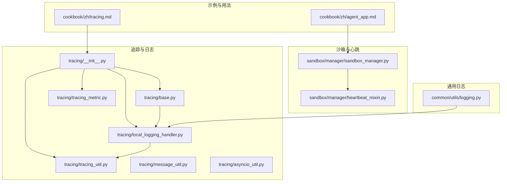
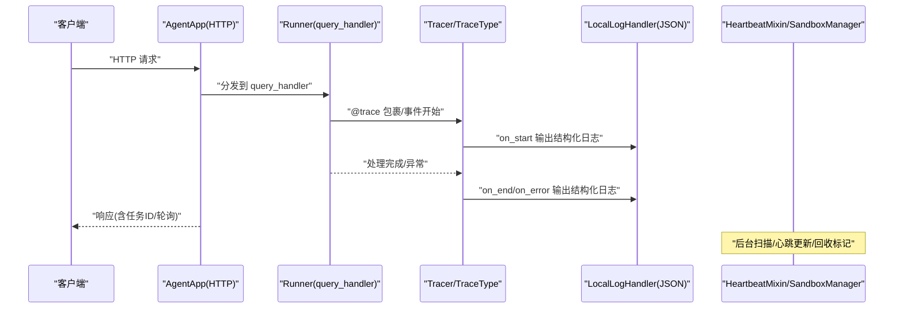
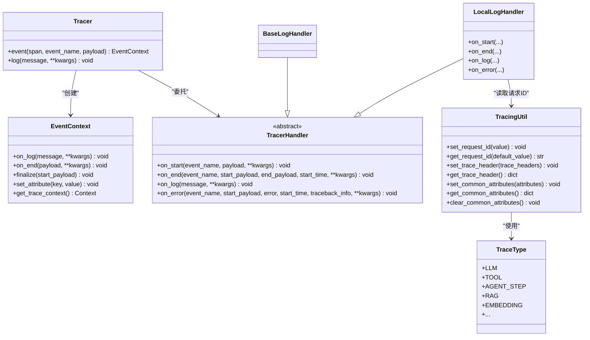
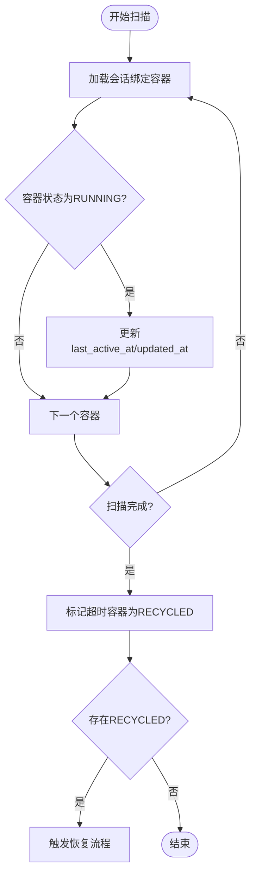
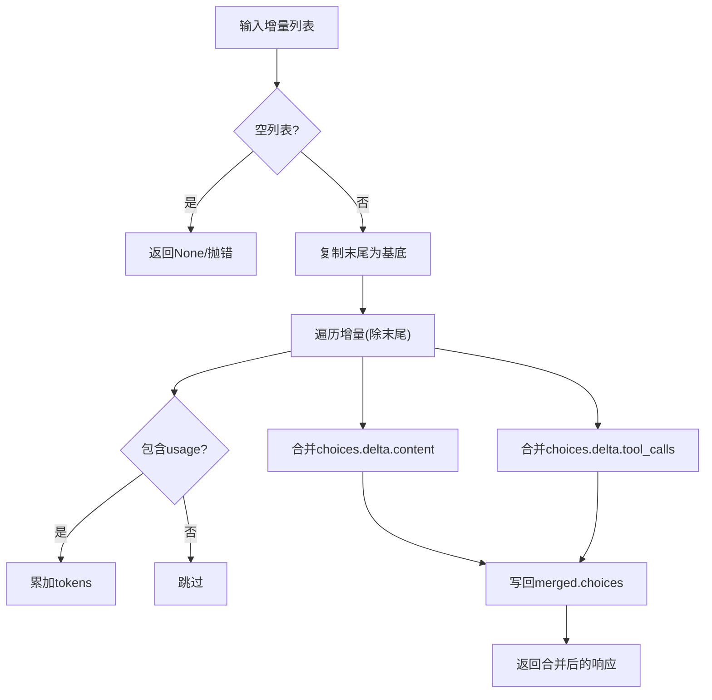
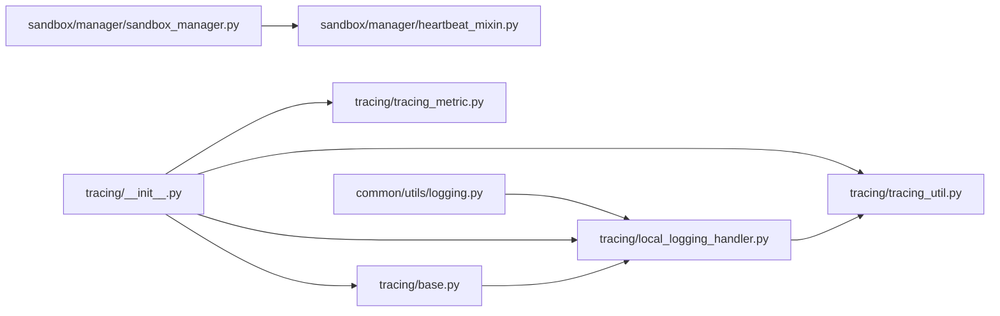

# 监控与调试

<cite>
**本文引用的文件**
- [README.md](file://README.md)
- [tracing/README.md](file://src/agentscope_runtime/engine/tracing/README.md)
- [tracing/__init__.py](file://src/agentscope_runtime/engine/tracing/__init__.py)
- [tracing/base.py](file://src/agentscope_runtime/engine/tracing/base.py)
- [tracing/local_logging_handler.py](file://src/agentscope_runtime/engine/tracing/local_logging_handler.py)
- [tracing/tracing_util.py](file://src/agentscope_runtime/engine/tracing/tracing_util.py)
- [tracing/tracing_metric.py](file://src/agentscope_runtime/engine/tracing/tracing_metric.py)
- [tracing/message_util.py](file://src/agentscope_runtime/engine/tracing/message_util.py)
- [tracing/asyncio_util.py](file://src/agentscope_runtime/engine/tracing/asyncio_util.py)
- [common/utils/logging.py](file://src/agentscope_runtime/common/utils/logging.py)
- [sandbox/manager/heartbeat_mixin.py](file://src/agentscope_runtime/sandbox/manager/heartbeat_mixin.py)
- [sandbox/manager/sandbox_manager.py](file://src/agentscope_runtime/sandbox/manager/sandbox_manager.py)
- [engine/helpers/runner.py](file://src/agentscope_runtime/engine/helpers/runner.py)
- [cookbook/zh/tracing.md](file://cookbook/zh/tracing.md)
- [cookbook/zh/agent_app.md](file://cookbook/zh/agent_app.md)
- [tests/sandbox/test_heartbeat.py](file://tests/sandbox/test_heartbeat.py)
</cite>

## 目录
1. [简介](#简介)
2. [项目结构](#项目结构)
3. [核心组件](#核心组件)
4. [架构总览](#架构总览)
5. [详细组件分析](#详细组件分析)
6. [依赖分析](#依赖分析)
7. [性能考虑](#性能考虑)
8. [故障排查指南](#故障排查指南)
9. [结论](#结论)
10. [附录](#附录)

## 简介
本文件面向AgentScope Runtime的运维与开发团队，系统化梳理监控与调试体系，覆盖以下方面：
- 系统监控指标与日志策略
- 分布式/链路追踪与指标采集
- 性能分析与基准测试建议
- 调试工具使用与问题诊断流程
- 告警配置、日志聚合与可视化
- 自动化运维与监控仪表板实践
- 完整监控配置示例与故障处理手册

## 项目结构
围绕监控与调试的关键模块分布如下：
- 追踪与日志：tracing子系统提供OpenTelemetry集成与结构化日志输出，支持本地JSON日志与基础Python日志处理器。
- 心跳与容器生命周期：sandbox管理器提供心跳扫描、回收标记与分布式锁，支撑容器健康度与资源回收的可观测性。
- 日志工具：通用日志格式化器与控制台彩色输出，便于本地开发与调试。
- 示例与用法：cookbook中的追踪与Agent应用示例，提供端点与任务模式参考。

**图示来源**
- [tracing/__init__.py:1-47](file://src/agentscope_runtime/engine/tracing/__init__.py#L1-L47)
- [tracing/base.py:1-343](file://src/agentscope_runtime/engine/tracing/base.py#L1-L343)
- [tracing/local_logging_handler.py:1-370](file://src/agentscope_runtime/engine/tracing/local_logging_handler.py#L1-L370)
- [tracing/tracing_util.py:1-136](file://src/agentscope_runtime/engine/tracing/tracing_util.py#L1-L136)
- [tracing/tracing_metric.py:1-82](file://src/agentscope_runtime/engine/tracing/tracing_metric.py#L1-L82)
- [tracing/message_util.py:1-529](file://src/agentscope_runtime/engine/tracing/message_util.py#L1-L529)
- [tracing/asyncio_util.py:1-25](file://src/agentscope_runtime/engine/tracing/asyncio_util.py#L1-L25)
- [sandbox/manager/heartbeat_mixin.py:1-489](file://src/agentscope_runtime/sandbox/manager/heartbeat_mixin.py#L1-L489)
- [sandbox/manager/sandbox_manager.py:425-464](file://src/agentscope_runtime/sandbox/manager/sandbox_manager.py#L425-L464)
- [common/utils/logging.py:1-45](file://src/agentscope_runtime/common/utils/logging.py#L1-L45)
- [cookbook/zh/tracing.md](file://cookbook/zh/tracing.md)
- [cookbook/zh/agent_app.md](file://cookbook/zh/agent_app.md)

**章节来源**
- [tracing/__init__.py:1-47](file://src/agentscope_runtime/engine/tracing/__init__.py#L1-L47)
- [tracing/base.py:1-343](file://src/agentscope_runtime/engine/tracing/base.py#L1-L343)
- [tracing/local_logging_handler.py:1-370](file://src/agentscope_runtime/engine/tracing/local_logging_handler.py#L1-L370)
- [tracing/tracing_util.py:1-136](file://src/agentscope_runtime/engine/tracing/tracing_util.py#L1-L136)
- [tracing/tracing_metric.py:1-82](file://src/agentscope_runtime/engine/tracing/tracing_metric.py#L1-L82)
- [tracing/message_util.py:1-529](file://src/agentscope_runtime/engine/tracing/message_util.py#L1-L529)
- [tracing/asyncio_util.py:1-25](file://src/agentscope_runtime/engine/tracing/asyncio_util.py#L1-L25)
- [sandbox/manager/heartbeat_mixin.py:1-489](file://src/agentscope_runtime/sandbox/manager/heartbeat_mixin.py#L1-L489)
- [sandbox/manager/sandbox_manager.py:425-464](file://src/agentscope_runtime/sandbox/manager/sandbox_manager.py#L425-L464)
- [common/utils/logging.py:1-45](file://src/agentscope_runtime/common/utils/logging.py#L1-L45)
- [cookbook/zh/tracing.md](file://cookbook/zh/tracing.md)
- [cookbook/zh/agent_app.md](file://cookbook/zh/agent_app.md)

## 核心组件
- 追踪装饰器与事件上下文：通过装饰器自动包裹函数，生成开始/结束/日志/错误事件，并注入请求ID与上下文属性。
- 本地结构化日志处理器：输出符合Dashscope日志格式的JSON，支持滚动文件与可选控制台输出。
- 基础日志处理器：基于Python标准库日志，用于简单场景或兼容性需求。
- 追踪工具与类型：提供TraceType枚举与TracingUtil，统一请求ID、跨线程传播与全局属性注入。
- 心跳与回收：HeartbeatMixin提供心跳更新、回收标记、恢复检查与Redis分布式锁；SandboxManager提供后台扫描线程与指标统计。
- 通用日志格式化器：控制台彩色输出，便于本地开发调试。

**章节来源**
- [tracing/__init__.py:1-47](file://src/agentscope_runtime/engine/tracing/__init__.py#L1-L47)
- [tracing/base.py:166-343](file://src/agentscope_runtime/engine/tracing/base.py#L166-L343)
- [tracing/local_logging_handler.py:84-370](file://src/agentscope_runtime/engine/tracing/local_logging_handler.py#L84-L370)
- [tracing/tracing_util.py:23-136](file://src/agentscope_runtime/engine/tracing/tracing_util.py#L23-L136)
- [tracing/tracing_metric.py:2-82](file://src/agentscope_runtime/engine/tracing/tracing_metric.py#L2-L82)
- [sandbox/manager/heartbeat_mixin.py:91-489](file://src/agentscope_runtime/sandbox/manager/heartbeat_mixin.py#L91-L489)
- [sandbox/manager/sandbox_manager.py:425-464](file://src/agentscope_runtime/sandbox/manager/sandbox_manager.py#L425-L464)
- [common/utils/logging.py:1-45](file://src/agentscope_runtime/common/utils/logging.py#L1-L45)

## 架构总览
下图展示了从调用方到Agent应用、再到追踪与心跳监控的整体链路：

**图示来源**
- [tracing/README.md:1-73](file://src/agentscope_runtime/engine/tracing/README.md#L1-L73)
- [tracing/__init__.py:16-47](file://src/agentscope_runtime/engine/tracing/__init__.py#L16-L47)
- [tracing/base.py:166-343](file://src/agentscope_runtime/engine/tracing/base.py#L166-L343)
- [tracing/local_logging_handler.py:201-370](file://src/agentscope_runtime/engine/tracing/local_logging_handler.py#L201-L370)
- [sandbox/manager/sandbox_manager.py:444-464](file://src/agentscope_runtime/sandbox/manager/sandbox_manager.py#L444-L464)

## 详细组件分析

### 追踪与日志子系统
- 装饰器与事件上下文：装饰器负责创建span、注入trace_event、捕获异常并记录错误事件；事件上下文支持在事件内追加日志与结束载荷。
- 本地结构化日志：输出包含时间、步骤、请求ID、上下文、间隔等字段，支持滚动文件与控制台输出，便于日志聚合与检索。
- 基础日志处理器：兼容Python标准日志，适合快速验证与降级场景。
- 追踪工具：统一设置/获取请求ID、跨线程传播、合并公共属性；环境变量驱动全局属性注入。
- 类型体系：TraceType枚举覆盖LLM、TOOL、AGENT_STEP、RAG、EMBEDDING等典型场景，便于分类统计与告警。

**图示来源**
- [tracing/base.py:166-343](file://src/agentscope_runtime/engine/tracing/base.py#L166-L343)
- [tracing/local_logging_handler.py:84-370](file://src/agentscope_runtime/engine/tracing/local_logging_handler.py#L84-L370)
- [tracing/tracing_util.py:23-136](file://src/agentscope_runtime/engine/tracing/tracing_util.py#L23-L136)
- [tracing/tracing_metric.py:2-82](file://src/agentscope_runtime/engine/tracing/tracing_metric.py#L2-L82)

**章节来源**
- [tracing/README.md:1-73](file://src/agentscope_runtime/engine/tracing/README.md#L1-L73)
- [tracing/__init__.py:16-47](file://src/agentscope_runtime/engine/tracing/__init__.py#L16-L47)
- [tracing/base.py:166-343](file://src/agentscope_runtime/engine/tracing/base.py#L166-L343)
- [tracing/local_logging_handler.py:84-370](file://src/agentscope_runtime/engine/tracing/local_logging_handler.py#L84-L370)
- [tracing/tracing_util.py:23-136](file://src/agentscope_runtime/engine/tracing/tracing_util.py#L23-L136)
- [tracing/tracing_metric.py:2-82](file://src/agentscope_runtime/engine/tracing/tracing_metric.py#L2-L82)

### 心跳与容器生命周期监控
- 心跳更新：按会话维度更新RUNNING容器的last_active_at与updated_at，确保活跃度可追踪。
- 回收标记：对超时或异常容器打上RECYCLED标记与原因，便于后续恢复与审计。
- 恢复检查：当任一容器处于RECYCLED状态时，触发恢复逻辑（由宿主类实现）。
- 分布式锁：Redis/Lua脚本保障心跳操作的互斥性，避免竞态。
- 后台扫描：SandboxManager启动后台线程周期扫描，统计跳过无运行容器/无心跳等指标。

**图示来源**
- [sandbox/manager/heartbeat_mixin.py:180-371](file://src/agentscope_runtime/sandbox/manager/heartbeat_mixin.py#L180-L371)
- [sandbox/manager/sandbox_manager.py:444-464](file://src/agentscope_runtime/sandbox/manager/sandbox_manager.py#L444-L464)
- [tests/sandbox/test_heartbeat.py:240-258](file://tests/sandbox/test_heartbeat.py#L240-L258)

**章节来源**
- [sandbox/manager/heartbeat_mixin.py:91-489](file://src/agentscope_runtime/sandbox/manager/heartbeat_mixin.py#L91-L489)
- [sandbox/manager/sandbox_manager.py:425-464](file://src/agentscope_runtime/sandbox/manager/sandbox_manager.py#L425-L464)
- [tests/sandbox/test_heartbeat.py:240-258](file://tests/sandbox/test_heartbeat.py#L240-L258)

### 流式消息与增量合并
- 流式增量块合并：将OpenAI风格的增量响应合并为完整响应，支持内容与工具调用的拼接。
- Agent响应/消息合并：将多段响应合并为最终AgentResponse/Message，处理delta与非delta混合场景。
- 完成条件：根据状态或对象类型判定完成条件，便于外部轮询与告警。

**图示来源**
- [tracing/message_util.py:21-121](file://src/agentscope_runtime/engine/tracing/message_util.py#L21-L121)

**章节来源**
- [tracing/message_util.py:1-529](file://src/agentscope_runtime/engine/tracing/message_util.py#L1-L529)

### 运行器与错误示例
- SimpleRunner：演示同步/异步流式输出的基本模式。
- ErrorRunner：演示异常抛出与追踪系统的错误记录行为。

**章节来源**
- [engine/helpers/runner.py:1-41](file://src/agentscope_runtime/engine/helpers/runner.py#L1-L41)

## 依赖分析
- 追踪子系统内部依赖：__init__导出Tracer、TraceType、TracingUtil；base定义抽象处理器与Tracer/EventContext；local_logging_handler实现具体JSON日志；tracing_util提供请求ID与属性传播；tracing_metric定义事件类型；message_util与asyncio_util为流式处理提供辅助。
- 心跳子系统依赖：heartbeat_mixin依赖Redis客户端与容器模型；sandbox_manager依赖配置与后台线程，结合heartbeat_mixin进行扫描与回收。
- 通用日志：common/utils/logging提供控制台彩色输出，便于本地调试。

**图示来源**
- [tracing/__init__.py:1-47](file://src/agentscope_runtime/engine/tracing/__init__.py#L1-L47)
- [tracing/base.py:1-343](file://src/agentscope_runtime/engine/tracing/base.py#L1-L343)
- [tracing/local_logging_handler.py:1-370](file://src/agentscope_runtime/engine/tracing/local_logging_handler.py#L1-L370)
- [tracing/tracing_util.py:1-136](file://src/agentscope_runtime/engine/tracing/tracing_util.py#L1-L136)
- [tracing/tracing_metric.py:1-82](file://src/agentscope_runtime/engine/tracing/tracing_metric.py#L1-L82)
- [sandbox/manager/heartbeat_mixin.py:1-489](file://src/agentscope_runtime/sandbox/manager/heartbeat_mixin.py#L1-L489)
- [sandbox/manager/sandbox_manager.py:1-464](file://src/agentscope_runtime/sandbox/manager/sandbox_manager.py#L1-L464)
- [common/utils/logging.py:1-45](file://src/agentscope_runtime/common/utils/logging.py#L1-L45)

**章节来源**
- [tracing/__init__.py:1-47](file://src/agentscope_runtime/engine/tracing/__init__.py#L1-L47)
- [tracing/base.py:1-343](file://src/agentscope_runtime/engine/tracing/base.py#L1-L343)
- [tracing/local_logging_handler.py:1-370](file://src/agentscope_runtime/engine/tracing/local_logging_handler.py#L1-L370)
- [tracing/tracing_util.py:1-136](file://src/agentscope_runtime/engine/tracing/tracing_util.py#L1-L136)
- [tracing/tracing_metric.py:1-82](file://src/agentscope_runtime/engine/tracing/tracing_metric.py#L1-L82)
- [sandbox/manager/heartbeat_mixin.py:1-489](file://src/agentscope_runtime/sandbox/manager/heartbeat_mixin.py#L1-L489)
- [sandbox/manager/sandbox_manager.py:1-464](file://src/agentscope_runtime/sandbox/manager/sandbox_manager.py#L1-L464)
- [common/utils/logging.py:1-45](file://src/agentscope_runtime/common/utils/logging.py#L1-L45)

## 性能考虑
- 追踪开销：装饰器与事件上下文引入少量CPU与内存开销，建议仅对关键路径启用；流式场景注意避免频繁on_log调用。
- 日志落盘：滚动文件大小与备份数量需结合磁盘容量与查询频率权衡；生产环境建议禁用控制台输出，仅保留文件输出。
- 心跳扫描：后台扫描间隔应与业务负载匹配，避免过于频繁导致抖动；Redis锁TTL需合理设置，防止死锁。
- 流式合并：增量合并算法涉及字典与列表拼接，建议在高并发场景下限制单次合并粒度，避免大对象频繁拷贝。

[本节为通用指导，无需特定文件引用]

## 故障排查指南
- 追踪日志缺失
  - 检查环境变量与处理器配置；确认已启用TRACE_ENABLE_LOG或TRACE_ENABLE_REPORT。
  - 验证@trace装饰器是否正确包裹目标函数；确保函数签名支持trace_event参数（若需要自定义日志）。
- 结构化日志无法解析
  - 确认日志格式为JSON且包含必需字段（如time、step、request_id）；检查日志目录权限与磁盘空间。
- 心跳异常
  - 检查Redis可用性与锁释放逻辑；查看后台扫描线程是否启动；核对会话与容器映射一致性。
- 错误处理
  - 使用Tracer事件上下文捕获异常并记录traceback；定位错误发生阶段（开始/结束/日志/错误）。
- 端点与任务模式
  - 参考AgentApp端点与任务模式示例，确认健康检查、就绪探针与任务轮询接口可用性。

**章节来源**
- [tracing/README.md:1-73](file://src/agentscope_runtime/engine/tracing/README.md#L1-L73)
- [cookbook/zh/agent_app.md:242-316](file://cookbook/zh/agent_app.md#L242-L316)
- [engine/helpers/runner.py:29-41](file://src/agentscope_runtime/engine/helpers/runner.py#L29-L41)

## 结论
通过追踪与日志子系统、心跳与回收机制以及通用日志工具，AgentScope Runtime构建了覆盖端到端调用链的可观测性能力。建议在生产环境中启用结构化日志与OpenTelemetry上报，配合心跳扫描与告警策略，形成闭环的监控与运维体系。

[本节为总结，无需特定文件引用]

## 附录

### 监控指标清单（建议）
- 追踪指标
  - 事件总数、成功/失败计数、平均/分位耗时、错误率
  - 不同TraceType的分布与延迟
- 心跳与容器
  - 运行中容器数、心跳超时数、回收标记数、恢复次数
  - 后台扫描间隔、扫描耗时
- 日志与告警
  - 日志级别分布、滚动文件大小、磁盘使用率
  - 关键错误阈值与告警通道

[本节为通用指导，无需特定文件引用]

### 日志记录策略
- 结构化输出：统一JSON格式，包含时间、步骤、请求ID、上下文、间隔、服务标识等字段。
- 分级输出：INFO/ERROR分别写入不同文件，便于检索与告警。
- 控制台输出：仅在开发环境启用，生产环境关闭。

**章节来源**
- [tracing/local_logging_handler.py:45-82](file://src/agentscope_runtime/engine/tracing/local_logging_handler.py#L45-L82)
- [tracing/local_logging_handler.py:129-179](file://src/agentscope_runtime/engine/tracing/local_logging_handler.py#L129-L179)

### 分布式追踪与链路追踪
- OpenTelemetry集成：通过装饰器自动创建span，注入trace_event，支持同步/异步/流式场景。
- 属性传播：TracingUtil提供请求ID与公共属性注入，确保跨线程/跨进程一致。
- 追踪类型：TraceType覆盖LLM、TOOL、RAG、EMBEDDING等，便于分类统计与告警。

**章节来源**
- [tracing/README.md:53-73](file://src/agentscope_runtime/engine/tracing/README.md#L53-L73)
- [tracing/tracing_util.py:106-136](file://src/agentscope_runtime/engine/tracing/tracing_util.py#L106-L136)
- [tracing/tracing_metric.py:2-33](file://src/agentscope_runtime/engine/tracing/tracing_metric.py#L2-L33)

### 性能分析与基准测试
- 追踪埋点：对关键函数与API端点添加@trace，记录开始/结束与中间步骤。
- 基准场景：构造不同规模的流式响应与工具调用，测量吞吐与延迟。
- 资源监控：结合心跳扫描与容器指标，评估并发与资源占用。

**章节来源**
- [tracing/README.md:10-73](file://src/agentscope_runtime/engine/tracing/README.md#L10-L73)
- [tracing/message_util.py:136-329](file://src/agentscope_runtime/engine/tracing/message_util.py#L136-L329)

### 调试工具与使用
- 追踪示例：参考cookbook中的多处理程序与错误处理示例，快速搭建本地调试环境。
- 端点验证：使用AgentApp提供的健康检查与任务轮询接口，验证服务可用性。
- 日志查看：在日志目录中查找对应PID的info/error日志文件，结合请求ID定位问题。

**章节来源**
- [cookbook/zh/tracing.md:107-161](file://cookbook/zh/tracing.md#L107-L161)
- [cookbook/zh/agent_app.md:242-316](file://cookbook/zh/agent_app.md#L242-L316)
- [common/utils/logging.py:31-45](file://src/agentscope_runtime/common/utils/logging.py#L31-L45)

### 告警配置与日志聚合
- 告警规则：基于追踪错误率、心跳超时、回收标记数等指标设定阈值。
- 日志聚合：将结构化日志导入集中式日志平台，建立索引与查询视图。
- 可视化：结合仪表板展示关键指标趋势与异常告警。

[本节为通用指导，无需特定文件引用]

### 自动化运维与监控仪表板
- 自动化：通过CI/CD部署AgentApp，自动拉起后台扫描线程与心跳锁。
- 仪表板：展示追踪指标、心跳与容器状态、日志级别分布等关键视图。

[本节为通用指导，无需特定文件引用]

### 故障处理手册
- 追踪异常：检查装饰器使用与处理器配置，确认trace_event参数传递。
- 心跳超时：核查Redis连接、锁释放与扫描间隔，必要时手动清理锁。
- 日志异常：检查磁盘空间与权限，调整滚动文件参数。

**章节来源**
- [sandbox/manager/heartbeat_mixin.py:420-489](file://src/agentscope_runtime/sandbox/manager/heartbeat_mixin.py#L420-L489)
- [sandbox/manager/sandbox_manager.py:444-464](file://src/agentscope_runtime/sandbox/manager/sandbox_manager.py#L444-L464)
- [tests/sandbox/test_heartbeat.py:240-258](file://tests/sandbox/test_heartbeat.py#L240-L258)