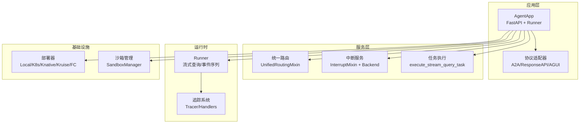
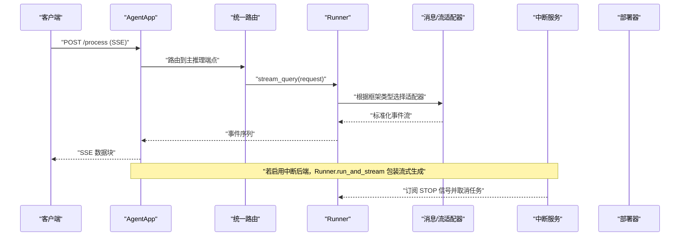
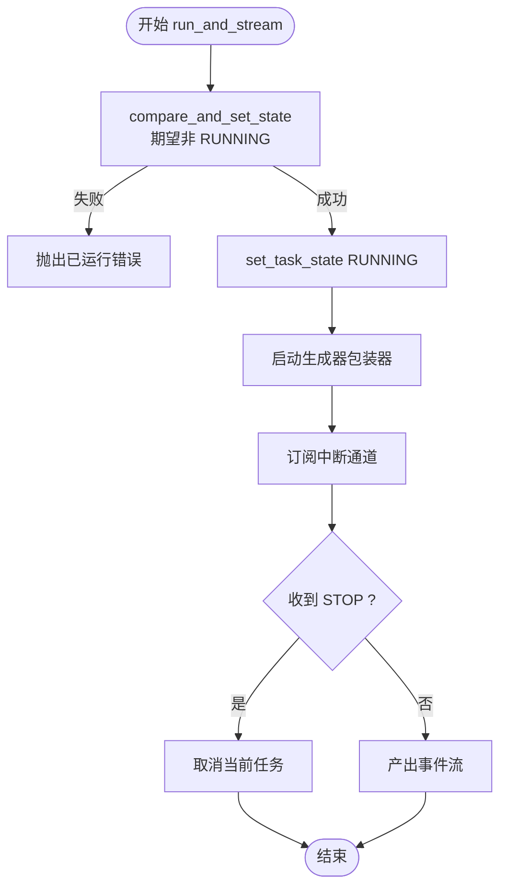
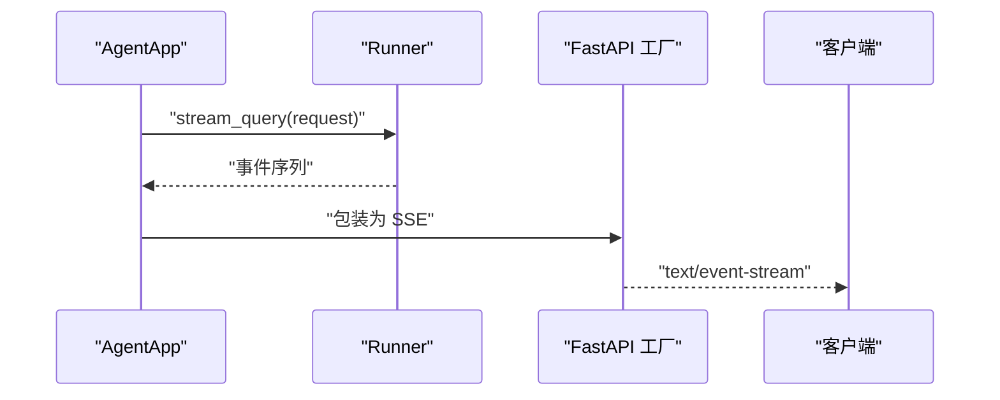
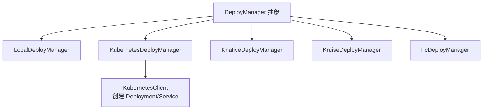
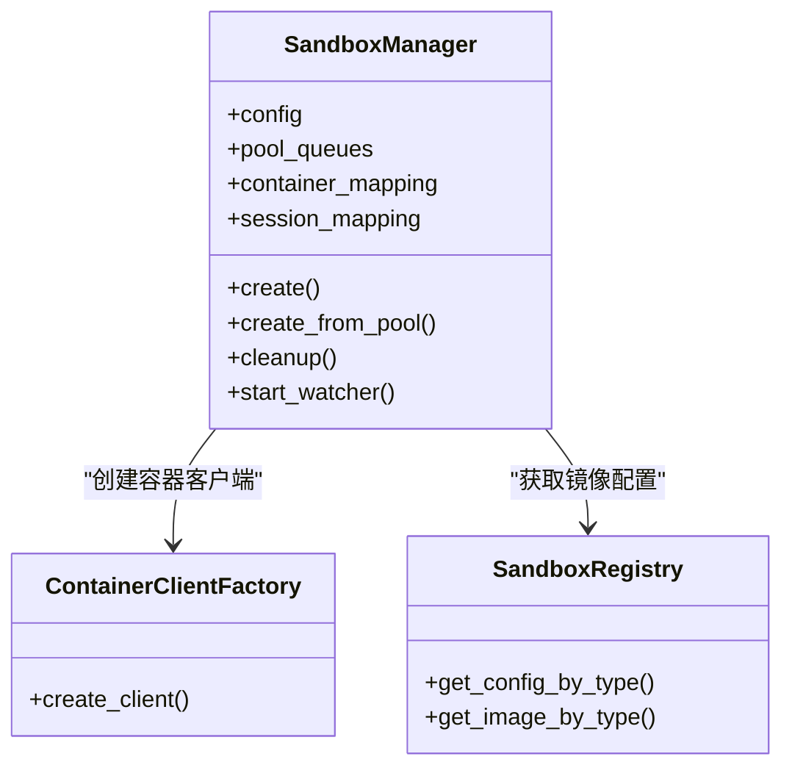
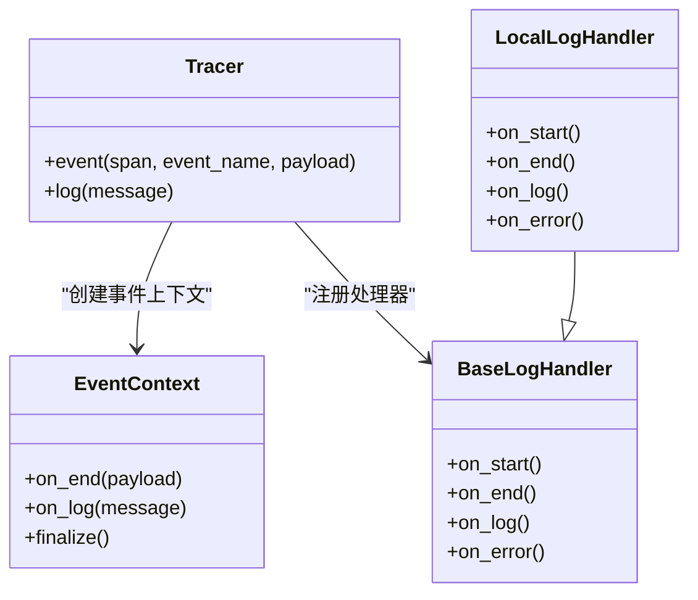
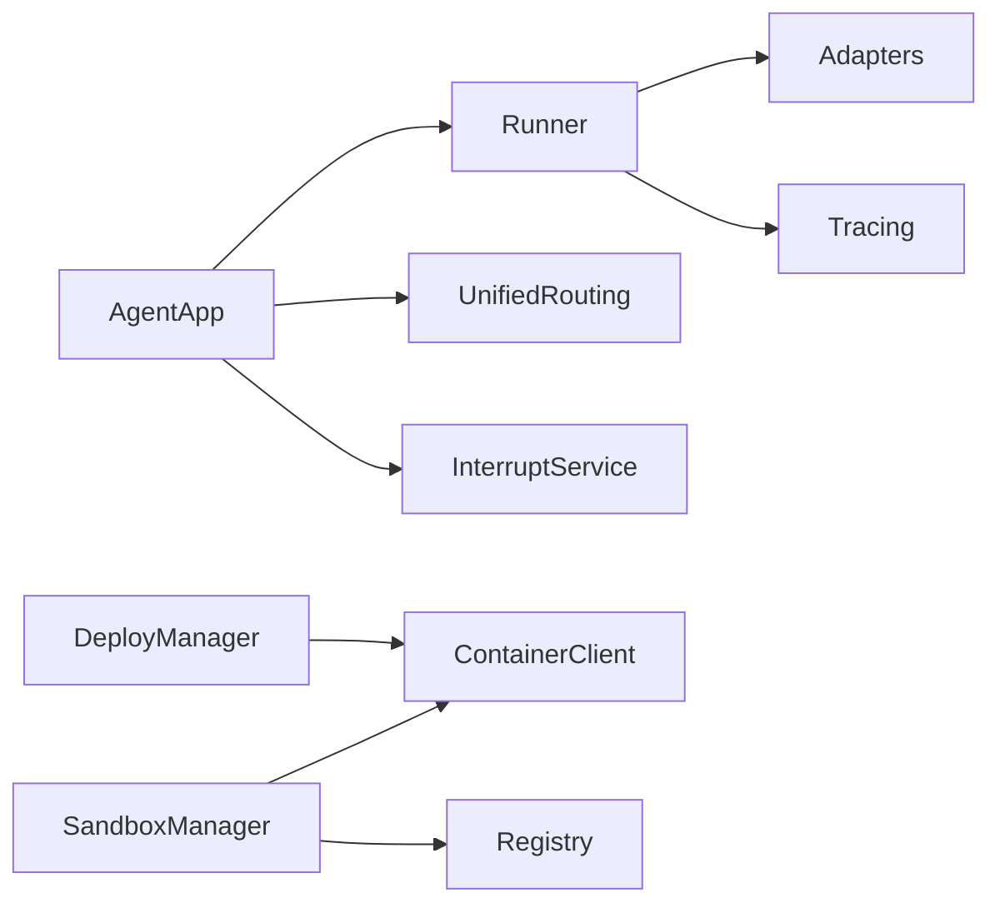

# 高级教程

<cite>
**本文引用的文件**
- [README.md](file://README.md)
- [__init__.py](file://src/agentscope_runtime/__init__.py)
- [agent_app.py](file://src/agentscope_runtime/engine/app/agent_app.py)
- [runner.py](file://src/agentscope_runtime/engine/runner.py)
- [interrupt_mixin.py](file://src/agentscope_runtime/engine/deployers/utils/service_utils/interrupt/interrupt_mixin.py)
- [local_backend.py](file://src/agentscope_runtime/engine/deployers/utils/service_utils/interrupt/local_backend.py)
- [redis_backend.py](file://src/agentscope_runtime/engine/deployers/utils/service_utils/interrupt/redis_backend.py)
- [task_engine_mixin.py](file://src/agentscope_runtime/engine/deployers/utils/service_utils/routing/task_engine_mixin.py)
- [fastapi_factory.py](file://src/agentscope_runtime/engine/deployers/utils/service_utils/fastapi_factory.py)
- [base.py](file://src/agentscope_runtime/engine/deployers/base.py)
- [kubernetes_deployer.py](file://src/agentscope_runtime/engine/deployers/kubernetes_deployer.py)
- [kubernetes_client.py](file://src/agentscope_runtime/common/container_clients/kubernetes_client.py)
- [sandbox_manager.py](file://src/agentscope_runtime/sandbox/manager/sandbox_manager.py)
- [enums.py](file://src/agentscope_runtime/sandbox/enums.py)
- [base.py](file://src/agentscope_runtime/engine/tracing/base.py)
- [local_logging_handler.py](file://src/agentscope_runtime/engine/tracing/local_logging_handler.py)
- [README.md](file://src/agentscope_runtime/engine/tracing/README.md)
- [tracing.md](file://cookbook/zh/tracing.md)
- [interrupt_mixin.py](file://tests/unit/test_interrupt_mixin.py)
- [README.md](file://examples/sandbox/custom_sandbox/README.md)
- [run_langgraph_agent.py](file://examples/integrations/langgraph/run_langgraph_agent.py)
- [run_langgraph_llm.py](file://examples/integrations/langgraph/run_langgraph_llm.py)
- [console.py](file://src/agentscope_runtime/cli/utils/console.py)
- [deploy.py](file://src/agentscope_runtime/cli/commands/deploy.py)
</cite>

## 目录
1. [简介](#简介)
2. [项目结构](#项目结构)
3. [核心组件](#核心组件)
4. [架构总览](#架构总览)
5. [详细组件分析](#详细组件分析)
6. [依赖关系分析](#依赖关系分析)
7. [性能考量](#性能考量)
8. [故障排查指南](#故障排查指南)
9. [结论](#结论)
10. [附录](#附录)

## 简介
本高级教程面向在生产环境中使用 AgentScope Runtime 的工程师与架构师，聚焦复杂场景下的实现方法与最佳实践。内容涵盖：
- 内存管理与任务生命周期控制（含分布式中断）
- 中断处理与手动预emption
- 流式处理（SSE）与后台任务队列
- 性能优化与资源管理
- 大规模部署与高并发方案（K8s、Kruise、Serverless）
- 监控、日志与调试的高级技巧
- 故障诊断与问题排查方法论
- 扩展开发与自定义组件实现

## 项目结构
AgentScope Runtime 采用“引擎 + 适配器 + 部署器 + 沙箱”的分层设计，核心模块包括：
- 引擎层：AgentApp/FastAPI + Runner，负责协议适配、路由、流式输出、生命周期管理
- 中断服务：统一的分布式中断机制，支持本地/Redis后端
- 路由与任务：统一路由混入、后台任务执行与清理
- 部署器：本地、K8s、Knative、Kruise、FC 等多平台部署
- 沙箱：容器化隔离执行环境，支持同步/异步沙盒
- 追踪与日志：OpenTelemetry 风格的事件追踪与本地日志处理器

图示来源
- [agent_app.py:60-220](file://src/agentscope_runtime/engine/app/agent_app.py#L60-L220)
- [runner.py:46-120](file://src/agentscope_runtime/engine/runner.py#L46-L120)
- [interrupt_mixin.py:8-38](file://src/agentscope_runtime/engine/deployers/utils/service_utils/interrupt/interrupt_mixin.py#L8-L38)
- [task_engine_mixin.py:241-267](file://src/agentscope_runtime/engine/deployers/utils/service_utils/routing/task_engine_mixin.py#L241-L267)
- [base.py:9-44](file://src/agentscope_runtime/engine/deployers/base.py#L9-L44)

章节来源
- [README.md:86-106](file://README.md#L86-L106)
- [agent_app.py:60-220](file://src/agentscope_runtime/engine/app/agent_app.py#L60-L220)

## 核心组件
- AgentApp：基于 FastAPI 的应用容器，集成 Runner、协议适配器、统一路由与中断服务，提供健康检查、根路径信息、进程控制等内置端点，并支持自定义端点注册。
- Runner：核心执行器，负责将请求转换为框架特定的消息流，调用用户编写的 query_handler 并通过适配器输出标准化事件流。
- 中断服务（InterruptMixin + Backend）：提供 compare-and-set 状态机、订阅/发布中断信号、任务取消监听与原子状态更新，支持本地与 Redis 后端。
- 统一路由与任务：统一路由混入负责端点注册；后台任务混入支持仅保留最终响应的流式任务执行与过期清理。
- 部署器：抽象 DeployManager 接口，提供本地、K8s、Knative、Kruise、FC 等多种部署实现。
- 沙箱管理：SandboxManager 支持池化、心跳扫描、回收与清理，提供远程/本地双模调用。
- 追踪系统：Tracer/EventContext 提供事件生命周期回调，支持多处理器（本地日志、可扩展）。

章节来源
- [agent_app.py:60-220](file://src/agentscope_runtime/engine/app/agent_app.py#L60-L220)
- [runner.py:46-120](file://src/agentscope_runtime/engine/runner.py#L46-L120)
- [interrupt_mixin.py:8-38](file://src/agentscope_runtime/engine/deployers/utils/service_utils/interrupt/interrupt_mixin.py#L8-L38)
- [local_backend.py:9-40](file://src/agentscope_runtime/engine/deployers/utils/service_utils/interrupt/local_backend.py#L9-L40)
- [redis_backend.py:7-49](file://src/agentscope_runtime/engine/deployers/utils/service_utils/interrupt/redis_backend.py#L7-L49)
- [task_engine_mixin.py:241-267](file://src/agentscope_runtime/engine/deployers/utils/service_utils/routing/task_engine_mixin.py#L241-L267)
- [base.py:9-44](file://src/agentscope_runtime/engine/deployers/base.py#L9-L44)
- [sandbox_manager.py:140-270](file://src/agentscope_runtime/sandbox/manager/sandbox_manager.py#L140-L270)
- [base.py:166-240](file://src/agentscope_runtime/engine/tracing/base.py#L166-L240)

## 架构总览
下图展示了从客户端到应用、运行器、适配器、中断服务与部署器的整体交互流程。

图示来源
- [agent_app.py:643-703](file://src/agentscope_runtime/engine/app/agent_app.py#L643-L703)
- [runner.py:199-356](file://src/agentscope_runtime/engine/runner.py#L199-L356)
- [interrupt_mixin.py:38-110](file://src/agentscope_runtime/engine/deployers/utils/service_utils/interrupt/interrupt_mixin.py#L38-L110)

章节来源
- [agent_app.py:643-703](file://src/agentscope_runtime/engine/app/agent_app.py#L643-L703)
- [runner.py:199-356](file://src/agentscope_runtime/engine/runner.py#L199-L356)

## 详细组件分析

### 中断与手动预emption（分布式中断）
- 设计目标：在长时任务中支持手动中断，避免资源浪费；在多实例环境下通过 Redis 实现跨节点一致性。
- 关键点：
  - 使用 compare-and-set 状态机确保同一会话仅允许一个 RUNNING 任务
  - 订阅通道接收 STOP 信号，触发 asyncio.Task 取消
  - 本地/Redis 后端可按需切换，单机默认本地后端
- 最佳实践：
  - 为每个用户+会话生成唯一任务键，避免并发冲突
  - 设置合理 TTL，防止悬挂状态
  - 在业务逻辑中定期检查取消状态或使用可中断的 IO

图示来源
- [interrupt_mixin.py:38-110](file://src/agentscope_runtime/engine/deployers/utils/service_utils/interrupt/interrupt_mixin.py#L38-L110)
- [local_backend.py:22-40](file://src/agentscope_runtime/engine/deployers/utils/service_utils/interrupt/local_backend.py#L22-L40)
- [redis_backend.py:44-49](file://src/agentscope_runtime/engine/deployers/utils/service_utils/interrupt/redis_backend.py#L44-L49)

章节来源
- [interrupt_mixin.py:8-110](file://src/agentscope_runtime/engine/deployers/utils/service_utils/interrupt/interrupt_mixin.py#L8-L110)
- [local_backend.py:9-40](file://src/agentscope_runtime/engine/deployers/utils/service_utils/interrupt/local_backend.py#L9-L40)
- [redis_backend.py:7-49](file://src/agentscope_runtime/engine/deployers/utils/service_utils/interrupt/redis_backend.py#L7-L49)
- [test_interrupt_mixin.py:64-92](file://tests/unit/test_interrupt_mixin.py#L64-L92)

### 流式处理（SSE）与后台任务
- 流式输出：
  - Runner 将框架特定的消息流适配为统一事件序列，逐条输出为 SSE 数据块
  - FastAPI 工厂对异步/同步生成器进行包装，保证 FastAPI 正确识别协程并输出 SSE
- 后台任务：
  - 仅保存最终响应，忽略中间事件，降低内存占用
  - 支持 Celery 或内存模式；提供定时清理过期任务的后台工作线程

图示来源
- [runner.py:199-356](file://src/agentscope_runtime/engine/runner.py#L199-L356)
- [fastapi_factory.py:673-801](file://src/agentscope_runtime/engine/deployers/utils/service_utils/fastapi_factory.py#L673-L801)
- [agent_app.py:643-703](file://src/agentscope_runtime/engine/app/agent_app.py#L643-L703)

章节来源
- [runner.py:199-356](file://src/agentscope_runtime/engine/runner.py#L199-L356)
- [fastapi_factory.py:673-801](file://src/agentscope_runtime/engine/deployers/utils/service_utils/fastapi_factory.py#L673-L801)
- [agent_app.py:497-597](file://src/agentscope_runtime/engine/app/agent_app.py#L497-L597)
- [task_engine_mixin.py:241-267](file://src/agentscope_runtime/engine/deployers/utils/service_utils/routing/task_engine_mixin.py#L241-L267)

### 协议适配与统一路由
- AgentApp 自动注入 A2A、ResponseAPI、AGUI 等协议的 OpenAPI 定义
- 统一路由混入负责端点注册与内部/外部路由区分
- 支持自定义端点注册与恢复

章节来源
- [agent_app.py:68-123](file://src/agentscope_runtime/engine/app/agent_app.py#L68-L123)
- [agent_app.py:781-800](file://src/agentscope_runtime/engine/app/agent_app.py#L781-L800)

### 部署与弹性伸缩
- 抽象 DeployManager 接口，具体实现包括本地、K8s、Knative、Kruise、FC 等
- K8s 部署器创建 Deployment 与 Service，支持副本数与卷挂载
- K8s 客户端封装了 Deployment 规约构建与服务暴露

图示来源
- [base.py:9-44](file://src/agentscope_runtime/engine/deployers/base.py#L9-L44)
- [kubernetes_deployer.py:246-283](file://src/agentscope_runtime/engine/deployers/kubernetes_deployer.py#L246-L283)
- [kubernetes_client.py:872-912](file://src/agentscope_runtime/common/container_clients/kubernetes_client.py#L872-L912)

章节来源
- [base.py:9-44](file://src/agentscope_runtime/engine/deployers/base.py#L9-L44)
- [kubernetes_deployer.py:246-283](file://src/agentscope_runtime/engine/deployers/kubernetes_deployer.py#L246-L283)
- [kubernetes_client.py:872-912](file://src/agentscope_runtime/common/container_clients/kubernetes_client.py#L872-L912)

### 沙箱与资源隔离
- SandboxManager 支持池化、心跳扫描、回收与清理
- 支持本地/远程双模调用，远程模式通过 HTTP 请求转发
- 提供多类型沙盒（基础、GUI、浏览器、文件系统、移动、训练等）

图示来源
- [sandbox_manager.py:140-270](file://src/agentscope_runtime/sandbox/manager/sandbox_manager.py#L140-L270)
- [sandbox_manager.py:509-704](file://src/agentscope_runtime/sandbox/manager/sandbox_manager.py#L509-L704)
- [enums.py:61-79](file://src/agentscope_runtime/sandbox/enums.py#L61-L79)

章节来源
- [sandbox_manager.py:140-270](file://src/agentscope_runtime/sandbox/manager/sandbox_manager.py#L140-L270)
- [sandbox_manager.py:509-704](file://src/agentscope_runtime/sandbox/manager/sandbox_manager.py#L509-L704)
- [enums.py:61-79](file://src/agentscope_runtime/sandbox/enums.py#L61-L79)

### 追踪与日志（可观测性）
- Tracer 提供事件生命周期回调（on_start/on_end/on_log/on_error），支持多处理器
- 本地日志处理器输出结构化日志，便于检索与聚合
- 追踪装饰器用于非流式/流式函数埋点

图示来源
- [base.py:166-240](file://src/agentscope_runtime/engine/tracing/base.py#L166-L240)
- [base.py:252-343](file://src/agentscope_runtime/engine/tracing/base.py#L252-L343)
- [local_logging_handler.py:187-228](file://src/agentscope_runtime/engine/tracing/local_logging_handler.py#L187-L228)

章节来源
- [base.py:166-240](file://src/agentscope_runtime/engine/tracing/base.py#L166-L240)
- [local_logging_handler.py:187-228](file://src/agentscope_runtime/engine/tracing/local_logging_handler.py#L187-L228)
- [README.md:46-73](file://src/agentscope_runtime/engine/tracing/README.md#L46-L73)
- [tracing.md:107-161](file://cookbook/zh/tracing.md#L107-L161)

### 扩展开发与自定义组件
- 自定义端点：通过 AgentApp 的自定义端点注册能力，结合 FastAPI 工厂的 SSE 包装，实现流式/非流式自定义接口
- 框架适配：Runner 根据 framework_type 选择对应适配器，可扩展新框架
- CLI 部署：CLI 命令行工具支持交互式审批与部署状态跟踪

章节来源
- [agent_app.py:781-800](file://src/agentscope_runtime/engine/app/agent_app.py#L781-L800)
- [fastapi_factory.py:673-801](file://src/agentscope_runtime/engine/deployers/utils/service_utils/fastapi_factory.py#L673-L801)
- [runner.py:246-320](file://src/agentscope_runtime/engine/runner.py#L246-L320)
- [console.py:308-344](file://src/agentscope_runtime/cli/utils/console.py#L308-L344)
- [deploy.py:1089-1122](file://src/agentscope_runtime/cli/commands/deploy.py#L1089-L1122)

## 依赖关系分析
- AgentApp 依赖 Runner、协议适配器、统一路由与中断服务
- Runner 依赖框架适配器与追踪系统
- 部署器依赖容器客户端（如 KubernetesClient）
- 沙箱管理依赖容器客户端工厂与注册表

图示来源
- [agent_app.py:60-220](file://src/agentscope_runtime/engine/app/agent_app.py#L60-L220)
- [runner.py:46-120](file://src/agentscope_runtime/engine/runner.py#L46-L120)
- [base.py:9-44](file://src/agentscope_runtime/engine/deployers/base.py#L9-L44)
- [kubernetes_client.py:872-912](file://src/agentscope_runtime/common/container_clients/kubernetes_client.py#L872-L912)
- [sandbox_manager.py:244-251](file://src/agentscope_runtime/sandbox/manager/sandbox_manager.py#L244-L251)

章节来源
- [agent_app.py:60-220](file://src/agentscope_runtime/engine/app/agent_app.py#L60-L220)
- [runner.py:46-120](file://src/agentscope_runtime/engine/runner.py#L46-L120)
- [base.py:9-44](file://src/agentscope_runtime/engine/deployers/base.py#L9-L44)

## 性能考量
- 流式任务内存优化：后台任务仅保留最终响应，减少中间事件存储
- 任务清理：周期性清理过期任务，避免内存泄漏
- 中断原子性：compare-and-set 状态机避免重复运行与竞态
- 沙箱池化：复用运行中的容器，降低冷启动开销
- SSE 序列化：对深层嵌套结构进行安全序列化，避免过度递归
- 部署弹性：K8s 副本与服务暴露，结合负载均衡实现水平扩展

章节来源
- [task_engine_mixin.py:241-267](file://src/agentscope_runtime/engine/deployers/utils/service_utils/routing/task_engine_mixin.py#L241-L267)
- [agent_app.py:460-471](file://src/agentscope_runtime/engine/app/agent_app.py#L460-L471)
- [interrupt_mixin.py:50-62](file://src/agentscope_runtime/engine/deployers/utils/service_utils/interrupt/interrupt_mixin.py#L50-L62)
- [sandbox_manager.py:591-704](file://src/agentscope_runtime/sandbox/manager/sandbox_manager.py#L591-L704)
- [fastapi_factory.py:696-744](file://src/agentscope_runtime/engine/deployers/utils/service_utils/fastapi_factory.py#L696-L744)

## 故障排查指南
- 中断不生效
  - 检查中断后端是否正确初始化（本地/Redis）
  - 确认 compare_and_set_state 是否返回成功
  - 核对订阅通道名称与发送方一致
- 流式输出异常
  - 查看 FastAPI 工厂包装是否正确识别协程
  - 捕获异常并输出标准错误事件
- 部署失败
  - 检查 K8s 权限、镜像仓库访问与网络策略
  - 查看服务端点与负载均衡配置
- 沙箱资源泄露
  - 启用 watcher 定期扫描与清理
  - 确保退出时调用 cleanup/cleanup_async
- 追踪缺失
  - 确认处理器已注册且日志级别正确
  - 检查事件上下文 finalize 是否被调用

章节来源
- [interrupt_mixin.py:38-110](file://src/agentscope_runtime/engine/deployers/utils/service_utils/interrupt/interrupt_mixin.py#L38-L110)
- [local_backend.py:22-40](file://src/agentscope_runtime/engine/deployers/utils/service_utils/interrupt/local_backend.py#L22-L40)
- [redis_backend.py:44-49](file://src/agentscope_runtime/engine/deployers/utils/service_utils/interrupt/redis_backend.py#L44-L49)
- [fastapi_factory.py:759-801](file://src/agentscope_runtime/engine/deployers/utils/service_utils/fastapi_factory.py#L759-L801)
- [kubernetes_deployer.py:246-283](file://src/agentscope_runtime/engine/deployers/kubernetes_deployer.py#L246-L283)
- [sandbox_manager.py:444-507](file://src/agentscope_runtime/sandbox/manager/sandbox_manager.py#L444-L507)
- [base.py:252-343](file://src/agentscope_runtime/engine/tracing/base.py#L252-L343)

## 结论
通过中断服务、统一路由、流式处理与后台任务、部署弹性与可观测性体系，AgentScope Runtime 能够在复杂生产场景中实现稳定、高效与可维护的 Agent-as-a-Service。建议在高并发与大规模部署中优先采用 K8s/Kruise、Redis 中断后端与池化沙箱策略，并结合完善的追踪与日志体系进行持续优化。

## 附录
- 示例：LangGraph 集成与内存端点
  - 通过 AgentApp.endpoint 注册短/长期记忆查询端点
  - 使用全局内存对象与序列化安全过滤

章节来源
- [run_langgraph_agent.py:128-171](file://examples/integrations/langgraph/run_langgraph_agent.py#L128-L171)
- [run_langgraph_llm.py:82-117](file://examples/integrations/langgraph/run_langgraph_llm.py#L82-L117)