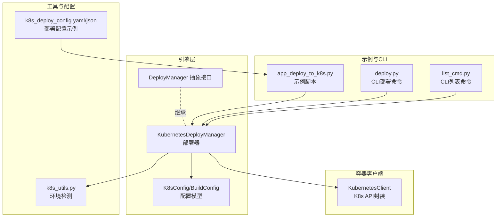
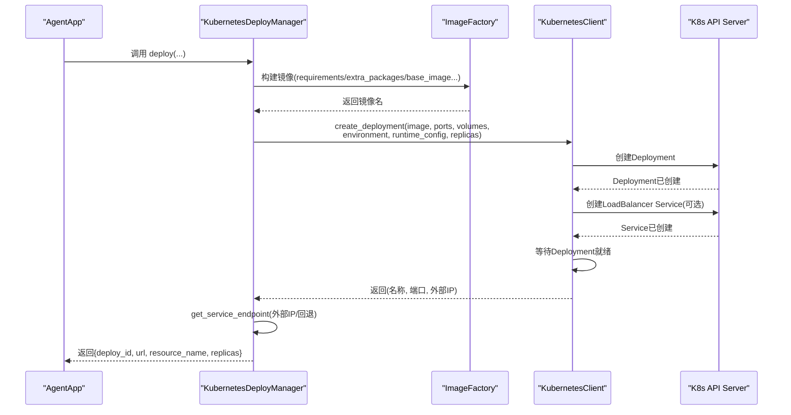
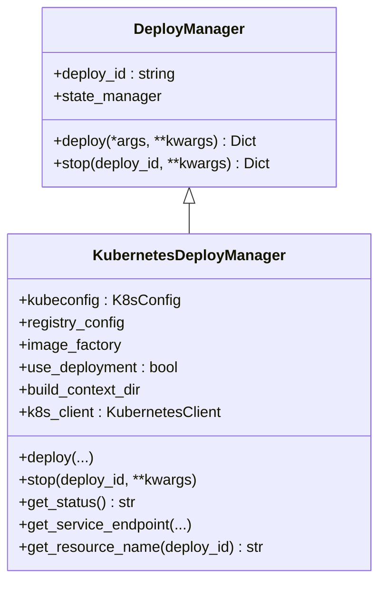
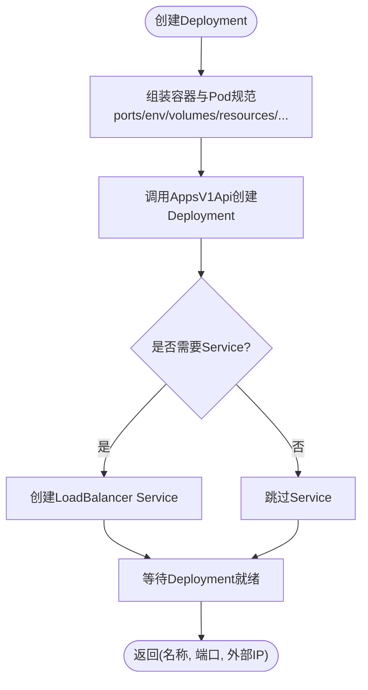
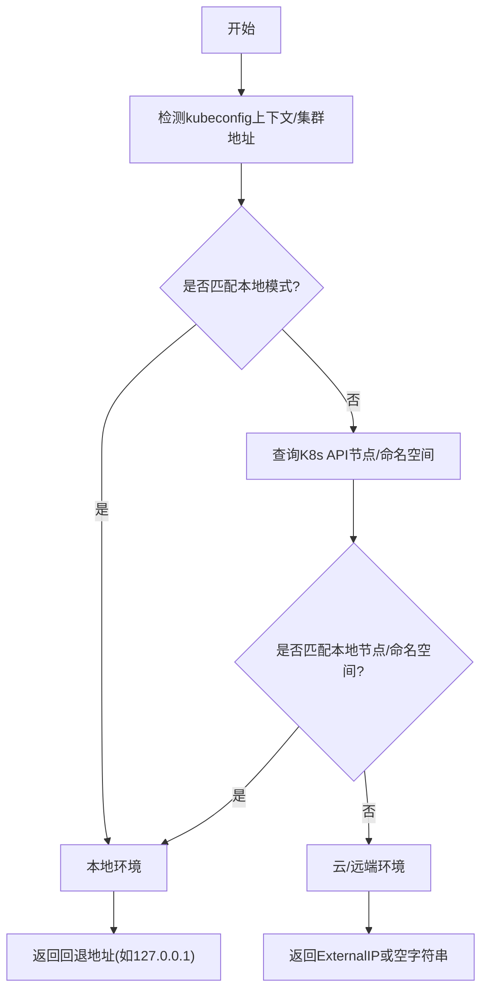
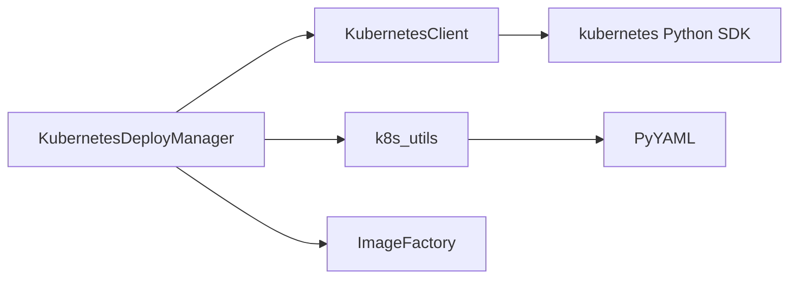

# Kubernetes部署

<cite>
**本文引用的文件**
- [kubernetes_deployer.py](file://src/agentscope_runtime/engine/deployers/kubernetes_deployer.py)
- [kubernetes_client.py](file://src/agentscope_runtime/common/container_clients/kubernetes_client.py)
- [k8s_utils.py](file://src/agentscope_runtime/engine/deployers/utils/k8s_utils.py)
- [base.py](file://src/agentscope_runtime/engine/deployers/base.py)
- [app_deploy_to_k8s.py](file://examples/deployments/k8s_deploy/app_deploy_to_k8s.py)
- [k8s_deploy_config.yaml](file://examples/deployments/k8s_deploy/k8s_deploy_config.yaml)
- [k8s_deploy_config.json](file://examples/deployments/k8s_deploy/k8s_deploy_config.json)
- [deploy.py](file://src/agentscope_runtime/cli/commands/deploy.py)
- [list_cmd.py](file://src/agentscope_runtime/cli/commands/list_cmd.py)
</cite>

## 目录
1. [简介](#简介)
2. [项目结构](#项目结构)
3. [核心组件](#核心组件)
4. [架构总览](#架构总览)
5. [详细组件分析](#详细组件分析)
6. [依赖关系分析](#依赖关系分析)
7. [性能考虑](#性能考虑)
8. [故障排查指南](#故障排查指南)
9. [结论](#结论)
10. [附录](#附录)

## 简介
本文件面向在Kubernetes上部署Agentscope运行时服务的用户与工程师，系统性阐述KubernetesDeployer与Kubernetes API的交互机制，覆盖Pod、Service、Deployment的创建与管理；命名空间、资源限制、节点选择策略；Ingress与负载均衡、自动扩缩容；最佳实践与安全配置；Helm Chart与kubectl命令行操作；以及完整的K8s部署配置与监控建议。文档以仓库中的实现为依据，结合示例工程与配置文件，帮助读者从零完成生产级部署。

## 项目结构
围绕Kubernetes部署的相关模块主要分布在以下位置：
- 引擎层部署器：负责编排部署流程、镜像构建与状态管理
- 容器客户端：封装Kubernetes API调用，抽象Pod/Deployment/Service等资源
- 工具函数：环境检测、端点推断等辅助能力
- 示例与配置：演示如何通过代码或配置文件进行部署
- CLI命令：提供命令行入口，支持列表查询与状态检查

**图表来源**
- [kubernetes_deployer.py:48-391](file://src/agentscope_runtime/engine/deployers/kubernetes_deployer.py#L48-L391)
- [kubernetes_client.py:19-1144](file://src/agentscope_runtime/common/container_clients/kubernetes_client.py#L19-L1144)
- [k8s_utils.py:12-242](file://src/agentscope_runtime/engine/deployers/utils/k8s_utils.py#L12-L242)
- [base.py:9-44](file://src/agentscope_runtime/engine/deployers/base.py#L9-L44)
- [app_deploy_to_k8s.py:124-374](file://examples/deployments/k8s_deploy/app_deploy_to_k8s.py#L124-L374)
- [k8s_deploy_config.yaml:1-53](file://examples/deployments/k8s_deploy/k8s_deploy_config.yaml#L1-L53)
- [k8s_deploy_config.json:1-40](file://examples/deployments/k8s_deploy/k8s_deploy_config.json#L1-L40)
- [deploy.py:2145-2177](file://src/agentscope_runtime/cli/commands/deploy.py#L2145-L2177)
- [list_cmd.py:56-103](file://src/agentscope_runtime/cli/commands/list_cmd.py#L56-L103)

**章节来源**
- [kubernetes_deployer.py:48-391](file://src/agentscope_runtime/engine/deployers/kubernetes_deployer.py#L48-L391)
- [kubernetes_client.py:19-1144](file://src/agentscope_runtime/common/container_clients/kubernetes_client.py#L19-L1144)
- [k8s_utils.py:12-242](file://src/agentscope_runtime/engine/deployers/utils/k8s_utils.py#L12-L242)
- [base.py:9-44](file://src/agentscope_runtime/engine/deployers/base.py#L9-L44)
- [app_deploy_to_k8s.py:124-374](file://examples/deployments/k8s_deploy/app_deploy_to_k8s.py#L124-L374)
- [k8s_deploy_config.yaml:1-53](file://examples/deployments/k8s_deploy/k8s_deploy_config.yaml#L1-L53)
- [k8s_deploy_config.json:1-40](file://examples/deployments/k8s_deploy/k8s_deploy_config.json#L1-L40)
- [deploy.py:2145-2177](file://src/agentscope_runtime/cli/commands/deploy.py#L2145-L2177)
- [list_cmd.py:56-103](file://src/agentscope_runtime/cli/commands/list_cmd.py#L56-L103)

## 核心组件
- KubernetesDeployManager：部署器，负责镜像构建、Deployment创建、Service暴露、端点推断、状态查询与清理。
- KubernetesClient：K8s API客户端，封装Pod/Deployment/Service等资源的创建、等待就绪、删除与状态查询。
- K8sConfig/BuildConfig：部署配置模型，定义命名空间、kubeconfig路径、镜像构建参数等。
- k8s_utils：环境检测工具，判断是否为本地集群，从而决定端点访问策略。
- CLI命令：agentscope deploy k8s 提供命令行入口；agentscope list/status 支持部署状态管理。

关键职责与交互要点：
- 部署流程：镜像构建 → 创建Deployment（含容器端口、资源、卷挂载、镜像拉取策略等）→ 可选创建LoadBalancer Service → 等待就绪 → 推断服务URL → 记录状态。
- 端点推断：根据当前环境（本地/远程）自动选择ExternalIP或回退到127.0.0.1，避免本地集群无法访问LoadBalancer的问题。
- 清理流程：删除Deployment及关联Service，支持优雅删除与强制删除。

**章节来源**
- [kubernetes_deployer.py:48-391](file://src/agentscope_runtime/engine/deployers/kubernetes_deployer.py#L48-L391)
- [kubernetes_client.py:872-1144](file://src/agentscope_runtime/common/container_clients/kubernetes_client.py#L872-L1144)
- [k8s_utils.py:12-242](file://src/agentscope_runtime/engine/deployers/utils/k8s_utils.py#L12-L242)
- [base.py:9-44](file://src/agentscope_runtime/engine/deployers/base.py#L9-L44)

## 架构总览
下图展示了从应用到K8s API的完整交互链路，包括镜像构建、Deployment创建、Service暴露与端点推断。

**图表来源**
- [kubernetes_deployer.py:126-302](file://src/agentscope_runtime/engine/deployers/kubernetes_deployer.py#L126-L302)
- [kubernetes_client.py:872-993](file://src/agentscope_runtime/common/container_clients/kubernetes_client.py#L872-L993)
- [k8s_utils.py:12-59](file://src/agentscope_runtime/engine/deployers/utils/k8s_utils.py#L12-L59)

**章节来源**
- [kubernetes_deployer.py:126-302](file://src/agentscope_runtime/engine/deployers/kubernetes_deployer.py#L126-L302)
- [kubernetes_client.py:872-993](file://src/agentscope_runtime/common/container_clients/kubernetes_client.py#L872-L993)
- [k8s_utils.py:12-59](file://src/agentscope_runtime/engine/deployers/utils/k8s_utils.py#L12-L59)

## 详细组件分析

### KubernetesDeployManager（部署器）
- 角色与职责
  - 负责接收部署请求，协调镜像构建与K8s资源创建。
  - 封装端点推断逻辑，适配本地与云端环境差异。
  - 维护部署状态，支持查询与清理。
- 关键方法
  - deploy：执行镜像构建、创建Deployment与Service、等待就绪、生成URL并保存状态。
  - stop：删除Deployment及关联Service，并更新状态。
  - get_status：基于状态管理器与K8s客户端查询Deployment状态。
  - get_service_endpoint：根据环境类型返回可用URL。
  - get_resource_name：生成资源名前缀。
- 参数与配置
  - 支持镜像名称/标签、端口、副本数、环境变量、卷挂载、运行时配置（资源、镜像拉取策略、节点选择、容忍度、镜像拉取密钥等）。
  - 支持启用Deployment模式（支持水平扩展）与Pod模式（单实例）。

**图表来源**
- [base.py:9-44](file://src/agentscope_runtime/engine/deployers/base.py#L9-L44)
- [kubernetes_deployer.py:48-391](file://src/agentscope_runtime/engine/deployers/kubernetes_deployer.py#L48-L391)

**章节来源**
- [kubernetes_deployer.py:48-391](file://src/agentscope_runtime/engine/deployers/kubernetes_deployer.py#L48-L391)
- [base.py:9-44](file://src/agentscope_runtime/engine/deployers/base.py#L9-L44)

### KubernetesClient（K8s API客户端）
- 角色与职责
  - 封装Kubernetes API调用，统一处理Pod/Deployment/Service等资源的创建、等待、删除与状态查询。
  - 支持多端口Service、LoadBalancer Service、节点选择、容忍度、镜像拉取密钥等高级特性。
- 关键方法
  - create_deployment：创建Deployment与可选的LoadBalancer Service，等待就绪并返回服务信息。
  - wait_for_deployment_ready：轮询Deployment状态直到就绪。
  - _get_loadbalancer_ip：获取LoadBalancer外部IP或主机名。
  - remove_deployment：删除Deployment及关联Service。
  - get_deployment_status：返回副本数、可用/不可用副本与条件。
  - list_deployments：列举命名空间内Deployment。
  - 其他：Pod相关操作（创建、停止、删除、日志、状态等）。
- 运行时配置
  - resources：CPU/内存requests/limits。
  - image_pull_policy：镜像拉取策略。
  - restart_policy：重启策略（Deployment默认Always）。
  - node_selector/tolerations：节点选择与容忍。
  - image_pull_secrets：私有仓库认证。
  - security_context：容器安全上下文。

**图表来源**
- [kubernetes_client.py:669-816](file://src/agentscope_runtime/common/container_clients/kubernetes_client.py#L669-L816)
- [kubernetes_client.py:872-993](file://src/agentscope_runtime/common/container_clients/kubernetes_client.py#L872-L993)

**章节来源**
- [kubernetes_client.py:669-816](file://src/agentscope_runtime/common/container_clients/kubernetes_client.py#L669-L816)
- [kubernetes_client.py:872-993](file://src/agentscope_runtime/common/container_clients/kubernetes_client.py#L872-L993)
- [kubernetes_client.py:995-1046](file://src/agentscope_runtime/common/container_clients/kubernetes_client.py#L995-L1046)
- [kubernetes_client.py:1048-1090](file://src/agentscope_runtime/common/container_clients/kubernetes_client.py#L1048-L1090)
- [kubernetes_client.py:1092-1126](file://src/agentscope_runtime/common/container_clients/kubernetes_client.py#L1092-L1126)
- [kubernetes_client.py:1128-1143](file://src/agentscope_runtime/common/container_clients/kubernetes_client.py#L1128-L1143)

### 环境检测与端点推断
- isLocalK8sEnvironment：综合kubeconfig上下文、集群服务器地址、API探测、节点标签与命名空间特征，判定是否为本地集群。
- get_service_endpoint：在本地环境使用回退地址（如127.0.0.1），在云/远端环境使用ExternalIP，解决本地集群无法访问LoadBalancer的问题。

**图表来源**
- [k8s_utils.py:12-59](file://src/agentscope_runtime/engine/deployers/utils/k8s_utils.py#L12-L59)
- [k8s_utils.py:62-242](file://src/agentscope_runtime/engine/deployers/utils/k8s_utils.py#L62-L242)
- [kubernetes_deployer.py:72-121](file://src/agentscope_runtime/engine/deployers/kubernetes_deployer.py#L72-L121)

**章节来源**
- [k8s_utils.py:12-59](file://src/agentscope_runtime/engine/deployers/utils/k8s_utils.py#L12-L59)
- [k8s_utils.py:62-242](file://src/agentscope_runtime/engine/deployers/utils/k8s_utils.py#L62-L242)
- [kubernetes_deployer.py:72-121](file://src/agentscope_runtime/engine/deployers/kubernetes_deployer.py#L72-L121)

### 命名空间管理、资源限制与节点选择
- 命名空间
  - 通过K8sConfig指定，默认命名空间为agentscope-runtime；部署器与客户端均使用该命名空间创建资源。
- 资源限制
  - 在runtime_config.resources中配置requests/limits（CPU/内存）。
  - 在runtime_config中设置image_pull_policy、restart_policy、security_context等。
- 节点选择与容忍
  - 通过runtime_config.node_selector与runtime_config.tolerations实现节点亲和与容忍。
- 卷挂载
  - 支持hostPath卷挂载，用于数据持久化或共享目录。
- 私有镜像仓库
  - 通过runtime_config.image_pull_secrets配置镜像拉取密钥。

**章节来源**
- [kubernetes_deployer.py:24-36](file://src/agentscope_runtime/engine/deployers/kubernetes_deployer.py#L24-L36)
- [kubernetes_client.py:759-794](file://src/agentscope_runtime/common/container_clients/kubernetes_client.py#L759-L794)
- [kubernetes_client.py:782-794](file://src/agentscope_runtime/common/container_clients/kubernetes_client.py#L782-L794)
- [app_deploy_to_k8s.py:150-195](file://examples/deployments/k8s_deploy/app_deploy_to_k8s.py#L150-L195)
- [k8s_deploy_config.yaml:36-48](file://examples/deployments/k8s_deploy/k8s_deploy_config.yaml#L36-L48)

### Ingress、负载均衡与自动扩缩容
- 负载均衡
  - 默认创建LoadBalancer类型的Service，返回外部IP或主机名；若未分配则为空字符串。
  - 本地集群可通过端口转发或Ingress控制器暴露服务。
- Ingress
  - 代码未直接创建Ingress资源；如需Ingress，请在集群中安装Ingress控制器并在部署后手动创建Ingress对象指向Service。
- 自动扩缩容
  - 代码未直接创建HPA；如需自动扩缩容，可在部署后创建HorizontalPodAutoscaler资源，基于CPU/内存或自定义指标进行扩缩容。

**章节来源**
- [kubernetes_client.py:818-870](file://src/agentscope_runtime/common/container_clients/kubernetes_client.py#L818-L870)
- [kubernetes_client.py:1020-1046](file://src/agentscope_runtime/common/container_clients/kubernetes_client.py#L1020-L1046)

### Helm Chart与kubectl命令行操作
- Helm Chart
  - 仓库未提供Helm Chart；如需Helm部署，可基于现有Deployment/Service模板自行封装Chart。
- kubectl命令行
  - 示例脚本提供了常用kubectl命令，如查看Pod/Service、查看日志、健康检查等。
  - CLI命令agentscope list/status可用于查看与管理部署状态。

**章节来源**
- [app_deploy_to_k8s.py:345-351](file://examples/deployments/k8s_deploy/app_deploy_to_k8s.py#L345-L351)
- [list_cmd.py:56-103](file://src/agentscope_runtime/cli/commands/list_cmd.py#L56-L103)

### 完整部署配置与监控建议
- 配置文件
  - YAML/JSON配置文件展示了镜像名称/标签、基础镜像、平台、依赖、环境变量、资源限制、镜像拉取策略、部署超时与健康检查等关键项。
- 监控建议
  - 建议在集群中部署Prometheus/Grafana与Kibana/EFK，采集Pod指标与日志。
  - 为Deployment配置存活探针与就绪探针，提升滚动升级稳定性。
  - 使用HPA进行自动扩缩容，结合业务QPS/延迟指标。

**章节来源**
- [k8s_deploy_config.yaml:1-53](file://examples/deployments/k8s_deploy/k8s_deploy_config.yaml#L1-L53)
- [k8s_deploy_config.json:1-40](file://examples/deployments/k8s_deploy/k8s_deploy_config.json#L1-L40)

## 依赖关系分析
- 组件耦合
  - KubernetesDeployManager依赖KubernetesClient进行K8s API调用，依赖ImageFactory进行镜像构建，依赖k8s_utils进行环境检测。
  - KubernetesClient依赖官方Python SDK与kubeconfig/in-cluster配置。
- 外部依赖
  - kubernetes Python SDK、PyYAML（用于kubeconfig解析）、Docker（镜像构建）。
- 潜在循环依赖
  - 未发现循环依赖；各模块职责清晰，接口边界明确。

**图表来源**
- [kubernetes_deployer.py:17-71](file://src/agentscope_runtime/engine/deployers/kubernetes_deployer.py#L17-L71)
- [kubernetes_client.py:10-53](file://src/agentscope_runtime/common/container_clients/kubernetes_client.py#L10-L53)
- [k8s_utils.py:70-161](file://src/agentscope_runtime/engine/deployers/utils/k8s_utils.py#L70-L161)

**章节来源**
- [kubernetes_deployer.py:17-71](file://src/agentscope_runtime/engine/deployers/kubernetes_deployer.py#L17-L71)
- [kubernetes_client.py:10-53](file://src/agentscope_runtime/common/container_clients/kubernetes_client.py#L10-L53)
- [k8s_utils.py:70-161](file://src/agentscope_runtime/engine/deployers/utils/k8s_utils.py#L70-L161)

## 性能考虑
- 镜像构建缓存
  - 启用use_cache可显著减少重复构建时间；合理组织requirements与extra_packages，避免频繁重建。
- 资源配额
  - 合理设置requests/limits，避免抢占与OOM；对高并发场景适当提高CPU与内存上限。
- 副本数与扩缩容
  - 生产环境建议至少2副本以上；结合HPA实现弹性伸缩。
- 网络与存储
  - 使用合适的存储类与卷挂载策略；避免频繁I/O阻塞影响响应时间。
- 日志与探针
  - 启用探针与结构化日志，便于快速定位性能瓶颈。

## 故障排查指南
- 初始化失败
  - 检查kubeconfig路径与权限；确认集群连通性；在集群内部署时检查RBAC权限。
- 镜像拉取失败
  - 检查镜像拉取密钥配置与镜像仓库可达性；确认镜像名称/标签正确。
- Deployment未就绪
  - 查看Pod事件与日志；检查资源限制是否过高；确认探针配置合理。
- Service未分配ExternalIP
  - 检查云厂商LB支持情况；在本地集群使用NodePort或Ingress替代。
- 状态查询异常
  - 使用agentscope list/status查看部署状态；必要时直接kubectl describe资源。

**章节来源**
- [kubernetes_client.py:45-53](file://src/agentscope_runtime/common/container_clients/kubernetes_client.py#L45-L53)
- [kubernetes_client.py:995-1018](file://src/agentscope_runtime/common/container_clients/kubernetes_client.py#L995-L1018)
- [kubernetes_client.py:1083-1090](file://src/agentscope_runtime/common/container_clients/kubernetes_client.py#L1083-L1090)
- [list_cmd.py:56-103](file://src/agentscope_runtime/cli/commands/list_cmd.py#L56-L103)

## 结论
本文基于仓库实现，系统梳理了Agentscope在Kubernetes上的部署方案：从部署器到K8s API客户端，再到环境检测与端点推断，覆盖命名空间、资源限制、节点选择、负载均衡与自动扩缩容的关键配置，并给出Helm与kubectl的使用建议与监控实践。结合示例工程与配置文件，读者可快速完成从开发到生产的K8s部署。

## 附录
- 命令行部署入口
  - agentscope deploy k8s 支持从配置文件或命令行参数合并部署参数，自动构建镜像并创建Deployment与Service。
- 状态管理
  - agentscope list/status 提供部署清单与状态查询，便于运维管理。

**章节来源**
- [deploy.py:2145-2177](file://src/agentscope_runtime/cli/commands/deploy.py#L2145-L2177)
- [list_cmd.py:56-103](file://src/agentscope_runtime/cli/commands/list_cmd.py#L56-L103)