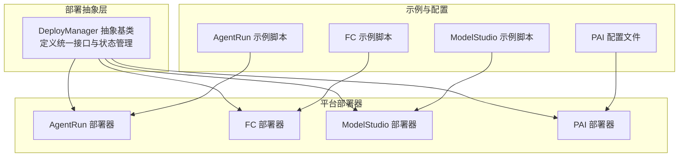
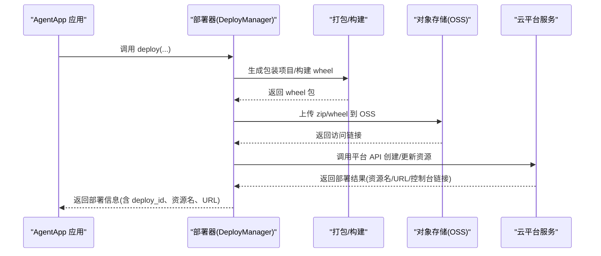
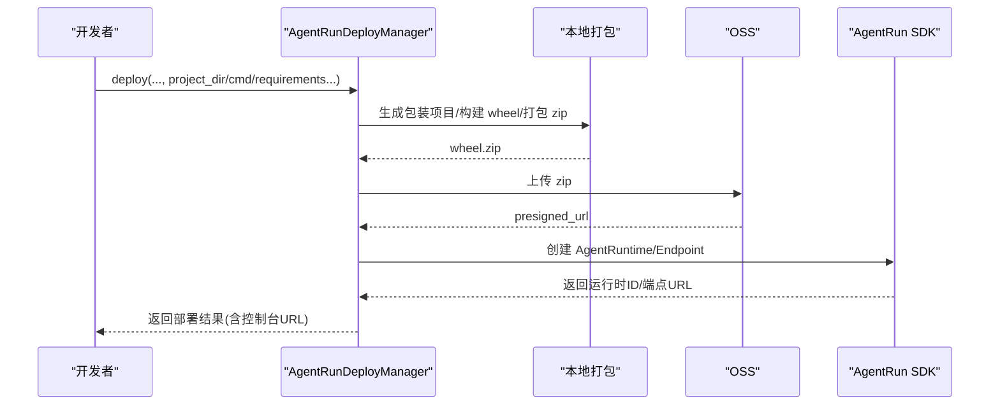
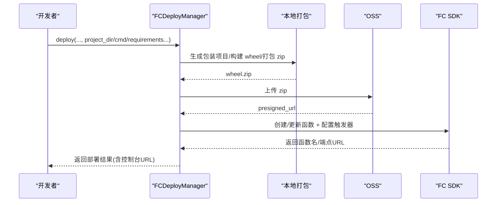
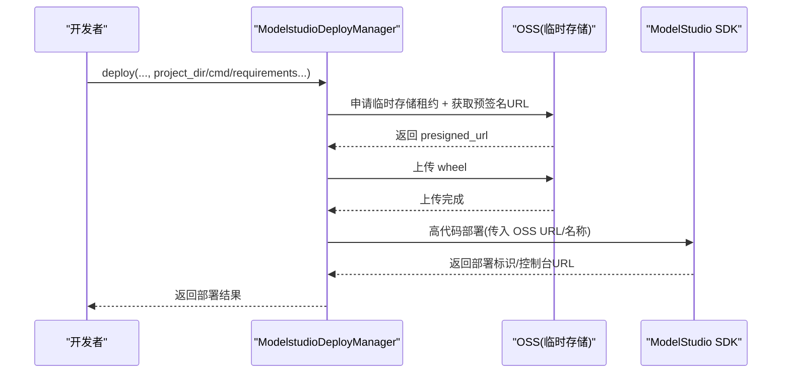
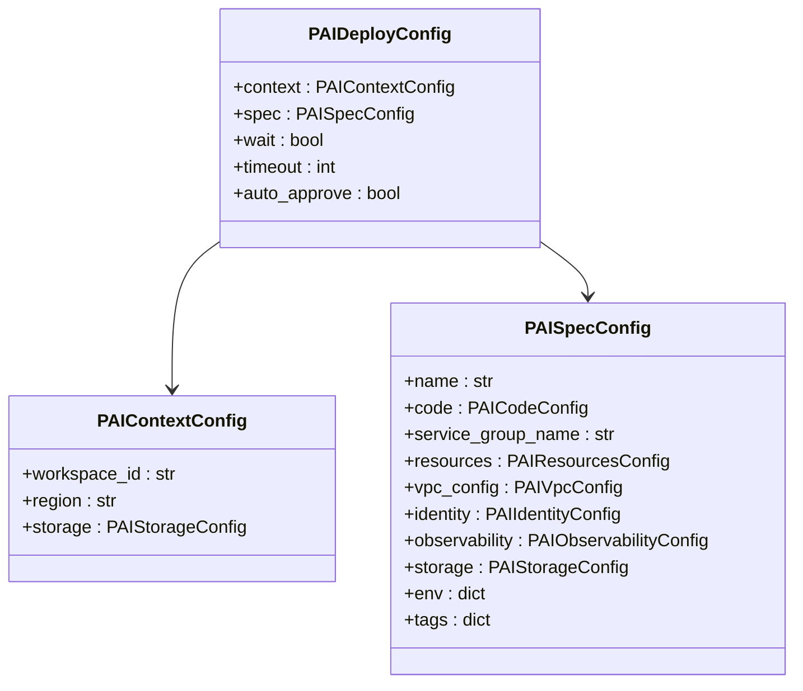
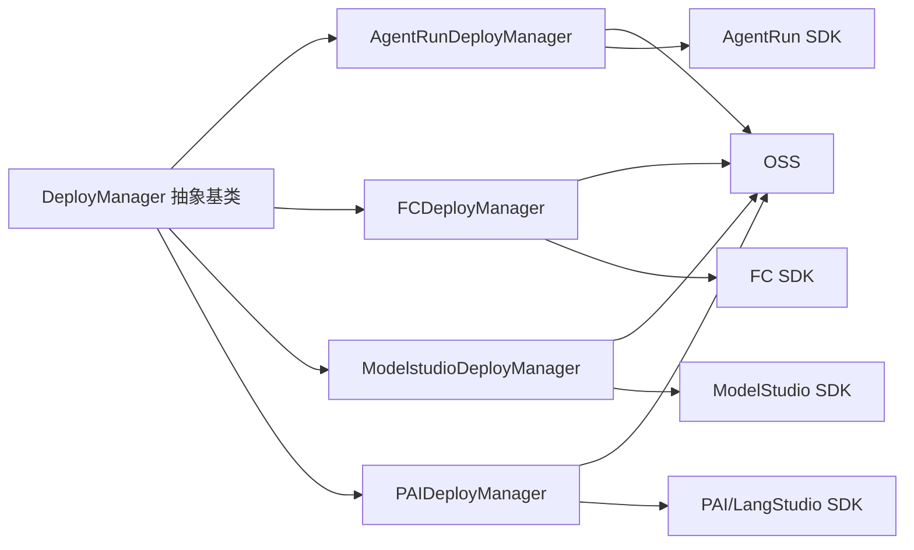

# 云平台部署

<cite>
**本文引用的文件**
- [agentrun_deployer.py](file://src/agentscope_runtime/engine/deployers/agentrun_deployer.py)
- [fc_deployer.py](file://src/agentscope_runtime/engine/deployers/fc_deployer.py)
- [modelstudio_deployer.py](file://src/agentscope_runtime/engine/deployers/modelstudio_deployer.py)
- [pai_deployer.py](file://src/agentscope_runtime/engine/deployers/pai_deployer.py)
- [agentrun_client.py](file://src/agentscope_runtime/common/container_clients/agentrun_client.py)
- [base.py](file://src/agentscope_runtime/engine/deployers/base.py)
- [app_deploy_to_agentrun.py](file://examples/deployments/agentrun_deploy/app_deploy_to_agentrun.py)
- [app_deploy_to_fc.py](file://examples/deployments/fc_deploy/app_deploy_to_fc.py)
- [app_deploy_to_modelstudio.py](file://examples/deployments/modelstudio_deploy/app_deploy_to_modelstudio.py)
- [deploy_config.yaml](file://examples/deployments/pai_deploy/deploy_config.yaml)
</cite>

## 目录
1. [简介](#简介)
2. [项目结构](#项目结构)
3. [核心组件](#核心组件)
4. [架构总览](#架构总览)
5. [详细组件分析](#详细组件分析)
6. [依赖分析](#依赖分析)
7. [性能考虑](#性能考虑)
8. [故障排查指南](#故障排查指南)
9. [结论](#结论)
10. [附录](#附录)

## 简介
本文件面向需要在多云平台上部署智能体应用的工程师与运维人员，系统性阐述 AgentRun、函数计算（Function Compute，简称 FC）、ModelStudio 以及 PAI 平台的部署器实现原理、集成机制与使用方法。内容涵盖：
- 各平台部署流程与关键步骤
- 资源配置、计费模式与性能特点
- 平台特定的认证机制与 API 调用方式
- 多云部署策略与迁移指南
- 监控、日志与故障恢复机制
- 配置示例与最佳实践

## 项目结构
围绕“部署器”这一核心抽象，项目采用按平台拆分的模块化设计：
- 抽象基类：统一部署接口与状态管理
- 平台部署器：针对不同云平台的具体实现
- 示例脚本：演示如何从 AgentApp 或项目目录直接部署到各平台
- 容器客户端：用于沙箱环境下的 AgentRun 容器管理

图表来源
- [base.py:9-44](file://src/agentscope_runtime/engine/deployers/base.py#L9-L44)
- [agentrun_deployer.py:264-332](file://src/agentscope_runtime/engine/deployers/agentrun_deployer.py#L264-L332)
- [fc_deployer.py:246-288](file://src/agentscope_runtime/engine/deployers/fc_deployer.py#L246-L288)
- [modelstudio_deployer.py:544-565](file://src/agentscope_runtime/engine/deployers/modelstudio_deployer.py#L544-L565)
- [pai_deployer.py:597-720](file://src/agentscope_runtime/engine/deployers/pai_deployer.py#L597-L720)
- [app_deploy_to_agentrun.py:125-203](file://examples/deployments/agentrun_deploy/app_deploy_to_agentrun.py#L125-L203)
- [app_deploy_to_fc.py:125-207](file://examples/deployments/fc_deploy/app_deploy_to_fc.py#L125-L207)
- [app_deploy_to_modelstudio.py:125-201](file://examples/deployments/modelstudio_deploy/app_deploy_to_modelstudio.py#L125-L201)
- [deploy_config.yaml:1-39](file://examples/deployments/pai_deploy/deploy_config.yaml#L1-L39)

章节来源
- [base.py:9-44](file://src/agentscope_runtime/engine/deployers/base.py#L9-L44)

## 核心组件
- 抽象基类 DeployManager
  - 统一的部署接口与停止接口
  - 每次实例化生成唯一部署 ID，并内置状态管理器
- 平台部署器
  - AgentRunDeployManager：面向阿里云 AgentRun 的托管运行时
  - FCDeployManager：面向阿里云 FC 的函数计算服务
  - ModelstudioDeployManager：面向阿里云 ModelStudio 的全量代码部署
  - PAIDeployManager：面向阿里云 PAI 的工作流与服务编排
- 容器客户端 AgentRunClient
  - 在沙箱环境中管理 AgentRun 容器生命周期（创建、启动、停止、删除、检查）
  - 提供健康检查与状态轮询能力

章节来源
- [base.py:9-44](file://src/agentscope_runtime/engine/deployers/base.py#L9-L44)
- [agentrun_deployer.py:264-332](file://src/agentscope_runtime/engine/deployers/agentrun_deployer.py#L264-L332)
- [fc_deployer.py:246-288](file://src/agentscope_runtime/engine/deployers/fc_deployer.py#L246-L288)
- [modelstudio_deployer.py:544-565](file://src/agentscope_runtime/engine/deployers/modelstudio_deployer.py#L544-L565)
- [pai_deployer.py:597-720](file://src/agentscope_runtime/engine/deployers/pai_deployer.py#L597-L720)
- [agentrun_client.py:32-66](file://src/agentscope_runtime/common/container_clients/agentrun_client.py#L32-L66)

## 架构总览
下图展示了从应用到平台部署器再到云服务的整体调用链路与数据流。

图表来源
- [base.py:23-43](file://src/agentscope_runtime/engine/deployers/base.py#L23-L43)
- [agentrun_deployer.py:521-733](file://src/agentscope_runtime/engine/deployers/agentrun_deployer.py#L521-L733)
- [fc_deployer.py:416-585](file://src/agentscope_runtime/engine/deployers/fc_deployer.py#L416-L585)
- [modelstudio_deployer.py:727-800](file://src/agentscope_runtime/engine/deployers/modelstudio_deployer.py#L727-L800)
- [pai_deployer.py:1100-1200](file://src/agentscope_runtime/engine/deployers/pai_deployer.py#L1100-L1200)

## 详细组件分析

### AgentRun 部署器（阿里云 AgentRun）
- 实现要点
  - 通过 Pydantic 配置模型加载环境变量，支持区域、日志、网络等参数
  - 将用户项目打包为 wheel，并在容器内构建 zip 包
  - 上传至 OSS，再调用 AgentRun SDK 创建运行时与端点
  - 支持跳过上传、外部 wheel 文件、自定义端点等高级选项
- 认证与 API
  - 使用 OpenAPI 配置，基于 AK/SK 与区域端点
  - SDK 调用包括创建运行时、创建端点、轮询状态等
- 资源与计费
  - CPU/内存规格可配置；会话并发与空闲超时可设置
  - 运行时状态轮询，确保部署成功后再返回结果
- 监控与日志
  - 可选配置日志项目与日志库
  - 控制台链接便于查看部署状态与指标

图表来源
- [agentrun_deployer.py:521-733](file://src/agentscope_runtime/engine/deployers/agentrun_deployer.py#L521-L733)
- [agentrun_deployer.py:394-458](file://src/agentscope_runtime/engine/deployers/agentrun_deployer.py#L394-L458)
- [agentrun_deployer.py:674-728](file://src/agentscope_runtime/engine/deployers/agentrun_deployer.py#L674-L728)

章节来源
- [agentrun_deployer.py:87-201](file://src/agentscope_runtime/engine/deployers/agentrun_deployer.py#L87-L201)
- [agentrun_deployer.py:264-332](file://src/agentscope_runtime/engine/deployers/agentrun_deployer.py#L264-L332)
- [agentrun_deployer.py:521-733](file://src/agentscope_runtime/engine/deployers/agentrun_deployer.py#L521-L733)
- [agentrun_client.py:32-66](file://src/agentscope_runtime/common/container_clients/agentrun_client.py#L32-L66)

### 函数计算（FC）部署器（阿里云 FC）
- 实现要点
  - 与 AgentRun 类似，支持从 AgentApp 或项目目录打包部署
  - 通过 OSS 作为中间存储，调用 FC SDK 创建/更新函数
  - 支持 VPC、日志、会话亲和等高级配置
- 认证与 API
  - 基于 AK/SK 与账户域名为端点
  - 支持创建/更新函数、配置自定义运行时、HTTP 触发器
- 资源与计费
  - CPU/内存/磁盘可配置；实例并发、超时、磁盘大小等参数可控
  - 会话亲和通过请求头绑定固定实例，提升交互体验
- 监控与日志
  - 可选开启请求/实例指标日志

图表来源
- [fc_deployer.py:416-585](file://src/agentscope_runtime/engine/deployers/fc_deployer.py#L416-L585)
- [fc_deployer.py:587-800](file://src/agentscope_runtime/engine/deployers/fc_deployer.py#L587-L800)

章节来源
- [fc_deployer.py:67-199](file://src/agentscope_runtime/engine/deployers/fc_deployer.py#L67-L199)
- [fc_deployer.py:246-288](file://src/agentscope_runtime/engine/deployers/fc_deployer.py#L246-L288)
- [fc_deployer.py:416-585](file://src/agentscope_runtime/engine/deployers/fc_deployer.py#L416-L585)

### ModelStudio 部署器（阿里云 ModelStudio）
- 实现要点
  - 通过临时存储租约申请预签名 URL，直接上传 wheel 至 OSS
  - 调用 ModelStudio SDK 执行“全量代码部署”，返回部署标识
  - 支持从 AgentApp 或项目目录打包部署
- 认证与 API
  - 支持 STS Token 与 DashScope API Key
  - 通过 OpenAPI 客户端调用高代码部署接口
- 资源与计费
  - 以工作区维度进行资源隔离与权限控制
- 监控与日志
  - 控制台链接便于查看部署状态与运行日志

图表来源
- [modelstudio_deployer.py:291-411](file://src/agentscope_runtime/engine/deployers/modelstudio_deployer.py#L291-L411)
- [modelstudio_deployer.py:413-542](file://src/agentscope_runtime/engine/deployers/modelstudio_deployer.py#L413-L542)
- [modelstudio_deployer.py:727-800](file://src/agentscope_runtime/engine/deployers/modelstudio_deployer.py#L727-L800)

章节来源
- [modelstudio_deployer.py:50-131](file://src/agentscope_runtime/engine/deployers/modelstudio_deployer.py#L50-L131)
- [modelstudio_deployer.py:544-565](file://src/agentscope_runtime/engine/deployers/modelstudio_deployer.py#L544-L565)
- [modelstudio_deployer.py:727-800](file://src/agentscope_runtime/engine/deployers/modelstudio_deployer.py#L727-L800)

### PAI 部署器（阿里云 PAI）
- 实现要点
  - 支持 YAML/字典两种配置方式，合并 CLI 参数
  - 提供上下文（工作区、区域）、规格（资源类型、实例数、CPU/内存）、VPC、身份、可观测性、存储、环境变量、标签等配置
  - 通过 LangStudio 客户端封装 ROA API，支持列出/获取/创建/删除 Flow，创建快照，创建部署等
- 认证与 API
  - 基于 OpenAPI 客户端，支持 AK 认证
  - 通过 ROA 协议调用 LangStudio 接口
- 资源与计费
  - 支持公共池、资源组、配额三种资源类型
  - 可配置 ECS 实例规格、实例数量、工作目录等
- 监控与日志
  - 可启用追踪/遥测；通过控制台查看部署状态与指标

图表来源
- [pai_deployer.py:721-780](file://src/agentscope_runtime/engine/deployers/pai_deployer.py#L721-L780)
- [pai_deployer.py:676-720](file://src/agentscope_runtime/engine/deployers/pai_deployer.py#L676-L720)

章节来源
- [pai_deployer.py:597-720](file://src/agentscope_runtime/engine/deployers/pai_deployer.py#L597-L720)
- [pai_deployer.py:1-200](file://src/agentscope_runtime/engine/deployers/pai_deployer.py#L1-L200)
- [deploy_config.yaml:1-39](file://examples/deployments/pai_deploy/deploy_config.yaml#L1-L39)

## 依赖分析
- 组件耦合
  - 所有部署器均继承自 DeployManager，保证统一接口与状态管理
  - 平台部署器内部依赖各自云 SDK（如 AgentRun、FC、ModelStudio、PAI），并通过 OSS 作为通用中间存储
- 外部依赖
  - 阿里云 SDK：AgentRun、FC、ModelStudio、PAI 等
  - 对象存储：OSS（临时存储或制品存储）
  - OpenAPI 客户端：用于构建与调用云服务 API

图表来源
- [base.py:9-44](file://src/agentscope_runtime/engine/deployers/base.py#L9-L44)
- [agentrun_deployer.py:264-332](file://src/agentscope_runtime/engine/deployers/agentrun_deployer.py#L264-L332)
- [fc_deployer.py:246-288](file://src/agentscope_runtime/engine/deployers/fc_deployer.py#L246-L288)
- [modelstudio_deployer.py:544-565](file://src/agentscope_runtime/engine/deployers/modelstudio_deployer.py#L544-L565)
- [pai_deployer.py:597-720](file://src/agentscope_runtime/engine/deployers/pai_deployer.py#L597-L720)

章节来源
- [base.py:9-44](file://src/agentscope_runtime/engine/deployers/base.py#L9-L44)

## 性能考虑
- 构建与打包
  - 使用容器内构建 wheel 与 zip，减少宿主机差异带来的兼容性问题
  - 优先复用已构建的 wheel，避免重复打包
- 资源规格
  - 根据并发与延迟要求调整 CPU/内存/磁盘；FC 支持更细粒度的实例并发与会话亲和
- 网络与安全
  - 在需要访问内网资源时，配置 VPC/VSwitch/安全组；注意公网/私网模式切换对延迟与成本的影响
- 日志与观测
  - 开启请求/实例指标日志，结合控制台定位性能瓶颈
  - PAI 支持启用追踪/遥测，便于端到端性能分析

## 故障排查指南
- 常见错误与处理
  - 缺少必要环境变量：检查 AK/SK、账户 ID、工作区 ID、DashScope API Key 等
  - OSS 权限不足：确认 OSS Bucket 存在且具备写入权限；ModelStudio 需要 RAM 用户关联工作区
  - 云 SDK 未安装：根据提示安装对应 SDK 包
  - 状态轮询失败：AgentRun/FC 端点状态轮询存在最大尝试次数与间隔，需等待或检查资源状态
- 建议排查步骤
  - 查看部署返回的控制台链接，确认资源创建状态
  - 检查日志配置是否正确，确认日志项目/库可用
  - 使用示例脚本中的 curl 命令验证端点可用性与会话亲和行为
  - 如需回滚或更新，参考各平台的“更新/删除”流程

章节来源
- [modelstudio_deployer.py:238-289](file://src/agentscope_runtime/engine/deployers/modelstudio_deployer.py#L238-L289)
- [agentrun_deployer.py:274-284](file://src/agentscope_runtime/engine/deployers/agentrun_deployer.py#L274-L284)
- [fc_deployer.py:246-288](file://src/agentscope_runtime/engine/deployers/fc_deployer.py#L246-L288)

## 结论
本项目通过统一的 DeployManager 抽象与平台特定的部署器实现，提供了从本地项目到多云平台的一站式部署能力。借助 OSS 作为通用制品存储与各平台 SDK 的 API 调用，开发者可以快速完成智能体应用的上线与运维。建议在生产环境中结合资源规格、网络与安全策略、日志与观测体系，制定标准化的部署与变更流程。

## 附录

### 多云部署策略与迁移指南
- 策略建议
  - 以“配置即代码”的方式管理各平台配置（如 PAI 的 YAML）
  - 在 CI/CD 中统一执行打包与上传，减少手工操作
  - 通过环境变量区分不同环境（开发/测试/生产），并严格控制敏感信息
- 迁移路径
  - 从本地/沙箱迁移到 FC：保持端点与协议一致，仅替换部署器与配置
  - 从 FC 迁移到 AgentRun：关注运行时端点与会话亲和配置差异
  - 从 ModelStudio 迁移到 PAI：关注资源类型（公共/资源组/配额）与工作流编排差异

### 平台特性对比（概览）
- AgentRun
  - 适合托管运行时场景，端点管理与状态轮询完善
  - 支持公网/私网/公网+私网网络模式
- FC
  - 适合事件驱动与低延迟函数场景，支持会话亲和
  - 配置项丰富，便于精细化资源控制
- ModelStudio
  - 适合全量代码部署，工作区权限与临时存储租约机制明确
- PAI
  - 适合复杂工作流与服务编排，支持多种资源类型与 VPC 集成

### 配置示例与最佳实践
- AgentRun 示例
  - 通过示例脚本演示从 AgentApp 或项目目录部署，支持 requirements、extra_packages、环境变量注入
- FC 示例
  - 展示如何配置账户 ID、区域、VPC、日志等参数，并输出端点 URL
- ModelStudio 示例
  - 展示如何配置工作区 ID、DashScope API Key、OSS 凭证等
- PAI 配置
  - 使用 YAML 描述上下文与规格，支持 CLI 合并覆盖

章节来源
- [app_deploy_to_agentrun.py:125-203](file://examples/deployments/agentrun_deploy/app_deploy_to_agentrun.py#L125-L203)
- [app_deploy_to_fc.py:125-207](file://examples/deployments/fc_deploy/app_deploy_to_fc.py#L125-L207)
- [app_deploy_to_modelstudio.py:125-201](file://examples/deployments/modelstudio_deploy/app_deploy_to_modelstudio.py#L125-L201)
- [deploy_config.yaml:1-39](file://examples/deployments/pai_deploy/deploy_config.yaml#L1-L39)