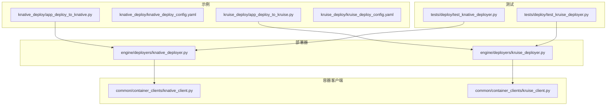
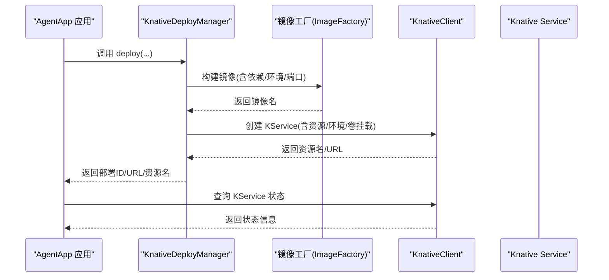
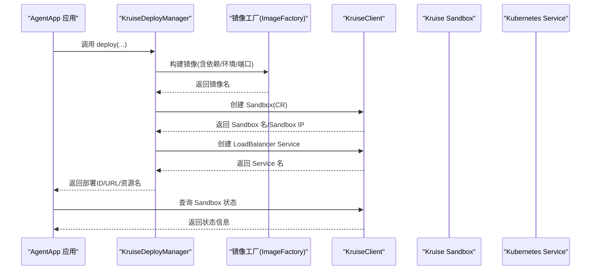
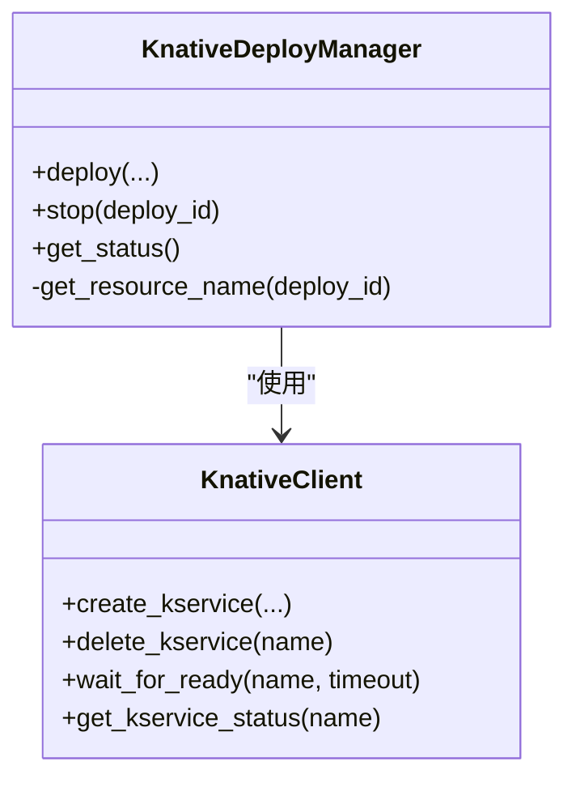
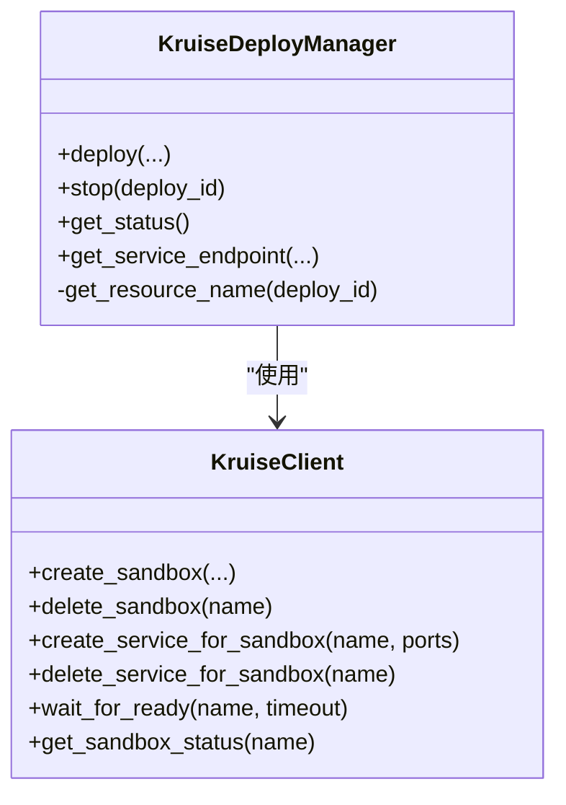
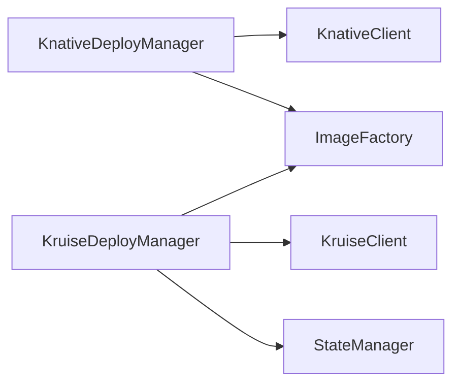

# 无服务器部署

<cite>
**本文引用的文件**
- [examples\deployments\knative_deploy\app_deploy_to_knative.py](file://examples/deployments/knative_deploy/app_deploy_to_knative.py)
- [examples\deployments\knative_deploy\knative_deploy_config.yaml](file://examples/deployments/knative_deploy/knative_deploy_config.yaml)
- [examples\deployments\kruise_deploy\app_deploy_to_kruise.py](file://examples/deployments/kruise_deploy/app_deploy_to_kruise.py)
- [examples\deployments\kruise_deploy\kruise_deploy_config.yaml](file://examples/deployments/kruise_deploy/kruise_deploy_config.yaml)
- [src\agentscope_runtime\engine\deployers\knative_deployer.py](file://src/agentscope_runtime/engine/deployers/knative_deployer.py)
- [src\agentscope_runtime\engine\deployers\kruise_deployer.py](file://src/agentscope_runtime/engine/deployers/kruise_deployer.py)
- [src\agentscope_runtime\common\container_clients\knative_client.py](file://src/agentscope_runtime/common/container_clients/knative_client.py)
- [src\agentscope_runtime\common\container_clients\kruise_client.py](file://src/agentscope_runtime/common/container_clients/kruise_client.py)
- [tests\deploy\test_knative_deployer.py](file://tests/deploy/test_knative_deployer.py)
- [tests\deploy\test_kruise_deployer.py](file://tests/deploy/test_kruise_deployer.py)
- [examples\deployments\knative_deploy\README.md](file://examples/deployments/knative_deploy/README.md)
- [examples\deployments\kruise_deploy\README.md](file://examples/deployments/kruise_deploy/README.md)
- [src\agentscope_runtime\engine\tracing\wrapper.py](file://src/agentscope_runtime/engine/tracing/wrapper.py)
- [src\agentscope_runtime\engine\tracing\tracing_util.py](file://src/agentscope_runtime/engine/tracing/tracing_util.py)
- [src\agentscope_runtime\engine\tracing\tracing_metric.py](file://src/agentscope_runtime/engine/tracing/tracing_metric.py)
- [src\agentscope_runtime\engine\tracing\README.md](file://src/agentscope_runtime/engine/tracing/README.md)
</cite>

## 目录
1. [简介](#简介)
2. [项目结构](#项目结构)
3. [核心组件](#核心组件)
4. [架构总览](#架构总览)
5. [详细组件分析](#详细组件分析)
6. [依赖关系分析](#依赖关系分析)
7. [性能考虑](#性能考虑)
8. [故障排查指南](#故障排查指南)
9. [结论](#结论)
10. [附录](#附录)

## 简介
本文件面向在 Kubernetes 上进行无服务器（Serverless）部署的用户，系统性讲解基于 Knative 与 Kruise 的两种部署器实现，覆盖以下主题：
- Serverless 架构原理与运行时特性（自动扩缩容、冷启动优化、事件驱动触发）
- Knative 的流量路由、版本管理与蓝绿发布能力
- Kruise 的弹性伸缩与滚动更新机制
- 无服务器资源配置项与成本控制策略
- 性能监控与调试技巧
- 完整部署配置与最佳实践

## 项目结构
本仓库提供了 Knative 与 Kruise 两种无服务器部署示例与对应的部署器实现，以及配套的容器客户端、测试用例与使用说明文档。

图示来源
- [examples\deployments\knative_deploy\app_deploy_to_knative.py:123-224](file://examples/deployments/knative_deploy/app_deploy_to_knative.py#L123-L224)
- [examples\deployments\kruise_deploy\app_deploy_to_kruise.py:119-221](file://examples/deployments/kruise_deploy/app_deploy_to_kruise.py#L119-L221)
- [src\agentscope_runtime\engine\deployers\knative_deployer.py:43-291](file://src/agentscope_runtime/engine/deployers/knative_deployer.py#L43-L291)
- [src\agentscope_runtime\engine\deployers\kruise_deployer.py:37-434](file://src/agentscope_runtime/engine/deployers/kruise_deployer.py#L37-L434)
- [src\agentscope_runtime\common\container_clients\knative_client.py:15-468](file://src/agentscope_runtime/common/container_clients/knative_client.py#L15-L468)
- [src\agentscope_runtime\common\container_clients\kruise_client.py:22-623](file://src/agentscope_runtime/common/container_clients/kruise_client.py#L22-L623)

章节来源
- [examples\deployments\knative_deploy\README.md:1-314](file://examples/deployments/knative_deploy/README.md#L1-L314)
- [examples\deployments\kruise_deploy\README.md:1-257](file://examples/deployments/kruise_deploy/README.md#L1-L257)

## 核心组件
- KnativeDeployManager：负责将应用打包为容器镜像并创建 Knative Service，支持资源限制、环境变量、健康检查与超时控制。
- KruiseDeployManager：负责将应用打包为容器镜像并创建 Kruise Sandbox 自定义资源，同时自动创建 LoadBalancer Service 提供外部访问。
- KnativeClient：封装对 Knative Service 的创建、删除、状态查询与就绪等待等操作。
- KruiseClient：封装对 Kruise Sandbox CR 的创建、删除、状态查询与关联 Service 的创建/删除等操作。
- 配置模型：K8sConfig、BuildConfig（Knatives 专用）、RegistryConfig（镜像仓库配置）等。

章节来源
- [src\agentscope_runtime\engine\deployers\knative_deployer.py:43-291](file://src/agentscope_runtime/engine/deployers/knative_deployer.py#L43-L291)
- [src\agentscope_runtime\engine\deployers\kruise_deployer.py:37-434](file://src/agentscope_runtime/engine/deployers/kruise_deployer.py#L37-L434)
- [src\agentscope_runtime\common\container_clients\knative_client.py:15-468](file://src/agentscope_runtime/common/container_clients/knative_client.py#L15-L468)
- [src\agentscope_runtime\common\container_clients\kruise_client.py:22-623](file://src/agentscope_runtime/common/container_clients/kruise_client.py#L22-L623)

## 架构总览
下图展示了从应用到无服务器服务的关键交互路径，包括镜像构建、资源创建、服务暴露与状态查询。

图示来源
- [src\agentscope_runtime\engine\deployers\knative_deployer.py:71-222](file://src/agentscope_runtime/engine/deployers/knative_deployer.py#L71-L222)
- [src\agentscope_runtime\common\container_clients\knative_client.py:114-200](file://src/agentscope_runtime/common/container_clients/knative_client.py#L114-L200)

图示来源
- [src\agentscope_runtime\engine\deployers\kruise_deployer.py:138-347](file://src/agentscope_runtime/engine/deployers/kruise_deployer.py#L138-L347)
- [src\agentscope_runtime\common\container_clients\kruise_client.py:84-174](file://src/agentscope_runtime/common/container_clients/kruise_client.py#L84-L174)

## 详细组件分析

### Knative 部署器与客户端
- 关键职责
  - 镜像构建与推送：通过 ImageFactory 统一构建 Runner 或 App 对应的镜像，并可选择推送到注册表。
  - KService 创建：调用 KnativeClient 创建 Knative Service，支持端口、环境变量、卷挂载、资源限制与安全上下文等。
  - 健康检查与就绪等待：提供 wait_for_ready 与 get_kservice_status，便于部署后验证。
  - 资源清理：delete_kservice 支持按名称删除 KService。
- 自动扩缩容与冷启动
  - Knative 基于请求量进行自动扩缩容，空闲实例可缩至零，首次请求触发冷启动。
  - 通过 runtime_config 中的 resources.requests/limits 控制初始资源与上限，有助于缩短冷启动时间与提升稳定性。
- 流量路由与版本管理
  - Knative 支持基于 Revision 的版本管理与流量分配，可通过注解与标签精细控制流量切分与蓝绿发布。
- 事件驱动触发
  - Knative Eventing 可将外部事件（如消息队列、定时器、云厂商事件源）映射为 HTTP 请求或内部函数调用，实现事件驱动的无服务器工作流。

图示来源
- [src\agentscope_runtime\engine\deployers\knative_deployer.py:43-291](file://src/agentscope_runtime/engine/deployers/knative_deployer.py#L43-L291)
- [src\agentscope_runtime\common\container_clients\knative_client.py:114-468](file://src/agentscope_runtime/common/container_clients/knative_client.py#L114-L468)

章节来源
- [src\agentscope_runtime\engine\deployers\knative_deployer.py:71-222](file://src/agentscope_runtime/engine/deployers/knative_deployer.py#L71-L222)
- [src\agentscope_runtime\common\container_clients\knative_client.py:114-200](file://src/agentscope_runtime/common/container_clients/knative_client.py#L114-L200)

### Kruise 部署器与客户端
- 关键职责
  - Sandbox CR 创建：通过 KruiseClient 创建 Kruise Sandbox 自定义资源，承载容器化应用。
  - Service 暴露：自动创建 LoadBalancer Service，支持本地与云端环境的端点选择逻辑。
  - 状态管理：结合状态管理器持久化部署状态，支持停止时更新状态。
  - 弹性伸缩与滚动更新：Kruise 提供更灵活的 Pod 管理能力，适合需要更强弹性与更新策略的场景。
- 与 Knative 的差异
  - Kruise 更偏向自定义资源与 Service 的组合，适合需要更强控制力与扩展性的企业级场景；Knative 更强调 Serverless 的自动扩缩容与事件驱动。

图示来源
- [src\agentscope_runtime\engine\deployers\kruise_deployer.py:37-434](file://src/agentscope_runtime/engine/deployers/kruise_deployer.py#L37-L434)
- [src\agentscope_runtime\common\container_clients\kruise_client.py:84-623](file://src/agentscope_runtime/common/container_clients/kruise_client.py#L84-L623)

章节来源
- [src\agentscope_runtime\engine\deployers\kruise_deployer.py:138-347](file://src/agentscope_runtime/engine/deployers/kruise_deployer.py#L138-L347)
- [src\agentscope_runtime\common\container_clients\kruise_client.py:436-550](file://src/agentscope_runtime/common/container_clients/kruise_client.py#L436-L550)

### 配置项与成本控制策略
- 基础配置
  - 注册表与命名空间：RegistryConfig 与 K8sConfig，用于镜像推送与资源命名空间。
  - 运行时配置：runtime_config 中的 resources.requests/limits、image_pull_policy、node_selector、tolerations、security_context 等。
- 成本控制建议
  - 合理设置 requests/limits：避免过度预留导致资源浪费，同时保证稳定性。
  - 使用 IfNotPresent 策略减少不必要的拉取开销。
  - 在多可用区集群中使用 node_selector 将工作负载调度到成本更低的节点组。
  - 结合 Knative 的自动扩缩容与 Kruise 的弹性策略，按流量波动动态调整资源。
- 平台与架构：platform 字段指定目标平台架构，影响镜像构建与运行兼容性。

章节来源
- [examples\deployments\knative_deploy\knative_deploy_config.yaml:40-56](file://examples/deployments/knative_deploy/knative_deploy_config.yaml#L40-L56)
- [examples\deployments\kruise_deploy\kruise_deploy_config.yaml:42-59](file://examples/deployments/kruise_deploy/kruise_deploy_config.yaml#L42-L59)
- [src\agentscope_runtime\common\container_clients\knative_client.py:290-327](file://src/agentscope_runtime/common/container_clients/knative_client.py#L290-L327)
- [src\agentscope_runtime\common\container_clients\kruise_client.py:287-324](file://src/agentscope_runtime/common/container_clients/kruise_client.py#L287-L324)

### 无服务器资源与端到端流程
- Knative
  - 通过 KService 承载应用，支持多端点、流式响应与健康检查。
  - 示例脚本演示了同步/异步/流式端点与任务处理的完整用法。
- Kruise
  - 通过 Sandbox CR 承载应用，自动创建 Service 暴露外部访问。
  - 示例脚本演示了健康检查与多端点测试流程。

章节来源
- [examples\deployments\knative_deploy\app_deploy_to_knative.py:86-118](file://examples/deployments/knative_deploy/app_deploy_to_knative.py#L86-L118)
- [examples\deployments\kruise_deploy\app_deploy_to_kruise.py:82-114](file://examples/deployments/kruise_deploy/app_deploy_to_kruise.py#L82-L114)

## 依赖关系分析
- 组件耦合
  - KnativeDeployManager 与 KruiseDeployManager 分别依赖各自的容器客户端（KnativeClient/KruiseClient），并通过 ImageFactory 完成镜像构建。
  - 部署器与状态管理器配合，KruiseDeployManager 会持久化部署状态以便后续查询与停止。
- 外部依赖
  - Kubernetes API（CustomObjectsApi/CoreV1）用于资源创建、删除与状态查询。
  - 镜像注册表用于推送/拉取镜像。
- 潜在循环依赖
  - 当前模块间为单向依赖（部署器 -> 客户端），未见循环依赖迹象。

图示来源
- [src\agentscope_runtime\engine\deployers\knative_deployer.py:43-70](file://src/agentscope_runtime/engine/deployers/knative_deployer.py#L43-L70)
- [src\agentscope_runtime\engine\deployers\kruise_deployer.py:44-81](file://src/agentscope_runtime/engine/deployers/kruise_deployer.py#L44-L81)

章节来源
- [src\agentscope_runtime\engine\deployers\knative_deployer.py:43-70](file://src/agentscope_runtime/engine/deployers/knative_deployer.py#L43-L70)
- [src\agentscope_runtime\engine\deployers\kruise_deployer.py:44-81](file://src/agentscope_runtime/engine/deployers/kruise_deployer.py#L44-L81)

## 性能考虑
- 冷启动优化
  - 合理设置 resources.requests，避免过小导致频繁 OOM；适当提高 limits 以降低重启概率。
  - 使用 IfNotPresent 减少镜像拉取延迟；确保镜像层缓存与注册表就近部署。
  - Knative 的自动扩缩容会在空闲时缩至零，建议通过预热请求或长生命周期实例策略降低首包延迟。
- 扩缩容策略
  - Knative：基于并发与 CPU/内存指标进行弹性；合理设置并发阈值与超时，避免抖动。
  - Kruise：结合 Sandbox 的弹性能力与滚动更新策略，平滑替换实例，降低中断风险。
- 网络与路由
  - Knative 的流量路由支持细粒度的版本与权重控制，适合灰度与蓝绿发布。
  - Kruise 通过 Service 暴露，适合与 Ingress/网关配合实现统一入口与 TLS 终止。

## 故障排查指南
- 常见问题定位
  - 注册表认证：确认已登录并具备推送权限；检查镜像是否成功推送到注册表。
  - 权限不足：确认在目标命名空间具有创建/删除 KService/Sandbox 的权限。
  - 资源配额：检查节点资源与命名空间配额，避免因资源不足导致 Pod 无法调度。
  - 镜像拉取失败：查看 Pod 描述信息，确认镜像名称与拉取策略正确。
- 日志与诊断
  - 查看 Pod 日志与描述信息，定位启动失败原因。
  - 使用 Knative/Kruise 客户端的状态查询接口，获取 Ready 条件与错误信息。
- 单元测试参考
  - 测试用例覆盖了部署成功/失败、停止、状态查询等关键路径，可作为行为参考与回归保障。

章节来源
- [tests\deploy\test_knative_deployer.py:92-206](file://tests/deploy/test_knative_deployer.py#L92-L206)
- [tests\deploy\test_kruise_deployer.py:86-218](file://tests/deploy/test_kruise_deployer.py#L86-L218)
- [examples\deployments\knative_deploy\README.md:227-257](file://examples/deployments/knative_deploy/README.md#L227-L257)
- [examples\deployments\kruise_deploy\README.md:215-251](file://examples/deployments/kruise_deploy/README.md#L215-L251)

## 结论
- Knative 适合追求 Serverless 自动扩缩容与事件驱动的场景，具备成熟的流量路由与版本管理能力。
- Kruise 适合需要更强自定义资源控制与弹性策略的企业级场景，结合 Service 暴露与滚动更新，提供更高的灵活性。
- 通过合理的资源配置、成本控制与监控调试，可在生产环境中稳定运行无服务器工作负载。

## 附录

### 无服务器部署配置清单
- Knative
  - 注册表：registry_url、namespace
  - Kubernetes：k8s_namespace、kubeconfig_path
  - 运行时：resources.requests/limits、image_pull_policy、node_selector、tolerations
  - KService：port、image_tag、image_name、annotations、labels、requirements、extra_packages、base_image、environment、deploy_timeout、health_check、platform、push_to_registry
- Kruise
  - 注册表：registry_url、namespace
  - Kubernetes：k8s_namespace、kubeconfig_path
  - 运行时：resources.requests/limits、image_pull_policy、node_selector、tolerations
  - Sandbox：port、image_tag、image_name、annotations、labels、requirements、extra_packages、base_image、environment、deploy_timeout、health_check、platform、push_to_registry

章节来源
- [examples\deployments\knative_deploy\knative_deploy_config.yaml:4-56](file://examples/deployments/knative_deploy/knative_deploy_config.yaml#L4-L56)
- [examples\deployments\kruise_deploy\kruise_deploy_config.yaml:1-59](file://examples/deployments/kruise_deploy/kruise_deploy_config.yaml#L1-L59)

### 性能监控与调试
- 追踪与日志
  - 支持日志与报告两类追踪输出，可按需启用环境变量开关。
  - 提供装饰器 trace，用于非流式与流式函数的调用链追踪与事件记录。
- 实践建议
  - 在关键路径添加 trace 装饰器，结合日志与报告双通道输出，快速定位瓶颈。
  - 利用 OpenTelemetry 上下文传播，跨线程/跨进程传递请求 ID 与通用属性。

章节来源
- [src\agentscope_runtime\engine\tracing\README.md:1-73](file://src/agentscope_runtime/engine/tracing/README.md#L1-L73)
- [src\agentscope_runtime\engine\tracing\wrapper.py:178-552](file://src/agentscope_runtime/engine/tracing/wrapper.py#L178-L552)
- [src\agentscope_runtime\engine\tracing\tracing_util.py:23-136](file://src/agentscope_runtime/engine/tracing/tracing_util.py#L23-L136)
- [src\agentscope_runtime\engine\tracing\tracing_metric.py:1-82](file://src/agentscope_runtime/engine/tracing/tracing_metric.py#L1-L82)