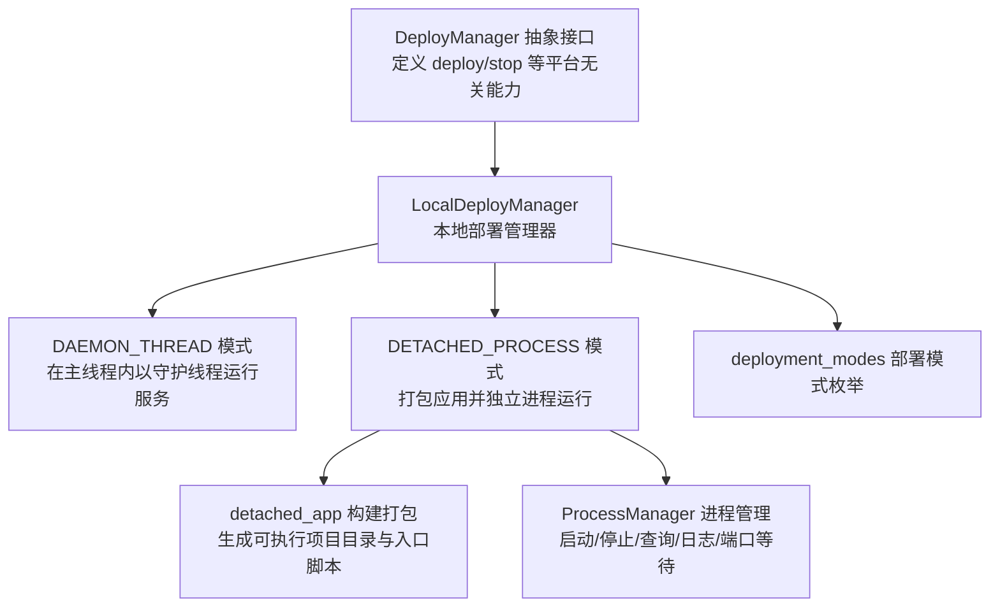
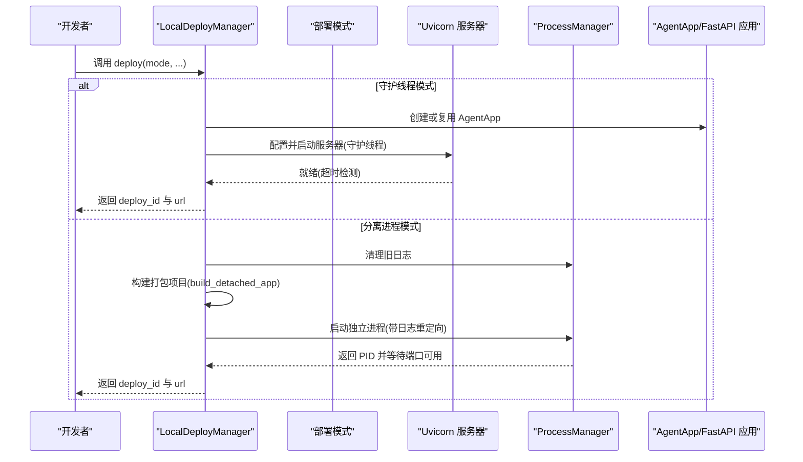
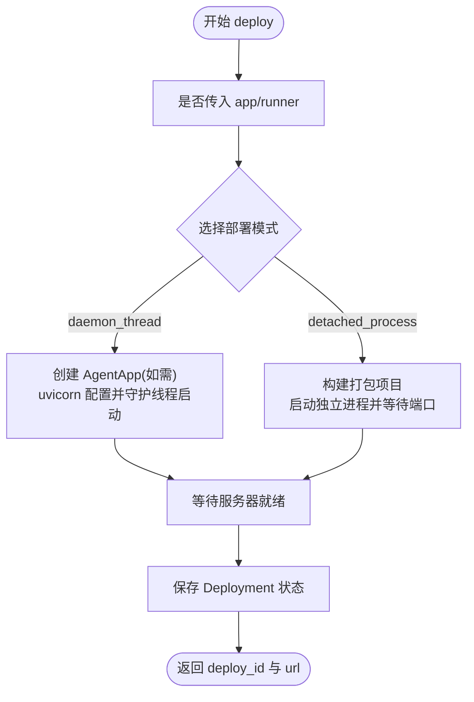
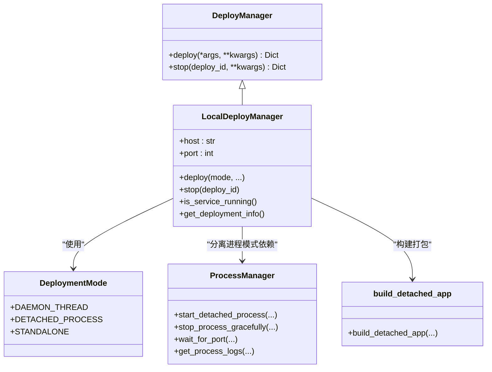

# 本地部署

<cite>
**本文引用的文件**   
- [local_deployer.py](file://src/agentscope_runtime/engine/deployers/local_deployer.py)
- [deployment_modes.py](file://src/agentscope_runtime/engine/deployers/utils/deployment_modes.py)
- [detached_app.py](file://src/agentscope_runtime/engine/deployers/utils/detached_app.py)
- [process_manager.py](file://src/agentscope_runtime/engine/deployers/utils/service_utils/process_manager.py)
- [base.py](file://src/agentscope_runtime/engine/deployers/base.py)
- [local_deploy_config.yaml](file://examples/deployments/local_deploy_config.yaml)
- [daemon_local_deploy/README.md](file://examples/deployments/daemon_local_deploy/README.md)
- [detached_local_deploy/README.md](file://examples/deployments/detached_local_deploy/README.md)
- [test_local_deployer.py](file://tests/deploy/test_local_deployer.py)
- [test_local_deployer_a2a.py](file://tests/deploy/test_local_deployer_a2a.py)
- [test_local_deployer_context.py](file://tests/deploy/test_local_deployer_context.py)
</cite>

## 目录
1. [简介](#简介)
2. [项目结构](#项目结构)
3. [核心组件](#核心组件)
4. [架构总览](#架构总览)
5. [详细组件分析](#详细组件分析)
6. [依赖分析](#依赖分析)
7. [性能考虑](#性能考虑)
8. [故障排除指南](#故障排除指南)
9. [结论](#结论)
10. [附录](#附录)

## 简介
本文件面向需要在本地进行部署与运行的用户，系统性讲解 LocalDeployer 的工作原理、实现机制与使用方法。内容涵盖：
- LocalDeployManager 的两种部署模式：守护线程模式（daemon_thread）与分离进程模式（detached_process）
- 配置项、环境变量与启动流程
- 进程生命周期管理、日志与健康检查
- 守护进程与前台运行模式的区别
- 本地开发最佳实践与性能优化建议
- 常见问题排查与故障排除
- 完整的本地部署示例与配置模板

## 项目结构
LocalDeployer 所在模块位于引擎的 deployers 子系统中，围绕统一的部署接口 DeployManager 实现本地部署能力，并通过工具模块支持打包、进程管理与部署模式切换。

图示来源
- [base.py:1-44](file://src/agentscope_runtime/engine/deployers/base.py#L1-L44)
- [local_deployer.py:27-645](file://src/agentscope_runtime/engine/deployers/local_deployer.py#L27-L645)
- [deployment_modes.py:7-15](file://src/agentscope_runtime/engine/deployers/utils/deployment_modes.py#L7-L15)
- [detached_app.py:40-144](file://src/agentscope_runtime/engine/deployers/utils/detached_app.py#L40-L144)
- [process_manager.py:12-441](file://src/agentscope_runtime/engine/deployers/utils/service_utils/process_manager.py#L12-L441)

章节来源
- [local_deployer.py:27-645](file://src/agentscope_runtime/engine/deployers/local_deployer.py#L27-L645)
- [deployment_modes.py:7-15](file://src/agentscope_runtime/engine/deployers/utils/deployment_modes.py#L7-L15)
- [detached_app.py:40-144](file://src/agentscope_runtime/engine/deployers/utils/detached_app.py#L40-L144)
- [process_manager.py:12-441](file://src/agentscope_runtime/engine/deployers/utils/service_utils/process_manager.py#L12-L441)
- [base.py:1-44](file://src/agentscope_runtime/engine/deployers/base.py#L1-L44)

## 核心组件
- LocalDeployManager：统一的本地部署管理器，负责选择部署模式、启动/停止服务、状态管理与错误处理。
- DeployManager 抽象基类：定义统一的部署接口，确保不同平台的部署器具有一致的调用方式。
- DeploymentMode：部署模式枚举，当前支持 daemon_thread 与 detached_process。
- detached_app：构建分离进程所需的打包项目，生成可执行目录与入口脚本。
- ProcessManager：分离进程模式下的生命周期管理，包括启动、优雅停止、端口等待、日志读取与旧日志清理等。

章节来源
- [local_deployer.py:27-645](file://src/agentscope_runtime/engine/deployers/local_deployer.py#L27-L645)
- [base.py:9-44](file://src/agentscope_runtime/engine/deployers/base.py#L9-L44)
- [deployment_modes.py:7-15](file://src/agentscope_runtime/engine/deployers/utils/deployment_modes.py#L7-L15)
- [detached_app.py:40-144](file://src/agentscope_runtime/engine/deployers/utils/detached_app.py#L40-L144)
- [process_manager.py:12-441](file://src/agentscope_runtime/engine/deployers/utils/service_utils/process_manager.py#L12-L441)

## 架构总览
LocalDeployManager 在两种模式下均基于 FastAPI 应用对外提供统一的 API 接口；差异在于运行形态与资源占用：
- 守护线程模式：在主线程内以守护线程运行 uvicorn 服务器，适合开发调试与快速验证。
- 分离进程模式：将应用打包为可执行项目，独立进程运行，支持远程关闭与进程监控，适合生产单节点场景。

图示来源
- [local_deployer.py:68-174](file://src/agentscope_runtime/engine/deployers/local_deployer.py#L68-L174)
- [local_deployer.py:175-258](file://src/agentscope_runtime/engine/deployers/local_deployer.py#L175-L258)
- [local_deployer.py:260-383](file://src/agentscope_runtime/engine/deployers/local_deployer.py#L260-L383)
- [detached_app.py:40-144](file://src/agentscope_runtime/engine/deployers/utils/detached_app.py#L40-L144)
- [process_manager.py:25-138](file://src/agentscope_runtime/engine/deployers/utils/service_utils/process_manager.py#L25-L138)

## 详细组件分析

### LocalDeployManager 工作原理与实现机制
- 初始化参数
  - host/port：绑定地址与端口，默认 127.0.0.1:8090
  - startup_timeout/shutdown_timeout：启动与停止超时时间
  - 日志器：可注入自定义 logger
- 部署流程
  - 支持从 AgentApp 或 Runner 直接部署；若传入 app，会自动提取 endpoint、请求模型、协议适配器等配置
  - 根据 DeploymentMode 选择具体部署路径
- 守护线程模式
  - 创建 uvicorn.Config 并在守护线程中运行 serve()
  - 使用 _wait_for_server_ready() 等待端口就绪
  - 记录 Deployment 状态并保存到状态管理器
- 分离进程模式
  - 通过 build_detached_app 生成可执行项目目录
  - 使用 ProcessManager 启动独立进程，重定向 stdout/stderr 到 /tmp/agentscope_runtime_logs
  - 等待端口可用，失败时读取最近日志辅助诊断
  - 写入 PID 文件，便于后续管理
- 停止流程
  - 若为分离进程且可通过 HTTP 关闭则发送 /shutdown
  - 否则直接调用 _stop_daemon_thread/_stop_detached_process
  - 更新状态管理器中的状态为 stopped

图示来源
- [local_deployer.py:68-174](file://src/agentscope_runtime/engine/deployers/local_deployer.py#L68-L174)
- [local_deployer.py:175-258](file://src/agentscope_runtime/engine/deployers/local_deployer.py#L175-L258)
- [local_deployer.py:260-383](file://src/agentscope_runtime/engine/deployers/local_deployer.py#L260-L383)

章节来源
- [local_deployer.py:27-645](file://src/agentscope_runtime/engine/deployers/local_deployer.py#L27-L645)

### DeploymentMode 枚举与模式选择
- DAEMON_THREAD：在主线程内以守护线程运行 uvicorn 服务器
- DETACHED_PROCESS：打包应用为独立进程运行
- STANDALONE：打包项目模板模式（用于生成可执行项目）

章节来源
- [deployment_modes.py:7-15](file://src/agentscope_runtime/engine/deployers/utils/deployment_modes.py#L7-L15)

### 分离进程打包与入口脚本
- build_detached_app
  - 输入：AgentApp/Runner/entrypoint、额外依赖、输出目录、Dockerfile 等
  - 输出：项目根目录与 ProjectInfo
  - 步骤：解析入口、解压 deployment.zip、追加 requirements、写入 bundle_meta.json
- get_bundle_entry_script
  - 从 bundle_meta.json 读取入口脚本名，否则使用默认值

章节来源
- [detached_app.py:40-144](file://src/agentscope_runtime/engine/deployers/utils/detached_app.py#L40-L144)
- [detached_app.py:588-602](file://src/agentscope_runtime/engine/deployers/utils/detached_app.py#L588-L602)

### 进程生命周期管理
- start_detached_process
  - 以新会话启动独立进程，重定向日志至 /tmp/agentscope_runtime_logs
  - 成功后重命名临时日志文件为带 PID 的正式日志文件
- stop_process_gracefully
  - 发送 SIGTERM，等待优雅退出；超时则强制 kill
- is_process_running/find_process_by_port/get_process_info
  - 查询进程状态、监听端口的进程 PID、进程信息
- wait_for_port
  - 循环探测端口是否可连接，支持 0.0.0.0/:: 的主机规范化
- get_process_logs/cleanup_log_file/cleanup_old_logs
  - 读取最近日志、清理日志文件、清理超过阈值的旧日志
- create_pid_file/read_pid_file/cleanup_pid_file
  - PID 文件的创建、读取与清理

章节来源
- [process_manager.py:12-441](file://src/agentscope_runtime/engine/deployers/utils/service_utils/process_manager.py#L12-L441)

### 配置选项与环境要求
- 本地部署配置文件示例
  - host/port：服务绑定地址与端口
  - environment：环境变量（如 API 密钥、日志级别等）
- 环境变量建议
  - DASHSCOPE_API_KEY：模型服务密钥
  - LOG_LEVEL：日志级别
  - PYTHONPATH：Python 包路径（如 /app）
- CLI 与示例
  - 示例 README 展示了守护线程与分离进程两种模式的使用方式与端点说明

章节来源
- [local_deploy_config.yaml:1-16](file://examples/deployments/local_deploy_config.yaml#L1-L16)
- [daemon_local_deploy/README.md:173-286](file://examples/deployments/daemon_local_deploy/README.md#L173-L286)
- [detached_local_deploy/README.md:138-171](file://examples/deployments/detached_local_deploy/README.md#L138-L171)

### 启动流程与端点说明
- 守护线程模式
  - 通过 AgentApp 定义 endpoint，部署后在指定 host:port 上提供服务
  - 示例端点：/、/health、/sync、/async、/stream_async、/stream_sync、/task、/atask
- 分离进程模式
  - 与守护线程模式共享统一的 FastAPI 架构
  - 新增管理端点：/admin/shutdown（远程关闭）

章节来源
- [daemon_local_deploy/README.md:46-171](file://examples/deployments/daemon_local_deploy/README.md#L46-L171)
- [detached_local_deploy/README.md:44-62](file://examples/deployments/detached_local_deploy/README.md#L44-L62)

### 守护进程模式 vs 前台运行模式
- 守护线程模式（daemon_thread）
  - 在主线程内以守护线程运行，阻塞直到手动停止
  - 适合开发调试，便于直接中断与资源共享
- 分离进程模式（detached_process）
  - 独立进程运行，脚本退出后服务仍持续
  - 支持远程关闭与进程监控，适合生产单节点场景

章节来源
- [daemon_local_deploy/README.md:289-316](file://examples/deployments/daemon_local_deploy/README.md#L289-L316)
- [detached_local_deploy/README.md:173-222](file://examples/deployments/detached_local_deploy/README.md#L173-L222)

### 测试与集成验证
- 单元测试覆盖
  - 初始化、重复部署、启动超时、成功停止、URL 属性等
- 集成测试覆盖
  - A2A 协议适配器集成
  - SSE 流式响应上下文测试
- 测试要点
  - 通过 requests 对部署的服务进行端点调用
  - 验证流式数据接收与最终内容拼接

章节来源
- [test_local_deployer.py:34-269](file://tests/deploy/test_local_deployer.py#L34-L269)
- [test_local_deployer_a2a.py:25-138](file://tests/deploy/test_local_deployer_a2a.py#L25-L138)
- [test_local_deployer_context.py:70-205](file://tests/deploy/test_local_deployer_context.py#L70-L205)

## 依赖分析
LocalDeployManager 与其他组件的耦合关系如下：

图示来源
- [base.py:9-44](file://src/agentscope_runtime/engine/deployers/base.py#L9-L44)
- [local_deployer.py:27-645](file://src/agentscope_runtime/engine/deployers/local_deployer.py#L27-L645)
- [deployment_modes.py:7-15](file://src/agentscope_runtime/engine/deployers/utils/deployment_modes.py#L7-L15)
- [process_manager.py:12-441](file://src/agentscope_runtime/engine/deployers/utils/service_utils/process_manager.py#L12-L441)
- [detached_app.py:40-144](file://src/agentscope_runtime/engine/deployers/utils/detached_app.py#L40-L144)

章节来源
- [local_deployer.py:27-645](file://src/agentscope_runtime/engine/deployers/local_deployer.py#L27-L645)
- [base.py:9-44](file://src/agentscope_runtime/engine/deployers/base.py#L9-L44)
- [deployment_modes.py:7-15](file://src/agentscope_runtime/engine/deployers/utils/deployment_modes.py#L7-L15)
- [detached_app.py:40-144](file://src/agentscope_runtime/engine/deployers/utils/detached_app.py#L40-L144)
- [process_manager.py:12-441](file://src/agentscope_runtime/engine/deployers/utils/service_utils/process_manager.py#L12-L441)

## 性能考虑
- 端口与网络
  - 默认绑定 127.0.0.1，仅本机访问；如需外网访问可改为 0.0.0.0
  - 端口冲突时请更换端口或释放占用进程
- 进程与资源
  - 分离进程模式会占用额外内存与 CPU，建议配合进程监控与资源限制
  - 启动超时与停止超时可根据环境调整
- 日志与磁盘
  - 分离进程模式日志默认写入 /tmp/agentscope_runtime_logs，注意磁盘空间与日志轮转
  - 可通过清理策略定期删除旧日志文件
- 并发与流式
  - SSE 流式响应适合长文本生成，注意客户端缓冲与网络稳定性

[本节为通用建议，无需特定文件引用]

## 故障排除指南
- 服务未就绪/启动超时
  - 检查 host/port 是否被占用
  - 查看分离进程模式的日志文件（/tmp/agentscope_runtime_logs 下以 process_ 开头的文件）
  - 缩短启动超时或修复应用初始化逻辑
- 端口冲突
  - 使用 lsof/netstat 检查占用进程，修改端口或终止占用进程
- 进程异常退出
  - 读取最近日志定位异常堆栈
  - 确认环境变量与依赖安装正确
- 远程关闭失败
  - 分离进程模式下优先尝试 HTTP /shutdown；失败时使用进程号手动终止
- 健康检查
  - 通过 /health 端点确认服务可用

章节来源
- [detached_local_deploy/README.md:180-206](file://examples/deployments/detached_local_deploy/README.md#L180-L206)
- [process_manager.py:300-366](file://src/agentscope_runtime/engine/deployers/utils/service_utils/process_manager.py#L300-L366)
- [local_deployer.py:415-511](file://src/agentscope_runtime/engine/deployers/local_deployer.py#L415-L511)

## 结论
LocalDeployManager 提供了统一的本地部署体验，兼顾开发友好与生产可用。守护线程模式适合快速迭代，分离进程模式适合单节点生产场景。通过合理的配置、日志与进程管理策略，可在本地环境中稳定地运行 Agent 应用服务。

[本节为总结性内容，无需特定文件引用]

## 附录

### 本地部署示例与配置模板
- 守护线程模式示例
  - 参考示例 README 中的完整部署脚本与端点说明
- 分离进程模式示例
  - 参考示例 README 中的部署脚本与管理端点
- 配置文件模板
  - 参考本地部署配置示例，设置 host/port 与环境变量

章节来源
- [daemon_local_deploy/README.md:1-316](file://examples/deployments/daemon_local_deploy/README.md#L1-L316)
- [detached_local_deploy/README.md:1-222](file://examples/deployments/detached_local_deploy/README.md#L1-L222)
- [local_deploy_config.yaml:1-16](file://examples/deployments/local_deploy_config.yaml#L1-L16)