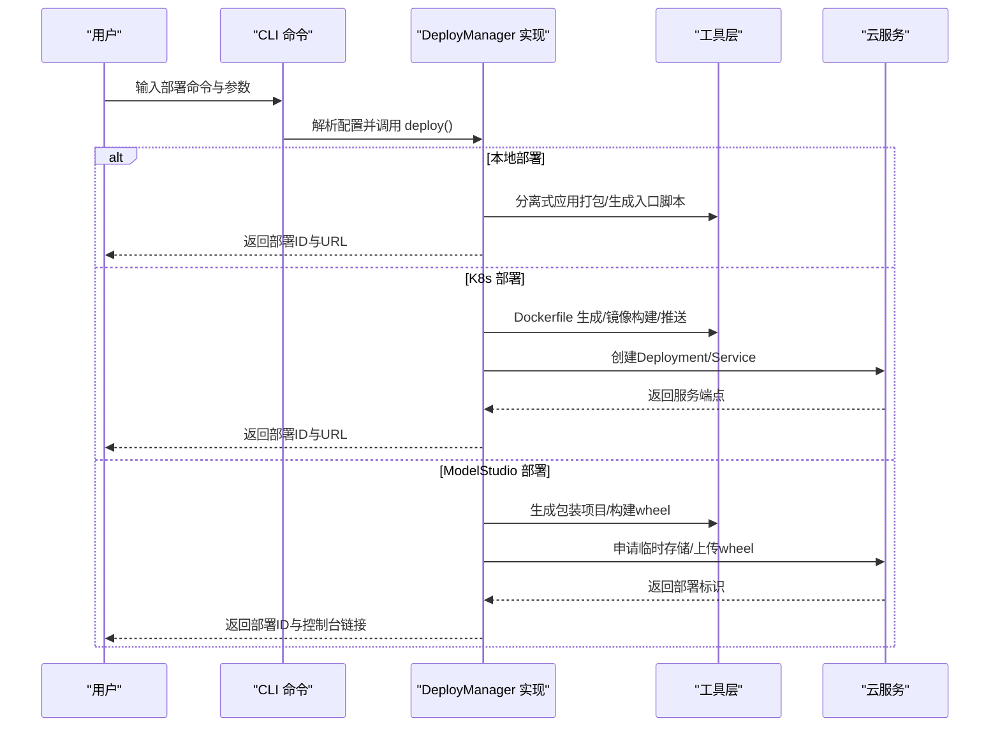
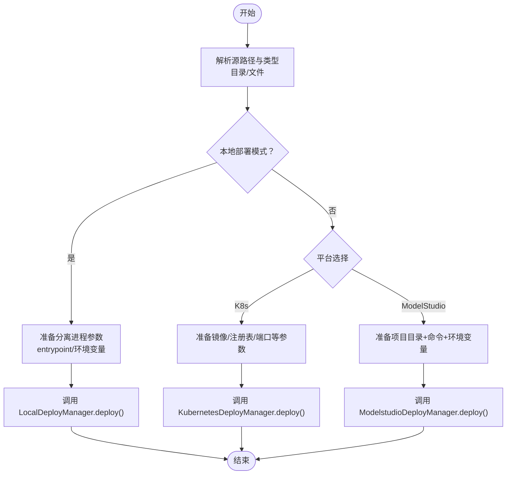
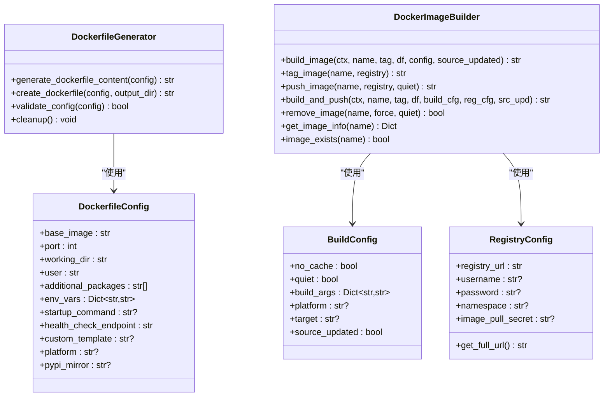
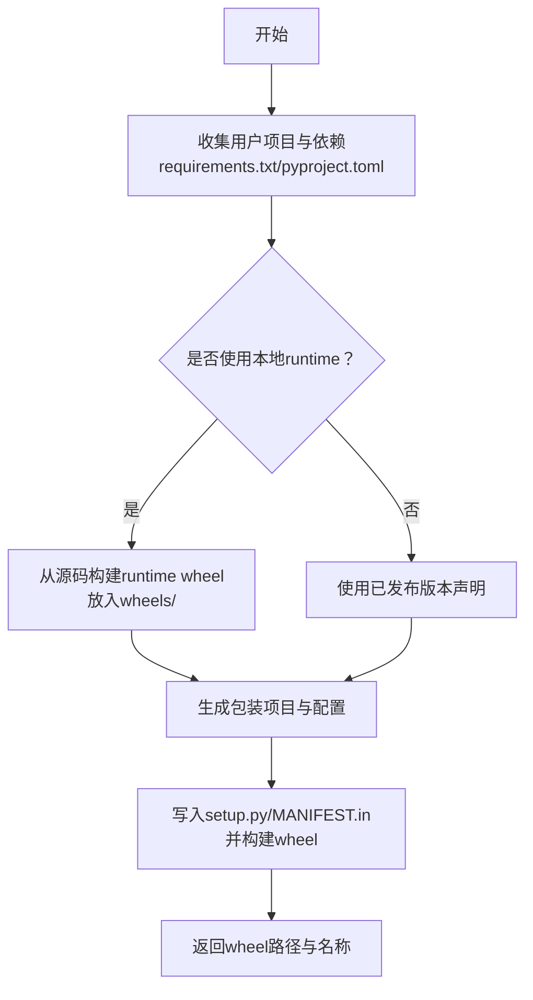
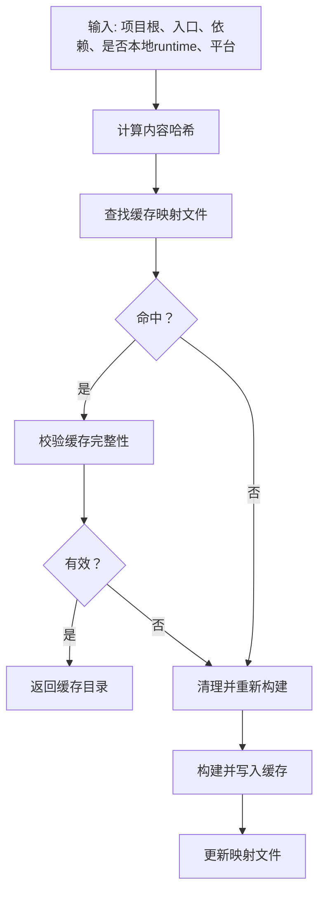
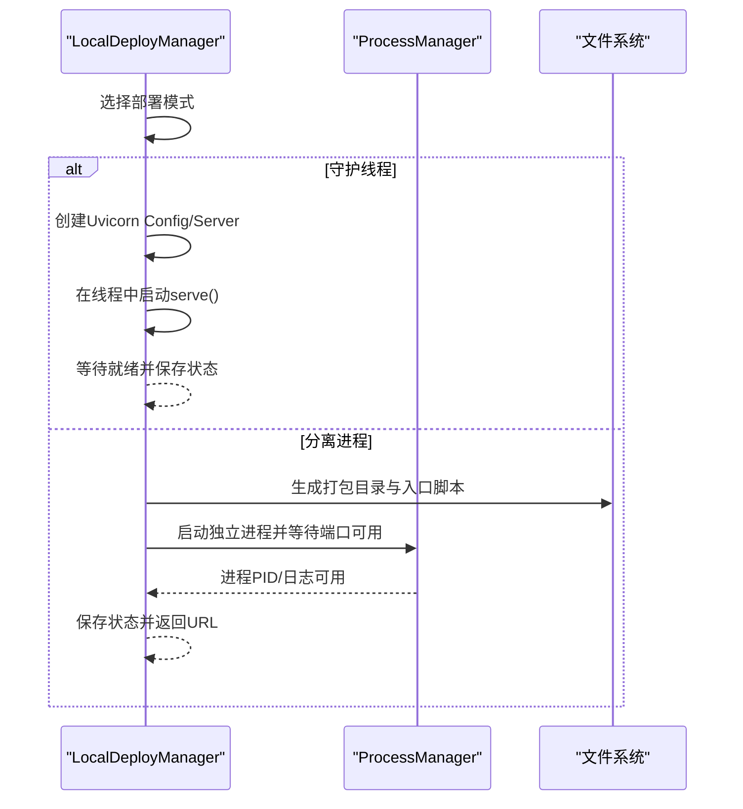
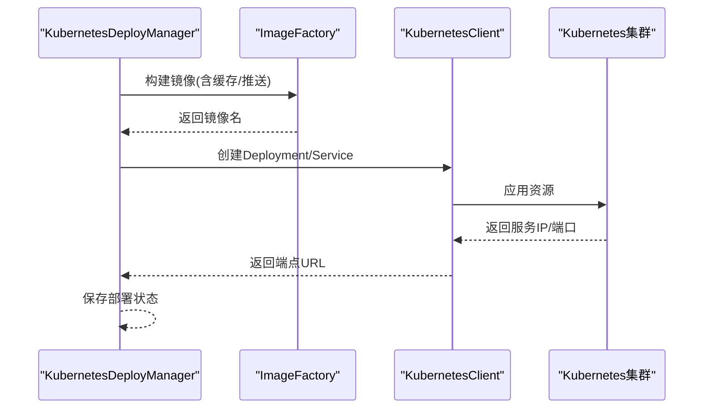
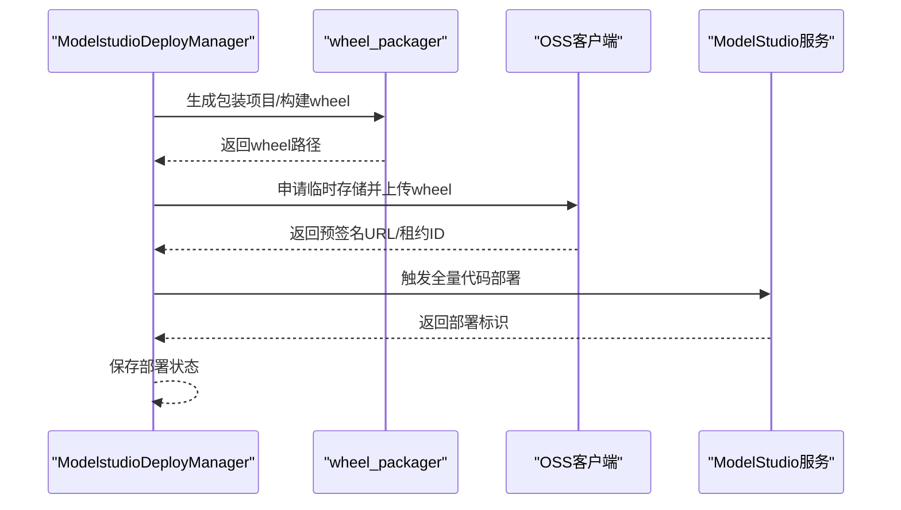
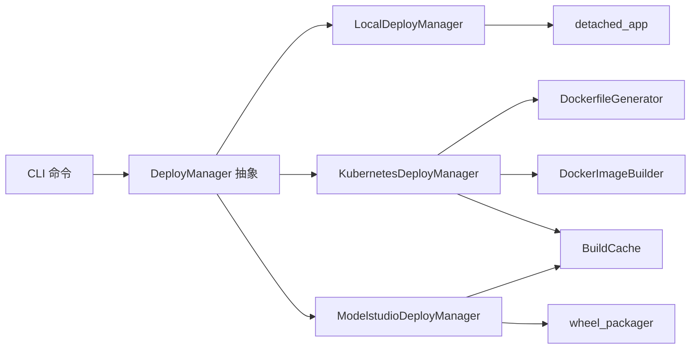

# 部署工具集

<cite>
**本文引用的文件**
- [src/agentscope_runtime/engine/deployers/__init__.py](file://src/agentscope_runtime/engine/deployers/__init__.py)
- [src/agentscope_runtime/engine/deployers/base.py](file://src/agentscope_runtime/engine/deployers/base.py)
- [src/agentscope_runtime/engine/deployers/local_deployer.py](file://src/agentscope_runtime/engine/deployers/local_deployer.py)
- [src/agentscope_runtime/engine/deployers/kubernetes_deployer.py](file://src/agentscope_runtime/engine/deployers/kubernetes_deployer.py)
- [src/agentscope_runtime/engine/deployers/modelstudio_deployer.py](file://src/agentscope_runtime/engine/deployers/modelstudio_deployer.py)
- [src/agentscope_runtime/engine/deployers/utils/docker_image_utils/__init__.py](file://src/agentscope_runtime/engine/deployers/utils/docker_image_utils/__init__.py)
- [src/agentscope_runtime/engine/deployers/utils/docker_image_utils/dockerfile_generator.py](file://src/agentscope_runtime/engine/deployers/utils/docker_image_utils/dockerfile_generator.py)
- [src/agentscope_runtime/engine/deployers/utils/docker_image_utils/docker_image_builder.py](file://src/agentscope_runtime/engine/deployers/utils/docker_image_utils/docker_image_builder.py)
- [src/agentscope_runtime/engine/deployers/utils/build_cache.py](file://src/agentscope_runtime/engine/deployers/utils/build_cache.py)
- [src/agentscope_runtime/engine/deployers/utils/wheel_packager.py](file://src/agentscope_runtime/engine/deployers/utils/wheel_packager.py)
- [src/agentscope_runtime/engine/deployers/utils/detached_app.py](file://src/agentscope_runtime/engine/deployers/utils/detached_app.py)
- [src/agentscope_runtime/engine/deployers/utils/deployment_modes.py](file://src/agentscope_runtime/engine/deployers/utils/deployment_modes.py)
- [src/agentscope_runtime/cli/commands/deploy.py](file://src/agentscope_runtime/cli/commands/deploy.py)
</cite>

## 目录
1. [简介](#简介)
2. [项目结构](#项目结构)
3. [核心组件](#核心组件)
4. [架构总览](#架构总览)
5. [详细组件分析](#详细组件分析)
6. [依赖分析](#依赖分析)
7. [性能考虑](#性能考虑)
8. [故障排查指南](#故障排查指南)
9. [结论](#结论)
10. [附录：使用示例与最佳实践](#附录使用示例与最佳实践)

## 简介
本文件系统性阐述部署工具集的设计与实现，覆盖以下关键主题：
- 部署模式识别与统一入口
- Docker 镜像构建与打包工具链
- wheel 包生成、依赖管理与版本控制策略
- Dockerfile 生成器、镜像缓存与构建优化
- 部署体验与自动化流程
- 扩展接口与自定义配置
- 调试技巧与性能优化建议
- 完整使用示例与最佳实践

## 项目结构
部署工具集位于引擎模块的 deployers 子系统中，采用“按平台拆分 + 工具聚合”的组织方式：
- 平台适配层：local、kubernetes、modelstudio、agentrun、knative、kruise 等
- 工具层：Dockerfile 生成、镜像构建、wheel 打包、构建缓存、分离式应用打包等
- CLI 层：统一命令入口，负责参数解析、配置合并与调用对应 deployer

```mermaid
graph TB
subgraph "CLI"
CLI["agentscope deploy 命令组"]
end
subgraph "部署器"
Base["DeployManager 抽象基类"]
Local["LocalDeployManager"]
K8s["KubernetesDeployManager"]
MS["ModelstudioDeployManager"]
end
subgraph "工具"
DFGen["DockerfileGenerator"]
ImgBuild["DockerImageBuilder"]
Wheel["wheel_packager"]
Cache["BuildCache"]
Detach["detached_app"]
end
CLI --> Local
CLI --> K8s
CLI --> MS
Local --> Detach
K8s --> DFGen
K8s --> ImgBuild
MS --> Wheel
MS --> Detach
K8s --> Cache
MS --> Cache
```

图示来源
- [src/agentscope_runtime/cli/commands/deploy.py:301-800](file://src/agentscope_runtime/cli/commands/deploy.py#L301-L800)
- [src/agentscope_runtime/engine/deployers/base.py:9-44](file://src/agentscope_runtime/engine/deployers/base.py#L9-L44)
- [src/agentscope_runtime/engine/deployers/local_deployer.py:27-645](file://src/agentscope_runtime/engine/deployers/local_deployer.py#L27-L645)
- [src/agentscope_runtime/engine/deployers/kubernetes_deployer.py:48-391](file://src/agentscope_runtime/engine/deployers/kubernetes_deployer.py#L48-L391)
- [src/agentscope_runtime/engine/deployers/modelstudio_deployer.py:544-947](file://src/agentscope_runtime/engine/deployers/modelstudio_deployer.py#L544-L947)
- [src/agentscope_runtime/engine/deployers/utils/docker_image_utils/dockerfile_generator.py:28-254](file://src/agentscope_runtime/engine/deployers/utils/docker_image_utils/dockerfile_generator.py#L28-L254)
- [src/agentscope_runtime/engine/deployers/utils/docker_image_utils/docker_image_builder.py:41-451](file://src/agentscope_runtime/engine/deployers/utils/docker_image_utils/docker_image_builder.py#L41-L451)
- [src/agentscope_runtime/engine/deployers/utils/wheel_packager.py:1-475](file://src/agentscope_runtime/engine/deployers/utils/wheel_packager.py#L1-L475)
- [src/agentscope_runtime/engine/deployers/utils/build_cache.py:22-737](file://src/agentscope_runtime/engine/deployers/utils/build_cache.py#L22-L737)
- [src/agentscope_runtime/engine/deployers/utils/detached_app.py:40-602](file://src/agentscope_runtime/engine/deployers/utils/detached_app.py#L40-L602)

章节来源
- [src/agentscope_runtime/engine/deployers/__init__.py:18-52](file://src/agentscope_runtime/engine/deployers/__init__.py#L18-L52)
- [src/agentscope_runtime/engine/deployers/base.py:9-44](file://src/agentscope_runtime/engine/deployers/base.py#L9-L44)

## 核心组件
- DeployManager 抽象基类：定义统一的部署与停止接口，内置部署状态管理器
- LocalDeployManager：本地部署（守护线程/分离进程），支持 FastAPI 应用直接运行或打包后运行
- KubernetesDeployManager：K8s 集成，负责镜像构建/推送与资源创建
- ModelstudioDeployManager：面向阿里云 ModelStudio 的全量代码部署，基于 wheel 包上传与 OSS 临时存储
- 工具子系统：
  - DockerfileGenerator：模板化生成 Dockerfile
  - DockerImageBuilder：封装 docker build/push/tag 等操作
  - wheel_packager：将用户项目打包为可部署 wheel，并合并本地 runtime wheel
  - build_cache：基于内容哈希的工作区构建缓存，加速重复部署
  - detached_app：分离式应用打包，生成可独立运行的部署包

章节来源
- [src/agentscope_runtime/engine/deployers/base.py:9-44](file://src/agentscope_runtime/engine/deployers/base.py#L9-L44)
- [src/agentscope_runtime/engine/deployers/local_deployer.py:27-645](file://src/agentscope_runtime/engine/deployers/local_deployer.py#L27-L645)
- [src/agentscope_runtime/engine/deployers/kubernetes_deployer.py:48-391](file://src/agentscope_runtime/engine/deployers/kubernetes_deployer.py#L48-L391)
- [src/agentscope_runtime/engine/deployers/modelstudio_deployer.py:544-947](file://src/agentscope_runtime/engine/deployers/modelstudio_deployer.py#L544-L947)
- [src/agentscope_runtime/engine/deployers/utils/docker_image_utils/dockerfile_generator.py:28-254](file://src/agentscope_runtime/engine/deployers/utils/docker_image_utils/dockerfile_generator.py#L28-L254)
- [src/agentscope_runtime/engine/deployers/utils/docker_image_utils/docker_image_builder.py:41-451](file://src/agentscope_runtime/engine/deployers/utils/docker_image_utils/docker_image_builder.py#L41-L451)
- [src/agentscope_runtime/engine/deployers/utils/wheel_packager.py:1-475](file://src/agentscope_runtime/engine/deployers/utils/wheel_packager.py#L1-L475)
- [src/agentscope_runtime/engine/deployers/utils/build_cache.py:22-737](file://src/agentscope_runtime/engine/deployers/utils/build_cache.py#L22-L737)
- [src/agentscope_runtime/engine/deployers/utils/detached_app.py:40-602](file://src/agentscope_runtime/engine/deployers/utils/detached_app.py#L40-L602)

## 架构总览
下图展示了 CLI 如何根据目标平台选择对应的 DeployManager，并驱动工具层完成打包、镜像构建/上传、资源创建或 wheel 上传等流程。



图示来源
- [src/agentscope_runtime/cli/commands/deploy.py:320-800](file://src/agentscope_runtime/cli/commands/deploy.py#L320-L800)
- [src/agentscope_runtime/engine/deployers/local_deployer.py:68-174](file://src/agentscope_runtime/engine/deployers/local_deployer.py#L68-L174)
- [src/agentscope_runtime/engine/deployers/kubernetes_deployer.py:126-312](file://src/agentscope_runtime/engine/deployers/kubernetes_deployer.py#L126-L312)
- [src/agentscope_runtime/engine/deployers/modelstudio_deployer.py:727-750](file://src/agentscope_runtime/engine/deployers/modelstudio_deployer.py#L727-L750)

## 详细组件分析

### 部署模式识别与统一入口
- CLI 命令组提供统一入口，按平台加载对应 DeployManager，并进行参数解析与配置合并
- 支持从配置文件（JSON/YAML）与命令行参数合并，环境变量可通过 --env/--env-file 注入
- 本地部署支持两种模式：守护线程（嵌入式）与分离进程（打包后独立运行）



图示来源
- [src/agentscope_runtime/cli/commands/deploy.py:354-446](file://src/agentscope_runtime/cli/commands/deploy.py#L354-L446)
- [src/agentscope_runtime/cli/commands/deploy.py:480-594](file://src/agentscope_runtime/cli/commands/deploy.py#L480-L594)
- [src/agentscope_runtime/cli/commands/deploy.py:637-766](file://src/agentscope_runtime/cli/commands/deploy.py#L637-L766)
- [src/agentscope_runtime/engine/deployers/utils/deployment_modes.py:7-15](file://src/agentscope_runtime/engine/deployers/utils/deployment_modes.py#L7-L15)

章节来源
- [src/agentscope_runtime/cli/commands/deploy.py:320-800](file://src/agentscope_runtime/cli/commands/deploy.py#L320-L800)
- [src/agentscope_runtime/engine/deployers/utils/deployment_modes.py:7-15](file://src/agentscope_runtime/engine/deployers/utils/deployment_modes.py#L7-L15)

### Dockerfile 生成器与镜像构建
- DockerfileGenerator：通过模板化生成 Dockerfile，支持基础镜像、端口、工作目录、用户、额外系统包、环境变量、启动命令、健康检查、平台与镜像源等配置
- DockerImageBuilder：封装 docker build/push/tag/rmi/inspect 等操作；支持 quiet 模式输出流式日志；提供构建与推送一体化接口
- KubernetesDeployManager 使用 ImageFactory 组合上述能力，完成镜像构建与推送



图示来源
- [src/agentscope_runtime/engine/deployers/utils/docker_image_utils/dockerfile_generator.py:12-254](file://src/agentscope_runtime/engine/deployers/utils/docker_image_utils/dockerfile_generator.py#L12-L254)
- [src/agentscope_runtime/engine/deployers/utils/docker_image_utils/docker_image_builder.py:14-451](file://src/agentscope_runtime/engine/deployers/utils/docker_image_utils/docker_image_builder.py#L14-L451)

章节来源
- [src/agentscope_runtime/engine/deployers/utils/docker_image_utils/dockerfile_generator.py:28-254](file://src/agentscope_runtime/engine/deployers/utils/docker_image_utils/dockerfile_generator.py#L28-L254)
- [src/agentscope_runtime/engine/deployers/utils/docker_image_utils/docker_image_builder.py:41-451](file://src/agentscope_runtime/engine/deployers/utils/docker_image_utils/docker_image_builder.py#L41-L451)
- [src/agentscope_runtime/engine/deployers/kubernetes_deployer.py:196-224](file://src/agentscope_runtime/engine/deployers/kubernetes_deployer.py#L196-L224)

### wheel 包生成、依赖管理与版本控制
- wheel_packager：将用户项目打包为可部署 wheel，自动合并本地 runtime wheel 或使用已发布版本；生成包装项目、写入 setup.py/MANIFEST.in、构建 wheel
- detached_app：生成分离式应用包，写入 requirements.txt（含本地 runtime wheel）、入口脚本元数据等
- 版本控制策略：
  - 发布版：使用固定版本号（如 agentscope-runtime==X.Y.Z）
  - 开发版：从源码构建 runtime wheel 并内联到 wheels/ 目录
  - 自动检测：通过版本模块与 pyproject.toml 解析版本信息



图示来源
- [src/agentscope_runtime/engine/deployers/utils/wheel_packager.py:145-475](file://src/agentscope_runtime/engine/deployers/utils/wheel_packager.py#L145-L475)
- [src/agentscope_runtime/engine/deployers/utils/detached_app.py:156-238](file://src/agentscope_runtime/engine/deployers/utils/detached_app.py#L156-L238)
- [src/agentscope_runtime/engine/deployers/utils/detached_app.py:306-351](file://src/agentscope_runtime/engine/deployers/utils/detached_app.py#L306-L351)

章节来源
- [src/agentscope_runtime/engine/deployers/utils/wheel_packager.py:1-475](file://src/agentscope_runtime/engine/deployers/utils/wheel_packager.py#L1-L475)
- [src/agentscope_runtime/engine/deployers/utils/detached_app.py:156-238](file://src/agentscope_runtime/engine/deployers/utils/detached_app.py#L156-L238)

### 构建缓存与构建优化
- BuildCache：以内容哈希为核心，缓存构建产物（部署包、Dockerfile、requirements、wheel 等），支持平台命名与校验
- 优化点：
  - 内容感知：对用户代码、入口、依赖、runtime 版本进行哈希，避免重复构建
  - 缓存失效：损坏或缺失时自动清理并重新构建
  - 多平台隔离：不同平台生成独立目录，避免相互污染



图示来源
- [src/agentscope_runtime/engine/deployers/utils/build_cache.py:112-169](file://src/agentscope_runtime/engine/deployers/utils/build_cache.py#L112-L169)
- [src/agentscope_runtime/engine/deployers/utils/build_cache.py:171-263](file://src/agentscope_runtime/engine/deployers/utils/build_cache.py#L171-L263)
- [src/agentscope_runtime/engine/deployers/utils/build_cache.py:277-350](file://src/agentscope_runtime/engine/deployers/utils/build_cache.py#L277-L350)

章节来源
- [src/agentscope_runtime/engine/deployers/utils/build_cache.py:22-737](file://src/agentscope_runtime/engine/deployers/utils/build_cache.py#L22-L737)

### 本地部署流程（守护线程 vs 分离进程）
- 守护线程模式：在当前进程中启动 uvicorn 服务器线程，适合集成测试与开发调试
- 分离进程模式：先打包为可执行部署包，再以独立进程启动，支持优雅停机与日志管理



图示来源
- [src/agentscope_runtime/engine/deployers/local_deployer.py:175-258](file://src/agentscope_runtime/engine/deployers/local_deployer.py#L175-L258)
- [src/agentscope_runtime/engine/deployers/local_deployer.py:260-382](file://src/agentscope_runtime/engine/deployers/local_deployer.py#L260-L382)

章节来源
- [src/agentscope_runtime/engine/deployers/local_deployer.py:27-645](file://src/agentscope_runtime/engine/deployers/local_deployer.py#L27-L645)

### Kubernetes 部署流程
- 通过 ImageFactory 统一构建镜像（可选推送至私有仓库），随后调用 KubernetesClient 创建 Deployment/Service
- 自动处理本地/远程集群的 Service 访问端点差异



图示来源
- [src/agentscope_runtime/engine/deployers/kubernetes_deployer.py:196-271](file://src/agentscope_runtime/engine/deployers/kubernetes_deployer.py#L196-L271)

章节来源
- [src/agentscope_runtime/engine/deployers/kubernetes_deployer.py:48-391](file://src/agentscope_runtime/engine/deployers/kubernetes_deployer.py#L48-L391)

### ModelStudio 部署流程
- 生成包装项目并构建 wheel，向 OSS 申请临时存储并上传 wheel，触发 ModelStudio 全量代码部署
- 支持外部 wheel 跳过打包流程



图示来源
- [src/agentscope_runtime/engine/deployers/modelstudio_deployer.py:566-619](file://src/agentscope_runtime/engine/deployers/modelstudio_deployer.py#L566-L619)
- [src/agentscope_runtime/engine/deployers/modelstudio_deployer.py:684-725](file://src/agentscope_runtime/engine/deployers/modelstudio_deployer.py#L684-L725)

章节来源
- [src/agentscope_runtime/engine/deployers/modelstudio_deployer.py:544-947](file://src/agentscope_runtime/engine/deployers/modelstudio_deployer.py#L544-L947)

## 依赖分析
- 模块耦合
  - DeployManager 抽象出统一接口，各平台实现仅关注自身平台特性
  - 工具层与平台解耦：Dockerfile/DockerImage 与 wheel 打包作为通用能力被多个平台复用
  - CLI 与平台解耦：通过动态导入与条件可用性判断，按需加载平台部署器
- 外部依赖
  - Docker 可用性检查
  - 云服务 SDK（如 OSS、ModelStudio 客户端）按需安装
- 潜在循环依赖
  - 当前结构清晰，未发现循环导入



图示来源
- [src/agentscope_runtime/cli/commands/deploy.py:32-90](file://src/agentscope_runtime/cli/commands/deploy.py#L32-L90)
- [src/agentscope_runtime/engine/deployers/local_deployer.py:27-645](file://src/agentscope_runtime/engine/deployers/local_deployer.py#L27-L645)
- [src/agentscope_runtime/engine/deployers/kubernetes_deployer.py:48-391](file://src/agentscope_runtime/engine/deployers/kubernetes_deployer.py#L48-L391)
- [src/agentscope_runtime/engine/deployers/modelstudio_deployer.py:544-947](file://src/agentscope_runtime/engine/deployers/modelstudio_deployer.py#L544-L947)
- [src/agentscope_runtime/engine/deployers/utils/docker_image_utils/dockerfile_generator.py:28-254](file://src/agentscope_runtime/engine/deployers/utils/docker_image_utils/dockerfile_generator.py#L28-L254)
- [src/agentscope_runtime/engine/deployers/utils/docker_image_utils/docker_image_builder.py:41-451](file://src/agentscope_runtime/engine/deployers/utils/docker_image_utils/docker_image_builder.py#L41-L451)
- [src/agentscope_runtime/engine/deployers/utils/wheel_packager.py:1-475](file://src/agentscope_runtime/engine/deployers/utils/wheel_packager.py#L1-L475)
- [src/agentscope_runtime/engine/deployers/utils/build_cache.py:22-737](file://src/agentscope_runtime/engine/deployers/utils/build_cache.py#L22-L737)
- [src/agentscope_runtime/engine/deployers/utils/detached_app.py:40-602](file://src/agentscope_runtime/engine/deployers/utils/detached_app.py#L40-L602)

章节来源
- [src/agentscope_runtime/engine/deployers/__init__.py:18-52](file://src/agentscope_runtime/engine/deployers/__init__.py#L18-L52)
- [src/agentscope_runtime/cli/commands/deploy.py:32-90](file://src/agentscope_runtime/cli/commands/deploy.py#L32-L90)

## 性能考虑
- 构建缓存优先：启用 use_cache 与 BuildCache，显著减少重复构建时间
- 镜像构建优化：
  - 使用平台参数指定 --platform，避免跨平台兼容层开销
  - 合理设置 no_cache 与 build_args，按需禁用缓存
  - 使用 pypi 镜像源（如阿里云镜像）提升依赖安装速度
- 本地部署：
  - 分离进程模式适合生产/长时运行，守护线程模式适合快速验证
  - 启动超时与关闭超时参数可按环境调整
- ModelStudio 部署：
  - 外部 wheel 可跳过打包阶段，适用于已构建好的制品

## 故障排查指南
- Docker 不可用
  - 现象：抛出 Docker 未安装或不可用异常
  - 处理：安装 Docker 并确保在 PATH 中
- 镜像构建失败
  - 现象：docker build 失败并输出错误
  - 处理：检查 Dockerfile 生成配置、网络与权限；必要时开启 quiet=false 查看详细输出
- 云服务认证失败
  - 现象：OSS/ModelStudio/AgentRun 等调用报错
  - 处理：确认 AK/安全令牌/workspace 等环境变量正确；必要时使用 from_env() 自动回退
- 本地部署启动超时
  - 现象：分离进程模式无法在超时时间内就绪
  - 处理：查看进程日志、检查端口占用、确认入口脚本与环境变量
- 缓存损坏
  - 现象：缓存目录缺失或空 wheel
  - 处理：调用 invalidate_all 清理缓存并重新构建

章节来源
- [src/agentscope_runtime/engine/deployers/utils/docker_image_utils/docker_image_builder.py:54-68](file://src/agentscope_runtime/engine/deployers/utils/docker_image_utils/docker_image_builder.py#L54-L68)
- [src/agentscope_runtime/engine/deployers/utils/build_cache.py:265-276](file://src/agentscope_runtime/engine/deployers/utils/build_cache.py#L265-L276)
- [src/agentscope_runtime/engine/deployers/local_deployer.py:325-352](file://src/agentscope_runtime/engine/deployers/local_deployer.py#L325-L352)

## 结论
该部署工具集通过抽象统一的 DeployManager 接口，结合可插拔的工具层（Dockerfile 生成、镜像构建、wheel 打包、构建缓存），实现了对本地、K8s 与云平台的统一支持。其设计强调：
- 可扩展性：新增平台只需实现 DeployManager 即可无缝接入
- 可观测性：完善的日志与状态管理，便于排障
- 可靠性：缓存与版本控制策略降低重复构建成本并保证一致性
- 易用性：CLI 提供丰富的参数与配置合并机制，简化部署流程

## 附录：使用示例与最佳实践
- 本地部署（分离进程）
  - 步骤：agentscope deploy local --source <目录或文件> --host 127.0.0.1 --port 8090
  - 最佳实践：使用 --env/--env-file 注入环境变量；部署完成后用 agentscope stop <deploy_id> 停止
- Kubernetes 郃署
  - 步骤：agentscope deploy k8s --source <目录> --kubeconfig <路径> --namespace <ns> --image-name <name>
  - 最佳实践：启用 use_cache；在私有仓库场景配置 RegistryConfig；使用 pypi_mirror 加速依赖安装
- ModelStudio 部署
  - 步骤：agentscope deploy modelstudio --source <目录> --name <部署名> --env KEY=VAL
  - 最佳实践：提前准备 AK/安全令牌/workspace；可使用 --skip-upload 仅生成 wheel 用于二次上传

章节来源
- [src/agentscope_runtime/cli/commands/deploy.py:354-446](file://src/agentscope_runtime/cli/commands/deploy.py#L354-L446)
- [src/agentscope_runtime/cli/commands/deploy.py:480-594](file://src/agentscope_runtime/cli/commands/deploy.py#L480-L594)
- [src/agentscope_runtime/cli/commands/deploy.py:637-766](file://src/agentscope_runtime/cli/commands/deploy.py#L637-L766)