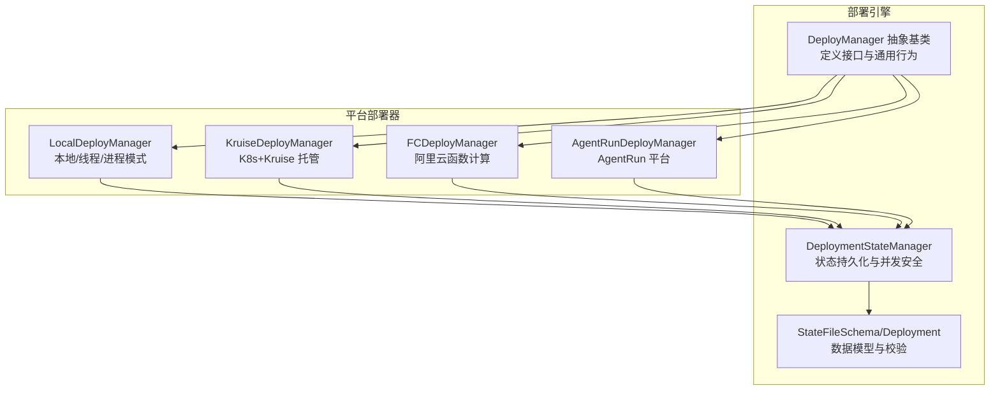
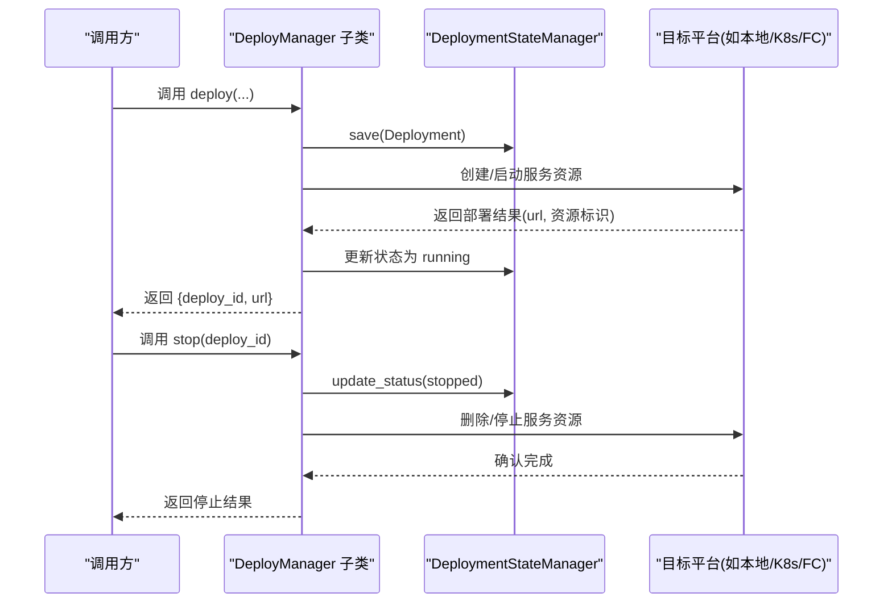
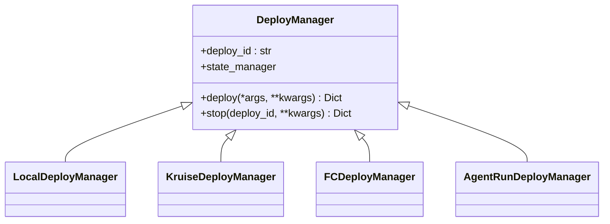
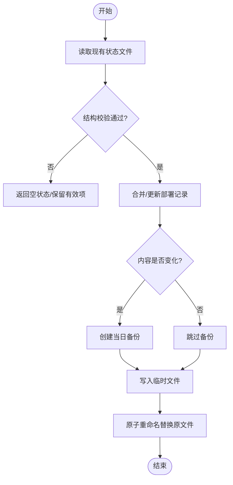
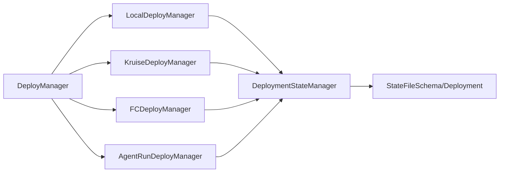

# 部署架构设计

<cite>
**本文引用的文件**
- [engine/deployers/base.py](file://src/agentscope_runtime/engine/deployers/base.py)
- [engine/deployers/__init__.py](file://src/agentscope_runtime/engine/deployers/__init__.py)
- [engine/deployers/state/manager.py](file://src/agentscope_runtime/engine/deployers/state/manager.py)
- [engine/deployers/state/schema.py](file://src/agentscope_runtime/engine/deployers/state/schema.py)
- [engine/deployers/local_deployer.py](file://src/agentscope_runtime/engine/deployers/local_deployer.py)
- [engine/deployers/kruise_deployer.py](file://src/agentscope_runtime/engine/deployers/kruise_deployer.py)
- [engine/deployers/fc_deployer.py](file://src/agentscope_runtime/engine/deployers/fc_deployer.py)
- [engine/deployers/agentrun_deployer.py](file://src/agentscope_runtime/engine/deployers/agentrun_deployer.py)
- [engine/__init__.py](file://src/agentscope_runtime/engine/__init__.py)
- [tests/deploy/test_local_deployer.py](file://tests/deploy/test_local_deployer.py)
- [tests/deploy/test_state_manager.py](file://tests/deploy/test_state_manager.py)
- [tests/deploy/test_fc_deployer.py](file://tests/deploy/test_fc_deployer.py)
- [cookbook/en/deployment.md](file://cookbook/en/deployment.md)
</cite>

## 目录
1. [引言](#引言)
2. [项目结构](#项目结构)
3. [核心组件](#核心组件)
4. [架构总览](#架构总览)
5. [详细组件分析](#详细组件分析)
6. [依赖关系分析](#依赖关系分析)
7. [性能考量](#性能考量)
8. [故障排查指南](#故障排查指南)
9. [结论](#结论)
10. [附录：最佳实践与扩展指南](#附录最佳实践与扩展指南)

## 引言
本技术文档围绕部署架构设计展开，重点阐述 DeployManager 抽象基类的设计原理与接口规范，部署器的工厂模式实现与状态管理模式，部署 ID 的生成机制，状态管理器的作用与部署状态跟踪，部署器生命周期管理与资源清理机制，并提供多部署器并行管理与冲突解决策略。文档同时给出最佳实践与扩展指南，帮助读者在不同平台（本地、Kubernetes、函数计算等）上安全、可维护地进行部署。

## 项目结构
部署相关代码主要位于 engine/deployers 目录下，采用“按功能模块分层 + 平台适配器”的组织方式：
- 抽象基类与工厂导出：engine/deployers/base.py 定义 DeployManager 接口；engine/deployers/__init__.py 提供统一导入入口与延迟加载。
- 状态管理：engine/deployers/state/manager.py 负责持久化与并发安全的状态读写；engine/deployers/state/schema.py 定义数据模型与校验。
- 平台部署器：local_deployer.py、kruise_deployer.py、fc_deployer.py、agentrun_deployer.py 等分别实现不同平台的部署逻辑。
- 引擎入口：engine/__init__.py 暴露 DeployManager 及各部署器类型，便于外部使用。

图表来源
- [engine/deployers/base.py:1-44](file://src/agentscope_runtime/engine/deployers/base.py#L1-L44)
- [engine/deployers/state/manager.py:1-389](file://src/agentscope_runtime/engine/deployers/state/manager.py#L1-L389)
- [engine/deployers/state/schema.py:1-97](file://src/agentscope_runtime/engine/deployers/state/schema.py#L1-L97)
- [engine/deployers/local_deployer.py:1-200](file://src/agentscope_runtime/engine/deployers/local_deployer.py#L1-L200)
- [engine/deployers/kruise_deployer.py:47-76](file://src/agentscope_runtime/engine/deployers/kruise_deployer.py#L47-L76)
- [engine/deployers/fc_deployer.py:1416-1483](file://src/agentscope_runtime/engine/deployers/fc_deployer.py#L1416-L1483)
- [engine/deployers/agentrun_deployer.py:266-300](file://src/agentscope_runtime/engine/deployers/agentrun_deployer.py#L266-L300)

章节来源
- [engine/deployers/base.py:1-44](file://src/agentscope_runtime/engine/deployers/base.py#L1-L44)
- [engine/deployers/__init__.py:1-52](file://src/agentscope_runtime/engine/deployers/__init__.py#L1-L52)
- [engine/deployers/state/manager.py:1-389](file://src/agentscope_runtime/engine/deployers/state/manager.py#L1-L389)
- [engine/deployers/state/schema.py:1-97](file://src/agentscope_runtime/engine/deployers/state/schema.py#L1-L97)
- [engine/deployers/local_deployer.py:1-200](file://src/agentscope_runtime/engine/deployers/local_deployer.py#L1-L200)
- [engine/deployers/kruise_deployer.py:47-76](file://src/agentscope_runtime/engine/deployers/kruise_deployer.py#L47-L76)
- [engine/deployers/fc_deployer.py:1416-1483](file://src/agentscope_runtime/engine/deployers/fc_deployer.py#L1416-L1483)
- [engine/deployers/agentrun_deployer.py:266-300](file://src/agentscope_runtime/engine/deployers/agentrun_deployer.py#L266-L300)
- [engine/__init__.py:1-34](file://src/agentscope_runtime/engine/__init__.py#L1-L34)

## 核心组件
- DeployManager 抽象基类
  - 角色：定义所有部署器的统一接口与共享行为，包括部署 ID 生成、状态管理器注入、异步部署与停止接口。
  - 关键点：通过 UUID 生成唯一 deploy_id；支持传入共享状态管理器；定义 deploy 与 stop 两个抽象方法。
- DeploymentStateManager 状态管理器
  - 角色：负责部署元数据的持久化、读取、更新、删除、列表过滤与版本迁移。
  - 关键点：原子写入、备份策略、并发安全、容错处理（损坏文件自动恢复为空状态）、严格的数据校验。
- StateFileSchema/Deployment 数据模型
  - 角色：定义状态文件结构与单条部署记录的数据结构，提供校验与迁移能力。
  - 关键点：版本字段、部署记录字段集合、时间戳格式化工具。

章节来源
- [engine/deployers/base.py:1-44](file://src/agentscope_runtime/engine/deployers/base.py#L1-L44)
- [engine/deployers/state/manager.py:1-389](file://src/agentscope_runtime/engine/deployers/state/manager.py#L1-L389)
- [engine/deployers/state/schema.py:1-97](file://src/agentscope_runtime/engine/deployers/state/schema.py#L1-L97)

## 架构总览
部署架构采用“抽象基类 + 多平台适配器 + 共享状态管理器”的设计，确保：
- 统一接口：所有部署器均实现相同的 deploy/stop 协议。
- 可插拔：新增平台只需继承 DeployManager 并实现具体逻辑。
- 可观测：通过状态管理器持久化部署元信息，支持查询、过滤、状态变更追踪。
- 安全性：状态文件写入采用原子替换与备份策略，避免数据丢失。

图表来源
- [engine/deployers/base.py:1-44](file://src/agentscope_runtime/engine/deployers/base.py#L1-L44)
- [engine/deployers/state/manager.py:232-323](file://src/agentscope_runtime/engine/deployers/state/manager.py#L232-L323)
- [engine/deployers/local_deployer.py:68-174](file://src/agentscope_runtime/engine/deployers/local_deployer.py#L68-L174)
- [engine/deployers/fc_deployer.py:1427-1483](file://src/agentscope_runtime/engine/deployers/fc_deployer.py#L1427-L1483)

## 详细组件分析

### DeployManager 抽象基类与工厂模式
- 设计原理
  - 使用 ABC 抽象基类约束子类必须实现 deploy/stop。
  - 在构造时生成唯一 deploy_id，并注入共享状态管理器（默认创建或复用）。
  - 工厂导出：engine/deployers/__init__.py 通过延迟加载将 DeployManager 与各平台部署器暴露给外部，避免循环导入与启动开销。
- 接口规范
  - deploy(*args, **kwargs) -> Dict[str, str]：返回包含 deploy_id 与访问 URL 的字典。
  - stop(deploy_id: str, **kwargs) -> Dict[str, Any]：返回包含 success/message/details 的字典。
- 工厂模式实现
  - 通过模块级延迟加载器实现按需导入，统一命名空间导出，便于 CLI 或上层框架按名称选择部署器。

图表来源
- [engine/deployers/base.py:1-44](file://src/agentscope_runtime/engine/deployers/base.py#L1-L44)
- [engine/deployers/local_deployer.py:27-67](file://src/agentscope_runtime/engine/deployers/local_deployer.py#L27-L67)
- [engine/deployers/kruise_deployer.py:47-76](file://src/agentscope_runtime/engine/deployers/kruise_deployer.py#L47-L76)
- [engine/deployers/fc_deployer.py:1416-1483](file://src/agentscope_runtime/engine/deployers/fc_deployer.py#L1416-L1483)
- [engine/deployers/agentrun_deployer.py:266-300](file://src/agentscope_runtime/engine/deployers/agentrun_deployer.py#L266-L300)

章节来源
- [engine/deployers/base.py:1-44](file://src/agentscope_runtime/engine/deployers/base.py#L1-L44)
- [engine/deployers/__init__.py:18-31](file://src/agentscope_runtime/engine/deployers/__init__.py#L18-L31)
- [engine/engine/__init__.py:22-34](file://src/agentscope_runtime/engine/__init__.py#L22-L34)

### 状态管理器与部署状态跟踪
- DeploymentStateManager
  - 原子写入：先写临时文件再原子重命名，避免部分写入导致损坏。
  - 备份策略：每次变更前对当天备份文件进行覆盖式备份，并清理30天以前的旧备份。
  - 容错处理：读取失败或结构不合法时返回空状态，保留有效部署项，防止误删。
  - 并发安全：通过读取-修改-写回的流程与备份策略降低并发风险。
  - 过滤与排序：支持按状态/平台过滤与按创建时间倒序排列。
- Deployment 数据模型
  - 字段：id、platform、url、agent_source、created_at、status、token、config。
  - 默认值：status 默认 running，config 默认空字典。
- 状态变更流程
  - save：保存新部署或覆盖已有部署。
  - update_status：仅更新状态字段，其他字段保持不变。
  - remove：删除指定部署记录，允许最后一条记录清空。
  - list：支持按状态/平台过滤与排序。

图表来源
- [engine/deployers/state/manager.py:89-231](file://src/agentscope_runtime/engine/deployers/state/manager.py#L89-L231)

章节来源
- [engine/deployers/state/manager.py:1-389](file://src/agentscope_runtime/engine/deployers/state/manager.py#L1-L389)
- [engine/deployers/state/schema.py:1-97](file://src/agentscope_runtime/engine/deployers/state/schema.py#L1-L97)
- [tests/deploy/test_state_manager.py:112-172](file://tests/deploy/test_state_manager.py#L112-L172)
- [tests/deploy/test_state_manager.py:347-378](file://tests/deploy/test_state_manager.py#L347-L378)

### 部署 ID 生成机制
- DeployManager 内部使用 UUID 生成 deploy_id，保证全局唯一性。
- 独立的 generate_deployment_id(platform: str) 工具函数可用于特定场景下的 ID 生成，格式包含平台、时间戳与短 ID，便于可读性与溯源。

章节来源
- [engine/deployers/base.py:10-11](file://src/agentscope_runtime/engine/deployers/base.py#L10-L11)
- [engine/deployers/state/schema.py:83-89](file://src/agentscope_runtime/engine/deployers/state/schema.py#L83-L89)

### 生命周期管理与资源清理
- LocalDeployManager
  - 支持守护线程与分离进程两种模式，具备优雅关闭与超时控制。
  - 提供 is_service_running 与 get_deployment_info 等运行期状态查询。
  - 停止时根据当前模式清理对应资源（线程/进程/端口占用）。
- FCDeployManager
  - 停止即删除函数实例，成功后通过状态管理器更新状态为 stopped。
  - 若无法从状态中读取部署详情，会回退到使用 deploy_id 作为函数名。
- KruiseDeployManager
  - 通过 Kubernetes 与 Kruise 客户端管理自定义资源，结合镜像工厂与构建上下文目录实现镜像构建与部署。
- AgentRunDeployManager
  - 负责打包、上传、创建运行时与端点，内置轮询以等待运行时就绪。

章节来源
- [engine/deployers/local_deployer.py:68-174](file://src/agentscope_runtime/engine/deployers/local_deployer.py#L68-L174)
- [engine/deployers/local_deployer.py:609-645](file://src/agentscope_runtime/engine/deployers/local_deployer.py#L609-L645)
- [engine/deployers/fc_deployer.py:1427-1483](file://src/agentscope_runtime/engine/deployers/fc_deployer.py#L1427-L1483)
- [engine/deployers/kruise_deployer.py:47-76](file://src/agentscope_runtime/engine/deployers/kruise_deployer.py#L47-L76)
- [engine/deployers/agentrun_deployer.py:266-300](file://src/agentscope_runtime/engine/deployers/agentrun_deployer.py#L266-L300)

### 多部署器并行管理与冲突解决
- 并行部署
  - 不同部署器实例各自生成独立 deploy_id，互不干扰。
  - 测试用例验证同一主机上多个本地部署器可绑定不同端口并行运行。
- 冲突解决
  - 端口冲突：LocalDeployManager 在初始化时绑定 host/port，若端口被占用应避免重复绑定；建议在多实例场景下显式配置不同端口。
  - 资源命名冲突：Kruise/FunC 等平台侧需确保资源名唯一；若平台不支持自动去重，应在应用层生成唯一名称。
  - 状态一致性：通过状态管理器的原子写入与备份策略，确保并发更新不会造成数据丢失或损坏。

章节来源
- [tests/deploy/test_local_deployer.py:227-268](file://tests/deploy/test_local_deployer.py#L227-L268)

## 依赖关系分析
- 组件耦合
  - DeployManager 与 DeploymentStateManager 强耦合（状态持久化），但通过构造参数可注入共享实例，降低全局状态耦合度。
  - 各平台部署器仅依赖 DeployManager 接口，彼此低耦合，易于扩展。
- 外部依赖
  - LocalDeployManager 依赖 uvicorn、FastAPI 等运行时组件。
  - KruiseDeployManager 依赖 Kubernetes/Kruise 客户端与镜像工厂。
  - FC/AgentRun 部署器依赖对应平台 SDK 与存储（OSS）。
- 循环依赖
  - 通过延迟加载与模块级导出避免了循环导入问题。

图表来源
- [engine/deployers/base.py:1-44](file://src/agentscope_runtime/engine/deployers/base.py#L1-L44)
- [engine/deployers/state/manager.py:1-389](file://src/agentscope_runtime/engine/deployers/state/manager.py#L1-L389)
- [engine/deployers/state/schema.py:1-97](file://src/agentscope_runtime/engine/deployers/state/schema.py#L1-L97)
- [engine/deployers/local_deployer.py:1-200](file://src/agentscope_runtime/engine/deployers/local_deployer.py#L1-L200)
- [engine/deployers/kruise_deployer.py:47-76](file://src/agentscope_runtime/engine/deployers/kruise_deployer.py#L47-L76)
- [engine/deployers/fc_deployer.py:1416-1483](file://src/agentscope_runtime/engine/deployers/fc_deployer.py#L1416-L1483)
- [engine/deployers/agentrun_deployer.py:266-300](file://src/agentscope_runtime/engine/deployers/agentrun_deployer.py#L266-L300)

## 性能考量
- 状态文件写入
  - 原子重命名与备份策略带来额外磁盘 IO，建议在高并发场景下减少频繁状态更新频率，批量合并状态变更。
- 本地部署
  - 守护线程模式适合开发调试；分离进程模式更适合生产环境隔离与资源回收。
- 平台部署
  - K8s/Kruise 部署涉及镜像构建与推送，建议启用构建缓存与增量构建策略。
  - 函数计算部署建议预热运行时与复用环境变量文件，减少冷启动成本。

## 故障排查指南
- 状态文件损坏
  - 现象：状态读取失败或结构异常。
  - 处理：系统会自动回退为空状态并保留有效部署项；检查备份文件 deployments.backup.YYYYMMDD.json 是否存在。
- 状态更新失败
  - 现象：update_status 抛出 KeyError。
  - 处理：确认 deploy_id 是否正确；检查状态文件是否存在且未被意外删除。
- 停止失败
  - 现象：stop 返回失败或平台侧资源未释放。
  - 处理：检查平台侧权限与资源名；必要时手动清理；确保状态管理器已更新为 stopped。
- 端口冲突
  - 现象：本地部署启动失败。
  - 处理：更换不同端口或释放占用端口；多实例部署时显式配置不同端口。

章节来源
- [engine/deployers/state/manager.py:137-144](file://src/agentscope_runtime/engine/deployers/state/manager.py#L137-L144)
- [engine/deployers/state/manager.py:305-323](file://src/agentscope_runtime/engine/deployers/state/manager.py#L305-L323)
- [engine/deployers/fc_deployer.py:1427-1483](file://src/agentscope_runtime/engine/deployers/fc_deployer.py#L1427-L1483)
- [tests/deploy/test_local_deployer.py:227-268](file://tests/deploy/test_local_deployer.py#L227-L268)

## 结论
该部署架构通过抽象基类统一接口、工厂模式灵活扩展、共享状态管理器保障可观测性与一致性，实现了跨平台、可扩展、可维护的部署体系。配合严格的原子写入、备份与容错策略，能够在复杂环境中稳定运行。建议在实际工程中遵循本文最佳实践，结合平台特性进行优化与扩展。

## 附录：最佳实践与扩展指南
- 最佳实践
  - 明确部署 ID 语义：使用平台前缀+时间戳+短 ID 的组合，便于审计与检索。
  - 状态驱动：所有部署操作均应伴随状态保存/更新，确保可观测与可恢复。
  - 并发控制：避免在同一部署器内频繁更新状态；多实例场景下尽量使用共享状态管理器。
  - 资源命名：在平台侧确保资源名唯一；若平台不支持，应用层生成唯一标识。
  - 端口与网络：本地部署时为多实例分配不同端口；生产环境使用负载均衡与健康检查。
  - 环境变量：通过环境变量文件集中管理敏感配置，避免硬编码。
- 扩展指南
  - 新增平台部署器：继承 DeployManager，实现 deploy/stop；在 engine/deployers/__init__.py 中注册导出。
  - 自定义状态存储：替换 DeploymentStateManager 的持久化实现（如数据库/分布式KV），保持接口一致。
  - 配置中心集成：将部署配置与运行时参数接入配置中心，支持动态更新与灰度发布。
  - 监控与告警：在 deploy/stop 中埋点，上报部署耗时、成功率与错误码，接入统一监控平台。

章节来源
- [engine/deployers/state/schema.py:83-89](file://src/agentscope_runtime/engine/deployers/state/schema.py#L83-L89)
- [engine/deployers/state/manager.py:232-323](file://src/agentscope_runtime/engine/deployers/state/manager.py#L232-L323)
- [tests/deploy/test_fc_deployer.py:923-968](file://tests/deploy/test_fc_deployer.py#L923-L968)
- [cookbook/en/deployment.md:1-19](file://cookbook/en/deployment.md#L1-L19)