# 部署管理器

<cite>
**本文档引用的文件**
- [deployers/__init__.py](file://src/agentscope_runtime/engine/deployers/__init__.py)
- [deployers/base.py](file://src/agentscope_runtime/engine/deployers/base.py)
- [deployers/local_deployer.py](file://src/agentscope_runtime/engine/deployers/local_deployer.py)
- [deployers/kubernetes_deployer.py](file://src/agentscope_runtime/engine/deployers/kubernetes_deployer.py)
- [deployers/modelstudio_deployer.py](file://src/agentscope_runtime/engine/deployers/modelstudio_deployer.py)
- [deployers/knative_deployer.py](file://src/agentscope_runtime/engine/deployers/knative_deployer.py)
- [deployers/kruise_deployer.py](file://src/agentscope_runtime/engine/deployers/kruise_deployer.py)
- [deployers/agentrun_deployer.py](file://src/agentscope_runtime/engine/deployers/agentrun_deployer.py)
- [deployers/fc_deployer.py](file://src/agentscope_runtime/engine/deployers/fc_deployer.py)
- [deployers/pai_deployer.py](file://src/agentscope_runtime/engine/deployers/pai_deployer.py)
- [deployers/utils/deployment_modes.py](file://src/agentscope_runtime/engine/deployers/utils/deployment_modes.py)
- [deployers/utils/service_utils/fastapi_factory.py](file://src/agentscope_runtime/engine/deployers/utils/service_utils/fastapi_factory.py)
- [common/container_clients/base_client.py](file://src/agentscope_runtime/common/container_clients/base_client.py)
</cite>

## 目录
1. [简介](#简介)
2. [项目结构](#项目结构)
3. [核心组件](#核心组件)
4. [架构总览](#架构总览)
5. [详细组件分析](#详细组件分析)
6. [依赖关系分析](#依赖关系分析)
7. [性能考虑](#性能考虑)
8. [故障排除指南](#故障排除指南)
9. [结论](#结论)
10. [附录](#附录)

## 简介
本技术文档面向部署管理器系统，系统性阐述其架构设计与实现机制，覆盖本地部署、Kubernetes 部署、AgentRun 部署、Knative 部署、Kruise 部署、FC 部署、ModelStudio 部署以及 PAI 部署等八种部署模式。文档重点包括：
- 统一的抽象接口与工厂模式扩展机制
- 各平台部署的配置项、环境要求与部署流程
- 状态管理、错误处理与可观测性
- 性能优化与多环境自动化部署策略

## 项目结构
部署管理器位于引擎模块的 deployers 子包中，采用“统一接口 + 多平台适配器”的分层架构：
- 抽象层：定义统一的 DeployManager 接口
- 平台适配层：各云/平台专用的 DeployManager 实现
- 工具与支撑：FastAPI 应用工厂、部署模式枚举、进程/容器客户端等

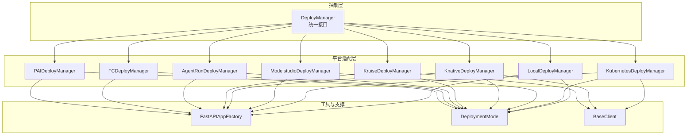

图示来源
- [deployers/base.py:1-44](file://src/agentscope_runtime/engine/deployers/base.py#L1-L44)
- [deployers/local_deployer.py:27-645](file://src/agentscope_runtime/engine/deployers/local_deployer.py#L27-L645)
- [deployers/kubernetes_deployer.py:48-391](file://src/agentscope_runtime/engine/deployers/kubernetes_deployer.py#L48-L391)
- [deployers/modelstudio_deployer.py:544-947](file://src/agentscope_runtime/engine/deployers/modelstudio_deployer.py#L544-L947)
- [deployers/knative_deployer.py:43-291](file://src/agentscope_runtime/engine/deployers/knative_deployer.py#L43-L291)
- [deployers/kruise_deployer.py:37-434](file://src/agentscope_runtime/engine/deployers/kruise_deployer.py#L37-L434)
- [deployers/agentrun_deployer.py:264-800](file://src/agentscope_runtime/engine/deployers/agentrun_deployer.py#L264-L800)
- [deployers/fc_deployer.py:246-1507](file://src/agentscope_runtime/engine/deployers/fc_deployer.py#L246-L1507)
- [deployers/pai_deployer.py:1-800](file://src/agentscope_runtime/engine/deployers/pai_deployer.py#L1-L800)
- [deployers/utils/service_utils/fastapi_factory.py:114-800](file://src/agentscope_runtime/engine/deployers/utils/service_utils/fastapi_factory.py#L114-L800)
- [deployers/utils/deployment_modes.py:7-15](file://src/agentscope_runtime/engine/deployers/utils/deployment_modes.py#L7-L15)
- [common/container_clients/base_client.py:5-40](file://src/agentscope_runtime/common/container_clients/base_client.py#L5-L40)

章节来源
- [deployers/__init__.py:1-52](file://src/agentscope_runtime/engine/deployers/__init__.py#L1-L52)
- [deployers/base.py:9-44](file://src/agentscope_runtime/engine/deployers/base.py#L9-L44)

## 核心组件
- DeployManager 抽象基类：定义统一的 deploy/stop 接口，并内置部署状态管理器实例，确保各平台实现的一致性与可追踪性。
- LocalDeployManager：支持守护线程与分离进程两种本地部署模式，封装 FastAPI 应用生命周期与进程管理。
- KubernetesDeployManager：基于镜像构建与 Kubernetes 客户端，支持 Deployment/Service 与外部访问端点自动选择。
- ModelstudioDeployManager：将用户项目打包为 wheel，上传至 OSS，并触发 ModelStudio 全量代码部署。
- KnativeDeployManager：在具备 Knative 的集群上以 KService 形式部署，支持注解/标签与运行时配置。
- KruiseDeployManager：通过 Kruise Sandbox 资源进行部署，配套 Service 提供外部访问。
- AgentRunDeployManager：面向阿里云 AgentRun 的部署流程，含 OSS 上传、运行时创建与端点管理。
- FCDeployManager：面向阿里云函数计算（FC）的部署，支持自定义运行时、VPC、日志与会话亲和配置。
- PAIDeployManager：面向阿里云 PAI LangStudio 的部署，支持 Flow/Snapshot/Deployment 生命周期管理。

章节来源
- [deployers/base.py:9-44](file://src/agentscope_runtime/engine/deployers/base.py#L9-L44)
- [deployers/local_deployer.py:27-645](file://src/agentscope_runtime/engine/deployers/local_deployer.py#L27-L645)
- [deployers/kubernetes_deployer.py:48-391](file://src/agentscope_runtime/engine/deployers/kubernetes_deployer.py#L48-L391)
- [deployers/modelstudio_deployer.py:544-947](file://src/agentscope_runtime/engine/deployers/modelstudio_deployer.py#L544-L947)
- [deployers/knative_deployer.py:43-291](file://src/agentscope_runtime/engine/deployers/knative_deployer.py#L43-L291)
- [deployers/kruise_deployer.py:37-434](file://src/agentscope_runtime/engine/deployers/kruise_deployer.py#L37-L434)
- [deployers/agentrun_deployer.py:264-800](file://src/agentscope_runtime/engine/deployers/agentrun_deployer.py#L264-L800)
- [deployers/fc_deployer.py:246-1507](file://src/agentscope_runtime/engine/deployers/fc_deployer.py#L246-L1507)
- [deployers/pai_deployer.py:1-800](file://src/agentscope_runtime/engine/deployers/pai_deployer.py#L1-L800)

## 架构总览
统一的部署管理器通过抽象接口屏蔽平台差异，平台适配器负责具体的构建、打包、上传与资源编排。本地模式使用 FastAPI 工厂生成应用并管理进程；云原生模式通过各自 SDK/客户端完成资源创建与状态查询；部分平台（如 FC、AgentRun、ModelStudio）需要 OSS 作为中间存储或制品仓库。

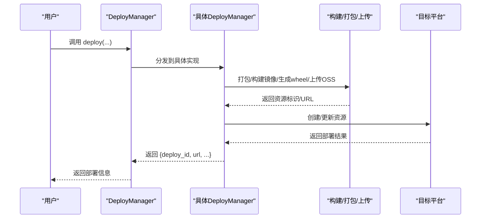

图示来源
- [deployers/base.py:23-43](file://src/agentscope_runtime/engine/deployers/base.py#L23-L43)
- [deployers/local_deployer.py:68-174](file://src/agentscope_runtime/engine/deployers/local_deployer.py#L68-L174)
- [deployers/kubernetes_deployer.py:126-312](file://src/agentscope_runtime/engine/deployers/kubernetes_deployer.py#L126-L312)
- [deployers/modelstudio_deployer.py:727-800](file://src/agentscope_runtime/engine/deployers/modelstudio_deployer.py#L727-L800)
- [deployers/knative_deployer.py:71-222](file://src/agentscope_runtime/engine/deployers/knative_deployer.py#L71-L222)
- [deployers/kruise_deployer.py:138-347](file://src/agentscope_runtime/engine/deployers/kruise_deployer.py#L138-L347)
- [deployers/agentrun_deployer.py:521-732](file://src/agentscope_runtime/engine/deployers/agentrun_deployer.py#L521-L732)
- [deployers/fc_deployer.py:416-585](file://src/agentscope_runtime/engine/deployers/fc_deployer.py#L416-L585)
- [deployers/pai_deployer.py:1-800](file://src/agentscope_runtime/engine/deployers/pai_deployer.py#L1-L800)

## 详细组件分析

### 本地部署（LocalDeployManager）
- 模式
  - 守护线程模式：在当前进程中启动 uvicorn 服务器线程，适合开发调试与单机测试。
  - 分离进程模式：将应用打包为独立项目，通过进程管理器启动，适合生产环境与自动化运维。
- 关键能力
  - 进程/线程生命周期管理与优雅停机
  - 端口可用性检测与超时控制
  - 状态持久化与查询
- 配置要点
  - 主机与端口绑定
  - 启动/关闭超时
  - 协议适配器、自定义端点、Celery broker/backend
  - 项目目录与入口脚本（分离进程模式）

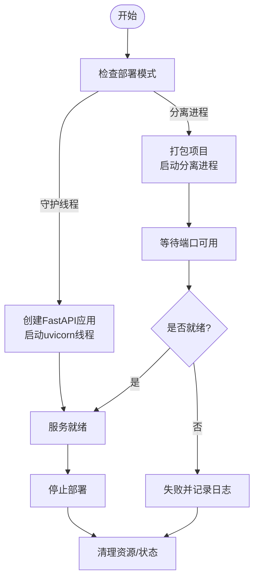

图示来源
- [deployers/local_deployer.py:68-174](file://src/agentscope_runtime/engine/deployers/local_deployer.py#L68-L174)
- [deployers/local_deployer.py:260-383](file://src/agentscope_runtime/engine/deployers/local_deployer.py#L260-L383)
- [deployers/local_deployer.py:415-511](file://src/agentscope_runtime/engine/deployers/local_deployer.py#L415-L511)
- [deployers/utils/deployment_modes.py:7-15](file://src/agentscope_runtime/engine/deployers/utils/deployment_modes.py#L7-L15)

章节来源
- [deployers/local_deployer.py:27-645](file://src/agentscope_runtime/engine/deployers/local_deployer.py#L27-L645)

### Kubernetes 部署（KubernetesDeployManager）
- 能力概述
  - 基于镜像工厂构建镜像，支持缓存与镜像推送
  - 自动选择 Service 外部访问端点（兼容本地集群与云端）
  - 支持挂载目录、环境变量、运行时配置与副本数
- 关键流程
  - 构建镜像 → 创建 Deployment/Service → 获取 URL → 记录状态

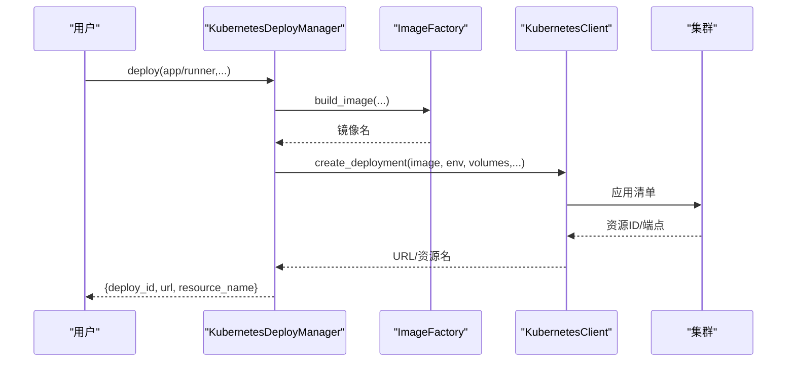

图示来源
- [deployers/kubernetes_deployer.py:126-312](file://src/agentscope_runtime/engine/deployers/kubernetes_deployer.py#L126-L312)
- [deployers/kubernetes_deployer.py:313-377](file://src/agentscope_runtime/engine/deployers/kubernetes_deployer.py#L313-L377)

章节来源
- [deployers/kubernetes_deployer.py:48-391](file://src/agentscope_runtime/engine/deployers/kubernetes_deployer.py#L48-L391)

### Knative 部署（KnativeDeployManager）
- 特点
  - 在具备 Knative 的集群上以 KService 形式部署
  - 支持注解/标签、环境变量与运行时配置
- 流程
  - 构建镜像 → 创建 KService → 返回 URL

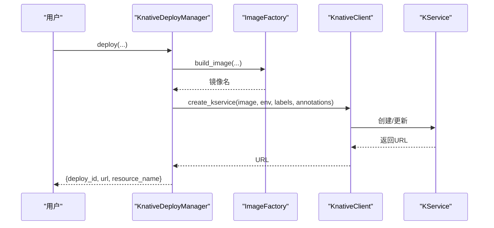

图示来源
- [deployers/knative_deployer.py:71-222](file://src/agentscope_runtime/engine/deployers/knative_deployer.py#L71-L222)
- [deployers/knative_deployer.py:227-281](file://src/agentscope_runtime/engine/deployers/knative_deployer.py#L227-L281)

章节来源
- [deployers/knative_deployer.py:43-291](file://src/agentscope_runtime/engine/deployers/knative_deployer.py#L43-L291)

### Kruise 部署（KruiseDeployManager）
- 特点
  - 使用 Kruise Sandbox 资源部署，配套 Service 提供外部访问
  - 支持本地/云端环境下的端点自动选择
- 流程
  - 构建镜像 → 创建 Sandbox → 创建 Service → 选择端点 → 记录状态

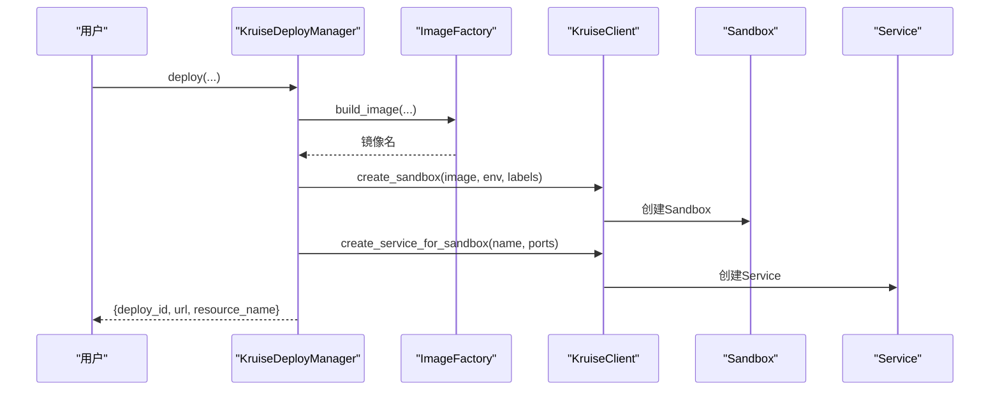

图示来源
- [deployers/kruise_deployer.py:138-347](file://src/agentscope_runtime/engine/deployers/kruise_deployer.py#L138-L347)
- [deployers/kruise_deployer.py:353-420](file://src/agentscope_runtime/engine/deployers/kruise_deployer.py#L353-L420)

章节来源
- [deployers/kruise_deployer.py:37-434](file://src/agentscope_runtime/engine/deployers/kruise_deployer.py#L37-L434)

### AgentRun 部署（AgentRunDeployManager）
- 特点
  - 将项目打包为 wheel，上传至 OSS，调用 AgentRun API 创建运行时与端点
  - 支持网络/VPC/日志等配置
- 流程
  - 生成包装项目/构建 wheel → 上传 OSS → 调用 AgentRun API → 记录状态

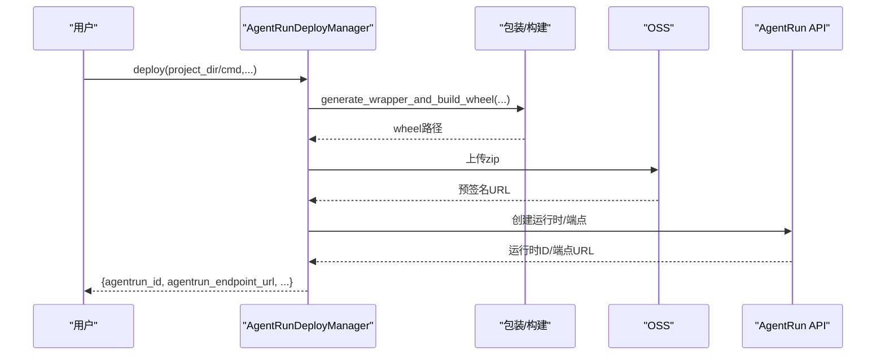

图示来源
- [deployers/agentrun_deployer.py:521-732](file://src/agentscope_runtime/engine/deployers/agentrun_deployer.py#L521-L732)
- [deployers/agentrun_deployer.py:734-800](file://src/agentscope_runtime/engine/deployers/agentrun_deployer.py#L734-L800)

章节来源
- [deployers/agentrun_deployer.py:264-800](file://src/agentscope_runtime/engine/deployers/agentrun_deployer.py#L264-L800)

### FC 部署（FCDeployManager）
- 特点
  - 基于阿里云函数计算（FC），支持自定义运行时、VPC、日志与会话亲和
  - 通过 OSS 作为代码包存储，HTTP 触发器提供公网访问
- 流程
  - 包装/构建 wheel → 上传 OSS → 创建/更新函数 → 配置 HTTP 触发器 → 返回端点

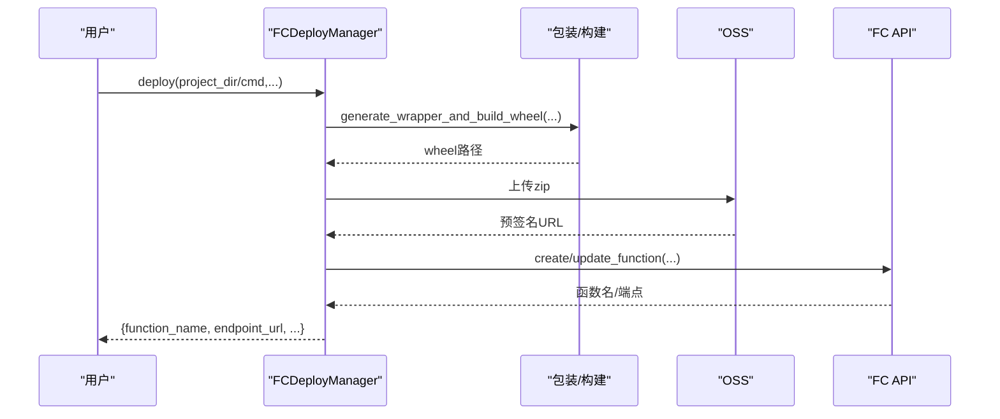

图示来源
- [deployers/fc_deployer.py:416-585](file://src/agentscope_runtime/engine/deployers/fc_deployer.py#L416-L585)
- [deployers/fc_deployer.py:587-800](file://src/agentscope_runtime/engine/deployers/fc_deployer.py#L587-L800)

章节来源
- [deployers/fc_deployer.py:246-1507](file://src/agentscope_runtime/engine/deployers/fc_deployer.py#L246-L1507)

### ModelStudio 部署（ModelstudioDeployManager）
- 特点
  - 通过 OSS 临时存储与 ModelStudio API 触发全量代码部署
  - 支持环境变量注入与打包根目录配置
- 流程
  - 生成包装项目/构建 wheel → 上传 OSS → 调用 ModelStudio 部署 → 返回控制台链接

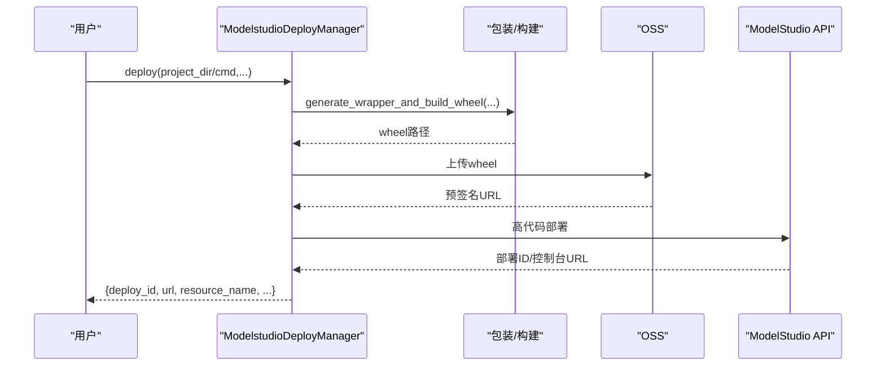

图示来源
- [deployers/modelstudio_deployer.py:727-800](file://src/agentscope_runtime/engine/deployers/modelstudio_deployer.py#L727-L800)
- [deployers/modelstudio_deployer.py:800-947](file://src/agentscope_runtime/engine/deployers/modelstudio_deployer.py#L800-L947)

章节来源
- [deployers/modelstudio_deployer.py:544-947](file://src/agentscope_runtime/engine/deployers/modelstudio_deployer.py#L544-L947)

### PAI 部署（PAIDeployManager）
- 特点
  - 基于 PAI LangStudio 的 Flow/Snapshot/Deployment 生命周期
  - 支持多种资源类型（公共/资源组/配额）、VPC、身份与可观测性配置
- 流程
  - 解析/合并配置 → 创建 Flow/Snapshot → 创建 Deployment → 可选等待完成

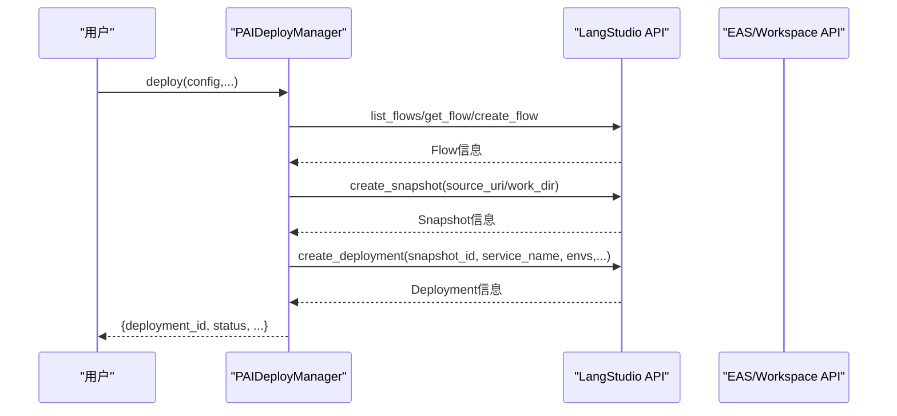

图示来源
- [deployers/pai_deployer.py:1-800](file://src/agentscope_runtime/engine/deployers/pai_deployer.py#L1-L800)

章节来源
- [deployers/pai_deployer.py:1-800](file://src/agentscope_runtime/engine/deployers/pai_deployer.py#L1-L800)

## 依赖关系分析
- 抽象与实现
  - 所有平台适配器均继承自 DeployManager，保证统一的接口契约与状态管理。
- 工具链复用
  - FastAPI 工厂用于统一生成应用、路由与中间件，减少重复实现。
  - 部署模式枚举用于本地模式区分与中间件/端点差异化。
- 容器与云客户端
  - Kubernetes/Knative/Kruise 依赖各自的容器客户端接口，统一抽象由 BaseClient 提供。
- 状态管理
  - 各 DeployManager 内置状态管理器，保存部署元数据与状态，支持查询与更新。

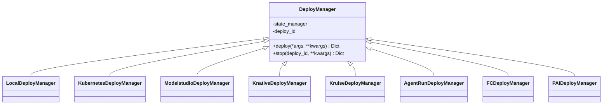

图示来源
- [deployers/base.py:9-44](file://src/agentscope_runtime/engine/deployers/base.py#L9-L44)
- [deployers/local_deployer.py:27-645](file://src/agentscope_runtime/engine/deployers/local_deployer.py#L27-L645)
- [deployers/kubernetes_deployer.py:48-391](file://src/agentscope_runtime/engine/deployers/kubernetes_deployer.py#L48-L391)
- [deployers/modelstudio_deployer.py:544-947](file://src/agentscope_runtime/engine/deployers/modelstudio_deployer.py#L544-L947)
- [deployers/knative_deployer.py:43-291](file://src/agentscope_runtime/engine/deployers/knative_deployer.py#L43-L291)
- [deployers/kruise_deployer.py:37-434](file://src/agentscope_runtime/engine/deployers/kruise_deployer.py#L37-L434)
- [deployers/agentrun_deployer.py:264-800](file://src/agentscope_runtime/engine/deployers/agentrun_deployer.py#L264-L800)
- [deployers/fc_deployer.py:246-1507](file://src/agentscope_runtime/engine/deployers/fc_deployer.py#L246-L1507)
- [deployers/pai_deployer.py:1-800](file://src/agentscope_runtime/engine/deployers/pai_deployer.py#L1-L800)

章节来源
- [deployers/base.py:9-44](file://src/agentscope_runtime/engine/deployers/base.py#L9-L44)
- [common/container_clients/base_client.py:5-40](file://src/agentscope_runtime/common/container_clients/base_client.py#L5-L40)

## 性能考虑
- 本地部署
  - 守护线程模式适合低延迟交互与快速迭代；分离进程模式适合隔离与资源限制。
  - 启动/关闭超时参数需结合业务峰值与资源情况调整。
- 云原生部署
  - Kubernetes/Knative/Kruise：合理设置副本数、资源请求/限制与探针，避免冷启动抖动。
  - 使用镜像缓存与增量构建减少构建时间。
- 云函数/运行时
  - FC/AgentRun/ModelStudio：启用预热与会话亲和，减少首包延迟；合理配置内存/CPU与磁盘大小。
- 存储与网络
  - OSS 上传/下载带宽与并发度；跨地域访问时优先就近区域。
- 观测性
  - 开启日志与指标采集，结合告警策略与自动扩缩容。

## 故障排除指南
- 本地部署
  - 端口占用：确认主机与端口未被占用；使用连接检查与端口探测。
  - 进程异常退出：查看进程日志与 PID 文件；分离进程模式下检查启动脚本与环境变量。
- Kubernetes/Knative/Kruise
  - 资源创建失败：检查命名空间、RBAC 权限与集群可用性；查看事件与控制器日志。
  - 外部访问不可达：确认 Service 类型与 LoadBalancer 状态；使用端点自动选择逻辑。
- FC/AgentRun/ModelStudio
  - 上传/部署失败：核对 OSS 凭证与桶权限；检查预签名 URL 有效期与网络连通性。
  - 运行时异常：查看函数日志与执行角色权限；确认 VPC/安全组配置。
- PAI
  - Flow/Snapshot/Deployment 状态异常：检查工作区权限与 API 调用参数；关注阶段动作与审批状态。

章节来源
- [deployers/local_deployer.py:415-511](file://src/agentscope_runtime/engine/deployers/local_deployer.py#L415-L511)
- [deployers/kubernetes_deployer.py:313-377](file://src/agentscope_runtime/engine/deployers/kubernetes_deployer.py#L313-L377)
- [deployers/knative_deployer.py:227-281](file://src/agentscope_runtime/engine/deployers/knative_deployer.py#L227-L281)
- [deployers/kruise_deployer.py:353-420](file://src/agentscope_runtime/engine/deployers/kruise_deployer.py#L353-L420)
- [deployers/agentrun_deployer.py:521-732](file://src/agentscope_runtime/engine/deployers/agentrun_deployer.py#L521-L732)
- [deployers/fc_deployer.py:416-585](file://src/agentscope_runtime/engine/deployers/fc_deployer.py#L416-L585)
- [deployers/modelstudio_deployer.py:727-800](file://src/agentscope_runtime/engine/deployers/modelstudio_deployer.py#L727-L800)
- [deployers/pai_deployer.py:1-800](file://src/agentscope_runtime/engine/deployers/pai_deployer.py#L1-L800)

## 结论
部署管理器通过统一抽象与平台适配器实现了多环境、多形态的部署能力。借助 FastAPI 工厂、镜像构建与云平台 SDK，系统在保持一致接口的同时，提供了灵活的配置与强大的扩展性。建议在生产环境中结合资源规划、可观测性与自动化流水线，持续优化部署效率与稳定性。

## 附录
- 快速参考
  - 本地部署：守护线程/分离进程两种模式，适合开发与生产。
  - Kubernetes：支持 Deployment/Service 与端点自动选择。
  - Knative：按需弹性与无服务器特性。
  - Kruise：Sandbox 资源与 Service 配合的容器化运行时。
  - AgentRun/FC/ModelStudio：云厂商托管运行时，强调易用与快速上线。
  - PAI：面向企业级 AI 工作流的完整生命周期管理。