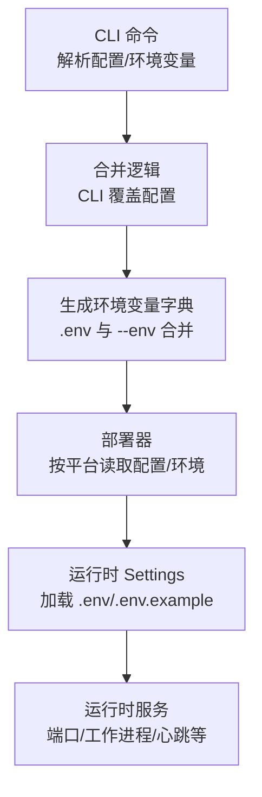
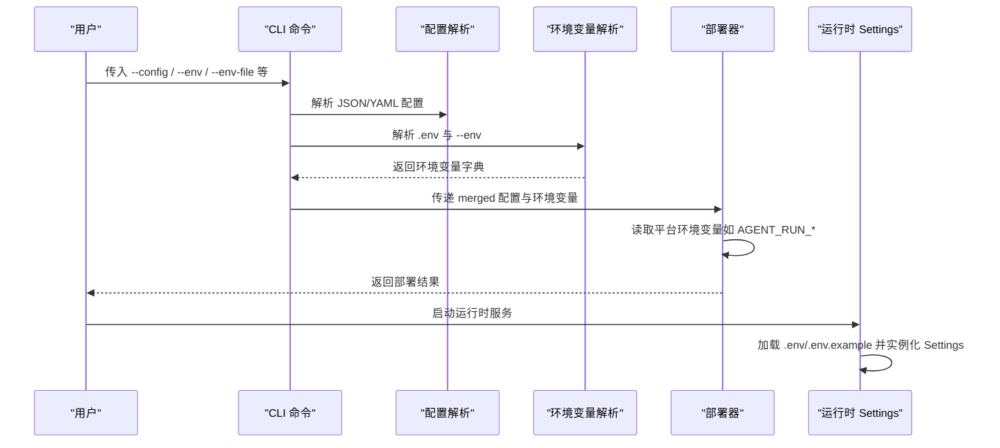
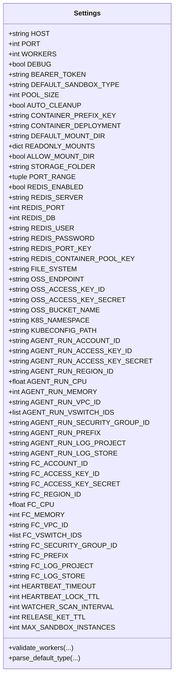
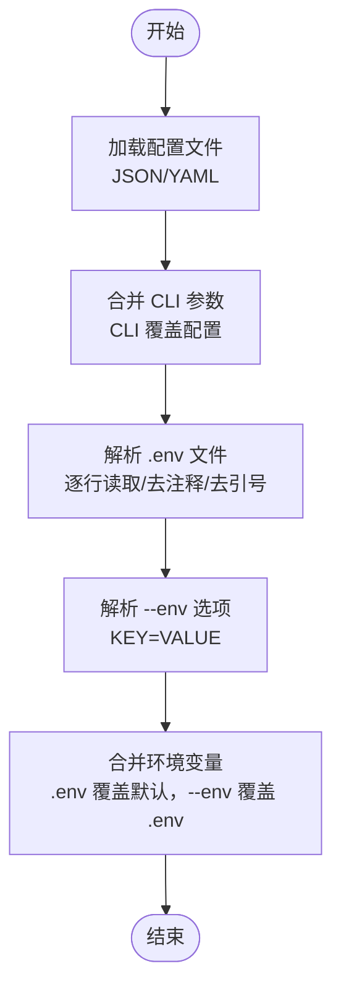
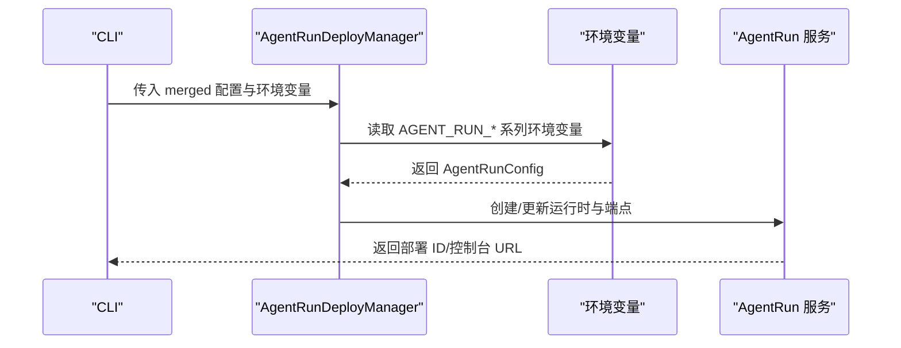
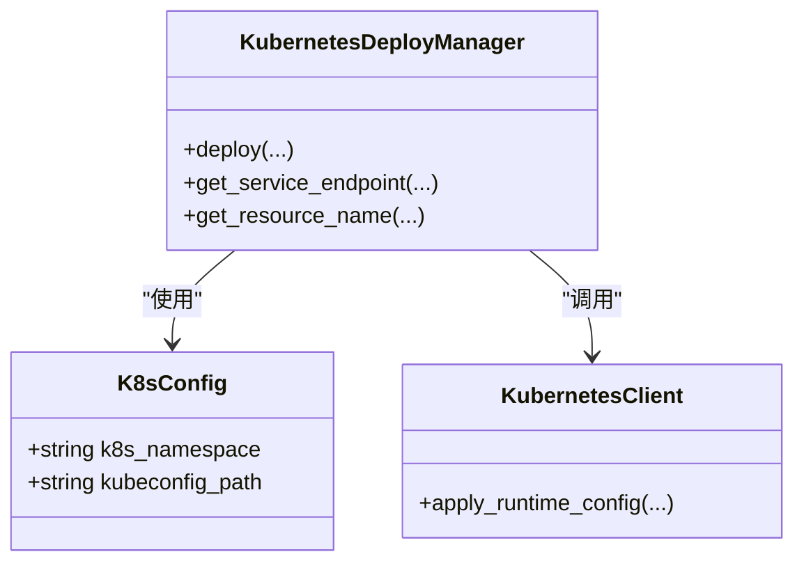
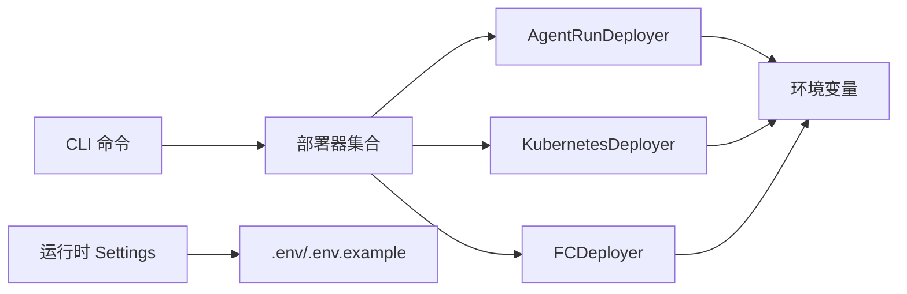

# 配置管理

<cite>
**本文引用的文件**
- [src/agentscope_runtime/sandbox/manager/server/config.py](file://src/agentscope_runtime/sandbox/manager/server/config.py)
- [src/agentscope_runtime/cli/commands/deploy.py](file://src/agentscope_runtime/cli/commands/deploy.py)
- [src/agentscope_runtime/engine/deployers/agentrun_deployer.py](file://src/agentscope_runtime/engine/deployers/agentrun_deployer.py)
- [src/agentscope_runtime/engine/deployers/fc_deployer.py](file://src/agentscope_runtime/engine/deployers/fc_deployer.py)
- [src/agentscope_runtime/common/container_clients/kubernetes_client.py](file://src/agentscope_runtime/common/container_clients/kubernetes_client.py)
- [src/agentscope_runtime/engine/deployers/kubernetes_deployer.py](file://src/agentscope_runtime/engine/deployers/kubernetes_deployer.py)
- [examples/deployments/local_deploy_config.yaml](file://examples/deployments/local_deploy_config.yaml)
- [examples/deployments/k8s_deploy/k8s_deploy_config.yaml](file://examples/deployments/k8s_deploy/k8s_deploy_config.yaml)
- [examples/deployments/k8s_deploy/k8s_deploy_config.json](file://examples/deployments/k8s_deploy/k8s_deploy_config.json)
- [examples/deployments/agentrun_deploy_config.yaml](file://examples/deployments/agentrun_deploy_config.yaml)
- [examples/deployments/pai_deploy_config.yaml](file://examples/deployments/pai_deploy_config.yaml)
- [cookbook/en/advanced_deployment.md](file://cookbook/en/advanced_deployment.md)
</cite>

## 目录
1. [简介](#简介)
2. [项目结构](#项目结构)
3. [核心组件](#核心组件)
4. [架构总览](#架构总览)
5. [详细组件分析](#详细组件分析)
6. [依赖关系分析](#依赖关系分析)
7. [性能考量](#性能考量)
8. [故障排除指南](#故障排除指南)
9. [结论](#结论)
10. [附录](#附录)

## 简介
本技术文档系统性阐述配置管理系统的结构、机制与最佳实践，覆盖以下方面：
- 配置文件结构与作用：YAML/JSON 部署配置、.env 环境变量文件、运行时 Settings 的字段定义与默认值。
- 环境变量使用与优先级：命令行参数、配置文件、.env 文件、系统环境变量的合并与覆盖顺序。
- 验证与动态更新：配置解析、校验器、运行时设置加载与缓存策略。
- 部署模式差异：本地、Kubernetes、AgentRun、FC、PAI 等平台的配置差异与注意事项。
- 模板与示例：提供可直接使用的配置模板与示例路径。
- 故障排除与调试：常见问题定位、日志与错误信息解读、性能优化建议。

## 项目结构
配置管理涉及三层：
- 命令层（CLI）：解析用户输入、合并配置、生成环境变量字典并驱动部署。
- 部署层（Deployers）：按平台读取环境变量或配置对象，构建资源并执行部署。
- 运行时层（Settings）：统一加载与校验运行时服务配置，支持 .env 与 .env.example 自动加载。

**图表来源**
- [src/agentscope_runtime/cli/commands/deploy.py:151-211](file://src/agentscope_runtime/cli/commands/deploy.py#L151-L211)
- [src/agentscope_runtime/engine/deployers/agentrun_deployer.py:104-200](file://src/agentscope_runtime/engine/deployers/agentrun_deployer.py#L104-L200)
- [src/agentscope_runtime/sandbox/manager/server/config.py:147-161](file://src/agentscope_runtime/sandbox/manager/server/config.py#L147-L161)

**章节来源**
- [src/agentscope_runtime/cli/commands/deploy.py:151-211](file://src/agentscope_runtime/cli/commands/deploy.py#L151-L211)
- [src/agentscope_runtime/sandbox/manager/server/config.py:147-161](file://src/agentscope_runtime/sandbox/manager/server/config.py#L147-L161)

## 核心组件
- 运行时 Settings（服务与平台配置）
  - 字段涵盖服务绑定地址、端口、工作进程数、调试开关、认证令牌、容器部署后端、挂载目录、Redis/OSS/K8s/AgentRun/FC 等平台配置、心跳与看门狗参数、最大实例数等。
  - 支持从 .env/.env.example 加载，允许额外键（extra="allow"），并提供字段校验器（如 WORKERS 在未启用 Redis 时强制为 1）。
- CLI 配置合并与环境变量解析
  - 支持从 JSON/YAML 加载部署配置；CLI 参数具有最高优先级进行覆盖。
  - 支持从 .env 文件与 --env 选项解析环境变量，后者覆盖前者；支持跳过无效行与去除引号。
- 平台部署器（以 AgentRun 为例）
  - 提供 from_env 工厂方法，从环境变量读取区域、日志、网络、CPU/内存、会话并发与空闲超时等配置。
  - 支持写入项目目录 .env 文件，自动转义特殊字符并加双引号保护。
- Kubernetes 客户端与部署器
  - 将 runtime_config 中的 resources/security_context/node_selector/tolerations/image_pull_secrets 等映射到 Pod 规约。
  - 提供服务端点选择逻辑，区分本地集群与远端集群的访问方式。

**章节来源**
- [src/agentscope_runtime/sandbox/manager/server/config.py:11-161](file://src/agentscope_runtime/sandbox/manager/server/config.py#L11-L161)
- [src/agentscope_runtime/cli/commands/deploy.py:241-298](file://src/agentscope_runtime/cli/commands/deploy.py#L241-L298)
- [src/agentscope_runtime/engine/deployers/agentrun_deployer.py:104-200](file://src/agentscope_runtime/engine/deployers/agentrun_deployer.py#L104-L200)
- [src/agentscope_runtime/common/container_clients/kubernetes_client.py:757-794](file://src/agentscope_runtime/common/container_clients/kubernetes_client.py#L757-L794)
- [src/agentscope_runtime/engine/deployers/kubernetes_deployer.py:72-120](file://src/agentscope_runtime/engine/deployers/kubernetes_deployer.py#L72-L120)

## 架构总览
下图展示从 CLI 到部署器再到运行时 Settings 的配置流：

**图表来源**
- [src/agentscope_runtime/cli/commands/deploy.py:151-211](file://src/agentscope_runtime/cli/commands/deploy.py#L151-L211)
- [src/agentscope_runtime/cli/commands/deploy.py:241-298](file://src/agentscope_runtime/cli/commands/deploy.py#L241-L298)
- [src/agentscope_runtime/engine/deployers/agentrun_deployer.py:104-200](file://src/agentscope_runtime/engine/deployers/agentrun_deployer.py#L104-L200)
- [src/agentscope_runtime/sandbox/manager/server/config.py:147-161](file://src/agentscope_runtime/sandbox/manager/server/config.py#L147-L161)

## 详细组件分析

### 组件一：运行时 Settings（服务与平台配置）
- 关键点
  - 默认值集中定义，便于统一管理与审计。
  - 字段校验器确保在特定条件下强制合理值（如未启用 Redis 时 WORKERS=1）。
  - 支持字符串到列表/字典的解析（如 DEFAULT_SANDBOX_TYPE、VSWITCH_IDS）。
  - 自动加载 .env/.env.example，避免重复初始化。
- 数据模型类图

**图表来源**
- [src/agentscope_runtime/sandbox/manager/server/config.py:11-161](file://src/agentscope_runtime/sandbox/manager/server/config.py#L11-L161)

**章节来源**
- [src/agentscope_runtime/sandbox/manager/server/config.py:11-161](file://src/agentscope_runtime/sandbox/manager/server/config.py#L11-L161)

### 组件二：CLI 配置合并与环境变量解析
- 关键点
  - 支持 JSON/YAML 配置文件，自动识别扩展名并解析。
  - CLI 参数覆盖配置文件中的对应项；环境变量通过 --env 与 --env-file 两种来源合并，后者被前者覆盖。
  - 对无效行发出警告但不中断；支持去除包裹的引号。
- 流程图（配置合并）

**图表来源**
- [src/agentscope_runtime/cli/commands/deploy.py:151-183](file://src/agentscope_runtime/cli/commands/deploy.py#L151-L183)
- [src/agentscope_runtime/cli/commands/deploy.py:186-211](file://src/agentscope_runtime/cli/commands/deploy.py#L186-L211)
- [src/agentscope_runtime/cli/commands/deploy.py:241-298](file://src/agentscope_runtime/cli/commands/deploy.py#L241-L298)

**章节来源**
- [src/agentscope_runtime/cli/commands/deploy.py:151-211](file://src/agentscope_runtime/cli/commands/deploy.py#L151-L211)
- [src/agentscope_runtime/cli/commands/deploy.py:241-298](file://src/agentscope_runtime/cli/commands/deploy.py#L241-L298)

### 组件三：平台部署器（以 AgentRun 为例）
- 关键点
  - from_env 工厂方法从环境变量读取区域、日志、网络、CPU/内存、会话并发与空闲超时等。
  - 支持将环境变量写入项目目录 .env 文件，自动处理转义与引号。
- 序列图（AgentRun 部署流程）

**图表来源**
- [src/agentscope_runtime/engine/deployers/agentrun_deployer.py:104-200](file://src/agentscope_runtime/engine/deployers/agentrun_deployer.py#L104-L200)
- [src/agentscope_runtime/engine/deployers/agentrun_deployer.py:475-511](file://src/agentscope_runtime/engine/deployers/agentrun_deployer.py#L475-L511)

**章节来源**
- [src/agentscope_runtime/engine/deployers/agentrun_deployer.py:104-200](file://src/agentscope_runtime/engine/deployers/agentrun_deployer.py#L104-L200)
- [src/agentscope_runtime/engine/deployers/agentrun_deployer.py:475-511](file://src/agentscope_runtime/engine/deployers/agentrun_deployer.py#L475-L511)

### 组件四：Kubernetes 客户端与部署器
- 关键点
  - 将 runtime_config 映射到 Pod 的资源请求/限制、安全上下文、节点选择器、容忍度与镜像拉取密钥。
  - 提供服务端点选择逻辑，自动区分本地与远端集群访问方式。
- 类图（K8s 相关）

**图表来源**
- [src/agentscope_runtime/engine/deployers/kubernetes_deployer.py:24-71](file://src/agentscope_runtime/engine/deployers/kubernetes_deployer.py#L24-L71)
- [src/agentscope_runtime/common/container_clients/kubernetes_client.py:757-794](file://src/agentscope_runtime/common/container_clients/kubernetes_client.py#L757-L794)

**章节来源**
- [src/agentscope_runtime/engine/deployers/kubernetes_deployer.py:72-120](file://src/agentscope_runtime/engine/deployers/kubernetes_deployer.py#L72-L120)
- [src/agentscope_runtime/common/container_clients/kubernetes_client.py:757-794](file://src/agentscope_runtime/common/container_clients/kubernetes_client.py#L757-L794)

## 依赖关系分析
- CLI 与部署器
  - CLI 负责解析与合并配置，部署器负责按平台读取环境变量与配置对象。
- 部署器与平台 SDK
  - AgentRun/FC 等部署器通过 from_env 读取环境变量，再调用对应云服务 SDK。
- 运行时 Settings 与 .env
  - 运行时服务启动时加载 .env/.env.example，避免重复初始化。

**图表来源**
- [src/agentscope_runtime/cli/commands/deploy.py:301-317](file://src/agentscope_runtime/cli/commands/deploy.py#L301-L317)
- [src/agentscope_runtime/engine/deployers/agentrun_deployer.py:104-200](file://src/agentscope_runtime/engine/deployers/agentrun_deployer.py#L104-L200)
- [src/agentscope_runtime/engine/deployers/kubernetes_deployer.py:48-71](file://src/agentscope_runtime/engine/deployers/kubernetes_deployer.py#L48-L71)
- [src/agentscope_runtime/engine/deployers/fc_deployer.py:84-122](file://src/agentscope_runtime/engine/deployers/fc_deployer.py#L84-L122)
- [src/agentscope_runtime/sandbox/manager/server/config.py:147-161](file://src/agentscope_runtime/sandbox/manager/server/config.py#L147-L161)

**章节来源**
- [src/agentscope_runtime/cli/commands/deploy.py:301-317](file://src/agentscope_runtime/cli/commands/deploy.py#L301-L317)
- [src/agentscope_runtime/engine/deployers/agentrun_deployer.py:104-200](file://src/agentscope_runtime/engine/deployers/agentrun_deployer.py#L104-L200)
- [src/agentscope_runtime/engine/deployers/kubernetes_deployer.py:48-71](file://src/agentscope_runtime/engine/deployers/kubernetes_deployer.py#L48-L71)
- [src/agentscope_runtime/engine/deployers/fc_deployer.py:84-122](file://src/agentscope_runtime/engine/deployers/fc_deployer.py#L84-L122)
- [src/agentscope_runtime/sandbox/manager/server/config.py:147-161](file://src/agentscope_runtime/sandbox/manager/server/config.py#L147-L161)

## 性能考量
- 配置加载与缓存
  - 运行时 Settings 使用全局单例，首次加载后缓存，避免重复解析 .env。
- 资源分配
  - Kubernetes runtime_config 的 resources.requests/limits 决定调度与隔离效果；合理设置可减少 OOM 与调度失败。
- 心跳与看门狗
  - WATCHER_SCAN_INTERVAL 控制后台扫描频率；过小会增加 CPU 开销，过大可能延迟回收。
- 并发与工作进程
  - 未启用 Redis 时 WORKERS 强制为 1，避免多进程竞争共享资源。

**章节来源**
- [src/agentscope_runtime/sandbox/manager/server/config.py:114-119](file://src/agentscope_runtime/sandbox/manager/server/config.py#L114-L119)
- [src/agentscope_runtime/common/container_clients/kubernetes_client.py:757-794](file://src/agentscope_runtime/common/container_clients/kubernetes_client.py#L757-L794)

## 故障排除指南
- 配置文件格式错误
  - 症状：解析失败或报“不支持的文件格式”。
  - 处理：确认扩展名为 .json/.yaml/.yml，并检查内容是否符合对应格式。
- 环境变量格式错误
  - 症状：.env 中出现无效行被跳过，或 --env 缺少等号。
  - 处理：修正格式为 KEY=VALUE，或删除注释行与空行。
- 平台配置缺失
  - 症状：AgentRun/FC/PAI 等部署缺少必要凭据或区域。
  - 处理：通过环境变量或配置文件补齐；注意 AgentRun 需要阿里云 AK。
- 端点不可达
  - 症状：Kubernetes 本地集群无法通过 ExternalIP 访问。
  - 处理：使用 get_service_endpoint 的回退逻辑，或改为 NodePort/Ingress。
- 运行时服务异常
  - 症状：端口冲突、心跳超时、看门狗未启动。
  - 处理：检查 HOST/PORT、HEARTBEAT_*、WATCHER_SCAN_INTERVAL 设置；确保防火墙放行。

**章节来源**
- [src/agentscope_runtime/cli/commands/deploy.py:151-183](file://src/agentscope_runtime/cli/commands/deploy.py#L151-L183)
- [src/agentscope_runtime/cli/commands/deploy.py:241-298](file://src/agentscope_runtime/cli/commands/deploy.py#L241-L298)
- [src/agentscope_runtime/engine/deployers/kubernetes_deployer.py:72-120](file://src/agentscope_runtime/engine/deployers/kubernetes_deployer.py#L72-L120)
- [src/agentscope_runtime/sandbox/manager/server/config.py:103-106](file://src/agentscope_runtime/sandbox/manager/server/config.py#L103-L106)

## 结论
本配置管理体系通过 CLI 合并与环境变量解析、平台部署器按需读取、运行时 Settings 统一加载，形成清晰的“输入—执行—运行时”的配置链路。遵循本文的优先级规则与最佳实践，可在不同部署模式下稳定地管理配置并快速定位问题。

## 附录

### 配置优先级与合并规则
- 优先级（从高到低）
  1) 命令行参数（--env/--env-file/--config 中的非 None 值）
  2) 配置文件（JSON/YAML）
  3) .env 文件（逐行解析，后者覆盖前者）
  4) 系统环境变量（平台部署器 from_env 读取）
  5) 运行时 Settings 默认值

**章节来源**
- [src/agentscope_runtime/cli/commands/deploy.py:186-211](file://src/agentscope_runtime/cli/commands/deploy.py#L186-L211)
- [src/agentscope_runtime/cli/commands/deploy.py:241-298](file://src/agentscope_runtime/cli/commands/deploy.py#L241-L298)
- [src/agentscope_runtime/engine/deployers/agentrun_deployer.py:104-200](file://src/agentscope_runtime/engine/deployers/agentrun_deployer.py#L104-L200)
- [src/agentscope_runtime/sandbox/manager/server/config.py:147-161](file://src/agentscope_runtime/sandbox/manager/server/config.py#L147-L161)

### 配置模板与示例
- 本地部署配置
  - 参考：[examples/deployments/local_deploy_config.yaml:1-16](file://examples/deployments/local_deploy_config.yaml#L1-L16)
- Kubernetes 部署配置（YAML/JSON）
  - 参考：[examples/deployments/k8s_deploy/k8s_deploy_config.yaml:1-53](file://examples/deployments/k8s_deploy/k8s_deploy_config.yaml#L1-L53)、[examples/deployments/k8s_deploy/k8s_deploy_config.json:1-40](file://examples/deployments/k8s_deploy/k8s_deploy_config.json#L1-L40)
- AgentRun 部署配置
  - 参考：[examples/deployments/agentrun_deploy_config.yaml:1-28](file://examples/deployments/agentrun_deploy_config.yaml#L1-L28)
- PAI 部署配置
  - 参考：[examples/deployments/pai_deploy_config.yaml:1-111](file://examples/deployments/pai_deploy_config.yaml#L1-L111)
- 部署结构参考（含资源类型与 VPC 配置）
  - 参考：[cookbook/en/advanced_deployment.md:973-1316](file://cookbook/en/advanced_deployment.md#L973-L1316)

**章节来源**
- [examples/deployments/local_deploy_config.yaml:1-16](file://examples/deployments/local_deploy_config.yaml#L1-L16)
- [examples/deployments/k8s_deploy/k8s_deploy_config.yaml:1-53](file://examples/deployments/k8s_deploy/k8s_deploy_config.yaml#L1-L53)
- [examples/deployments/k8s_deploy/k8s_deploy_config.json:1-40](file://examples/deployments/k8s_deploy/k8s_deploy_config.json#L1-L40)
- [examples/deployments/agentrun_deploy_config.yaml:1-28](file://examples/deployments/agentrun_deploy_config.yaml#L1-L28)
- [examples/deployments/pai_deploy_config.yaml:1-111](file://examples/deployments/pai_deploy_config.yaml#L1-L111)
- [cookbook/en/advanced_deployment.md:973-1316](file://cookbook/en/advanced_deployment.md#L973-L1316)

### 不同部署模式下的配置差异与注意事项
- 本地（local）
  - 关注 host/port、entrypoint、环境变量注入与调试级别。
  - 参考：[examples/deployments/local_deploy_config.yaml:4-16](file://examples/deployments/local_deploy_config.yaml#L4-L16)
- Kubernetes（k8s/knative/kruise）
  - 关注命名空间、副本数、镜像、requirements、runtime_config 的 resources/security_context 等。
  - 参考：[examples/deployments/k8s_deploy/k8s_deploy_config.yaml:5-53](file://examples/deployments/k8s_deploy/k8s_deploy_config.yaml#L5-L53)、[src/agentscope_runtime/common/container_clients/kubernetes_client.py:757-794](file://src/agentscope_runtime/common/container_clients/kubernetes_client.py#L757-L794)
- AgentRun
  - 关注区域、CPU/内存、日志与网络配置、会话并发与空闲超时。
  - 参考：[src/agentscope_runtime/engine/deployers/agentrun_deployer.py:104-200](file://src/agentscope_runtime/engine/deployers/agentrun_deployer.py#L104-L200)、[examples/deployments/agentrun_deploy_config.yaml:13-28](file://examples/deployments/agentrun_deploy_config.yaml#L13-L28)
- FC
  - 关注 VPC/交换机/安全部组、日志项目与存储、CPU/内存。
  - 参考：[src/agentscope_runtime/engine/deployers/fc_deployer.py:84-122](file://src/agentscope_runtime/engine/deployers/fc_deployer.py#L84-L122)
- PAI
  - 关注资源池类型（public/resource/quota）、VPC 配置、身份与可观测性。
  - 参考：[examples/deployments/pai_deploy_config.yaml:43-111](file://examples/deployments/pai_deploy_config.yaml#L43-L111)、[cookbook/en/advanced_deployment.md:987-1027](file://cookbook/en/advanced_deployment.md#L987-L1027)

**章节来源**
- [examples/deployments/local_deploy_config.yaml:4-16](file://examples/deployments/local_deploy_config.yaml#L4-L16)
- [examples/deployments/k8s_deploy/k8s_deploy_config.yaml:5-53](file://examples/deployments/k8s_deploy/k8s_deploy_config.yaml#L5-L53)
- [src/agentscope_runtime/common/container_clients/kubernetes_client.py:757-794](file://src/agentscope_runtime/common/container_clients/kubernetes_client.py#L757-L794)
- [src/agentscope_runtime/engine/deployers/agentrun_deployer.py:104-200](file://src/agentscope_runtime/engine/deployers/agentrun_deployer.py#L104-L200)
- [examples/deployments/agentrun_deploy_config.yaml:13-28](file://examples/deployments/agentrun_deploy_config.yaml#L13-L28)
- [src/agentscope_runtime/engine/deployers/fc_deployer.py:84-122](file://src/agentscope_runtime/engine/deployers/fc_deployer.py#L84-L122)
- [examples/deployments/pai_deploy_config.yaml:43-111](file://examples/deployments/pai_deploy_config.yaml#L43-L111)
- [cookbook/en/advanced_deployment.md:987-1027](file://cookbook/en/advanced_deployment.md#L987-L1027)