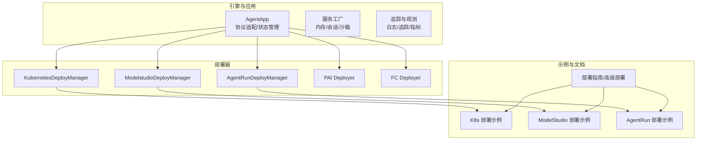
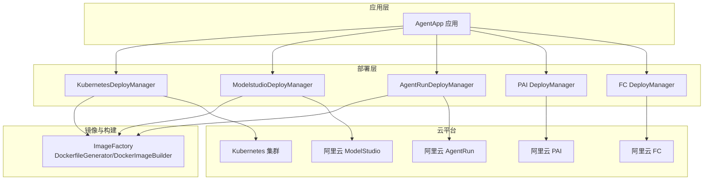
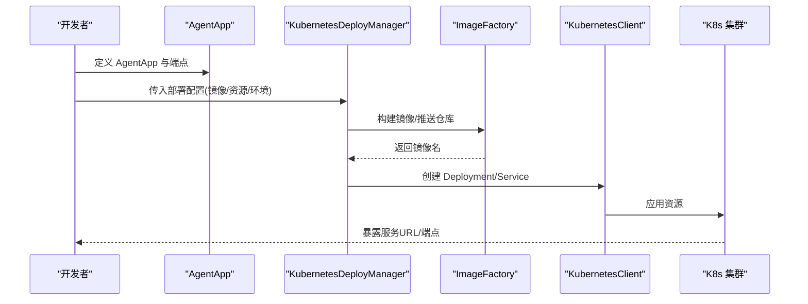
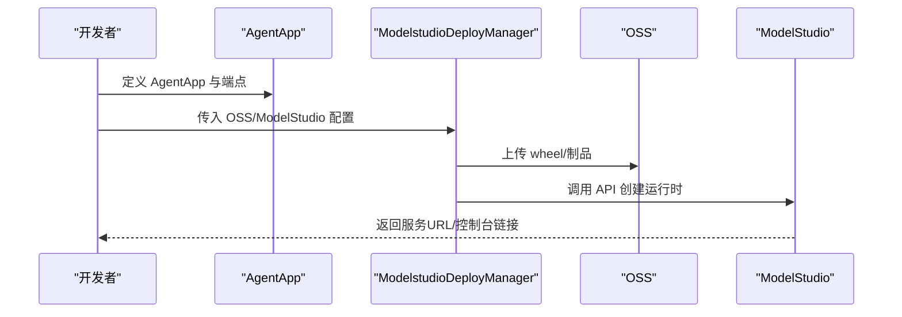
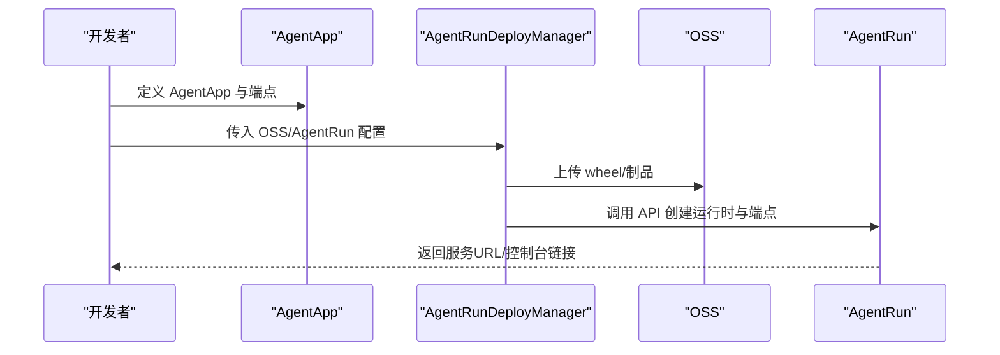
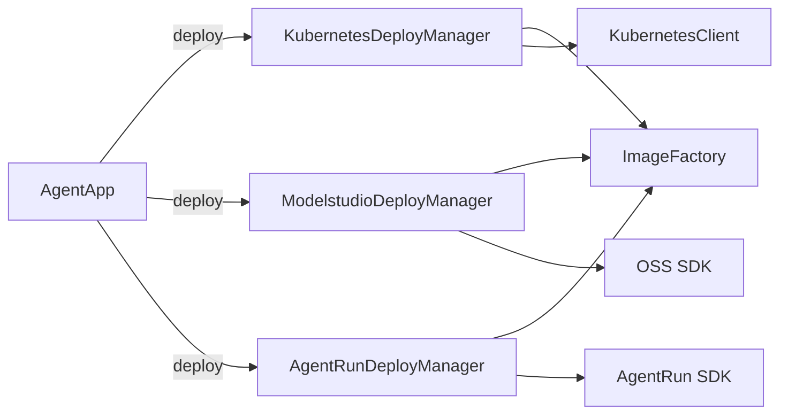

# 云平台集成

<cite>
**本文引用的文件**
- [README.md](file://README.md)
- [advanced_deployment.md](file://cookbook/zh/advanced_deployment.md)
- [deployment.md](file://cookbook/zh/deployment.md)
- [k8s_deploy/README.md](file://examples/deployments/k8s_deploy/README.md)
- [modelstudio_deploy/README.md](file://examples/deployments/modelstudio_deploy/README.md)
- [agentrun_deploy/README.md](file://examples/deployments/agentrun_deploy/README.md)
- [k8s_deploy/app_deploy_to_k8s.py](file://examples/deployments/k8s_deploy/app_deploy_to_k8s.py)
- [modelstudio_deploy/app_deploy_to_modelstudio.py](file://examples/deployments/modelstudio_deploy/app_deploy_to_modelstudio.py)
- [agentrun_deploy/app_deploy_to_agentrun.py](file://examples/deployments/agentrun_deploy/app_deploy_to_agentrun.py)
- [kubernetes_deployer.py](file://src/agentscope_runtime/engine/deployers/kubernetes_deployer.py)
- [modelstudio_deployer.py](file://src/agentscope_runtime/engine/deployers/modelstudio_deployer.py)
- [agentrun_deployer.py](file://src/agentscope_runtime/engine/deployers/agentrun_deployer.py)
- [kubernetes_client.py](file://src/agentscope_runtime/common/container_clients/kubernetes_client.py)
- [image_factory.py](file://src/agentscope_runtime/engine/deployers/utils/docker_image_utils/image_factory.py)
- [manager_config.py](file://src/agentscope_runtime/sandbox/model/manager_config.py)
</cite>

## 目录
1. [简介](#简介)
2. [项目结构](#项目结构)
3. [核心组件](#核心组件)
4. [架构总览](#架构总览)
5. [详细组件分析](#详细组件分析)
6. [依赖关系分析](#依赖关系分析)
7. [性能考虑](#性能考虑)
8. [故障排查指南](#故障排查指南)
9. [结论](#结论)
10. [附录](#附录)

## 简介
本指南面向需要在云平台集成 AgentScope Runtime 的工程团队，系统讲解如何在阿里云、Kubernetes 等主流云平台完成 Agent 应用的部署与运维。内容覆盖：
- 与阿里云平台（ModelStudio、AgentRun、PAI、函数计算 FC）的集成方法与认证配置
- Kubernetes 集群部署最佳实践（容器化、服务发现、负载均衡）
- AgentRun 平台部署与 ModelStudio 部署的完整流程
- 云原生部署的运维能力（资源管理、监控告警、自动扩缩容）
- 成本优化与性能调优建议

## 项目结构
本项目围绕“引擎 + 部署器 + 示例 + 文档”的组织方式展开，关键模块如下：
- 引擎与应用：AgentApp、协议适配、状态管理、服务工厂
- 部署器：Kubernetes、ModelStudio、AgentRun、PAI、FC 等
- 示例：各平台部署示例脚本与说明文档
- 文档：中文部署与高级部署指南

图示来源
- [kubernetes_deployer.py](file://src/agentscope_runtime/engine/deployers/kubernetes_deployer.py)
- [modelstudio_deployer.py](file://src/agentscope_runtime/engine/deployers/modelstudio_deployer.py)
- [agentrun_deployer.py](file://src/agentscope_runtime/engine/deployers/agentrun_deployer.py)
- [advanced_deployment.md](file://cookbook/zh/advanced_deployment.md)

章节来源
- [README.md](file://README.md)
- [advanced_deployment.md](file://cookbook/zh/advanced_deployment.md)
- [deployment.md](file://cookbook/zh/deployment.md)

## 核心组件
- AgentApp：统一的 Agent 应用入口，支持多协议适配（A2A、Response API、OpenAI 兼容模式）、多端点与任务队列
- 部署器：封装不同平台的部署细节，负责镜像构建、制品上传、运行时创建与端点暴露
- 容器客户端：Kubernetes 客户端负责集群交互、命名空间、服务与部署对象管理
- 镜像工厂：统一生成 Dockerfile、构建镜像、推送仓库、注入环境变量与依赖

章节来源
- [kubernetes_deployer.py](file://src/agentscope_runtime/engine/deployers/kubernetes_deployer.py)
- [modelstudio_deployer.py](file://src/agentscope_runtime/engine/deployers/modelstudio_deployer.py)
- [agentrun_deployer.py](file://src/agentscope_runtime/engine/deployers/agentrun_deployer.py)
- [kubernetes_client.py](file://src/agentscope_runtime/common/container_clients/kubernetes_client.py)
- [image_factory.py](file://src/agentscope_runtime/engine/deployers/utils/docker_image_utils/image_factory.py)

## 架构总览
下图展示了跨平台部署的整体架构：AgentApp 通过部署器对接云平台，部署器内部协调镜像工厂与云 SDK，最终在目标平台创建运行时并暴露 API 端点。

图示来源
- [kubernetes_deployer.py](file://src/agentscope_runtime/engine/deployers/kubernetes_deployer.py)
- [modelstudio_deployer.py](file://src/agentscope_runtime/engine/deployers/modelstudio_deployer.py)
- [agentrun_deployer.py](file://src/agentscope_runtime/engine/deployers/agentrun_deployer.py)
- [image_factory.py](file://src/agentscope_runtime/engine/deployers/utils/docker_image_utils/image_factory.py)

## 详细组件分析

### Kubernetes 部署（容器化、服务发现、负载均衡）
- 容器化与镜像构建
  - 使用镜像工厂生成 Dockerfile、构建镜像、可选推送至镜像仓库
  - 支持 requirements、extra_packages、base_image、环境变量注入
- 集群交互与资源编排
  - 通过 Kubernetes 客户端加载 kubeconfig/in-cluster 配置，创建 Deployment/Service
  - 支持资源请求与限制、镜像拉取策略、节点选择与容忍
- 服务发现与负载均衡
  - 通过 Service 暴露端口，结合 Ingress 控制器实现外网访问
  - 支持本地集群与云环境的端点自动选择（LB/ExternalIP vs 127.0.0.1）

图示来源
- [kubernetes_deployer.py](file://src/agentscope_runtime/engine/deployers/kubernetes_deployer.py)
- [kubernetes_client.py](file://src/agentscope_runtime/common/container_clients/kubernetes_client.py)
- [image_factory.py](file://src/agentscope_runtime/engine/deployers/utils/docker_image_utils/image_factory.py)
- [k8s_deploy/app_deploy_to_k8s.py](file://examples/deployments/k8s_deploy/app_deploy_to_k8s.py)
- [k8s_deploy/README.md](file://examples/deployments/k8s_deploy/README.md)

章节来源
- [kubernetes_deployer.py](file://src/agentscope_runtime/engine/deployers/kubernetes_deployer.py)
- [kubernetes_client.py](file://src/agentscope_runtime/common/container_clients/kubernetes_client.py)
- [image_factory.py](file://src/agentscope_runtime/engine/deployers/utils/docker_image_utils/image_factory.py)
- [k8s_deploy/README.md](file://examples/deployments/k8s_deploy/README.md)
- [k8s_deploy/app_deploy_to_k8s.py](file://examples/deployments/k8s_deploy/app_deploy_to_k8s.py)

### ModelStudio 部署（阿里云百炼应用开发平台）
- 认证与配置
  - OSSConfig：支持 OSS 凭证或回退到阿里云 AK/SK
  - ModelstudioConfig：工作空间、AK/SK、DashScope API Key、STS 临时安全令牌
- 部署流程
  - 生成 wheel 包，上传至 OSS，调用 ModelStudio API 创建运行时
  - 支持从 AgentApp、项目目录、已有 wheel 三种方式部署
- 运维能力
  - 内置监控与分析、自动扩缩容、与 DashScope 集成

图示来源
- [modelstudio_deployer.py](file://src/agentscope_runtime/engine/deployers/modelstudio_deployer.py)
- [modelstudio_deploy/README.md](file://examples/deployments/modelstudio_deploy/README.md)
- [modelstudio_deploy/app_deploy_to_modelstudio.py](file://examples/deployments/modelstudio_deploy/app_deploy_to_modelstudio.py)

章节来源
- [modelstudio_deployer.py](file://src/agentscope_runtime/engine/deployers/modelstudio_deployer.py)
- [modelstudio_deploy/README.md](file://examples/deployments/modelstudio_deploy/README.md)
- [modelstudio_deploy/app_deploy_to_modelstudio.py](file://examples/deployments/modelstudio_deploy/app_deploy_to_modelstudio.py)

### AgentRun 部署（阿里云 AgentRun 平台）
- 认证与配置
  - AgentRunConfig：AK/SK、区域、端点、网络模式（PUBLIC/PRIVATE/PUBLIC_AND_PRIVATE）、VPC/安全组/VSwitch
  - 资源配置：CPU/内存、会话并发限制、空闲超时、执行角色 ARN
- 部署流程
  - 生成 wheel 包，上传至 OSS，调用 AgentRun API 创建运行时与端点
  - 支持会话亲和（X-Agentrun-Session-Id 头部）与多端点
- 运维能力
  - 平台托管、内置监控、日志服务（SLS）

图示来源
- [agentrun_deployer.py](file://src/agentscope_runtime/engine/deployers/agentrun_deployer.py)
- [agentrun_deploy/README.md](file://examples/deployments/agentrun_deploy/README.md)
- [agentrun_deploy/app_deploy_to_agentrun.py](file://examples/deployments/agentrun_deploy/app_deploy_to_agentrun.py)

章节来源
- [agentrun_deployer.py](file://src/agentscope_runtime/engine/deployers/agentrun_deployer.py)
- [agentrun_deploy/README.md](file://examples/deployments/agentrun_deploy/README.md)
- [agentrun_deploy/app_deploy_to_agentrun.py](file://examples/deployments/agentrun_deploy/app_deploy_to_agentrun.py)

### PAI 部署（阿里云平台 for AI）
- 适用场景：LangStudio 项目管理、EAS 服务部署、VPC 网络、RAM 角色与权限、链路追踪
- 关键点：支持公共资源池、专属资源组、配额；可配置 VPC 与公网访问；支持 STS 临时安全令牌

章节来源
- [advanced_deployment.md](file://cookbook/zh/advanced_deployment.md)

### 函数计算（FC）部署（阿里云 Serverless）
- 适用场景：无服务器、按请求计费、冷启动优化
- 关键点：容器部署模式、FC 凭证配置、与 OSS 集成

章节来源
- [advanced_deployment.md](file://cookbook/zh/advanced_deployment.md)
- [manager_config.py](file://src/agentscope_runtime/sandbox/model/manager_config.py)

## 依赖关系分析
- 组件耦合
  - AgentApp 与部署器解耦，通过统一的 deploy 接口对接不同平台
  - 部署器内部依赖镜像工厂与云 SDK，降低平台差异
- 外部依赖
  - Kubernetes：kubernetes-client、kubeconfig
  - 阿里云：alibabacloud-oss-v2、alibabacloud-bailian20231229、alibabacloud-agentrun20250910 等
- 可能的循环依赖
  - 部署器之间无直接依赖，通过抽象基类与协议适配隔离平台差异

图示来源
- [kubernetes_deployer.py](file://src/agentscope_runtime/engine/deployers/kubernetes_deployer.py)
- [modelstudio_deployer.py](file://src/agentscope_runtime/engine/deployers/modelstudio_deployer.py)
- [agentrun_deployer.py](file://src/agentscope_runtime/engine/deployers/agentrun_deployer.py)
- [image_factory.py](file://src/agentscope_runtime/engine/deployers/utils/docker_image_utils/image_factory.py)
- [kubernetes_client.py](file://src/agentscope_runtime/common/container_clients/kubernetes_client.py)

章节来源
- [kubernetes_deployer.py](file://src/agentscope_runtime/engine/deployers/kubernetes_deployer.py)
- [modelstudio_deployer.py](file://src/agentscope_runtime/engine/deployers/modelstudio_deployer.py)
- [agentrun_deployer.py](file://src/agentscope_runtime/engine/deployers/agentrun_deployer.py)
- [image_factory.py](file://src/agentscope_runtime/engine/deployers/utils/docker_image_utils/image_factory.py)
- [kubernetes_client.py](file://src/agentscope_runtime/common/container_clients/kubernetes_client.py)

## 性能考虑
- 容器化与镜像优化
  - 使用多阶段构建减少镜像体积，启用构建缓存
  - 选择合适的基础镜像与 Python 版本，避免不必要的依赖
- 资源管理
  - 明确 requests/limits，避免资源抢占导致抖动
  - 在 Kubernetes 中使用 HPA/VPAs 实现自动扩缩容
- 网络与负载均衡
  - 使用 Service + Ingress，合理配置超时与重试
  - 在 AgentRun/ModelStudio 中开启会话亲和，提升缓存命中
- 监控与追踪
  - 启用内置追踪与指标，结合日志聚合与告警
  - 对长耗时任务使用异步端点与任务队列

## 故障排查指南
- Kubernetes
  - 常见问题：镜像拉取失败、资源不足、RBAC 权限不足
  - 排查手段：查看 Pod/事件描述、节点资源配额、镜像仓库认证
- ModelStudio
  - 常见问题：OSS 权限不足、DashScope API Key 未配置、工作空间未激活
  - 排查手段：检查 OSS Bucket 权限、确认工作空间与 AK/SK
- AgentRun
  - 常见问题：网络模式配置错误（PRIVATE/PUBLIC_AND_PRIVATE）、VPC/安全组/VSwitch 缺失
  - 排查手段：核对网络配置、检查会话亲和头（X-Agentrun-Session-Id）

章节来源
- [k8s_deploy/README.md](file://examples/deployments/k8s_deploy/README.md)
- [modelstudio_deploy/README.md](file://examples/deployments/modelstudio_deploy/README.md)
- [agentrun_deploy/README.md](file://examples/deployments/agentrun_deploy/README.md)

## 结论
通过统一的 AgentApp 与多平台部署器，AgentScope Runtime 能够在阿里云与 Kubernetes 等主流云平台实现一致的部署体验。建议优先采用 Kubernetes 进行企业级部署，配合 ModelStudio/AgentRun 获取托管能力与平台生态优势。结合资源管理、监控告警与自动扩缩容，可实现高可用、低成本、易运维的智能体服务。

## 附录
- 快速开始
  - 安装与依赖：参见示例 README 与部署指南
  - 本地验证：使用 curl 或 OpenAI SDK 兼容端点
- 最佳实践清单
  - 容器镜像：最小化、缓存、多阶段
  - 资源：明确 requests/limits，启用 HPA
  - 网络：Service/Ingress、会话亲和、超时与重试
  - 安全：STS 临时凭证、最小权限、密钥轮换
  - 运维：日志聚合、指标监控、告警与回滚