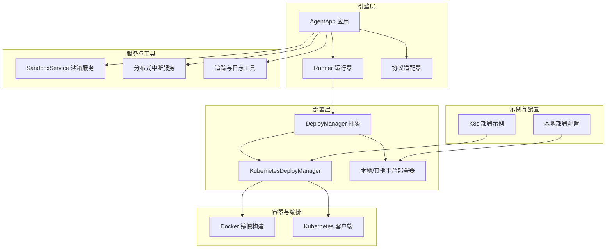
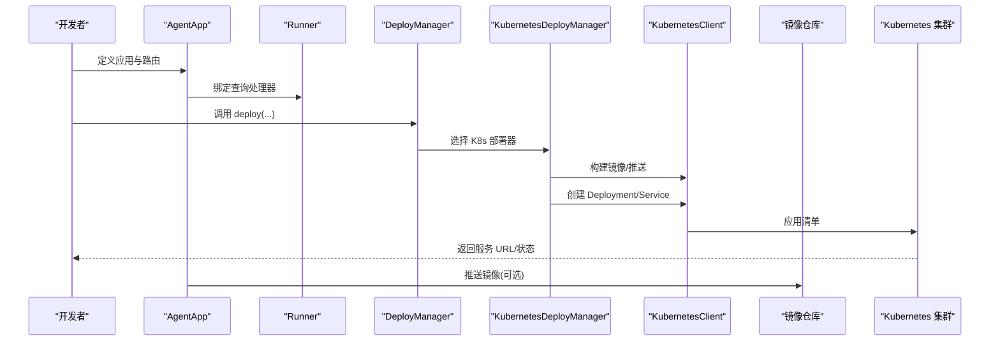
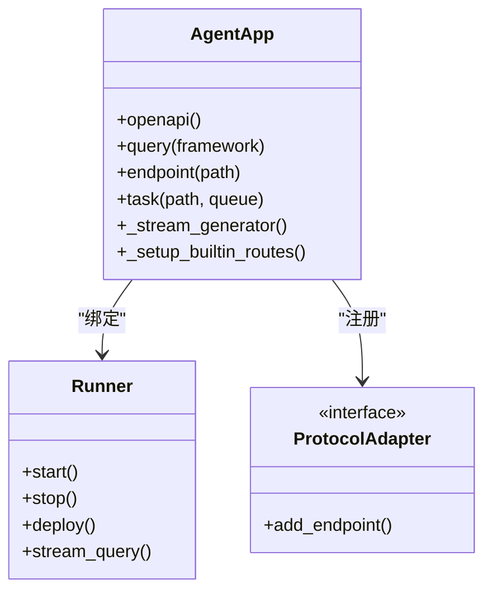
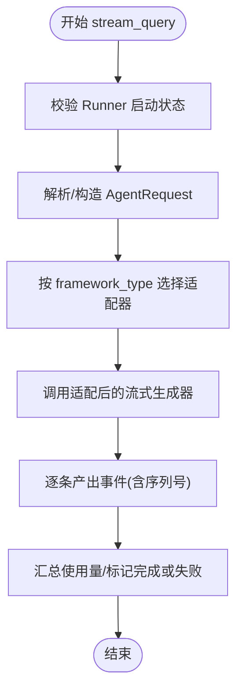
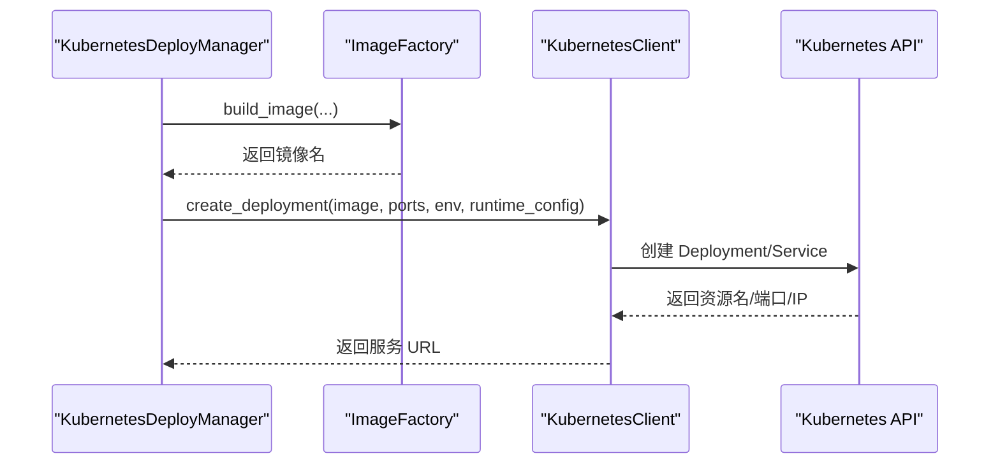
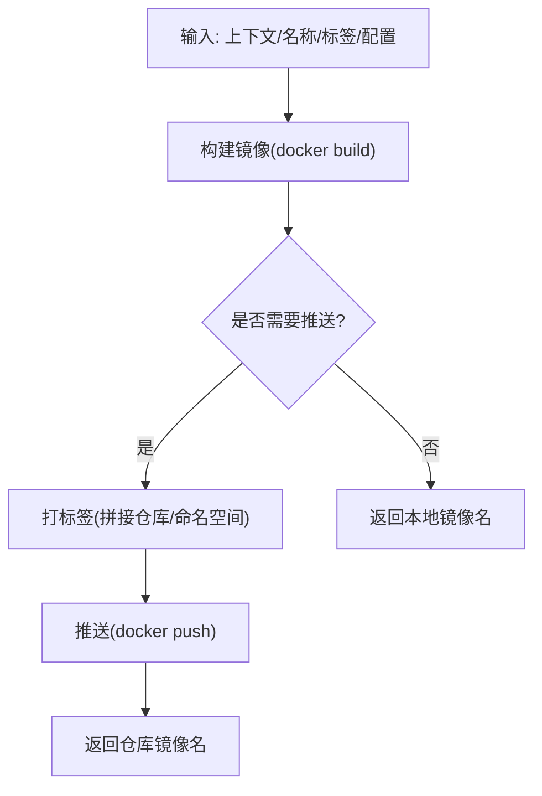
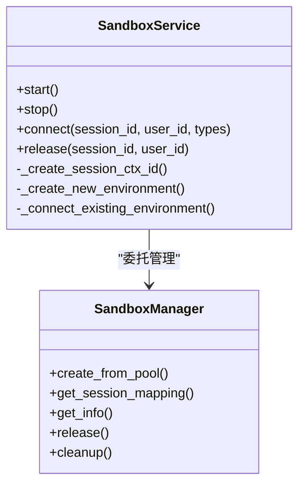
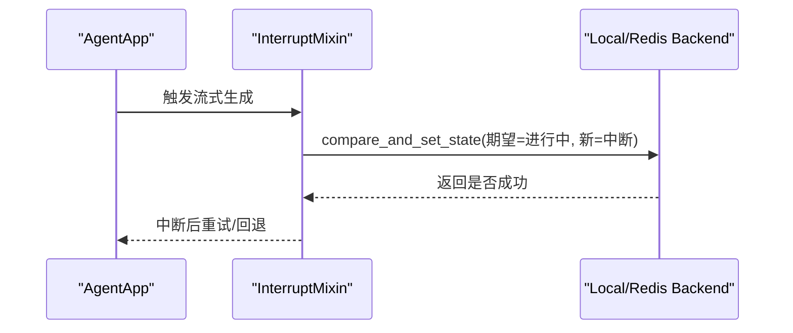
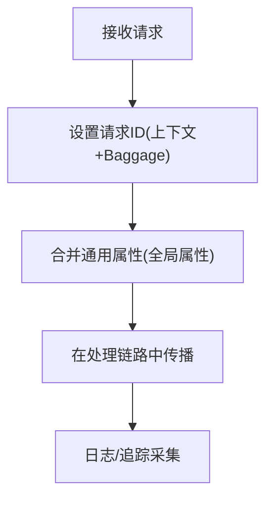
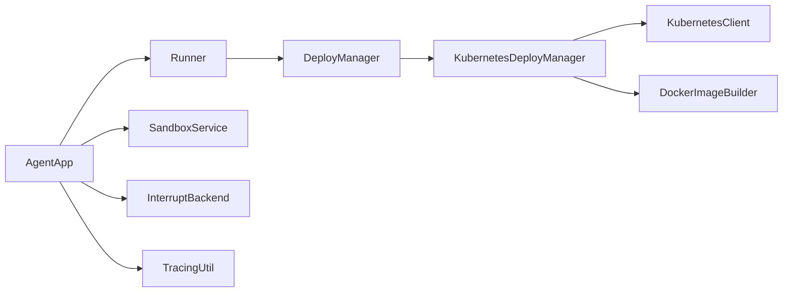

# 微服务架构和容器化

<cite>
**本文档引用的文件**
- [README.md](file://README.md)
- [engine/__init__.py](file://src/agentscope_runtime/engine/__init__.py)
- [engine/app/agent_app.py](file://src/agentscope_runtime/engine/app/agent_app.py)
- [engine/runner.py](file://src/agentscope_runtime/engine/runner.py)
- [engine/deployers/base.py](file://src/agentscope_runtime/engine/deployers/base.py)
- [engine/deployers/kubernetes_deployer.py](file://src/agentscope_runtime/engine/deployers/kubernetes_deployer.py)
- [engine/deployers/utils/docker_image_utils/docker_image_builder.py](file://src/agentscope_runtime/engine/deployers/utils/docker_image_utils/docker_image_builder.py)
- [engine/deployers/utils/k8s_utils.py](file://src/agentscope_runtime/engine/deployers/utils/k8s_utils.py)
- [common/container_clients/kubernetes_client.py](file://src/agentscope_runtime/common/container_clients/kubernetes_client.py)
- [engine/tracing/tracing_util.py](file://src/agentscope_runtime/engine/tracing/tracing_util.py)
- [engine/services/sandbox/sandbox_service.py](file://src/agentscope_runtime/engine/services/sandbox/sandbox_service.py)
- [examples/deployments/k8s_deploy/k8s_deploy_config.yaml](file://examples/deployments/k8s_deploy/k8s_deploy_config.yaml)
- [examples/deployments/k8s_deploy/app_deploy_to_k8s.py](file://examples/deployments/k8s_deploy/app_deploy_to_k8s.py)
- [examples/deployments/local_deploy_config.yaml](file://examples/deployments/local_deploy_config.yaml)
- [engine/deployers/utils/deployment_modes.py](file://src/agentscope_runtime/engine/deployers/utils/deployment_modes.py)
- [engine/deployers/utils/service_utils/interrupt/local_backend.py](file://src/agentscope_runtime/engine/deployers/utils/service_utils/interrupt/local_backend.py)
- [engine/deployers/utils/service_utils/interrupt/redis_backend.py](file://src/agentscope_runtime/engine/deployers/utils/service_utils/interrupt/redis_backend.py)
</cite>

## 目录
1. [简介](#简介)
2. [项目结构](#项目结构)
3. [核心组件](#核心组件)
4. [架构总览](#架构总览)
5. [详细组件分析](#详细组件分析)
6. [依赖关系分析](#依赖关系分析)
7. [性能考虑](#性能考虑)
8. [故障排查指南](#故障排查指南)
9. [结论](#结论)
10. [附录](#附录)

## 简介
本指南面向微服务架构与容器化落地实践，基于 AgentScope Runtime 的工程化能力，系统阐述微服务设计原则、容器镜像构建与推送、Kubernetes 编排与部署、服务拆分与发现、负载均衡、滚动更新、服务间通信、API 网关与安全认证、以及可观测性（监控与日志）与故障排查方案。文档以代码为依据，提供可操作的步骤与可视化图示，帮助读者从概念到实操快速上手。

## 项目结构
项目采用模块化分层组织：引擎层负责应用封装与运行时管理；部署层提供多平台部署器；容器客户端抽象 Kubernetes 等编排平台；服务层提供沙箱等基础设施；示例与配置展示端到端部署流程。

图表来源
- [engine/app/agent_app.py:1-120](file://src/agentscope_runtime/engine/app/agent_app.py#L1-L120)
- [engine/runner.py:120-170](file://src/agentscope_runtime/engine/runner.py#L120-L170)
- [engine/deployers/kubernetes_deployer.py:48-125](file://src/agentscope_runtime/engine/deployers/kubernetes_deployer.py#L48-L125)
- [common/container_clients/kubernetes_client.py:19-54](file://src/agentscope_runtime/common/container_clients/kubernetes_client.py#L19-L54)
- [engine/services/sandbox/sandbox_service.py:11-55](file://src/agentscope_runtime/engine/services/sandbox/sandbox_service.py#L11-L55)
- [examples/deployments/k8s_deploy/app_deploy_to_k8s.py:124-222](file://examples/deployments/k8s_deploy/app_deploy_to_k8s.py#L124-L222)

章节来源
- [README.md:109-140](file://README.md#L109-L140)
- [engine/__init__.py:1-35](file://src/agentscope_runtime/engine/__init__.py#L1-L35)

## 核心组件
- AgentApp：基于 FastAPI 的生产级 Agent 服务封装，内置健康检查、流式响应、任务队列、协议适配与生命周期管理。
- Runner：统一的执行器，负责处理请求、适配不同框架的消息格式、生成事件序列，并支持部署管理器协作。
- DeployManager 抽象：定义统一的部署接口，支持本地、Kubernetes、Serverless 等多种后端。
- KubernetesDeployManager：K8s 部署器，负责镜像构建/推送、Deployment/Service 创建、环境变量与资源限制注入、健康检查与状态查询。
- DockerImageBuilder：镜像构建与推送工具，支持多平台、缓存控制、私有仓库集成。
- KubernetesClient：K8s 原生客户端封装，负责 Pod/Deployment 创建、删除、日志、就绪检查与本地集群识别。
- SandboxService：沙箱生命周期管理，支持连接/释放会话、嵌入式模式与资源回收。
- 分布式中断服务：基于 Redis 或本地内存的中断后端，支持任务状态原子更新与事件发布订阅。
- 追踪工具：上下文传播与属性设置，便于跨服务链路追踪与日志关联。

章节来源
- [engine/app/agent_app.py:60-220](file://src/agentscope_runtime/engine/app/agent_app.py#L60-L220)
- [engine/runner.py:46-120](file://src/agentscope_runtime/engine/runner.py#L46-L120)
- [engine/deployers/base.py:9-44](file://src/agentscope_runtime/engine/deployers/base.py#L9-L44)
- [engine/deployers/kubernetes_deployer.py:48-125](file://src/agentscope_runtime/engine/deployers/kubernetes_deployer.py#L48-L125)
- [engine/deployers/utils/docker_image_utils/docker_image_builder.py:41-120](file://src/agentscope_runtime/engine/deployers/utils/docker_image_utils/docker_image_builder.py#L41-L120)
- [common/container_clients/kubernetes_client.py:19-110](file://src/agentscope_runtime/common/container_clients/kubernetes_client.py#L19-L110)
- [engine/services/sandbox/sandbox_service.py:11-80](file://src/agentscope_runtime/engine/services/sandbox/sandbox_service.py#L11-L80)
- [engine/deployers/utils/service_utils/interrupt/local_backend.py:9-60](file://src/agentscope_runtime/engine/deployers/utils/service_utils/interrupt/local_backend.py#L9-L60)
- [engine/deployers/utils/service_utils/interrupt/redis_backend.py:7-50](file://src/agentscope_runtime/engine/deployers/utils/service_utils/interrupt/redis_backend.py#L7-L50)
- [engine/tracing/tracing_util.py:23-60](file://src/agentscope_runtime/engine/tracing/tracing_util.py#L23-L60)

## 架构总览
下图展示了从应用定义到容器化部署、Kubernetes 编排与服务暴露的完整路径，以及与沙箱、中断与追踪系统的交互。

图表来源
- [engine/app/agent_app.py:780-820](file://src/agentscope_runtime/engine/app/agent_app.py#L780-L820)
- [engine/runner.py:122-170](file://src/agentscope_runtime/engine/runner.py#L122-L170)
- [engine/deployers/kubernetes_deployer.py:126-302](file://src/agentscope_runtime/engine/deployers/kubernetes_deployer.py#L126-L302)
- [common/container_clients/kubernetes_client.py:263-440](file://src/agentscope_runtime/common/container_clients/kubernetes_client.py#L263-L440)

## 详细组件分析

### AgentApp 应用与路由
- 设计要点：继承 FastAPI 并混入统一路由与中断能力，自动注册健康检查、根信息、进程控制等内置端点；支持多协议适配（A2A、Response API、AGUI）。
- 生命周期：通过 lifespan 管理 Runner 初始化、中间件与任务清理；支持嵌入式 Celery 工作线程与流式任务清理。
- 流式输出：统一的 SSE 事件流，支持带中断的流式生成与最终结果收集。

图表来源
- [engine/app/agent_app.py:60-220](file://src/agentscope_runtime/engine/app/agent_app.py#L60-L220)
- [engine/runner.py:46-120](file://src/agentscope_runtime/engine/runner.py#L46-L120)

章节来源
- [engine/app/agent_app.py:248-316](file://src/agentscope_runtime/engine/app/agent_app.py#L248-L316)
- [engine/app/agent_app.py:382-425](file://src/agentscope_runtime/engine/app/agent_app.py#L382-L425)
- [engine/app/agent_app.py:643-703](file://src/agentscope_runtime/engine/app/agent_app.py#L643-L703)

### Runner 执行器与协议适配
- 多框架适配：根据 framework_type 选择对应消息转换与流式适配器，统一事件序列与使用统计。
- 部署协作：通过 deploy_manager 协同完成镜像构建、服务暴露与状态持久化。
- 异常处理：捕获未知异常并转换为标准错误事件，确保流式输出一致性。

图表来源
- [engine/runner.py:199-356](file://src/agentscope_runtime/engine/runner.py#L199-L356)

章节来源
- [engine/runner.py:172-192](file://src/agentscope_runtime/engine/runner.py#L172-L192)
- [engine/runner.py:246-320](file://src/agentscope_runtime/engine/runner.py#L246-L320)

### Kubernetes 部署器与客户端
- 部署流程：镜像构建/推送 → 创建 Deployment/Service → 注入环境变量与资源限制 → 健康检查与状态查询。
- 环境识别：自动判断本地/远程集群，修正服务端点返回逻辑，避免本地 LoadBalancer 不可达问题。
- 资源管理：支持 CPU/内存请求与限制、重启策略、节点选择与容忍、镜像拉取密钥等。

图表来源
- [engine/deployers/kubernetes_deployer.py:126-302](file://src/agentscope_runtime/engine/deployers/kubernetes_deployer.py#L126-L302)
- [common/container_clients/kubernetes_client.py:669-800](file://src/agentscope_runtime/common/container_clients/kubernetes_client.py#L669-L800)

章节来源
- [engine/deployers/kubernetes_deployer.py:72-121](file://src/agentscope_runtime/engine/deployers/kubernetes_deployer.py#L72-L121)
- [engine/deployers/kubernetes_deployer.py:378-391](file://src/agentscope_runtime/engine/deployers/kubernetes_deployer.py#L378-L391)
- [engine/deployers/utils/k8s_utils.py:12-59](file://src/agentscope_runtime/engine/deployers/utils/k8s_utils.py#L12-L59)

### 镜像构建与推送
- 功能：Docker 镜像构建、标签、推送、存在性检查与信息查询；支持平台指定、构建参数与静默模式。
- 集成：与部署器配合，自动推送到私有/公有仓库，支持命名空间与镜像前缀拼接。

图表来源
- [engine/deployers/utils/docker_image_utils/docker_image_builder.py:77-120](file://src/agentscope_runtime/engine/deployers/utils/docker_image_utils/docker_image_builder.py#L77-L120)
- [engine/deployers/utils/docker_image_utils/docker_image_builder.py:241-322](file://src/agentscope_runtime/engine/deployers/utils/docker_image_utils/docker_image_builder.py#L241-L322)

章节来源
- [engine/deployers/utils/docker_image_utils/docker_image_builder.py:14-45](file://src/agentscope_runtime/engine/deployers/utils/docker_image_utils/docker_image_builder.py#L14-L45)

### 沙箱服务与资源管理
- 会话映射：按 session_id/user_id 组合建立会话上下文，复用已有环境或创建新环境。
- 环境类型：支持基础、GUI、浏览器、文件系统、移动端等多种沙箱类型；AgentBay 会话特殊处理。
- 资源回收：停止时可选择释放所有非 AgentBay 环境，避免资源泄漏。

图表来源
- [engine/services/sandbox/sandbox_service.py:11-238](file://src/agentscope_runtime/engine/services/sandbox/sandbox_service.py#L11-L238)

章节来源
- [engine/services/sandbox/sandbox_service.py:82-142](file://src/agentscope_runtime/engine/services/sandbox/sandbox_service.py#L82-L142)
- [engine/services/sandbox/sandbox_service.py:144-200](file://src/agentscope_runtime/engine/services/sandbox/sandbox_service.py#L144-L200)

### 分布式中断服务
- 本地后端：基于 asyncio 锁与内存字典，提供原子状态读写与订阅广播，适合单机/开发场景。
- Redis 后端：基于 Lua 脚本实现 CAS，支持高并发下的状态一致性与事件发布订阅。
- 适用场景：手动中断长任务、预占/抢占、状态持久化与恢复。

图表来源
- [engine/deployers/utils/service_utils/interrupt/local_backend.py:46-90](file://src/agentscope_runtime/engine/deployers/utils/service_utils/interrupt/local_backend.py#L46-L90)
- [engine/deployers/utils/service_utils/interrupt/redis_backend.py:44-90](file://src/agentscope_runtime/engine/deployers/utils/service_utils/interrupt/redis_backend.py#L44-L90)

章节来源
- [engine/app/agent_app.py:222-247](file://src/agentscope_runtime/engine/app/agent_app.py#L222-L247)
- [engine/deployers/utils/service_utils/interrupt/local_backend.py:9-60](file://src/agentscope_runtime/engine/deployers/utils/service_utils/interrupt/local_backend.py#L9-L60)
- [engine/deployers/utils/service_utils/interrupt/redis_backend.py:7-50](file://src/agentscope_runtime/engine/deployers/utils/service_utils/interrupt/redis_backend.py#L7-L50)

### 追踪与日志
- 请求标识：通过上下文变量与 Baggage 设置/获取请求 ID，合并通用属性，便于跨服务追踪。
- 全局属性：从环境变量读取应用环境、工作区等全局属性，统一注入到追踪上下文中。

图表来源
- [engine/tracing/tracing_util.py:23-98](file://src/agentscope_runtime/engine/tracing/tracing_util.py#L23-L98)

章节来源
- [engine/tracing/tracing_util.py:106-136](file://src/agentscope_runtime/engine/tracing/tracing_util.py#L106-L136)

## 依赖关系分析
- 组件耦合：AgentApp 与 Runner 强耦合，通过装饰器绑定查询处理器；Runner 与 DeployManager 解耦，通过接口协作。
- 外部依赖：Kubernetes 客户端依赖 kubernetes 库；Redis 中断后端依赖 redis.asyncio；Docker 构建依赖 docker 命令。
- 可能的循环依赖：当前结构以抽象接口隔离，未见直接循环导入。

图表来源
- [engine/app/agent_app.py:60-220](file://src/agentscope_runtime/engine/app/agent_app.py#L60-L220)
- [engine/runner.py:122-170](file://src/agentscope_runtime/engine/runner.py#L122-L170)
- [engine/deployers/kubernetes_deployer.py:48-125](file://src/agentscope_runtime/engine/deployers/kubernetes_deployer.py#L48-L125)
- [common/container_clients/kubernetes_client.py:19-54](file://src/agentscope_runtime/common/container_clients/kubernetes_client.py#L19-L54)
- [engine/deployers/utils/docker_image_utils/docker_image_builder.py:41-120](file://src/agentscope_runtime/engine/deployers/utils/docker_image_utils/docker_image_builder.py#L41-L120)
- [engine/services/sandbox/sandbox_service.py:11-55](file://src/agentscope_runtime/engine/services/sandbox/sandbox_service.py#L11-L55)
- [engine/deployers/utils/service_utils/interrupt/local_backend.py:9-60](file://src/agentscope_runtime/engine/deployers/utils/service_utils/interrupt/local_backend.py#L9-L60)
- [engine/tracing/tracing_util.py:23-60](file://src/agentscope_runtime/engine/tracing/tracing_util.py#L23-L60)

章节来源
- [engine/deployers/base.py:9-44](file://src/agentscope_runtime/engine/deployers/base.py#L9-L44)

## 性能考虑
- 流式输出：SSE 流式传输减少延迟，建议在长对话与工具调用中保持流式以提升用户体验。
- 资源限制：合理设置 CPU/内存 requests/limits，避免节点驱逐与 OOM；本地/远程集群差异由环境检测自动适配。
- 镜像构建：启用构建缓存与平台指定，减少重复构建时间；私有仓库镜像拉取策略按需调整。
- 中断与任务：使用 Redis 后端保证多实例下状态一致性；定期清理过期任务，避免内存膨胀。
- 日志与追踪：集中化日志与追踪，避免在热路径产生过多 IO；请求 ID 串联全链路。

## 故障排查指南
- 部署失败
  - 检查镜像构建命令与输出，确认 Docker 可用且上下文路径正确。
  - 查看 K8s 客户端初始化与连接状态，核对 kubeconfig/集群权限。
  - 使用 get_status 获取部署状态，结合 Pod 日志定位问题。
- 服务不可达
  - 在本地集群环境下，服务端点可能被修正为 127.0.0.1；使用 kubectl 检查 Service/NodePort。
  - 确认健康检查端点 /health 正常返回。
- 中断无效
  - 校验中断后端配置（本地/Redis），确保 CAS 条件满足；检查订阅通道是否正常。
- 沙箱资源泄漏
  - 停止服务时启用 drain_on_stop，确保释放非 AgentBay 环境；必要时手动清理会话映射。

章节来源
- [engine/deployers/kubernetes_deployer.py:313-376](file://src/agentscope_runtime/engine/deployers/kubernetes_deployer.py#L313-L376)
- [common/container_clients/kubernetes_client.py:342-440](file://src/agentscope_runtime/common/container_clients/kubernetes_client.py#L342-L440)
- [engine/deployers/utils/k8s_utils.py:12-59](file://src/agentscope_runtime/engine/deployers/utils/k8s_utils.py#L12-L59)
- [engine/services/sandbox/sandbox_service.py:56-80](file://src/agentscope_runtime/engine/services/sandbox/sandbox_service.py#L56-L80)

## 结论
本指南基于 AgentScope Runtime 的工程化能力，提供了从应用定义、容器镜像构建、Kubernetes 编排到服务治理与可观测性的完整实践路径。通过模块化设计与抽象接口，项目实现了良好的扩展性与可维护性；借助流式输出、分布式中断与追踪工具，能够支撑生产级的 Agent 服务交付与运维。

## 附录

### 微服务设计原则与实现要点
- 单一职责：每个服务聚焦特定业务域，通过事件与 API 协作。
- 无状态与可伸缩：利用 Kubernetes 的副本与水平扩展，结合会话状态外部化。
- 服务发现与负载均衡：通过 Service/Ingress 实现服务发现与流量分发。
- 配置即代码：使用 YAML/JSON 配置文件管理部署参数与环境变量。
- 安全与认证：结合 Ingress TLS、RBAC、镜像仓库鉴权与 API 访问令牌。

### 容器镜像构建与推送步骤
- 准备构建上下文与 Dockerfile 模板（可选）。
- 配置 RegistryConfig（仓库地址、命名空间、凭据）。
- 调用镜像构建与推送流程，返回仓库镜像名用于部署。

章节来源
- [engine/deployers/utils/docker_image_utils/docker_image_builder.py:77-120](file://src/agentscope_runtime/engine/deployers/utils/docker_image_utils/docker_image_builder.py#L77-L120)
- [engine/deployers/utils/docker_image_utils/docker_image_builder.py:241-322](file://src/agentscope_runtime/engine/deployers/utils/docker_image_utils/docker_image_builder.py#L241-L322)

### Kubernetes 部署与滚动更新
- 使用 Deployment 管理副本与滚动更新策略（如 MaxUnavailable/MaxSurge）。
- 通过探针（liveness/readiness）保障健康检查与就绪状态。
- 利用环境变量与 ConfigMap/Secret 注入配置与密钥。

章节来源
- [examples/deployments/k8s_deploy/k8s_deploy_config.yaml:1-53](file://examples/deployments/k8s_deploy/k8s_deploy_config.yaml#L1-L53)
- [examples/deployments/k8s_deploy/app_deploy_to_k8s.py:124-222](file://examples/deployments/k8s_deploy/app_deploy_to_k8s.py#L124-L222)

### 服务间通信、API 网关与安全认证
- 服务间通信：通过统一的协议适配器（A2A、Response API、AGUI）与事件流实现。
- API 网关：使用 Ingress/Nginx/ALB 暴露服务，配置 TLS 与限流。
- 安全认证：结合 RBAC、镜像仓库访问控制、Bearer Token 与 API Key 管理。

章节来源
- [engine/app/agent_app.py:340-357](file://src/agentscope_runtime/engine/app/agent_app.py#L340-L357)
- [engine/deployers/kubernetes_deployer.py:72-121](file://src/agentscope_runtime/engine/deployers/kubernetes_deployer.py#L72-L121)

### 监控、日志聚合与故障排查
- 监控：Prometheus/Grafana 收集指标，结合服务端点与容器指标。
- 日志：集中式日志（如 ELK/Fluentd）采集容器日志，结合请求 ID 关联链路。
- 故障排查：使用 kubectl describe/logs、get_status、环境检测函数定位问题。

章节来源
- [common/container_clients/kubernetes_client.py:486-510](file://src/agentscope_runtime/common/container_clients/kubernetes_client.py#L486-L510)
- [engine/deployers/utils/k8s_utils.py:12-59](file://src/agentscope_runtime/engine/deployers/utils/k8s_utils.py#L12-L59)
- [engine/tracing/tracing_util.py:23-98](file://src/agentscope_runtime/engine/tracing/tracing_util.py#L23-L98)