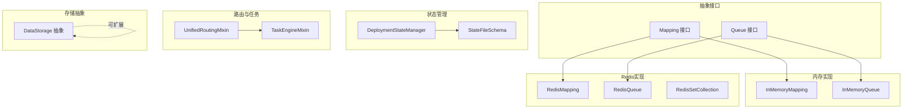
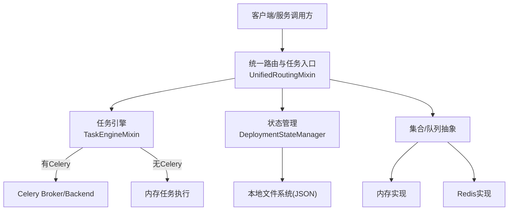
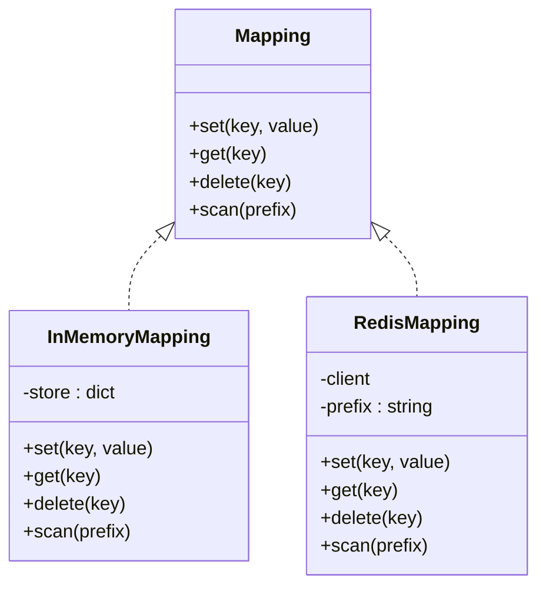
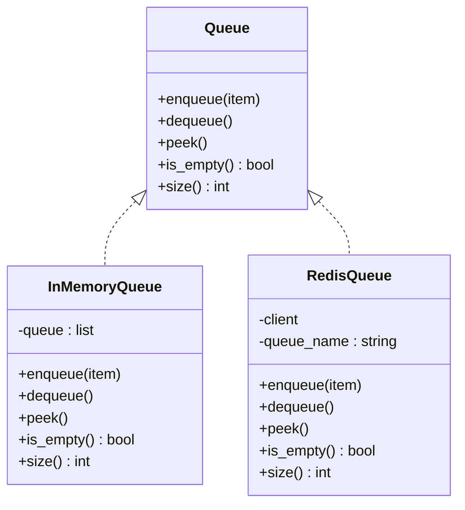
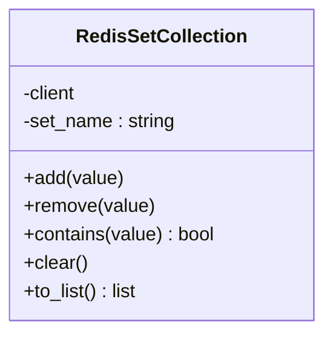
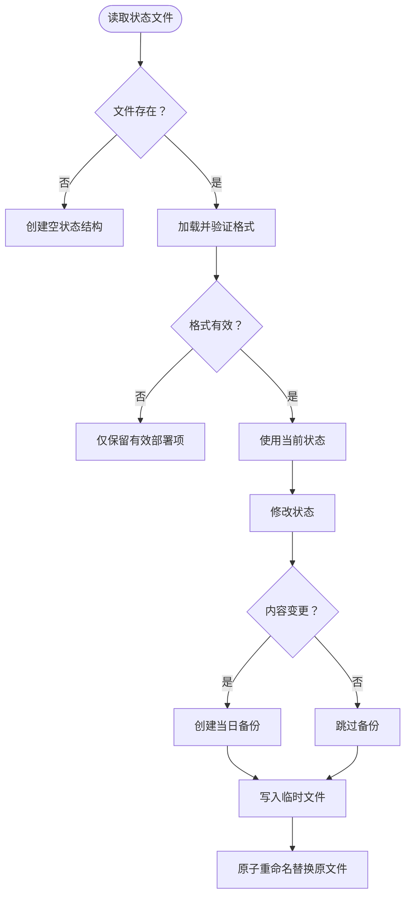
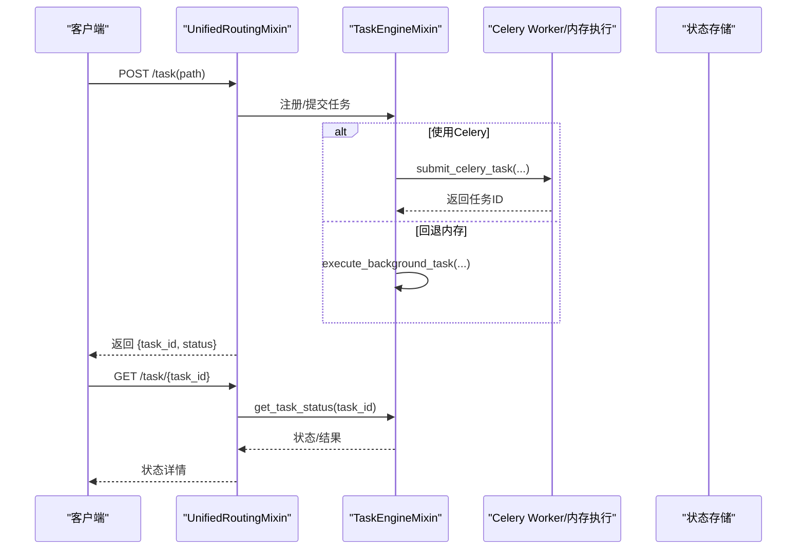
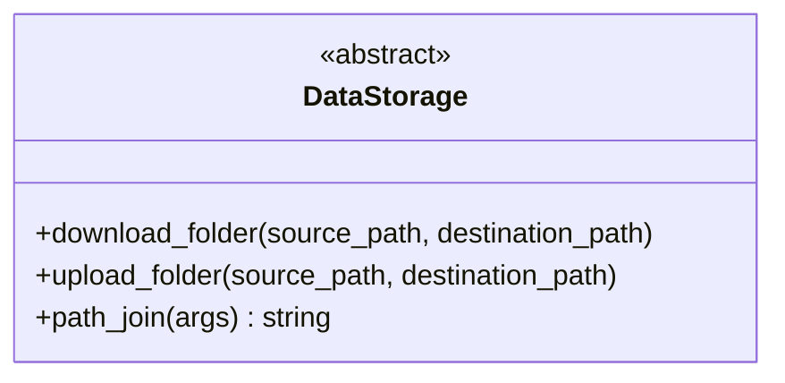
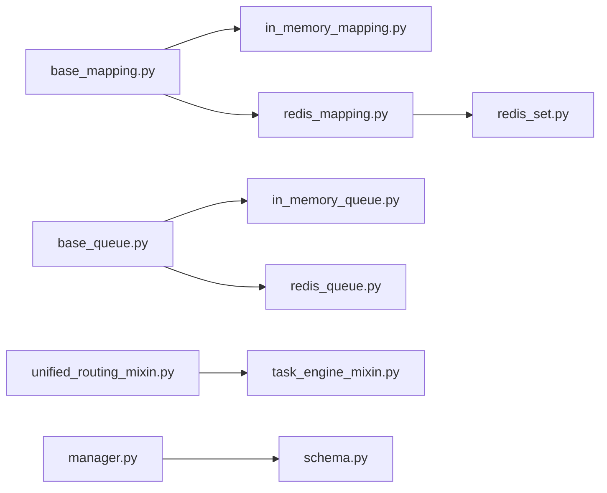

# 数据库和消息队列集成

<cite>
**本文引用的文件**
- [base_mapping.py](file://src/agentscope_runtime/common/collections/base_mapping.py)
- [base_queue.py](file://src/agentscope_runtime/common/collections/base_queue.py)
- [redis_mapping.py](file://src/agentscope_runtime/common/collections/redis_mapping.py)
- [redis_queue.py](file://src/agentscope_runtime/common/collections/redis_queue.py)
- [redis_set.py](file://src/agentscope_runtime/common/collections/redis_set.py)
- [in_memory_mapping.py](file://src/agentscope_runtime/common/collections/in_memory_mapping.py)
- [in_memory_queue.py](file://src/agentscope_runtime/common/collections/in_memory_queue.py)
- [manager.py](file://src/agentscope_runtime/engine/deployers/state/manager.py)
- [schema.py](file://src/agentscope_runtime/engine/deployers/state/schema.py)
- [task_engine_mixin.py](file://src/agentscope_runtime/engine/deployers/utils/service_utils/routing/task_engine_mixin.py)
- [unified_routing_mixin.py](file://src/agentscope_runtime/engine/deployers/utils/service_utils/routing/unified_routing_mixin.py)
- [data_storage.py](file://src/agentscope_runtime/sandbox/manager/storage/data_storage.py)
</cite>

## 目录
1. [引言](#引言)
2. [项目结构](#项目结构)
3. [核心组件](#核心组件)
4. [架构总览](#架构总览)
5. [详细组件分析](#详细组件分析)
6. [依赖分析](#依赖分析)
7. [性能考虑](#性能考虑)
8. [故障排查指南](#故障排查指南)
9. [结论](#结论)
10. [附录：配置模板与示例路径](#附录配置模板与示例路径)

## 引言
本指南聚焦于Agentscope Runtime中的数据库与消息队列集成，覆盖以下主题：
- 关系型数据库与NoSQL数据库的连接与操作思路（以抽象接口与适配器模式组织）
- Redis缓存、消息队列中间件的集成配置与使用
- 数据持久化、会话管理、状态同步的实现方案
- 分布式锁、任务执行与状态查询、超时控制等关键技术
- 连接池配置、性能优化、故障恢复的最佳实践
- 提供可直接参考的代码示例路径与配置模板

## 项目结构
该项目采用“抽象接口 + 多实现”的分层设计：
- 抽象层：定义通用的数据结构与操作接口（映射、队列、集合）
- 实现层：提供内存实现与Redis实现，便于在不同环境中切换
- 状态管理：部署状态的本地文件持久化与备份策略
- 路由与任务引擎：基于Celery的任务编排与回退到内存的任务执行
- 存储抽象：统一的远程存储接口，便于扩展对象存储或云存储

图表来源
- [base_mapping.py:1-21](file://src/agentscope_runtime/common/collections/base_mapping.py#L1-L21)
- [base_queue.py:1-26](file://src/agentscope_runtime/common/collections/base_queue.py#L1-L26)
- [in_memory_mapping.py:1-28](file://src/agentscope_runtime/common/collections/in_memory_mapping.py#L1-L28)
- [in_memory_queue.py:1-29](file://src/agentscope_runtime/common/collections/in_memory_queue.py#L1-L29)
- [redis_mapping.py:1-49](file://src/agentscope_runtime/common/collections/redis_mapping.py#L1-L49)
- [redis_queue.py:1-28](file://src/agentscope_runtime/common/collections/redis_queue.py#L1-L28)
- [redis_set.py:1-24](file://src/agentscope_runtime/common/collections/redis_set.py#L1-L24)
- [manager.py:1-389](file://src/agentscope_runtime/engine/deployers/state/manager.py#L1-L389)
- [schema.py:1-97](file://src/agentscope_runtime/engine/deployers/state/schema.py#L1-L97)
- [unified_routing_mixin.py:1-253](file://src/agentscope_runtime/engine/deployers/utils/service_utils/routing/unified_routing_mixin.py#L1-L253)
- [task_engine_mixin.py:1-391](file://src/agentscope_runtime/engine/deployers/utils/service_utils/routing/task_engine_mixin.py#L1-L391)
- [data_storage.py:1-17](file://src/agentscope_runtime/sandbox/manager/storage/data_storage.py#L1-L17)

章节来源
- [base_mapping.py:1-21](file://src/agentscope_runtime/common/collections/base_mapping.py#L1-L21)
- [base_queue.py:1-26](file://src/agentscope_runtime/common/collections/base_queue.py#L1-L26)
- [in_memory_mapping.py:1-28](file://src/agentscope_runtime/common/collections/in_memory_mapping.py#L1-L28)
- [in_memory_queue.py:1-29](file://src/agentscope_runtime/common/collections/in_memory_queue.py#L1-L29)
- [redis_mapping.py:1-49](file://src/agentscope_runtime/common/collections/redis_mapping.py#L1-L49)
- [redis_queue.py:1-28](file://src/agentscope_runtime/common/collections/redis_queue.py#L1-L28)
- [redis_set.py:1-24](file://src/agentscope_runtime/common/collections/redis_set.py#L1-L24)
- [manager.py:1-389](file://src/agentscope_runtime/engine/deployers/state/manager.py#L1-L389)
- [schema.py:1-97](file://src/agentscope_runtime/engine/deployers/state/schema.py#L1-L97)
- [unified_routing_mixin.py:1-253](file://src/agentscope_runtime/engine/deployers/utils/service_utils/routing/unified_routing_mixin.py#L1-L253)
- [task_engine_mixin.py:1-391](file://src/agentscope_runtime/engine/deployers/utils/service_utils/routing/task_engine_mixin.py#L1-L391)
- [data_storage.py:1-17](file://src/agentscope_runtime/sandbox/manager/storage/data_storage.py#L1-L17)

## 核心组件
- 映射集合（键值）：抽象接口定义set/get/delete/scan；内存与Redis分别实现，支持前缀扫描与JSON序列化
- 队列集合：抽象接口定义enqueue/dequeue/peek/is_empty/size；内存与Redis实现，支持JSON序列化与列表操作
- 集合（Redis Set）：add/remove/contains/clear/to_list，适合去重与成员检测
- 部署状态管理：本地JSON文件持久化，带版本校验、迁移、原子写入、每日备份与30天清理
- 路由与任务引擎：基于Celery的任务注册、提交、状态查询；无Celery时回退到内存任务执行与并发锁
- 存储抽象：统一的远程存储接口，便于扩展对象存储或云存储

章节来源
- [base_mapping.py:1-21](file://src/agentscope_runtime/common/collections/base_mapping.py#L1-L21)
- [base_queue.py:1-26](file://src/agentscope_runtime/common/collections/base_queue.py#L1-L26)
- [in_memory_mapping.py:1-28](file://src/agentscope_runtime/common/collections/in_memory_mapping.py#L1-L28)
- [in_memory_queue.py:1-29](file://src/agentscope_runtime/common/collections/in_memory_queue.py#L1-L29)
- [redis_mapping.py:1-49](file://src/agentscope_runtime/common/collections/redis_mapping.py#L1-L49)
- [redis_queue.py:1-28](file://src/agentscope_runtime/common/collections/redis_queue.py#L1-L28)
- [redis_set.py:1-24](file://src/agentscope_runtime/common/collections/redis_set.py#L1-L24)
- [manager.py:1-389](file://src/agentscope_runtime/engine/deployers/state/manager.py#L1-L389)
- [schema.py:1-97](file://src/agentscope_runtime/engine/deployers/state/schema.py#L1-L97)
- [unified_routing_mixin.py:1-253](file://src/agentscope_runtime/engine/deployers/utils/service_utils/routing/unified_routing_mixin.py#L1-L253)
- [task_engine_mixin.py:1-391](file://src/agentscope_runtime/engine/deployers/utils/service_utils/routing/task_engine_mixin.py#L1-L391)
- [data_storage.py:1-17](file://src/agentscope_runtime/sandbox/manager/storage/data_storage.py#L1-L17)

## 架构总览
系统通过抽象接口屏蔽具体实现差异，支持在开发环境使用内存实现，在生产环境接入Redis与Celery。

图表来源
- [unified_routing_mixin.py:16-101](file://src/agentscope_runtime/engine/deployers/utils/service_utils/routing/unified_routing_mixin.py#L16-L101)
- [task_engine_mixin.py:13-160](file://src/agentscope_runtime/engine/deployers/utils/service_utils/routing/task_engine_mixin.py#L13-L160)
- [manager.py:17-389](file://src/agentscope_runtime/engine/deployers/state/manager.py#L17-L389)
- [in_memory_mapping.py:7-28](file://src/agentscope_runtime/common/collections/in_memory_mapping.py#L7-L28)
- [redis_mapping.py:9-49](file://src/agentscope_runtime/common/collections/redis_mapping.py#L9-L49)
- [in_memory_queue.py:6-29](file://src/agentscope_runtime/common/collections/in_memory_queue.py#L6-L29)
- [redis_queue.py:7-28](file://src/agentscope_runtime/common/collections/redis_queue.py#L7-L28)

## 详细组件分析

### 组件一：映射集合（键值对）
- 抽象接口：定义set/get/delete/scan
- 内存实现：字典存储，scan支持前缀过滤
- Redis实现：键名加前缀，值进行JSON序列化；scan使用游标遍历匹配键

图表来源
- [base_mapping.py:5-21](file://src/agentscope_runtime/common/collections/base_mapping.py#L5-L21)
- [in_memory_mapping.py:7-28](file://src/agentscope_runtime/common/collections/in_memory_mapping.py#L7-L28)
- [redis_mapping.py:9-49](file://src/agentscope_runtime/common/collections/redis_mapping.py#L9-L49)

章节来源
- [base_mapping.py:1-21](file://src/agentscope_runtime/common/collections/base_mapping.py#L1-L21)
- [in_memory_mapping.py:1-28](file://src/agentscope_runtime/common/collections/in_memory_mapping.py#L1-L28)
- [redis_mapping.py:1-49](file://src/agentscope_runtime/common/collections/redis_mapping.py#L1-L49)

### 组件二：队列集合（先进先出）
- 抽象接口：enqueue/dequeue/peek/is_empty/size
- 内存实现：列表实现FIFO
- Redis实现：使用列表结构，lpush/lpop/lindex/llen，值JSON序列化

图表来源
- [base_queue.py:6-26](file://src/agentscope_runtime/common/collections/base_queue.py#L6-L26)
- [in_memory_queue.py:6-29](file://src/agentscope_runtime/common/collections/in_memory_queue.py#L6-L29)
- [redis_queue.py:7-28](file://src/agentscope_runtime/common/collections/redis_queue.py#L7-L28)

章节来源
- [base_queue.py:1-26](file://src/agentscope_runtime/common/collections/base_queue.py#L1-L26)
- [in_memory_queue.py:1-29](file://src/agentscope_runtime/common/collections/in_memory_queue.py#L1-L29)
- [redis_queue.py:1-28](file://src/agentscope_runtime/common/collections/redis_queue.py#L1-L28)

### 组件三：集合（Redis Set）
- 支持add/remove/contains/clear/to_list
- 适用于去重、成员检测、集合运算场景

图表来源
- [redis_set.py:5-24](file://src/agentscope_runtime/common/collections/redis_set.py#L5-L24)

章节来源
- [redis_set.py:1-24](file://src/agentscope_runtime/common/collections/redis_set.py#L1-L24)

### 组件四：部署状态管理（持久化与备份）
- 本地JSON文件存储，带版本校验与迁移
- 原子写入：临时文件+重命名
- 每日备份：保留最近30天
- 安全写入：防止空状态覆盖非空状态

图表来源
- [manager.py:89-231](file://src/agentscope_runtime/engine/deployers/state/manager.py#L89-L231)
- [schema.py:37-81](file://src/agentscope_runtime/engine/deployers/state/schema.py#L37-L81)

章节来源
- [manager.py:1-389](file://src/agentscope_runtime/engine/deployers/state/manager.py#L1-L389)
- [schema.py:1-97](file://src/agentscope_runtime/engine/deployers/state/schema.py#L1-L97)

### 组件五：路由与任务引擎（消息队列与任务执行）
- 初始化：可选Celery Broker/Backend；未配置则回退到内存任务执行
- 注册任务：支持同步/异步/生成器函数，自动包装为Celery任务
- 执行：支持嵌入式Worker线程；支持并发锁与任务状态跟踪
- 查询：Celery结果或内存任务状态

图表来源
- [unified_routing_mixin.py:25-99](file://src/agentscope_runtime/engine/deployers/utils/service_utils/routing/unified_routing_mixin.py#L25-L99)
- [task_engine_mixin.py:65-160](file://src/agentscope_runtime/engine/deployers/utils/service_utils/routing/task_engine_mixin.py#L65-L160)
- [task_engine_mixin.py:349-391](file://src/agentscope_runtime/engine/deployers/utils/service_utils/routing/task_engine_mixin.py#L349-L391)

章节来源
- [unified_routing_mixin.py:1-253](file://src/agentscope_runtime/engine/deployers/utils/service_utils/routing/unified_routing_mixin.py#L1-L253)
- [task_engine_mixin.py:1-391](file://src/agentscope_runtime/engine/deployers/utils/service_utils/routing/task_engine_mixin.py#L1-L391)

### 组件六：存储抽象（远程存储）
- DataStorage抽象定义下载/上传/路径拼接接口
- 可扩展至对象存储或云存储实现

图表来源
- [data_storage.py:5-17](file://src/agentscope_runtime/sandbox/manager/storage/data_storage.py#L5-L17)

章节来源
- [data_storage.py:1-17](file://src/agentscope_runtime/sandbox/manager/storage/data_storage.py#L1-L17)

## 依赖分析
- 组件内聚性：抽象接口与实现分离，低耦合高内聚
- 外部依赖：Redis客户端、Celery（可选）、FastAPI（路由装饰器）
- 循环依赖：未见循环导入；路由与任务引擎通过继承组合
- 风险点：状态文件损坏时的安全读写与备份策略

图表来源
- [base_mapping.py:1-21](file://src/agentscope_runtime/common/collections/base_mapping.py#L1-L21)
- [in_memory_mapping.py:1-28](file://src/agentscope_runtime/common/collections/in_memory_mapping.py#L1-L28)
- [redis_mapping.py:1-49](file://src/agentscope_runtime/common/collections/redis_mapping.py#L1-L49)
- [base_queue.py:1-26](file://src/agentscope_runtime/common/collections/base_queue.py#L1-L26)
- [in_memory_queue.py:1-29](file://src/agentscope_runtime/common/collections/in_memory_queue.py#L1-L29)
- [redis_queue.py:1-28](file://src/agentscope_runtime/common/collections/redis_queue.py#L1-L28)
- [redis_set.py:1-24](file://src/agentscope_runtime/common/collections/redis_set.py#L1-L24)
- [unified_routing_mixin.py:1-253](file://src/agentscope_runtime/engine/deployers/utils/service_utils/routing/unified_routing_mixin.py#L1-L253)
- [task_engine_mixin.py:1-391](file://src/agentscope_runtime/engine/deployers/utils/service_utils/routing/task_engine_mixin.py#L1-L391)
- [manager.py:1-389](file://src/agentscope_runtime/engine/deployers/state/manager.py#L1-L389)
- [schema.py:1-97](file://src/agentscope_runtime/engine/deployers/state/schema.py#L1-L97)

## 性能考虑
- Redis序列化：键值均进行JSON序列化，注意字段类型与编码一致性
- 扫描与遍历：Redis scan使用游标，避免阻塞；建议配合前缀与限流
- 队列操作：Redis列表操作O(1)，批量消费时注意网络往返开销
- 状态文件：原子写入减少竞态；仅在内容变化时备份，降低IO
- Celery：按队列隔离任务；并发度与队列数需结合资源评估
- 内存任务：长耗时任务应避免阻塞事件循环；必要时使用线程池执行器

## 故障排查指南
- 状态文件损坏
  - 现象：读取失败，提示格式错误
  - 处理：自动回退为空状态；检查备份文件；修复后导入
  - 参考路径：[manager.py:137-144](file://src/agentscope_runtime/engine/deployers/state/manager.py#L137-L144)
- 写入安全保护
  - 现象：尝试写空状态但原文件非空
  - 处理：阻止写入以避免数据丢失；确认业务逻辑
  - 参考路径：[manager.py:163-182](file://src/agentscope_runtime/engine/deployers/state/manager.py#L163-L182)
- Celery初始化失败
  - 现象：日志警告或错误
  - 处理：检查Broker/Backend URL；确认依赖安装；回退到内存模式
  - 参考路径：[task_engine_mixin.py:25-46](file://src/agentscope_runtime/engine/deployers/utils/service_utils/routing/task_engine_mixin.py#L25-L46)
- 任务超时
  - 现象：流式任务超时返回
  - 处理：调整超时时间；优化流式处理逻辑
  - 参考路径：[task_engine_mixin.py:298-335](file://src/agentscope_runtime/engine/deployers/utils/service_utils/routing/task_engine_mixin.py#L298-L335)
- 任务状态查询
  - 现象：Celery结果不可用或异常
  - 处理：回退到内存任务状态；检查任务ID有效性
  - 参考路径：[task_engine_mixin.py:349-391](file://src/agentscope_runtime/engine/deployers/utils/service_utils/routing/task_engine_mixin.py#L349-L391)

章节来源
- [manager.py:137-182](file://src/agentscope_runtime/engine/deployers/state/manager.py#L137-L182)
- [task_engine_mixin.py:25-46](file://src/agentscope_runtime/engine/deployers/utils/service_utils/routing/task_engine_mixin.py#L25-L46)
- [task_engine_mixin.py:298-335](file://src/agentscope_runtime/engine/deployers/utils/service_utils/routing/task_engine_mixin.py#L298-L335)
- [task_engine_mixin.py:349-391](file://src/agentscope_runtime/engine/deployers/utils/service_utils/routing/task_engine_mixin.py#L349-L391)

## 结论
本项目通过抽象接口与多实现策略，提供了数据库与消息队列的灵活集成方案：
- 在开发与测试环境优先使用内存实现，快速迭代
- 在生产环境接入Redis与Celery，实现高性能、可扩展的状态与任务管理
- 通过状态文件的原子写入与备份机制，确保数据可靠性
- 通过并发锁与超时控制，保障任务执行的稳定性

## 附录：配置模板与示例路径
- Redis连接配置（用于映射/队列/集合）
  - 示例路径：[redis_mapping.py:10-12](file://src/agentscope_runtime/common/collections/redis_mapping.py#L10-L12)、[redis_queue.py:8-10](file://src/agentscope_runtime/common/collections/redis_queue.py#L8-L10)
- Celery任务引擎配置
  - 示例路径：[task_engine_mixin.py:14-46](file://src/agentscope_runtime/engine/deployers/utils/service_utils/routing/task_engine_mixin.py#L14-L46)
- 部署状态文件位置与备份
  - 示例路径：[manager.py:20-34](file://src/agentscope_runtime/engine/deployers/state/manager.py#L20-L34)、[manager.py:45-54](file://src/agentscope_runtime/engine/deployers/state/manager.py#L45-L54)
- 路由与任务注册
  - 示例路径：[unified_routing_mixin.py:25-99](file://src/agentscope_runtime/engine/deployers/utils/service_utils/routing/unified_routing_mixin.py#L25-L99)
- 存储抽象扩展
  - 示例路径：[data_storage.py:5-17](file://src/agentscope_runtime/sandbox/manager/storage/data_storage.py#L5-L17)