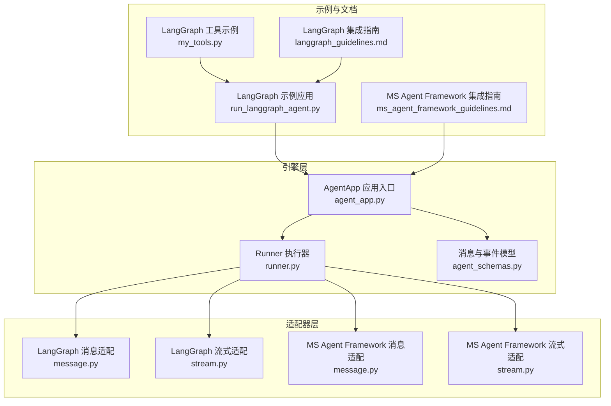
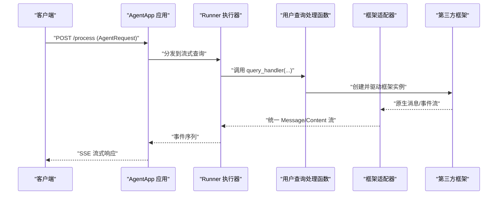
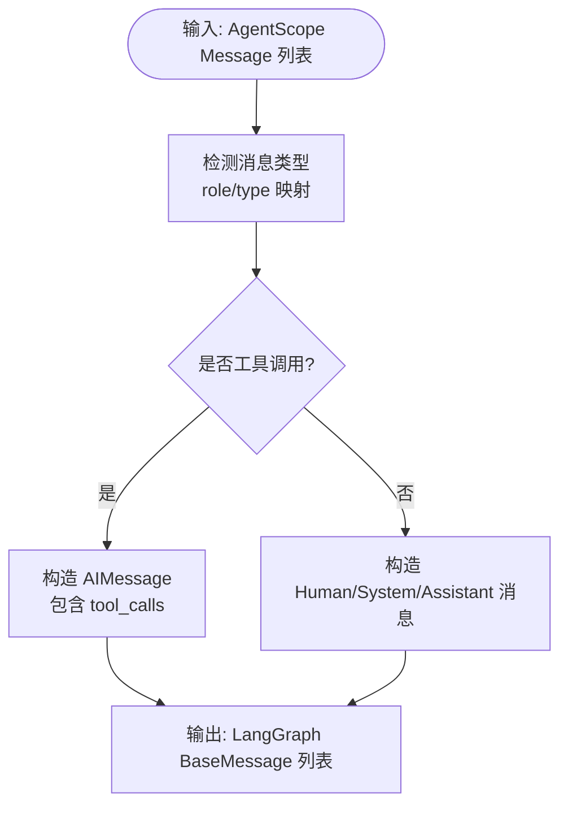
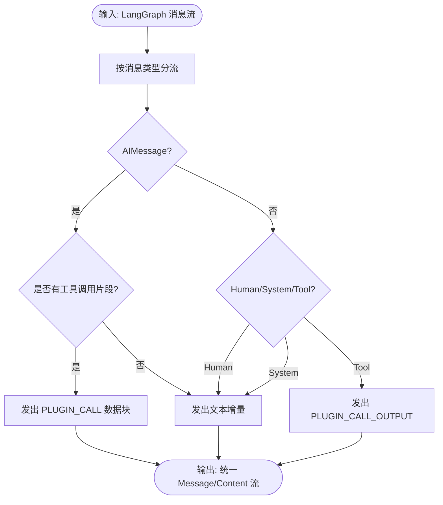
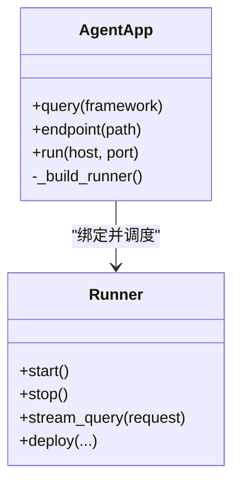
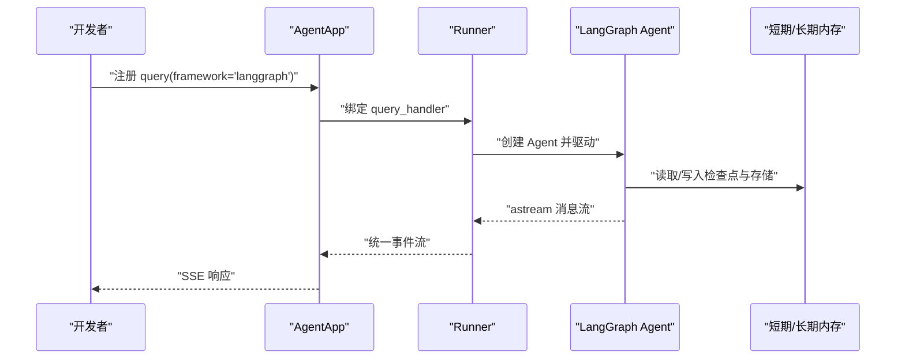
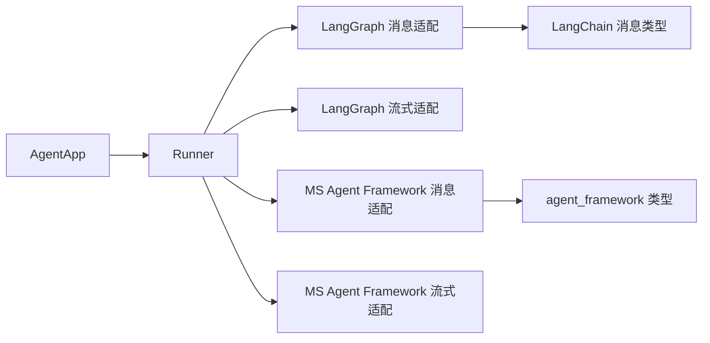

# 第三方框架集成

<cite>
**本文引用的文件**
- [src/agentscope_runtime/adapters/langgraph/__init__.py](file://src/agentscope_runtime/adapters/langgraph/__init__.py)
- [src/agentscope_runtime/adapters/langgraph/message.py](file://src/agentscope_runtime/adapters/langgraph/message.py)
- [src/agentscope_runtime/adapters/langgraph/stream.py](file://src/agentscope_runtime/adapters/langgraph/stream.py)
- [src/agentscope_runtime/adapters/ms_agent_framework/__init__.py](file://src/agentscope_runtime/adapters/ms_agent_framework/__init__.py)
- [src/agentscope_runtime/adapters/ms_agent_framework/message.py](file://src/agentscope_runtime/adapters/ms_agent_framework/message.py)
- [src/agentscope_runtime/adapters/ms_agent_framework/stream.py](file://src/agentscope_runtime/adapters/ms_agent_framework/stream.py)
- [src/agentscope_runtime/engine/app/agent_app.py](file://src/agentscope_runtime/engine/app/agent_app.py)
- [src/agentscope_runtime/engine/runner.py](file://src/agentscope_runtime/engine/runner.py)
- [src/agentscope_runtime/engine/schemas/agent_schemas.py](file://src/agentscope_runtime/engine/schemas/agent_schemas.py)
- [examples/integrations/langgraph/run_langgraph_agent.py](file://examples/integrations/langgraph/run_langgraph_agent.py)
- [examples/integrations/langgraph/my_tools.py](file://examples/integrations/langgraph/my_tools.py)
- [cookbook/zh/langgraph_guidelines.md](file://cookbook/zh/langgraph_guidelines.md)
- [cookbook/zh/ms_agent_framework_guidelines.md](file://cookbook/zh/ms_agent_framework_guidelines.md)
</cite>

## 目录
1. [简介](#简介)
2. [项目结构](#项目结构)
3. [核心组件](#核心组件)
4. [架构总览](#架构总览)
5. [详细组件分析](#详细组件分析)
6. [依赖分析](#依赖分析)
7. [性能考虑](#性能考虑)
8. [故障排除指南](#故障排除指南)
9. [结论](#结论)
10. [附录](#附录)

## 简介
本指南面向需要在 AgentScope Runtime 中集成第三方智能体框架（如 LangGraph、Microsoft Agent Framework 等）的开发者，系统讲解框架适配器的工作原理、配置方式与最佳实践。内容涵盖：
- 适配器消息与流式输出转换机制
- AgentApp 初始化与查询处理函数注册
- 工具函数定义与集成要点
- 内存管理、状态持久化与流式响应的关键实现
- 不同框架间的差异与迁移注意事项
- 调试与故障排除方法

## 项目结构
围绕第三方框架集成的相关模块主要分布在以下位置：
- 适配器层：langgraph、ms_agent_framework 等子目录，负责消息格式转换与流式输出适配
- 引擎层：AgentApp 应用入口、Runner 执行器、协议适配器与路由
- 示例与文档：examples/integrations 下的 LangGraph 示例与 cookbook 中的集成指南



图表来源
- [src/agentscope_runtime/adapters/langgraph/message.py:23-163](file://src/agentscope_runtime/adapters/langgraph/message.py#L23-L163)
- [src/agentscope_runtime/adapters/langgraph/stream.py:28-257](file://src/agentscope_runtime/adapters/langgraph/stream.py#L28-L257)
- [src/agentscope_runtime/adapters/ms_agent_framework/message.py:23-216](file://src/agentscope_runtime/adapters/ms_agent_framework/message.py#L23-L216)
- [src/agentscope_runtime/adapters/ms_agent_framework/stream.py:36-420](file://src/agentscope_runtime/adapters/ms_agent_framework/stream.py#L36-L420)
- [src/agentscope_runtime/engine/app/agent_app.py:60-800](file://src/agentscope_runtime/engine/app/agent_app.py#L60-L800)
- [src/agentscope_runtime/engine/runner.py:46-200](file://src/agentscope_runtime/engine/runner.py#L46-L200)
- [examples/integrations/langgraph/run_langgraph_agent.py:29-172](file://examples/integrations/langgraph/run_langgraph_agent.py#L29-L172)
- [examples/integrations/langgraph/my_tools.py:76-325](file://examples/integrations/langgraph/my_tools.py#L76-L325)

章节来源
- [src/agentscope_runtime/engine/app/agent_app.py:60-800](file://src/agentscope_runtime/engine/app/agent_app.py#L60-L800)
- [src/agentscope_runtime/engine/runner.py:46-200](file://src/agentscope_runtime/engine/runner.py#L46-L200)

## 核心组件
- AgentApp：FastAPI 子类，统一生命周期管理、路由注册、协议适配器注入与中断服务集成；通过装饰器注册查询处理函数并绑定 Runner。
- Runner：执行器，负责调用用户注册的 query_handler，支持同步/异步、生成器/异步生成器，封装流式输出与事件合并。
- 适配器（LangGraph、MS Agent Framework）：提供消息格式转换与流式输出适配，将框架原生消息转换为 AgentScope 的统一 Message/Content 结构。

章节来源
- [src/agentscope_runtime/engine/app/agent_app.py:60-800](file://src/agentscope_runtime/engine/app/agent_app.py#L60-L800)
- [src/agentscope_runtime/engine/runner.py:46-200](file://src/agentscope_runtime/engine/runner.py#L46-L200)
- [src/agentscope_runtime/adapters/langgraph/message.py:23-163](file://src/agentscope_runtime/adapters/langgraph/message.py#L23-L163)
- [src/agentscope_runtime/adapters/ms_agent_framework/message.py:23-216](file://src/agentscope_runtime/adapters/ms_agent_framework/message.py#L23-L216)

## 架构总览
AgentApp 在启动时根据框架类型选择对应的适配器，将外部请求转换为 Runner 可消费的 AgentRequest，并驱动 Runner 调用用户注册的 query_handler。query_handler 可直接对接第三方框架（如 LangGraph、MS Agent Framework），由适配器将框架原生消息流转换为统一的流式事件，最终通过 SSE 返回给客户端。



图表来源
- [src/agentscope_runtime/engine/app/agent_app.py:722-740](file://src/agentscope_runtime/engine/app/agent_app.py#L722-L740)
- [src/agentscope_runtime/engine/runner.py:199-200](file://src/agentscope_runtime/engine/runner.py#L199-L200)
- [src/agentscope_runtime/adapters/langgraph/stream.py:28-257](file://src/agentscope_runtime/adapters/langgraph/stream.py#L28-L257)
- [src/agentscope_runtime/adapters/ms_agent_framework/stream.py:36-420](file://src/agentscope_runtime/adapters/ms_agent_framework/stream.py#L36-L420)

## 详细组件分析

### LangGraph 适配器
- 消息转换：将 AgentScope 的 Message 转换为 LangGraph 的 HumanMessage/AIMessage/SystemMessage/ToolMessage，支持工具调用与输出的双向转换。
- 流式适配：将 LangGraph 的消息流转换为统一的 Message/Content 流，处理工具调用片段、文本增量与完成事件。



图表来源
- [src/agentscope_runtime/adapters/langgraph/message.py:23-163](file://src/agentscope_runtime/adapters/langgraph/message.py#L23-L163)



图表来源
- [src/agentscope_runtime/adapters/langgraph/stream.py:28-257](file://src/agentscope_runtime/adapters/langgraph/stream.py#L28-L257)

章节来源
- [src/agentscope_runtime/adapters/langgraph/message.py:23-163](file://src/agentscope_runtime/adapters/langgraph/message.py#L23-L163)
- [src/agentscope_runtime/adapters/langgraph/stream.py:28-257](file://src/agentscope_runtime/adapters/langgraph/stream.py#L28-L257)

### Microsoft Agent Framework 适配器
- 消息转换：将 AgentScope 的 Message 转换为 MS Agent Framework 的 ChatMessage，支持文本、数据、图片、音频、文件与推理内容，以及工具调用与结果。
- 流式适配：将 AgentRunResponseUpdate 流转换为统一的 Message/Content 流，处理文本增量、推理内容、工具调用与工具结果。

```mermaid
classDiagram
class MessageToMS {
+message_to_ms_agent_framework_message(messages, type_converters)
}
class AdaptMSStream {
+adapt_ms_agent_framework_message_stream(source_stream)
}
MessageToMS --> "生成" ChatMessage
AdaptMSStream --> "生成" Message/Content
```

图表来源
- [src/agentscope_runtime/adapters/ms_agent_framework/message.py:23-216](file://src/agentscope_runtime/adapters/ms_agent_framework/message.py#L23-L216)
- [src/agentscope_runtime/adapters/ms_agent_framework/stream.py:36-420](file://src/agentscope_runtime/adapters/ms_agent_framework/stream.py#L36-L420)

章节来源
- [src/agentscope_runtime/adapters/ms_agent_framework/message.py:23-216](file://src/agentscope_runtime/adapters/ms_agent_framework/message.py#L23-L216)
- [src/agentscope_runtime/adapters/ms_agent_framework/stream.py:36-420](file://src/agentscope_runtime/adapters/ms_agent_framework/stream.py#L36-L420)

### AgentApp 与 Runner
- AgentApp：通过装饰器注册查询处理函数，绑定 Runner 并注入协议适配器；支持生命周期管理、内置路由与任务清理。
- Runner：统一处理 query_handler，支持同步/异步、生成器/异步生成器；封装流式输出与事件合并逻辑。



图表来源
- [src/agentscope_runtime/engine/app/agent_app.py:722-740](file://src/agentscope_runtime/engine/app/agent_app.py#L722-L740)
- [src/agentscope_runtime/engine/runner.py:199-200](file://src/agentscope_runtime/engine/runner.py#L199-L200)

章节来源
- [src/agentscope_runtime/engine/app/agent_app.py:60-800](file://src/agentscope_runtime/engine/app/agent_app.py#L60-L800)
- [src/agentscope_runtime/engine/runner.py:46-200](file://src/agentscope_runtime/engine/runner.py#L46-L200)

### 示例：LangGraph 集成
- AgentApp 初始化与查询处理：通过装饰器注册 query 函数，指定 framework="langgraph"，并在其中创建 LangGraph Agent，使用检查点与存储实现会话与长期记忆。
- 工具函数：示例中提供了天气查询工具与多个实用工具，展示如何将外部能力接入智能体。
- 内存 API：提供短期与长期内存的查询接口，便于调试与验证。



图表来源
- [examples/integrations/langgraph/run_langgraph_agent.py:29-107](file://examples/integrations/langgraph/run_langgraph_agent.py#L29-L107)
- [examples/integrations/langgraph/my_tools.py:76-325](file://examples/integrations/langgraph/my_tools.py#L76-L325)

章节来源
- [examples/integrations/langgraph/run_langgraph_agent.py:29-172](file://examples/integrations/langgraph/run_langgraph_agent.py#L29-L172)
- [examples/integrations/langgraph/my_tools.py:76-325](file://examples/integrations/langgraph/my_tools.py#L76-L325)
- [cookbook/zh/langgraph_guidelines.md:1-414](file://cookbook/zh/langgraph_guidelines.md#L1-L414)

### 示例：Microsoft Agent Framework 集成
- AgentApp 初始化与查询处理：通过装饰器注册 query 函数，指定 framework="ms_agent_framework"，在其中创建 MS Agent 并驱动其线程，实现多轮对话与流式输出。
- 会话记忆：示例中使用内存字典存储线程序列化状态，实现会话恢复与持久化（测试用途）。

章节来源
- [cookbook/zh/ms_agent_framework_guidelines.md:1-183](file://cookbook/zh/ms_agent_framework_guidelines.md#L1-L183)

## 依赖分析
- 适配器依赖：LangGraph 适配器依赖 LangChain 的消息类型；MS Agent Framework 适配器依赖 agent_framework 的消息类型与内容块。
- AgentApp 与 Runner：AgentApp 注入协议适配器并绑定 Runner；Runner 通过 trace 包装器对事件进行合并与结束原因提取。
- 示例与文档：LangGraph 示例与工具示例位于 examples/integrations/langgraph；集成指南位于 cookbook/zh。



图表来源
- [src/agentscope_runtime/engine/app/agent_app.py:60-800](file://src/agentscope_runtime/engine/app/agent_app.py#L60-L800)
- [src/agentscope_runtime/engine/runner.py:46-200](file://src/agentscope_runtime/engine/runner.py#L46-L200)
- [src/agentscope_runtime/adapters/langgraph/message.py:9-15](file://src/agentscope_runtime/adapters/langgraph/message.py#L9-L15)
- [src/agentscope_runtime/adapters/ms_agent_framework/message.py:7-15](file://src/agentscope_runtime/adapters/ms_agent_framework/message.py#L7-L15)

章节来源
- [src/agentscope_runtime/engine/app/agent_app.py:60-800](file://src/agentscope_runtime/engine/app/agent_app.py#L60-L800)
- [src/agentscope_runtime/engine/runner.py:46-200](file://src/agentscope_runtime/engine/runner.py#L46-L200)

## 性能考虑
- 流式输出：统一使用 SSE 输出，减少前端等待时间，提升交互体验。
- 事件合并：Runner 通过 trace 包装器合并事件，避免频繁小事件带来的开销。
- 任务清理：AgentApp 提供过期任务清理后台任务，定期移除已完成/失败的任务记录，降低内存占用。
- 适配器优化：LangGraph 适配器在流式转换中减少重复对象构造，提高转换效率。

章节来源
- [src/agentscope_runtime/engine/app/agent_app.py:460-471](file://src/agentscope_runtime/engine/app/agent_app.py#L460-L471)
- [src/agentscope_runtime/adapters/langgraph/stream.py:28-40](file://src/agentscope_runtime/adapters/langgraph/stream.py#L28-L40)

## 故障排除指南
- 查询处理函数未生效：确认已通过装饰器注册 query 函数并指定正确的 framework 类型。
- 流式输出异常：检查适配器是否正确将框架原生消息转换为统一的 Message/Content 流。
- 内存相关问题：LangGraph 示例中可通过短期/长期内存 API 检查状态；MS Agent Framework 示例中可检查线程序列化状态。
- 错误内容抛出：MS Agent Framework 适配器在遇到错误内容时会抛出运行时异常，需捕获并处理。

章节来源
- [src/agentscope_runtime/engine/app/agent_app.py:722-740](file://src/agentscope_runtime/engine/app/agent_app.py#L722-L740)
- [src/agentscope_runtime/adapters/ms_agent_framework/stream.py:369-377](file://src/agentscope_runtime/adapters/ms_agent_framework/stream.py#L369-L377)

## 结论
通过适配器层与 AgentApp/Runner 的协同，AgentScope Runtime 能够以最小侵入的方式集成主流智能体框架。LangGraph 与 Microsoft Agent Framework 的示例展示了从消息转换到流式输出的完整链路，开发者可据此快速迁移现有智能体或接入新的框架。

## 附录

### 集成步骤与配置清单
- 选择框架类型：在 AgentApp.query 中指定 framework（如 "langgraph"、"ms_agent_framework"）。
- 注册查询处理函数：使用装饰器注册 query_handler，实现框架实例创建与驱动。
- 定义工具函数：根据框架要求定义工具（LangGraph 使用 @tool 装饰器），并将其注入智能体。
- 配置内存与状态：LangGraph 使用检查点与存储实现会话与长期记忆；MS Agent Framework 使用线程序列化实现会话恢复。
- 启动服务：通过 AgentApp.run 启动服务，或使用示例中的脚本启动。

章节来源
- [examples/integrations/langgraph/run_langgraph_agent.py:29-107](file://examples/integrations/langgraph/run_langgraph_agent.py#L29-L107)
- [cookbook/zh/langgraph_guidelines.md:1-414](file://cookbook/zh/langgraph_guidelines.md#L1-L414)
- [cookbook/zh/ms_agent_framework_guidelines.md:1-183](file://cookbook/zh/ms_agent_framework_guidelines.md#L1-L183)