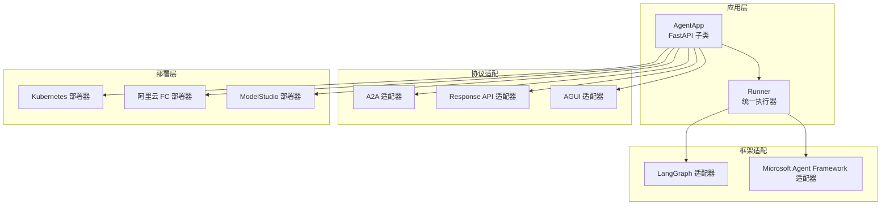
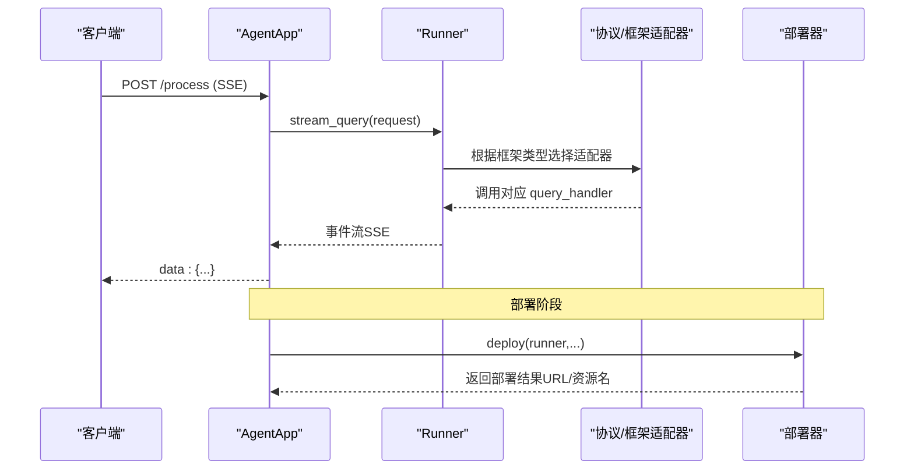
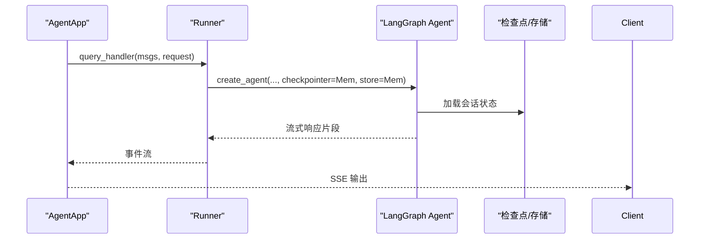
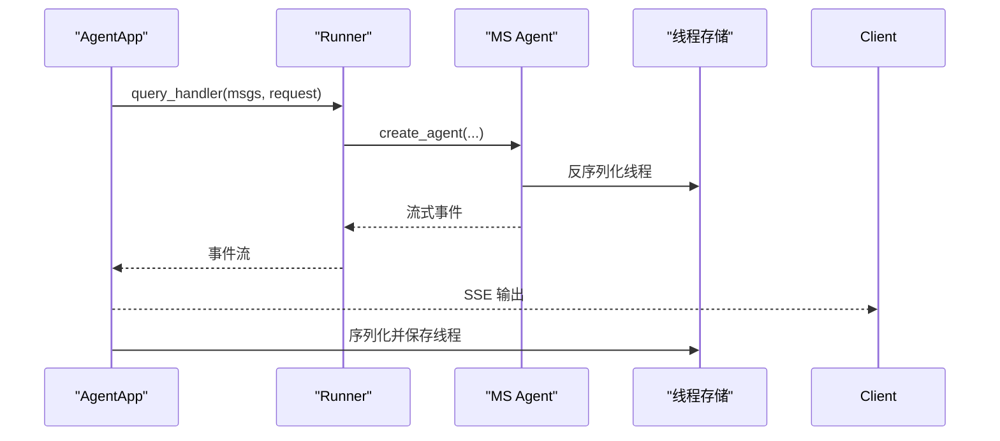
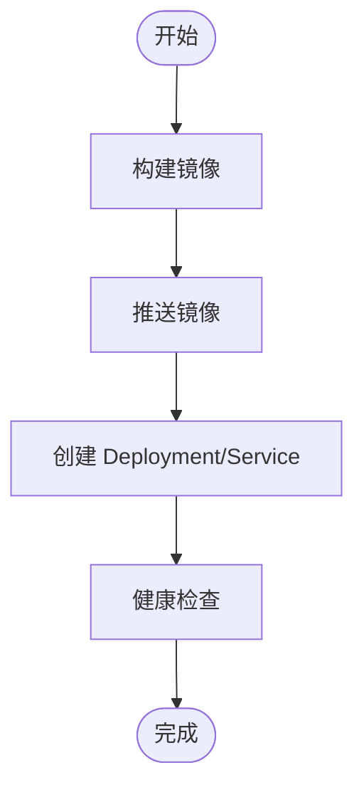
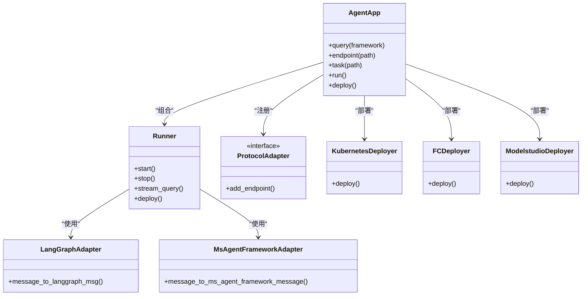

# 集成指南

<cite>
**本文引用的文件**
- [README.md](file://README.md)
- [langgraph_guidelines.md](file://cookbook/zh/langgraph_guidelines.md)
- [ms_agent_framework_guidelines.md](file://cookbook/zh/ms_agent_framework_guidelines.md)
- [agent_app.py](file://src/agentscope_runtime/engine/app/agent_app.py)
- [runner.py](file://src/agentscope_runtime/engine/runner.py)
- [agent_schemas.py](file://src/agentscope_runtime/engine/schemas/agent_schemas.py)
- [message.py（LangGraph 适配器）](file://src/agentscope_runtime/adapters/langgraph/message.py)
- [message.py（Microsoft Agent Framework 适配器）](file://src/agentscope_runtime/adapters/ms_agent_framework/message.py)
- [kubernetes_deployer.py](file://src/agentscope_runtime/engine/deployers/kubernetes_deployer.py)
- [modelstudio_deployer.py](file://src/agentscope_runtime/engine/deployers/modelstudio_deployer.py)
- [fc_deployer.py](file://src/agentscope_runtime/engine/deployers/fc_deployer.py)
- [app_deploy_to_k8s.py](file://examples/deployments/k8s_deploy/app_deploy_to_k8s.py)
- [run_langgraph_agent.py](file://examples/integrations/langgraph/run_langgraph_agent.py)
- [run_langgraph_llm.py](file://examples/integrations/langgraph/run_langgraph_llm.py)
</cite>

## 目录
1. [简介](#简介)
2. [项目结构](#项目结构)
3. [核心组件](#核心组件)
4. [架构总览](#架构总览)
5. [详细组件分析](#详细组件分析)
6. [依赖关系分析](#依赖关系分析)
7. [性能考虑](#性能考虑)
8. [故障排查指南](#故障排查指南)
9. [结论](#结论)
10. [附录](#附录)

## 简介
本指南面向需要将 AgentScope Runtime 与主流智能体框架（如 LangGraph、Microsoft Agent Framework）以及云平台（阿里云、AWS 等）进行集成的工程团队。内容覆盖：
- 框架集成：LangGraph、Microsoft Agent Framework 的适配与消息转换
- 云平台集成：Kubernetes、阿里云函数计算（FC）、ModelStudio 等
- 数据库与消息队列：会话状态、中断与任务队列的集成建议
- API 网关与负载均衡：部署与路由策略
- 微服务与容器编排：最佳实践与示例
- 集成测试与验证：端到端测试流程与常见问题定位

## 项目结构
AgentScope Runtime 采用“应用层（AgentApp）+ 运行器（Runner）+ 协议适配器 + 部署器”的分层设计，既可本地运行，也可一键部署至多种云平台。

图表来源
- [agent_app.py:60-220](file://src/agentscope_runtime/engine/app/agent_app.py#L60-L220)
- [runner.py:46-120](file://src/agentscope_runtime/engine/runner.py#L46-L120)
- [kubernetes_deployer.py:48-120](file://src/agentscope_runtime/engine/deployers/kubernetes_deployer.py#L48-L120)
- [modelstudio_deployer.py:1-120](file://src/agentscope_runtime/engine/deployers/modelstudio_deployer.py#L1-L120)
- [fc_deployer.py:67-120](file://src/agentscope_runtime/engine/deployers/fc_deployer.py#L67-L120)

章节来源
- [README.md:86-106](file://README.md#L86-L106)
- [agent_app.py:60-220](file://src/agentscope_runtime/engine/app/agent_app.py#L60-L220)

## 核心组件
- AgentApp：基于 FastAPI 的生产级智能体服务入口，内置健康检查、SSE 流式输出、协议适配器注册、生命周期管理与中断服务。
- Runner：统一的执行器，负责调度不同框架的 query_handler，支持同步/异步/生成器/协程等多种调用形式。
- 协议适配器：自动注入 A2A、Response API、AGUI 等协议的请求模型与端点。
- 框架适配器：LangGraph 与 Microsoft Agent Framework 的消息格式互转。
- 部署器：Kubernetes、阿里云 FC、ModelStudio 等云平台的一键部署与资源编排。

章节来源
- [agent_app.py:60-220](file://src/agentscope_runtime/engine/app/agent_app.py#L60-L220)
- [runner.py:46-120](file://src/agentscope_runtime/engine/runner.py#L46-L120)
- [agent_schemas.py:18-78](file://src/agentscope_runtime/engine/schemas/agent_schemas.py#L18-L78)

## 架构总览
AgentApp 在启动时初始化协议适配器与内置路由，随后根据框架类型（如 agentscope、langgraph、ms_agent_framework）绑定对应的 query 处理逻辑，并通过 Runner 统一调度。部署阶段由具体 DeployManager 将应用打包、推送镜像并创建云资源。

图表来源
- [agent_app.py:781-800](file://src/agentscope_runtime/engine/app/agent_app.py#L781-L800)
- [runner.py:199-220](file://src/agentscope_runtime/engine/runner.py#L199-L220)
- [kubernetes_deployer.py:126-186](file://src/agentscope_runtime/engine/deployers/kubernetes_deployer.py#L126-L186)

## 详细组件分析

### 框架集成：LangGraph
- 适配要点
  - 使用装饰器指定框架类型：query(framework="langgraph")
  - 通过 message_to_langgraph_msg 将 AgentScope Message 转换为 LangGraph BaseMessage
  - 使用 InMemorySaver/InMemoryStore 实现短期/长期记忆，或替换为持久化后端
- 示例路径
  - [run_langgraph_agent.py:59-106](file://examples/integrations/langgraph/run_langgraph_agent.py#L59-L106)
  - [run_langgraph_llm.py:40-75](file://examples/integrations/langgraph/run_langgraph_llm.py#L40-L75)
  - [message.py（LangGraph 适配器）:23-163](file://src/agentscope_runtime/adapters/langgraph/message.py#L23-L163)

图表来源
- [run_langgraph_agent.py:59-106](file://examples/integrations/langgraph/run_langgraph_agent.py#L59-L106)
- [message.py（LangGraph 适配器）:23-163](file://src/agentscope_runtime/adapters/langgraph/message.py#L23-L163)

章节来源
- [langgraph_guidelines.md:17-414](file://cookbook/zh/langgraph_guidelines.md#L17-L414)
- [run_langgraph_agent.py:59-106](file://examples/integrations/langgraph/run_langgraph_agent.py#L59-L106)
- [run_langgraph_llm.py:40-75](file://examples/integrations/langgraph/run_langgraph_llm.py#L40-L75)
- [message.py（LangGraph 适配器）:23-163](file://src/agentscope_runtime/adapters/langgraph/message.py#L23-L163)

### 框架集成：Microsoft Agent Framework
- 适配要点
  - 使用装饰器指定框架类型：query(framework="ms_agent_framework")
  - 通过 message_to_ms_agent_framework_message 将 AgentScope Message 转换为 Microsoft ChatMessage
  - 使用内存存储或外部数据库保存线程序列化状态
- 示例路径
  - [ms_agent_framework_guidelines.md:29-106](file://cookbook/zh/ms_agent_framework_guidelines.md#L29-L106)
  - [message.py（Microsoft Agent Framework 适配器）:23-216](file://src/agentscope_runtime/adapters/ms_agent_framework/message.py#L23-L216)

图表来源
- [ms_agent_framework_guidelines.md:59-99](file://cookbook/zh/ms_agent_framework_guidelines.md#L59-L99)
- [message.py（Microsoft Agent Framework 适配器）:23-216](file://src/agentscope_runtime/adapters/ms_agent_framework/message.py#L23-L216)

章节来源
- [ms_agent_framework_guidelines.md:17-183](file://cookbook/zh/ms_agent_framework_guidelines.md#L17-L183)
- [message.py（Microsoft Agent Framework 适配器）:23-216](file://src/agentscope_runtime/adapters/ms_agent_framework/message.py#L23-L216)

### 云平台集成：Kubernetes
- 部署流程
  - 配置 Registry 与 K8s 连接参数
  - 通过 KubernetesDeployManager 构建镜像、推送、创建 Deployment/Service
  - 自动注入 A2A、Response API、AGUI 协议端点
- 示例路径
  - [kubernetes_deployer.py:126-186](file://src/agentscope_runtime/engine/deployers/kubernetes_deployer.py#L126-L186)
  - [app_deploy_to_k8s.py:124-222](file://examples/deployments/k8s_deploy/app_deploy_to_k8s.py#L124-L222)

图表来源
- [kubernetes_deployer.py:126-186](file://src/agentscope_runtime/engine/deployers/kubernetes_deployer.py#L126-L186)
- [app_deploy_to_k8s.py:197-222](file://examples/deployments/k8s_deploy/app_deploy_to_k8s.py#L197-L222)

章节来源
- [kubernetes_deployer.py:126-186](file://src/agentscope_runtime/engine/deployers/kubernetes_deployer.py#L126-L186)
- [app_deploy_to_k8s.py:124-222](file://examples/deployments/k8s_deploy/app_deploy_to_k8s.py#L124-L222)

### 云平台集成：阿里云函数计算（FC）
- 部署流程
  - 读取 FC 配置（AK、Region、VPC、日志等）
  - 生成打包、上传代码包、创建函数与触发器
  - 支持日志投递与网络隔离
- 示例路径
  - [fc_deployer.py:85-200](file://src/agentscope_runtime/engine/deployers/fc_deployer.py#L85-L200)

章节来源
- [fc_deployer.py:85-200](file://src/agentscope_runtime/engine/deployers/fc_deployer.py#L85-L200)

### 云平台集成：ModelStudio
- 部署流程
  - 读取 OSS 与 ModelStudio 配置
  - 通过 OSS 临时桶上传构建产物，调用 Bailian API 创建应用
- 示例路径
  - [modelstudio_deployer.py:50-140](file://src/agentscope_runtime/engine/deployers/modelstudio_deployer.py#L50-L140)

章节来源
- [modelstudio_deployer.py:50-140](file://src/agentscope_runtime/engine/deployers/modelstudio_deployer.py#L50-L140)

### 数据库与消息队列集成
- 会话状态与长时记忆
  - 使用 Redis/InMemory 等作为会话状态存储，结合 Runner 生命周期加载/保存
  - LangGraph 场景下使用 checkpointer/store 实现短期/长期记忆
- 中断与任务队列
  - 分布式中断服务：Redis/本地后端，支持手动预占与恢复
  - 异步任务：Celery 或内存模式，提供后台任务提交与状态查询
- 示例路径
  - [agent_app.py:222-247](file://src/agentscope_runtime/engine/app/agent_app.py#L222-L247)
  - [agent_app.py:497-597](file://src/agentscope_runtime/engine/app/agent_app.py#L497-L597)

章节来源
- [agent_app.py:222-247](file://src/agentscope_runtime/engine/app/agent_app.py#L222-L247)
- [agent_app.py:497-597](file://src/agentscope_runtime/engine/app/agent_app.py#L497-L597)

### API 网关与负载均衡
- 路由与中间件
  - CORS 中间件、动态部署模式响应头
  - 内置健康检查与信息发现端点
- 负载均衡建议
  - Kubernetes：Service/Ingress 控制流量；副本数与 HPA 配合弹性扩缩
  - FC：按并发与超时配置调整实例行为
- 示例路径
  - [agent_app.py:359-381](file://src/agentscope_runtime/engine/app/agent_app.py#L359-L381)
  - [agent_app.py:382-424](file://src/agentscope_runtime/engine/app/agent_app.py#L382-L424)

章节来源
- [agent_app.py:359-381](file://src/agentscope_runtime/engine/app/agent_app.py#L359-L381)
- [agent_app.py:382-424](file://src/agentscope_runtime/engine/app/agent_app.py#L382-L424)

### 微服务与容器编排最佳实践
- 服务拆分
  - 将 AgentApp 与沙箱服务解耦，通过协议适配器对接
  - 使用独立的会话/存储服务，避免单点瓶颈
- 编排策略
  - 使用 Deployment/StatefulSet 管理无状态/有状态组件
  - 通过 ConfigMap/Secret 注入环境变量与密钥
- 示例路径
  - [app_deploy_to_k8s.py:124-222](file://examples/deployments/k8s_deploy/app_deploy_to_k8s.py#L124-L222)

章节来源
- [app_deploy_to_k8s.py:124-222](file://examples/deployments/k8s_deploy/app_deploy_to_k8s.py#L124-L222)

### 集成测试与验证
- 端到端测试
  - 使用 curl 或 aiohttp 对 /health、/process、自定义端点进行验证
  - 验证 SSE 流式输出与错误处理
- 示例路径
  - [app_deploy_to_k8s.py:224-266](file://examples/deployments/k8s_deploy/app_deploy_to_k8s.py#L224-L266)

章节来源
- [app_deploy_to_k8s.py:224-266](file://examples/deployments/k8s_deploy/app_deploy_to_k8s.py#L224-L266)

## 依赖关系分析
- 组件耦合
  - AgentApp 与 Runner 低耦合：通过装饰器注册 handler，便于替换框架实现
  - 适配器与部署器通过接口解耦，便于扩展新的协议/平台
- 外部依赖
  - LangGraph、Microsoft Agent Framework、OpenAI 兼容模式
  - Kubernetes、阿里云 FC、ModelStudio SDK

图表来源
- [agent_app.py:60-220](file://src/agentscope_runtime/engine/app/agent_app.py#L60-L220)
- [runner.py:46-120](file://src/agentscope_runtime/engine/runner.py#L46-L120)
- [message.py（LangGraph 适配器）:23-163](file://src/agentscope_runtime/adapters/langgraph/message.py#L23-L163)
- [message.py（Microsoft Agent Framework 适配器）:23-216](file://src/agentscope_runtime/adapters/ms_agent_framework/message.py#L23-L216)
- [kubernetes_deployer.py:48-120](file://src/agentscope_runtime/engine/deployers/kubernetes_deployer.py#L48-L120)
- [fc_deployer.py:67-120](file://src/agentscope_runtime/engine/deployers/fc_deployer.py#L67-L120)
- [modelstudio_deployer.py:50-120](file://src/agentscope_runtime/engine/deployers/modelstudio_deployer.py#L50-L120)

章节来源
- [agent_app.py:60-220](file://src/agentscope_runtime/engine/app/agent_app.py#L60-L220)
- [runner.py:46-120](file://src/agentscope_runtime/engine/runner.py#L46-L120)

## 性能考虑
- 流式输出
  - 使用 SSE 降低延迟，适合长对话与工具调用链路
- 资源限制
  - Kubernetes 中设置 requests/limits，避免资源争抢
- 并发与超时
  - FC 中合理设置 CPU/内存与空闲超时，避免冷启动与超时失败
- 缓存与镜像
  - 启用构建缓存，减少重复构建时间

## 故障排查指南
- 常见问题
  - 无法连接云平台：检查 AK/Region/VPC 配置是否正确
  - SSE 输出异常：确认前端 Accept: text/event-stream，后端未抛出异常
  - LangGraph 工作流卡住：检查 checkpointer/store 是否正确初始化
  - 中断服务不可用：确认 Redis 地址或回退到本地后端
- 排查步骤
  - 查看 /health 与 /admin/status
  - 检查部署器返回的资源名与日志
  - 使用示例脚本最小化复现问题

章节来源
- [agent_app.py:382-424](file://src/agentscope_runtime/engine/app/agent_app.py#L382-L424)
- [agent_app.py:614-641](file://src/agentscope_runtime/engine/app/agent_app.py#L614-L641)
- [kubernetes_deployer.py:98-120](file://src/agentscope_runtime/engine/deployers/kubernetes_deployer.py#L98-L120)

## 结论
AgentScope Runtime 提供了开箱即用的智能体服务框架，通过协议与框架适配器实现对主流智能体生态的无缝接入，并通过多种部署器快速落地到 Kubernetes、阿里云 FC、ModelStudio 等平台。配合会话状态、中断与任务队列机制，可在生产环境中实现高可用、可观测与可扩展的智能体服务。

## 附录
- AWS 集成建议
  - 使用 EKS/K8s 部署：与现有 KubernetesDeployManager 类似，定制 AWS IAM/ELB/ALB 配置
  - 使用 Lambda + API Gateway：参考 Response API 适配器，将 AgentApp 暴露为无服务器端点
  - 使用 ECS/Fargate：通过镜像与任务定义编排，结合 ALB 进行负载均衡
- 数据库与消息队列
  - Redis：用于会话状态、中断后端、任务队列
  - Kafka/RabbitMQ：用于异步任务与事件驱动
- 安全与合规
  - 使用 Secret 管理密钥，启用 TLS 与 RBAC
  - 审计日志与分布式追踪，确保可追溯性