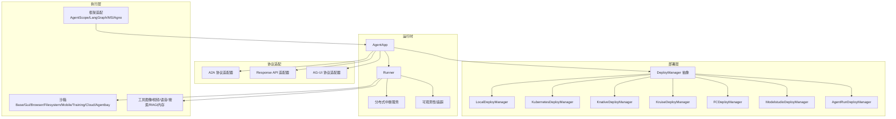
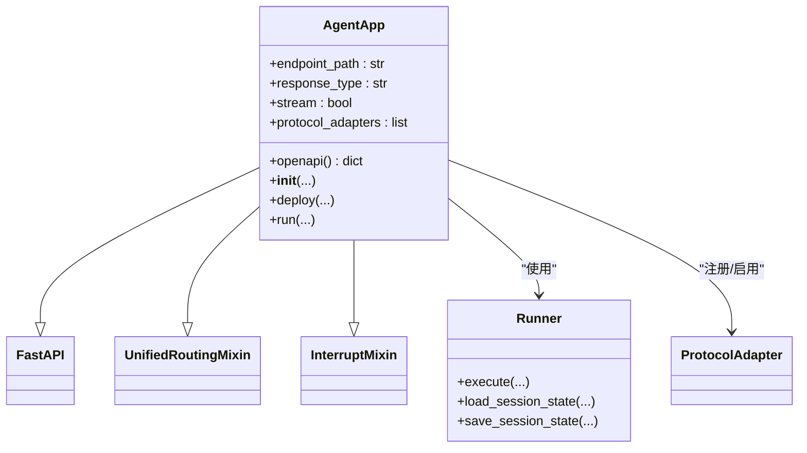
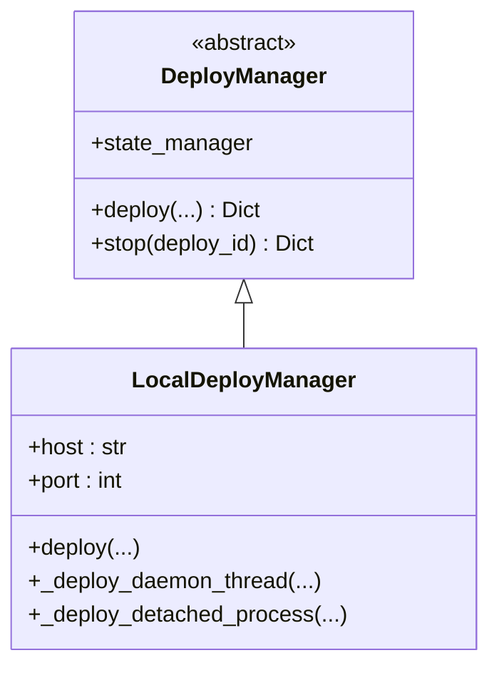
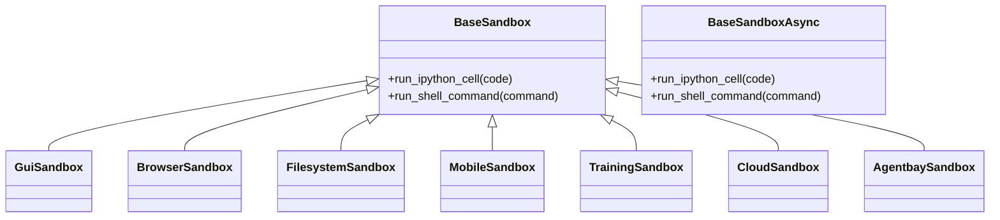
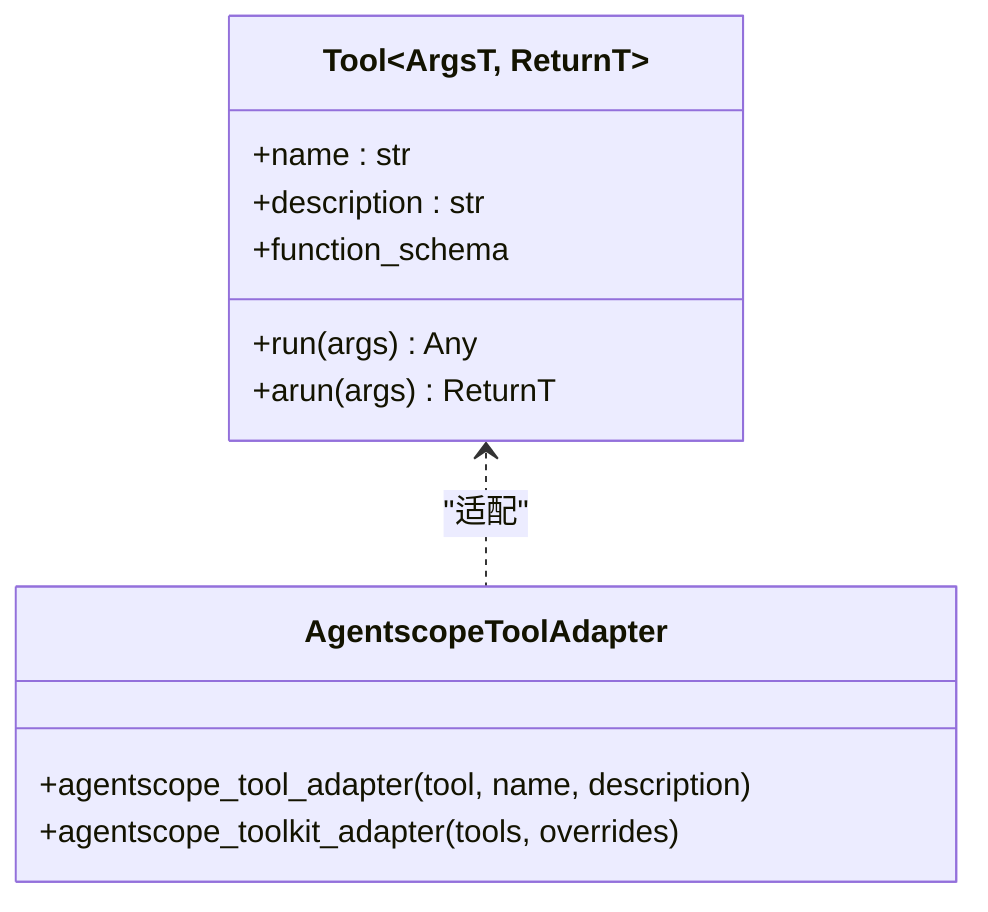
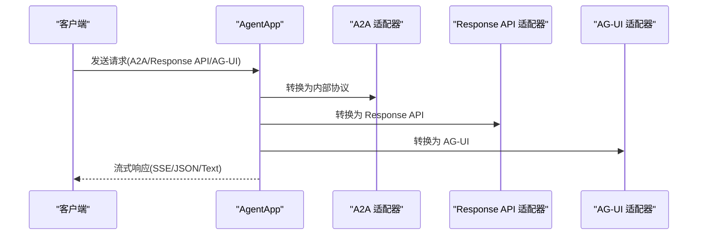
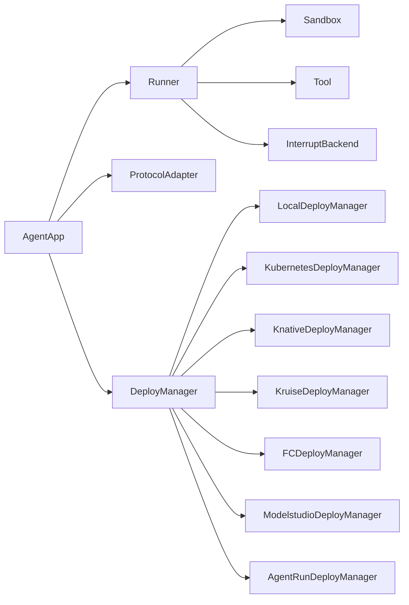

# 项目概述

<cite>
**本文引用的文件**
- [README.md](file://README.md)
- [src/agentscope_runtime/__init__.py](file://src/agentscope_runtime/__init__.py)
- [src/agentscope_runtime/engine/__init__.py](file://src/agentscope_runtime/engine/__init__.py)
- [src/agentscope_runtime/engine/app/agent_app.py](file://src/agentscope_runtime/engine/app/agent_app.py)
- [src/agentscope_runtime/engine/deployers/base.py](file://src/agentscope_runtime/engine/deployers/base.py)
- [src/agentscope_runtime/engine/deployers/local_deployer.py](file://src/agentscope_runtime/engine/deployers/local_deployer.py)
- [src/agentscope_runtime/sandbox/__init__.py](file://src/agentscope_runtime/sandbox/__init__.py)
- [src/agentscope_runtime/sandbox/box/base/base_sandbox.py](file://src/agentscope_runtime/sandbox/box/base/base_sandbox.py)
- [src/agentscope_runtime/tools/base.py](file://src/agentscope_runtime/tools/base.py)
- [src/agentscope_runtime/tools/__init__.py](file://src/agentscope_runtime/tools/__init__.py)
- [src/agentscope_runtime/adapters/agentscope/tool/tool.py](file://src/agentscope_runtime/adapters/agentscope/tool/tool.py)
- [src/agentscope_runtime/cli/cli.py](file://src/agentscope_runtime/cli/cli.py)
- [src/agentscope_runtime/common/utils/logging.py](file://src/agentscope_runtime/common/utils/logging.py)
- [cookbook/en/protocol.md](file://cookbook/en/protocol.md)
- [cookbook/zh/protocol.md](file://cookbook/zh/protocol.md)
- [cookbook/en/sandbox/advanced.md](file://cookbook/en/sandbox/advanced.md)
</cite>

## 目录
1. [引言](#引言)
2. [项目结构](#项目结构)
3. [核心组件](#核心组件)
4. [架构总览](#架构总览)
5. [详细组件分析](#详细组件分析)
6. [依赖关系分析](#依赖关系分析)
7. [性能考量](#性能考量)
8. [故障排查指南](#故障排查指南)
9. [结论](#结论)
10. [附录](#附录)

## 引言
AgentScope Runtime 是一个面向生产环境的“代理即服务（Agent-as-a-Service, AaaS）”运行时平台，旨在将各类智能体应用以流式、可扩展的方式对外暴露为统一 API，并提供安全隔离的工具执行能力与多框架兼容的适配层。其核心目标包括：
- 将智能体封装为可流式输出的 AaaS API，支持 SSE 等响应类型
- 通过容器化沙箱实现工具调用的安全隔离与可恢复执行
- 支持本地、Kubernetes、Serverless 等多种弹性部署形态
- 提供可观测性、状态管理、长程记忆与中断控制等基础设施能力

项目同时强调“框架无关”的设计，当前已对主流开源智能体框架提供适配与工具生态，便于快速集成与扩展。

## 项目结构
项目采用按领域分层与按功能模块划分相结合的组织方式：
- 引擎层（engine）：提供 AgentApp 应用主体、Runner 执行器、部署器（Local/K8s/Knative/Kruise/FC/ModelStudio 等）、协议适配器（A2A/Response API/AG-UI）
- 沙箱层（sandbox）：提供多种沙箱类型（基础、GUI、浏览器、文件系统、移动端、训练盒、云沙箱、AgentBay），并内置异步版本
- 工具层（tools）：提供图像生成/编辑、视频生成、语音识别/合成、网页搜索等工具，以及 MCP 服务器元数据配置
- 适配层（adapters）：将第三方框架（如 AgentScope、LangGraph、MS Agent Framework、Agno）与 AgentApp 对接
- CLI 层（cli）：提供命令行入口，统一管理开发、运行、部署、沙箱等生命周期操作
- 公共工具（common）：日志、容器客户端、集合/队列/集合等通用组件

```mermaid
graph TD
subgraph "引擎层"
A["AgentApp<br/>应用主体"]
B["Runner<br/>执行器"]
C["DeployManager<br/>部署抽象"]
D["LocalDeployManager<br/>本地部署"]
E["协议适配器<br/>A2A/Response API/AG-UI"]
end
subgraph "沙箱层"
S1["BaseSandbox / Async"]
S2["GuiSandbox / Async"]
S3["BrowserSandbox / Async"]
S4["FilesystemSandbox / Async"]
S5["MobileSandbox / Async"]
S6["TrainingSandbox"]
S7["CloudSandbox"]
S8["AgentbaySandbox"]
end
subgraph "工具层"
T1["图像/视频/语音工具"]
T2["搜索/RAG/内存工具"]
T3["MCP 服务器元数据"]
end
subgraph "适配层"
AD1["AgentScope 工具适配"]
AD2["LangGraph/MS/Agno 适配"]
end
subgraph "CLI"
CLI["agentscope CLI"]
end
A --> B
A --> C
C --> D
A --> E
B --> S1
B --> S2
B --> S3
B --> S4
B --> S5
B --> S6
B --> S7
B --> S8
B --> T1
B --> T2
AD1 --> T1
AD1 --> T2
CLI --> A
CLI -.-> D
```

**图示来源**
- [src/agentscope_runtime/engine/app/agent_app.py:60-200](file://src/agentscope_runtime/engine/app/agent_app.py#L60-L200)
- [src/agentscope_runtime/engine/deployers/local_deployer.py:27-200](file://src/agentscope_runtime/engine/deployers/local_deployer.py#L27-L200)
- [src/agentscope_runtime/sandbox/__init__.py:6-32](file://src/agentscope_runtime/sandbox/__init__.py#L6-L32)
- [src/agentscope_runtime/tools/__init__.py:76-120](file://src/agentscope_runtime/tools/__init__.py#L76-L120)
- [src/agentscope_runtime/adapters/agentscope/tool/tool.py:17-170](file://src/agentscope_runtime/adapters/agentscope/tool/tool.py#L17-L170)
- [src/agentscope_runtime/cli/cli.py:30-64](file://src/agentscope_runtime/cli/cli.py#L30-L64)

**章节来源**
- [README.md:86-106](file://README.md#L86-L106)
- [src/agentscope_runtime/engine/__init__.py:5-34](file://src/agentscope_runtime/engine/__init__.py#L5-L34)
- [src/agentscope_runtime/sandbox/__init__.py:6-32](file://src/agentscope_runtime/sandbox/__init__.py#L6-L32)
- [src/agentscope_runtime/tools/__init__.py:1-120](file://src/agentscope_runtime/tools/__init__.py#L1-L120)

## 核心组件
- AgentApp：基于 FastAPI 的智能体应用主体，集成路由与分布式中断能力，支持多协议适配与流式输出
- Runner：统一的任务执行器，负责消息流式处理、状态加载/保存与工具调用编排
- DeployManager 及其实现：抽象出统一的部署接口，提供本地、K8s、Knative、Kruise、FC、ModelStudio 等多种部署后端
- 沙箱体系：提供多种隔离级别与交互方式的沙箱，覆盖 Python/Shell、GUI、浏览器、文件系统、移动端、训练场景等
- 工具体系：提供图像/视频/语音/搜索/RAG/内存等工具，并以 MCP 元数据形式组织
- 适配器：将不同框架的智能体与工具无缝接入 AgentApp
- CLI：统一的命令行入口，支持 chat/run/web/deploy/list/status/stop/invoke/sandbox 等子命令

**章节来源**
- [src/agentscope_runtime/engine/app/agent_app.py:60-200](file://src/agentscope_runtime/engine/app/agent_app.py#L60-L200)
- [src/agentscope_runtime/engine/deployers/base.py:9-43](file://src/agentscope_runtime/engine/deployers/base.py#L9-L43)
- [src/agentscope_runtime/engine/deployers/local_deployer.py:27-200](file://src/agentscope_runtime/engine/deployers/local_deployer.py#L27-L200)
- [src/agentscope_runtime/sandbox/box/base/base_sandbox.py:18-102](file://src/agentscope_runtime/sandbox/box/base/base_sandbox.py#L18-L102)
- [src/agentscope_runtime/tools/base.py:34-200](file://src/agentscope_runtime/tools/base.py#L34-L200)
- [src/agentscope_runtime/adapters/agentscope/tool/tool.py:17-170](file://src/agentscope_runtime/adapters/agentscope/tool/tool.py#L17-L170)
- [src/agentscope_runtime/cli/cli.py:30-64](file://src/agentscope_runtime/cli/cli.py#L30-L64)

## 架构总览
AgentScope Runtime 的总体架构围绕“应用主体（AgentApp）—执行器（Runner）—部署器（DeployManager）—协议适配器（ProtocolAdapter）—沙箱/工具（Sandbox/Tools）—适配层（Adapters）—CLI”展开，形成从开发到生产的完整闭环。



**图示来源**
- [src/agentscope_runtime/engine/app/agent_app.py:60-200](file://src/agentscope_runtime/engine/app/agent_app.py#L60-L200)
- [src/agentscope_runtime/engine/deployers/base.py:9-43](file://src/agentscope_runtime/engine/deployers/base.py#L9-L43)
- [src/agentscope_runtime/engine/deployers/local_deployer.py:27-200](file://src/agentscope_runtime/engine/deployers/local_deployer.py#L27-L200)
- [cookbook/en/protocol.md:583-675](file://cookbook/en/protocol.md#L583-L675)
- [cookbook/zh/protocol.md:593-626](file://cookbook/zh/protocol.md#L593-L626)

## 详细组件分析

### AgentApp 组件
- 角色定位：继承 FastAPI，集成 Runner，支持分布式中断与统一路由
- 关键特性：
  - 自动注入 OpenAPI 中的协议请求模型（A2A/Response API/Agent 请求）
  - 生命周期管理（lifespan）、流式输出（SSE/JSON/Text）
  - 多协议适配器注册与启用
  - 集成状态管理（会话/内存/持久化）
- 典型用法：通过装饰器注册 query/init/shutdown 逻辑，绑定统一的 /process 接口



**图示来源**
- [src/agentscope_runtime/engine/app/agent_app.py:60-200](file://src/agentscope_runtime/engine/app/agent_app.py#L60-L200)

**章节来源**
- [src/agentscope_runtime/engine/app/agent_app.py:60-200](file://src/agentscope_runtime/engine/app/agent_app.py#L60-L200)

### 部署器组件
- DeployManager 抽象：定义统一的 deploy/stop 接口，维护部署 ID 与状态管理
- LocalDeployManager：支持守护线程与分离进程两种模式，可选择嵌入 Celery Worker
- 其他部署器：Kubernetes/Knative/Kruise/FC/ModelStudio/AgentRun 等，分别面向云原生与云服务场景



**图示来源**
- [src/agentscope_runtime/engine/deployers/base.py:9-43](file://src/agentscope_runtime/engine/deployers/base.py#L9-L43)
- [src/agentscope_runtime/engine/deployers/local_deployer.py:27-200](file://src/agentscope_runtime/engine/deployers/local_deployer.py#L27-L200)

**章节来源**
- [src/agentscope_runtime/engine/deployers/base.py:9-43](file://src/agentscope_runtime/engine/deployers/base.py#L9-L43)
- [src/agentscope_runtime/engine/deployers/local_deployer.py:27-200](file://src/agentscope_runtime/engine/deployers/local_deployer.py#L27-L200)

### 沙箱组件
- 类型覆盖：基础（Python/Shell）、GUI（虚拟桌面）、浏览器（带 MCP）、文件系统、移动端（Android 模拟器）、训练盒、云沙箱、AgentBay
- 同步/异步双栈：每个类型均提供同步与异步版本，便于并发与非阻塞执行
- 注册机制：通过注册表在导入时完成类型注册，确保运行时可发现



**图示来源**
- [src/agentscope_runtime/sandbox/box/base/base_sandbox.py:18-102](file://src/agentscope_runtime/sandbox/box/base/base_sandbox.py#L18-L102)
- [src/agentscope_runtime/sandbox/__init__.py:6-32](file://src/agentscope_runtime/sandbox/__init__.py#L6-L32)

**章节来源**
- [src/agentscope_runtime/sandbox/box/base/base_sandbox.py:18-102](file://src/agentscope_runtime/sandbox/box/base/base_sandbox.py#L18-L102)
- [src/agentscope_runtime/sandbox/__init__.py:6-32](file://src/agentscope_runtime/sandbox/__init__.py#L6-L32)

### 工具与适配器
- 工具基类：统一输入/输出类型校验、函数模式 Schema 生成、同步/异步执行桥接
- MCP 元数据：按服务域组织工具清单，便于前端或外部系统发现
- AgentScope 适配器：将 agentscope_runtime 工具转换为 AgentScope Toolkit 可用的函数式工具，支持参数校验与结果格式化



**图示来源**
- [src/agentscope_runtime/tools/base.py:34-200](file://src/agentscope_runtime/tools/base.py#L34-L200)
- [src/agentscope_runtime/adapters/agentscope/tool/tool.py:17-170](file://src/agentscope_runtime/adapters/agentscope/tool/tool.py#L17-L170)

**章节来源**
- [src/agentscope_runtime/tools/base.py:34-200](file://src/agentscope_runtime/tools/base.py#L34-L200)
- [src/agentscope_runtime/tools/__init__.py:76-120](file://src/agentscope_runtime/tools/__init__.py#L76-L120)
- [src/agentscope_runtime/adapters/agentscope/tool/tool.py:17-170](file://src/agentscope_runtime/adapters/agentscope/tool/tool.py#L17-L170)

### 协议适配器
- A2A：Agent-to-Agent 协议，支持跨应用通信与卡片化配置
- Response API：OpenAI Responses API 兼容模式，便于直接对接现有 SDK
- AG-UI：前端框架协议适配，支持可视化交互
- 使用建议：默认自动注册，也可通过构造参数自定义



**图示来源**
- [cookbook/en/protocol.md:583-675](file://cookbook/en/protocol.md#L583-L675)
- [cookbook/zh/protocol.md:593-626](file://cookbook/zh/protocol.md#L593-L626)

**章节来源**
- [cookbook/en/protocol.md:583-675](file://cookbook/en/protocol.md#L583-L675)
- [cookbook/zh/protocol.md:593-626](file://cookbook/zh/protocol.md#L593-L626)

### 命令行与日志
- CLI：统一入口，提供 chat/run/web/deploy/list/status/stop/invoke/sandbox 等子命令
- 日志：彩色终端输出，支持路径简化与时间戳格式化

**章节来源**
- [src/agentscope_runtime/cli/cli.py:30-64](file://src/agentscope_runtime/cli/cli.py#L30-L64)
- [src/agentscope_runtime/common/utils/logging.py:31-44](file://src/agentscope_runtime/common/utils/logging.py#L31-L44)

## 依赖关系分析
- 组件耦合：
  - AgentApp 依赖 Runner、协议适配器与部署器
  - Runner 依赖沙箱与工具，同时与状态管理/中断服务耦合
  - 沙箱与工具通过适配器解耦于具体框架
- 外部依赖：
  - FastAPI/Starlette：Web 框架与生命周期
  - Uvicorn：本地服务运行
  - Celery（可选）：后台任务与分布式中断后端
  - 容器运行时：Docker/gVisor/BoxLite/Kubernetes/Serverless 等



**图示来源**
- [src/agentscope_runtime/engine/app/agent_app.py:60-200](file://src/agentscope_runtime/engine/app/agent_app.py#L60-L200)
- [src/agentscope_runtime/engine/deployers/base.py:9-43](file://src/agentscope_runtime/engine/deployers/base.py#L9-L43)
- [src/agentscope_runtime/engine/deployers/local_deployer.py:27-200](file://src/agentscope_runtime/engine/deployers/local_deployer.py#L27-L200)

**章节来源**
- [src/agentscope_runtime/engine/app/agent_app.py:60-200](file://src/agentscope_runtime/engine/app/agent_app.py#L60-L200)
- [src/agentscope_runtime/engine/deployers/base.py:9-43](file://src/agentscope_runtime/engine/deployers/base.py#L9-L43)
- [src/agentscope_runtime/engine/deployers/local_deployer.py:27-200](file://src/agentscope_runtime/engine/deployers/local_deployer.py#L27-L200)

## 性能考量
- 流式输出：SSE/JSON/Text 三类响应，优先使用 SSE 以提升前端体验与实时性
- 并发与异步：沙箱与工具均提供异步版本，结合线程池/事件循环避免阻塞
- 部署弹性：支持本地守护线程、分离进程、K8s/Serverless 等模式，按负载弹性伸缩
- 沙箱隔离：根据场景选择 Docker/gVisor/BoxLite/K8s 等后端，权衡启动时延与隔离强度
- 观测性：内置追踪与日志，便于定位瓶颈与异常

[本节为通用指导，不直接分析具体文件]

## 故障排查指南
- 部署失败：检查 LocalDeployManager 的启动/关闭超时、端口占用与权限
- 沙箱不可用：确认 CONTAINER_DEPLOYMENT 与镜像仓库/命名空间/标签配置是否正确
- 协议不兼容：确认协议适配器是否启用，必要时显式传入 protocol_adapters
- 日志定位：通过 TRACE_ENABLE_LOG 控制台开关与彩色日志输出定位问题

**章节来源**
- [src/agentscope_runtime/engine/deployers/local_deployer.py:68-174](file://src/agentscope_runtime/engine/deployers/local_deployer.py#L68-L174)
- [README.md:524-536](file://README.md#L524-L536)
- [src/agentscope_runtime/common/utils/logging.py:31-44](file://src/agentscope_runtime/common/utils/logging.py#L31-L44)

## 结论
AgentScope Runtime 以“应用即服务”的理念，将智能体的开发、运行、部署与安全执行一体化，既满足初学者快速上手，也为经验丰富的工程师提供了高扩展性与生产级能力。通过协议适配、多后端部署、沙箱隔离与工具生态，项目形成了从概念到落地的完整闭环。

[本节为总结性内容，不直接分析具体文件]

## 附录

### 常见用例与示例路径
- 快速构建 AaaS API（AgentApp + ReActAgent + 流式输出）
  - 示例路径：[README.md:141-271](file://README.md#L141-L271)
- 沙箱示例（基础/浏览器/文件系统/移动端/GUI）
  - 示例路径：[README.md:272-455](file://README.md#L272-L455)
- 部署示例（本地/ModelStudio/Serverless）
  - 示例路径：[README.md:538-617](file://README.md#L538-L617)
- 沙箱后端对比与选择
  - 参考路径：[cookbook/en/sandbox/advanced.md:129-143](file://cookbook/en/sandbox/advanced.md#L129-L143)

### 公共接口与参数要点
- AgentApp
  - 关键参数：app_name、app_description、endpoint_path、response_type、stream、request_model、protocol_adapters、interrupt_backend 等
  - 返回：应用实例，支持 run/deploy/openapi 等方法
  - 参考路径：[src/agentscope_runtime/engine/app/agent_app.py:124-200](file://src/agentscope_runtime/engine/app/agent_app.py#L124-L200)
- LocalDeployManager
  - 关键参数：host、port、mode（DAEMON_THREAD/DETACHED_PROCESS）、project_dir、entrypoint 等
  - 返回：包含 deploy_id 与 url 的字典
  - 参考路径：[src/agentscope_runtime/engine/deployers/local_deployer.py:68-174](file://src/agentscope_runtime/engine/deployers/local_deployer.py#L68-L174)
- 沙箱工具
  - 基础沙箱：run_ipython_cell、run_shell_command
  - 参考路径：[src/agentscope_runtime/sandbox/box/base/base_sandbox.py:35-51](file://src/agentscope_runtime/sandbox/box/base/base_sandbox.py#L35-L51)
- 工具适配
  - agentscope_tool_adapter：将 agentscope_runtime 工具适配为 AgentScope 工具
  - 参考路径：[src/agentscope_runtime/adapters/agentscope/tool/tool.py:17-170](file://src/agentscope_runtime/adapters/agentscope/tool/tool.py#L17-L170)