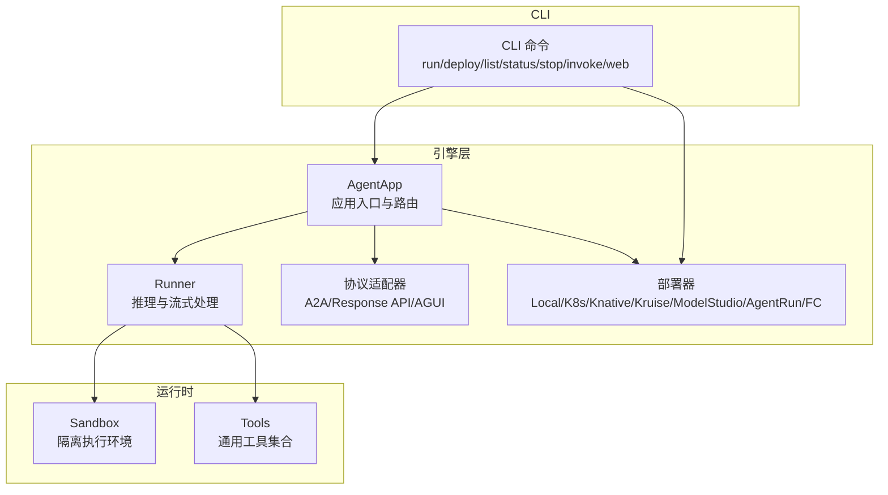
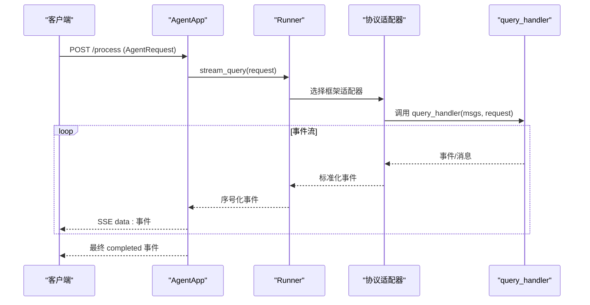
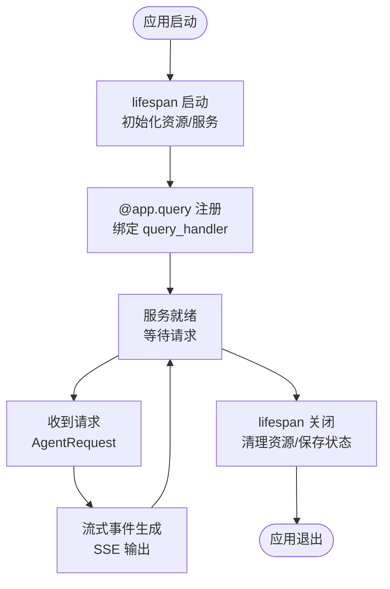
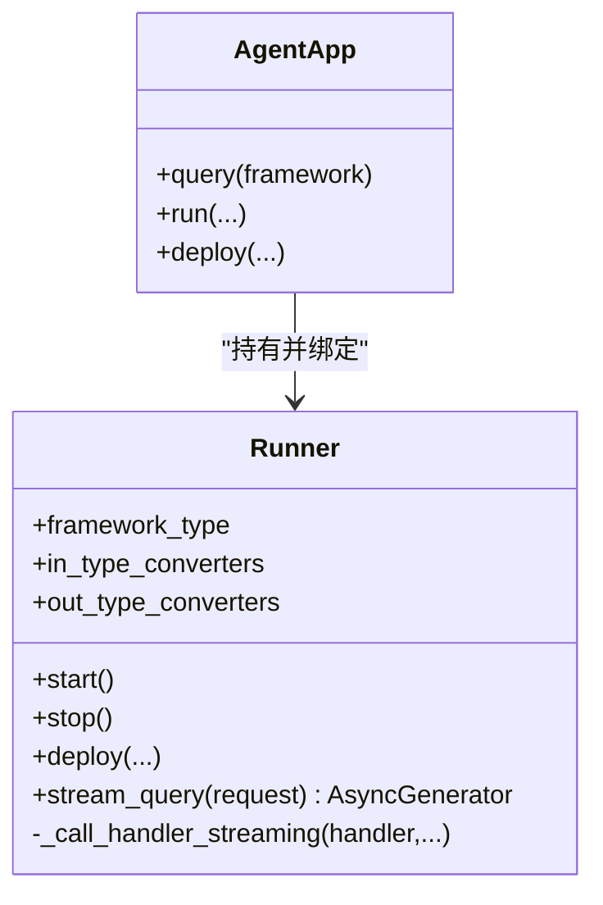
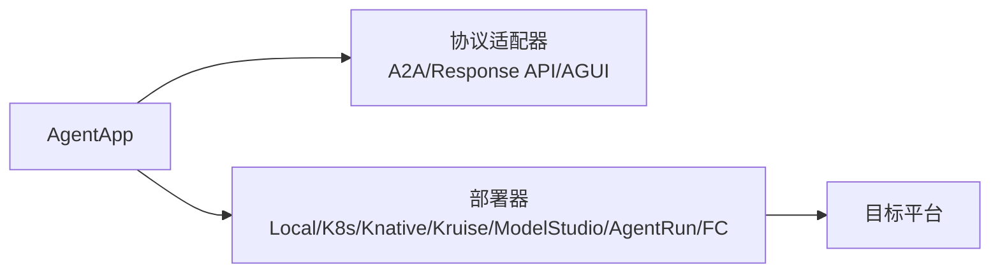
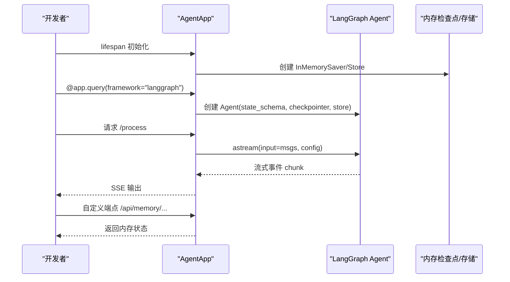
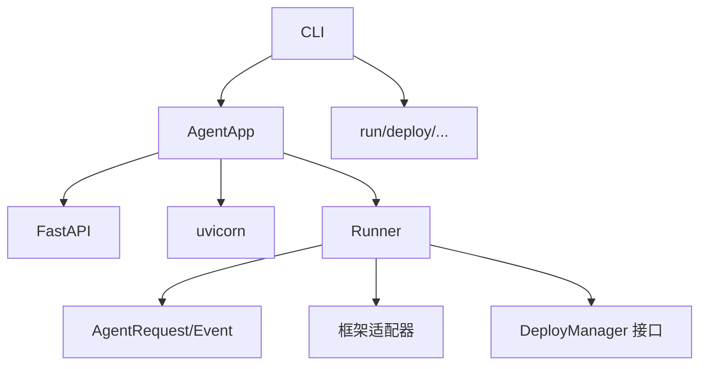

# 入门指南

<cite>
**本文引用的文件**
- [README.md](file://README.md)
- [agent_app.py](file://src/agentscope_runtime/engine/app/agent_app.py)
- [runner.py](file://src/agentscope_runtime/engine/runner.py)
- [base.py](file://src/agentscope_runtime/engine/deployers/base.py)
- [agent_schemas.py](file://src/agentscope_runtime/engine/schemas/agent_schemas.py)
- [logging.py](file://src/agentscope_runtime/common/utils/logging.py)
- [cli.py](file://src/agentscope_runtime/cli/cli.py)
- [run_langgraph_agent.py](file://examples/integrations/langgraph/run_langgraph_agent.py)
- [local_deploy_config.yaml](file://examples/deployments/local_deploy_config.yaml)
- [agent_app.md](file://cookbook/zh/agent_app.md)
</cite>

## 目录
1. [简介](#简介)
2. [项目结构](#项目结构)
3. [核心组件](#核心组件)
4. [架构总览](#架构总览)
5. [详细组件分析](#详细组件分析)
6. [依赖分析](#依赖分析)
7. [性能考虑](#性能考虑)
8. [故障排查指南](#故障排查指南)
9. [结论](#结论)
10. [附录](#附录)

## 简介
本指南面向具备 Python 基础但对智能体开发不熟悉的开发者，带你从零开始掌握 AgentScope Runtime 的智能体应用开发。你将学会：
- 智能体应用开发的基础概念与三阶段开发模式：初始化、查询、关闭
- 使用 AgentApp 构建生产级的 Agent-as-a-Service API
- 项目结构设计、配置管理、错误处理与性能优化
- 多个实战场景示例与最佳实践

## 项目结构
AgentScope Runtime 采用分层清晰的工程组织：
- engine 层：核心引擎，包含 AgentApp、Runner、协议适配器、部署器、追踪与服务工厂
- sandbox 层：沙箱工具与运行环境管理
- tools 层：通用工具库（搜索、RAG、实时语音、图像生成等）
- cli 层：命令行工具，统一管理生命周期与部署
- examples 与 cookbook：示例与中文教程，覆盖从入门到进阶的完整路径

图示来源
- [agent_app.py](file://src/agentscope_runtime/engine/app/agent_app.py)
- [runner.py](file://src/agentscope_runtime/engine/runner.py)
- [base.py](file://src/agentscope_runtime/engine/deployers/base.py)
- [cli.py](file://src/agentscope_runtime/cli/cli.py)

章节来源
- [README.md](file://README.md)
- [agent_app.py](file://src/agentscope_runtime/engine/app/agent_app.py)
- [runner.py](file://src/agentscope_runtime/engine/runner.py)
- [base.py](file://src/agentscope_runtime/engine/deployers/base.py)
- [cli.py](file://src/agentscope_runtime/cli/cli.py)

## 核心组件
- AgentApp：继承自 FastAPI，负责生命周期管理、路由注册、协议适配、流式输出、任务中断与部署集成
- Runner：核心推理执行器，负责将用户请求适配到不同框架（AgentScope、LangGraph、AutoGen、AGNO 等），并产出标准化事件流
- 协议适配器：统一接入 A2A、Response API、AGUI 等协议，提供多端兼容的 API 形态
- 部署器：抽象部署接口，支持本地、Kubernetes、Knative、Kruise、ModelStudio、AgentRun、FC 等
- CLI：统一命令行入口，提供 run、deploy、list、status、stop、invoke、web 等子命令

章节来源
- [agent_app.py](file://src/agentscope_runtime/engine/app/agent_app.py)
- [runner.py](file://src/agentscope_runtime/engine/runner.py)
- [base.py](file://src/agentscope_runtime/engine/deployers/base.py)

## 架构总览
AgentApp 以 FastAPI 为基础，结合 Runner 的多框架适配能力，提供统一的 Agent-as-a-Service API。其核心流程：
- 生命周期：通过 lifespan 管理启动/关闭钩子，自动挂载 Runner、协议适配器与中断服务
- 请求处理：将请求转为 AgentRequest，按框架类型选择对应适配器，驱动 query_handler 产生事件流
- 输出：统一序列化为 SSE 格式，支持流式与后台任务模式
- 部署：通过 deploy() 方法对接多种部署器，快速上线

图示来源
- [agent_app.py](file://src/agentscope_runtime/engine/app/agent_app.py)
- [runner.py](file://src/agentscope_runtime/engine/runner.py)

章节来源
- [agent_app.py](file://src/agentscope_runtime/engine/app/agent_app.py)
- [runner.py](file://src/agentscope_runtime/engine/runner.py)

## 详细组件分析

### AgentApp：三阶段开发模式
AgentApp 的三阶段开发模式对应 FastAPI 的 lifespan 生命周期：
- 初始化（lifespan startup）：加载会话/状态服务、模型、连接池等资源
- 查询（请求处理）：注册 @app.query(framework=...)，实现 query_handler，处理请求并流式输出
- 关闭（lifespan shutdown）：释放资源、清理连接、保存状态

图示来源
- [agent_app.py](file://src/agentscope_runtime/engine/app/agent_app.py)
- [agent_app.md](file://cookbook/zh/agent_app.md)

章节来源
- [agent_app.py](file://src/agentscope_runtime/engine/app/agent_app.py)
- [agent_app.md](file://cookbook/zh/agent_app.md)

### Runner：多框架适配与事件流
Runner 负责：
- 校验框架类型与健康状态
- 将请求转为 AgentRequest，分配 session_id/user_id
- 选择对应框架的消息适配器，将 query_handler 的结果标准化为事件流
- 统一序列化与错误包装，输出 completed/failed 等最终状态

图示来源
- [runner.py](file://src/agentscope_runtime/engine/runner.py)
- [agent_app.py](file://src/agentscope_runtime/engine/app/agent_app.py)

章节来源
- [runner.py](file://src/agentscope_runtime/engine/runner.py)

### 协议适配器与部署器
- 协议适配器：A2A、Response API、AGUI，默认自动挂载，支持 OpenAPI 组件注入
- 部署器：统一 DeployManager 接口，支持本地、Kubernetes、Knative、Kruise、ModelStudio、AgentRun、FC 等

图示来源
- [agent_app.py](file://src/agentscope_runtime/engine/app/agent_app.py)
- [base.py](file://src/agentscope_runtime/engine/deployers/base.py)

章节来源
- [agent_app.py](file://src/agentscope_runtime/engine/app/agent_app.py)
- [base.py](file://src/agentscope_runtime/engine/deployers/base.py)

### 实战示例：LangGraph 集成
LangGraph 示例展示了如何使用 AgentApp 的 lifespan、init/shutdown 与 query(framework="langgraph")，并自定义端点访问内存。

图示来源
- [run_langgraph_agent.py](file://examples/integrations/langgraph/run_langgraph_agent.py)
- [agent_app.py](file://src/agentscope_runtime/engine/app/agent_app.py)

章节来源
- [run_langgraph_agent.py](file://examples/integrations/langgraph/run_langgraph_agent.py)

## 依赖分析
- AgentApp 依赖 FastAPI、uvicorn、协议适配器与 Runner
- Runner 依赖部署器接口、协议适配器、追踪与消息工具
- CLI 依赖各命令模块，统一入口

图示来源
- [agent_app.py](file://src/agentscope_runtime/engine/app/agent_app.py)
- [runner.py](file://src/agentscope_runtime/engine/runner.py)
- [base.py](file://src/agentscope_runtime/engine/deployers/base.py)
- [cli.py](file://src/agentscope_runtime/cli/cli.py)

章节来源
- [agent_app.py](file://src/agentscope_runtime/engine/app/agent_app.py)
- [runner.py](file://src/agentscope_runtime/engine/runner.py)
- [base.py](file://src/agentscope_runtime/engine/deployers/base.py)
- [cli.py](file://src/agentscope_runtime/cli/cli.py)

## 性能考虑
- 流式输出：使用 SSE 降低延迟，提升用户体验
- 后台任务：启用 stream_task 模式，支持长耗时查询的异步执行与轮询查询
- 中断管理：分布式 Redis 后端支持跨节点中断，避免无效计算
- 部署弹性：支持本地与 Kubernetes/Knative/Kruise 等弹性扩缩容
- 日志与追踪：统一日志格式与追踪埋点，便于定位性能瓶颈

章节来源
- [agent_app.py](file://src/agentscope_runtime/engine/app/agent_app.py)
- [runner.py](file://src/agentscope_runtime/engine/runner.py)
- [logging.py](file://src/agentscope_runtime/common/utils/logging.py)

## 故障排查指南
- 生命周期钩子
  - 使用 lifespan 替代废弃的 @app.init/@app.shutdown，确保资源正确初始化与释放
- 请求格式
  - 确保 AgentRequest.input 的 content 为列表而非字符串
- 错误处理
  - Runner 会将非业务异常包装为统一错误事件；可在流式生成器中抛出异常，自动封装为 SSE 错误事件
- 日志
  - 使用统一日志格式，便于定位问题；可通过环境变量调整 TRACE_ENABLE_LOG 控制追踪输出

章节来源
- [agent_app.md](file://cookbook/zh/agent_app.md)
- [runner.py](file://src/agentscope_runtime/engine/runner.py)
- [logging.py](file://src/agentscope_runtime/common/utils/logging.py)

## 结论
通过 AgentApp 的三阶段开发模式与 Runner 的多框架适配能力，你可以快速构建稳定、可观测、可部署的智能体服务。建议从最小示例入手，逐步引入生命周期管理、状态服务、中断与后台任务，并结合 CLI 与多种部署器完成从开发到生产的全流程。

## 附录

### 快速开始：最小 AgentApp 示例
- 定义 lifespan：在启动时初始化会话/状态服务，在关闭时清理
- 创建 AgentApp：传入 lifespan
- 定义查询逻辑：使用 @app.query(framework="agentscope") 注册 query_handler
- 运行服务：调用 app.run(host, port)

章节来源
- [README.md](file://README.md)
- [agent_app.md](file://cookbook/zh/agent_app.md)

### 部署配置示例
- 本地部署配置：通过 YAML 设置 host、port、环境变量等
- CLI 部署：使用 agentscope deploy 子命令，结合配置文件一键部署

章节来源
- [local_deploy_config.yaml](file://examples/deployments/local_deploy_config.yaml)
- [cli.py](file://src/agentscope_runtime/cli/cli.py)