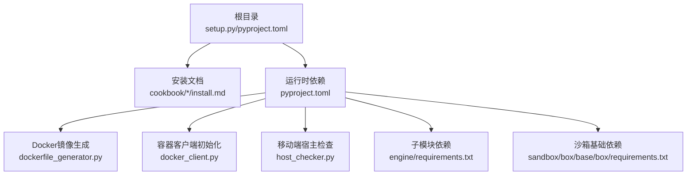
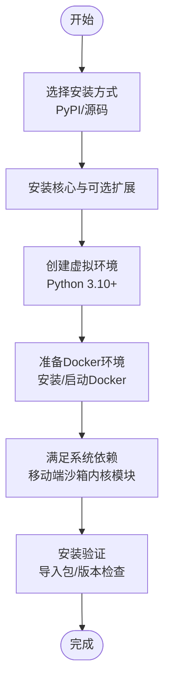
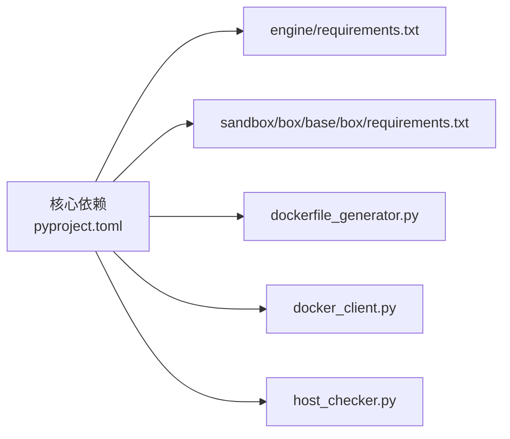

# 安装与环境配置

<cite>
**本文引用的文件**
- [README.md](file://README.md)
- [README_zh.md](file://README_zh.md)
- [pyproject.toml](file://pyproject.toml)
- [setup.py](file://setup.py)
- [cookbook/en/install.md](file://cookbook/en/install.md)
- [cookbook/zh/install.md](file://cookbook/zh/install.md)
- [src/agentscope_runtime/engine/deployers/utils/docker_image_utils/dockerfile_generator.py](file://src/agentscope_runtime/engine/deployers/utils/docker_image_utils/dockerfile_generator.py)
- [src/agentscope_runtime/common/container_clients/docker_client.py](file://src/agentscope_runtime/common/container_clients/docker_client.py)
- [src/agentscope_runtime/sandbox/box/mobile/box/host_checker.py](file://src/agentscope_runtime/sandbox/box/mobile/box/host_checker.py)
- [src/agentscope_runtime/engine/requirements.txt](file://src/agentscope_runtime/engine/requirements.txt)
- [src/agentscope_runtime/sandbox/box/base/box/requirements.txt](file://src/agentscope_runtime/sandbox/box/base/box/requirements.txt)
</cite>

## 目录
1. [简介](#简介)
2. [项目结构](#项目结构)
3. [核心组件](#核心组件)
4. [架构总览](#架构总览)
5. [详细组件分析](#详细组件分析)
6. [依赖分析](#依赖分析)
7. [性能考虑](#性能考虑)
8. [故障排查指南](#故障排查指南)
9. [结论](#结论)
10. [附录](#附录)

## 简介
本指南面向首次接触 AgentScope Runtime 的开发者，提供从零开始的安装与环境配置方案。内容覆盖：
- Python 版本要求（3.10+）
- 本地开发环境搭建（虚拟环境、依赖安装、环境变量）
- Docker 与系统依赖配置
- Windows/macOS/Linux 三平台安装要点
- 常见安装问题排查（权限、网络代理、镜像源）
- 安装验证与基础环境测试命令

## 项目结构
AgentScope Runtime 的安装与环境配置涉及以下关键位置：
- 根目录安装脚本与元数据：setup.py、pyproject.toml
- 官方安装文档：cookbook/en/install.md、cookbook/zh/install.md
- 运行时依赖与可选扩展：pyproject.toml 中的 dependencies 与 optional-dependencies
- Docker 镜像构建与系统依赖：dockerfile_generator.py
- 容器客户端与 Docker 初始化：docker_client.py
- 移动端沙箱宿主检查：host_checker.py
- 子模块依赖清单：engine/requirements.txt、sandbox/box/base/box/requirements.txt

图表来源
- [setup.py](file://setup.py)
- [pyproject.toml](file://pyproject.toml)
- [dockerfile_generator.py](file://src/agentscope_runtime/engine/deployers/utils/docker_image_utils/dockerfile_generator.py)
- [docker_client.py](file://src/agentscope_runtime/common/container_clients/docker_client.py)
- [host_checker.py](file://src/agentscope_runtime/sandbox/box/mobile/box/host_checker.py)
- [engine/requirements.txt](file://src/agentscope_runtime/engine/requirements.txt)
- [sandbox/box/base/box/requirements.txt](file://src/agentscope_runtime/sandbox/box/base/box/requirements.txt)

章节来源
- [setup.py](file://setup.py)
- [pyproject.toml](file://pyproject.toml)
- [cookbook/en/install.md](file://cookbook/en/install.md)
- [cookbook/zh/install.md](file://cookbook/zh/install.md)

## 核心组件
- Python 版本与包管理器
  - 要求：Python 3.10 或更高版本
  - 推荐：pip 或 uv
- 安装方式
  - PyPI 安装（核心与可选扩展）
  - 源码安装（开发/贡献场景）
- 运行时依赖
  - 核心依赖：FastAPI、Uvicorn、Docker SDK、Redis、DashScope 等
  - 可选扩展：LangChain、AutoGen、Azure 语音、阿里云服务等
- Docker 与系统依赖
  - Docker 镜像构建模板包含系统包安装与国内镜像配置
  - 容器客户端负责 Docker 初始化与错误提示
  - 移动端沙箱对 Linux 内核模块有特殊要求

章节来源
- [pyproject.toml](file://pyproject.toml)
- [dockerfile_generator.py](file://src/agentscope_runtime/engine/deployers/utils/docker_image_utils/dockerfile_generator.py)
- [docker_client.py](file://src/agentscope_runtime/common/container_clients/docker_client.py)
- [host_checker.py](file://src/agentscope_runtime/sandbox/box/mobile/box/host_checker.py)

## 架构总览
下图展示安装与环境配置的关键流程：从选择安装方式到依赖解析、Docker 准备、系统依赖满足，再到最终验证。

图表来源
- [cookbook/en/install.md](file://cookbook/en/install.md)
- [cookbook/zh/install.md](file://cookbook/zh/install.md)
- [docker_client.py](file://src/agentscope_runtime/common/container_clients/docker_client.py)
- [host_checker.py](file://src/agentscope_runtime/sandbox/box/mobile/box/host_checker.py)

## 详细组件分析

### Python 与包管理器
- 版本要求：Python 3.10+
- 包管理器：pip 或 uv
- 安装命令参考：
  - 核心安装：pip install agentscope-runtime
  - 可选扩展：pip install "agentscope-runtime[ext]"
  - 预览版本：pip install --pre agentscope-runtime
  - 源码安装：pip install .

章节来源
- [README.md](file://README.md)
- [README_zh.md](file://README_zh.md)
- [cookbook/en/install.md](file://cookbook/en/install.md)
- [cookbook/zh/install.md](file://cookbook/zh/install.md)

### 依赖与可选扩展
- 核心依赖（摘录）：FastAPI、Uvicorn、Docker SDK、Redis、DashScope、Pydantic、Requests、Celery、Kubernetes 客户端等
- 可选扩展（摘录）：LangChain、AutoGen、Azure 语音、阿里云服务、BoxLite、AG-UI 协议等
- 开发依赖：pytest、sphinx、mermaid、aiohttp 等

章节来源
- [pyproject.toml](file://pyproject.toml)

### Docker 与系统依赖
- Docker 镜像构建模板
  - 使用阿里云 Debian 源替换默认源，加速依赖安装
  - 自动安装 gcc、curl 等常用系统依赖
  - 支持健康检查与非 root 用户运行
- 容器客户端初始化
  - 通过 docker.from_env() 初始化客户端
  - 若初始化失败，提供常见解决方案（Docker 是否运行、权限、Colima 环境变量）

章节来源
- [dockerfile_generator.py](file://src/agentscope_runtime/engine/deployers/utils/docker_image_utils/dockerfile_generator.py)
- [docker_client.py](file://src/agentscope_runtime/common/container_clients/docker_client.py)

### 移动端沙箱宿主检查
- Linux 主机要求：加载 binder 与 ashmem 内核模块
- Windows 主机要求：Docker Desktop 使用 WSL2 后端，并确保 WSL 内核具备所需模块
- 若检测失败，会抛出明确的错误信息与修复步骤

章节来源
- [host_checker.py](file://src/agentscope_runtime/sandbox/box/mobile/box/host_checker.py)

### 安装验证与环境测试
- 导入并打印版本：import agentscope_runtime；print(f"AgentScope Runtime {agentscope_runtime.__version__} is ready!")
- 基础连通性测试：curl 访问本地 Agent API 端点（参考 README 中的示例）

章节来源
- [cookbook/en/install.md](file://cookbook/en/install.md)
- [cookbook/zh/install.md](file://cookbook/zh/install.md)
- [README.md](file://README.md)
- [README_zh.md](file://README_zh.md)

## 依赖分析
- 运行时依赖与可选扩展的关系
  - 核心依赖是运行 AgentApp 与沙箱的基础
  - 可选扩展用于增强部署与第三方服务集成能力
- 子模块依赖
  - engine/requirements.txt：python-dotenv
  - sandbox/box/base/box/requirements.txt：ipython、fastapi、uvicorn、pydantic、requests、mcp、aiofiles、uv、gitpython

图表来源
- [pyproject.toml](file://pyproject.toml)
- [engine/requirements.txt](file://src/agentscope_runtime/engine/requirements.txt)
- [sandbox/box/base/box/requirements.txt](file://src/agentscope_runtime/sandbox/box/base/box/requirements.txt)
- [dockerfile_generator.py](file://src/agentscope_runtime/engine/deployers/utils/docker_image_utils/dockerfile_generator.py)
- [docker_client.py](file://src/agentscope_runtime/common/container_clients/docker_client.py)
- [host_checker.py](file://src/agentscope_runtime/sandbox/box/mobile/box/host_checker.py)

章节来源
- [pyproject.toml](file://pyproject.toml)
- [engine/requirements.txt](file://src/agentscope_runtime/engine/requirements.txt)
- [sandbox/box/base/box/requirements.txt](file://src/agentscope_runtime/sandbox/box/base/box/requirements.txt)

## 性能考虑
- 使用 uv 作为包管理器可提升安装速度（README 中提及）
- 在容器镜像构建中使用国内镜像源可减少网络延迟
- 移动端沙箱在 ARM64 架构上可能存在兼容性与性能问题，建议在 x86_64 上运行

章节来源
- [README.md](file://README.md)
- [README_zh.md](file://README_zh.md)
- [dockerfile_generator.py](file://src/agentscope_runtime/engine/deployers/utils/docker_image_utils/dockerfile_generator.py)

## 故障排查指南

### Docker 相关
- Docker 未运行或权限不足
  - 现象：容器客户端初始化失败
  - 解决：确保 Docker 正常运行；检查用户权限；若使用 Colima，设置 DOCKER_HOST 环境变量
- 镜像拉取缓慢或失败
  - 现象：拉取沙箱镜像超时
  - 解决：切换镜像源（Registry/Namespace/Tag 环境变量），参考 README 中的镜像配置说明

章节来源
- [docker_client.py](file://src/agentscope_runtime/common/container_clients/docker_client.py)
- [README.md](file://README.md)
- [README_zh.md](file://README_zh.md)

### 移动端沙箱（Linux/Windows）
- Linux：缺少 binder/ashmem 内核模块
  - 解决：安装 linux-modules-extra 并加载 binder_linux、ashmem_linux
- Windows：WSL2 环境缺少所需模块
  - 解决：确认 Docker Desktop 使用 WSL2；更新 WSL；验证 lsmod 输出包含 binder_linux

章节来源
- [host_checker.py](file://src/agentscope_runtime/sandbox/box/mobile/box/host_checker.py)

### 网络与代理
- 现象：pip 安装缓慢或超时
  - 解决：使用国内镜像源（如阿里云、清华源）；或配置企业代理
- 现象：Docker Hub 拉取受限
  - 解决：配置镜像仓库（Registry）与命名空间（Namespace），并设置 Tag

章节来源
- [dockerfile_generator.py](file://src/agentscope_runtime/engine/deployers/utils/docker_image_utils/dockerfile_generator.py)
- [README.md](file://README.md)
- [README_zh.md](file://README_zh.md)

### 权限问题
- 现象：容器启动失败或端口占用
  - 解决：以管理员权限运行；检查端口占用；确保非 root 用户具备必要权限

章节来源
- [docker_client.py](file://src/agentscope_runtime/common/container_clients/docker_client.py)

### 安装验证
- 导入包并打印版本
- 使用 curl 访问本地 Agent API 端点，验证 SSE 流式输出

章节来源
- [cookbook/en/install.md](file://cookbook/en/install.md)
- [cookbook/zh/install.md](file://cookbook/zh/install.md)
- [README.md](file://README.md)
- [README_zh.md](file://README_zh.md)

## 结论
通过本指南，您可以在 Windows、macOS、Linux 三大平台上完成 AgentScope Runtime 的安装与环境配置。建议优先使用 Python 3.10+ 与 uv，确保 Docker 正常运行，并根据平台差异满足系统依赖。遇到问题时，优先参考本指南的故障排查章节与相关源码注释，以快速定位并解决问题。

## 附录

### 三平台安装要点
- Windows
  - 使用 WSL2 后端的 Docker Desktop
  - 安装 Python 3.10+ 与 pip/uv
  - 如需移动端沙箱，确保 WSL 内核模块可用
- macOS
  - 安装并启动 Docker Desktop
  - 使用 Homebrew 安装 Python 3.10+（可选）
  - 如需移动端沙箱，注意 macOS 不直接支持 binder/ashmem，建议使用 Docker Desktop 的 WSL2 后端
- Linux
  - 安装并启动 Docker
  - 安装 Python 3.10+ 与 pip/uv
  - 移动端沙箱需加载 binder 与 ashmem 内核模块

章节来源
- [host_checker.py](file://src/agentscope_runtime/sandbox/box/mobile/box/host_checker.py)
- [docker_client.py](file://src/agentscope_runtime/common/container_clients/docker_client.py)