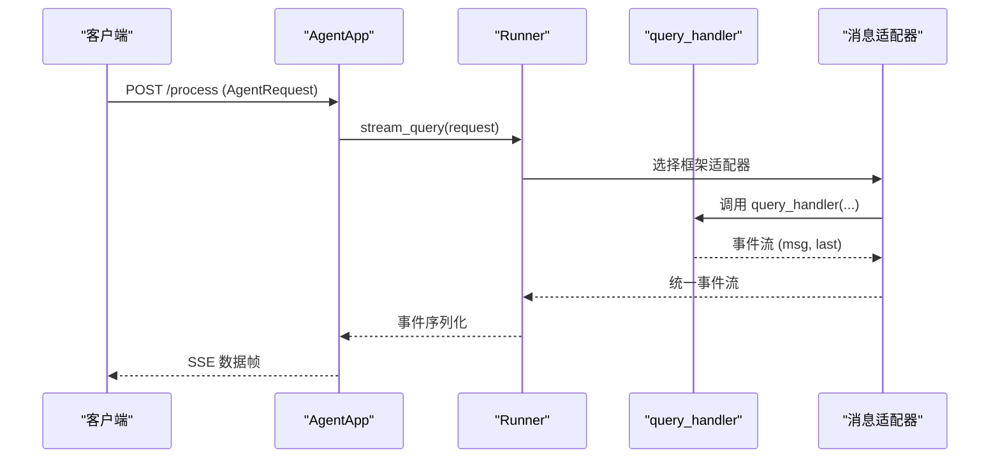
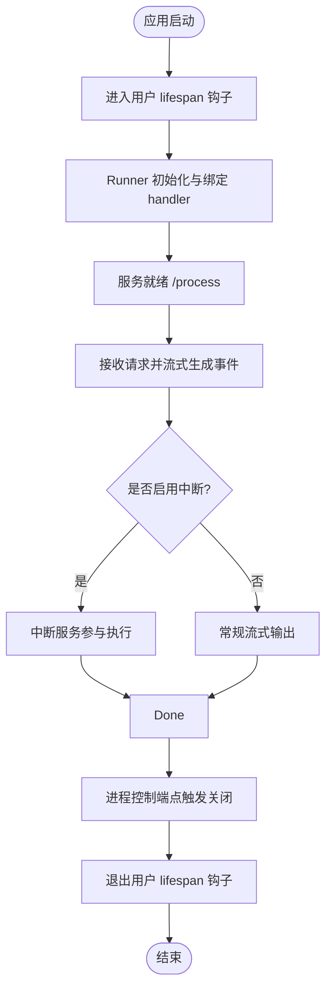
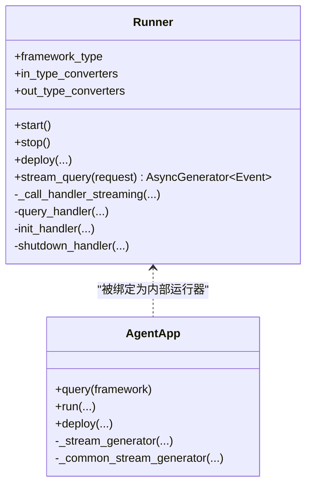
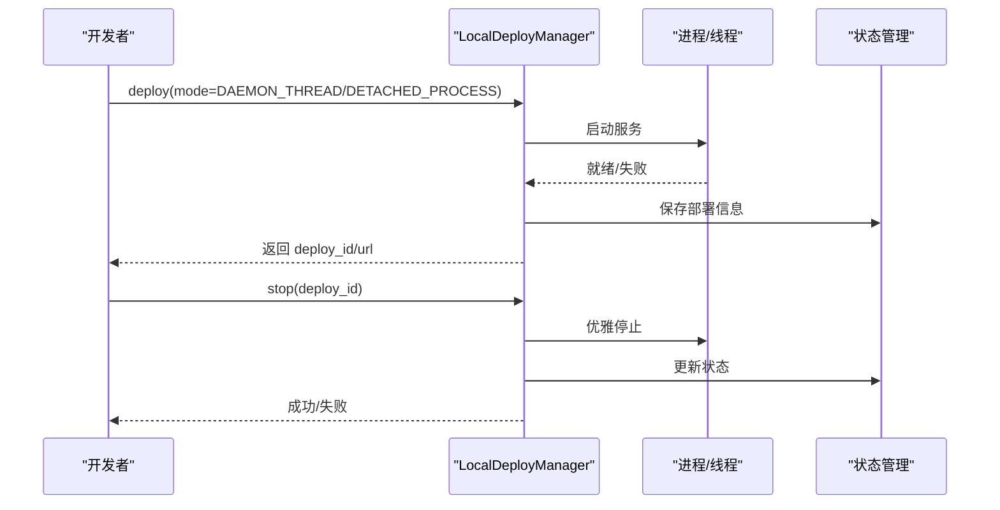
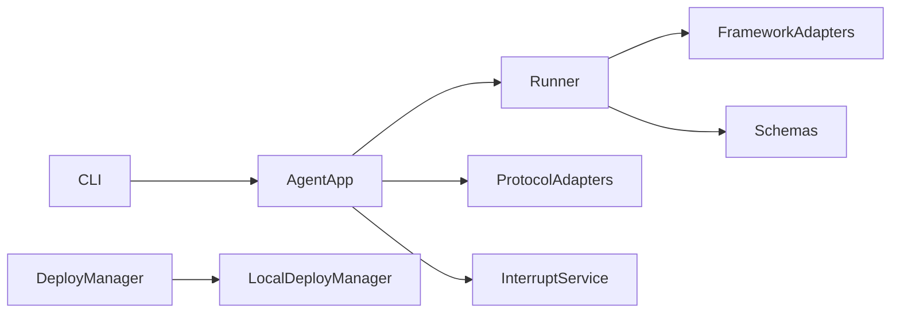

# 开发流程指南

<cite>
**本文引用的文件**   
- [README.md](file://README.md)
- [src/agentscope_runtime/__init__.py](file://src/agentscope_runtime/__init__.py)
- [src/agentscope_runtime/engine/__init__.py](file://src/agentscope_runtime/engine/__init__.py)
- [src/agentscope_runtime/engine/app/agent_app.py](file://src/agentscope_runtime/engine/app/agent_app.py)
- [src/agentscope_runtime/engine/runner.py](file://src/agentscope_runtime/engine/runner.py)
- [src/agentscope_runtime/engine/deployers/base.py](file://src/agentscope_runtime/engine/deployers/base.py)
- [src/agentscope_runtime/engine/deployers/local_deployer.py](file://src/agentscope_runtime/engine/deployers/local_deployer.py)
- [src/agentscope_runtime/cli/cli.py](file://src/agentscope_runtime/cli/cli.py)
- [src/agentscope_runtime/common/utils/logging.py](file://src/agentscope_runtime/common/utils/logging.py)
- [src/agentscope_runtime/sandbox/__init__.py](file://src/agentscope_runtime/sandbox/__init__.py)
- [cookbook/zh/concept.md](file://cookbook/zh/concept.md)
- [cookbook/zh/quickstart.md](file://cookbook/zh/quickstart.md)
- [examples/integrations/langgraph/run_langgraph_agent.py](file://examples/integrations/langgraph/run_langgraph_agent.py)
- [examples/integrations/ag-ui/agent.py](file://examples/integrations/ag-ui/agent.py)
</cite>

## 目录
1. [简介](#简介)
2. [项目结构](#项目结构)
3. [核心组件](#核心组件)
4. [架构总览](#架构总览)
5. [详细组件分析](#详细组件分析)
6. [依赖关系分析](#依赖关系分析)
7. [性能考虑](#性能考虑)
8. [故障排查指南](#故障排查指南)
9. [结论](#结论)
10. [附录](#附录)

## 简介
本指南面向使用 AgentScope Runtime 的开发者，系统讲解从本地开发到生产部署的完整流程，覆盖以下主题：
- 智能体应用的三阶段开发模式：初始化（lifespan/init）、查询（query）、关闭（shutdown）
- 项目结构设计原则与模块职责
- 配置文件管理与环境变量
- 错误处理与可观测性
- 性能优化策略
- 从代码编写、测试验证到打包发布的全流程
- 多智能体协作、工具集成、状态管理等典型场景示例
- 开发工具与调试技巧

## 项目结构
AgentScope Runtime 采用模块化分层架构，核心目录与职责概览：
- src/agentscope_runtime/engine：引擎核心，包含 AgentApp、Runner、部署器、适配器、Schema、Tracing 等
- src/agentscope_runtime/sandbox：沙箱体系，提供浏览器、GUI、文件系统、移动端等隔离执行环境
- src/agentscope_runtime/tools：内置工具集（RAG、搜索、实时语音、图像生成等）
- src/agentscope_runtime/cli：命令行工具，统一管理生命周期与部署
- examples：多框架集成示例（LangGraph、AG-UI 等）
- cookbook：中文概念与快速开始文档

```mermaid
graph TB
subgraph 引擎核心
A["AgentApp<br/>应用入口"]
R["Runner<br/>运行时编排"]
D["DeployManager<br/>部署接口"]
L["LocalDeployManager<br/>本地部署"]
S["Schemas<br/>请求/响应模型"]
T["Tracing<br/>追踪与度量"]
end
subgraph 沙箱
SB["Sandbox<br/>浏览器/GUI/文件系统/移动端"]
end
subgraph 工具
UT["Tools<br/>RAG/搜索/支付/生成"]
end
subgraph CLI
CLI["CLI<br/>命令行入口"]
end
A --> R
R --> D
D --> L
A --> S
A --> T
R --> UT
R --> SB
CLI --> A
```

图示来源
- [cookbook/zh/concept.md:23-122](file://cookbook/zh/concept.md#L23-L122)
- [src/agentscope_runtime/engine/app/agent_app.py:60-220](file://src/agentscope_runtime/engine/app/agent_app.py#L60-L220)
- [src/agentscope_runtime/engine/runner.py:46-120](file://src/agentscope_runtime/engine/runner.py#L46-L120)
- [src/agentscope_runtime/engine/deployers/local_deployer.py:27-88](file://src/agentscope_runtime/engine/deployers/local_deployer.py#L27-L88)
- [src/agentscope_runtime/sandbox/__init__.py:6-32](file://src/agentscope_runtime/sandbox/__init__.py#L6-L32)

章节来源
- [cookbook/zh/concept.md:19-187](file://cookbook/zh/concept.md#L19-L187)
- [src/agentscope_runtime/engine/app/agent_app.py:60-220](file://src/agentscope_runtime/engine/app/agent_app.py#L60-L220)
- [src/agentscope_runtime/engine/runner.py:46-120](file://src/agentscope_runtime/engine/runner.py#L46-L120)
- [src/agentscope_runtime/engine/deployers/local_deployer.py:27-88](file://src/agentscope_runtime/engine/deployers/local_deployer.py#L27-L88)
- [src/agentscope_runtime/sandbox/__init__.py:6-32](file://src/agentscope_runtime/sandbox/__init__.py#L6-L32)

## 核心组件
- AgentApp：继承 FastAPI，统一注册路由、协议适配器、生命周期钩子、中断服务与任务清理；对外暴露 /process、/health、/task 等端点
- Runner：承载 query_handler，负责请求适配、流式事件生成、状态管理与异常包装
- DeployManager：抽象部署接口，LocalDeployManager 实现本地/分离进程部署
- Sandbox：提供多种隔离执行环境，支持同步/异步版本
- CLI：统一入口，提供 chat/run/web/deploy/list/status/stop/invoke/sandbox 等命令

章节来源
- [src/agentscope_runtime/engine/app/agent_app.py:60-220](file://src/agentscope_runtime/engine/app/agent_app.py#L60-L220)
- [src/agentscope_runtime/engine/runner.py:46-120](file://src/agentscope_runtime/engine/runner.py#L46-L120)
- [src/agentscope_runtime/engine/deployers/base.py:9-43](file://src/agentscope_runtime/engine/deployers/base.py#L9-L43)
- [src/agentscope_runtime/engine/deployers/local_deployer.py:27-88](file://src/agentscope_runtime/engine/deployers/local_deployer.py#L27-L88)
- [src/agentscope_runtime/sandbox/__init__.py:6-32](file://src/agentscope_runtime/sandbox/__init__.py#L6-L32)
- [src/agentscope_runtime/cli/cli.py:30-64](file://src/agentscope_runtime/cli/cli.py#L30-L64)

## 架构总览
AgentApp 作为应用入口，内部组合 Runner 并注入协议适配器（A2A、Response API、AG-UI）。Runner 根据框架类型选择对应的消息流适配器，将 query_handler 的结果转换为统一事件流，通过 AgentApp 的 SSE 端点返回。



图示来源
- [src/agentscope_runtime/engine/app/agent_app.py:781-800](file://src/agentscope_runtime/engine/app/agent_app.py#L781-L800)
- [src/agentscope_runtime/engine/runner.py:199-356](file://src/agentscope_runtime/engine/runner.py#L199-L356)

章节来源
- [src/agentscope_runtime/engine/app/agent_app.py:781-800](file://src/agentscope_runtime/engine/app/agent_app.py#L781-L800)
- [src/agentscope_runtime/engine/runner.py:199-356](file://src/agentscope_runtime/engine/runner.py#L199-L356)

## 详细组件分析

### AgentApp：三阶段开发模式与生命周期
- 初始化阶段（lifespan/init）
  - 使用 lifespan 钩子完成资源初始化（如会话、状态服务）
  - Runner 生命周期与用户 lifespan 组合，确保资源有序进入/退出
- 查询阶段（query）
  - 通过装饰器注册 query_handler，并指定框架类型
  - 统一处理请求、生成事件序列、支持中断与任务清理
- 关闭阶段（shutdown）
  - 通过 lifespan 钩子或内置进程控制端点触发优雅关闭



图示来源
- [src/agentscope_runtime/engine/app/agent_app.py:248-339](file://src/agentscope_runtime/engine/app/agent_app.py#L248-L339)
- [src/agentscope_runtime/engine/app/agent_app.py:643-703](file://src/agentscope_runtime/engine/app/agent_app.py#L643-L703)
- [src/agentscope_runtime/engine/app/agent_app.py:601-627](file://src/agentscope_runtime/engine/app/agent_app.py#L601-L627)

章节来源
- [src/agentscope_runtime/engine/app/agent_app.py:248-339](file://src/agentscope_runtime/engine/app/agent_app.py#L248-L339)
- [src/agentscope_runtime/engine/app/agent_app.py:643-703](file://src/agentscope_runtime/engine/app/agent_app.py#L643-L703)
- [src/agentscope_runtime/engine/app/agent_app.py:601-627](file://src/agentscope_runtime/engine/app/agent_app.py#L601-L627)

### Runner：请求适配与事件流
- 校验框架类型与健康状态
- 解析请求、分配 session/user ID、生成序列号
- 根据框架类型选择适配器（AgentScope/LangGraph/AGNO/Text 等）
- 包装异常为统一错误对象，输出完成/失败事件



图示来源
- [src/agentscope_runtime/engine/runner.py:46-120](file://src/agentscope_runtime/engine/runner.py#L46-L120)
- [src/agentscope_runtime/engine/runner.py:199-356](file://src/agentscope_runtime/engine/runner.py#L199-L356)
- [src/agentscope_runtime/engine/app/agent_app.py:722-740](file://src/agentscope_runtime/engine/app/agent_app.py#L722-L740)

章节来源
- [src/agentscope_runtime/engine/runner.py:199-356](file://src/agentscope_runtime/engine/runner.py#L199-L356)
- [src/agentscope_runtime/engine/app/agent_app.py:722-740](file://src/agentscope_runtime/engine/app/agent_app.py#L722-L740)

### 部署器：本地与分离进程模式
- LocalDeployManager 支持两类模式：
  - DAEMON_THREAD：在主线程内启动 uvicorn 服务线程
  - DETACHED_PROCESS：打包项目并以后台进程方式启动，支持 PID 文件与日志管理
- 提供统一的部署/停止接口，记录部署状态并支持健康检查



图示来源
- [src/agentscope_runtime/engine/deployers/local_deployer.py:68-174](file://src/agentscope_runtime/engine/deployers/local_deployer.py#L68-L174)
- [src/agentscope_runtime/engine/deployers/local_deployer.py:415-510](file://src/agentscope_runtime/engine/deployers/local_deployer.py#L415-L510)

章节来源
- [src/agentscope_runtime/engine/deployers/local_deployer.py:68-174](file://src/agentscope_runtime/engine/deployers/local_deployer.py#L68-L174)
- [src/agentscope_runtime/engine/deployers/local_deployer.py:415-510](file://src/agentscope_runtime/engine/deployers/local_deployer.py#L415-L510)

### 沙箱：工具安全执行
- 提供 Base/Browser/Gui/Filesystem/Mobile/Training/Cloud/Agentbay 等沙箱
- 支持同步与异步版本，便于并发与非阻塞执行
- 可通过工具适配器将沙箱能力注入 Toolkit

章节来源
- [src/agentscope_runtime/sandbox/__init__.py:6-32](file://src/agentscope_runtime/sandbox/__init__.py#L6-L32)
- [README.md:272-455](file://README.md#L272-L455)

### CLI：统一命令行入口
- 提供 chat/run/web/deploy/list/status/stop/invoke/sandbox 等命令
- 设置 TRACE_ENABLE_LOG 环境变量以控制追踪日志输出

章节来源
- [src/agentscope_runtime/cli/cli.py:30-64](file://src/agentscope_runtime/cli/cli.py#L30-L64)

## 依赖关系分析
- AgentApp 依赖 Runner、协议适配器、中断服务与路由混入
- Runner 依赖框架适配器与事件模型
- DeployManager 抽象部署行为，LocalDeployManager 实现具体部署
- CLI 依赖 AgentApp/Runner 进行生命周期管理



图示来源
- [src/agentscope_runtime/engine/app/agent_app.py:60-220](file://src/agentscope_runtime/engine/app/agent_app.py#L60-L220)
- [src/agentscope_runtime/engine/runner.py:46-120](file://src/agentscope_runtime/engine/runner.py#L46-L120)
- [src/agentscope_runtime/engine/deployers/base.py:9-43](file://src/agentscope_runtime/engine/deployers/base.py#L9-L43)
- [src/agentscope_runtime/engine/deployers/local_deployer.py:27-88](file://src/agentscope_runtime/engine/deployers/local_deployer.py#L27-L88)
- [src/agentscope_runtime/cli/cli.py:30-64](file://src/agentscope_runtime/cli/cli.py#L30-L64)

章节来源
- [src/agentscope_runtime/engine/app/agent_app.py:60-220](file://src/agentscope_runtime/engine/app/agent_app.py#L60-L220)
- [src/agentscope_runtime/engine/runner.py:46-120](file://src/agentscope_runtime/engine/runner.py#L46-L120)
- [src/agentscope_runtime/engine/deployers/base.py:9-43](file://src/agentscope_runtime/engine/deployers/base.py#L9-L43)
- [src/agentscope_runtime/engine/deployers/local_deployer.py:27-88](file://src/agentscope_runtime/engine/deployers/local_deployer.py#L27-L88)
- [src/agentscope_runtime/cli/cli.py:30-64](file://src/agentscope_runtime/cli/cli.py#L30-L64)

## 性能考虑
- 流式输出与 SSE：通过 Runner 的流式事件与 AgentApp 的 SSE 生成器，降低首字延迟并提升用户体验
- 中断服务：分布式中断后端支持手动预emption 与状态恢复，避免长时间阻塞
- 任务清理：后台周期性清理过期任务，减少内存占用
- 并发与异步：沙箱提供异步版本，提高并发工具执行效率
- 日志与追踪：统一日志格式与追踪埋点，便于定位性能瓶颈

章节来源
- [src/agentscope_runtime/engine/app/agent_app.py:460-471](file://src/agentscope_runtime/engine/app/agent_app.py#L460-L471)
- [src/agentscope_runtime/engine/app/agent_app.py:643-703](file://src/agentscope_runtime/engine/app/agent_app.py#L643-L703)
- [src/agentscope_runtime/engine/runner.py:199-356](file://src/agentscope_runtime/engine/runner.py#L199-L356)
- [src/agentscope_runtime/common/utils/logging.py:31-44](file://src/agentscope_runtime/common/utils/logging.py#L31-L44)

## 故障排查指南
- 生命周期钩子异常
  - 用户 lifespan 钩子抛出异常会被记录并中断应用运行
  - after_finish 钩子异常会被捕获并记录，不影响 Runner 清理
- Runner 未启动或框架类型非法
  - stream_query 会校验 Runner 健康状态与框架类型，非法时抛出明确错误
- 部署失败
  - LocalDeployManager 在超时或进程异常时记录详细日志，便于定位
- 日志与颜色格式化
  - 统一使用 ColorFormatter 输出带路径与行号的日志，便于快速定位

章节来源
- [src/agentscope_runtime/engine/app/agent_app.py:336-339](file://src/agentscope_runtime/engine/app/agent_app.py#L336-L339)
- [src/agentscope_runtime/engine/app/agent_app.py:295-315](file://src/agentscope_runtime/engine/app/agent_app.py#L295-L315)
- [src/agentscope_runtime/engine/runner.py:214-219](file://src/agentscope_runtime/engine/runner.py#L214-L219)
- [src/agentscope_runtime/engine/deployers/local_deployer.py:339-351](file://src/agentscope_runtime/engine/deployers/local_deployer.py#L339-L351)
- [src/agentscope_runtime/common/utils/logging.py:16-28](file://src/agentscope_runtime/common/utils/logging.py#L16-L28)

## 结论
AgentScope Runtime 通过“AgentApp + Runner + 部署器”的分层设计，提供了从开发到生产的完整闭环。借助协议适配器、中断服务、任务清理与沙箱体系，开发者可以快速构建可扩展、可观测、可部署的智能体应用。建议在实际项目中遵循三阶段开发模式、合理配置生命周期钩子、利用 CLI 与部署器进行本地与远端部署，并结合日志与追踪进行持续优化。

## 附录

### 从零到一：完整开发流程
- 本地开发
  - 导入依赖、定义 lifespan、创建 AgentApp、注册 query_handler、启动服务
  - 使用 curl 或 OpenAI SDK 兼容模式进行验证
- 测试验证
  - 编写单元/集成测试，覆盖流式输出、异常处理与状态持久化
- 打包发布
  - 使用 LocalDeployManager 部署至本地或容器，或选择 K8s/Knative/Kruise 等平台
- 生产运维
  - 配置中断服务后端、任务清理、健康检查与进程控制端点

章节来源
- [cookbook/zh/quickstart.md:37-237](file://cookbook/zh/quickstart.md#L37-L237)
- [README.md:141-271](file://README.md#L141-L271)
- [README.md:538-618](file://README.md#L538-L618)

### 实战场景示例
- 多智能体协作（LangGraph）
  - 使用 AgentApp.query(framework="langgraph")，在 query_func 中驱动 LangGraph Agent，结合 Checkpoint 与 Store 实现短期/长期记忆
- 工具集成（AG-UI）
  - 通过 AGUIAdaptorConfig 注册 AG-UI 路由，结合 Toolkit 注册工具函数，实现前端对话与工具调用
- 状态管理
  - 在 lifespan 中初始化会话/状态服务，query 中读取/保存状态，保证多轮对话一致性

章节来源
- [examples/integrations/langgraph/run_langgraph_agent.py:59-107](file://examples/integrations/langgraph/run_langgraph_agent.py#L59-L107)
- [examples/integrations/ag-ui/agent.py:88-155](file://examples/integrations/ag-ui/agent.py#L88-L155)

### 开发工具与调试技巧
- CLI
  - 使用 agentscope 命令管理生命周期与部署，设置 TRACE_ENABLE_LOG 控制追踪日志
- 日志
  - 使用统一 ColorFormatter 输出，包含文件路径与行号，便于快速定位
- 部署
  - 优先使用 LocalDeployManager 进行本地验证，再迁移至容器/K8s 等平台

章节来源
- [src/agentscope_runtime/cli/cli.py:23-27](file://src/agentscope_runtime/cli/cli.py#L23-L27)
- [src/agentscope_runtime/common/utils/logging.py:31-44](file://src/agentscope_runtime/common/utils/logging.py#L31-L44)
- [src/agentscope_runtime/engine/deployers/local_deployer.py:68-174](file://src/agentscope_runtime/engine/deployers/local_deployer.py#L68-L174)