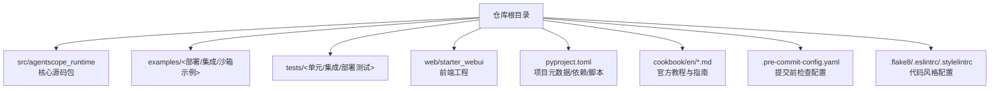
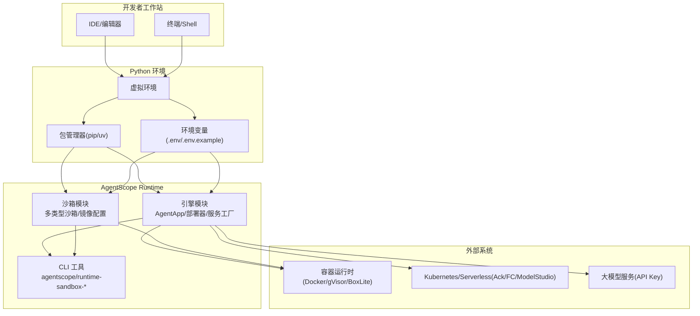
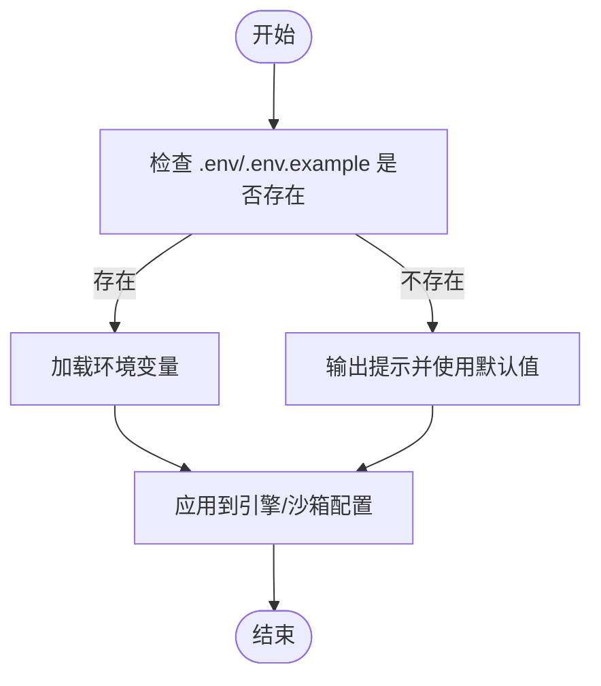
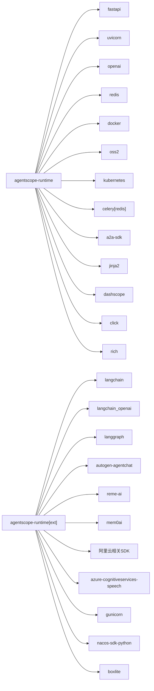

# 开发环境搭建

<cite>
**本文引用的文件**
- [README.md](file://README.md)
- [pyproject.toml](file://pyproject.toml)
- [cookbook/en/install.md](file://cookbook/en/install.md)
- [cookbook/en/quickstart.md](file://cookbook/en/quickstart.md)
- [.pre-commit-config.yaml](file://.pre-commit-config.yaml)
- [.flake8](file://.flake8)
- [.eslintrc](file://.eslintrc)
- [.stylelintrc](file://.stylelintrc)
- [CONTRIBUTING.md](file://CONTRIBUTING.md)
- [src/agentscope_runtime/version.py](file://src/agentscope_runtime/version.py)
- [src/agentscope_runtime/engine/constant.py](file://src/agentscope_runtime/engine/constant.py)
- [src/agentscope_runtime/sandbox/constant.py](file://src/agentscope_runtime/sandbox/constant.py)
- [src/agentscope_runtime/engine/requirements.txt](file://src/agentscope_runtime/engine/requirements.txt)
- [src/agentscope_runtime/sandbox/manager/server/config.py](file://src/agentscope_runtime/sandbox/manager/server/config.py)
- [src/agentscope_runtime/engine/deployers/fc_deployer.py](file://src/agentscope_runtime/engine/deployers/fc_deployer.py)
- [src/agentscope_runtime/engine/deployers/agentrun_deployer.py](file://src/agentscope_runtime/engine/deployers/agentrun_deployer.py)
- [src/agentscope_runtime/engine/deployers/modelstudio_deployer.py](file://src/agentscope_runtime/engine/deployers/modelstudio_deployer.py)
</cite>

## 目录
1. [简介](#简介)
2. [项目结构](#项目结构)
3. [核心组件](#核心组件)
4. [架构总览](#架构总览)
5. [详细组件分析](#详细组件分析)
6. [依赖分析](#依赖分析)
7. [性能考虑](#性能考虑)
8. [故障排除指南](#故障排除指南)
9. [结论](#结论)
10. [附录](#附录)

## 简介
本指南面向需要在本地搭建 AgentScope Runtime 开发环境的工程师与贡献者，覆盖系统要求、Python 版本兼容性、依赖包管理、虚拟环境创建与激活、依赖安装、环境变量配置、常用开发工具（IDE、调试、代码格式化）安装与配置、环境验证方法以及本地开发与生产环境差异对比等内容。文档中的所有技术细节均以仓库内实际文件为依据。

## 项目结构
AgentScope Runtime 采用“源码位于 src 下、通过 pyproject.toml 声明构建与脚本”的标准 Python 包组织方式；根目录提供安装、快速开始、贡献流程与质量控制配置；examples 与 tests 提供示例与测试用例；web 存放前端 WebUI 源码。

图示来源
- [pyproject.toml:1-104](file://pyproject.toml#L1-L104)
- [README.md:1-759](file://README.md#L1-L759)

章节来源
- [README.md:111-140](file://README.md#L111-L140)
- [pyproject.toml:1-104](file://pyproject.toml#L1-L104)

## 核心组件
- 运行时核心：由 pyproject.toml 声明的运行时依赖与可执行脚本组成，支持多框架适配与部署器扩展。
- 引擎模块：提供 AgentApp、部署器、服务工厂、状态管理等能力。
- 沙箱模块：提供多种隔离沙箱类型（基础、GUI、浏览器、文件系统、移动端、训练盒），并支持镜像注册表、命名空间与标签配置。
- CLI 工具：提供命令行入口，便于本地运行、沙箱服务启动与打包部署。
- 质量工具：pre-commit、flake8、eslint、stylelint 等，统一代码风格与静态检查。

章节来源
- [pyproject.toml:45-51](file://pyproject.toml#L45-L51)
- [src/agentscope_runtime/engine/constant.py:1-10](file://src/agentscope_runtime/engine/constant.py#L1-L10)
- [src/agentscope_runtime/sandbox/constant.py:1-32](file://src/agentscope_runtime/sandbox/constant.py#L1-L32)

## 架构总览
下图展示开发环境从“依赖安装”到“本地运行/部署”的整体流程，以及与引擎、沙箱、CLI 的交互关系。

图示来源
- [pyproject.toml:1-32](file://pyproject.toml#L1-L32)
- [src/agentscope_runtime/sandbox/constant.py:8-32](file://src/agentscope_runtime/sandbox/constant.py#L8-L32)
- [src/agentscope_runtime/engine/deployers/fc_deployer.py:362-398](file://src/agentscope_runtime/engine/deployers/fc_deployer.py#L362-L398)
- [src/agentscope_runtime/engine/deployers/agentrun_deployer.py:475-511](file://src/agentscope_runtime/engine/deployers/agentrun_deployer.py#L475-L511)
- [src/agentscope_runtime/engine/deployers/modelstudio_deployer.py:629-664](file://src/agentscope_runtime/engine/deployers/modelstudio_deployer.py#L629-L664)

## 详细组件分析

### 系统要求与 Python 兼容性
- 最低 Python 版本：3.10 及以上。
- 推荐使用现代包管理器（pip 或 uv）进行安装与升级。
- 部署与沙箱功能依赖容器运行时（Docker/gVisor/BoxLite）或云平台（Kubernetes/函数计算/ModelStudio）。

章节来源
- [README.md:111-114](file://README.md#L111-L114)
- [pyproject.toml:6](file://pyproject.toml#L6)

### 依赖包管理与安装方式
- 安装方式一：从 PyPI 安装稳定版与可选扩展。
- 安装方式二：从源码安装（开发模式），并可选择安装开发依赖。
- 依赖分层：
  - 核心依赖：引擎、FastAPI、Uvicorn、OpenAI SDK、Docker SDK、Redis、OSS、Kubernetes SDK、Celery、A2A 协议、Jinja2、DashScope、Click、Rich 等。
  - 开发依赖：pytest、pytest-asyncio、pre-commit、Sphinx、Mermaid 插件、aiohttp 等。
  - 扩展依赖：LangChain/LangGraph/AutoGen、Azure Speech、阿里云相关 SDK、Gunicorn、Nacos、BoxLite 等。

章节来源
- [README.md:115-139](file://README.md#L115-L139)
- [cookbook/en/install.md:23-62](file://cookbook/en/install.md#L23-L62)
- [pyproject.toml:7-32](file://pyproject.toml#L7-L32)
- [pyproject.toml:53-100](file://pyproject.toml#L53-L100)

### 虚拟环境创建与激活
- 使用 Python 内置 venv 创建虚拟环境（建议使用 Python 3.10+）。
- 在虚拟环境中安装依赖：
  - 核心依赖：pip install agentscope-runtime
  - 开发依赖：pip install ".[dev]"
  - 扩展依赖：pip install "agentscope-runtime[ext]"
- 激活虚拟环境后，再执行后续安装与运行步骤。

章节来源
- [cookbook/en/install.md:46-62](file://cookbook/en/install.md#L46-L62)

### 环境变量配置
- 引擎与沙箱运行时会读取环境变量以决定行为：
  - 沙箱镜像注册表、命名空间、标签、超时等。
  - 部署器在生成 .env 文件时会处理特殊字符转义与空值过滤。
- 建议在项目根目录准备 .env 或 .env.example，并通过加载脚本生效。

图示来源
- [src/agentscope_runtime/sandbox/manager/server/config.py:147-161](file://src/agentscope_runtime/sandbox/manager/server/config.py#L147-L161)
- [src/agentscope_runtime/sandbox/constant.py:8-32](file://src/agentscope_runtime/sandbox/constant.py#L8-L32)
- [src/agentscope_runtime/engine/deployers/fc_deployer.py:362-398](file://src/agentscope_runtime/engine/deployers/fc_deployer.py#L362-L398)
- [src/agentscope_runtime/engine/deployers/agentrun_deployer.py:475-511](file://src/agentscope_runtime/engine/deployers/agentrun_deployer.py#L475-L511)
- [src/agentscope_runtime/engine/deployers/modelstudio_deployer.py:629-664](file://src/agentscope_runtime/engine/deployers/modelstudio_deployer.py#L629-L664)

章节来源
- [src/agentscope_runtime/sandbox/constant.py:8-32](file://src/agentscope_runtime/sandbox/constant.py#L8-L32)
- [src/agentscope_runtime/sandbox/manager/server/config.py:147-161](file://src/agentscope_runtime/sandbox/manager/server/config.py#L147-L161)
- [src/agentscope_runtime/engine/deployers/fc_deployer.py:362-398](file://src/agentscope_runtime/engine/deployers/fc_deployer.py#L362-L398)
- [src/agentscope_runtime/engine/deployers/agentrun_deployer.py:475-511](file://src/agentscope_runtime/engine/deployers/agentrun_deployer.py#L475-L511)
- [src/agentscope_runtime/engine/deployers/modelstudio_deployer.py:629-664](file://src/agentscope_runtime/engine/deployers/modelstudio_deployer.py#L629-L664)

### 常见开发工具安装与配置
- 代码风格与静态检查
  - Python：flake8、pylint、mypy（通过 pre-commit 统一执行）
  - JavaScript/TypeScript：ESLint、Prettier（前端工程）
  - CSS：stylelint
- 文档与构建：Sphinx、Mermaid 插件、JupyterBook
- 提交前钩子：pre-commit（安装后执行）

章节来源
- [.pre-commit-config.yaml:1-122](file://.pre-commit-config.yaml#L1-L122)
- [.flake8:1-12](file://.flake8#L1-L12)
- [.eslintrc:1-24](file://.eslintrc#L1-L24)
- [.stylelintrc:1-6](file://.stylelintrc#L1-L6)
- [pyproject.toml:54-100](file://pyproject.toml#L54-L100)

### 环境验证方法
- 安装后验证版本号输出，确认安装成功。
- 快速启动示例：参考“快速开始”教程，创建最小 Agent API 服务并使用 curl 观察 SSE 流式响应。
- 沙箱验证：根据沙箱类型准备容器运行时，拉取镜像并运行示例，观察工具列表与操作结果。

章节来源
- [cookbook/en/install.md:64-74](file://cookbook/en/install.md#L64-L74)
- [README.md:141-270](file://README.md#L141-L270)
- [README.md:272-537](file://README.md#L272-L537)

### 本地开发与生产环境差异
- 本地开发
  - 使用本地容器运行时（Docker/gVisor/BoxLite）或沙箱服务端。
  - 使用 .env/.env.example 管理密钥与参数。
  - 通过 LocalDeployManager 启动本地服务，便于联调与调试。
- 生产部署
  - 支持 Kubernetes、函数计算（FC）、ModelStudio 等弹性后端。
  - 通过部署器生成 .env 并注入环境变量，自动处理转义与空值。
  - 沙箱镜像注册表可切换至企业私有仓库以提升拉取稳定性。

章节来源
- [README.md:538-617](file://README.md#L538-L617)
- [src/agentscope_runtime/sandbox/constant.py:8-32](file://src/agentscope_runtime/sandbox/constant.py#L8-L32)
- [src/agentscope_runtime/engine/deployers/fc_deployer.py:362-398](file://src/agentscope_runtime/engine/deployers/fc_deployer.py#L362-L398)
- [src/agentscope_runtime/engine/deployers/agentrun_deployer.py:475-511](file://src/agentscope_runtime/engine/deployers/agentrun_deployer.py#L475-L511)
- [src/agentscope_runtime/engine/deployers/modelstudio_deployer.py:629-664](file://src/agentscope_runtime/engine/deployers/modelstudio_deployer.py#L629-L664)

## 依赖分析
下图展示核心运行时依赖与可选扩展之间的关系，帮助理解安装选项与使用场景。

图示来源
- [pyproject.toml:7-32](file://pyproject.toml#L7-L32)
- [pyproject.toml:68-99](file://pyproject.toml#L68-L99)

章节来源
- [pyproject.toml:1-104](file://pyproject.toml#L1-L104)

## 性能考虑
- 使用 uv 作为包管理器可显著提升安装速度（README 中提及）。
- 沙箱镜像拉取与缓存策略：优先使用企业私有镜像仓库以降低网络抖动对开发效率的影响。
- 本地开发建议启用异步沙箱与并发工具调用，以提升交互体验与吞吐。
- 生产部署建议结合 Kubernetes 的弹性伸缩与函数计算的按需计费特性。

章节来源
- [README.md:112-114](file://README.md#L112-L114)
- [README.md:282-284](file://README.md#L282-L284)
- [README.md:524-537](file://README.md#L524-L537)

## 故障排除指南
- Python 版本不满足最低要求
  - 症状：安装失败或运行时报错。
  - 处理：升级 Python 至 3.10+。
- 依赖安装失败（网络/权限）
  - 症状：pip/uv 安装超时或权限不足。
  - 处理：更换镜像源、使用代理或在虚拟环境中以管理员权限安装。
- 沙箱镜像拉取缓慢或失败
  - 症状：沙箱初始化报错或超时。
  - 处理：设置镜像注册表、命名空间与标签，必要时切换至企业私有仓库。
- 部署器生成 .env 字符串转义问题
  - 症状：部署后环境变量未生效或解析异常。
  - 处理：确认部署器写入逻辑已对含空格或特殊字符的值进行转义与加引号处理。
- 提交前检查失败
  - 症状：pre-commit 钩子报错。
  - 处理：根据 .pre-commit-config.yaml 的规则修复代码风格与静态检查问题。

章节来源
- [src/agentscope_runtime/sandbox/constant.py:8-32](file://src/agentscope_runtime/sandbox/constant.py#L8-L32)
- [src/agentscope_runtime/engine/deployers/fc_deployer.py:362-398](file://src/agentscope_runtime/engine/deployers/fc_deployer.py#L362-L398)
- [src/agentscope_runtime/engine/deployers/agentrun_deployer.py:475-511](file://src/agentscope_runtime/engine/deployers/agentrun_deployer.py#L475-L511)
- [src/agentscope_runtime/engine/deployers/modelstudio_deployer.py:629-664](file://src/agentscope_runtime/engine/deployers/modelstudio_deployer.py#L629-L664)
- [CONTRIBUTING.md:50-62](file://CONTRIBUTING.md#L50-L62)
- [.pre-commit-config.yaml:1-122](file://.pre-commit-config.yaml#L1-L122)

## 结论
通过遵循本指南，您可以完成 AgentScope Runtime 的开发环境搭建与日常开发工作流。建议优先满足 Python 版本要求与容器运行时准备，合理选择安装方式与依赖层级，配合 pre-commit 与代码风格配置，确保本地与生产的稳定性与一致性。

## 附录
- 版本信息：当前版本号可在运行时模块中查询。
- 框架类型支持：引擎模块允许的框架类型集合可用于适配不同框架的 Agent 实现。

章节来源
- [src/agentscope_runtime/version.py:1-3](file://src/agentscope_runtime/version.py#L1-L3)
- [src/agentscope_runtime/engine/constant.py:1-10](file://src/agentscope_runtime/engine/constant.py#L1-L10)