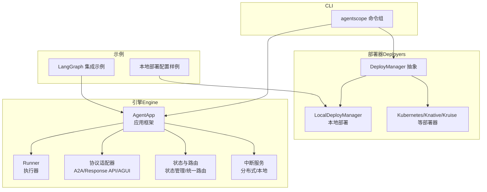
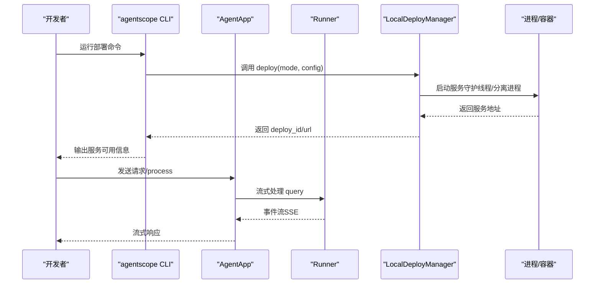
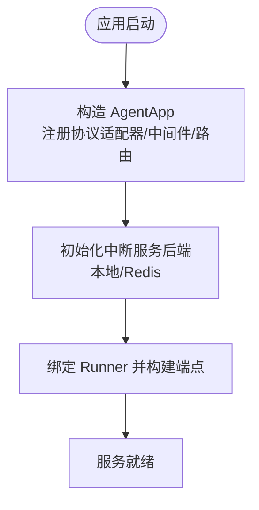
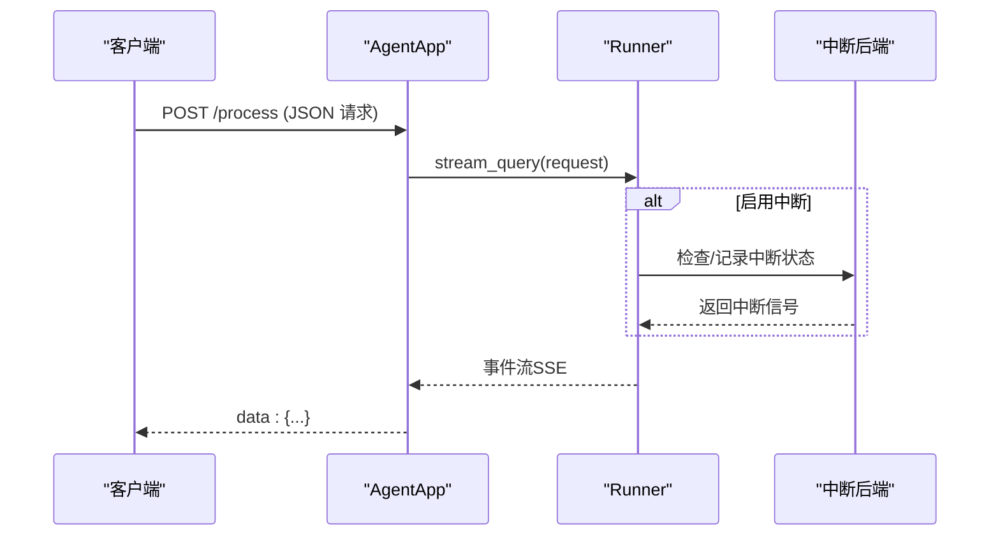
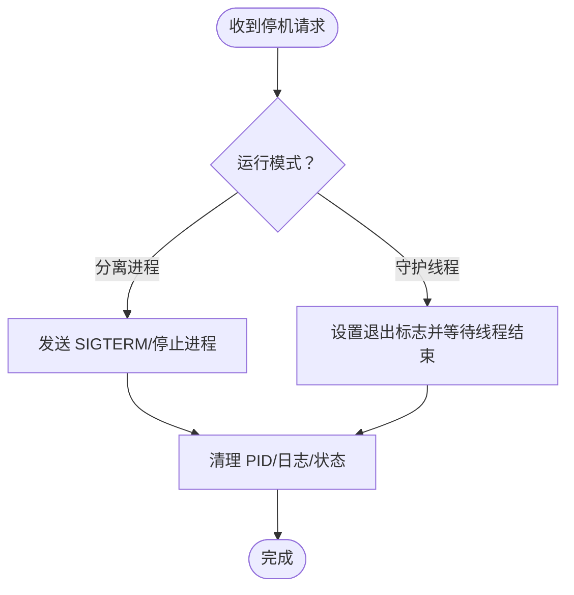
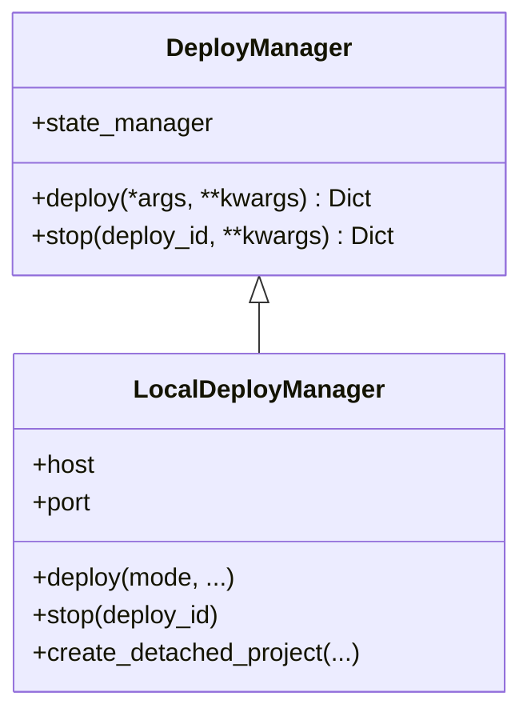
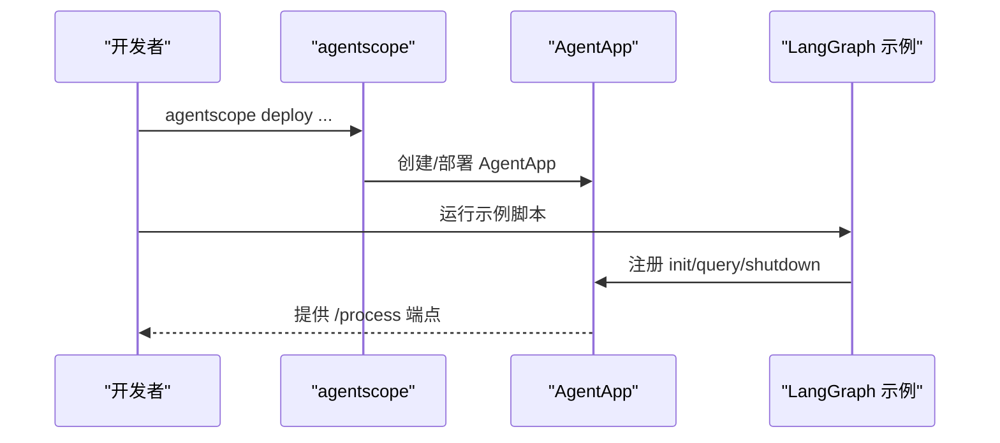
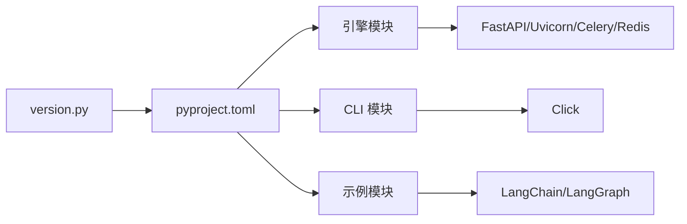

# 开发生命周期

<cite>
**本文引用的文件**
- [README.md](file://README.md)
- [CONTRIBUTING.md](file://CONTRIBUTING.md)
- [pyproject.toml](file://pyproject.toml)
- [src/agentscope_runtime/engine/app/agent_app.py](file://src/agentscope_runtime/engine/app/agent_app.py)
- [src/agentscope_runtime/engine/deployers/local_deployer.py](file://src/agentscope_runtime/engine/deployers/local_deployer.py)
- [src/agentscope_runtime/engine/deployers/base.py](file://src/agentscope_runtime/engine/deployers/base.py)
- [src/agentscope_runtime/cli/cli.py](file://src/agentscope_runtime/cli/cli.py)
- [src/agentscope_runtime/version.py](file://src/agentscope_runtime/version.py)
- [examples/integrations/langgraph/run_langgraph_agent.py](file://examples/integrations/langgraph/run_langgraph_agent.py)
- [examples/deployments/local_deploy_config.yaml](file://examples/deployments/local_deploy_config.yaml)
</cite>

## 目录
1. [简介](#简介)
2. [项目结构](#项目结构)
3. [核心组件](#核心组件)
4. [架构总览](#架构总览)
5. [详细组件分析](#详细组件分析)
6. [依赖关系分析](#依赖关系分析)
7. [性能考量](#性能考量)
8. [故障排查指南](#故障排查指南)
9. [结论](#结论)
10. [附录](#附录)

## 简介
本文件系统化阐述 AgentScope Runtime 智能体应用的开发生命周期管理，覆盖从需求分析、设计实现、测试验证到部署上线的全流程。文档以“三阶段生命周期模式”为主线：初始化（init）、查询（query）、关闭（shutdown），并结合 CLI、引擎（Engine）、部署器（Deployer）与沙箱（Sandbox）等模块，给出可落地的开发规范、代码审查标准、版本控制策略以及 DevOps 实践建议。

## 项目结构
仓库采用按功能域分层的组织方式：
- 引擎（Engine）：提供 AgentApp 应用框架、Runner 执行器、协议适配器、状态管理、任务路由与中断服务等能力
- 部署器（Deployers）：统一抽象本地/云/无服务器部署，支持多模式（守护线程、分离进程）
- CLI：命令行入口，聚合 chat、run、web、deploy、list、status、stop、invoke、sandbox 等子命令
- 示例（examples）：包含 LangGraph 集成示例、本地部署配置样例等
- 文档（cookbook）：英文与中文教程站点，涵盖概念、快速开始、高级部署、工具与沙箱使用指南

图示来源
- [src/agentscope_runtime/engine/app/agent_app.py](file://src/agentscope_runtime/engine/app/agent_app.py)
- [src/agentscope_runtime/engine/deployers/local_deployer.py](file://src/agentscope_runtime/engine/deployers/local_deployer.py)
- [src/agentscope_runtime/engine/deployers/base.py](file://src/agentscope_runtime/engine/deployers/base.py)
- [src/agentscope_runtime/cli/cli.py](file://src/agentscope_runtime/cli/cli.py)
- [examples/integrations/langgraph/run_langgraph_agent.py](file://examples/integrations/langgraph/run_langgraph_agent.py)
- [examples/deployments/local_deploy_config.yaml](file://examples/deployments/local_deploy_config.yaml)

章节来源
- [README.md](file://README.md)
- [pyproject.toml](file://pyproject.toml)

## 核心组件
- AgentApp：基于 FastAPI 的生产级智能体 API 服务，内置协议适配、流式响应、健康检查、进程控制、任务队列与中断服务
- Runner：封装框架无关的查询逻辑，负责消息流式输出与状态持久化
- DeployManager：部署器抽象接口，定义统一的 deploy/stop 能力
- LocalDeployManager：本地多模式部署（守护线程/分离进程），支持打包、进程管理与优雅停机
- CLI：统一入口，提供 chat、run、web、deploy、list、status、stop、invoke、sandbox 等命令
- 协议适配器：自动注入 A2A、Response API、AGUI 等协议的 OpenAPI 组件
- 中断服务：支持本地与 Redis 后端，提供分布式任务中断与恢复

章节来源
- [src/agentscope_runtime/engine/app/agent_app.py](file://src/agentscope_runtime/engine/app/agent_app.py)
- [src/agentscope_runtime/engine/deployers/base.py](file://src/agentscope_runtime/engine/deployers/base.py)
- [src/agentscope_runtime/engine/deployers/local_deployer.py](file://src/agentscope_runtime/engine/deployers/local_deployer.py)
- [src/agentscope_runtime/cli/cli.py](file://src/agentscope_runtime/cli/cli.py)

## 架构总览
AgentApp 将 FastAPI 生命周期与 Runner 查询处理解耦，通过协议适配器扩展多协议端点；LocalDeployManager 支持两种运行模式：
- 守护线程模式：在当前进程中启动 Uvicorn 服务，适合开发调试
- 分离进程模式：打包应用为独立项目并以后台进程方式启动，便于生产环境与 CI/CD

图示来源
- [src/agentscope_runtime/cli/cli.py](file://src/agentscope_runtime/cli/cli.py)
- [src/agentscope_runtime/engine/app/agent_app.py](file://src/agentscope_runtime/engine/app/agent_app.py)
- [src/agentscope_runtime/engine/deployers/local_deployer.py](file://src/agentscope_runtime/engine/deployers/local_deployer.py)

## 详细组件分析

### 初始化阶段（Init）
- 使用 FastAPI 的 lifespan 管理资源生命周期，支持 before_start 钩子
- 在 AgentApp 构造时注册协议适配器与内置路由，初始化中断服务后端
- 可选启用嵌入式 Celery Worker 与流式任务清理工作线程

图示来源
- [src/agentscope_runtime/engine/app/agent_app.py](file://src/agentscope_runtime/engine/app/agent_app.py)

章节来源
- [src/agentscope_runtime/engine/app/agent_app.py](file://src/agentscope_runtime/engine/app/agent_app.py)

### 查询阶段（Query）
- 通过 @agent_app.query(framework=...) 注册查询处理函数，支持多框架（agentscope、autogen、agno、langgraph）
- Runner 负责调用框架特定的推理逻辑，并通过流式生成器返回 SSE 数据块
- 支持任务中断与恢复，结合分布式 Redis 后端实现跨节点一致性

图示来源
- [src/agentscope_runtime/engine/app/agent_app.py](file://src/agentscope_runtime/engine/app/agent_app.py)

章节来源
- [src/agentscope_runtime/engine/app/agent_app.py](file://src/agentscope_runtime/engine/app/agent_app.py)

### 关闭阶段（Shutdown）
- 提供 /shutdown 与 /admin/shutdown 端点触发优雅停机
- LocalDeployManager 支持守护线程与分离进程两种停机路径，分别进行线程/进程清理与 PID 文件清理
- 生命周期钩子 after_finish 在 Runner 清理后执行，确保资源回收

图示来源
- [src/agentscope_runtime/engine/app/agent_app.py](file://src/agentscope_runtime/engine/app/agent_app.py)
- [src/agentscope_runtime/engine/deployers/local_deployer.py](file://src/agentscope_runtime/engine/deployers/local_deployer.py)

章节来源
- [src/agentscope_runtime/engine/app/agent_app.py](file://src/agentscope_runtime/engine/app/agent_app.py)
- [src/agentscope_runtime/engine/deployers/local_deployer.py](file://src/agentscope_runtime/engine/deployers/local_deployer.py)

### 部署器与运行模式
- DeployManager 抽象定义了统一的 deploy/stop 接口
- LocalDeployManager 支持：
  - 守护线程模式：在当前进程内启动 Uvicorn 服务
  - 分离进程模式：打包应用并以后台进程方式启动，支持 PID 文件与日志管理
- 支持通过配置文件指定 host/port、环境变量与入口点

图示来源
- [src/agentscope_runtime/engine/deployers/base.py](file://src/agentscope_runtime/engine/deployers/base.py)
- [src/agentscope_runtime/engine/deployers/local_deployer.py](file://src/agentscope_runtime/engine/deployers/local_deployer.py)

章节来源
- [src/agentscope_runtime/engine/deployers/base.py](file://src/agentscope_runtime/engine/deployers/base.py)
- [src/agentscope_runtime/engine/deployers/local_deployer.py](file://src/agentscope_runtime/engine/deployers/local_deployer.py)
- [examples/deployments/local_deploy_config.yaml](file://examples/deployments/local_deploy_config.yaml)

### CLI 与示例
- CLI 提供统一入口，聚合多个子命令，便于本地开发与部署
- LangGraph 示例展示如何在 AgentApp 中接入第三方框架，演示 init/query/shutdown 的完整生命周期

图示来源
- [src/agentscope_runtime/cli/cli.py](file://src/agentscope_runtime/cli/cli.py)
- [examples/integrations/langgraph/run_langgraph_agent.py](file://examples/integrations/langgraph/run_langgraph_agent.py)

章节来源
- [src/agentscope_runtime/cli/cli.py](file://src/agentscope_runtime/cli/cli.py)
- [examples/integrations/langgraph/run_langgraph_agent.py](file://examples/integrations/langgraph/run_langgraph_agent.py)

## 依赖关系分析
- 版本与元数据：version.py 提供版本号，pyproject.toml 定义依赖与可选扩展
- 引擎依赖：FastAPI、Uvicorn、Celery（可选）、Redis、Docker、Kubernetes 等
- CLI 依赖：Click，注册多个命令组
- 示例依赖：LangChain/LangGraph、OpenAI 兼容模式等

图示来源
- [src/agentscope_runtime/version.py](file://src/agentscope_runtime/version.py)
- [pyproject.toml](file://pyproject.toml)

章节来源
- [src/agentscope_runtime/version.py](file://src/agentscope_runtime/version.py)
- [pyproject.toml](file://pyproject.toml)

## 性能考量
- 流式响应：SSE 输出减少延迟，提升用户体验
- 任务清理：定期清理过期任务，避免内存泄漏
- 中断服务：Redis 后端支持跨节点一致性，降低长任务阻塞风险
- 部署模式：分离进程模式便于水平扩展与资源隔离
- 日志与可观测性：内置健康检查与进程状态端点，便于运维监控

## 故障排查指南
- 启动失败
  - 检查 host/port 是否被占用，必要时调整配置
  - 查看分离进程模式的日志文件定位错误
- 停止失败
  - 守护线程模式不支持 HTTP 停机，需直接调用停止方法
  - 分离进程模式可通过 /shutdown 触发，若失败则使用进程管理器强制停止
- 中断异常
  - 确认 Redis 后端连通性与权限
  - 检查任务队列与超时配置
- 协议适配问题
  - 确认 OpenAPI schema 注入是否成功，核对 A2A/Response API/AGUI 配置

章节来源
- [src/agentscope_runtime/engine/deployers/local_deployer.py](file://src/agentscope_runtime/engine/deployers/local_deployer.py)
- [src/agentscope_runtime/engine/app/agent_app.py](file://src/agentscope_runtime/engine/app/agent_app.py)

## 结论
AgentScope Runtime 通过统一的 AgentApp 生命周期模型与多协议适配，提供了从开发到生产的全链路能力。结合 CLI、部署器与示例工程，团队可以快速搭建安全、可观测、可扩展的智能体服务。建议在实际项目中遵循本文的开发规范与 DevOps 实践，确保质量与稳定性。

## 附录

### 开发规范与代码审查
- 提交前安装并运行 pre-commit 钩子，确保代码风格与安全基线
- 新增功能需配套单元测试与集成测试
- 代码审查关注：生命周期钩子正确性、流式响应完整性、部署器健壮性、错误处理与日志记录

章节来源
- [CONTRIBUTING.md](file://CONTRIBUTING.md)

### 版本控制策略
- 使用语义化版本（MAJOR.MINOR.PATCH），变更记录见 CHANGELOG
- 主分支发布预览版本，稳定版本发布至 PyPI

章节来源
- [src/agentscope_runtime/version.py](file://src/agentscope_runtime/version.py)
- [README.md](file://README.md)

### DevOps 实践
- 持续集成：利用 GitHub Actions 与测试套件保证质量
- 自动化测试：pytest 配置已启用异步模式，建议在 CI 中覆盖关键路径
- 性能监控：结合内置健康检查与进程状态端点，建立告警机制
- 部署策略：优先采用分离进程模式，结合容器编排平台实现弹性伸缩

章节来源
- [README.md](file://README.md)
- [pyproject.toml](file://pyproject.toml)