# 测试策略

<cite>
**本文引用的文件**
- [README.md](file://README.md)
- [CONTRIBUTING.md](file://CONTRIBUTING.md)
- [pyproject.toml](file://pyproject.toml)
- [tests/unit/test_runner_stream.py](file://tests/unit/test_runner_stream.py)
- [tests/deploy/test_local_deployer.py](file://tests/deploy/test_local_deployer.py)
- [tests/integrated/test_agent_app.py](file://tests/integrated/test_agent_app.py)
- [tests/sandbox/test_sandbox.py](file://tests/sandbox/test_sandbox.py)
- [tests/tools/test_generations.py](file://tests/tools/test_generations.py)
- [tests/deploy/test_kubernetes_deployer.py](file://tests/deploy/test_kubernetes_deployer.py)
- [tests/deploy/test_modelstudio_deployer.py](file://tests/deploy/test_modelstudio_deployer.py)
- [tests/tools/test_alipay_payment.py](file://tests/tools/test_alipay_payment.py)
- [tests/tools/test_rag.py](file://tests/tools/test_rag.py)
- [tests/sandbox/test_sandbox_service.py](file://tests/sandbox/test_sandbox_service.py)
</cite>

## 目录
1. [引言](#引言)
2. [项目结构](#项目结构)
3. [核心组件](#核心组件)
4. [架构总览](#架构总览)
5. [详细组件分析](#详细组件分析)
6. [依赖分析](#依赖分析)
7. [性能考虑](#性能考虑)
8. [故障排查指南](#故障排查指南)
9. [结论](#结论)
10. [附录](#附录)

## 引言
本测试策略面向 AgentScope Runtime 项目，旨在建立覆盖单元测试、集成测试与部署测试的完整测试体系，明确测试用例设计原则、Mock 策略、测试数据管理方式，并给出自动化测试流程、覆盖率要求与持续测试实践建议。同时提供性能测试、压力测试与回归测试的专项方法，以及测试工具推荐与测试环境搭建指南。

## 项目结构
项目采用按功能域分层的组织方式，测试目录按“单元测试(unit)/集成测试(integrated)/部署测试(deploy)/沙箱测试(sandbox)/工具测试(tools)”划分，便于定位与扩展测试覆盖面。

- 单元测试：针对独立模块或函数级行为验证（如 Runner、协议适配器、服务工具等）
- 集成测试：端到端场景验证（AgentApp 流式处理、OpenAI 兼容模式、多轮对话）
- 部署测试：本地/云/容器化部署器的可用性与错误路径验证
- 沙箱测试：本地与远程沙箱服务、文件系统操作、心跳与恢复机制
- 工具测试：图像生成/编辑、语音合成/识别、RAG、支付等外部能力

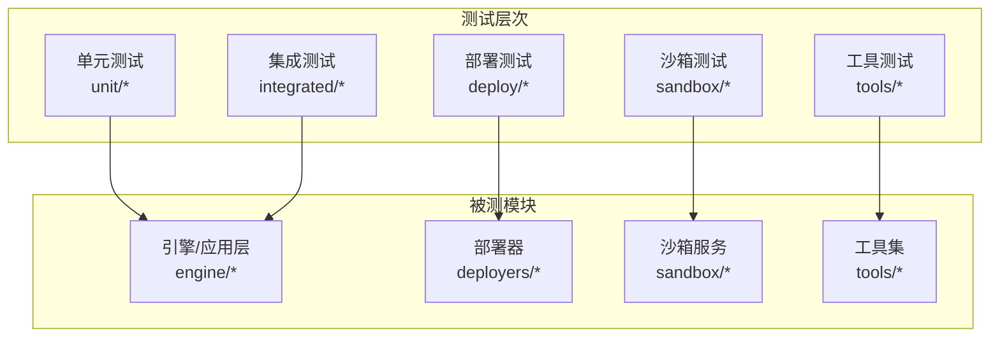

图示来源
- [pyproject.toml:101-104](file://pyproject.toml#L101-L104)
- [tests/unit/test_runner_stream.py:1-78](file://tests/unit/test_runner_stream.py#L1-L78)
- [tests/integrated/test_agent_app.py:1-271](file://tests/integrated/test_agent_app.py#L1-L271)
- [tests/deploy/test_local_deployer.py:1-269](file://tests/deploy/test_local_deployer.py#L1-L269)
- [tests/sandbox/test_sandbox.py:1-536](file://tests/sandbox/test_sandbox.py#L1-L536)
- [tests/tools/test_generations.py:1-800](file://tests/tools/test_generations.py#L1-L800)

章节来源
- [pyproject.toml:101-104](file://pyproject.toml#L101-L104)
- [README.md:109-271](file://README.md#L109-L271)

## 核心组件
- 运行器与流式处理：验证 SimpleRunner/ErrorRunner 的消息流输出与错误返回
- AgentApp 服务：验证 SSE 流式响应、OpenAI 兼容模式、多轮会话状态持久化
- 部署器：本地/云/容器化部署器的创建、停止、错误处理与资源清理
- 沙箱：本地/远程沙箱工具调用、文件系统异步/同步操作、心跳与恢复
- 工具集：图像/视频生成、语音合成/识别、RAG、支付等外部能力的异步提交/轮询

章节来源
- [tests/unit/test_runner_stream.py:1-78](file://tests/unit/test_runner_stream.py#L1-L78)
- [tests/integrated/test_agent_app.py:1-271](file://tests/integrated/test_agent_app.py#L1-L271)
- [tests/deploy/test_local_deployer.py:1-269](file://tests/deploy/test_local_deployer.py#L1-L269)
- [tests/sandbox/test_sandbox.py:1-536](file://tests/sandbox/test_sandbox.py#L1-L536)
- [tests/tools/test_generations.py:1-800](file://tests/tools/test_generations.py#L1-L800)

## 架构总览
下图展示测试金字塔在本项目中的映射关系，自底向上逐步扩大测试范围与复杂度。

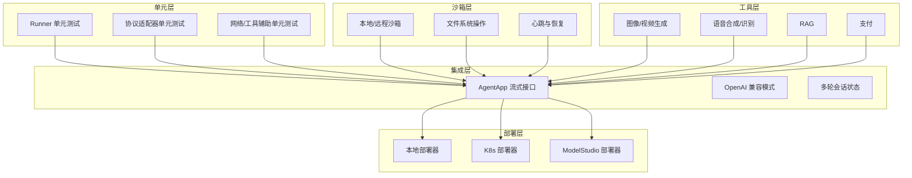

图示来源
- [tests/unit/test_runner_stream.py:1-78](file://tests/unit/test_runner_stream.py#L1-L78)
- [tests/integrated/test_agent_app.py:1-271](file://tests/integrated/test_agent_app.py#L1-L271)
- [tests/deploy/test_local_deployer.py:1-269](file://tests/deploy/test_local_deployer.py#L1-L269)
- [tests/deploy/test_kubernetes_deployer.py:1-441](file://tests/deploy/test_kubernetes_deployer.py#L1-L441)
- [tests/deploy/test_modelstudio_deployer.py:1-211](file://tests/deploy/test_modelstudio_deployer.py#L1-L211)
- [tests/sandbox/test_sandbox.py:1-536](file://tests/sandbox/test_sandbox.py#L1-L536)
- [tests/tools/test_generations.py:1-800](file://tests/tools/test_generations.py#L1-L800)

## 详细组件分析

### 运行器与流式处理（单元测试）
- 目标：验证运行器在正常与异常场景下的消息流输出与最终状态
- 关键点：
  - 使用模型校验构建请求对象，确保输入结构正确
  - 异步遍历流式消息，收集并断言最终文本内容与完成状态
  - 错误运行器断言最终响应为失败状态
- 覆盖维度：消息对象类型、消息状态、最终文本一致性

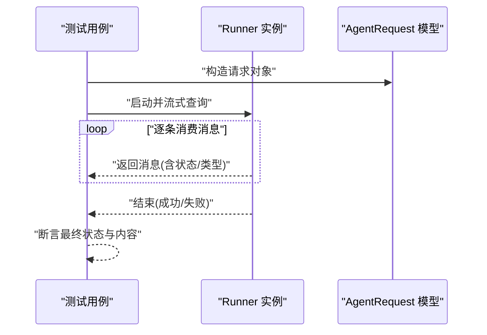

图示来源
- [tests/unit/test_runner_stream.py:14-78](file://tests/unit/test_runner_stream.py#L14-L78)

章节来源
- [tests/unit/test_runner_stream.py:1-78](file://tests/unit/test_runner_stream.py#L1-L78)

### AgentApp 服务（集成测试）
- 目标：验证 AgentApp 的流式处理端点、兼容模式与多轮会话
- 关键点：
  - 启动 AgentApp 并等待端口就绪
  - 通过 SSE 流式接收事件，解析 JSON 并断言包含期望关键词
  - OpenAI 兼容模式断言返回主体包含特定名称
  - 多轮对话断言会话状态在两次请求间保持一致
- 覆盖维度：SSE 协议、兼容模式、会话状态持久化

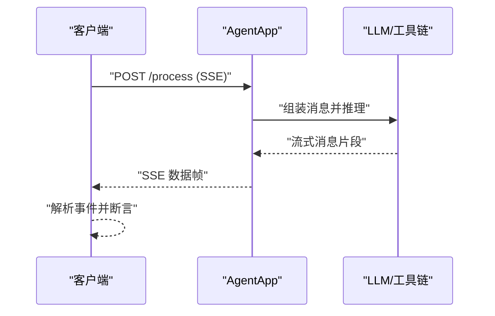

图示来源
- [tests/integrated/test_agent_app.py:25-174](file://tests/integrated/test_agent_app.py#L25-L174)

章节来源
- [tests/integrated/test_agent_app.py:1-271](file://tests/integrated/test_agent_app.py#L1-L271)

### 本地部署器（集成测试）
- 目标：验证本地部署器的生命周期、端点可达性与错误处理
- 关键点：
  - 初始化参数校验、运行状态属性
  - 成功部署后发起 HTTP 请求验证端点
  - 重复部署触发运行中状态异常
  - 启动超时与服务器不可达的错误路径
  - 停止服务的清理与状态复位
- 覆盖维度：部署/停止生命周期、超时控制、并发部署保护

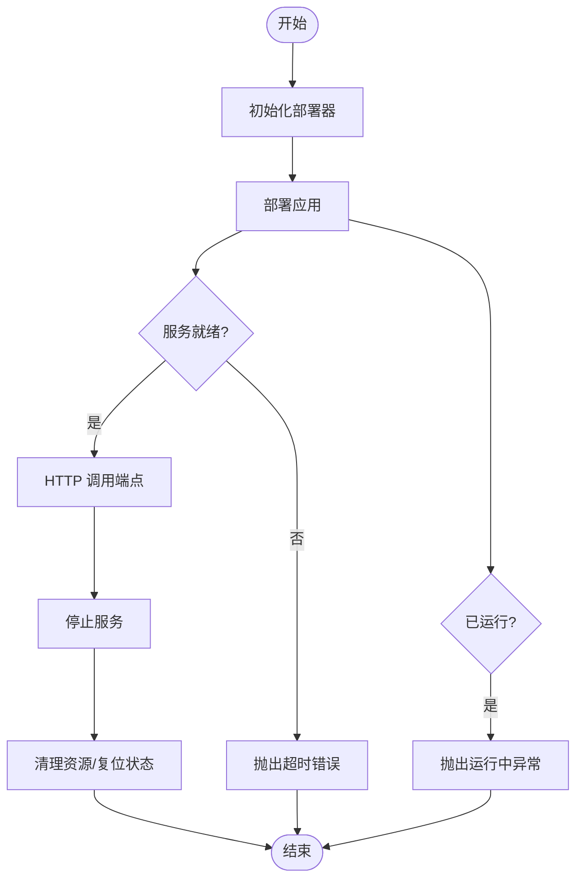

图示来源
- [tests/deploy/test_local_deployer.py:34-265](file://tests/deploy/test_local_deployer.py#L34-L265)

章节来源
- [tests/deploy/test_local_deployer.py:1-269](file://tests/deploy/test_local_deployer.py#L1-L269)

### Kubernetes 部署器（单元测试）
- 目标：验证 K8s 部署器的配置、镜像构建、资源创建与错误处理
- 关键点：
  - K8sConfig/BuildConfig 默认值与自定义值校验
  - 镜像构建失败、K8s 资源创建失败的异常路径
  - 仅传入应用或协议适配器的部署分支
  - 停止部署的异常码处理与返回值
- 覆盖维度：配置模型、镜像构建、资源编排、错误传播

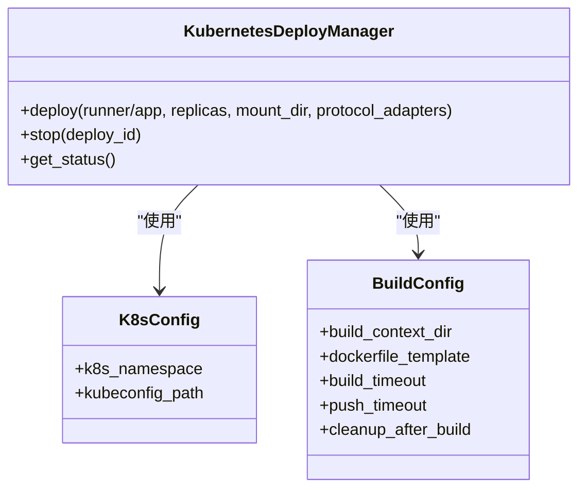

图示来源
- [tests/deploy/test_kubernetes_deployer.py:24-441](file://tests/deploy/test_kubernetes_deployer.py#L24-L441)

章节来源
- [tests/deploy/test_kubernetes_deployer.py:1-441](file://tests/deploy/test_kubernetes_deployer.py#L1-L441)

### ModelStudio 部署器（单元测试）
- 目标：验证打包、生成包装工程与上传/跳过上传的部署流程
- 关键点：
  - 生成包装工程与构建 Wheel 的调用链
  - 上传/不上传两种路径的参数传递
  - 输入校验与异常抛出
- 覆盖维度：打包流程、参数校验、云端交互占位

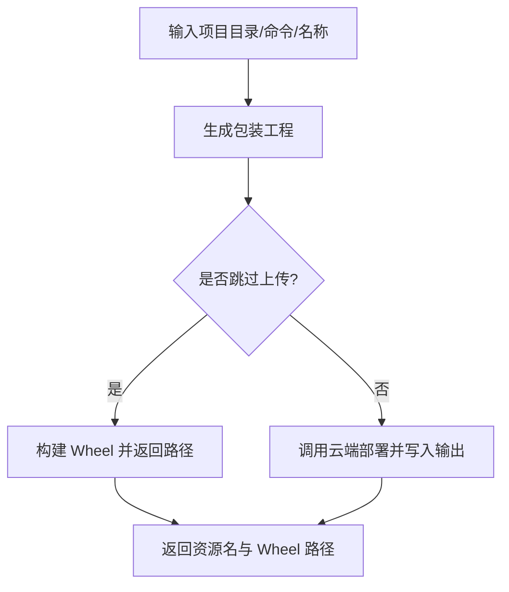

图示来源
- [tests/deploy/test_modelstudio_deployer.py:14-211](file://tests/deploy/test_modelstudio_deployer.py#L14-L211)

章节来源
- [tests/deploy/test_modelstudio_deployer.py:1-211](file://tests/deploy/test_modelstudio_deployer.py#L1-L211)

### 沙箱服务（集成测试）
- 目标：验证沙箱服务的连接、会话隔离与状态继承
- 关键点：
  - 启动/停止服务生命周期
  - 多次连接同一会话可继承变量与状态
  - 断言工具调用结果与错误标志
- 覆盖维度：服务生命周期、会话状态、工具调用

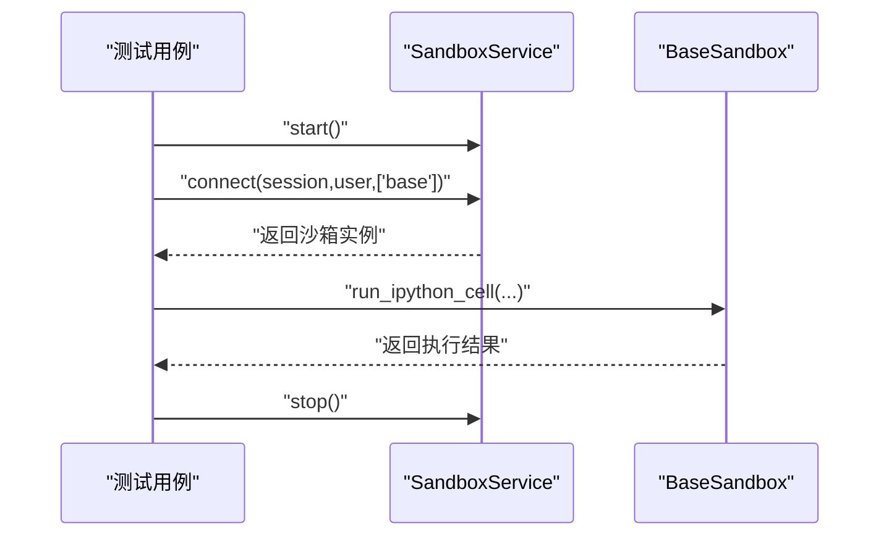

图示来源
- [tests/sandbox/test_sandbox_service.py:17-58](file://tests/sandbox/test_sandbox_service.py#L17-L58)

章节来源
- [tests/sandbox/test_sandbox_service.py:1-67](file://tests/sandbox/test_sandbox_service.py#L1-L67)

### 沙箱工具与文件系统（集成测试）
- 目标：验证本地/远程沙箱工具调用与文件系统异步/同步操作
- 关键点：
  - 本地与远程沙箱健康检查与工具调用
  - 文件系统异步/同步操作：创建、写入、读取、移动、删除、批量写入、从本地路径写入
  - 进程/信号处理与资源清理
- 覆盖维度：工具调用、文件系统操作、进程管理

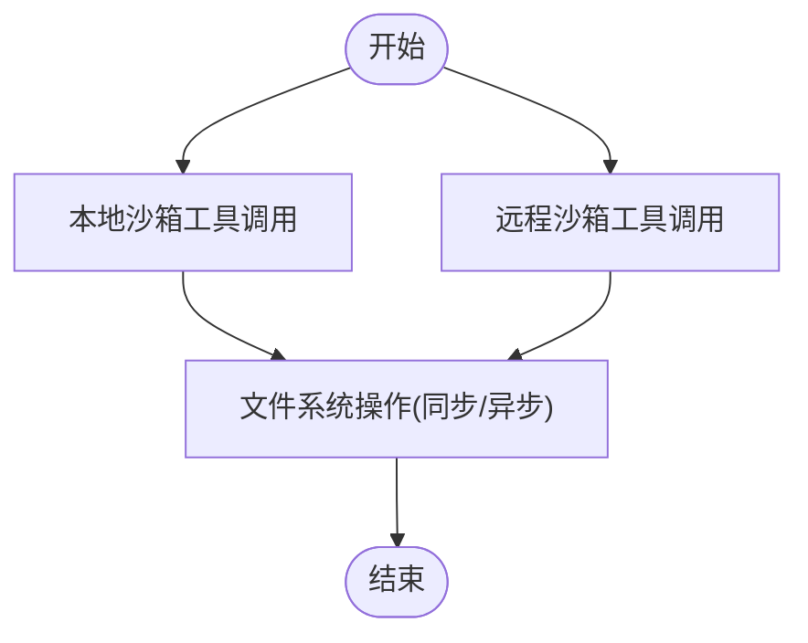

图示来源
- [tests/sandbox/test_sandbox.py:29-536](file://tests/sandbox/test_sandbox.py#L29-L536)

章节来源
- [tests/sandbox/test_sandbox.py:1-536](file://tests/sandbox/test_sandbox.py#L1-L536)

### 工具集（集成测试）
- 图像/视频/语音/搜索/RAG 等工具的异步提交/轮询与结果断言
- 关键点：
  - 异步提交任务并发执行与轮询完成
  - 成功/失败/Canceled 状态判断与断言
  - 环境变量控制长耗时与密钥缺失跳过
- 覆盖维度：异步任务、轮询策略、状态判定

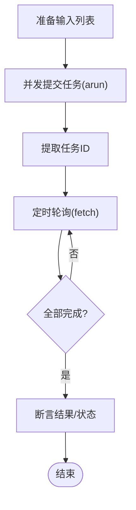

图示来源
- [tests/tools/test_generations.py:72-183](file://tests/tools/test_generations.py#L72-L183)
- [tests/tools/test_rag.py:30-154](file://tests/tools/test_rag.py#L30-L154)

章节来源
- [tests/tools/test_generations.py:1-800](file://tests/tools/test_generations.py#L1-L800)
- [tests/tools/test_rag.py:1-154](file://tests/tools/test_rag.py#L1-L154)

## 依赖分析
- 测试框架与插件：pytest、pytest-asyncio、pytest-mock、pytest-cov
- 开发依赖：fakeredis、aiohttp、sphinx、mermaid 等
- 运行时依赖：FastAPI、Uvicorn、OpenAI SDK、Docker、Redis、Kubernetes 客户端等

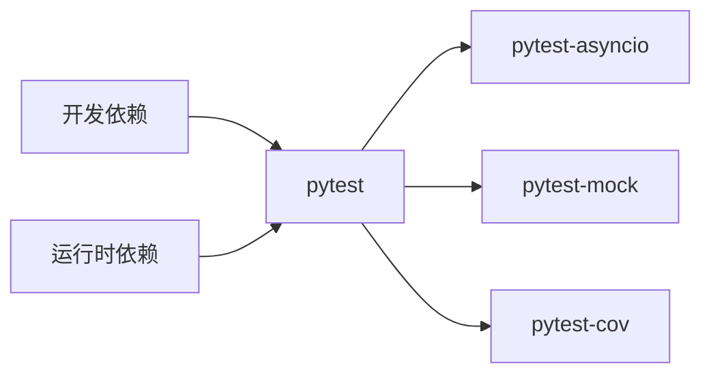

图示来源
- [pyproject.toml:54-100](file://pyproject.toml#L54-L100)

章节来源
- [pyproject.toml:54-100](file://pyproject.toml#L54-L100)

## 性能考虑
- 并发与异步：工具测试广泛使用 asyncio.gather 并发提交任务，应关注轮询间隔与超时设置，避免过度轮询导致资源浪费
- 资源占用：沙箱测试涉及子进程与容器，需确保超时与清理逻辑完备，防止僵尸进程
- 端到端延迟：集成测试中对 SSE 流式响应进行解析，应避免在断言中引入额外阻塞
- 覆盖率：建议在 CI 中启用覆盖率统计，目标覆盖关键路径与错误分支

## 故障排查指南
- 启动超时：本地部署器通过短超时与健康检查模拟超时场景，定位服务就绪逻辑与网络配置
- 重复部署：检测“服务已在运行”的异常，确保幂等部署与状态复位
- K8s 资源异常：通过模拟 ApiException 返回不同状态码，验证错误捕获与返回值
- 沙箱进程清理：跨平台信号处理与强制终止，确保测试结束后无残留进程
- 工具测试跳过：根据环境变量控制长耗时与密钥缺失场景，避免 CI 超时与失败

章节来源
- [tests/deploy/test_local_deployer.py:107-131](file://tests/deploy/test_local_deployer.py#L107-L131)
- [tests/deploy/test_kubernetes_deployer.py:354-382](file://tests/deploy/test_kubernetes_deployer.py#L354-L382)
- [tests/sandbox/test_sandbox.py:165-189](file://tests/sandbox/test_sandbox.py#L165-L189)
- [tests/tools/test_generations.py:58-59](file://tests/tools/test_generations.py#L58-L59)

## 结论
本测试策略以金字塔模型组织测试，单元测试保证模块质量，集成测试覆盖端到端场景，部署与沙箱测试保障生产环境可用性，工具测试验证外部依赖稳定性。通过合理的 Mock 策略、测试数据管理与覆盖率要求，结合自动化与持续测试实践，可显著提升项目质量与交付效率。

## 附录

### 测试用例设计原则
- 单一职责：每个测试聚焦一个行为或边界条件
- 可重复性：使用固定种子与固定输入，避免随机性
- 可维护性：通过 fixture 与共享工具减少重复代码
- 可观测性：断言尽量具体，失败信息清晰

### Mock 策略
- 对外部依赖（K8s、Docker、云端 SDK）使用 unittest.mock 或 pytest-mock
- 对异步外部服务使用 AsyncMock 控制返回值与异常
- 对 Redis 使用 fakeredis 提供内存实现

### 测试数据管理
- 环境变量：通过 .env 加载敏感配置；使用环境变量控制长耗时与密钥缺失跳过
- 固定输入：使用 Pydantic 模型校验输入结构，确保测试稳定
- 临时文件：使用 tmp_path 与临时目录，测试完成后自动清理

### 自动化测试流程与覆盖率
- CI 触发：在 PR 与主干推送时自动运行 pytest
- 并行执行：pytest-xdist 分布式执行，缩短总时间
- 覆盖率：pytest-cov 统计覆盖率，阈值建议不低于 80%
- 报告：生成 HTML 报告与 JUnit XML，便于 CI 查看

### 持续测试实践
- 分层执行：先运行单元测试，再运行集成测试，最后运行部署与沙箱测试
- 条件跳过：根据环境变量与网络状况跳过长耗时或外部依赖测试
- 回归测试：对关键路径与错误分支定期回归，确保修复不引入新问题

### 性能测试与压力测试
- 性能测试：对工具异步提交/轮询路径进行基准测试，记录平均/95 分位耗时
- 压力测试：并发提交大量任务，观察队列积压与错误率变化
- 回归测试：将性能指标纳入 CI，发现回归及时告警

### 测试工具推荐
- 测试框架：pytest + pytest-asyncio
- Mock：pytest-mock
- 覆盖率：pytest-cov
- 文档：sphinx + mermaid
- HTTP 客户端：aiohttp
- 内存缓存：fakeredis

### 测试环境搭建指南
- 安装依赖：pip install -e .[dev]
- 准备 .env：配置 DASHSCOPE_API_KEY 等必要参数
- 运行单测：pytest tests/unit/
- 运行集成测试：pytest tests/integrated/
- 运行部署测试：pytest tests/deploy/
- 运行沙箱测试：pytest tests/sandbox/
- 运行工具测试：pytest tests/tools/